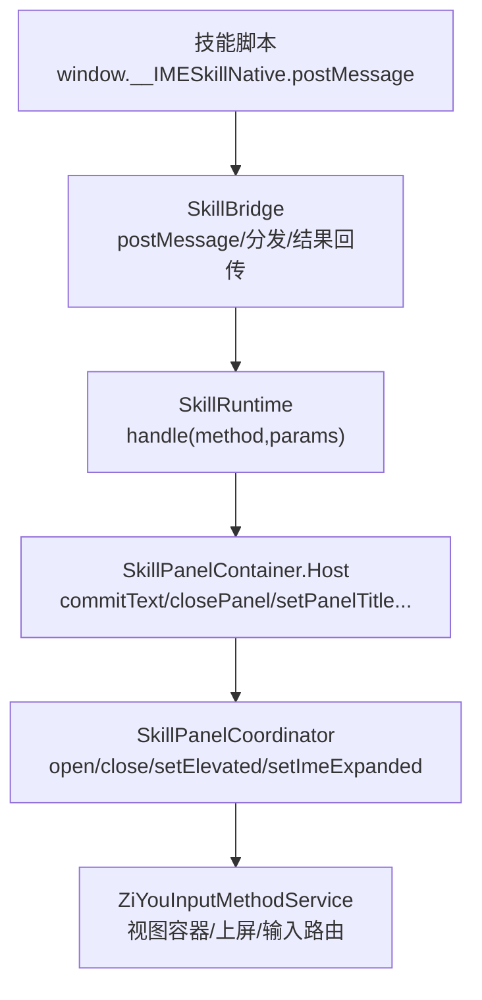
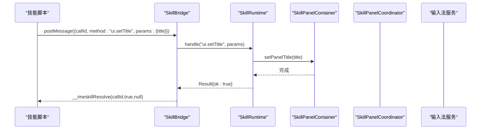
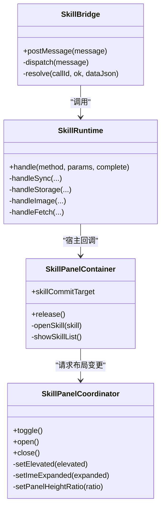

# UI 操作 API

<cite>
**本文引用的文件**
- [SkillBridge.kt](file://app/src/main/java/com/ziyou/ime/skill/SkillBridge.kt)
- [SkillRuntime.kt](file://app/src/main/java/com/ziyou/ime/skill/SkillRuntime.kt)
- [SkillPanelContainer.kt](file://app/src/main/java/com/ziyou/ime/ime/SkillPanelContainer.kt)
- [SkillPanelCoordinator.kt](file://app/src/main/java/com/ziyou/ime/ime/SkillPanelCoordinator.kt)
- [SkillPanelSpec.kt](file://core-logic/src/main/java/com/ziyou/ime/core/skill/SkillPanelSpec.kt)
- [imeskill.js](file://app/src/main/assets/skill_runtime/imeskill.js)
</cite>

## 目录
1. [简介](#简介)
2. [项目结构](#项目结构)
3. [核心组件](#核心组件)
4. [架构总览](#架构总览)
5. [详细组件分析](#详细组件分析)
6. [依赖关系分析](#依赖关系分析)
7. [性能与限制](#性能与限制)
8. [故障排查指南](#故障排查指南)
9. [结论](#结论)
10. [附录：UI.* 方法速查与示例](#附录ui-方法速查与示例)

## 简介
本文件面向技能脚本开发者，系统化说明 ui.* 命名空间下的 UI 操作能力，包括显示/隐藏面板、更新标题、展开/收缩输入法界面、自定义面板高度等。文档同时给出调用时机、参数要求、使用限制、最佳实践以及与宿主输入法的集成注意事项，帮助你在技能中安全、稳定地控制 UI 状态。

## 项目结构
UI 操作能力由“桥接层 + 运行时 + 面板容器 + 协调器”四层协作完成：
- 桥接层（SkillBridge）：将 JS 侧 postMessage 统一路由到运行时，负责线程切换与异常兜底。
- 运行时（SkillRuntime）：实现所有 API（含 ui.*），进行权限校验、参数校验、限额控制与宿主能力调用。
- 面板容器（SkillPanelContainer）：承载技能 WebView、列表与原生角标，管理输入路由与生命周期。
- 协调器（SkillPanelCoordinator）：编排三态布局（键盘叠层/提升挂载/收缩态），处理 IME 窗口可见性与高度守恒。

图表来源
- [SkillBridge.kt:1-99](file://app/src/main/java/com/ziyou/ime/skill/SkillBridge.kt#L1-L99)
- [SkillRuntime.kt:1-521](file://app/src/main/java/com/ziyou/ime/skill/SkillRuntime.kt#L1-L521)
- [SkillPanelContainer.kt:1-389](file://app/src/main/java/com/ziyou/ime/ime/SkillPanelContainer.kt#L1-L389)
- [SkillPanelCoordinator.kt:1-257](file://app/src/main/java/com/ziyou/ime/ime/SkillPanelCoordinator.kt#L1-L257)

章节来源
- [SkillBridge.kt:1-99](file://app/src/main/java/com/ziyou/ime/skill/SkillBridge.kt#L1-L99)
- [SkillRuntime.kt:1-521](file://app/src/main/java/com/ziyou/ime/skill/SkillRuntime.kt#L1-L521)
- [SkillPanelContainer.kt:1-389](file://app/src/main/java/com/ziyou/ime/ime/SkillPanelContainer.kt#L1-L389)
- [SkillPanelCoordinator.kt:1-257](file://app/src/main/java/com/ziyou/ime/ime/SkillPanelCoordinator.kt#L1-L257)

## 核心组件
- SkillBridge：单入口 JS 桥接，统一消息格式 {callId, method, params}，主线程分发，异步 resolve/reject。
- SkillRuntime：API 实现层，包含 ui.*、storage.*、image.*、fetch、clipboard、input.* 等；对每个方法做权限、参数、限额校验。
- SkillPanelContainer：技能面板容器，维护 WebView、列表、原生角标（返回/关闭），提供输入路由与宿主回调。
- SkillPanelCoordinator：面板协调器，负责打开/关闭、提升挂载、收缩态切换与高度计算。

章节来源
- [SkillBridge.kt:1-99](file://app/src/main/java/com/ziyou/ime/skill/SkillBridge.kt#L1-L99)
- [SkillRuntime.kt:1-521](file://app/src/main/java/com/ziyou/ime/skill/SkillRuntime.kt#L1-L521)
- [SkillPanelContainer.kt:1-389](file://app/src/main/java/com/ziyou/ime/ime/SkillPanelContainer.kt#L1-L389)
- [SkillPanelCoordinator.kt:1-257](file://app/src/main/java/com/ziyou/ime/ime/SkillPanelCoordinator.kt#L1-L257)

## 架构总览
下图展示一次 ui.* 调用的端到端流程：JS → Bridge → Runtime → Host → 面板/IME。

图表来源
- [SkillBridge.kt:45-97](file://app/src/main/java/com/ziyou/ime/skill/SkillBridge.kt#L45-L97)
- [SkillRuntime.kt:184-187](file://app/src/main/java/com/ziyou/ime/skill/SkillRuntime.kt#L184-L187)
- [SkillPanelContainer.kt:238-240](file://app/src/main/java/com/ziyou/ime/ime/SkillPanelContainer.kt#L238-L240)

## 详细组件分析

### SkillBridge：JS 桥接与线程模型
- 职责：接收 JS postMessage，解析消息，切主线程分发至 Runtime，统一以 evaluateJavascript 回传结果。
- 安全：最大消息长度限制、释放后拒绝调用、异常全量兜底。
- 线程：WebView 线程收到消息后立即切主线程处理，避免阻塞渲染。

章节来源
- [SkillBridge.kt:1-99](file://app/src/main/java/com/ziyou/ime/skill/SkillBridge.kt#L1-L99)

### SkillRuntime：UI 相关 API 实现
- ui.setTitle：设置面板标题（长度上限钳制）。
- ui.close：关闭技能面板。
- ui.setExpanded：收缩/恢复输入法界面（仅提升挂载生效）。
- ui.setPanelHeight：自定义面板高度比例（已钳制到合法区间）。
- input.requestFocus / input.releaseFocus：接管/释放键盘输入路由（需 needs_input）。
- sendText：发送文本并自动关闭面板（会复位输入路由）。
- haptic：触发震动反馈。
- getContext/getLocale：获取编辑器上下文信息。
- storage.*：本地存储（异步，限流与大小限制）。
- image.*：图片发送/保存（权限校验、PNG 魔数校验、提交路径复用）。
- fetch：网络代理（HTTPS、域名白名单、超时/大小/频控/并发限制）。

章节来源
- [SkillRuntime.kt:159-241](file://app/src/main/java/com/ziyou/ime/skill/SkillRuntime.kt#L159-L241)
- [SkillRuntime.kt:243-332](file://app/src/main/java/com/ziyou/ime/skill/SkillRuntime.kt#L243-L332)
- [SkillRuntime.kt:368-471](file://app/src/main/java/com/ziyou/ime/skill/SkillRuntime.kt#L368-L471)

### SkillPanelContainer：面板容器与输入路由
- 职责：技能列表与 WebView 容器、原生角标（返回/关闭）、输入路由（commitTarget）、宿主回调转发。
- 输入路由：激活时键盘上屏文本注入面板输入框，通过 evalInputJs 调用垫片函数。
- 生命周期：懒创建 WebView，返回列表或关闭面板时销毁，确保内存可控。

章节来源
- [SkillPanelContainer.kt:100-113](file://app/src/main/java/com/ziyou/ime/ime/SkillPanelContainer.kt#L100-L113)
- [SkillPanelContainer.kt:178-206](file://app/src/main/java/com/ziyou/ime/ime/SkillPanelContainer.kt#L178-L206)
- [SkillPanelContainer.kt:232-268](file://app/src/main/java/com/ziyou/ime/ime/SkillPanelContainer.kt#L232-L268)

### SkillPanelCoordinator：三态布局与 IME 可见性
- 三态：键盘叠层（技能列表/普通技能）、提升挂载（needs_input 技能）、收缩态（ui.setExpanded(false)）。
- 高度守恒：收缩态下面板接管键盘+候选区高度，IME 窗口总高不变。
- 挂载切换：根据 needs_input 自动切换，重置高度比例为默认值。

章节来源
- [SkillPanelCoordinator.kt:160-256](file://app/src/main/java/com/ziyou/ime/ime/SkillPanelCoordinator.kt#L160-L256)

### SkillPanelSpec：面板高度规格
- 默认高度比例：0.6（紧凑，下方键盘可用）。
- 最小/最大比例：0.4 ~ 1.2，防止脚本把面板缩没或撑满全屏。
- clampHeightRatio：非有限值回退默认值，其余钳制到合法区间。

章节来源
- [SkillPanelSpec.kt:1-30](file://core-logic/src/main/java/com/ziyou/ime/core/skill/SkillPanelSpec.kt#L1-L30)

## 依赖关系分析
- SkillBridge 依赖 SkillRuntime 与 WebViewProvider。
- SkillRuntime 依赖 SkillPanelContainer.Host（宿主能力）与系统服务（剪贴板、相册等）。
- SkillPanelContainer 依赖 SkillRuntime.Host（面板内能力）与宿主回调（关闭/路由/IME 展开）。
- SkillPanelCoordinator 依赖 ZiYouInputMethodService 提供的容器与上屏出口。

图表来源
- [SkillBridge.kt:1-99](file://app/src/main/java/com/ziyou/ime/skill/SkillBridge.kt#L1-L99)
- [SkillRuntime.kt:1-521](file://app/src/main/java/com/ziyou/ime/skill/SkillRuntime.kt#L1-L521)
- [SkillPanelContainer.kt:1-389](file://app/src/main/java/com/ziyou/ime/ime/SkillPanelContainer.kt#L1-L389)
- [SkillPanelCoordinator.kt:1-257](file://app/src/main/java/com/ziyou/ime/ime/SkillPanelCoordinator.kt#L1-L257)

## 性能与限制
- 消息长度上限：单次 Bridge 消息不超过 512KB，防拖垮主线程。
- 文本上屏长度上限：sendText 单次不超过 5000 字符。
- 面板标题长度上限：20 字符。
- storage 限额：序列化后不超过 1MB。
- fetch 限制：HTTPS 强制、域名白名单、超时 10s、响应 ≤1MB、每分钟 ≤30 次、并发 ≤2、禁止重定向。
- 图片限制：仅接受 PNG（文件头魔数校验），image.send 需编辑器支持富媒体。

章节来源
- [SkillBridge.kt:30-32](file://app/src/main/java/com/ziyou/ime/skill/SkillBridge.kt#L30-L32)
- [SkillRuntime.kt:48-66](file://app/src/main/java/com/ziyou/ime/skill/SkillRuntime.kt#L48-L66)
- [SkillRuntime.kt:497-519](file://app/src/main/java/com/ziyou/ime/skill/SkillRuntime.kt#L497-L519)
- [SkillRuntime.kt:368-471](file://app/src/main/java/com/ziyou/ime/skill/SkillRuntime.kt#L368-L471)

## 故障排查指南
- 常见错误类型：权限拒绝、参数非法、限额超限、未知方法。
- 调试建议：
  - 检查 manifest 是否声明所需权限（如 networkDomains、permissions）。
  - 确认 editorAcceptsImage 返回值，避免 image.send 失败。
  - 在 input.requestFocus 后，如需直接上屏文本，先 releaseFocus 再 sendText。
  - 观察 Toast 提示（悬浮模式不支持技能面板）。
- 日志定位：Bridge 与 Runtime 的异常均会被记录，关注 “Bridge 调用异常”“fetch 失败” 等关键字。

章节来源
- [SkillRuntime.kt:28-28](file://app/src/main/java/com/ziyou/ime/skill/SkillRuntime.kt#L28-L28)
- [SkillBridge.kt:61-86](file://app/src/main/java/com/ziyou/ime/skill/SkillBridge.kt#L61-L86)
- [SkillPanelCoordinator.kt:93-98](file://app/src/main/java/com/ziyou/ime/ime/SkillPanelCoordinator.kt#L93-L98)

## 结论
ui.* 命名空间提供了完整的技能面板控制能力，涵盖标题、显隐、输入法界面展开/收缩与高度定制。通过桥接层与运行时的严格校验与限额控制，确保脚本行为安全可控。结合输入路由与三态布局，技能可在不同场景下获得最佳的交互体验。

## 附录：UI.* 方法速查与示例

### ui.setTitle
- 功能：设置技能面板标题（显示在左上角返回胶囊）。
- 参数：
  - title: string，长度上限 20 字符。
- 调用时机：技能初始化或内容变化时更新标题。
- 使用限制：仅在面板打开时有效；空字符串不改变标题。
- 示例（伪代码）：
  - window.__IMESkillNative.postMessage(JSON.stringify({ callId: 1, method: "ui.setTitle", params: { title: "天气查询" } }))
  - 脚本侧通过 __imeskillResolve 接收结果。

章节来源
- [SkillRuntime.kt:184-187](file://app/src/main/java/com/ziyou/ime/skill/SkillRuntime.kt#L184-L187)
- [SkillPanelContainer.kt:238-240](file://app/src/main/java/com/ziyou/ime/ime/SkillPanelContainer.kt#L238-L240)

### ui.close
- 功能：关闭技能面板。
- 参数：无。
- 调用时机：用户主动退出或任务完成后。
- 使用限制：面板未打开时无效。
- 示例（伪代码）：
  - window.__IMESkillNative.postMessage(JSON.stringify({ callId: 2, method: "ui.close", params: {} }))

章节来源
- [SkillRuntime.kt:189-192](file://app/src/main/java/com/ziyou/ime/skill/SkillRuntime.kt#L189-L192)

### ui.setExpanded
- 功能：收缩/恢复整个输入法界面（键盘、编码区、候选区）。
- 参数：
  - expanded: boolean，true=恢复，false=收缩。
- 调用时机：needs_input 技能在需要独占空间时收缩输入法界面。
- 使用限制：仅提升挂载（needs_input）生效；收缩态下面板接管三者实测高度之和，IME 窗口总高不变。
- 示例（伪代码）：
  - window.__IMESkillNative.postMessage(JSON.stringify({ callId: 3, method: "ui.setExpanded", params: { expanded: false } }))

章节来源
- [SkillRuntime.kt:194-199](file://app/src/main/java/com/ziyou/ime/skill/SkillRuntime.kt#L194-L199)
- [SkillPanelCoordinator.kt:226-255](file://app/src/main/java/com/ziyou/ime/ime/SkillPanelCoordinator.kt#L226-L255)

### ui.setPanelHeight
- 功能：自定义面板高度比例（键盘高度的倍数）。
- 参数：
  - ratio: number，钳制到 [0.4, 1.2]，非有限值回退默认 0.6。
- 调用时机：needs_input 技能打开后调整面板高度。
- 使用限制：仅提升挂载生效；键盘叠层形态面板占满键盘区，比例无意义。
- 示例（伪代码）：
  - window.__IMESkillNative.postMessage(JSON.stringify({ callId: 4, method: "ui.setPanelHeight", params: { ratio: 0.8 } }))

章节来源
- [SkillRuntime.kt:201-208](file://app/src/main/java/com/ziyou/ime/skill/SkillRuntime.kt#L201-L208)
- [SkillPanelSpec.kt:10-29](file://core-logic/src/main/java/com/ziyou/ime/core/skill/SkillPanelSpec.kt#L10-L29)

### input.requestFocus / input.releaseFocus
- 功能：接管/释放键盘输入路由，使键盘上屏文本注入面板输入框。
- 参数：无。
- 调用时机：needs_input 技能需要用户直接在面板输入时使用。
- 使用限制：manifest 必须声明 needs_input；requestFocus 后如需直接上屏文本，应先 releaseFocus。
- 示例（伪代码）：
  - window.__IMESkillNative.postMessage(JSON.stringify({ callId: 5, method: "input.requestFocus", params: {} }))
  - window.__IMESkillNative.postMessage(JSON.stringify({ callId: 6, method: "input.releaseFocus", params: {} }))

章节来源
- [SkillRuntime.kt:226-238](file://app/src/main/java/com/ziyou/ime/skill/SkillRuntime.kt#L226-L238)
- [SkillPanelContainer.kt:100-108](file://app/src/main/java/com/ziyou/ime/ime/SkillPanelContainer.kt#L100-L108)

### sendText（与 UI 交互相关）
- 功能：发送文本并自动关闭面板。
- 参数：
  - text: string，长度上限 5000 字符。
- 调用时机：技能完成输入或选择后提交。
- 使用限制：若输入路由仍激活，会先复位路由，否则文本会被注回面板自身。
- 示例（伪代码）：
  - window.__IMESkillNative.postMessage(JSON.stringify({ callId: 7, method: "sendText", params: { text: "你好" } }))

章节来源
- [SkillRuntime.kt:160-170](file://app/src/main/java/com/ziyou/ime/skill/SkillRuntime.kt#L160-L170)

### haptic（与 UI 交互相关）
- 功能：触发按键震动反馈。
- 参数：无。
- 调用时机：用户交互（点击、选择）时增强反馈。
- 示例（伪代码）：
  - window.__IMESkillNative.postMessage(JSON.stringify({ callId: 8, method: "haptic", params: {} }))

章节来源
- [SkillRuntime.kt:179-182](file://app/src/main/java/com/ziyou/ime/skill/SkillRuntime.kt#L179-L182)

### 动态控制技能面板显示状态的完整流程（示例）
- 目标：打开技能面板 → 设置标题 → 根据需要收缩输入法界面 → 自定义高度 → 用户输入后上屏并关闭。
- 步骤：
  1) 打开面板：调用 open（由宿主触发，非脚本直接调用）。
  2) 设置标题：ui.setTitle。
  3) 收缩输入法界面：ui.setExpanded(false)。
  4) 自定义高度：ui.setPanelHeight({ ratio: 0.8 })。
  5) 接管输入：input.requestFocus。
  6) 用户输入后上屏：input.releaseFocus → sendText。
  7) 关闭面板：ui.close。

章节来源
- [SkillPanelCoordinator.kt:93-106](file://app/src/main/java/com/ziyou/ime/ime/SkillPanelCoordinator.kt#L93-L106)
- [SkillRuntime.kt:184-208](file://app/src/main/java/com/ziyou/ime/skill/SkillRuntime.kt#L184-L208)
- [SkillRuntime.kt:226-238](file://app/src/main/java/com/ziyou/ime/skill/SkillRuntime.kt#L226-L238)

### 与宿主输入法的 UI 集成方式与注意事项
- 集成点：
  - 面板挂载位置由协调器管理（键盘叠层/提升挂载）。
  - 输入路由通过 CommitTarget 将键盘上屏文本注入面板输入框。
  - 图片发送走 commitContent 路径，与涂鸦/AI 面板一致。
- 注意事项：
  - 悬浮模式下技能面板不可用（Toast 提示）。
  - 编辑器是否接受图片需前置检查（editorAcceptsImage）。
  - 收缩态下窗口总高不变，面板接管键盘+候选区高度。
  - 面板角标（返回/关闭）原生绘制且 z 序最高，脚本不可遮盖。

章节来源
- [SkillPanelCoordinator.kt:93-119](file://app/src/main/java/com/ziyou/ime/ime/SkillPanelCoordinator.kt#L93-L119)
- [SkillPanelContainer.kt:135-165](file://app/src/main/java/com/ziyou/ime/ime/SkillPanelContainer.kt#L135-L165)
- [SkillRuntime.kt:293-332](file://app/src/main/java/com/ziyou/ime/skill/SkillRuntime.kt#L293-L332)

### 最佳实践（用户反馈与错误提示）
- 用户反馈：
  - 关键交互（点击、选择）调用 haptic 增强触觉反馈。
  - 长耗时操作（fetch/storage/image）提供进度或加载状态（脚本侧自行实现）。
- 错误提示：
  - 捕获 reject 并提示用户（如权限不足、网络失败、输入框不支持图片）。
  - 避免频繁弹窗，合并错误提示。
- 资源清理：
  - 面板关闭前确保 releaseFocus 与 cancel 未完成的 fetch。
  - 避免在面板释放后继续调用 Bridge。

章节来源
- [SkillRuntime.kt:134-136](file://app/src/main/java/com/ziyou/ime/skill/SkillRuntime.kt#L134-L136)
- [SkillBridge.kt:41-43](file://app/src/main/java/com/ziyou/ime/skill/SkillBridge.kt#L41-L43)