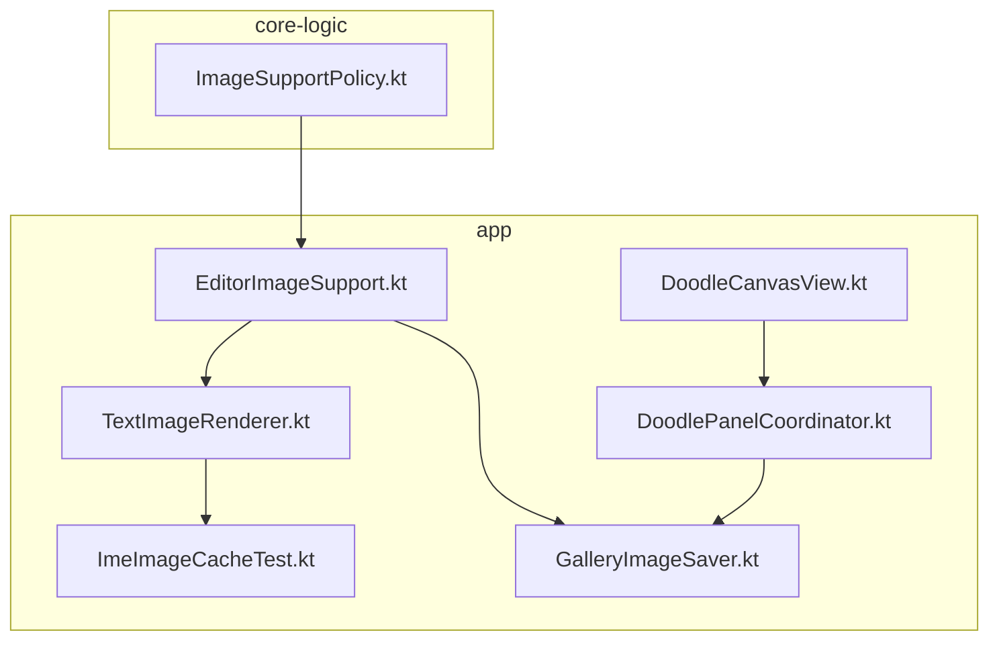
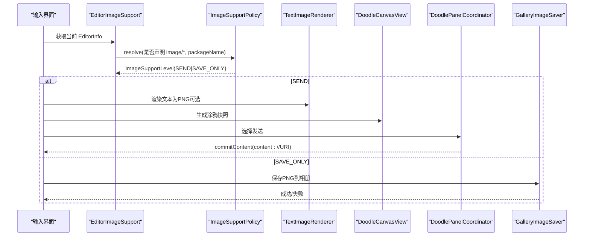
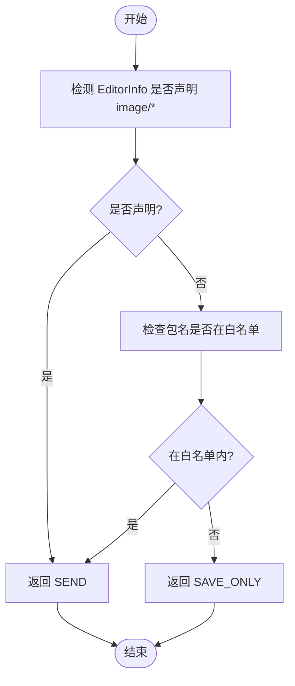
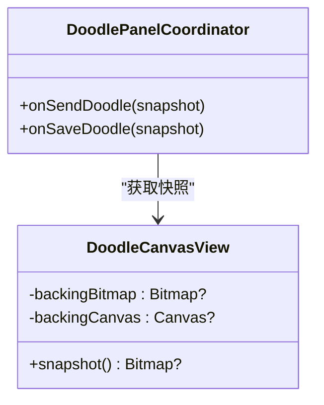
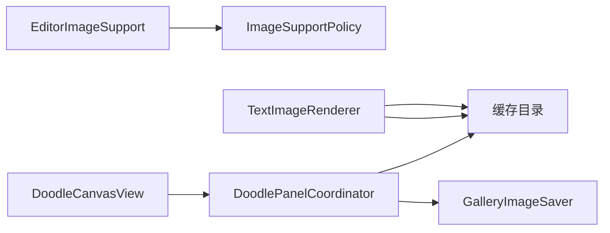

# 图像 API

<cite>
**本文引用的文件**   
- [EditorImageSupport.kt](file://app/src/main/java/com/ziyou/ime/ime/EditorImageSupport.kt)
- [ImageSupportPolicy.kt](file://core-logic/src/main/java/com/ziyou/ime/core/image/ImageSupportPolicy.kt)
- [GalleryImageSaver.kt](file://app/src/main/java/com/ziyou/ime/ime/GalleryImageSaver.kt)
- [TextImageRenderer.kt](file://app/src/main/java/com/ziyou/ime/ime/TextImageRenderer.kt)
- [DoodleCanvasView.kt](file://app/src/main/java/com/ziyou/ime/ime/DoodleCanvasView.kt)
- [DoodlePanelCoordinator.kt](file://app/src/main/java/com/ziyou/ime/ime/DoodlePanelCoordinator.kt)
- [ImeImageCacheTest.kt](file://app/src/test/java/com/ziyou/ime/ime/ImeImageCacheTest.kt)
</cite>

## 目录
1. [简介](#简介)
2. [项目结构](#项目结构)
3. [核心组件](#核心组件)
4. [架构总览](#架构总览)
5. [详细组件分析](#详细组件分析)
6. [依赖关系分析](#依赖关系分析)
7. [性能与内存管理](#性能与内存管理)
8. [权限与安全限制](#权限与安全限制)
9. [使用示例与最佳实践](#使用示例与最佳实践)
10. [故障排查](#故障排查)
11. [结论](#结论)

## 简介
本文件为“图像 API”的权威文档，覆盖 image.* 命名空间下的图片能力判定、发送/保存策略、文本转图渲染、涂鸦截图导出、相册写入以及缓存清理等关键能力。文档面向开发者与产品人员，既提供代码级实现要点，也给出可操作的流程说明与最佳实践。

## 项目结构
图像相关能力主要分布在以下模块与文件：
- core-logic 模块：图片能力策略（白名单与 MIME 判定）
- app 模块：编辑器能力检测、文本转图渲染、涂鸦导出、相册保存、缓存清理测试

图表来源
- [ImageSupportPolicy.kt:1-61](file://core-logic/src/main/java/com/ziyou/ime/core/image/ImageSupportPolicy.kt#L1-L61)
- [EditorImageSupport.kt:1-31](file://app/src/main/java/com/ziyou/ime/ime/EditorImageSupport.kt#L1-L31)
- [TextImageRenderer.kt:1-115](file://app/src/main/java/com/ziyou/ime/ime/TextImageRenderer.kt#L1-L115)
- [GalleryImageSaver.kt:1-64](file://app/src/main/java/com/ziyou/ime/ime/GalleryImageSaver.kt#L1-L64)
- [DoodleCanvasView.kt:1-200](file://app/src/main/java/com/ziyou/ime/ime/DoodleCanvasView.kt#L1-L200)
- [DoodlePanelCoordinator.kt:1-150](file://app/src/main/java/com/ziyou/ime/ime/DoodlePanelCoordinator.kt#L1-L150)
- [ImeImageCacheTest.kt:1-71](file://app/src/test/java/com/ziyou/ime/ime/ImeImageCacheTest.kt#L1-L71)

章节来源
- [ImageSupportPolicy.kt:1-61](file://core-logic/src/main/java/com/ziyou/ime/core/image/ImageSupportPolicy.kt#L1-L61)
- [EditorImageSupport.kt:1-31](file://app/src/main/java/com/ziyou/ime/ime/EditorImageSupport.kt#L1-L31)

## 核心组件
- 图片能力策略（core-logic）
  - ImageSupportLevel：定义 SEND（可直接发送）与 SAVE_ONLY（仅保存到相册）两种级别
  - ImageCapableApp：已验证支持接收图片的应用包名白名单
  - ImageSupportPolicy：根据 EditorInfo 声明的 image/* MIME 或白名单判定最终级别
- 编辑器能力检测（app）
  - EditorImageSupport：基于 EditorInfoCompat.getContentMimeTypes 动态检测 + 白名单兜底
- 文本转图渲染（app）
  - TextImageRenderer：将富文本渲染为固定宽度 PNG 卡片，输出到缓存目录
- 涂鸦导出与面板协调（app）
  - DoodleCanvasView：离屏 Bitmap 缓存、快照导出、内存回收
  - DoodlePanelCoordinator：协调发送/保存动作，回调宿主
- 相册保存（app）
  - GalleryImageSaver：API 29+ 免权限写入系统相册（RELATIVE_PATH + IS_PENDING）
- 缓存清理（app）
  - ImeImageCache.pruneExpired：按 mtime 清理过期文件并保留上限数量（测试覆盖）

章节来源
- [ImageSupportPolicy.kt:1-61](file://core-logic/src/main/java/com/ziyou/ime/core/image/ImageSupportPolicy.kt#L1-L61)
- [EditorImageSupport.kt:1-31](file://app/src/main/java/com/ziyou/ime/ime/EditorImageSupport.kt#L1-L31)
- [TextImageRenderer.kt:1-115](file://app/src/main/java/com/ziyou/ime/ime/TextImageRenderer.kt#L1-L115)
- [DoodleCanvasView.kt:1-200](file://app/src/main/java/com/ziyou/ime/ime/DoodleCanvasView.kt#L1-L200)
- [DoodlePanelCoordinator.kt:1-150](file://app/src/main/java/com/ziyou/ime/ime/DoodlePanelCoordinator.kt#L1-L150)
- [GalleryImageSaver.kt:1-64](file://app/src/main/java/com/ziyou/ime/ime/GalleryImageSaver.kt#L1-L64)
- [ImeImageCacheTest.kt:1-71](file://app/src/test/java/com/ziyou/ime/ime/ImeImageCacheTest.kt#L1-L71)

## 架构总览
下图展示从“编辑器聚焦”到“发送/保存”的完整链路，包括能力判定、渲染/导出、缓存与相册写入。

图表来源
- [EditorImageSupport.kt:1-31](file://app/src/main/java/com/ziyou/ime/ime/EditorImageSupport.kt#L1-L31)
- [ImageSupportPolicy.kt:1-61](file://core-logic/src/main/java/com/ziyou/ime/core/image/ImageSupportPolicy.kt#L1-L61)
- [TextImageRenderer.kt:1-115](file://app/src/main/java/com/ziyou/ime/ime/TextImageRenderer.kt#L1-L115)
- [DoodleCanvasView.kt:1-200](file://app/src/main/java/com/ziyou/ime/ime/DoodleCanvasView.kt#L1-L200)
- [DoodlePanelCoordinator.kt:1-150](file://app/src/main/java/com/ziyou/ime/ime/DoodlePanelCoordinator.kt#L1-L150)
- [GalleryImageSaver.kt:1-64](file://app/src/main/java/com/ziyou/ime/ime/GalleryImageSaver.kt#L1-L64)

## 详细组件分析

### 图片能力判定（ImageSupportPolicy / EditorImageSupport）
- 判定规则
  - 若 EditorInfo 声明了 image/* MIME → SEND
  - 否则检查目标应用包名是否在白名单 → SEND
  - 其他情况 → SAVE_ONLY
- 优势
  - 动态检测为主，兼容各版本；白名单兜底，覆盖未声明但实测可用的场景
  - O(1) 查询白名单，热路径零分配

图表来源
- [ImageSupportPolicy.kt:1-61](file://core-logic/src/main/java/com/ziyou/ime/core/image/ImageSupportPolicy.kt#L1-L61)
- [EditorImageSupport.kt:1-31](file://app/src/main/java/com/ziyou/ime/ime/EditorImageSupport.kt#L1-L31)

章节来源
- [ImageSupportPolicy.kt:1-61](file://core-logic/src/main/java/com/ziyou/ime/core/image/ImageSupportPolicy.kt#L1-L61)
- [EditorImageSupport.kt:1-31](file://app/src/main/java/com/ziyou/ime/ime/EditorImageSupport.kt#L1-L31)

### 文本转图渲染（TextImageRenderer）
- 功能
  - 将 Spanned 富文本渲染为固定宽度的 PNG 卡片，包含主题色条、正文、分隔线与品牌页脚
  - 超长内容自动截断并追加省略号，避免超大 Bitmap
  - 输出到 FileProvider 暴露的缓存目录，便于 commitContent 直接提交
- 关键点
  - 固定像素宽度，保证跨设备一致性
  - 纯 CPU 绘制 + PNG 压缩，需在后台线程执行
  - 渲染前调用缓存清理，避免残留占用

章节来源
- [TextImageRenderer.kt:1-115](file://app/src/main/java/com/ziyou/ime/ime/TextImageRenderer.kt#L1-L115)

### 涂鸦导出与面板协调（DoodleCanvasView / DoodlePanelCoordinator）
- DoodleCanvasView
  - 使用离屏 backing Bitmap 作为视口缓存，提升绘制性能
  - snapshot() 导出当前画面为 Bitmap，内部进行尺寸限制与内存回收
- DoodlePanelCoordinator
  - 统一对外接口：sendDoodleImage(snapshot)、saveDoodleImage(snapshot)
  - 根据能力级别决定走 commitContent 还是相册保存

图表来源
- [DoodleCanvasView.kt:1-200](file://app/src/main/java/com/ziyou/ime/ime/DoodleCanvasView.kt#L1-L200)
- [DoodlePanelCoordinator.kt:1-150](file://app/src/main/java/com/ziyou/ime/ime/DoodlePanelCoordinator.kt#L1-L150)

章节来源
- [DoodleCanvasView.kt:1-200](file://app/src/main/java/com/ziyou/ime/ime/DoodleCanvasView.kt#L1-L200)
- [DoodlePanelCoordinator.kt:1-150](file://app/src/main/java/com/ziyou/ime/ime/DoodlePanelCoordinator.kt#L1-L150)

### 相册保存（GalleryImageSaver）
- 能力
  - API 29+ 通过 MediaStore RELATIVE_PATH + IS_PENDING 免权限写入 Pictures/字由输入法/
  - 写入失败时清理 pending 记录，保证数据一致性
- 限制
  - Android 10 以下需要 WRITE_EXTERNAL_STORAGE 运行时权限，输入法窗口无法发起请求，故 isSupported=false

章节来源
- [GalleryImageSaver.kt:1-64](file://app/src/main/java/com/ziyou/ime/ime/GalleryImageSaver.kt#L1-L64)

### 缓存清理策略（ImeImageCache）
- 策略
  - 按 mtime 清理超过阈值的文件（默认 5 分钟）
  - 爆发式发图时按 mtime 从旧到新补删，保留上限数量（如 20）
  - 目录不存在时安全早返回
- 测试覆盖
  - 过期删除、宽限窗口保留、上限补删、目录缺失安全处理

章节来源
- [ImeImageCacheTest.kt:1-71](file://app/src/test/java/com/ziyou/ime/ime/ImeImageCacheTest.kt#L1-L71)

## 依赖关系分析
- EditorImageSupport 依赖 ImageSupportPolicy 完成能力判定
- TextImageRenderer 输出 PNG 到缓存目录，供 commitContent 使用
- DoodleCanvasView 提供快照，DoodlePanelCoordinator 协调发送/保存
- GalleryImageSaver 负责相册写入
- 缓存清理在渲染与发送前后被调用，确保磁盘与内存健康

图表来源
- [EditorImageSupport.kt:1-31](file://app/src/main/java/com/ziyou/ime/ime/EditorImageSupport.kt#L1-L31)
- [ImageSupportPolicy.kt:1-61](file://core-logic/src/main/java/com/ziyou/ime/core/image/ImageSupportPolicy.kt#L1-L61)
- [TextImageRenderer.kt:1-115](file://app/src/main/java/com/ziyou/ime/ime/TextImageRenderer.kt#L1-L115)
- [DoodleCanvasView.kt:1-200](file://app/src/main/java/com/ziyou/ime/ime/DoodleCanvasView.kt#L1-L200)
- [DoodlePanelCoordinator.kt:1-150](file://app/src/main/java/com/ziyou/ime/ime/DoodlePanelCoordinator.kt#L1-L150)
- [GalleryImageSaver.kt:1-64](file://app/src/main/java/com/ziyou/ime/ime/GalleryImageSaver.kt#L1-L64)

## 性能与内存管理
- 渲染与导出
  - 固定宽度与最大内容高度限制，防止超大 Bitmap 导致 OOM
  - 纯 CPU 绘制 + PNG 压缩，务必在后台线程执行
- 缓存与磁盘
  - 每次渲染前调用 pruneExpired，避免累积
  - 发送后对端异步拉取 URI，清理策略需保留宽限窗口内的新图
- 内存回收
  - 涂鸦视图在释放时回收 backingBitmap，避免泄漏
  - 渲染完成后及时 recycle Bitmap

[本节为通用指导，不直接分析具体文件]

## 权限与安全限制
- 相册写入
  - Android 10+ 免权限（RELATIVE_PATH + IS_PENDING），低于 10 需 WRITE_EXTERNAL_STORAGE，输入法窗口无法申请，因此 isSupported=false
- 发送图片
  - 通过 Commit Content API 提交 content:// URI，无需额外权限
- 白名单机制
  - 针对未声明 image/* 但实测可接收图片的应用，通过包名白名单放行

章节来源
- [GalleryImageSaver.kt:1-64](file://app/src/main/java/com/ziyou/ime/ime/GalleryImageSaver.kt#L1-L64)
- [ImageSupportPolicy.kt:1-61](file://core-logic/src/main/java/com/ziyou/ime/core/image/ImageSupportPolicy.kt#L1-L61)

## 使用示例与最佳实践
- 从相册选择图片
  - 通过系统相册选择器获取图片 URI，转换为 content:// URI 后交由 commitContent 发送（适用于 SEND 能力）
- 实时预览
  - 使用 DoodleCanvasView 的离屏缓存进行实时绘制，snapshot() 获取当前帧用于预览
- 格式转换
  - 使用 TextImageRenderer 将富文本转为 PNG 卡片，再经 commitContent 发送
- 保存到相册
  - 当能力为 SAVE_ONLY 时，调用 GalleryImageSaver.savePng(context, bytes, namePrefix) 写入系统相册
- 最佳实践
  - 始终在后台线程执行渲染与 IO
  - 控制输出尺寸与质量，避免过大 Bitmap
  - 发送前后调用缓存清理，确保磁盘健康
  - 优先使用 commitContent 发送，减少中间文件落盘

[本节为概念性说明，不直接分析具体文件]

## 故障排查
- 发送失败
  - 确认 EditorInfo 是否声明 image/* 或在白名单内
  - 检查 commitContent 是否正确传递 content:// URI
- 保存失败
  - 检查系统版本是否 >= Q，isSupported 是否为 true
  - 查看 MediaStore 写入异常，确认 IS_PENDING 状态更新
- 内存溢出
  - 检查渲染尺寸与最大内容高度限制
  - 确认 Bitmap.recycle() 与 backingBitmap 释放逻辑
- 缓存堆积
  - 确认 pruneExpired 被正确调用
  - 检查 mtime 与阈值配置是否符合预期

章节来源
- [EditorImageSupport.kt:1-31](file://app/src/main/java/com/ziyou/ime/ime/EditorImageSupport.kt#L1-L31)
- [GalleryImageSaver.kt:1-64](file://app/src/main/java/com/ziyou/ime/ime/GalleryImageSaver.kt#L1-L64)
- [TextImageRenderer.kt:1-115](file://app/src/main/java/com/ziyou/ime/ime/TextImageRenderer.kt#L1-L115)
- [DoodleCanvasView.kt:1-200](file://app/src/main/java/com/ziyou/ime/ime/DoodleCanvasView.kt#L1-L200)
- [ImeImageCacheTest.kt:1-71](file://app/src/test/java/com/ziyou/ime/ime/ImeImageCacheTest.kt#L1-L71)

## 结论
image.* 命名空间围绕“能力判定—渲染/导出—发送/保存—缓存清理”形成闭环。通过动态 MIME 检测与白名单兜底，兼顾兼容性与可用性；通过固定尺寸渲染与严格的内存回收策略，保障稳定性；通过 MediaStore 免权限写入与 commitContent 发送，简化权限模型。建议在实际使用中遵循后台线程、尺寸控制与缓存清理的最佳实践，以获得稳定高效的图像处理体验。