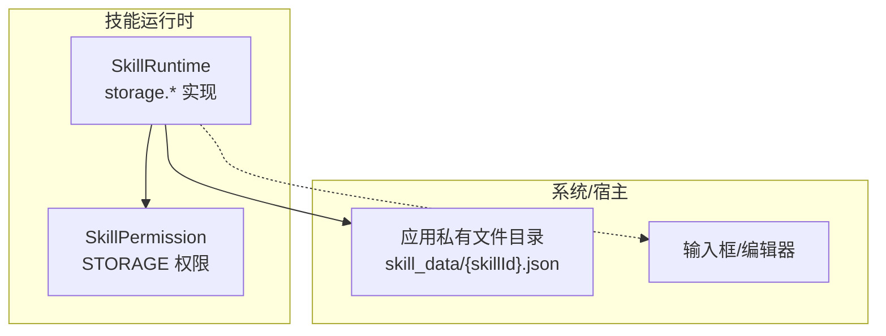
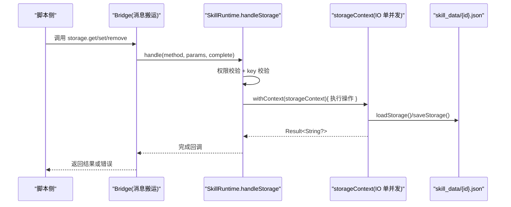
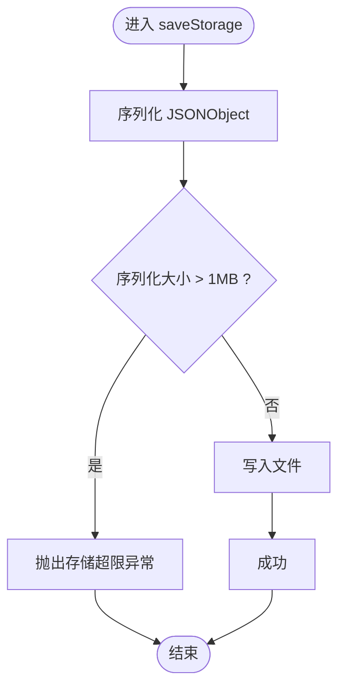
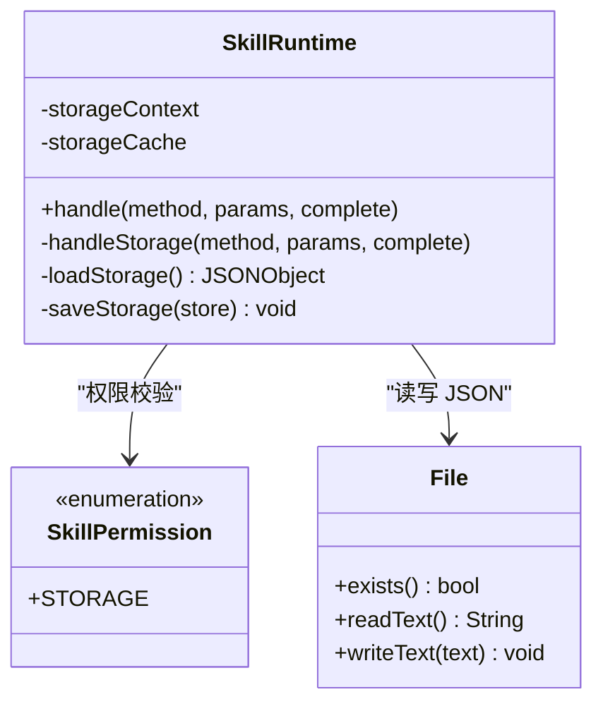

# 存储 API

<cite>
**本文引用的文件**   
- [SkillRuntime.kt](file://app/src/main/java/com/ziyou/ime/skill/SkillRuntime.kt)
- [SkillPermission.kt](file://core-logic/src/main/java/com/ziyou/ime/core/skill/SkillPermission.kt)
- [GalleryImageSaver.kt](file://app/src/main/java/com/ziyou/ime/ime/GalleryImageSaver.kt)
</cite>

## 目录
1. [简介](#简介)
2. [项目结构](#项目结构)
3. [核心组件](#核心组件)
4. [架构总览](#架构总览)
5. [详细组件分析](#详细组件分析)
6. [依赖关系分析](#依赖关系分析)
7. [性能考量](#性能考量)
8. [故障排查指南](#故障排查指南)
9. [结论](#结论)
10. [附录：API 参考与示例](#附录api-参考与示例)

## 简介
本文件为“技能插件”运行时的 storage.* 命名空间 API 的详细文档，覆盖本地键值对存取、数据持久化、配额限制、数据安全与访问权限、生命周期管理与清理策略，以及性能优化建议与最佳实践。storage.* 能力由 SkillRuntime 统一实现，并通过权限模型进行访问控制。

## 项目结构
storage.* 相关逻辑集中在技能运行时模块中，并与权限定义和相册写入工具协同工作：
- SkillRuntime：提供 storage.get/set/remove 等方法的实现、配额校验、并发与顺序保证、缓存与磁盘读写。
- SkillPermission：定义 STORAGE 权限标识，用于 manifest 声明与运行时校验。
- GalleryImageSaver：与 storage 无直接耦合，但作为图片输出能力的共享实现，体现应用内资源管理的一致性。

图表来源
- [SkillRuntime.kt:40-131](file://app/src/main/java/com/ziyou/ime/skill/SkillRuntime.kt#L40-L131)
- [SkillPermission.kt:10-20](file://core-logic/src/main/java/com/ziyou/ime/core/skill/SkillPermission.kt#L10-L20)

章节来源
- [SkillRuntime.kt:40-131](file://app/src/main/java/com/ziyou/ime/skill/SkillRuntime.kt#L40-L131)
- [SkillPermission.kt:10-20](file://core-logic/src/main/java/com/ziyou/ime/core/skill/SkillPermission.kt#L10-L20)

## 核心组件
- 存储配额限制
  - 单技能序列化后最大 1MB（字节数），超出即拒绝写入。
- 数据存储位置
  - 每个技能一个 JSON 文件，路径位于应用私有目录 skill_data/{safeId}.json。
- 并发与顺序
  - storageContext 使用单并发 IO 调度器，确保 set/remove 提交顺序与一致性。
- 内存缓存
  - 运行时维护 JSONObject 缓存，减少重复读取开销。
- 权限控制
  - 调用 storage.* 前需具备 STORAGE 权限，否则抛出权限拒绝异常。
- 错误处理
  - 参数校验失败、权限不足、IO 异常均会返回明确的错误信息。

章节来源
- [SkillRuntime.kt:48-77](file://app/src/main/java/com/ziyou/ime/skill/SkillRuntime.kt#L48-L77)
- [SkillRuntime.kt:119-131](file://app/src/main/java/com/ziyou/ime/skill/SkillRuntime.kt#L119-L131)
- [SkillRuntime.kt:250-284](file://app/src/main/java/com/ziyou/ime/skill/SkillRuntime.kt#L250-L284)
- [SkillRuntime.kt:497-519](file://app/src/main/java/com/ziyou/ime/skill/SkillRuntime.kt#L497-L519)
- [SkillPermission.kt:17-18](file://core-logic/src/main/java/com/ziyou/ime/core/skill/SkillPermission.kt#L17-L18)

## 架构总览
storage.* 方法通过 handleStorage 统一入口分发到 get/set/remove 分支，所有磁盘 I/O 在单并发 IO 协程中串行执行，结果异步回调至主线程。

图表来源
- [SkillRuntime.kt:250-284](file://app/src/main/java/com/ziyou/ime/skill/SkillRuntime.kt#L250-L284)
- [SkillRuntime.kt:497-519](file://app/src/main/java/com/ziyou/ime/skill/SkillRuntime.kt#L497-L519)

## 详细组件分析

### storage.get
- 功能：读取指定 key 的值，若不存在返回 null。
- 行为细节：
  - 先校验 STORAGE 权限与 key 非空。
  - 从内存缓存加载 JSONObject，若未命中则从磁盘读取并缓存。
  - 返回值为字符串化的 JSON 值或 "null"。
- 复杂度：
  - 首次读取 O(n) 解析 JSON；后续读取 O(1)。
- 注意事项：
  - 值类型应为可序列化为 JSON 的简单类型（字符串、数字、布尔、对象、数组）。
  - 大对象会增加序列化/反序列化开销。

章节来源
- [SkillRuntime.kt:262-265](file://app/src/main/java/com/ziyou/ime/skill/SkillRuntime.kt#L262-L265)
- [SkillRuntime.kt:497-507](file://app/src/main/java/com/ziyou/ime/skill/SkillRuntime.kt#L497-L507)

### storage.set
- 功能：将 key-value 写入当前技能的存储空间。
- 行为细节：
  - 校验权限与 key 非空。
  - 从缓存加载 store，put(key, value)，再保存。
  - 保存时检查序列化后大小是否超过 1MB 上限。
- 复杂度：
  - 写入 O(n) 序列化与写盘。
- 注意事项：
  - 多次 set 会合并到同一份 JSON 文件中，避免频繁碎片化。
  - 超大值会导致写入失败，应拆分或压缩。

章节来源
- [SkillRuntime.kt:266-271](file://app/src/main/java/com/ziyou/ime/skill/SkillRuntime.kt#L266-L271)
- [SkillRuntime.kt:509-519](file://app/src/main/java/com/ziyou/ime/skill/SkillRuntime.kt#L509-L519)

### storage.remove
- 功能：删除指定 key。
- 行为细节：
  - 校验权限与 key 非空。
  - 从缓存加载 store，remove(key)，再保存。
- 复杂度：
  - 删除 O(1) 哈希表操作 + O(n) 序列化写盘。
- 注意事项：
  - 删除后不会立即缩小文件大小，需等待下次完整序列化。

章节来源
- [SkillRuntime.kt:272-277](file://app/src/main/java/com/ziyou/ime/skill/SkillRuntime.kt#L272-L277)
- [SkillRuntime.kt:509-519](file://app/src/main/java/com/ziyou/ime/skill/SkillRuntime.kt#L509-L519)

### 存储配额与校验流程

图表来源
- [SkillRuntime.kt:509-519](file://app/src/main/java/com/ziyou/ime/skill/SkillRuntime.kt#L509-L519)

### 权限与错误处理
- 权限：
  - 所有 storage.* 方法均需 STORAGE 权限，否则抛出权限拒绝异常。
- 常见错误：
  - key 为空：参数校验失败。
  - 存储超限：序列化后超过 1MB。
  - 存储写入失败：磁盘不可用或权限问题。
  - 未知方法：传入不支持的方法名。

章节来源
- [SkillRuntime.kt:251-257](file://app/src/main/java/com/ziyou/ime/skill/SkillRuntime.kt#L251-L257)
- [SkillRuntime.kt:485-495](file://app/src/main/java/com/ziyou/ime/skill/SkillRuntime.kt#L485-L495)
- [SkillRuntime.kt:509-519](file://app/src/main/java/com/ziyou/ime/skill/SkillRuntime.kt#L509-L519)

### 生命周期管理与清理策略
- 文件路径：
  - 每个技能对应 skill_data/{safeId}.json，safeId 为去非法字符后的 ID。
- 卸载清理：
  - 卸载技能时调用 deleteStorage 删除对应文件，避免残留。
- 缓存失效：
  - 运行时持有内存缓存，进程退出后自然释放；重启后重新加载。

章节来源
- [SkillRuntime.kt:68-76](file://app/src/main/java/com/ziyou/ime/skill/SkillRuntime.kt#L68-L76)
- [SkillRuntime.kt:129-131](file://app/src/main/java/com/ziyou/ime/skill/SkillRuntime.kt#L129-L131)

## 依赖关系分析
- SkillRuntime 依赖：
  - SkillPermission：用于权限校验。
  - Android Context：用于获取应用私有目录与文件系统。
  - kotlinx.coroutines：用于并发与顺序保证。
- 外部交互：
  - 文件系统：读写 JSON 文件。
  - 宿主接口：与 image/fetch 等其他能力共用 Host 抽象（storage 不直接使用）。

图表来源
- [SkillRuntime.kt:40-131](file://app/src/main/java/com/ziyou/ime/skill/SkillRuntime.kt#L40-L131)
- [SkillPermission.kt:10-20](file://core-logic/src/main/java/com/ziyou/ime/core/skill/SkillPermission.kt#L10-L20)

章节来源
- [SkillRuntime.kt:40-131](file://app/src/main/java/com/ziyou/ime/skill/SkillRuntime.kt#L40-L131)
- [SkillPermission.kt:10-20](file://core-logic/src/main/java/com/ziyou/ime/core/skill/SkillPermission.kt#L10-L20)

## 性能考量
- 并发与顺序
  - 使用单并发 IO 调度器，避免竞态条件，保证 set/remove 的顺序性。
- 内存缓存
  - 运行时缓存 JSONObject，减少重复读取与解析开销。
- 序列化成本
  - 大对象序列化成本高，建议拆分小键值或使用压缩。
- I/O 路径
  - 写入应用私有目录，避免跨进程同步开销。
- 建议
  - 批量更新时合并多次 set 为一次大对象写入。
  - 避免在高频路径中进行大对象读写。

章节来源
- [SkillRuntime.kt:119-131](file://app/src/main/java/com/ziyou/ime/skill/SkillRuntime.kt#L119-L131)
- [SkillRuntime.kt:497-519](file://app/src/main/java/com/ziyou/ime/skill/SkillRuntime.kt#L497-L519)

## 故障排查指南
- 权限拒绝
  - 确认 manifest 已声明 STORAGE 权限。
- key 为空
  - 检查调用方是否正确传递 key。
- 存储超限
  - 检查序列化后大小是否超过 1MB，考虑拆分或压缩。
- 存储写入失败
  - 检查磁盘可用性与应用私有目录权限。
- 未知方法
  - 确认调用的是 storage.get/set/remove。

章节来源
- [SkillRuntime.kt:251-257](file://app/src/main/java/com/ziyou/ime/skill/SkillRuntime.kt#L251-L257)
- [SkillRuntime.kt:485-495](file://app/src/main/java/com/ziyou/ime/skill/SkillRuntime.kt#L485-L495)
- [SkillRuntime.kt:509-519](file://app/src/main/java/com/ziyou/ime/skill/SkillRuntime.kt#L509-L519)

## 结论
storage.* 提供了安全、可控、高性能的轻量级 KV 持久化能力，适用于技能插件的本地配置与状态缓存。通过权限模型、配额限制与单并发 I/O，确保了数据一致性与安全性。遵循最佳实践可有效提升性能与稳定性。

## 附录：API 参考与示例

### API 列表
- storage.get
  - 入参：key（必填）
  - 返回值：字符串化的 JSON 值或 "null"
- storage.set
  - 入参：key（必填）、value（任意可 JSON 序列化类型）
  - 返回值：无
- storage.remove
  - 入参：key（必填）
  - 返回值：无

### 权限要求
- 需要 STORAGE 权限（manifest 中声明）

### 数据模型
- 存储格式：JSON 对象，键为字符串，值为 JSON 支持类型
- 配额：序列化后不超过 1MB

### 示例（概念性说明）
- 设置键值
  - 调用 storage.set，传入 key 与 value，内部会合并到 JSON 对象并持久化。
- 读取键值
  - 调用 storage.get，若存在返回字符串化的值，否则返回 "null"。
- 删除键值
  - 调用 storage.remove，从 JSON 对象移除键并持久化。

### 生命周期与清理
- 卸载技能时自动删除对应 JSON 文件，避免残留。
- 运行时内存缓存随进程生命周期管理。

章节来源
- [SkillRuntime.kt:250-284](file://app/src/main/java/com/ziyou/ime/skill/SkillRuntime.kt#L250-L284)
- [SkillRuntime.kt:497-519](file://app/src/main/java/com/ziyou/ime/skill/SkillRuntime.kt#L497-L519)
- [SkillPermission.kt:17-18](file://core-logic/src/main/java/com/ziyou/ime/core/skill/SkillPermission.kt#L17-L18)