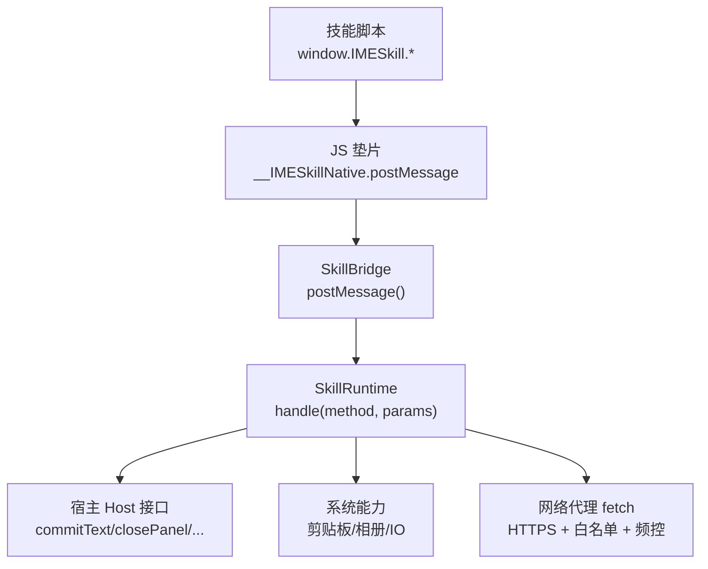
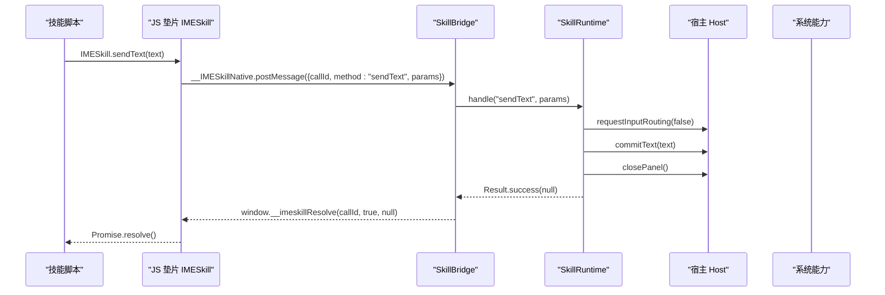
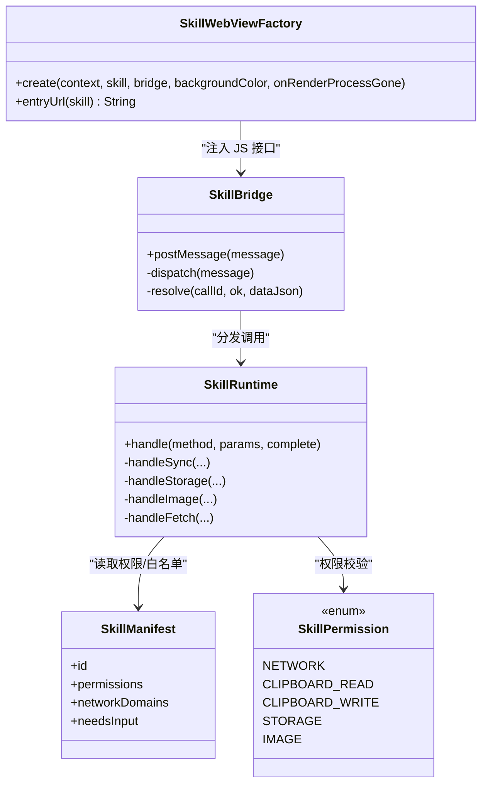

# 核心 API

<cite>
**本文引用的文件**   
- [app/src/main/assets/skill_runtime/imeskill.js](file://app/src/main/assets/skill_runtime/imeskill.js)
- [app/src/main/java/com/ziyou/ime/skill/SkillBridge.kt](file://app/src/main/java/com/ziyou/ime/skill/SkillBridge.kt)
- [app/src/main/java/com/ziyou/ime/skill/SkillRuntime.kt](file://app/src/main/java/com/ziyou/ime/skill/SkillRuntime.kt)
- [app/src/main/java/com/ziyou/ime/skill/SkillWebViewFactory.kt](file://app/src/main/java/com/ziyou/ime/skill/SkillWebViewFactory.kt)
- [core-logic/src/main/java/com/ziyou/ime/core/skill/SkillManifest.kt](file://core-logic/src/main/java/com/ziyou/ime/core/skill/SkillManifest.kt)
- [core-logic/src/main/java/com/ziyou/ime/core/skill/SkillPermission.kt](file://core-logic/src/main/java/com/ziyou/ime/core/skill/SkillPermission.kt)
- [skills-dev/com.user.constellation/script.js](file://skills-dev/com.user.constellation/script.js)
- [skills-dev/com.user.constellation/manifest.json](file://skills-dev/com.user.constellation/manifest.json)
</cite>

## 目录
1. [简介](#简介)
2. [项目结构与运行入口](#项目结构与运行入口)
3. [核心组件总览](#核心组件总览)
4. [架构概览](#架构概览)
5. [详细 API 说明与示例](#详细-api-说明与示例)
6. [依赖关系分析](#依赖关系分析)
7. [性能与线程模型](#性能与线程模型)
8. [故障排查与错误处理](#故障排查与错误处理)
9. [结论与最佳实践](#结论与最佳实践)

## 简介
本文件面向 IMESkill 技能插件开发者，系统性梳理并文档化 IMESkill 核心 API，重点覆盖 sendText、getContext、getLocale 等基础方法的使用方式、参数格式、返回值类型与错误处理机制。同时给出在技能脚本中调用这些能力的完整示例，解释线程模型与异步处理（Promise）机制，并提供常见场景的最佳实践与性能优化建议。

## 项目结构与运行入口
- 技能运行时由 WebView 承载，宿主通过 SkillWebViewFactory 创建安全的 WebView，注入垫片脚本 imeskill.js，暴露 JS Bridge 单入口 __IMESkillNative.postMessage。
- 技能脚本通过 window.IMESkill.* 调用能力，所有调用返回 Promise；宿主经 evaluateJavascript 回调 window.__imeskillResolve 完成异步结果回传。
- 业务实现集中在 SkillRuntime，负责权限校验、参数校验、存储限额、网络代理、输入路由、图片输出等。

图表来源
- [app/src/main/assets/skill_runtime/imeskill.js:30-43](file://app/src/main/assets/skill_runtime/imeskill.js#L30-L43)
- [app/src/main/java/com/ziyou/ime/skill/SkillBridge.kt:45-98](file://app/src/main/java/com/ziyou/ime/skill/SkillBridge.kt#L45-L98)
- [app/src/main/java/com/ziyou/ime/skill/SkillRuntime.kt:142-157](file://app/src/main/java/com/ziyou/ime/skill/SkillRuntime.kt#L142-L157)

章节来源
- [app/src/main/java/com/ziyou/ime/skill/SkillWebViewFactory.kt:60-158](file://app/src/main/java/com/ziyou/ime/skill/SkillWebViewFactory.kt#L60-L158)
- [app/src/main/assets/skill_runtime/imeskill.js:1-164](file://app/src/main/assets/skill_runtime/imeskill.js#L1-L164)

## 核心组件总览
- SkillWebViewFactory：安全 WebView 工厂，资源拦截、CSP、垫片注入、渲染崩溃兜底。
- SkillBridge：JS 桥接层，统一 postMessage 入口，主线程分发，异常兜底，结果回传。
- SkillRuntime：API 实现层，权限检查、参数校验、storage/fetch/image 等能力，协程调度。
- SkillManifest / SkillPermission：技能元数据与权限模型，决定能力可用性与限制。

章节来源
- [app/src/main/java/com/ziyou/ime/skill/SkillWebViewFactory.kt:1-205](file://app/src/main/java/com/ziyou/ime/skill/SkillWebViewFactory.kt#L1-L205)
- [app/src/main/java/com/ziyou/ime/skill/SkillBridge.kt:1-99](file://app/src/main/java/com/ziyou/ime/skill/SkillBridge.kt#L1-L99)
- [app/src/main/java/com/ziyou/ime/skill/SkillRuntime.kt:1-521](file://app/src/main/java/com/ziyou/ime/skill/SkillRuntime.kt#L1-L521)
- [core-logic/src/main/java/com/ziyou/ime/core/skill/SkillManifest.kt:1-51](file://core-logic/src/main/java/com/ziyou/ime/core/skill/SkillManifest.kt#L1-L51)
- [core-logic/src/main/java/com/ziyou/ime/core/skill/SkillPermission.kt:1-27](file://core-logic/src/main/java/com/ziyou/ime/core/skill/SkillPermission.kt#L1-L27)

## 架构概览
下图展示了从技能脚本到宿主能力的调用链路与关键约束（权限、白名单、限额）。

图表来源
- [app/src/main/assets/skill_runtime/imeskill.js:30-43](file://app/src/main/assets/skill_runtime/imeskill.js#L30-L43)
- [app/src/main/java/com/ziyou/ime/skill/SkillBridge.kt:45-98](file://app/src/main/java/com/ziyou/ime/skill/SkillBridge.kt#L45-L98)
- [app/src/main/java/com/ziyou/ime/skill/SkillRuntime.kt:159-170](file://app/src/main/java/com/ziyou/ime/skill/SkillRuntime.kt#L159-L170)

## 详细 API 说明与示例

### 全局对象与版本协商
- window.IMESkill.apiVersion：当前宿主提供的 API 版本，用于与 manifest.min_host_api 协商。
- 所有方法均返回 Promise，成功 resolve(data)，失败 reject(Error)。

章节来源
- [app/src/main/assets/skill_runtime/imeskill.js:73-78](file://app/src/main/assets/skill_runtime/imeskill.js#L73-L78)

### sendText(text)
- 功能：将文本直接上屏至当前应用编辑框，并自动关闭技能面板。
- 参数：
  - text: string，非空且长度不超过上限（防止超长注入）。
- 返回值：Promise<void>。
- 错误处理：
  - 参数为空或超长时，reject(Error) 提示“text 不能为空”或“文本超长”。
  - 若输入路由仍激活（未 releaseFocus），会先复位路由再上屏，避免文本被注回面板自身。
- 典型用法：查询完成后一键发送结果。

章节来源
- [app/src/main/assets/skill_runtime/imeskill.js:80](file://app/src/main/assets/skill_runtime/imeskill.js#L80)
- [app/src/main/java/com/ziyou/ime/skill/SkillRuntime.kt:159-170](file://app/src/main/java/com/ziyou/ime/skill/SkillRuntime.kt#L159-L170)

### getContext()
- 功能：获取宿主环境信息。
- 参数：无。
- 返回值：Promise<{packageName: string, inputType: string}>。
- 错误处理：无特殊错误，正常返回 JSON。
- 典型用法：根据输入框类型调整 UI 或行为。

章节来源
- [app/src/main/assets/skill_runtime/imeskill.js:83](file://app/src/main/assets/skill_runtime/imeskill.js#L83)
- [app/src/main/java/com/ziyou/ime/skill/SkillRuntime.kt:172-175](file://app/src/main/java/com/ziyou/ime/skill/SkillRuntime.kt#L172-L175)

### getLocale()
- 功能：获取系统语言标签（BCP 47，如 zh-CN）。
- 参数：无。
- 返回值：Promise<string>。
- 错误处理：无特殊错误。
- 典型用法：本地化文案或区域相关逻辑。

章节来源
- [app/src/main/assets/skill_runtime/imeskill.js:86](file://app/src/main/assets/skill_runtime/imeskill.js#L86)
- [app/src/main/java/com/ziyou/ime/skill/SkillRuntime.kt:177](file://app/src/main/java/com/ziyou/ime/skill/SkillRuntime.kt#L177)

### haptic()
- 功能：触发震动反馈。
- 参数：无。
- 返回值：Promise<void>。
- 错误处理：无特殊错误。
- 典型用法：按钮点击反馈。

章节来源
- [app/src/main/assets/skill_runtime/imeskill.js:89](file://app/src/main/assets/skill_runtime/imeskill.js#L89)
- [app/src/main/java/com/ziyou/ime/skill/SkillRuntime.kt:179-182](file://app/src/main/java/com/ziyou/ime/skill/SkillRuntime.kt#L179-L182)

### storage.get/set/remove(key[, value])
- 功能：轻量 KV 持久化（每技能独立空间，序列化后上限 1MB）。
- 权限：需要 storage 权限。
- 参数：
  - key: string，必填。
  - value: string，set 时必填。
- 返回值：
  - get: Promise<string|null>（字符串或 null）。
  - set/remove: Promise<void>。
- 错误处理：
  - 未声明 storage 权限：reject(Error) 提示“权限拒绝”。
  - key 为空：reject(Error) 提示“key 不能为空”。
  - 存储超限或写入失败：reject(Error) 提示相应错误。
- 并发与顺序：使用串行 IO 调度器保证 set/remove 提交顺序。

章节来源
- [app/src/main/assets/skill_runtime/imeskill.js:92-96](file://app/src/main/assets/skill_runtime/imeskill.js#L92-L96)
- [app/src/main/java/com/ziyou/ime/skill/SkillRuntime.kt:250-284](file://app/src/main/java/com/ziyou/ime/skill/SkillRuntime.kt#L250-L284)
- [core-logic/src/main/java/com/ziyou/ime/core/skill/SkillPermission.kt:10-20](file://core-logic/src/main/java/com/ziyou/ime/core/skill/SkillPermission.kt#L10-L20)

### ui.setTitle(title), ui.close(), ui.setExpanded(expanded), ui.setPanelHeight(ratio)
- 功能：面板标题、关闭、输入法界面展开/收缩、自定义面板高度（v4）。
- 权限：无需额外权限。
- 参数：
  - setTitle: title(string)，长度上限。
  - setExpanded: expanded(boolean)，缺省 true。
  - setPanelHeight: ratio(number)，钳制到合法区间。
- 返回值：Promise<void>。
- 错误处理：
  - 参数非法（如 ratio 缺失）：reject(Error)。
  - needs_input 技能才支持 setExpanded/setPanelHeight。
- 典型用法：查询完成后收缩输入法界面以展示长内容。

章节来源
- [app/src/main/assets/skill_runtime/imeskill.js:99-119](file://app/src/main/assets/skill_runtime/imeskill.js#L99-L119)
- [app/src/main/java/com/ziyou/ime/skill/SkillRuntime.kt:184-208](file://app/src/main/java/com/ziyou/ime/skill/SkillRuntime.kt#L184-L208)

### clipboard.read/write(text)
- 功能：读取/写入剪贴板。
- 权限：
  - read: clipboard_read
  - write: clipboard_write
- 参数：write 需 text(string)。
- 返回值：read Promise<string|null>，write Promise<void>。
- 错误处理：权限不足时 reject(Error)。

章节来源
- [app/src/main/assets/skill_runtime/imeskill.js:122-125](file://app/src/main/assets/skill_runtime/imeskill.js#L122-L125)
- [app/src/main/java/com/ziyou/ime/skill/SkillRuntime.kt:210-224](file://app/src/main/java/com/ziyou/ime/skill/SkillRuntime.kt#L210-L224)
- [core-logic/src/main/java/com/ziyou/ime/core/skill/SkillPermission.kt:13-16](file://core-logic/src/main/java/com/ziyou/ime/core/skill/SkillPermission.kt#L13-L16)

### input.requestFocus(fieldId), input.releaseFocus()
- 功能：将键盘上屏文本改道注入面板内指定输入元素（需 needs_input）。
- 权限：需 manifest 声明 needs_input。
- 参数：requestFocus 需 fieldId(string)，元素必须存在。
- 返回值：Promise<void>。
- 错误处理：
  - 未声明 needs_input：reject(Error)。
  - 元素不存在：reject(Error)。
- 典型用法：在面板内打字，查询后再释放焦点回到宿主编辑框。

章节来源
- [app/src/main/assets/skill_runtime/imeskill.js:132-144](file://app/src/main/assets/skill_runtime/imeskill.js#L132-L144)
- [app/src/main/java/com/ziyou/ime/skill/SkillRuntime.kt:227-238](file://app/src/main/java/com/ziyou/ime/skill/SkillRuntime.kt#L227-L238)

### fetch(url, options)
- 功能：宿主代理网络请求（强制 HTTPS、域名白名单、超时、响应大小、频控、并发限制）。
- 权限：network。
- 参数：
  - url: string，仅 https。
  - options: {method:'POST'|'GET', body?, contentType?}。
- 返回值：Promise<{status:number, body:string}>。
- 错误处理：
  - 非 HTTPS：reject(Error)。
  - 域名不在白名单：reject(Error)。
  - 频率超限（每分钟上限）、并发超限：reject(Error)。
  - 响应过大（上限 1MB）：reject(Error)。
  - 其他网络异常：reject(Error) 包装为通用错误。
- 典型用法：天气、翻译等在线服务。

章节来源
- [app/src/main/assets/skill_runtime/imeskill.js:150](file://app/src/main/assets/skill_runtime/imeskill.js#L150)
- [app/src/main/java/com/ziyou/ime/skill/SkillRuntime.kt:374-427](file://app/src/main/java/com/ziyou/ime/skill/SkillRuntime.kt#L374-L427)

### image.send(base64), image.saveToGallery(base64)
- 功能：发送 PNG 图片到当前输入框（commitContent）或保存到系统相册（Android 10+）。
- 权限：image。
- 参数：base64(string)，仅支持 PNG（含 data URL 前缀可容忍）。
- 返回值：Promise<void>。
- 错误处理：
  - 未声明 image 权限：reject(Error)。
  - 输入框不支持图片：reject(Error)。
  - base64 无效或非 PNG：reject(Error)。
  - 相册写入失败：reject(Error)。
- 注意：Bridge 单消息 512KB 上限，超大图需降分辨率重绘。

章节来源
- [app/src/main/assets/skill_runtime/imeskill.js:158-161](file://app/src/main/assets/skill_runtime/imeskill.js#L158-L161)
- [app/src/main/java/com/ziyou/ime/skill/SkillRuntime.kt:293-332](file://app/src/main/java/com/ziyou/ime/skill/SkillRuntime.kt#L293-L332)

### 完整代码示例（基于星座查询技能）
以下示例展示了如何在技能脚本中调用核心 API：
- 使用 input.requestFocus/releaseFocus 进行面板内输入路由。
- 使用 ui.setExpanded 控制输入法界面展开/收缩。
- 使用 storage 保存查询历史。
- 使用 sendText 一键发送结果。
- 使用 haptic 提供震动反馈。

章节来源
- [skills-dev/com.user.constellation/script.js:90-181](file://skills-dev/com.user.constellation/script.js#L90-L181)
- [skills-dev/com.user.constellation/manifest.json:1-15](file://skills-dev/com.user.constellation/manifest.json#L1-L15)

## 依赖关系分析
- SkillWebViewFactory 依赖 SkillBridge 注入 JS 接口，并对资源访问进行严格拦截。
- SkillBridge 依赖 SkillRuntime 执行具体能力，并通过 evaluateJavascript 回传结果。
- SkillRuntime 依赖宿主 Host 接口（由 Service/面板容器实现）完成上屏、关闭面板、输入路由等操作。
- 权限与配置来自 SkillManifest/SkillPermission，决定能力是否可用及限制。

图表来源
- [app/src/main/java/com/ziyou/ime/skill/SkillWebViewFactory.kt:60-158](file://app/src/main/java/com/ziyou/ime/skill/SkillWebViewFactory.kt#L60-L158)
- [app/src/main/java/com/ziyou/ime/skill/SkillBridge.kt:45-98](file://app/src/main/java/com/ziyou/ime/skill/SkillBridge.kt#L45-L98)
- [app/src/main/java/com/ziyou/ime/skill/SkillRuntime.kt:142-157](file://app/src/main/java/com/ziyou/ime/skill/SkillRuntime.kt#L142-L157)
- [core-logic/src/main/java/com/ziyou/ime/core/skill/SkillManifest.kt:9-40](file://core-logic/src/main/java/com/ziyou/ime/core/skill/SkillManifest.kt#L9-L40)
- [core-logic/src/main/java/com/ziyou/ime/core/skill/SkillPermission.kt:10-20](file://core-logic/src/main/java/com/ziyou/ime/core/skill/SkillPermission.kt#L10-L20)

章节来源
- [app/src/main/java/com/ziyou/ime/skill/SkillWebViewFactory.kt:1-205](file://app/src/main/java/com/ziyou/ime/skill/SkillWebViewFactory.kt#L1-L205)
- [app/src/main/java/com/ziyou/ime/skill/SkillBridge.kt:1-99](file://app/src/main/java/com/ziyou/ime/skill/SkillBridge.kt#L1-L99)
- [app/src/main/java/com/ziyou/ime/skill/SkillRuntime.kt:1-521](file://app/src/main/java/com/ziyou/ime/skill/SkillRuntime.kt#L1-L521)
- [core-logic/src/main/java/com/ziyou/ime/core/skill/SkillManifest.kt:1-51](file://core-logic/src/main/java/com/ziyou/ime/core/skill/SkillManifest.kt#L1-L51)
- [core-logic/src/main/java/com/ziyou/ime/core/skill/SkillPermission.kt:1-27](file://core-logic/src/main/java/com/ziyou/ime/core/skill/SkillPermission.kt#L1-L27)

## 性能与线程模型
- 线程模型：
  - postMessage 运行在 WebView 的 JavaBridge 线程，立即切主线程分发（Handler(Looper.getMainLooper())）。
  - 同步能力（sendText/getContext/getLocale/haptic/ui/clipboard/input）在主线程即时完成。
  - 异步能力（storage/fetch/image）使用协程：
    - storage：Dispatchers.IO.limitedParallelism(1) 串行 IO，保证 set/remove 顺序。
    - fetch：Dispatchers.IO 执行网络，完成后切回主线程回调。
    - image：Decode/写盘在 IO，commitContent 必须在主线程。
- 限额与安全：
  - Bridge 单条消息上限 512KB。
  - sendText 单次长度上限 5000 字符。
  - storage 单技能序列化上限 1MB。
  - fetch：HTTPS 强制、域名白名单、超时 10s、响应 ≤1MB、每分钟 30 次、并发 ≤2。
  - image：仅接受 PNG（文件头魔数校验），Bridge 单消息 512KB 上限。
- 性能建议：
  - 避免频繁小量 storage 写入，合并批量操作。
  - fetch 合理缓存结果，减少重复请求。
  - 大图片先降分辨率再 base64，避免超过 512KB 限制。
  - 合理使用 ui.setExpanded 提升显示效率，减少不必要的布局重建。

章节来源
- [app/src/main/java/com/ziyou/ime/skill/SkillBridge.kt:34-49](file://app/src/main/java/com/ziyou/ime/skill/SkillBridge.kt#L34-L49)
- [app/src/main/java/com/ziyou/ime/skill/SkillRuntime.kt:117-122](file://app/src/main/java/com/ziyou/ime/skill/SkillRuntime.kt#L117-L122)
- [app/src/main/java/com/ziyou/ime/skill/SkillRuntime.kt:48-66](file://app/src/main/java/com/ziyou/ime/skill/SkillRuntime.kt#L48-L66)
- [app/src/main/java/com/ziyou/ime/skill/SkillRuntime.kt:374-427](file://app/src/main/java/com/ziyou/ime/skill/SkillRuntime.kt#L374-L427)

## 故障排查与错误处理
- 常见错误类型：
  - 权限拒绝：manifest 未声明对应权限（storage/network/clipboard/image）。
  - 参数错误：key 为空、text 为空或超长、ratio 缺失、URL 非法等。
  - 网络限制：非 HTTPS、域名不在白名单、频率/并发超限、响应过大。
  - 图片限制：非 PNG、base64 无效、输入框不支持图片、相册写入失败。
- 调试建议：
  - 使用浏览器 DevTools 查看 Promise 错误堆栈。
  - 检查 manifest 权限与 networkDomains 配置。
  - 关注日志中的“内部错误”“Bridge 调用异常”等提示。
- 崩溃兜底：
  - WebView 渲染进程崩溃不会导致 IME 主进程退出，宿主应销毁面板并恢复状态。

章节来源
- [app/src/main/java/com/ziyou/ime/skill/SkillBridge.kt:61-86](file://app/src/main/java/com/ziyou/ime/skill/SkillBridge.kt#L61-L86)
- [app/src/main/java/com/ziyou/ime/skill/SkillRuntime.kt:28-28](file://app/src/main/java/com/ziyou/ime/skill/SkillRuntime.kt#L28-L28)
- [app/src/main/java/com/ziyou/ime/skill/SkillWebViewFactory.kt:148-155](file://app/src/main/java/com/ziyou/ime/skill/SkillWebViewFactory.kt#L148-L155)

## 结论与最佳实践
- 使用 sendText 快速上屏并自动关闭面板，适合结果一次性发送场景。
- 使用 getContext/getLocale 适配不同宿主环境与语言。
- 合理使用 storage 做轻量持久化，注意限额与顺序。
- 使用 fetch 时严格遵守 HTTPS、白名单、频控与并发限制。
- 使用 image 输出时确保 PNG 格式与大小限制，必要时预处理图片。
- 利用 input.requestFocus/releaseFocus 与 ui.setExpanded 提升交互体验。
- 始终捕获 Promise 错误并进行用户友好提示。

[本节为总结性内容，不直接分析具体文件]