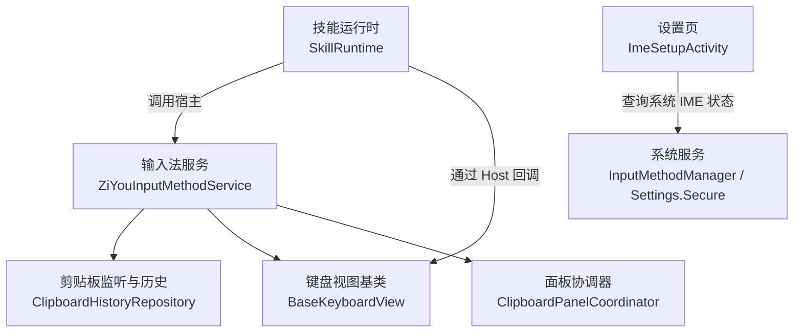
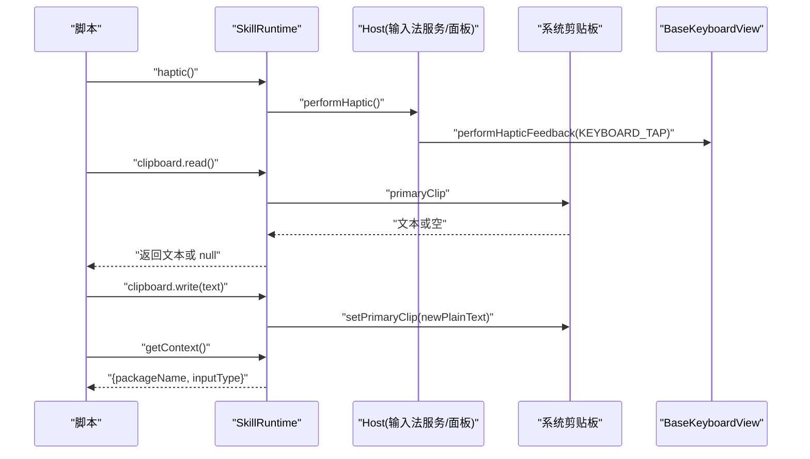
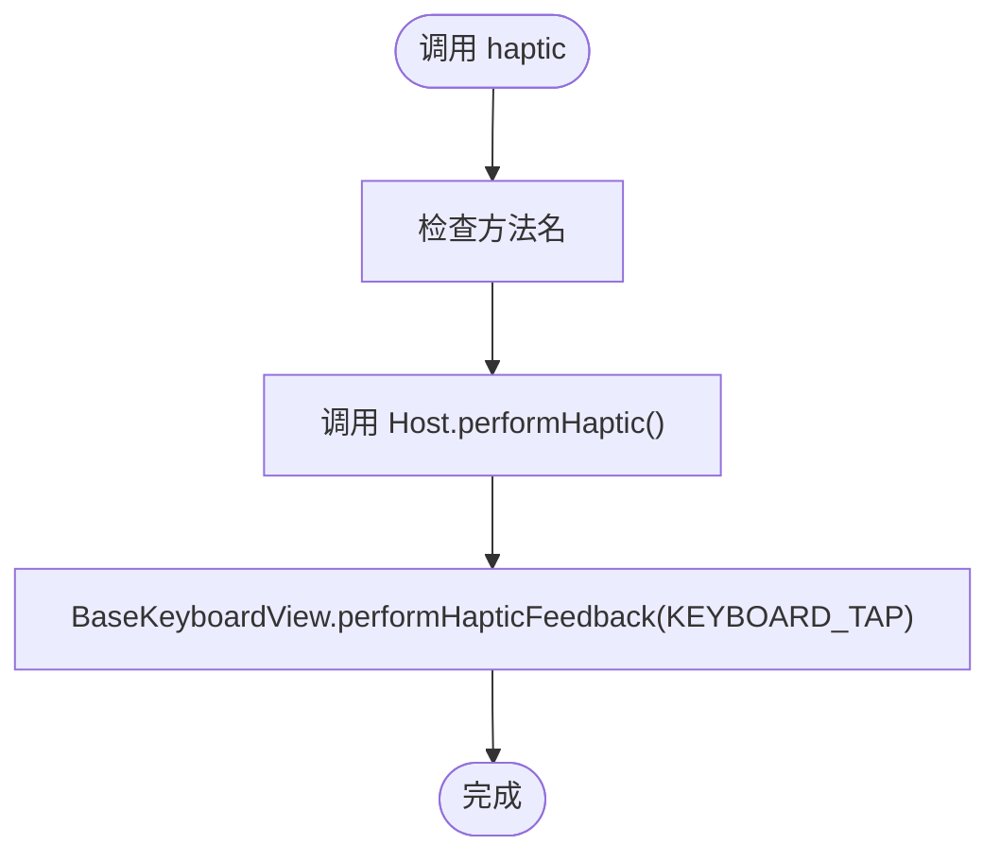
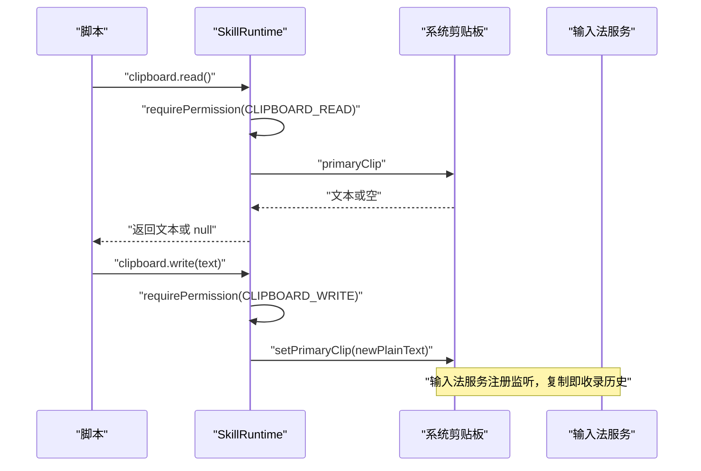
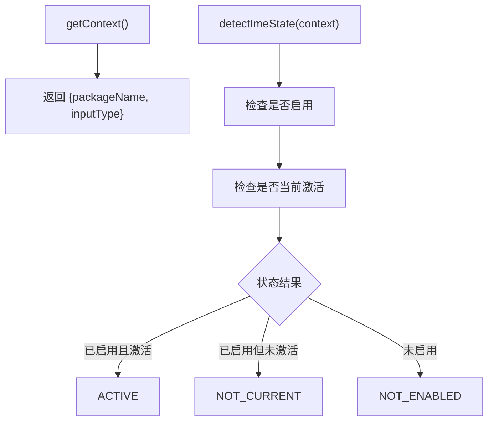
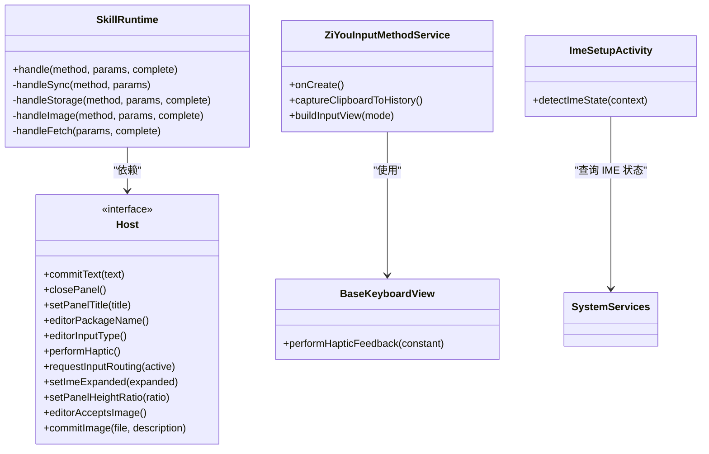

# 系统 API

<cite>
**本文引用的文件**
- [ZiYouInputMethodService.kt](file://app/src/main/java/com/ziyou/ime/ime/ZiYouInputMethodService.kt)
- [SkillRuntime.kt](file://app/src/main/java/com/ziyou/ime/skill/SkillRuntime.kt)
- [BaseKeyboardView.kt](file://app/src/main/java/com/ziyou/ime/ime/BaseKeyboardView.kt)
- [ClipboardPanelCoordinator.kt](file://app/src/main/java/com/ziyou/ime/ime/ClipboardPanelCoordinator.kt)
- [ImeSetupActivity.kt](file://app/src/main/java/com/ziyou/ime/ui/ImeSetupActivity.kt)
</cite>

## 目录
1. [简介](#简介)
2. [项目结构](#项目结构)
3. [核心组件](#核心组件)
4. [架构总览](#架构总览)
5. [详细组件分析](#详细组件分析)
6. [依赖关系分析](#依赖关系分析)
7. [性能考虑](#性能考虑)
8. [故障排查指南](#故障排查指南)
9. [结论](#结论)
10. [附录：API 参考与示例](#附录api-参考与示例)

## 简介
本文件面向开发者，系统化梳理输入法项目中的“系统级 API”能力，重点覆盖：
- 触觉反馈（震动）
- 剪贴板读写
- 设备信息获取（IME 状态、输入框类型等）

文档将说明各方法的权限要求、平台兼容性、使用示例、资源访问限制与安全注意事项，并提供跨平台兼容的处理方案。

## 项目结构
与系统 API 相关的代码主要分布在以下模块与文件中：
- 输入法服务层：负责剪贴板监听、读取历史、键盘视图与 UI 交互
- 技能运行时：对外暴露脚本侧的系统 API（含 haptic、clipboard、上下文信息等）
- 键盘视图基类：统一按键震动反馈实现
- 设置页：检测输入法启用与激活状态（设备信息）



**图表来源**
- [ZiYouInputMethodService.kt:387-429](file://app/src/main/java/com/ziyou/ime/ime/ZiYouInputMethodService.kt#L387-L429)
- [BaseKeyboardView.kt:180-190](file://app/src/main/java/com/ziyou/ime/ime/BaseKeyboardView.kt#L180-L190)
- [ClipboardPanelCoordinator.kt:130-141](file://app/src/main/java/com/ziyou/ime/ime/ClipboardPanelCoordinator.kt#L130-L141)
- [ImeSetupActivity.kt:79-102](file://app/src/main/java/com/ziyou/ime/ui/ImeSetupActivity.kt#L79-L102)

**章节来源**
- [ZiYouInputMethodService.kt:387-429](file://app/src/main/java/com/ziyou/ime/ime/ZiYouInputMethodService.kt#L387-L429)
- [BaseKeyboardView.kt:180-190](file://app/src/main/java/com/ziyou/ime/ime/BaseKeyboardView.kt#L180-L190)
- [ClipboardPanelCoordinator.kt:130-141](file://app/src/main/java/com/ziyou/ime/ime/ClipboardPanelCoordinator.kt#L130-L141)
- [ImeSetupActivity.kt:79-102](file://app/src/main/java/com/ziyou/ime/ui/ImeSetupActivity.kt#L79-L102)

## 核心组件
- 输入法服务（ZiYouInputMethodService）
  - 注册剪贴板变更监听，读取当前剪贴板并入库历史
  - 提供统一的输入逻辑与 UI 渲染入口
  - 管理键盘布局与候选区显示
- 技能运行时（SkillRuntime）
  - 为脚本暴露系统 API：haptic、clipboard.read/write、getContext/getLocale 等
  - 权限校验、限额控制、网络代理（fetch）、图片处理（image.*）
- 键盘视图基类（BaseKeyboardView）
  - 统一按键震动反馈（HapticFeedbackConstants.KEYBOARD_TAP）
- 剪贴板面板协调器（ClipboardPanelCoordinator）
  - 在面板操作中触发震动反馈
- 设置页（ImeSetupActivity）
  - 检测输入法是否启用与激活（设备信息）

**章节来源**
- [ZiYouInputMethodService.kt:387-429](file://app/src/main/java/com/ziyou/ime/ime/ZiYouInputMethodService.kt#L387-L429)
- [SkillRuntime.kt:179-224](file://app/src/main/java/com/ziyou/ime/skill/SkillRuntime.kt#L179-L224)
- [BaseKeyboardView.kt:180-190](file://app/src/main/java/com/ziyou/ime/ime/BaseKeyboardView.kt#L180-L190)
- [ClipboardPanelCoordinator.kt:130-141](file://app/src/main/java/com/ziyou/ime/ime/ClipboardPanelCoordinator.kt#L130-L141)
- [ImeSetupActivity.kt:79-102](file://app/src/main/java/com/ziyou/ime/ui/ImeSetupActivity.kt#L79-L102)

## 架构总览
下图展示系统 API 的调用路径与职责边界：脚本通过 SkillRuntime 调用系统能力；输入法服务负责剪贴板监听与历史；键盘视图提供震动反馈；设置页用于设备信息检测。



**图表来源**
- [SkillRuntime.kt:179-224](file://app/src/main/java/com/ziyou/ime/skill/SkillRuntime.kt#L179-L224)
- [BaseKeyboardView.kt:180-190](file://app/src/main/java/com/ziyou/ime/ime/BaseKeyboardView.kt#L180-L190)
- [ZiYouInputMethodService.kt:387-429](file://app/src/main/java/com/ziyou/ime/ime/ZiYouInputMethodService.kt#L387-L429)

## 详细组件分析

### 触觉反馈（haptic）
- 能力概述
  - 脚本侧通过 SkillRuntime.haptic 触发震动
  - 实际震动由键盘视图 BaseKeyboardView.performHapticFeedback 完成
  - 面板协调器在操作时也可触发相同震动
- 权限要求
  - 无需额外系统权限（基于 View 的震动反馈）
- 平台兼容性
  - Android 所有版本均支持 HapticFeedbackConstants.KEYBOARD_TAP
- 使用示例
  - 脚本调用：haptic()
  - 内部路径：SkillRuntime.handleSync("haptic") → Host.performHaptic() → BaseKeyboardView.performHapticFeedback(...)
- 安全与限制
  - 无敏感数据访问，仅 UI 层震动
  - 频繁调用可能影响体验，建议合理节流



**图表来源**
- [SkillRuntime.kt:179-182](file://app/src/main/java/com/ziyou/ime/skill/SkillRuntime.kt#L179-L182)
- [BaseKeyboardView.kt:180-190](file://app/src/main/java/com/ziyou/ime/ime/BaseKeyboardView.kt#L180-L190)
- [ClipboardPanelCoordinator.kt:136-138](file://app/src/main/java/com/ziyou/ime/ime/ClipboardPanelCoordinator.kt#L136-L138)

**章节来源**
- [SkillRuntime.kt:179-182](file://app/src/main/java/com/ziyou/ime/skill/SkillRuntime.kt#L179-L182)
- [BaseKeyboardView.kt:180-190](file://app/src/main/java/com/ziyou/ime/ime/BaseKeyboardView.kt#L180-L190)
- [ClipboardPanelCoordinator.kt:136-138](file://app/src/main/java/com/ziyou/ime/ime/ClipboardPanelCoordinator.kt#L136-L138)

### 剪贴板操作（clipboard.read / clipboard.write）
- 能力概述
  - 脚本侧通过 SkillRuntime 提供的 clipboard.read 与 clipboard.write 接口读写剪贴板
  - 输入法服务在 onCreate 中注册剪贴板监听，复制即收录历史
- 权限要求
  - 脚本侧需声明对应权限：CLIPBOARD_READ、CLIPBOARD_WRITE（SkillPermission）
  - 非默认输入法在 Android 10+ 后台读剪贴板受限（读到 null 会跳过）
- 平台兼容性
  - Android 13+ 敏感内容标记（EXTRA_IS_SENSITIVE）不入库
  - Android 10+ 后台剪贴板读取限制
- 使用示例
  - 读取：clipboard.read() → 返回文本或 null
  - 写入：clipboard.write({text}) → 设置 primaryClip
  - 监听：输入法服务自动捕获复制行为并入库历史
- 安全与限制
  - 敏感内容过滤（Android 13+）
  - 非默认输入法后台读取限制
  - 去重/截断/容量裁剪由历史记录逻辑保证



**图表来源**
- [SkillRuntime.kt:210-224](file://app/src/main/java/com/ziyou/ime/skill/SkillRuntime.kt#L210-L224)
- [ZiYouInputMethodService.kt:387-429](file://app/src/main/java/com/ziyou/ime/ime/ZiYouInputMethodService.kt#L387-L429)

**章节来源**
- [SkillRuntime.kt:210-224](file://app/src/main/java/com/ziyou/ime/skill/SkillRuntime.kt#L210-L224)
- [ZiYouInputMethodService.kt:387-429](file://app/src/main/java/com/ziyou/ime/ime/ZiYouInputMethodService.kt#L387-L429)

### 设备信息获取（getContext / IME 状态）
- 能力概述
  - 脚本侧通过 getContext 获取当前编辑器包名与输入类型
  - 设置页可检测输入法启用与激活状态（设备信息）
- 权限要求
  - getContext 无需额外权限
  - IME 状态检测无需额外权限（Settings.Secure.DEFAULT_INPUT_METHOD）
- 平台兼容性
  - InputMethodManager 在 API 34 才提供等价公开 API，当前使用 Settings.Secure 兼容
- 使用示例
  - 脚本：getContext() → {packageName, inputType}
  - 设置页：detectImeState(context) → 判断已启用/激活状态
- 安全与限制
  - 仅读取公开的系统信息，无敏感数据访问



**图表来源**
- [SkillRuntime.kt:172-175](file://app/src/main/java/com/ziyou/ime/skill/SkillRuntime.kt#L172-L175)
- [ImeSetupActivity.kt:79-102](file://app/src/main/java/com/ziyou/ime/ui/ImeSetupActivity.kt#L79-L102)

**章节来源**
- [SkillRuntime.kt:172-175](file://app/src/main/java/com/ziyou/ime/skill/SkillRuntime.kt#L172-L175)
- [ImeSetupActivity.kt:79-102](file://app/src/main/java/com/ziyou/ime/ui/ImeSetupActivity.kt#L79-L102)

## 依赖关系分析
- SkillRuntime 依赖 Host 接口（由输入法服务或面板协调器实现）
- 输入法服务依赖系统剪贴板服务与键盘视图
- 设置页依赖系统 IME 服务与 Settings.Secure



**图表来源**
- [SkillRuntime.kt:40-114](file://app/src/main/java/com/ziyou/ime/skill/SkillRuntime.kt#L40-L114)
- [ZiYouInputMethodService.kt:356-406](file://app/src/main/java/com/ziyou/ime/ime/ZiYouInputMethodService.kt#L356-L406)
- [BaseKeyboardView.kt:180-190](file://app/src/main/java/com/ziyou/ime/ime/BaseKeyboardView.kt#L180-L190)
- [ImeSetupActivity.kt:79-102](file://app/src/main/java/com/ziyou/ime/ui/ImeSetupActivity.kt#L79-L102)

**章节来源**
- [SkillRuntime.kt:40-114](file://app/src/main/java/com/ziyou/ime/skill/SkillRuntime.kt#L40-L114)
- [ZiYouInputMethodService.kt:356-406](file://app/src/main/java/com/ziyou/ime/ime/ZiYouInputMethodService.kt#L356-L406)
- [BaseKeyboardView.kt:180-190](file://app/src/main/java/com/ziyou/ime/ime/BaseKeyboardView.kt#L180-L190)
- [ImeSetupActivity.kt:79-102](file://app/src/main/java/com/ziyou/ime/ui/ImeSetupActivity.kt#L79-L102)

## 性能考虑
- 剪贴板监听：仅在主线程注册监听，读取时进行快速失败与异常捕获
- 震动反馈：使用系统原生 HapticFeedback，开销极小
- 设备信息查询：轻量级系统调用，无 IO 操作
- 建议：避免高频调用剪贴板读取，合理使用缓存与节流

## 故障排查指南
- 剪贴板读取为空
  - 检查是否为非默认输入法（Android 10+ 后台限制）
  - 检查 Android 13+ 敏感内容标记
- 震动无反馈
  - 确认 View 已启用震动反馈（isHapticFeedbackEnabled = true）
  - 检查是否在正确的 View 上调用 performHapticFeedback
- IME 状态检测失败
  - 检查 Settings.Secure.DEFAULT_INPUT_METHOD 读取权限
  - 确认 InputMethodManager 可用性

**章节来源**
- [ZiYouInputMethodService.kt:414-429](file://app/src/main/java/com/ziyou/ime/ime/ZiYouInputMethodService.kt#L414-L429)
- [BaseKeyboardView.kt:238-242](file://app/src/main/java/com/ziyou/ime/ime/BaseKeyboardView.kt#L238-L242)
- [ImeSetupActivity.kt:79-102](file://app/src/main/java/com/ziyou/ime/ui/ImeSetupActivity.kt#L79-L102)

## 结论
本项目实现了完整的系统级 API 能力，包括触觉反馈、剪贴板操作和设备信息查询。通过清晰的权限控制、平台兼容性处理和安全的资源访问限制，确保了功能的稳定性和安全性。开发者可以基于这些 API 构建丰富的输入法功能。

## 附录：API 参考与示例

### 触觉反馈 API
- 方法：haptic()
- 权限：无需
- 平台：全版本支持
- 示例：
  ```javascript
  // 触发震动反馈
  haptic();
  ```

### 剪贴板 API
- 方法：clipboard.read(), clipboard.write()
- 权限：CLIPBOARD_READ, CLIPBOARD_WRITE
- 平台：Android 10+ 有后台限制，Android 13+ 敏感内容过滤
- 示例：
  ```javascript
  // 读取剪贴板
  const text = clipboard.read();
  
  // 写入剪贴板
  clipboard.write({text: "Hello World"});
  ```

### 设备信息 API
- 方法：getContext()
- 权限：无需
- 平台：全版本支持
- 示例：
  ```javascript
  // 获取编辑器信息
  const info = getContext();
  console.log(info.packageName, info.inputType);
  ```

### 输入法状态检测
- 方法：detectImeState(context)
- 权限：无需
- 平台：全版本支持
- 示例：
  ```kotlin
  // 检测输入法状态
  val state = ImeSetupActivity.detectImeState(context)
  when (state) {
      ImeState.ACTIVE -> println("输入法已就绪")
      ImeState.NOT_CURRENT -> println("需要切换到字由输入法")
      ImeState.NOT_ENABLED -> println("需要启用字由输入法")
  }
  ```

**章节来源**
- [SkillRuntime.kt:179-224](file://app/src/main/java/com/ziyou/ime/skill/SkillRuntime.kt#L179-L224)
- [ImeSetupActivity.kt:79-102](file://app/src/main/java/com/ziyou/ime/ui/ImeSetupActivity.kt#L79-L102)