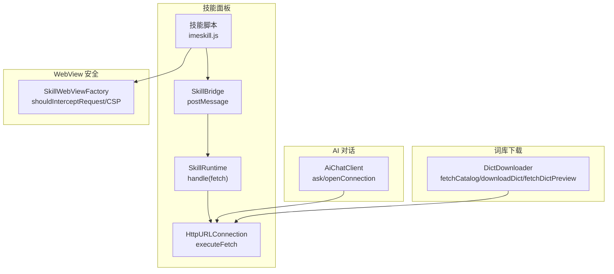
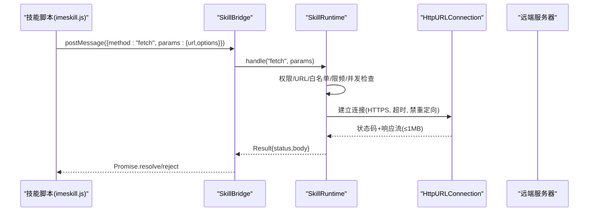
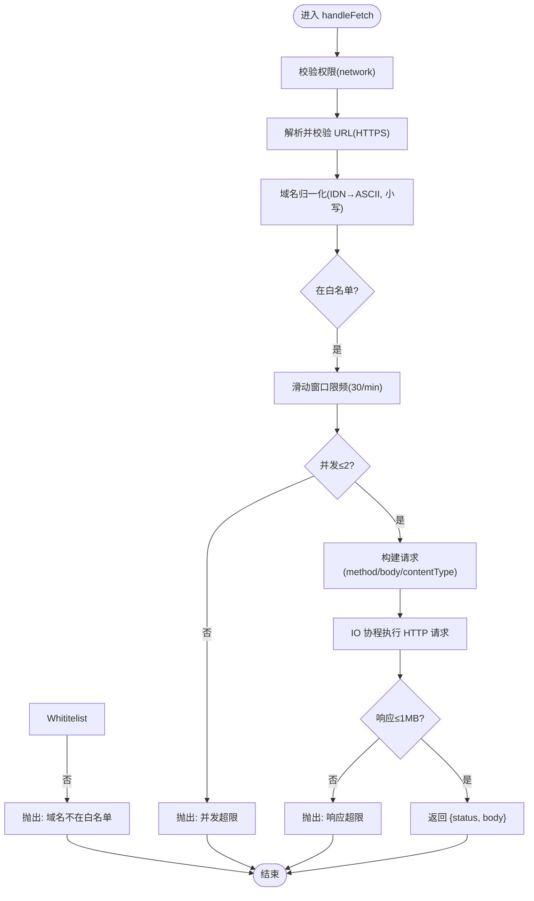
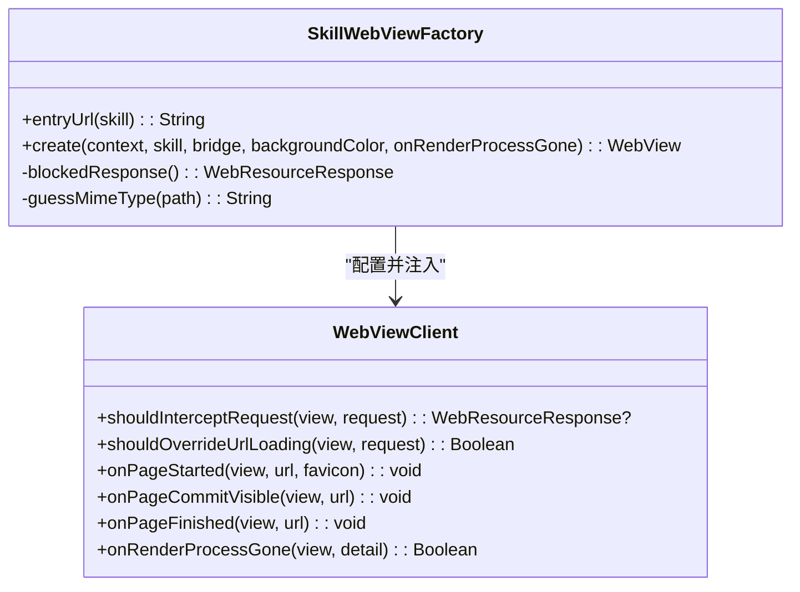
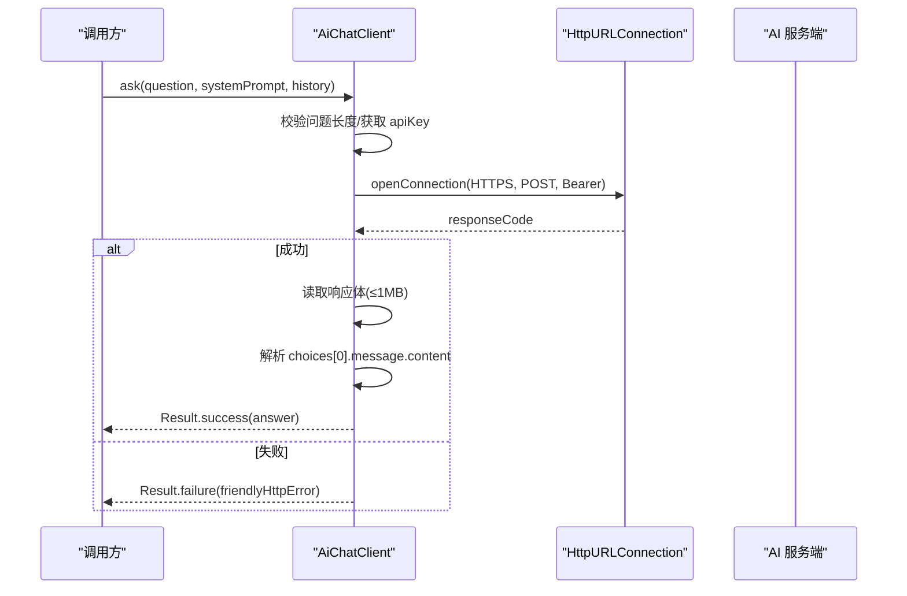
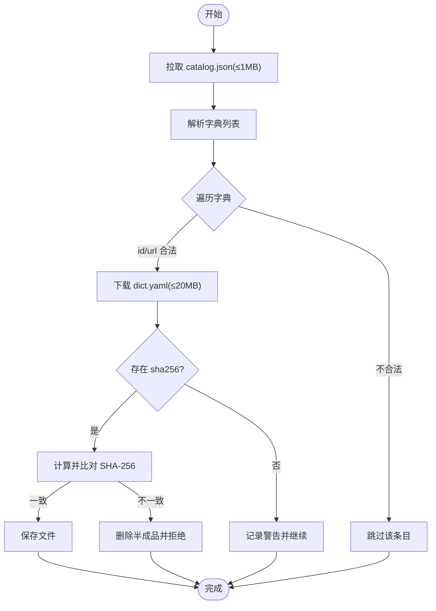
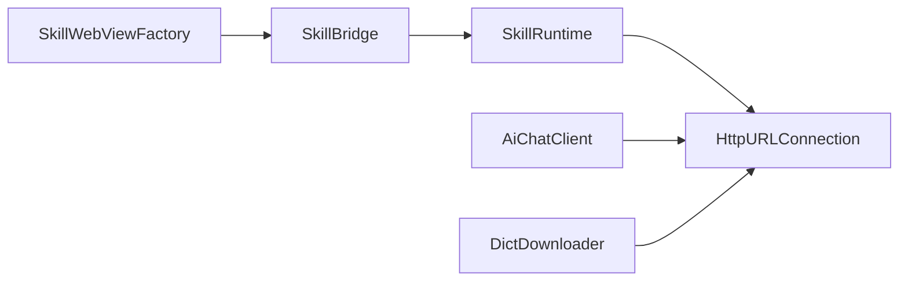

# 网络 API

<cite>
**本文引用的文件**   
- [AiChatClient.kt](file://app/src/main/java/com/ziyou/ime/ai/AiChatClient.kt)
- [DictDownloader.kt](file://app/src/main/java/com/ziyou/ime/dict/DictDownloader.kt)
- [SkillWebViewFactory.kt](file://app/src/main/java/com/ziyou/ime/skill/SkillWebViewFactory.kt)
- [SkillBridge.kt](file://app/src/main/java/com/ziyou/ime/skill/SkillBridge.kt)
- [imeskill.js](file://app/src/main/assets/skill_runtime/imeskill.js)
- [SkillRuntime.kt](file://app/src/main/java/com/ziyou/ime/skill/SkillRuntime.kt)
</cite>

## 目录
1. [简介](#简介)
2. [项目结构](#项目结构)
3. [核心组件](#核心组件)
4. [架构总览](#架构总览)
5. [详细组件分析](#详细组件分析)
6. [依赖关系分析](#依赖关系分析)
7. [性能考量](#性能考量)
8. [故障排查指南](#故障排查指南)
9. [结论](#结论)
10. [附录：请求示例与最佳实践](#附录请求示例与最佳实践)

## 简介
本文件面向“网络 API”的完整文档，覆盖以下方面：
- fetch 方法与网络请求能力（技能面板内 JS 代理、AI 对话客户端、词库下载器）
- 安全限制与跨域策略（HTTPS 强制、域名白名单、CSP、重定向受控）
- 完整的网络请求示例（GET/POST、文件上传/下载、错误重试）
- 缓存策略与离线处理建议
- 网络安全最佳实践与性能优化建议

本项目中网络访问主要分布在三类场景：
- 技能面板内的 fetch 代理（JS → Bridge → Runtime → HttpURLConnection）
- AI 对话客户端（OpenAI 兼容接口）
- 词库目录与文件的下载器（含完整性校验）

## 项目结构
围绕网络能力的代码组织如下：
- 技能面板网络代理：SkillWebViewFactory（资源拦截与 CSP）、SkillBridge（JS 桥）、SkillRuntime（fetch 代理实现）
- AI 对话客户端：AiChatClient（HTTP 连接、鉴权、响应解析）
- 词库下载器：DictDownloader（目录拉取、文件下载、预览、SHA-256 校验）

图表来源 
- [SkillWebViewFactory.kt:93-156](file://app/src/main/java/com/ziyou/ime/skill/SkillWebViewFactory.kt#L93-L156)
- [SkillBridge.kt:45-98](file://app/src/main/java/com/ziyou/ime/skill/SkillBridge.kt#L45-L98)
- [SkillRuntime.kt:374-471](file://app/src/main/java/com/ziyou/ime/skill/SkillRuntime.kt#L374-L471)
- [AiChatClient.kt:65-128](file://app/src/main/java/com/ziyou/ime/ai/AiChatClient.kt#L65-L128)
- [DictDownloader.kt:54-162](file://app/src/main/java/com/ziyou/ime/dict/DictDownloader.kt#L54-L162)

章节来源
- [SkillWebViewFactory.kt:1-205](file://app/src/main/java/com/ziyou/ime/skill/SkillWebViewFactory.kt#L1-L205)
- [SkillBridge.kt:1-99](file://app/src/main/java/com/ziyou/ime/skill/SkillBridge.kt#L1-L99)
- [SkillRuntime.kt:1-521](file://app/src/main/java/com/ziyou/ime/skill/SkillRuntime.kt#L1-L521)
- [AiChatClient.kt:1-194](file://app/src/main/java/com/ziyou/ime/ai/AiChatClient.kt#L1-L194)
- [DictDownloader.kt:1-367](file://app/src/main/java/com/ziyou/ime/dict/DictDownloader.kt#L1-L367)

## 核心组件
- 技能面板 fetch 代理
  - 入口：imeskill.js 暴露 IMESkill.fetch(url, options)
  - 桥接：SkillBridge.postMessage 统一消息分发
  - 实现：SkillRuntime.handleFetch + executeFetch（HTTPS、白名单、超时、限频、并发、响应大小上限、禁重定向）
- WebView 安全与跨域
  - 仅允许虚拟域名下的包内资源；其余一律返回空响应
  - HTML 响应附加 CSP，禁止 connect-src
- AI 对话客户端
  - 强制 HTTPS、Bearer 鉴权、连接/读取超时、响应体大小上限、JSON 解析
- 词库下载器
  - 目录拉取、文件下载、预览、SHA-256 校验、受控重定向、域名白名单

章节来源
- [SkillRuntime.kt:374-471](file://app/src/main/java/com/ziyou/ime/skill/SkillRuntime.kt#L374-L471)
- [SkillWebViewFactory.kt:93-156](file://app/src/main/java/com/ziyou/ime/skill/SkillWebViewFactory.kt#L93-L156)
- [AiChatClient.kt:65-128](file://app/src/main/java/com/ziyou/ime/ai/AiChatClient.kt#L65-L128)
- [DictDownloader.kt:54-162](file://app/src/main/java/com/ziyou/ime/dict/DictDownloader.kt#L54-L162)

## 架构总览
技能面板的网络调用路径与安全边界如下：

图表来源 
- [SkillBridge.kt:45-98](file://app/src/main/java/com/ziyou/ime/skill/SkillBridge.kt#L45-L98)
- [SkillRuntime.kt:374-471](file://app/src/main/java/com/ziyou/ime/skill/SkillRuntime.kt#L374-L471)
- [imeskill.js:146-151](file://app/src/main/assets/skill_runtime/imeskill.js#L146-L151)

## 详细组件分析

### 技能面板 fetch 代理（JS → Bridge → Runtime）
- 能力说明
  - 支持 GET/POST，可选 body 与 contentType
  - 强制 HTTPS，域名白名单精确匹配（IDN/punycode 归一化）
  - 超时 10s，响应体 ≤1MB，频控 30 次/分钟，并发 ≤2
  - 禁用自动重定向，防止白名单逃逸
- 数据模型
  - 输入：url（字符串），options.method/body/contentType
  - 输出：{ status: number, body: string }
- 错误处理
  - 非法 URL / 非 HTTPS / 域名不在白名单 / 超限 / 失败等，均通过 SkillApiException 透传
- 线程模型
  - Bridge 主线程分发，IO 协程执行网络，结果回主线程回调

图表来源 
- [SkillRuntime.kt:374-471](file://app/src/main/java/com/ziyou/ime/skill/SkillRuntime.kt#L374-L471)

章节来源
- [SkillBridge.kt:45-98](file://app/src/main/java/com/ziyou/ime/skill/SkillBridge.kt#L45-L98)
- [SkillRuntime.kt:374-471](file://app/src/main/java/com/ziyou/ime/skill/SkillRuntime.kt#L374-L471)
- [imeskill.js:146-151](file://app/src/main/assets/skill_runtime/imeskill.js#L146-L151)

### WebView 安全与跨域（CSP 与资源拦截）
- 资源拦截
  - 仅放行虚拟域名 appassets.androidplatform.net 下 /skill/ 前缀的资源
  - 其余请求一律返回空响应，阻断 img/script/css 等旁路出网通道
- CSP 策略
  - HTML 响应附加 Content-Security-Policy，connect-src 为 'none'，禁止一切网络连接
- 跳转控制
  - shouldOverrideUrlLoading 禁止离开虚拟域名
- 渲染崩溃兜底
  - onRenderProcessGone 销毁面板，保证 IME 主进程存活

图表来源 
- [SkillWebViewFactory.kt:93-156](file://app/src/main/java/com/ziyou/ime/skill/SkillWebViewFactory.kt#L93-L156)

章节来源
- [SkillWebViewFactory.kt:1-205](file://app/src/main/java/com/ziyou/ime/skill/SkillWebViewFactory.kt#L1-L205)

### AI 对话客户端（OpenAI 兼容）
- 能力说明
  - 非流式 chat/completions 请求，携带 model、messages、stream=false
  - 强制 HTTPS，设置 Authorization: Bearer <apiKey>
  - 连接超时 15s，读取超时 60s，响应体 ≤1MB
  - 问题长度上限 2000 字符
- 错误处理
  - HTTP 错误码转用户可读提示（鉴权失败、频率限制、服务不可用等）
  - IO 异常与解析异常统一捕获

图表来源 
- [AiChatClient.kt:65-128](file://app/src/main/java/com/ziyou/ime/ai/AiChatClient.kt#L65-L128)
- [AiChatClient.kt:155-175](file://app/src/main/java/com/ziyou/ime/ai/AiChatClient.kt#L155-L175)

章节来源
- [AiChatClient.kt:1-194](file://app/src/main/java/com/ziyou/ime/ai/AiChatClient.kt#L1-L194)

### 词库下载器（目录/文件/预览/校验）
- 能力说明
  - 拉取 catalog.json（≤1MB），解析字典列表
  - 下载 dict.yaml（≤20MB），边读边校验大小，完成后 SHA-256 校验
  - 预览前 N 条词条（≤1MB 截断）
  - 受控重定向（最多 3 跳），每跳重新校验白名单
- 安全策略
  - 强制 HTTPS，域名白名单 gitee.com、raw.giteeusercontent.com
  - 非法 id/url 直接拒绝，避免目录穿越与外链投毒

图表来源 
- [DictDownloader.kt:54-162](file://app/src/main/java/com/ziyou/ime/dict/DictDownloader.kt#L54-L162)
- [DictDownloader.kt:264-295](file://app/src/main/java/com/ziyou/ime/dict/DictDownloader.kt#L264-L295)

章节来源
- [DictDownloader.kt:1-367](file://app/src/main/java/com/ziyou/ime/dict/DictDownloader.kt#L1-L367)

## 依赖关系分析
- 组件耦合
  - SkillBridge 依赖 SkillRuntime 进行业务处理
  - SkillRuntime 依赖 HttpURLConnection 发起网络请求
  - SkillWebViewFactory 提供 WebView 安全基线，隔离外网访问
  - AiChatClient 与 DictDownloader 独立使用 HttpURLConnection，遵循各自安全策略
- 外部依赖
  - Android WebView 与 WebResourceRequest
  - Kotlin Coroutines（Dispatchers.IO、withContext）
  - JSON 库（org.json）

图表来源 
- [SkillBridge.kt:45-98](file://app/src/main/java/com/ziyou/ime/skill/SkillBridge.kt#L45-L98)
- [SkillRuntime.kt:374-471](file://app/src/main/java/com/ziyou/ime/skill/SkillRuntime.kt#L374-L471)
- [AiChatClient.kt:65-128](file://app/src/main/java/com/ziyou/ime/ai/AiChatClient.kt#L65-L128)
- [DictDownloader.kt:54-162](file://app/src/main/java/com/ziyou/ime/dict/DictDownloader.kt#L54-L162)

章节来源
- [SkillBridge.kt:1-99](file://app/src/main/java/com/ziyou/ime/skill/SkillBridge.kt#L1-L99)
- [SkillRuntime.kt:1-521](file://app/src/main/java/com/ziyou/ime/skill/SkillRuntime.kt#L1-L521)
- [SkillWebViewFactory.kt:1-205](file://app/src/main/java/com/ziyou/ime/skill/SkillWebViewFactory.kt#L1-L205)
- [AiChatClient.kt:1-194](file://app/src/main/java/com/ziyou/ime/ai/AiChatClient.kt#L1-L194)
- [DictDownloader.kt:1-367](file://app/src/main/java/com/ziyou/ime/dict/DictDownloader.kt#L1-L367)

## 性能考量
- 超时与限流
  - 技能 fetch 超时 10s，AI 读取 60s，词库下载 30s；技能 fetch 限频 30 次/分钟，并发 ≤2
- 内存与体积
  - 响应体上限：技能 fetch 1MB，AI 1MB，catalog 1MB，词库 20MB；避免 OOM
- I/O 调度
  - 所有网络 IO 切到 Dispatchers.IO，避免阻塞 UI 线程
- 缓存与离线
  - WebView 关闭缓存（技能资源本地即取）；技能 fetch 未内置缓存，建议在应用层按需实现
  - 词库下载可结合本地缓存与完整性校验提升稳定性

## 故障排查指南
- 常见错误定位
  - 技能 fetch 报错：检查域名是否在 manifest.networkDomains；确认 HTTPS；查看限频与并发限制
  - AI 请求失败：检查 API Key、模型名、系统提示词拼接；关注 HTTP 错误码友好提示
  - 词库下载失败：检查 catalog 是否可达、重定向是否命中白名单、SHA-256 是否一致
- 日志与调试
  - 各模块均有 Log.e/w 输出关键路径与异常信息
  - WebView 调试仅在 debuggable 构建开启远程调试

章节来源
- [SkillRuntime.kt:418-426](file://app/src/main/java/com/ziyou/ime/skill/SkillRuntime.kt#L418-L426)
- [AiChatClient.kt:90-114](file://app/src/main/java/com/ziyou/ime/ai/AiChatClient.kt#L90-L114)
- [DictDownloader.kt:69-78](file://app/src/main/java/com/ziyou/ime/dict/DictDownloader.kt#L69-L78)

## 结论
本项目在网络 API 层面实现了严格的安全基线与可控的访问策略：
- 技能面板内通过 Bridge 与 Runtime 对 fetch 进行强约束（HTTPS、白名单、限频、并发、响应上限、禁重定向）
- WebView 全量拦截与 CSP 确保无旁路出网
- AI 客户端与词库下载器遵循各自的安全与性能策略
- 建议在应用层补充缓存与重试机制，以进一步提升用户体验与鲁棒性

## 附录：请求示例与最佳实践

### 技能面板 fetch 示例（GET/POST）
- GET 请求
  - 调用 IMESkill.fetch("https://example.com/api/data")
  - 返回 { status, body }，根据 status 判断成功与否
- POST 请求
  - 调用 IMESkill.fetch("https://example.com/api/submit", { method:"POST", body:"...", contentType:"application/json" })
  - 注意 body 与 contentType 需与服务端约定一致

章节来源
- [imeskill.js:146-151](file://app/src/main/assets/skill_runtime/imeskill.js#L146-L151)
- [SkillRuntime.kt:409-427](file://app/src/main/java/com/ziyou/ime/skill/SkillRuntime.kt#L409-L427)

### 文件上传与下载
- 下载
  - 技能 fetch 返回 body 文本；二进制内容需自行按协议处理（如 base64）
  - 词库下载由 DictDownloader.downloadDict 负责，包含进度回调与完整性校验
- 上传
  - 技能 fetch 支持 POST body；大文件建议分块上传并在服务端合并

章节来源
- [SkillRuntime.kt:430-471](file://app/src/main/java/com/ziyou/ime/skill/SkillRuntime.kt#L430-L471)
- [DictDownloader.kt:87-162](file://app/src/main/java/com/ziyou/ime/dict/DictDownloader.kt#L87-L162)

### 错误重试策略
- 建议实现指数退避重试（例如 1s、2s、4s...），限制最大重试次数
- 区分网络错误与业务错误（如 4xx/5xx），对 5xx 可重试，4xx 通常不重试
- 在应用层维护请求队列与去重逻辑，避免重复请求

章节来源
- [SkillRuntime.kt:418-426](file://app/src/main/java/com/ziyou/ime/skill/SkillRuntime.kt#L418-L426)

### 缓存策略与离线处理
- 技能 fetch 未内置缓存；可在应用层按 URL 与参数生成缓存键，结合内存与磁盘缓存
- WebView 已关闭缓存（避免膨胀）；如需静态资源缓存，应在打包时内嵌
- 离线模式：优先读取本地缓存，失败再尝试网络；对失败请求做降级展示

章节来源
- [SkillWebViewFactory.kt:72-82](file://app/src/main/java/com/ziyou/ime/skill/SkillWebViewFactory.kt#L72-L82)

### 安全最佳实践
- 强制 HTTPS，禁用自动重定向
- 域名白名单精确匹配，并进行 IDN/punycode 归一化
- 限制响应体大小与请求频率，防止滥用与资源耗尽
- WebView 使用 CSP 与资源拦截，杜绝旁路出网
- 敏感信息（如 API Key）应通过安全配置存储，避免硬编码

章节来源
- [SkillRuntime.kt:374-471](file://app/src/main/java/com/ziyou/ime/skill/SkillRuntime.kt#L374-L471)
- [SkillWebViewFactory.kt:93-156](file://app/src/main/java/com/ziyou/ime/skill/SkillWebViewFactory.kt#L93-L156)
- [AiChatClient.kt:116-128](file://app/src/main/java/com/ziyou/ime/ai/AiChatClient.kt#L116-L128)
- [DictDownloader.kt:264-295](file://app/src/main/java/com/ziyou/ime/dict/DictDownloader.kt#L264-L295)