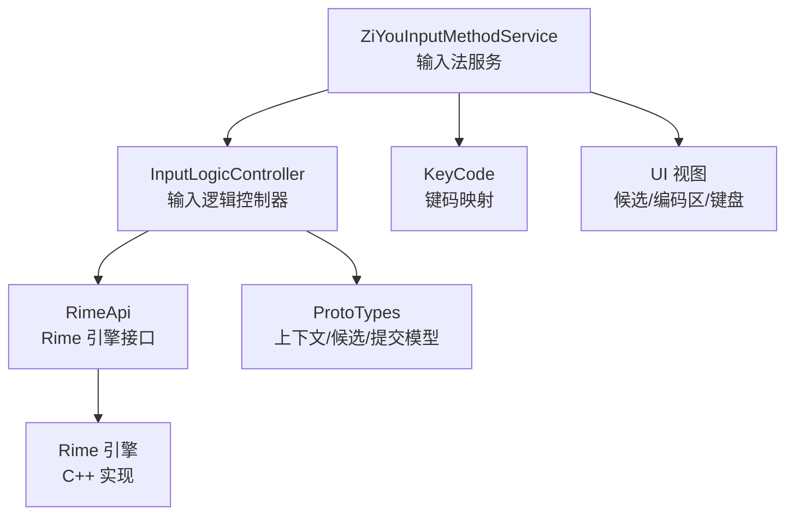
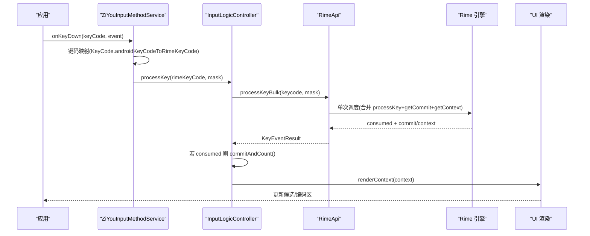
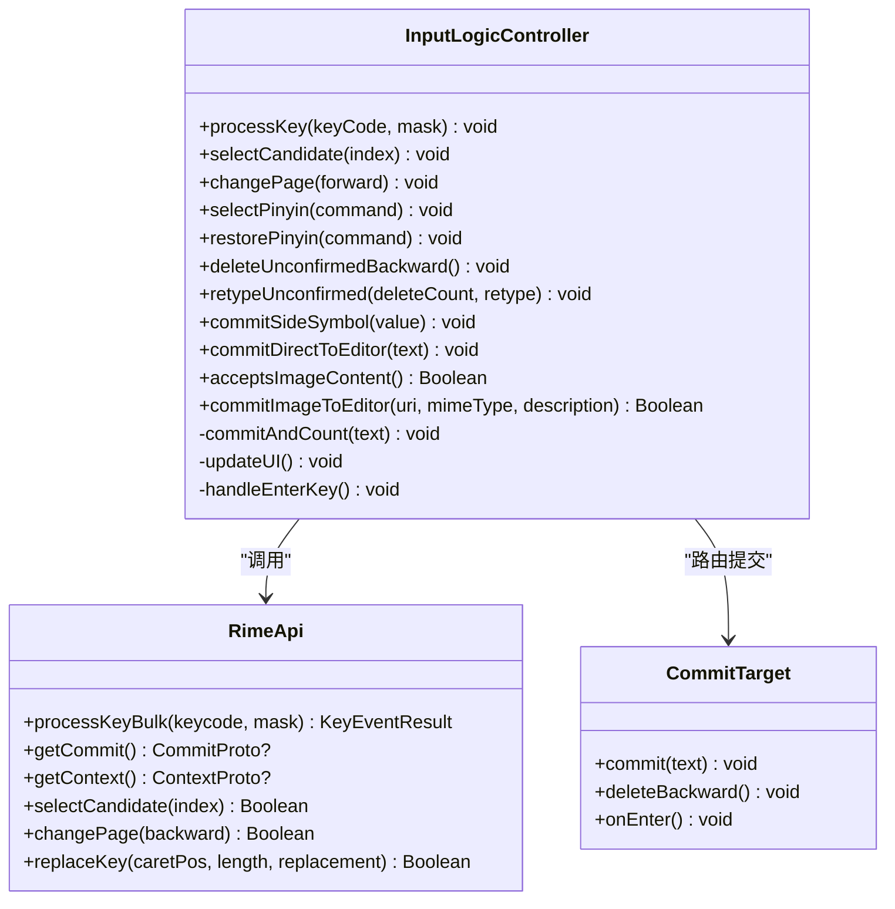
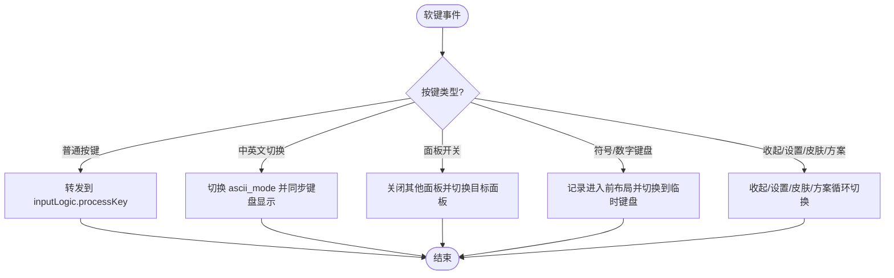
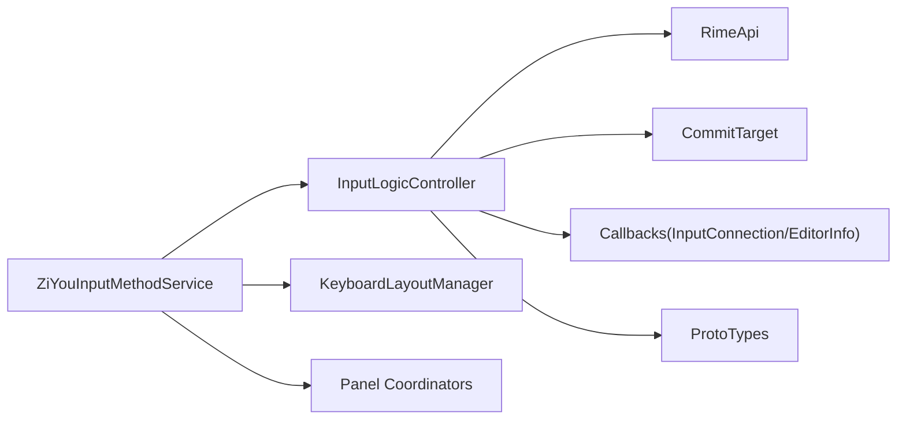
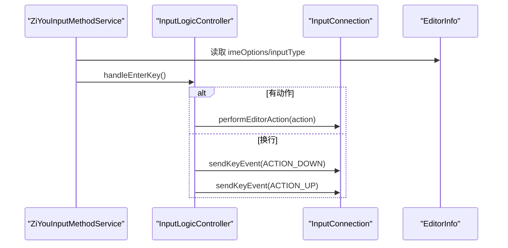

# 输入 API

<cite>
**本文引用的文件**   
- [InputLogicController.kt](file://app/src/main/java/com/ziyou/ime/ime/InputLogicController.kt)
- [ZiYouInputMethodService.kt](file://app/src/main/java/com/ziyou/ime/ime/ZiYouInputMethodService.kt)
- [RimeApi.kt](file://app/src/main/java/com/ziyou/ime/core/RimeApi.kt)
- [ProtoTypes.kt](file://app/src/main/java/com/ziyou/ime/core/ProtoTypes.kt)
- [KeyCode.kt](file://app/src/main/java/com/ziyou/ime/ime/KeyCode.kt)
</cite>

## 目录
1. [简介](#简介)
2. [项目结构](#项目结构)
3. [核心组件](#核心组件)
4. [架构总览](#架构总览)
5. [详细组件分析](#详细组件分析)
6. [依赖关系分析](#依赖关系分析)
7. [性能考量](#性能考量)
8. [故障排查指南](#故障排查指南)
9. [结论](#结论)
10. [附录：输入事件与键盘状态管理](#附录输入事件与键盘状态管理)

## 简介
本文件为“输入 API”的完整文档，聚焦 input.* 命名空间下的输入相关能力。该项目的输入路径由输入法服务（IME）与 Rime 引擎协作完成，核心逻辑集中在 InputLogicController 中，负责按键处理、候选词选择、翻页、拼音侧栏替换、退格重打、直接上屏、富媒体提交等；ZiYouInputMethodService 负责生命周期、视图装配、软/硬按键分发与 UI 渲染；RimeApi 提供与 Rime 引擎交互的统一接口。

## 项目结构
- 输入控制层：InputLogicController 封装所有输入操作与状态同步，屏蔽线程与并发细节。
- 输入法服务层：ZiYouInputMethodService 对接 Android IME 框架，处理物理键、软键、编辑器连接与 UI 刷新。
- 引擎接口层：RimeApi 定义 processKey/getCommit/getContext/selectCandidate/changePage 等输入与候选操作。
- 数据模型层：ProtoTypes 定义 Context/Candidate/Commit 等协议类型，贯穿输入链路。
- 键码映射：KeyCode 将 Android KeyEvent 转换为 Rime keysym 并计算修饰键掩码。

**图示来源** 
- [ZiYouInputMethodService.kt:336-352](file://app/src/main/java/com/ziyou/ime/ime/ZiYouInputMethodService.kt#L336-L352)
- [InputLogicController.kt:43-86](file://app/src/main/java/com/ziyou/ime/ime/InputLogicController.kt#L43-L86)
- [RimeApi.kt:10-104](file://app/src/main/java/com/ziyou/ime/core/RimeApi.kt#L10-L104)
- [ProtoTypes.kt](file://app/src/main/java/com/ziyou/ime/core/ProtoTypes.kt)
- [KeyCode.kt](file://app/src/main/java/com/ziyou/ime/ime/KeyCode.kt)

**章节来源**
- [ZiYouInputMethodService.kt:336-352](file://app/src/main/java/com/ziyou/ime/ime/ZiYouInputMethodService.kt#L336-L352)
- [InputLogicController.kt:43-86](file://app/src/main/java/com/ziyou/ime/ime/InputLogicController.kt#L43-L86)
- [RimeApi.kt:10-104](file://app/src/main/java/com/ziyou/ime/core/RimeApi.kt#L10-L104)

## 核心组件
- InputLogicController：输入事务串行化、按键批量处理、候选选择、翻页、拼音侧栏替换、退格重打、直接上屏、图片提交、回车落地策略。
- ZiYouInputMethodService：物理键/软键分发、面板协调、引擎状态同步、UI 渲染回调、剪贴板监听、低内存回收。
- RimeApi：processKey/processKeyBulk/getCommit/getContext/selectCandidate/changePage/setOption/getOption 等。
- ProtoTypes：Context/Candidate/Commit 等数据结构，承载输入上下文、候选列表与已提交文本。
- KeyCode：Android keyCode 到 Rime keysym 的转换与修饰键掩码计算。

**章节来源**
- [InputLogicController.kt:126-185](file://app/src/main/java/com/ziyou/ime/ime/InputLogicController.kt#L126-L185)
- [ZiYouInputMethodService.kt:896-918](file://app/src/main/java/com/ziyou/ime/ime/ZiYouInputMethodService.kt#L896-L918)
- [RimeApi.kt:28-74](file://app/src/main/java/com/ziyou/ime/core/RimeApi.kt#L28-L74)
- [ProtoTypes.kt](file://app/src/main/java/com/ziyou/ime/core/ProtoTypes.kt)
- [KeyCode.kt](file://app/src/main/java/com/ziyou/ime/ime/KeyCode.kt)

## 架构总览
输入路径的关键调用序列如下：
- 物理键：onKeyDown → 键码映射 → InputLogicController.processKey → RimeApi.processKeyBulk → getCommit/getContext → 主线程 renderContext。
- 软键：handleSoftKeyPress → 特殊功能路由或 InputLogicController.processKey。
- 候选点击：handleCandidateClick → selectCandidate → getCommit → updateUI。
- 回车：handleEnterKey → 按 EditorInfo 行为 performEditorAction 或补发 ENTER 按键事件。

**图示来源** 
- [ZiYouInputMethodService.kt:900-918](file://app/src/main/java/com/ziyou/ime/ime/ZiYouInputMethodService.kt#L900-L918)
- [InputLogicController.kt:126-185](file://app/src/main/java/com/ziyou/ime/ime/InputLogicController.kt#L126-L185)
- [RimeApi.kt:32-40](file://app/src/main/java/com/ziyou/ime/core/RimeApi.kt#L32-L40)

## 详细组件分析

### InputLogicController 输入 API
- processKey(keyCode, mask)
  - 参数：keyCode（Rime keysym），mask（修饰键掩码）
  - 返回：挂起函数，无返回值；内部通过 Mutex 串行化输入事务
  - 行为：
    - 编码长度超限防护（MAX_INPUT_LENGTH=30）
    - 批量处理 processKeyBulk，减少线程往返与 JNI 跨界
    - 若被消费：commit 文本上屏（commitAndCount）、清空九宫格栈、刷新 UI
    - 若未消费：退格删字、回车落地、可打印字符直接上屏
  - 使用场景：物理键与软键统一入口
- selectCandidate(index)
  - 参数：index（候选索引）
  - 返回：挂起函数；成功时取 commit 上屏，否则分段确认并同步九宫格状态机
  - 使用场景：候选词点击、预测词选择
- changePage(forward)
  - 参数：forward（true=下一页，false=上一页）
  - 返回：挂起函数；成功后刷新 UI
  - 使用场景：候选翻页
- selectPinyin(command)
  - 参数：command（ReplaceCommand，含 caretPos/length/replacement）
  - 返回：挂起函数；替换编码片段后移动光标至末尾以重组候选
  - 使用场景：九宫格拼音侧栏选词
- restorePinyin(command)
  - 参数：command（ReplaceCommand）
  - 返回：挂起函数；撤销拼音选择，恢复原 T9 键
  - 使用场景：九宫格智能退格回退
- deleteUnconfirmedBackward()
  - 参数：无
  - 返回：挂起函数；安全删除末位未确认原始键，避免 Reopen 导致已确认段失效
  - 使用场景：存在已确认段时的退格替代路径
- retypeUnconfirmed(deleteCount, retype)
  - 参数：deleteCount（待删除未确认原始键数），retype（重打后的未确认编码串）
  - 返回：挂起函数；逐键重打，保留已确认前缀
  - 使用场景：拼音侧栏选词且存在已确认段时的替代路径
- commitSideSymbol(value)
  - 参数：value（字符串）
  - 返回：挂起函数；直接上屏自定义符号
  - 使用场景：侧栏符号输入
- commitDirectToEditor(text)
  - 参数：text（CharSequence）
  - 返回：挂起函数；绕过 commitTarget 直达宿主编辑器，仍触发计分回调
  - 使用场景：面板打开期间仍需把内容送进真实输入框（如 AI 答案）
- acceptsImageContent()
  - 参数：无
  - 返回：Boolean；检测当前编辑器是否接受图片富媒体
  - 使用场景：决定“发送图片”是否可用
- commitImageToEditor(uri, mimeType, description)
  - 参数：uri（content:// URI），mimeType（如 image/png），description（无障碍描述，可选）
  - 返回：Boolean；是否提交成功
  - 使用场景：通过 Commit Content API 向编辑器提交图片
- handleEnterKey()（私有）
  - 行为：面板目标优先；否则按 EnterKeyBehavior 解析动作，执行 performEditorAction 或补发 ENTER 按键事件
  - 使用场景：回车键语义落地

**图示来源** 
- [InputLogicController.kt:126-504](file://app/src/main/java/com/ziyou/ime/ime/InputLogicController.kt#L126-L504)
- [RimeApi.kt:28-74](file://app/src/main/java/com/ziyou/ime/core/RimeApi.kt#L28-L74)

**章节来源**
- [InputLogicController.kt:126-185](file://app/src/main/java/com/ziyou/ime/ime/InputLogicController.kt#L126-L185)
- [InputLogicController.kt:195-227](file://app/src/main/java/com/ziyou/ime/ime/InputLogicController.kt#L195-L227)
- [InputLogicController.kt:248-262](file://app/src/main/java/com/ziyou/ime/ime/InputLogicController.kt#L248-L262)
- [InputLogicController.kt:273-303](file://app/src/main/java/com/ziyou/ime/ime/InputLogicController.kt#L273-L303)
- [InputLogicController.kt:319-332](file://app/src/main/java/com/ziyou/ime/ime/InputLogicController.kt#L319-L332)
- [InputLogicController.kt:354-372](file://app/src/main/java/com/ziyou/ime/ime/InputLogicController.kt#L354-L372)
- [InputLogicController.kt:424-438](file://app/src/main/java/com/ziyou/ime/ime/InputLogicController.kt#L424-L438)
- [InputLogicController.kt:446-486](file://app/src/main/java/com/ziyou/ime/ime/InputLogicController.kt#L446-L486)
- [InputLogicController.kt:383-396](file://app/src/main/java/com/ziyou/ime/ime/InputLogicController.kt#L383-L396)

### ZiYouInputMethodService 输入事件分发
- onKeyDown(keyCode, event)
  - 将 Android KeyEvent 转换为 Rime keysym 与修饰掩码，异步调用 inputLogic.processKey
- handleSoftKeyPress(keyCode, mask)
  - 中英文切换、悬浮/停靠切换、技能/AI/涂鸦/粘贴板/工具面板开关、符号/数字键盘切换、收起键盘、设置页、皮肤/方案循环切换、普通按键转发
- handleCandidateClick / handlePageChange / handlePinyinSelect / handleSideSymbolInput
  - 候选点击、翻页、拼音侧栏选词、侧栏符号输入，均委托 InputLogicController

**图示来源** 
- [ZiYouInputMethodService.kt:927-1115](file://app/src/main/java/com/ziyou/ime/ime/ZiYouInputMethodService.kt#L927-L1115)

**章节来源**
- [ZiYouInputMethodService.kt:900-918](file://app/src/main/java/com/ziyou/ime/ime/ZiYouInputMethodService.kt#L900-L918)
- [ZiYouInputMethodService.kt:927-1115](file://app/src/main/java/com/ziyou/ime/ime/ZiYouInputMethodService.kt#L927-L1115)

### RimeApi 引擎接口
- processKey/keyBulk：处理按键，批量获取 commit/context
- getCommit/getContext：获取已提交文本与当前输入上下文
- selectCandidate/changePage：候选选择与翻页
- replaceKey：替换编码片段（用于九宫格拼音消歧）
- setOption/getOption：运行时选项（如 ascii_mode/prediction）

**章节来源**
- [RimeApi.kt:28-74](file://app/src/main/java/com/ziyou/ime/core/RimeApi.kt#L28-L74)

### 数据模型（ProtoTypes）
- Context：包含 composition.preedit、input、menu.candidates 等
- Candidate：候选项文本与注音（comment）
- Commit：已提交的文本

**章节来源**
- [ProtoTypes.kt](file://app/src/main/java/com/ziyou/ime/core/ProtoTypes.kt)

## 依赖关系分析
- InputLogicController 依赖 RimeApi 进行引擎交互，依赖 CommitTarget 抽象进行上屏路由，依赖 Callbacks 获取 InputConnection 与 EditorInfo，并在主线程执行 UI 渲染。
- ZiYouInputMethodService 依赖 InputLogicController 作为输入逻辑中枢，依赖 KeyboardLayoutManager 管理键盘视图，依赖各面板协调器管理多面板互斥。
- RimeApi 是上层与 Rime 引擎的唯一契约，屏蔽线程与 JNI 细节。

**图示来源** 
- [ZiYouInputMethodService.kt:336-352](file://app/src/main/java/com/ziyou/ime/ime/ZiYouInputMethodService.kt#L336-L352)
- [InputLogicController.kt:77-111](file://app/src/main/java/com/ziyou/ime/ime/InputLogicController.kt#L77-L111)
- [RimeApi.kt:10-104](file://app/src/main/java/com/ziyou/ime/core/RimeApi.kt#L10-L104)

**章节来源**
- [ZiYouInputMethodService.kt:336-352](file://app/src/main/java/com/ziyou/ime/ime/ZiYouInputMethodService.kt#L336-L352)
- [InputLogicController.kt:77-111](file://app/src/main/java/com/ziyou/ime/ime/InputLogicController.kt#L77-L111)
- [RimeApi.kt:10-104](file://app/src/main/java/com/ziyou/ime/core/RimeApi.kt#L10-L104)

## 性能考量
- 批量处理：processKeyBulk 将 processKey/getCommit/getContext 合并为单次引擎调度，显著降低线程往返与 JNI 跨界开销。
- 编码长度上限：MAX_INPUT_LENGTH=30，防止长编码导致的组合爆炸与慢按键告警（SLOW_KEY_WARN_MS=100ms）。
- 事务串行化：Mutex 保证一次按键内多次 Rime 调用原子执行，避免快速连击导致的 commit/context 错配。
- 低内存回收：onTrimMemory 时关闭全部面板并归还 native 堆空闲页，降低 LMK 风险。

**章节来源**
- [InputLogicController.kt:51-64](file://app/src/main/java/com/ziyou/ime/ime/InputLogicController.kt#L51-L64)
- [InputLogicController.kt:126-185](file://app/src/main/java/com/ziyou/ime/ime/InputLogicController.kt#L126-L185)
- [ZiYouInputMethodService.kt:879-892](file://app/src/main/java/com/ziyou/ime/ime/ZiYouInputMethodService.kt#L879-L892)

## 故障排查指南
- 慢按键告警：当 processKeyBulk 耗时超过阈值，记录日志并输出编码长度，便于定位性能退化。
- 引擎未就绪：awaitEngineReady 轮询等待，超时放弃本次操作，由部署完成消息触发重同步。
- 方案不一致：收到 RimeMessage.SchemaMessage 时检查当前布局要求专用方案，不一致则立即 scheduleEngineSync。
- 图片提交失败：commitImageInternal 捕获异常并返回 false，调用方应提示用户或降级保存相册。

**章节来源**
- [InputLogicController.kt:140-146](file://app/src/main/java/com/ziyou/ime/ime/InputLogicController.kt#L140-L146)
- [ZiYouInputMethodService.kt:658-665](file://app/src/main/java/com/ziyou/ime/ime/ZiYouInputMethodService.kt#L658-L665)
- [ZiYouInputMethodService.kt:1494-1504](file://app/src/main/java/com/ziyou/ime/ime/ZiYouInputMethodService.kt#L1494-L1504)
- [InputLogicController.kt:466-486](file://app/src/main/java/com/ziyou/ime/ime/InputLogicController.kt#L466-L486)

## 结论
输入 API 以 InputLogicController 为核心，结合 RimeApi 与 ProtoTypes 构建稳定高效的输入路径。ZiYouInputMethodService 负责事件分发与 UI 渲染，确保与 Android IME 框架无缝集成。通过批量处理、事务串行化与长度上限等机制，系统在复杂输入场景下保持高响应与一致性。

## 附录：输入事件与键盘状态管理
- 物理键处理：onKeyDown 将 Android keyCode 映射为 Rime keysym，并通过 mask 传递修饰键状态。
- 软键处理：handleSoftKeyPress 区分功能键与普通按键，支持面板互斥、临时键盘、中英文切换等。
- 回车落地：按 EditorInfo 的 imeOptions/inputType 解析行为，优先 performEditorAction，否则补发 ENTER 按键事件。
- 九宫格状态机：KeyRecordStack 追踪 T9 按键、分词符与拼音选择，配合 selectPinyin/restorePinyin/retypeUnconfirmed 保证栈与引擎一致。
- 输入法框架集成：通过 InputConnection 与 EditorInfo 与宿主应用交互，支持 commitText/deleteSurroundingText/sendKeyEvent/commitContent 等标准 API。

**图示来源** 
- [ZiYouInputMethodService.kt:383-396](file://app/src/main/java/com/ziyou/ime/ime/ZiYouInputMethodService.kt#L383-L396)
- [ZiYouInputMethodService.kt:405-421](file://app/src/main/java/com/ziyou/ime/ime/ZiYouInputMethodService.kt#L405-L421)

**章节来源**
- [ZiYouInputMethodService.kt:900-918](file://app/src/main/java/com/ziyou/ime/ime/ZiYouInputMethodService.kt#L900-L918)
- [ZiYouInputMethodService.kt:927-1115](file://app/src/main/java/com/ziyou/ime/ime/ZiYouInputMethodService.kt#L927-L1115)
- [InputLogicController.kt:383-396](file://app/src/main/java/com/ziyou/ime/ime/InputLogicController.kt#L383-L396)
- [InputLogicController.kt:405-421](file://app/src/main/java/com/ziyou/ime/ime/InputLogicController.kt#L405-L421)