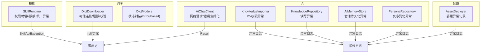
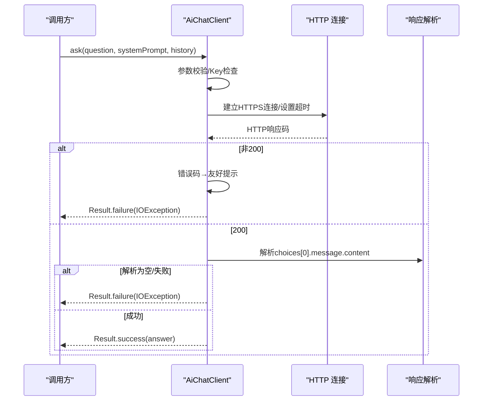
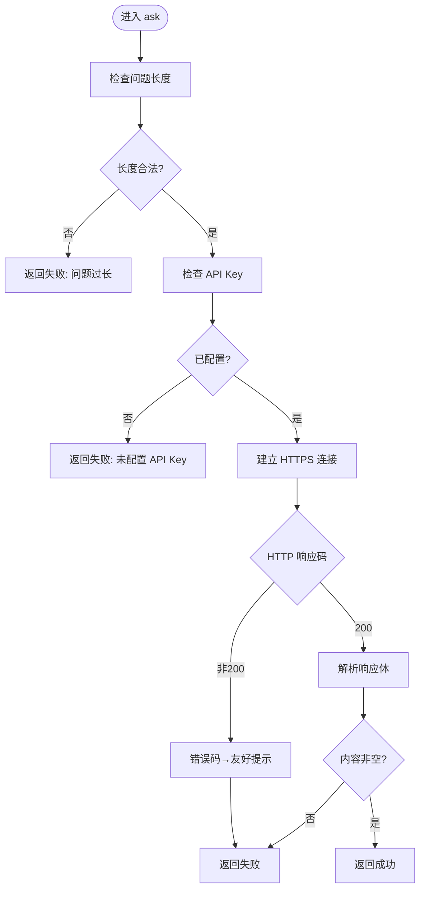
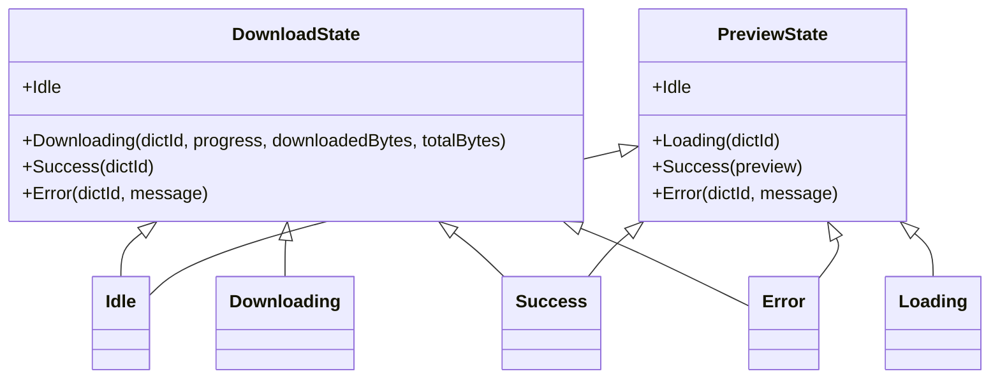
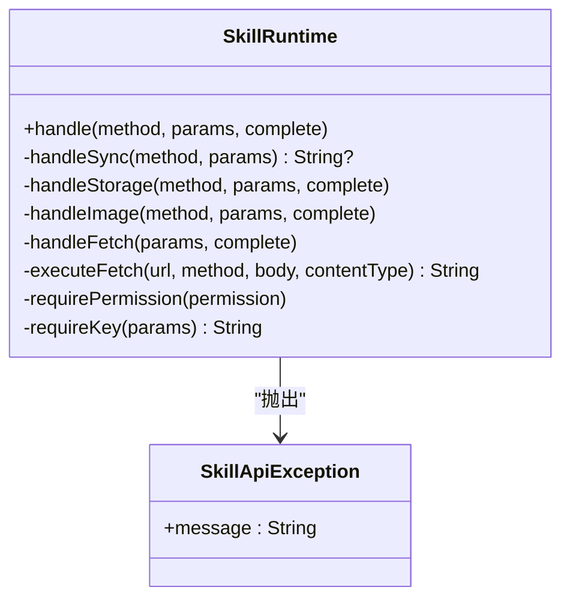
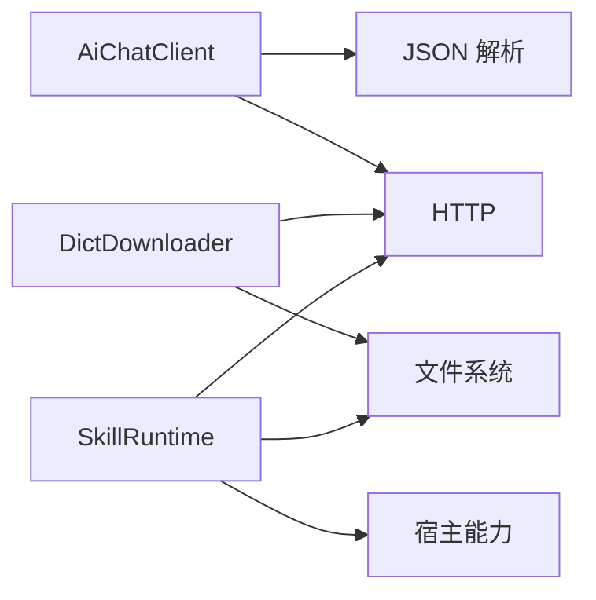

# 错误处理

<cite>
**本文引用的文件**   
- [AiChatClient.kt](file://app/src/main/java/com/ziyou/ime/ai/AiChatClient.kt)
- [DictDownloader.kt](file://app/src/main/java/com/ziyou/ime/dict/DictDownloader.kt)
- [DictModels.kt](file://app/src/main/java/com/ziyou/ime/dict/DictModels.kt)
- [SkillRuntime.kt](file://app/src/main/java/com/ziyou/ime/skill/SkillRuntime.kt)
- [AssetDeployer.kt](file://app/src/main/java/com/ziyou/ime/config/AssetDeployer.kt)
- [KnowledgeImporter.kt](file://app/src/main/java/com/ziyou/ime/ai/knowledge/KnowledgeImporter.kt)
- [KnowledgeRepository.kt](file://app/src/main/java/com/ziyou/ime/ai/knowledge/KnowledgeRepository.kt)
- [AiMemoryStore.kt](file://app/src/main/java/com/ziyou/ime/ai/knowledge/AiMemoryStore.kt)
- [PersonaRepository.kt](file://app/src/main/java/com/ziyou/ime/ai/PersonaRepository.kt)
</cite>

## 目录
1. [简介](#简介)
2. [项目结构](#项目结构)
3. [核心组件](#核心组件)
4. [架构总览](#架构总览)
5. [详细组件分析](#详细组件分析)
6. [依赖关系分析](#依赖关系分析)
7. [性能考量](#性能考量)
8. [故障排查指南](#故障排查指南)
9. [结论](#结论)
10. [附录](#附录)

## 简介
本文件系统化梳理字由输入法在 API 调用、网络请求、资源部署与技能运行时等关键路径中的错误处理机制，覆盖：
- API 返回格式约定（统一 Result/状态封装）
- 错误码定义与友好提示映射
- 异常捕获策略（try-catch、Result、协程恢复）
- 常见错误类型与解决方案
- 调试技巧与日志分析方法
- 错误监控与上报最佳实践

## 项目结构
错误处理相关代码主要分布在以下模块：
- AI 对话客户端：网络请求、鉴权、响应解析、错误友好化
- 词库下载器：可信连接、重定向控制、完整性校验、超限保护
- 技能运行时：权限校验、参数校验、限额控制、统一异常类型
- 配置与资源部署：版本比较、复制失败、异常记录
- 知识导入与存储：IO 异常、权限异常、序列化异常

图表来源
- [AiChatClient.kt:65-114](file://app/src/main/java/com/ziyou/ime/ai/AiChatClient.kt#L65-L114)
- [DictDownloader.kt:54-78](file://app/src/main/java/com/ziyou/ime/dict/DictDownloader.kt#L54-L78)
- [SkillRuntime.kt:142-157](file://app/src/main/java/com/ziyou/ime/skill/SkillRuntime.kt#L142-L157)
- [AssetDeployer.kt:80-90](file://app/src/main/java/com/ziyou/ime/config/AssetDeployer.kt#L80-L90)
- [KnowledgeImporter.kt:81-88](file://app/src/main/java/com/ziyou/ime/ai/knowledge/KnowledgeImporter.kt#L81-L88)
- [KnowledgeRepository.kt:59-65](file://app/src/main/java/com/ziyou/ime/ai/knowledge/KnowledgeRepository.kt#L59-L65)
- [AiMemoryStore.kt:67-74](file://app/src/main/java/com/ziyou/ime/ai/knowledge/AiMemoryStore.kt#L67-L74)
- [PersonaRepository.kt:113-126](file://app/src/main/java/com/ziyou/ime/ai/PersonaRepository.kt#L113-L126)

章节来源
- [AiChatClient.kt:1-194](file://app/src/main/java/com/ziyou/ime/ai/AiChatClient.kt#L1-L194)
- [DictDownloader.kt:1-367](file://app/src/main/java/com/ziyou/ime/dict/DictDownloader.kt#L1-L367)
- [SkillRuntime.kt:1-521](file://app/src/main/java/com/ziyou/ime/skill/SkillRuntime.kt#L1-L521)
- [AssetDeployer.kt:1-150](file://app/src/main/java/com/ziyou/ime/config/AssetDeployer.kt#L1-L150)
- [KnowledgeImporter.kt:1-150](file://app/src/main/java/com/ziyou/ime/ai/knowledge/KnowledgeImporter.kt#L1-L150)
- [KnowledgeRepository.kt:1-120](file://app/src/main/java/com/ziyou/ime/ai/knowledge/KnowledgeRepository.kt#L1-L120)
- [AiMemoryStore.kt:1-120](file://app/src/main/java/com/ziyou/ime/ai/knowledge/AiMemoryStore.kt#L1-L120)
- [PersonaRepository.kt:1-140](file://app/src/main/java/com/ziyou/ime/ai/PersonaRepository.kt#L1-L140)

## 核心组件
- 统一返回与状态封装
  - AI 客户端使用 Result<String> 承载成功/失败，失败携带用户可读消息的 IOException。
  - 词库下载器以 null 表示失败，配合上层状态模型封装错误信息。
  - 技能运行时抛出 SkillApiException 作为统一的业务异常类型，透传给脚本侧 reject。
  - 词库预览/下载状态通过 sealed class 的 Error/Failed 分支表达错误。
- 错误码与友好提示
  - HTTP 错误码到用户提示的映射（如 401/403、429、5xx）。
  - 自定义限制（长度、并发、频率、响应大小）转换为明确错误信息。
- 异常捕获策略
  - try-catch 区分 IO 异常与通用异常，统一记录日志并包装为友好错误。
  - 协程中使用 withContext(Dispatchers.IO) 隔离 IO，避免阻塞主线程。
  - runCatching/recoverCatching 用于局部恢复与错误转换。

章节来源
- [AiChatClient.kt:65-114](file://app/src/main/java/com/ziyou/ime/ai/AiChatClient.kt#L65-L114)
- [DictModels.kt:78-91](file://app/src/main/java/com/ziyou/ime/dict/DictModels.kt#L78-L91)
- [SkillRuntime.kt:27-29](file://app/src/main/java/com/ziyou/ime/skill/SkillRuntime.kt#L27-L29)
- [SkillRuntime.kt:142-157](file://app/src/main/java/com/ziyou/ime/skill/SkillRuntime.kt#L142-L157)

## 架构总览
错误处理贯穿“调用方—能力层—外部依赖”三层：
- 调用方：UI/ViewModel 接收 Result/状态对象，展示友好提示或重试。
- 能力层：封装网络、IO、权限、参数校验，抛出结构化异常或返回 Result。
- 外部依赖：HTTP 服务、文件系统、剪贴板、相册等，异常被捕获并转译为可解释的错误。

图表来源
- [AiChatClient.kt:65-114](file://app/src/main/java/com/ziyou/ime/ai/AiChatClient.kt#L65-L114)
- [AiChatClient.kt:170-175](file://app/src/main/java/com/ziyou/ime/ai/AiChatClient.kt#L170-L175)

章节来源
- [AiChatClient.kt:65-114](file://app/src/main/java/com/ziyou/ime/ai/AiChatClient.kt#L65-L114)
- [AiChatClient.kt:170-175](file://app/src/main/java/com/ziyou/ime/ai/AiChatClient.kt#L170-L175)

## 详细组件分析

### AI 对话客户端（AiChatClient）
- 错误返回格式
  - 成功：Result.success(String)
  - 失败：Result.failure(IOException)，message 为用户可读提示
- 错误码定义与映射
  - 401/403 → 鉴权失败
  - 429 → 请求过于频繁或额度不足
  - 5xx → 服务不可用
  - 其他 → 请求失败（含 HTTP 码）
- 异常处理策略
  - 参数校验（问题长度、API Key）直接返回失败
  - 网络 IO 异常捕获并记录日志，包装为友好错误
  - 响应体读取超限保护，防止内存耗尽
  - 解析失败返回空，再转为失败结果
- 调试与日志
  - 关键路径均记录 Log.e，包含响应码、错误体片段、异常堆栈

图表来源
- [AiChatClient.kt:65-114](file://app/src/main/java/com/ziyou/ime/ai/AiChatClient.kt#L65-L114)
- [AiChatClient.kt:170-175](file://app/src/main/java/com/ziyou/ime/ai/AiChatClient.kt#L170-L175)

章节来源
- [AiChatClient.kt:65-114](file://app/src/main/java/com/ziyou/ime/ai/AiChatClient.kt#L65-L114)
- [AiChatClient.kt:170-175](file://app/src/main/java/com/ziyou/ime/ai/AiChatClient.kt#L170-L175)

### 词库下载器（DictDownloader）
- 错误返回格式
  - 成功：返回 File/null（成功时返回文件），失败返回 null
  - 错误信息通过日志与上层状态模型（DownloadState.Error/PreviewState.Error）传递
- 安全与限制
  - 强制 HTTPS，域名白名单校验，受控重定向（最多 N 跳）
  - 响应/文件大小上限保护，超限抛异常并清理半成品
  - SHA-256 完整性校验，不匹配则删除并拒绝安装
- 异常处理策略
  - IO 异常与通用异常分别捕获，记录详细日志
  - 非法 id/不可信 URL 直接丢弃，避免进入后续流程
- 调试与日志
  - 拉取 catalog、下载、预览各阶段均有错误日志

图表来源
- [DictModels.kt:78-91](file://app/src/main/java/com/ziyou/ime/dict/DictModels.kt#L78-L91)
- [DictModels.kt:107-112](file://app/src/main/java/com/ziyou/ime/dict/DictModels.kt#L107-L112)

章节来源
- [DictDownloader.kt:54-78](file://app/src/main/java/com/ziyou/ime/dict/DictDownloader.kt#L54-L78)
- [DictDownloader.kt:87-162](file://app/src/main/java/com/ziyou/ime/dict/DictDownloader.kt#L87-L162)
- [DictDownloader.kt:170-202](file://app/src/main/java/com/ziyou/ime/dict/DictDownloader.kt#L170-L202)
- [DictDownloader.kt:262-295](file://app/src/main/java/com/ziyou/ime/dict/DictDownloader.kt#L262-L295)
- [DictModels.kt:78-91](file://app/src/main/java/com/ziyou/ime/dict/DictModels.kt#L78-L91)
- [DictModels.kt:107-112](file://app/src/main/java/com/ziyou/ime/dict/DictModels.kt#L107-L112)

### 技能运行时（SkillRuntime）
- 错误返回格式
  - 同步方法：runCatching 包裹，失败传 SkillApiException
  - 异步方法（storage/image/fetch）：complete(Result<String?>) 回调，失败传 SkillApiException
- 错误码与限制
  - 权限拒绝：manifest 未声明所需权限
  - 参数错误：key 为空、URL 非法、图片数据无效等
  - 限额超限：文本长度、存储大小、响应大小、并发数、频率
- 异常处理策略
  - 统一 SkillApiException 作为业务异常，透传给脚本侧 reject
  - 网络 fetch 代理：禁用自动重定向，严格白名单；响应体限流
  - 图片处理：base64 解码、PNG 魔数校验、写入/相册插入异常捕获
- 调试与日志
  - 关键失败点记录警告/错误日志，便于定位

图表来源
- [SkillRuntime.kt:142-157](file://app/src/main/java/com/ziyou/ime/skill/SkillRuntime.kt#L142-L157)
- [SkillRuntime.kt:27-29](file://app/src/main/java/com/ziyou/ime/skill/SkillRuntime.kt#L27-L29)
- [SkillRuntime.kt:374-427](file://app/src/main/java/com/ziyou/ime/skill/SkillRuntime.kt#L374-L427)

章节来源
- [SkillRuntime.kt:142-157](file://app/src/main/java/com/ziyou/ime/skill/SkillRuntime.kt#L142-L157)
- [SkillRuntime.kt:243-284](file://app/src/main/java/com/ziyou/ime/skill/SkillRuntime.kt#L243-L284)
- [SkillRuntime.kt:286-332](file://app/src/main/java/com/ziyou/ime/skill/SkillRuntime.kt#L286-L332)
- [SkillRuntime.kt:374-427](file://app/src/main/java/com/ziyou/ime/skill/SkillRuntime.kt#L374-L427)
- [SkillRuntime.kt:429-471](file://app/src/main/java/com/ziyou/ime/skill/SkillRuntime.kt#L429-L471)

### 配置与资源部署（AssetDeployer）
- 错误处理策略
  - 资源部署失败记录错误日志，包含异常堆栈
  - 版本号获取失败记录错误日志
- 调试与日志
  - 部署开始/完成/失败均有日志输出，便于追踪

章节来源
- [AssetDeployer.kt:80-90](file://app/src/main/java/com/ziyou/ime/config/AssetDeployer.kt#L80-L90)
- [AssetDeployer.kt:140-150](file://app/src/main/java/com/ziyou/ime/config/AssetDeployer.kt#L140-L150)

### 知识导入与存储（KnowledgeImporter / KnowledgeRepository / AiMemoryStore / PersonaRepository）
- 错误处理策略
  - IO 异常（SecurityException、IOException）捕获并记录日志
  - 反序列化失败捕获并记录日志，保留旧数据或降级
- 调试与日志
  - 导入失败、保存失败、读取 chunk 失败均有详细日志

章节来源
- [KnowledgeImporter.kt:81-88](file://app/src/main/java/com/ziyou/ime/ai/knowledge/KnowledgeImporter.kt#L81-L88)
- [KnowledgeRepository.kt:59-65](file://app/src/main/java/com/ziyou/ime/ai/knowledge/KnowledgeRepository.kt#L59-L65)
- [AiMemoryStore.kt:67-74](file://app/src/main/java/com/ziyou/ime/ai/knowledge/AiMemoryStore.kt#L67-L74)
- [PersonaRepository.kt:113-126](file://app/src/main/java/com/ziyou/ime/ai/PersonaRepository.kt#L113-L126)

## 依赖关系分析
- 组件耦合
  - AiChatClient 依赖网络与 JSON 解析，错误集中在 IO 与解析层
  - DictDownloader 依赖 HTTP 与文件系统，错误集中在连接、传输、校验
  - SkillRuntime 依赖宿主能力（输入、剪贴板、相册），错误集中在权限、参数、IO
- 外部依赖
  - HTTP 服务（AI 端点、词库源）、文件系统、系统服务（剪贴板、相册）
- 循环依赖
  - 未发现循环依赖，职责边界清晰

图表来源
- [AiChatClient.kt:65-114](file://app/src/main/java/com/ziyou/ime/ai/AiChatClient.kt#L65-L114)
- [DictDownloader.kt:54-78](file://app/src/main/java/com/ziyou/ime/dict/DictDownloader.kt#L54-L78)
- [SkillRuntime.kt:374-427](file://app/src/main/java/com/ziyou/ime/skill/SkillRuntime.kt#L374-L427)

章节来源
- [AiChatClient.kt:65-114](file://app/src/main/java/com/ziyou/ime/ai/AiChatClient.kt#L65-L114)
- [DictDownloader.kt:54-78](file://app/src/main/java/com/ziyou/ime/dict/DictDownloader.kt#L54-L78)
- [SkillRuntime.kt:374-427](file://app/src/main/java/com/ziyou/ime/skill/SkillRuntime.kt#L374-L427)

## 性能考量
- 网络超时与限流
  - 连接/读取超时合理设置，避免长时间阻塞
  - 技能 fetch 并发与频率限制，防止资源耗尽
- 响应体大小限制
  - AI 响应、词库下载、技能 fetch 均有限制，防止内存/磁盘耗尽
- IO 隔离
  - 所有 IO 操作切至 Dispatchers.IO，避免阻塞主线程
- 缓存与串行化
  - storage 使用单并发调度器保证顺序，减少竞争

## 故障排查指南
- 常见问题与解决
  - AI 鉴权失败：检查 API Key 是否正确配置
  - 请求过于频繁：等待后重试或降低频率
  - 服务不可用：稍后重试或更换端点
  - 词库下载失败：检查网络、域名白名单、SHA-256 校验
  - 技能权限拒绝：确认 manifest 声明对应权限
  - 图片发送失败：确认输入框支持图片且 PNG 魔数正确
- 日志分析方法
  - 关注 Log.e/w 的关键标签（AiChatClient、DictDownloader、SkillRuntime、AssetDeployer）
  - 查看异常堆栈与错误码，定位具体阶段（连接、解析、写入）
- 调试技巧
  - 使用最小复现用例，逐步缩小范围
  - 临时放宽限制（如响应大小）验证是否为限制造成
  - 打印关键中间值（URL、响应码、文件大小）辅助定位

章节来源
- [AiChatClient.kt:92-110](file://app/src/main/java/com/ziyou/ime/ai/AiChatClient.kt#L92-L110)
- [DictDownloader.kt:151-161](file://app/src/main/java/com/ziyou/ime/dict/DictDownloader.kt#L151-L161)
- [SkillRuntime.kt:418-427](file://app/src/main/java/com/ziyou/ime/skill/SkillRuntime.kt#L418-L427)
- [AssetDeployer.kt:80-90](file://app/src/main/java/com/ziyou/ime/config/AssetDeployer.kt#L80-L90)

## 结论
本项目在错误处理方面形成了统一而清晰的规范：
- 返回格式统一（Result/状态封装/统一异常）
- 错误码友好化（HTTP 码映射、限制提示）
- 异常捕获分层（IO 异常与通用异常分离）
- 安全与限制（HTTPS、白名单、大小/并发/频率限制）
- 日志完善（关键路径记录错误与堆栈）

建议继续强化：
- 集中式错误上报（聚合日志到后端）
- 错误分类与度量（按模块/错误码统计）
- 用户反馈闭环（错误提示引导修复）

## 附录
- API 调用错误返回格式
  - AI 客户端：Result<String>，失败携带 IOException
  - 词库下载：null 表示失败，错误信息通过状态模型传递
  - 技能运行时：SkillApiException 统一业务异常
- 常见错误码与提示
  - 401/403 → 鉴权失败
  - 429 → 请求过于频繁或额度不足
  - 5xx → 服务不可用
  - 自定义限制 → 明确提示（长度、并发、频率、大小）
- 调试与上报最佳实践
  - 统一日志标签与级别
  - 上报错误上下文（时间、设备、操作路径）
  - 定期分析错误趋势，优化用户体验