# 安全机制

<cite>
**本文引用的文件**   
- [SkillWebViewFactory.kt](file://app/src/main/java/com/ziyou/ime/skill/SkillWebViewFactory.kt)
- [SkillRuntime.kt](file://app/src/main/java/com/ziyou/ime/skill/SkillRuntime.kt)
- [SkillBridge.kt](file://app/src/main/java/com/ziyou/ime/skill/SkillBridge.kt)
- [SkillManager.kt](file://app/src/main/java/com/ziyou/ime/skill/SkillManager.kt)
- [SkillPackageInstaller.kt](file://app/src/main/java/com/ziyou/ime/skill/SkillPackageInstaller.kt)
- [SkillManifestParser.kt](file://app/src/main/java/com/ziyou/ime/skill/SkillManifestParser.kt)
- [SkillPanelCoordinator.kt](file://app/src/main/java/com/ziyou/ime/ime/SkillPanelCoordinator.kt)
- [SkillManifestValidator.kt](file://core-logic/src/main/java/com/ziyou/ime/core/skill/SkillManifestValidator.kt)
- [SkillPermission.kt](file://core-logic/src/main/java/com/ziyou/ime/core/skill/SkillPermission.kt)
- [ZipEntryValidator.kt](file://core-logic/src/main/java/com/ziyou/ime/core/skill/ZipEntryValidator.kt)
- [imeskill.js](file://app/src/main/assets/skill_runtime/imeskill.js)
</cite>

## 目录
1. [简介](#简介)
2. [项目结构](#项目结构)
3. [核心组件](#核心组件)
4. [架构总览](#架构总览)
5. [详细组件分析](#详细组件分析)
6. [依赖关系分析](#依赖关系分析)
7. [性能考量](#性能考量)
8. [故障排查指南](#故障排查指南)
9. [结论](#结论)
10. [附录](#附录)

## 简介
本文件面向技能插件系统的安全机制，系统性阐述 WebView 沙箱、权限模型、安全校验规则、反钓鱼与崩溃隔离等关键设计。目标是帮助开发者理解并正确使用技能运行时能力，同时为审核与维护提供可追溯的依据。

## 项目结构
技能安全相关代码主要分布在 app 层的 skill 包与 core-logic 的 skill 模块中：
- WebView 沙箱与资源拦截：SkillWebViewFactory
- Bridge 单入口与线程切换：SkillBridge
- 运行时能力（存储、网络代理、图片输出、剪贴板、输入路由）：SkillRuntime
- 安装器与包体校验：SkillPackageInstaller
- Manifest 解析与校验：SkillManifestParser、SkillManifestValidator
- 权限枚举：SkillPermission
- 路径与包体限制：ZipEntryValidator
- 面板布局与宿主交互：SkillPanelCoordinator
- JS 垫片与 API 暴露：imeskill.js

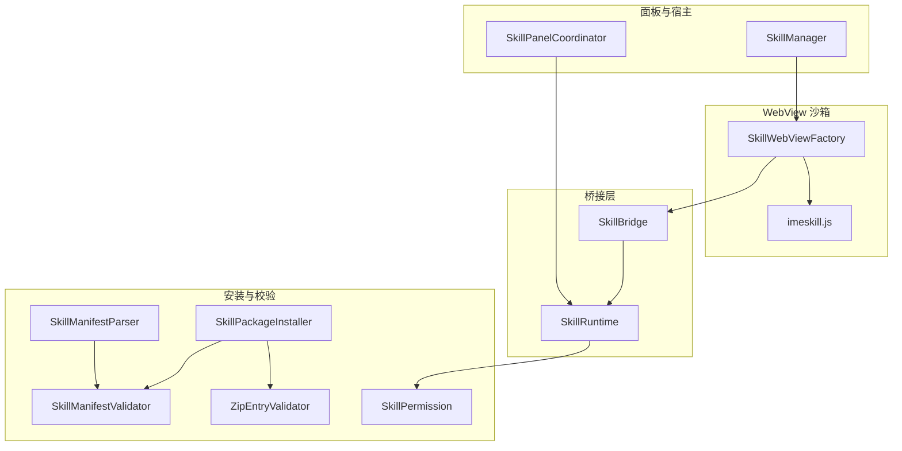

图表来源
- [SkillWebViewFactory.kt:1-205](file://app/src/main/java/com/ziyou/ime/skill/SkillWebViewFactory.kt#L1-L205)
- [SkillBridge.kt:1-99](file://app/src/main/java/com/ziyou/ime/skill/SkillBridge.kt#L1-L99)
- [SkillRuntime.kt:1-521](file://app/src/main/java/com/ziyou/ime/skill/SkillRuntime.kt#L1-L521)
- [SkillPackageInstaller.kt:1-194](file://app/src/main/java/com/ziyou/ime/skill/SkillPackageInstaller.kt#L1-L194)
- [SkillManifestParser.kt:1-73](file://app/src/main/java/com/ziyou/ime/skill/SkillManifestParser.kt#L1-L73)
- [SkillManifestValidator.kt:1-78](file://core-logic/src/main/java/com/ziyou/ime/core/skill/SkillManifestValidator.kt#L1-L78)
- [ZipEntryValidator.kt:1-37](file://core-logic/src/main/java/com/ziyou/ime/core/skill/ZipEntryValidator.kt#L1-L37)
- [SkillPermission.kt:1-27](file://core-logic/src/main/java/com/ziyou/ime/core/skill/SkillPermission.kt#L1-L27)
- [SkillPanelCoordinator.kt:1-257](file://app/src/main/java/com/ziyou/ime/ime/SkillPanelCoordinator.kt#L1-L257)
- [SkillManager.kt:1-110](file://app/src/main/java/com/ziyou/ime/skill/SkillManager.kt#L1-L110)
- [imeskill.js:1-164](file://app/src/main/assets/skill_runtime/imeskill.js#L1-L164)

章节来源
- [SkillWebViewFactory.kt:1-205](file://app/src/main/java/com/ziyou/ime/skill/SkillWebViewFactory.kt#L1-L205)
- [SkillBridge.kt:1-99](file://app/src/main/java/com/ziyou/ime/skill/SkillBridge.kt#L1-L99)
- [SkillRuntime.kt:1-521](file://app/src/main/java/com/ziyou/ime/skill/SkillRuntime.kt#L1-L521)
- [SkillPackageInstaller.kt:1-194](file://app/src/main/java/com/ziyou/ime/skill/SkillPackageInstaller.kt#L1-L194)
- [SkillManifestParser.kt:1-73](file://app/src/main/java/com/ziyou/ime/skill/SkillManifestParser.kt#L1-L73)
- [SkillManifestValidator.kt:1-78](file://core-logic/src/main/java/com/ziyou/ime/core/skill/SkillManifestValidator.kt#L1-L78)
- [ZipEntryValidator.kt:1-37](file://core-logic/src/main/java/com/ziyou/ime/core/skill/ZipEntryValidator.kt#L1-L37)
- [SkillPermission.kt:1-27](file://core-logic/src/main/java/com/ziyou/ime/core/skill/SkillPermission.kt#L1-L27)
- [SkillPanelCoordinator.kt:1-257](file://app/src/main/java/com/ziyou/ime/ime/SkillPanelCoordinator.kt#L1-L257)
- [SkillManager.kt:1-110](file://app/src/main/java/com/ziyou/ime/skill/SkillManager.kt#L1-L110)
- [imeskill.js:1-164](file://app/src/main/assets/skill_runtime/imeskill.js#L1-L164)

## 核心组件
- WebView 工厂与安全基线：统一创建 WebView，关闭文件系统/内容访问、禁用缓存与多窗口，仅允许虚拟域名下的技能包内资源；HTML 响应附加 CSP 头；渲染进程崩溃回调销毁面板以保护 IME 主进程。
- JS 垫片与 Bridge：通过 DOCUMENT_START_SCRIPT 或回退 onPageStarted 注入垫片，统一 postMessage 单入口，全异步 Promise 调用，避免多方法直暴与同步返回风险。
- 运行时能力：按方法分类处理 storage、image、fetch、clipboard、input 路由等，所有敏感能力均进行权限检查与参数校验，并对 fetch 做白名单、超时、大小、频控与并发限制。
- 安装器与校验：两段式安装，先 inspect 再 commit，严格校验包大小、条目数、路径安全、manifest 合法性与冲突升级策略，支持原子替换与回滚。
- 面板协调器：管理三态布局（键盘叠层/提升挂载/收缩态），控制 z 序与位置，确保面板不遮挡宿主角标，且仅在非悬浮模式下可用。

章节来源
- [SkillWebViewFactory.kt:1-205](file://app/src/main/java/com/ziyou/ime/skill/SkillWebViewFactory.kt#L1-L205)
- [SkillBridge.kt:1-99](file://app/src/main/java/com/ziyou/ime/skill/SkillBridge.kt#L1-L99)
- [SkillRuntime.kt:1-521](file://app/src/main/java/com/ziyou/ime/skill/SkillRuntime.kt#L1-L521)
- [SkillPackageInstaller.kt:1-194](file://app/src/main/java/com/ziyou/ime/skill/SkillPackageInstaller.kt#L1-L194)
- [SkillPanelCoordinator.kt:1-257](file://app/src/main/java/com/ziyou/ime/ime/SkillPanelCoordinator.kt#L1-L257)

## 架构总览
技能插件运行在受控 WebView 沙箱中，JS 通过唯一 Bridge 接口与宿主通信，宿主侧 Runtime 负责权限与能力实现，安装阶段由安装器与校验器保障包体与 manifest 安全，面板协调器负责 UI 安全与布局约束。

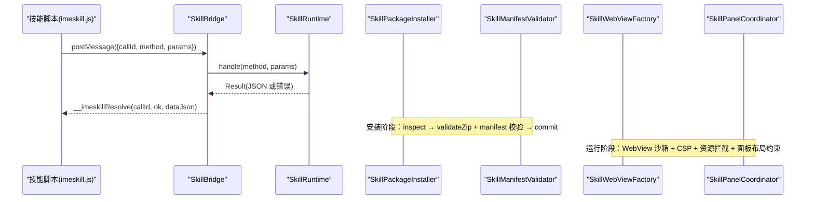

图表来源
- [SkillBridge.kt:1-99](file://app/src/main/java/com/ziyou/ime/skill/SkillBridge.kt#L1-L99)
- [SkillRuntime.kt:1-521](file://app/src/main/java/com/ziyou/ime/skill/SkillRuntime.kt#L1-L521)
- [SkillPackageInstaller.kt:1-194](file://app/src/main/java/com/ziyou/ime/skill/SkillPackageInstaller.kt#L1-L194)
- [SkillManifestValidator.kt:1-78](file://core-logic/src/main/java/com/ziyou/ime/core/skill/SkillManifestValidator.kt#L1-L78)
- [SkillWebViewFactory.kt:1-205](file://app/src/main/java/com/ziyou/ime/skill/SkillWebViewFactory.kt#L1-L205)
- [SkillPanelCoordinator.kt:1-257](file://app/src/main/java/com/ziyou/ime/ime/SkillPanelCoordinator.kt#L1-L257)
- [imeskill.js:1-164](file://app/src/main/assets/skill_runtime/imeskill.js#L1-L164)

## 详细组件分析

### WebView 沙箱与环境隔离
- 资源拦截：仅放行虚拟域名下映射到技能包内的资源，其余请求一律返回空响应；HTML 响应附加 CSP 头收紧脚本与连接策略。
- 访问限制：关闭 allowFileAccess/allowContentAccess/domStorage，禁用地理定位与多窗口，禁止自动打开新窗口。
- 首帧可见性：首帧提交前隐藏 WebView，避免黑屏闪烁；页面提交或结束时恢复可见。
- 崩溃隔离：onRenderProcessGone 回调销毁面板，IME 主进程继续存活。

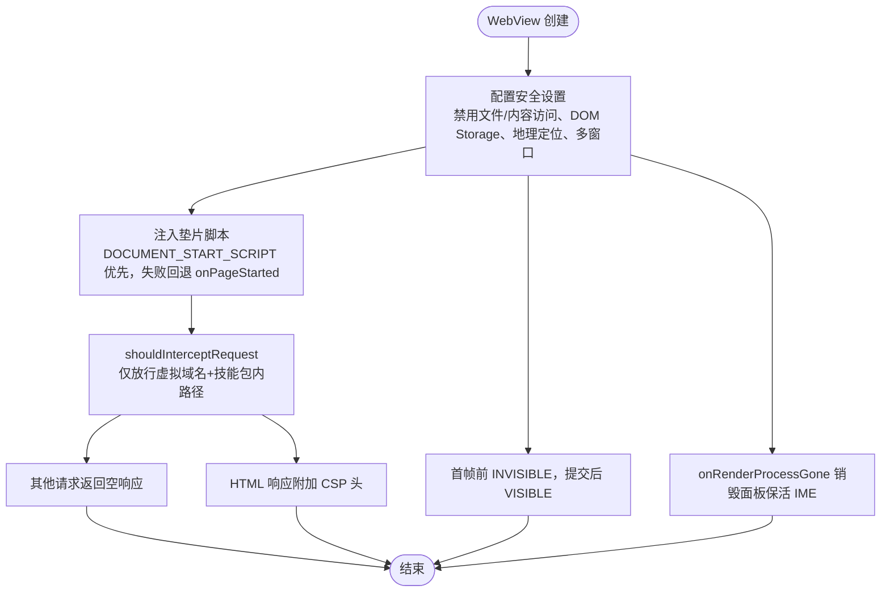

图表来源
- [SkillWebViewFactory.kt:1-205](file://app/src/main/java/com/ziyou/ime/skill/SkillWebViewFactory.kt#L1-L205)
- [ZipEntryValidator.kt:1-37](file://core-logic/src/main/java/com/ziyou/ime/core/skill/ZipEntryValidator.kt#L1-L37)

章节来源
- [SkillWebViewFactory.kt:1-205](file://app/src/main/java/com/ziyou/ime/skill/SkillWebViewFactory.kt#L1-L205)

### 权限模型与用户确认流程
- 权限声明：manifest 中声明 permissions 与 networkDomains；未知权限或非法域名将导致安装失败。
- 运行时检查：Runtime 对每个敏感方法执行 requirePermission，未声明则拒绝并返回错误。
- 用户确认：安装器 inspect 阶段生成 PendingInstall，UI 展示权限与冲突信息，用户确认后 commit 落盘；取消则 abort 清理临时文件。

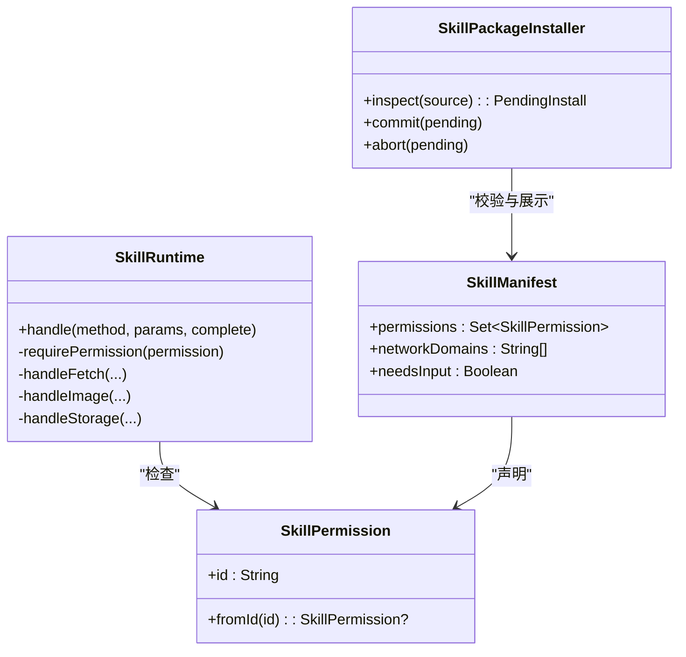

图表来源
- [SkillPermission.kt:1-27](file://core-logic/src/main/java/com/ziyou/ime/core/skill/SkillPermission.kt#L1-L27)
- [SkillManifest.kt:1-51](file://core-logic/src/main/java/com/ziyou/ime/core/skill/SkillManifest.kt#L1-L51)
- [SkillRuntime.kt:1-521](file://app/src/main/java/com/ziyou/ime/skill/SkillRuntime.kt#L1-L521)
- [SkillPackageInstaller.kt:1-194](file://app/src/main/java/com/ziyou/ime/skill/SkillPackageInstaller.kt#L1-L194)

章节来源
- [SkillRuntime.kt:1-521](file://app/src/main/java/com/ziyou/ime/skill/SkillRuntime.kt#L1-L521)
- [SkillPackageInstaller.kt:1-194](file://app/src/main/java/com/ziyou/ime/skill/SkillPackageInstaller.kt#L1-L194)
- [SkillManifestParser.kt:1-73](file://app/src/main/java/com/ziyou/ime/skill/SkillManifestParser.kt#L1-L73)
- [SkillManifestValidator.kt:1-78](file://core-logic/src/main/java/com/ziyou/ime/core/skill/SkillManifestValidator.kt#L1-L78)
- [SkillPermission.kt:1-27](file://core-logic/src/main/java/com/ziyou/ime/core/skill/SkillPermission.kt#L1-L27)

### 安全校验规则（manifest、路径、包体）
- manifest 校验：版本、id 格式、名称长度、版本号格式、minHostApi 上限、入口路径安全且为 .html、networkDomains 与权限一致性、域名格式与数量限制。
- 路径安全：ZipEntryValidator 拒绝绝对路径、反斜杠、盘符冒号、.. / . 段、超长路径与 NUL 字符；WebView 资源读取时二次校验。
- 包体限制：最大包大小、条目数上限、单条目路径长度上限；安装器解压前预检磁盘空间，异常早失败。

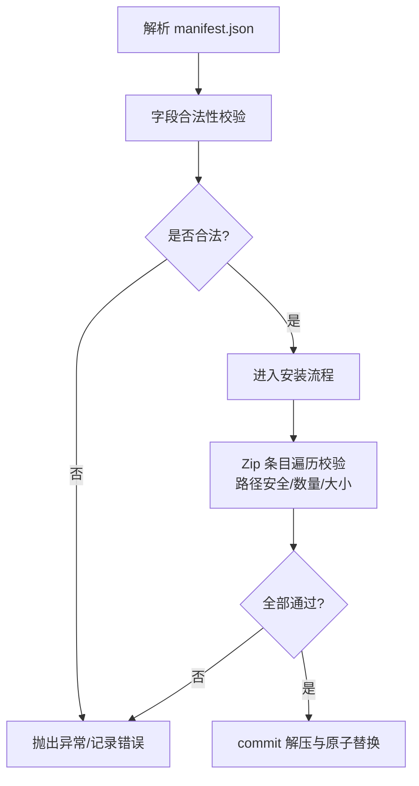

图表来源
- [SkillManifestValidator.kt:1-78](file://core-logic/src/main/java/com/ziyou/ime/core/skill/SkillManifestValidator.kt#L1-L78)
- [ZipEntryValidator.kt:1-37](file://core-logic/src/main/java/com/ziyou/ime/core/skill/ZipEntryValidator.kt#L1-L37)
- [SkillPackageInstaller.kt:1-194](file://app/src/main/java/com/ziyou/ime/skill/SkillPackageInstaller.kt#L1-L194)
- [SkillManifestParser.kt:1-73](file://app/src/main/java/com/ziyou/ime/skill/SkillManifestParser.kt#L1-L73)

章节来源
- [SkillManifestValidator.kt:1-78](file://core-logic/src/main/java/com/ziyou/ime/core/skill/SkillManifestValidator.kt#L1-L78)
- [ZipEntryValidator.kt:1-37](file://core-logic/src/main/java/com/ziyou/ime/core/skill/ZipEntryValidator.kt#L1-L37)
- [SkillPackageInstaller.kt:1-194](file://app/src/main/java/com/ziyou/ime/skill/SkillPackageInstaller.kt#L1-L194)
- [SkillManifestParser.kt:1-73](file://app/src/main/java/com/ziyou/ime/skill/SkillManifestParser.kt#L1-L73)

### 反钓鱼机制（宿主目标绘制、z序控制、面板位置限制）
- 宿主目标绘制：面板仅在非悬浮模式打开，避免窄面板误触；面板初始挂载于键盘容器覆盖区域，提升挂载时置于内容根顶部（编码区上方）。
- z序控制：面板作为子视图插入对应容器，保证层级正确；关闭时移除视图并复位可见性。
- 面板位置限制：高度比例钳制，默认紧凑高度；收缩态接管键盘与候选区高度但保持窗口总高不变；面板不可遮挡宿主页面的关键控件（如“技”键入口）。

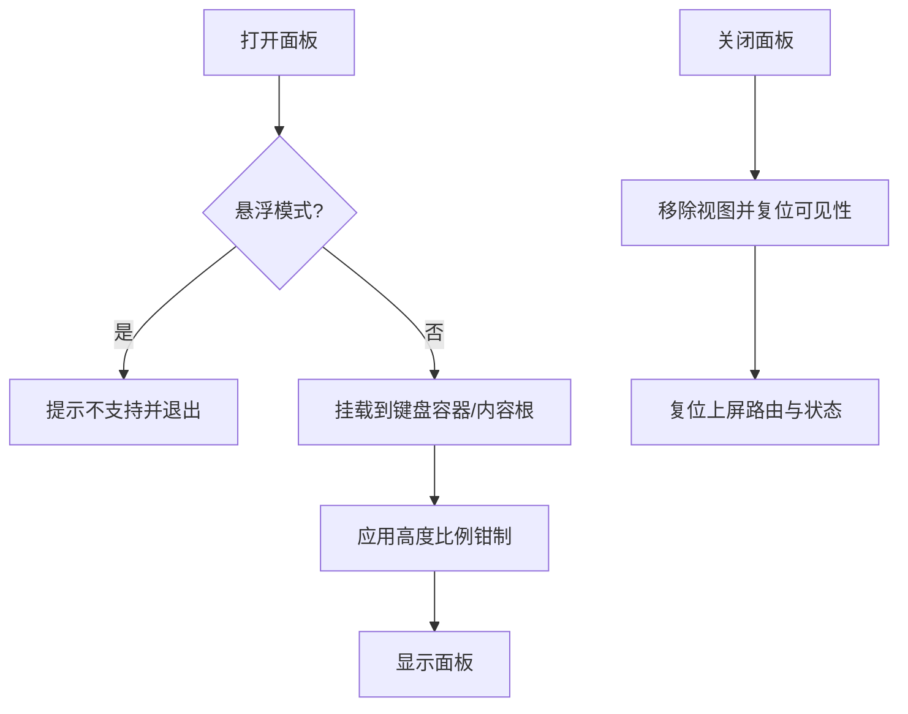

图表来源
- [SkillPanelCoordinator.kt:1-257](file://app/src/main/java/com/ziyou/ime/ime/SkillPanelCoordinator.kt#L1-L257)
- [SkillManager.kt:1-110](file://app/src/main/java/com/ziyou/ime/skill/SkillManager.kt#L1-L110)

章节来源
- [SkillPanelCoordinator.kt:1-257](file://app/src/main/java/com/ziyou/ime/ime/SkillPanelCoordinator.kt#L1-L257)

### 崩溃隔离机制
- WebView 渲染进程崩溃：onRenderProcessGone 回调销毁面板，IME 主进程不受影响。
- Bridge 异常兜底：所有异常捕获并返回通用错误消息，防止技能脚本崩溃波及宿主。
- 协程域释放：面板关闭时取消未完成请求，避免悬空任务。

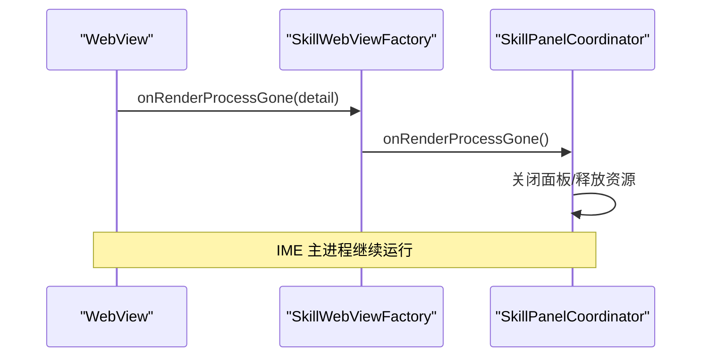

图表来源
- [SkillWebViewFactory.kt:1-205](file://app/src/main/java/com/ziyou/ime/skill/SkillWebViewFactory.kt#L1-L205)
- [SkillPanelCoordinator.kt:1-257](file://app/src/main/java/com/ziyou/ime/ime/SkillPanelCoordinator.kt#L1-L257)

章节来源
- [SkillWebViewFactory.kt:1-205](file://app/src/main/java/com/ziyou/ime/skill/SkillWebViewFactory.kt#L1-L205)
- [SkillBridge.kt:1-99](file://app/src/main/java/com/ziyou/ime/skill/SkillBridge.kt#L1-L99)
- [SkillRuntime.kt:1-521](file://app/src/main/java/com/ziyou/ime/skill/SkillRuntime.kt#L1-L521)

### 网络请求代理与限制
- 强制 HTTPS：协议校验失败直接拒绝。
- 域名白名单：精确匹配（IDN/punycode 归一化小写），防同形域名绕过。
- 超时与大小：连接与读取超时固定值；响应体上限 1MB。
- 频控与并发：滑动窗口 30 次/分钟；并发上限 2。
- 禁重定向：防止白名单逃逸。

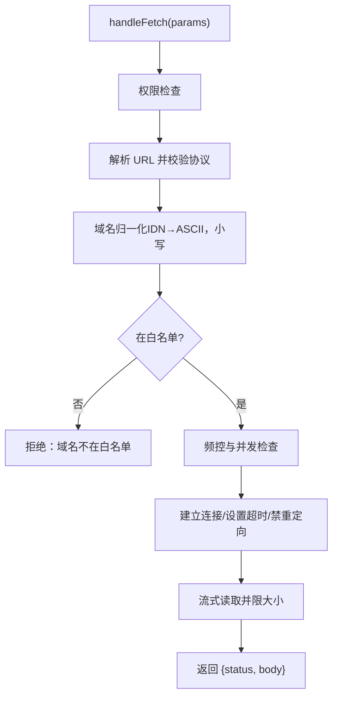

图表来源
- [SkillRuntime.kt:1-521](file://app/src/main/java/com/ziyou/ime/skill/SkillRuntime.kt#L1-L521)

章节来源
- [SkillRuntime.kt:1-521](file://app/src/main/java/com/ziyou/ime/skill/SkillRuntime.kt#L1-L521)

### 图片输出与存储限额
- 图片格式：仅接受 PNG（文件头魔数校验），base64 数据容忍 data URL 前缀。
- 发送路径：经宿主 commitContent 发送到当前输入框（需编辑器支持 image/*）。
- 保存相册：Android 10+ 使用 MediaStore 免存储权限写入 Pictures/字由输入法/。
- 存储限额：每技能 KV 存储序列化后上限 1MB，写入失败抛错。

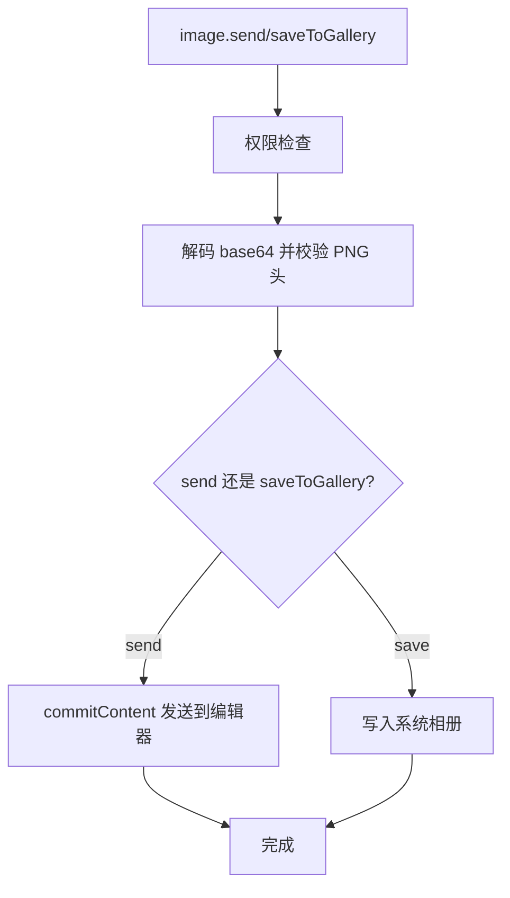

图表来源
- [SkillRuntime.kt:1-521](file://app/src/main/java/com/ziyou/ime/skill/SkillRuntime.kt#L1-L521)

章节来源
- [SkillRuntime.kt:1-521](file://app/src/main/java/com/ziyou/ime/skill/SkillRuntime.kt#L1-L521)

### Bridge 与 JS 垫片
- 单入口：postMessage 统一接收 callId/method/params，避免多方法直暴。
- 异步 Promise：__imeskillResolve 回传结果，失败透传 message。
- 注入策略：优先 DOCUMENT_START_SCRIPT，失败回退 onPageStarted；重复注入幂等。
- 消息长度限制：单条消息上限 512KB，防拖垮主线程。

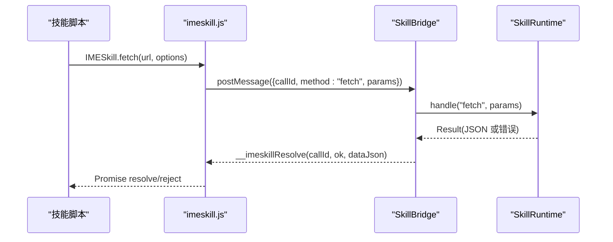

图表来源
- [SkillBridge.kt:1-99](file://app/src/main/java/com/ziyou/ime/skill/SkillBridge.kt#L1-L99)
- [SkillRuntime.kt:1-521](file://app/src/main/java/com/ziyou/ime/skill/SkillRuntime.kt#L1-L521)
- [imeskill.js:1-164](file://app/src/main/assets/skill_runtime/imeskill.js#L1-L164)

章节来源
- [SkillBridge.kt:1-99](file://app/src/main/java/com/ziyou/ime/skill/SkillBridge.kt#L1-L99)
- [SkillRuntime.kt:1-521](file://app/src/main/java/com/ziyou/ime/skill/SkillRuntime.kt#L1-L521)
- [imeskill.js:1-164](file://app/src/main/assets/skill_runtime/imeskill.js#L1-L164)

## 依赖关系分析
- 低耦合：Bridge 仅负责消息搬运与线程切换，Runtime 承载业务逻辑；安装器与校验器独立于运行时。
- 明确边界：WebView 工厂只负责沙箱配置与资源拦截；面板协调器专注 UI 编排与宿主交互。
- 外部依赖：Android WebKit 特性检测、org.json 解析、协程 IO 调度。

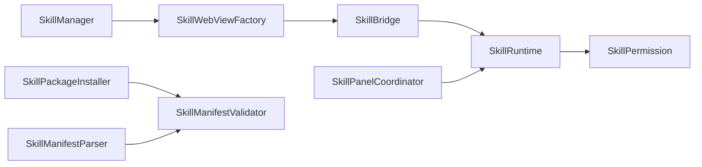

图表来源
- [SkillWebViewFactory.kt:1-205](file://app/src/main/java/com/ziyou/ime/skill/SkillWebViewFactory.kt#L1-L205)
- [SkillBridge.kt:1-99](file://app/src/main/java/com/ziyou/ime/skill/SkillBridge.kt#L1-L99)
- [SkillRuntime.kt:1-521](file://app/src/main/java/com/ziyou/ime/skill/SkillRuntime.kt#L1-L521)
- [SkillPackageInstaller.kt:1-194](file://app/src/main/java/com/ziyou/ime/skill/SkillPackageInstaller.kt#L1-L194)
- [SkillManifestParser.kt:1-73](file://app/src/main/java/com/ziyou/ime/skill/SkillManifestParser.kt#L1-L73)
- [SkillManifestValidator.kt:1-78](file://core-logic/src/main/java/com/ziyou/ime/core/skill/SkillManifestValidator.kt#L1-L78)
- [SkillPermission.kt:1-27](file://core-logic/src/main/java/com/ziyou/ime/core/skill/SkillPermission.kt#L1-L27)
- [SkillPanelCoordinator.kt:1-257](file://app/src/main/java/com/ziyou/ime/ime/SkillPanelCoordinator.kt#L1-L257)
- [SkillManager.kt:1-110](file://app/src/main/java/com/ziyou/ime/skill/SkillManager.kt#L1-L110)

章节来源
- [SkillWebViewFactory.kt:1-205](file://app/src/main/java/com/ziyou/ime/skill/SkillWebViewFactory.kt#L1-L205)
- [SkillBridge.kt:1-99](file://app/src/main/java/com/ziyou/ime/skill/SkillBridge.kt#L1-L99)
- [SkillRuntime.kt:1-521](file://app/src/main/java/com/ziyou/ime/skill/SkillRuntime.kt#L1-L521)
- [SkillPackageInstaller.kt:1-194](file://app/src/main/java/com/ziyou/ime/skill/SkillPackageInstaller.kt#L1-L194)
- [SkillManifestParser.kt:1-73](file://app/src/main/java/com/ziyou/ime/skill/SkillManifestParser.kt#L1-L73)
- [SkillManifestValidator.kt:1-78](file://core-logic/src/main/java/com/ziyou/ime/core/skill/SkillManifestValidator.kt#L1-L78)
- [SkillPermission.kt:1-27](file://core-logic/src/main/java/com/ziyou/ime/core/skill/SkillPermission.kt#L1-L27)
- [SkillPanelCoordinator.kt:1-257](file://app/src/main/java/com/ziyou/ime/ime/SkillPanelCoordinator.kt#L1-L257)
- [SkillManager.kt:1-110](file://app/src/main/java/com/ziyou/ime/skill/SkillManager.kt#L1-L110)

## 性能考量
- WebView 首帧优化：首帧前隐藏避免黑屏闪烁，减少视觉抖动。
- 资源缓存策略：禁用 WebView 缓存，避免膨胀；技能资源本地即取。
- 存储 IO 串行：storageContext 单并发 IO，保证 set/remove 顺序一致。
- 网络请求限流：频控与并发限制降低峰值压力，避免阻塞主线程。
- 协程作用域释放：面板关闭时取消未完成请求，避免内存泄漏。

[本节为通用指导，无需引用具体文件]

## 故障排查指南
- 安装失败：检查 manifest 字段合法性、域名白名单、包体大小与条目数、冲突升级策略；查看安装器抛出的异常信息。
- 资源加载失败：确认虚拟域名与路径前缀匹配，路径安全校验通过；HTML 响应是否附加 CSP 头。
- 网络请求被拒：确认 HTTPS、域名白名单、频控与并发限制；检查重定向是否被禁用。
- 面板无法打开：悬浮模式不支持；检查容器引用与可见性；确认面板生命周期释放与复位。
- 崩溃与异常：查看 onRenderProcessGone 日志；Bridge 异常兜底返回通用错误，检查方法名与参数。

章节来源
- [SkillPackageInstaller.kt:1-194](file://app/src/main/java/com/ziyou/ime/skill/SkillPackageInstaller.kt#L1-L194)
- [SkillWebViewFactory.kt:1-205](file://app/src/main/java/com/ziyou/ime/skill/SkillWebViewFactory.kt#L1-L205)
- [SkillRuntime.kt:1-521](file://app/src/main/java/com/ziyou/ime/skill/SkillRuntime.kt#L1-L521)
- [SkillPanelCoordinator.kt:1-257](file://app/src/main/java/com/ziyou/ime/ime/SkillPanelCoordinator.kt#L1-L257)

## 结论
本系统通过 WebView 沙箱、Bridge 单入口、权限模型、严格校验与反钓鱼布局约束，构建了完整的技能插件安全体系。安装阶段的两段式流程与运行时能力限制共同保障了宿主与应用的安全性。建议遵循最佳实践，持续监控异常与性能指标，确保插件生态健康稳定。

[本节为总结，无需引用具体文件]

## 附录
- 安全最佳实践
  - 最小权限原则：manifest 仅声明必要权限与域名。
  - 输入校验：所有参数长度与格式校验，防止注入与溢出。
  - 资源白名单：仅允许虚拟域名与包内路径，禁用外网旁路。
  - 崩溃隔离：渲染进程崩溃不影响 IME 主进程。
  - 布局约束：面板不遮挡宿主关键控件，z序与位置可控。
- 常见漏洞防护
  - Zip Slip：路径安全校验与 canonicalPath 双重防御。
  - 重定向逃逸：禁用跟随重定向，白名单精确匹配。
  - MIME 伪造：PNG 文件头魔数校验。
  - 跨域攻击：CSP 头限制脚本与连接来源。
  - 过度权限：权限枚举收敛，未知权限拒绝。

[本节为通用指导，无需引用具体文件]