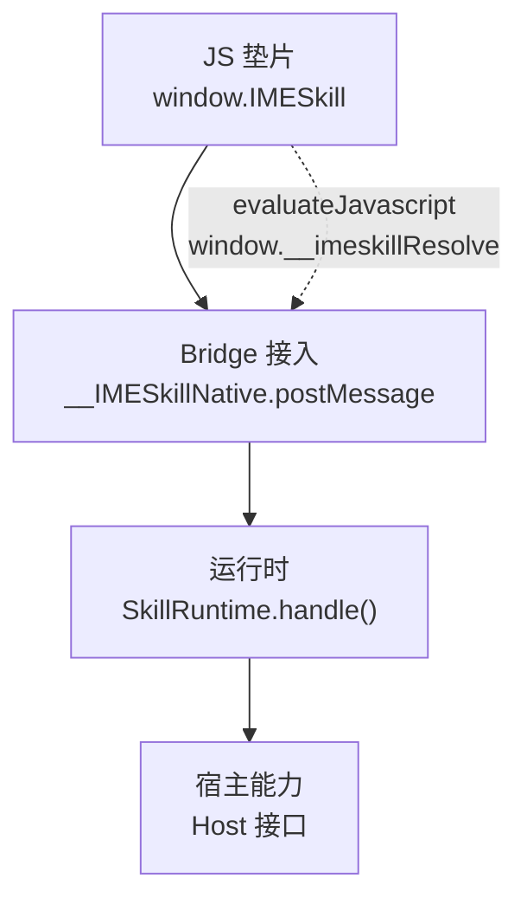
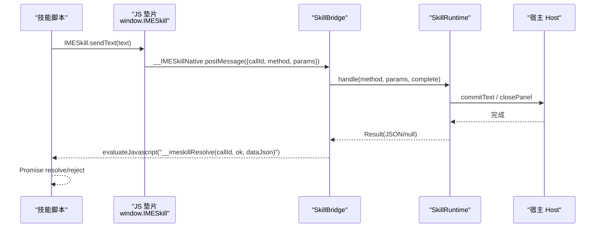
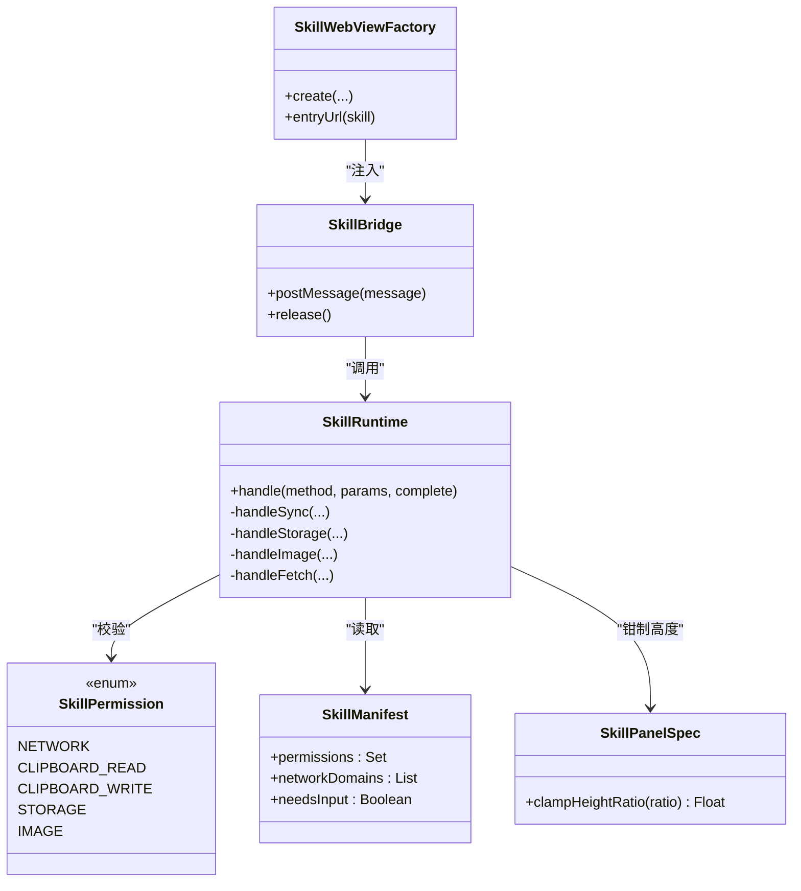

# Bridge API 参考

<cite>
**本文引用的文件**   
- [app/src/main/assets/skill_runtime/imeskill.js](file://app/src/main/assets/skill_runtime/imeskill.js)
- [app/src/main/java/com/ziyou/ime/skill/SkillBridge.kt](file://app/src/main/java/com/ziyou/ime/skill/SkillBridge.kt)
- [app/src/main/java/com/ziyou/ime/skill/SkillRuntime.kt](file://app/src/main/java/com/ziyou/ime/skill/SkillRuntime.kt)
- [core-logic/src/main/java/com/ziyou/ime/core/skill/SkillPermission.kt](file://core-logic/src/main/java/com/ziyou/ime/core/skill/SkillPermission.kt)
- [core-logic/src/main/java/com/ziyou/ime/core/skill/SkillManifest.kt](file://core-logic/src/main/java/com/ziyou/ime/core/skill/SkillManifest.kt)
- [app/src/main/java/com/ziyou/ime/skill/SkillWebViewFactory.kt](file://app/src/main/java/com/ziyou/ime/skill/SkillWebViewFactory.kt)
- [core-logic/src/main/java/com/ziyou/ime/core/skill/SkillPanelSpec.kt](file://core-logic/src/main/java/com/ziyou/ime/core/skill/SkillPanelSpec.kt)
</cite>

## 目录
1. [简介](#简介)
2. [项目结构](#项目结构)
3. [核心组件](#核心组件)
4. [架构总览](#架构总览)
5. [详细组件分析](#详细组件分析)
6. [依赖关系分析](#依赖关系分析)
7. [性能考量](#性能考量)
8. [故障排查指南](#故障排查指南)
9. [结论](#结论)
10. [附录：API 参考与示例](#附录api-参考与示例)

## 简介
本参考文档面向 IMESkill 技能开发者，完整说明宿主注入的全局对象 window.IMESkill 的所有接口。内容覆盖 sendText、getContext、getLocale、haptic、ui.*、storage.*、fetch、clipboard、input.*、image.* 等核心能力的使用方法、参数规范、返回值与错误处理；并给出 Promise 异步模式的使用方式与最佳实践、权限要求与限制条件、调用时机建议以及版本兼容性与向后兼容性说明。

## 项目结构
IMESkill Bridge 由三层组成：
- JS 垫片层（imeskill.js）：在 WebView 中暴露 window.IMESkill，统一封装所有 API 为 Promise，并通过 __IMESkillNative.postMessage 单入口与宿主通信。
- Bridge 接入层（SkillBridge）：接收 JS 消息，校验长度与格式，切换主线程分发到运行时，并以 evaluateJavascript 回传结果。
- 运行时实现（SkillRuntime）：承载全部业务逻辑（权限检查、限额控制、网络代理、剪贴板、输入路由、图片输出等），通过 Host 接口与宿主交互。

**图表来源** 
- [app/src/main/assets/skill_runtime/imeskill.js:10-43](file://app/src/main/assets/skill_runtime/imeskill.js#L10-L43)
- [app/src/main/java/com/ziyou/ime/skill/SkillBridge.kt:45-97](file://app/src/main/java/com/ziyou/ime/skill/SkillBridge.kt#L45-L97)
- [app/src/main/java/com/ziyou/ime/skill/SkillRuntime.kt:142-157](file://app/src/main/java/com/ziyou/ime/skill/SkillRuntime.kt#L142-L157)

**章节来源**
- [app/src/main/assets/skill_runtime/imeskill.js:1-164](file://app/src/main/assets/skill_runtime/imeskill.js#L1-L164)
- [app/src/main/java/com/ziyou/ime/skill/SkillBridge.kt:1-99](file://app/src/main/java/com/ziyou/ime/skill/SkillBridge.kt#L1-L99)
- [app/src/main/java/com/ziyou/ime/skill/SkillRuntime.kt:1-521](file://app/src/main/java/com/ziyou/ime/skill/SkillRuntime.kt#L1-L521)

## 核心组件
- SkillBridge：JS Bridge 单入口，负责消息解析、线程切换、异常兜底与结果回传。
- SkillRuntime：能力实现层，包含权限校验、限额策略、存储持久化、网络代理、剪贴板、输入路由、图片输出等。
- SkillWebViewFactory：WebView 安全工厂，注入垫片脚本、资源拦截、CSP 收紧、崩溃兜底。
- SkillPermission / SkillManifest：权限模型与清单模型，决定能力可用性与白名单。
- SkillPanelSpec：面板高度规格钳制常量与工具方法。

**章节来源**
- [app/src/main/java/com/ziyou/ime/skill/SkillBridge.kt:1-99](file://app/src/main/java/com/ziyou/ime/skill/SkillBridge.kt#L1-L99)
- [app/src/main/java/com/ziyou/ime/skill/SkillRuntime.kt:1-521](file://app/src/main/java/com/ziyou/ime/skill/SkillRuntime.kt#L1-L521)
- [app/src/main/java/com/ziyou/ime/skill/SkillWebViewFactory.kt:1-205](file://app/src/main/java/com/ziyou/ime/skill/SkillWebViewFactory.kt#L1-L205)
- [core-logic/src/main/java/com/ziyou/ime/core/skill/SkillPermission.kt:1-27](file://core-logic/src/main/java/com/ziyou/ime/core/skill/SkillPermission.kt#L1-L27)
- [core-logic/src/main/java/com/ziyou/ime/core/skill/SkillManifest.kt:1-51](file://core-logic/src/main/java/com/ziyou/ime/core/skill/SkillManifest.kt#L1-L51)
- [core-logic/src/main/java/com/ziyou/ime/core/skill/SkillPanelSpec.kt:1-30](file://core-logic/src/main/java/com/ziyou/ime/core/skill/SkillPanelSpec.kt#L1-L30)

## 架构总览
下图展示从 JS 调用到宿主能力的完整时序，包括 Promise 生命周期与错误传播路径。

**图表来源** 
- [app/src/main/assets/skill_runtime/imeskill.js:30-43](file://app/src/main/assets/skill_runtime/imeskill.js#L30-L43)
- [app/src/main/java/com/ziyou/ime/skill/SkillBridge.kt:45-97](file://app/src/main/java/com/ziyou/ime/skill/SkillBridge.kt#L45-L97)
- [app/src/main/java/com/ziyou/ime/skill/SkillRuntime.kt:159-170](file://app/src/main/java/com/ziyou/ime/skill/SkillRuntime.kt#L159-L170)

## 详细组件分析

### 全局对象 window.IMESkill 概览
- apiVersion：当前 Bridge API 版本（由宿主覆写，用于与 manifest.minHostApi 协商）。
- 所有方法均返回 Promise，失败通过 reject 抛出 Error，错误信息来自宿主侧的 message 字段或通用“内部错误”。

**章节来源**
- [app/src/main/assets/skill_runtime/imeskill.js:73-162](file://app/src/main/assets/skill_runtime/imeskill.js#L73-L162)

### 文本上屏：sendText(text)
- 功能：将文本提交到宿主编辑器并关闭技能面板。
- 参数：text（字符串，非空且不超过上限）。
- 返回值：Promise<void>。
- 权限：无需额外权限。
- 限制：单次最大字符数受宿主限制；若存在输入路由激活，会先复位路由再提交。
- 调用时机：用户确认输入后调用，通常作为技能最终操作。
- 错误处理：参数非法或超限将 reject。

**章节来源**
- [app/src/main/assets/skill_runtime/imeskill.js:80](file://app/src/main/assets/skill_runtime/imeskill.js#L80)
- [app/src/main/java/com/ziyou/ime/skill/SkillRuntime.kt:159-170](file://app/src/main/java/com/ziyou/ime/skill/SkillRuntime.kt#L159-L170)

### 环境上下文：getContext()
- 功能：获取宿主环境信息，包含 packageName 与 inputType。
- 参数：无。
- 返回值：Promise<{packageName: string, inputType: string}>。
- 权限：无需权限。
- 调用时机：技能初始化时获取当前编辑器上下文。

**章节来源**
- [app/src/main/assets/skill_runtime/imeskill.js:83](file://app/src/main/assets/skill_runtime/imeskill.js#L83)
- [app/src/main/java/com/ziyou/ime/skill/SkillRuntime.kt:172-175](file://app/src/main/java/com/ziyou/ime/skill/SkillRuntime.kt#L172-L175)

### 系统语言：getLocale()
- 功能：获取系统语言标签（BCP 47，如 zh-CN）。
- 参数：无。
- 返回值：Promise<string>。
- 权限：无需权限。
- 调用时机：技能初始化时进行本地化选择。

**章节来源**
- [app/src/main/assets/skill_runtime/imeskill.js:86](file://app/src/main/assets/skill_runtime/imeskill.js#L86)
- [app/src/main/java/com/ziyou/ime/skill/SkillRuntime.kt:177](file://app/src/main/java/com/ziyou/ime/skill/SkillRuntime.kt#L177)

### 震动反馈：haptic()
- 功能：触发按键震动反馈。
- 参数：无。
- 返回值：Promise<void>。
- 权限：无需权限。
- 调用时机：用户交互（如点击按钮）时增强体验。

**章节来源**
- [app/src/main/assets/skill_runtime/imeskill.js:89](file://app/src/main/assets/skill_runtime/imeskill.js#L89)
- [app/src/main/java/com/ziyou/ime/skill/SkillRuntime.kt:179-182](file://app/src/main/java/com/ziyou/ime/skill/SkillRuntime.kt#L179-L182)

### UI 控制：ui.*
- ui.setTitle(title)
  - 功能：设置面板标题栏文字。
  - 参数：title（字符串，长度受限）。
  - 返回值：Promise<void>。
  - 权限：无需权限。
- ui.close()
  - 功能：关闭技能面板。
  - 参数：无。
  - 返回值：Promise<void>。
  - 权限：无需权限。
- ui.setExpanded(expanded?)
  - 功能：展开/收缩输入法界面（仅 needs_input 技能有效）。false 时整体缩回，true 恢复。
  - 参数：expanded（布尔，缺省 true）。
  - 返回值：Promise<void>。
  - 权限：无需权限。
  - 限制：仅提升挂载（needs_input）生效。
- ui.setPanelHeight(ratio)
  - 功能：自定义面板高度（API v4，仅 needs_input 技能有效）。ratio 为键盘高度的倍数，宿主钳制到 [0.4, 1.2]。
  - 参数：ratio（数值）。
  - 返回值：Promise<void>。
  - 权限：无需权限。
  - 限制：退出技能回到列表时自动复位默认值。

**章节来源**
- [app/src/main/assets/skill_runtime/imeskill.js:99-119](file://app/src/main/assets/skill_runtime/imeskill.js#L99-L119)
- [app/src/main/java/com/ziyou/ime/skill/SkillRuntime.kt:184-208](file://app/src/main/java/com/ziyou/ime/skill/SkillRuntime.kt#L184-L208)
- [core-logic/src/main/java/com/ziyou/ime/core/skill/SkillPanelSpec.kt:10-29](file://core-logic/src/main/java/com/ziyou/ime/core/skill/SkillPanelSpec.kt#L10-L29)

### 剪贴板：clipboard.*
- clipboard.read()
  - 功能：读取剪贴板文本。
  - 参数：无。
  - 返回值：Promise<string|null>。
  - 权限：clipboard_read。
  - 限制：剪贴板为空时返回 null。
- clipboard.write(text)
  - 功能：写入剪贴板文本。
  - 参数：text（字符串）。
  - 返回值：Promise<void>。
  - 权限：clipboard_write。

**章节来源**
- [app/src/main/assets/skill_runtime/imeskill.js:122-125](file://app/src/main/assets/skill_runtime/imeskill.js#L122-L125)
- [app/src/main/java/com/ziyou/ime/skill/SkillRuntime.kt:210-224](file://app/src/main/java/com/ziyou/ime/skill/SkillRuntime.kt#L210-L224)
- [core-logic/src/main/java/com/ziyou/ime/core/skill/SkillPermission.kt:13-16](file://core-logic/src/main/java/com/ziyou/ime/core/skill/SkillPermission.kt#L13-L16)

### 输入路由：input.*
- input.requestFocus(fieldId)
  - 功能：请求将键盘上屏文本路由到面板内指定 id 的 input/textarea 元素（Phase 3）。
  - 参数：fieldId（字符串，DOM 元素 id）。
  - 返回值：Promise<void>。
  - 权限：无需权限，但需 manifest.needsInput = true。
  - 限制：元素不存在将直接 reject。
- input.releaseFocus()
  - 功能：释放输入路由，恢复直达宿主应用编辑框。
  - 参数：无。
  - 返回值：Promise<void>。
  - 权限：无需权限。

**章节来源**
- [app/src/main/assets/skill_runtime/imeskill.js:132-144](file://app/src/main/assets/skill_runtime/imeskill.js#L132-L144)
- [app/src/main/java/com/ziyou/ime/skill/SkillRuntime.kt:227-238](file://app/src/main/java/com/ziyou/ime/skill/SkillRuntime.kt#L227-L238)
- [core-logic/src/main/java/com/ziyou/ime/core/skill/SkillManifest.kt:34-39](file://core-logic/src/main/java/com/ziyou/ime/core/skill/SkillManifest.kt#L34-L39)

### 网络请求：fetch(url, options)
- 功能：经宿主代理发起网络请求，强制 HTTPS + 域名白名单 + 超时/大小/频控/并发限制。
- 参数：
  - url（字符串，必须为 https）。
  - options（对象，可选）：{method:'POST'|'GET', body?:string, contentType?:string}。
- 返回值：Promise<{status:number, body:string}>。
- 权限：network。
- 限制：
  - 仅允许白名单域名（精确匹配，IDN/punycode 归一化比较）。
  - 禁止跟随重定向。
  - 超时 10s，响应体 ≤1MB，每分钟最多 30 次，并发 ≤2。
- 错误处理：非法 URL、非 HTTPS、不在白名单、频率/并发超限、网络失败等均 reject。

**章节来源**
- [app/src/main/assets/skill_runtime/imeskill.js:150](file://app/src/main/assets/skill_runtime/imeskill.js#L150)
- [app/src/main/java/com/ziyou/ime/skill/SkillRuntime.kt:374-427](file://app/src/main/java/com/ziyou/ime/skill/SkillRuntime.kt#L374-L427)
- [core-logic/src/main/java/com/ziyou/ime/core/skill/SkillPermission.kt:11-12](file://core-logic/src/main/java/com/ziyou/ime/core/skill/SkillPermission.kt#L11-L12)

### 图片输出：image.*
- image.send(base64)
  - 功能：将 PNG base64 数据发送到当前输入框（commitContent），需对方声明接受 image/*。
  - 参数：base64（字符串，支持带 data URL 前缀）。
  - 返回值：Promise<void>。
  - 权限：image。
  - 限制：仅支持 PNG（文件头魔数校验），当前输入框需支持图片富媒体。
- image.saveToGallery(base64)
  - 功能：将 PNG base64 保存到系统相册（Android 10+）。
  - 参数：base64（字符串，支持带 data URL 前缀）。
  - 返回值：Promise<void>。
  - 权限：image。
  - 限制：需要 Android 10 及以上系统。

**章节来源**
- [app/src/main/assets/skill_runtime/imeskill.js:158-161](file://app/src/main/assets/skill_runtime/imeskill.js#L158-L161)
- [app/src/main/java/com/ziyou/ime/skill/SkillRuntime.kt:293-332](file://app/src/main/java/com/ziyou/ime/skill/SkillRuntime.kt#L293-L332)
- [core-logic/src/main/java/com/ziyou/ime/core/skill/SkillPermission.kt:19-20](file://core-logic/src/main/java/com/ziyou/ime/core/skill/SkillPermission.kt#L19-L20)

### 轻量存储：storage.*
- storage.get(key)
  - 功能：读取键值对（value 按字符串存取）。
  - 参数：key（字符串，非空）。
  - 返回值：Promise<string|null>。
  - 权限：storage。
- storage.set(key, value)
  - 功能：写入键值对（value 转为字符串）。
  - 参数：key（字符串，非空），value（任意可转字符串的值）。
  - 返回值：Promise<void>。
  - 权限：storage。
  - 限制：每技能独立 JSON 文件，序列化后 ≤1MB。
- storage.remove(key)
  - 功能：删除键值对。
  - 参数：key（字符串，非空）。
  - 返回值：Promise<void>。
  - 权限：storage。

**章节来源**
- [app/src/main/assets/skill_runtime/imeskill.js:92-96](file://app/src/main/assets/skill_runtime/imeskill.js#L92-L96)
- [app/src/main/java/com/ziyou/ime/skill/SkillRuntime.kt:250-284](file://app/src/main/java/com/ziyou/ime/skill/SkillRuntime.kt#L250-L284)
- [core-logic/src/main/java/com/ziyou/ime/core/skill/SkillPermission.kt:17-18](file://core-logic/src/main/java/com/ziyou/ime/core/skill/SkillPermission.kt#L17-L18)

## 依赖关系分析
- JS 垫片依赖 Bridge 单入口（__IMESkillNative），所有 API 通过 call(method, params) 发送。
- Bridge 依赖 Runtime 处理具体能力，并通过 evaluateJavascript 回传结果。
- Runtime 依赖 Host 接口与宿主交互（文本上屏、面板控制、剪贴板、图片提交等）。
- 权限与清单模型约束能力可用性（manifest.permissions、networkDomains、needsInput）。

**图表来源** 
- [app/src/main/java/com/ziyou/ime/skill/SkillBridge.kt:20-49](file://app/src/main/java/com/ziyou/ime/skill/SkillBridge.kt#L20-L49)
- [app/src/main/java/com/ziyou/ime/skill/SkillRuntime.kt:40-114](file://app/src/main/java/com/ziyou/ime/skill/SkillRuntime.kt#L40-L114)
- [app/src/main/java/com/ziyou/ime/skill/SkillWebViewFactory.kt:60-88](file://app/src/main/java/com/ziyou/ime/skill/SkillWebViewFactory.kt#L60-L88)
- [core-logic/src/main/java/com/ziyou/ime/core/skill/SkillPermission.kt:10-26](file://core-logic/src/main/java/com/ziyou/ime/core/skill/SkillPermission.kt#L10-L26)
- [core-logic/src/main/java/com/ziyou/ime/core/skill/SkillManifest.kt:9-40](file://core-logic/src/main/java/com/ziyou/ime/core/skill/SkillManifest.kt#L9-L40)
- [core-logic/src/main/java/com/ziyou/ime/core/skill/SkillPanelSpec.kt:10-29](file://core-logic/src/main/java/com/ziyou/ime/core/skill/SkillPanelSpec.kt#L10-L29)

**章节来源**
- [app/src/main/java/com/ziyou/ime/skill/SkillBridge.kt:1-99](file://app/src/main/java/com/ziyou/ime/skill/SkillBridge.kt#L1-L99)
- [app/src/main/java/com/ziyou/ime/skill/SkillRuntime.kt:1-521](file://app/src/main/java/com/ziyou/ime/skill/SkillRuntime.kt#L1-L521)
- [app/src/main/java/com/ziyou/ime/skill/SkillWebViewFactory.kt:1-205](file://app/src/main/java/com/ziyou/ime/skill/SkillWebViewFactory.kt#L1-L205)
- [core-logic/src/main/java/com/ziyou/ime/core/skill/SkillPermission.kt:1-27](file://core-logic/src/main/java/com/ziyou/ime/core/skill/SkillPermission.kt#L1-L27)
- [core-logic/src/main/java/com/ziyou/ime/core/skill/SkillManifest.kt:1-51](file://core-logic/src/main/java/com/ziyou/ime/core/skill/SkillManifest.kt#L1-L51)
- [core-logic/src/main/java/com/ziyou/ime/core/skill/SkillPanelSpec.kt:1-30](file://core-logic/src/main/java/com/ziyou/ime/core/skill/SkillPanelSpec.kt#L1-L30)

## 性能考量
- 单条消息长度上限：Bridge 限制 512KB，防止超大消息阻塞主线程。
- fetch 代理限额：超时 10s、响应体 ≤1MB、每分钟 ≤30 次、并发 ≤2。
- storage 限额：每技能 JSON 序列化后 ≤1MB。
- sendText 长度限制：单次最大字符数受宿主限制。
- 图片处理：PNG 魔数校验、IO 协程执行，避免阻塞主线程。
- 面板高度钳制：防止过小或过大导致不可用。

[本节为通用指导，不直接分析具体文件]

## 故障排查指南
- 常见错误类型：
  - 权限拒绝：manifest 未声明对应权限（如 network、clipboard_read/write、storage、image）。
  - 参数非法：key 为空、URL 非法、非 HTTPS、base64 无效、元素不存在等。
  - 限额超限：存储 >1MB、fetch 响应 >1MB、请求过于频繁或并发超限。
  - 平台限制：保存到相册需要 Android 10+；输入框不支持图片富媒体。
- 调试建议：
  - 使用浏览器控制台捕获 Promise reject 的错误信息。
  - 检查 manifest 中的 permissions 与 networkDomains 配置。
  - 对于输入路由问题，确认 needsInput 与 requestFocus/releaseFocus 成对调用。
  - 关注 Bridge 日志（SkillBridge 与 SkillRuntime 的 Log 输出）。

**章节来源**
- [app/src/main/java/com/ziyou/ime/skill/SkillBridge.kt:61-86](file://app/src/main/java/com/ziyou/ime/skill/SkillBridge.kt#L61-L86)
- [app/src/main/java/com/ziyou/ime/skill/SkillRuntime.kt:485-495](file://app/src/main/java/com/ziyou/ime/skill/SkillRuntime.kt#L485-L495)

## 结论
IMESkill Bridge 通过统一的 Promise API 与安全沙箱，为技能提供了稳定、可控的能力访问通道。开发者应遵循权限与限额策略，合理使用输入路由与图片输出，确保用户体验与系统稳定性。

[本节为总结性内容，不直接分析具体文件]

## 附录：API 参考与示例

### 调用时机与权限要求速查
- sendText：用户确认后调用，无需权限。
- getContext/getLocale/haptic：初始化或交互时调用，无需权限。
- ui.*：面板生命周期内调用，无需权限；setExpanded/setPanelHeight 仅 needs_input 有效。
- clipboard.*：读写剪贴板需对应权限。
- input.*：needs_input 技能使用，requestFocus/releaseFocus 成对调用。
- fetch：需 network 权限与白名单域名。
- image.*：需 image 权限；send 需输入框支持图片；saveToGallery 需 Android 10+。

### Promise 异步模式与错误处理最佳实践
- 始终使用 try/catch 或 .catch 捕获错误。
- 对关键操作（如 fetch、image.send）增加重试与降级策略。
- 避免在 UI 线程执行耗时操作，交由 Bridge 异步处理。
- 合理管理输入路由生命周期，避免内存泄漏与状态不一致。

### 版本兼容性与向后兼容性
- apiVersion：由宿主覆写，技能可通过 manifest.minHostApi 协商最低宿主 API 版本。
- 向后兼容：新增能力（如 image.*、ui.setPanelHeight）不影响旧技能运行；未知方法将报错。
- 面板高度钳制：宿主统一限制范围，保证不同设备一致性。

**章节来源**
- [app/src/main/assets/skill_runtime/imeskill.js:74-77](file://app/src/main/assets/skill_runtime/imeskill.js#L74-L77)
- [core-logic/src/main/java/com/ziyou/ime/core/skill/SkillManifest.kt:18-19](file://core-logic/src/main/java/com/ziyou/ime/core/skill/SkillManifest.kt#L18-L19)
- [core-logic/src/main/java/com/ziyou/ime/core/skill/SkillPanelSpec.kt:10-29](file://core-logic/src/main/java/com/ziyou/ime/core/skill/SkillPanelSpec.kt#L10-L29)