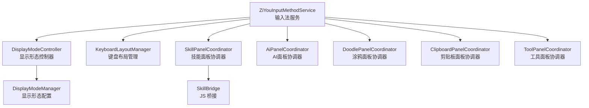
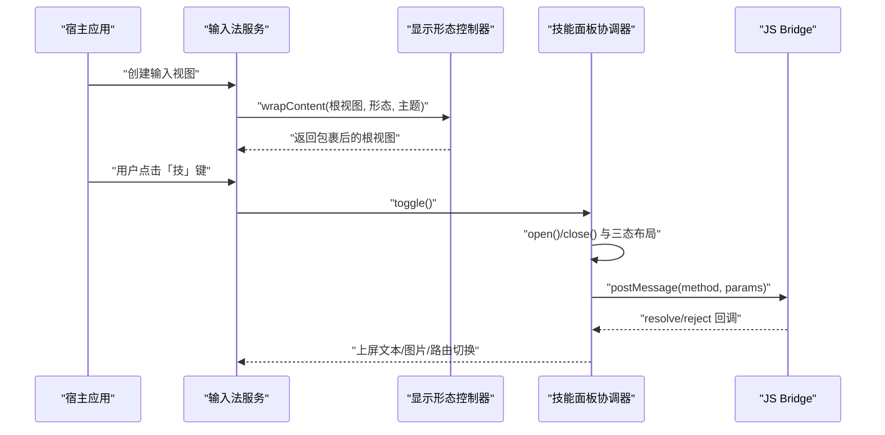
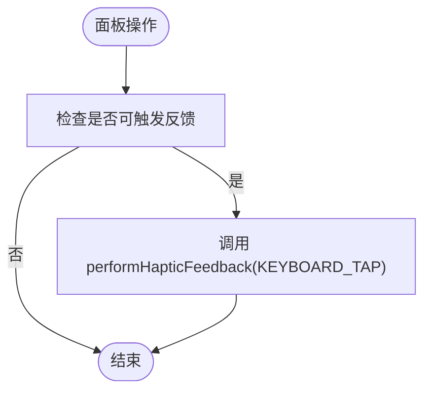
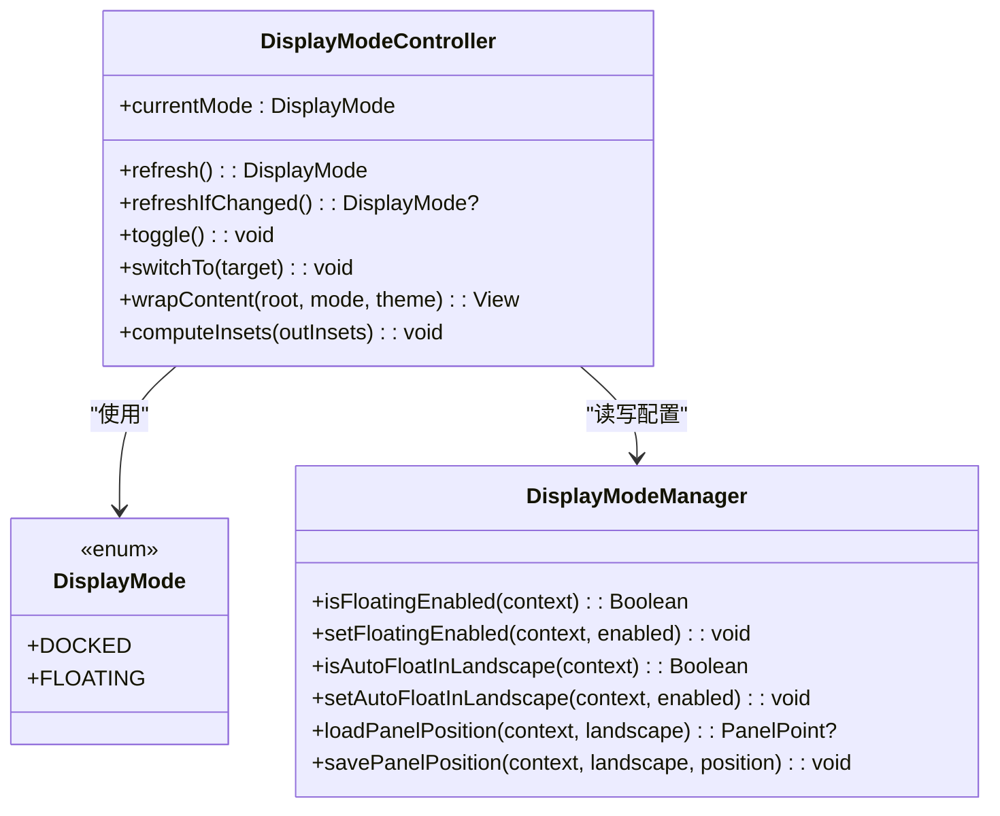
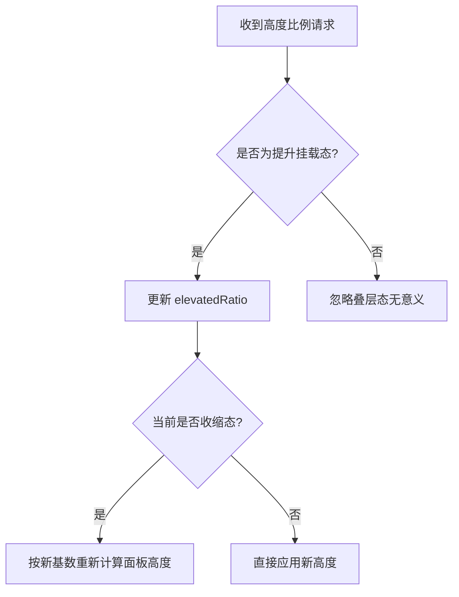
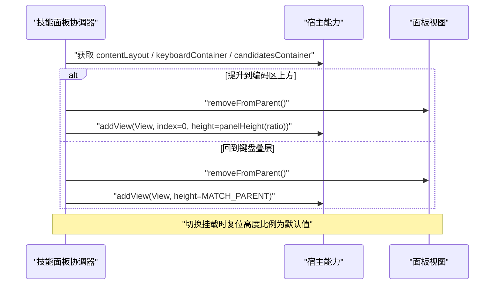
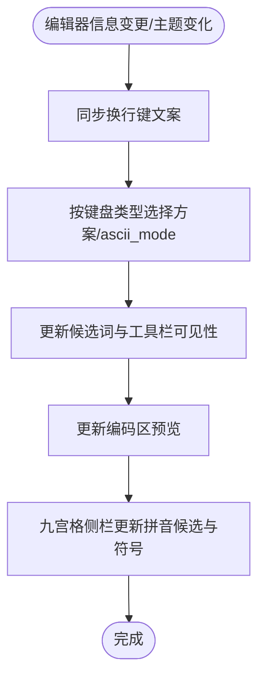
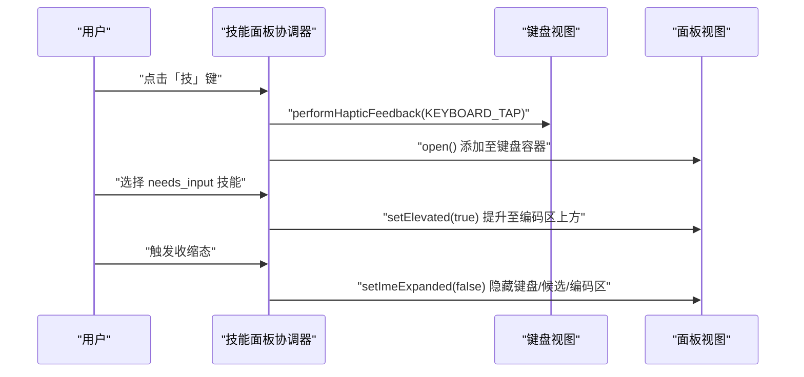
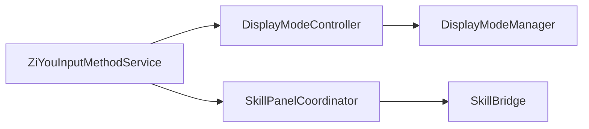

# UI 控制 API

<cite>
**本文引用的文件**   
- [ZiYouInputMethodService.kt](file://app/src/main/java/com/ziyou/ime/ime/ZiYouInputMethodService.kt)
- [DisplayModeController.kt](file://app/src/main/java/com/ziyou/ime/ime/DisplayModeController.kt)
- [DisplayMode.kt](file://app/src/main/java/com/ziyou/ime/ime/DisplayMode.kt)
- [DisplayModeManager.kt](file://app/src/main/java/com/ziyou/ime/config/DisplayModeManager.kt)
- [SkillPanelCoordinator.kt](file://app/src/main/java/com/ziyou/ime/ime/SkillPanelCoordinator.kt)
- [SkillBridge.kt](file://app/src/main/java/com/ziyou/ime/skill/SkillBridge.kt)
</cite>

## 目录
1. [简介](#简介)
2. [项目结构](#项目结构)
3. [核心组件](#核心组件)
4. [架构总览](#架构总览)
5. [详细组件分析](#详细组件分析)
6. [依赖关系分析](#依赖关系分析)
7. [性能考量](#性能考量)
8. [故障排查指南](#故障排查指南)
9. [结论](#结论)
10. [附录：UI 控制 API 参考](#附录ui-控制-api-参考)

## 简介
本文件面向“字由输入法”的 UI 控制相关 API，聚焦以下目标：
- haptic 触觉反馈接口的使用方式、触发时机与效果说明
- ui.* 系列接口（面板尺寸控制、显示状态管理、动画效果等）的使用方法与约束
- 与宿主输入法的 UI 交互方式（键盘布局适配、主题同步等）
- 实际交互示例（按钮点击反馈、面板切换动画等）
- 性能优化建议与最佳实践

## 项目结构
本项目将 IME 服务与 UI 控制职责分层清晰：
- 输入法服务层：负责生命周期、视图装配、引擎同步与事件分发
- 显示形态控制器：停靠/悬浮模式解析、切换与 insets 裁剪
- 面板协调器：技能/AI/涂鸦/粘贴板/工具等面板的生命周期与三态布局编排
- 配置管理器：悬浮模式开关、位置持久化、缩放因子等
- JS Bridge：技能脚本与原生能力的桥接入口

**图表来源** 
- [ZiYouInputMethodService.kt:442-556](file://app/src/main/java/com/ziyou/ime/ime/ZiYouInputMethodService.kt#L442-L556)
- [DisplayModeController.kt:22-153](file://app/src/main/java/com/ziyou/ime/ime/DisplayModeController.kt#L22-L153)
- [DisplayModeManager.kt:18-82](file://app/src/main/java/com/ziyou/ime/config/DisplayModeManager.kt#L18-L82)
- [SkillPanelCoordinator.kt:31-257](file://app/src/main/java/com/ziyou/ime/ime/SkillPanelCoordinator.kt#L31-L257)
- [SkillBridge.kt:20-99](file://app/src/main/java/com/ziyou/ime/skill/SkillBridge.kt#L20-L99)

**章节来源**
- [ZiYouInputMethodService.kt:442-556](file://app/src/main/java/com/ziyou/ime/ime/ZiYouInputMethodService.kt#L442-L556)
- [DisplayModeController.kt:22-153](file://app/src/main/java/com/ziyou/ime/ime/DisplayModeController.kt#L22-L153)
- [DisplayModeManager.kt:18-82](file://app/src/main/java/com/ziyou/ime/config/DisplayModeManager.kt#L18-L82)
- [SkillPanelCoordinator.kt:31-257](file://app/src/main/java/com/ziyou/ime/ime/SkillPanelCoordinator.kt#L31-L257)
- [SkillBridge.kt:20-99](file://app/src/main/java/com/ziyou/ime/skill/SkillBridge.kt#L20-L99)

## 核心组件
- 输入法服务（ZiYouInputMethodService）
  - 负责构建输入视图、候选区、编码区与键盘容器；处理显示形态切换、键盘布局安装与状态同步；统一调度引擎同步任务。
- 显示形态控制器（DisplayModeController）
  - 解析并切换停靠/悬浮形态；包裹内容根为悬浮面板；计算触摸区域与 insets；提供切换回调给 Service。
- 显示形态配置（DisplayModeManager）
  - 存储悬浮开关、横屏自动悬浮、面板位置与缩放因子等偏好。
- 技能面板协调器（SkillPanelCoordinator）
  - 管理技能面板打开/关闭、三态布局（键盘叠层/提升挂载/收缩态）、高度比例与输入法界面展开/收缩。
- JS Bridge（SkillBridge）
  - 接收技能脚本调用，转发到运行时处理，异步回传结果。

**章节来源**
- [ZiYouInputMethodService.kt:442-556](file://app/src/main/java/com/ziyou/ime/ime/ZiYouInputMethodService.kt#L442-L556)
- [DisplayModeController.kt:22-153](file://app/src/main/java/com/ziyou/ime/ime/DisplayModeController.kt#L22-L153)
- [DisplayModeManager.kt:18-82](file://app/src/main/java/com/ziyou/ime/config/DisplayModeManager.kt#L18-L82)
- [SkillPanelCoordinator.kt:31-257](file://app/src/main/java/com/ziyou/ime/ime/SkillPanelCoordinator.kt#L31-L257)
- [SkillBridge.kt:20-99](file://app/src/main/java/com/ziyou/ime/skill/SkillBridge.kt#L20-L99)

## 架构总览
下图展示 UI 控制关键路径：从 Service 构建输入视图，到形态控制器包裹悬浮面板，再到技能面板协调器的三态布局与 JS Bridge 通信。

**图表来源** 
- [ZiYouInputMethodService.kt:442-556](file://app/src/main/java/com/ziyou/ime/ime/ZiYouInputMethodService.kt#L442-L556)
- [DisplayModeController.kt:105-115](file://app/src/main/java/com/ziyou/ime/ime/DisplayModeController.kt#L105-L115)
- [SkillPanelCoordinator.kt:83-119](file://app/src/main/java/com/ziyou/ime/ime/SkillPanelCoordinator.kt#L83-L119)
- [SkillBridge.kt:46-97](file://app/src/main/java/com/ziyou/ime/skill/SkillBridge.kt#L46-L97)

## 详细组件分析

### 触觉反馈（haptic）接口与用法
- 触发点
  - 技能面板通过协调器调用键盘视图的触觉反馈方法，使用系统提供的 KEYBOARD_TAP 类型。
- 触发时机
  - 面板内操作（如按钮点击、列表选择）时触发，增强按键确认感。
- 效果说明
  - 使用系统默认键盘敲击震动，不自定义时长或强度，保证一致体验。
- 注意事项
  - 仅在主线程调用；避免高频重复触发造成抖动。

**图表来源** 
- [SkillPanelCoordinator.kt:139-141](file://app/src/main/java/com/ziyou/ime/ime/SkillPanelCoordinator.kt#L139-L141)

**章节来源**
- [SkillPanelCoordinator.kt:139-141](file://app/src/main/java/com/ziyou/ime/ime/SkillPanelCoordinator.kt#L139-L141)

### 显示状态管理（停靠/悬浮）
- 形态解析优先级
  - 手动覆盖 > 悬浮总开关 > 横屏自动悬浮。
- 切换流程
  - 切换前清理临时输入状态；持久化开关；重建输入视图；重同步引擎状态到新视图。
- 悬浮 insets
  - 仅悬浮形态生效：内容 inset 压到底部，触摸区域裁剪为面板矩形，面板外触摸穿透。

**图表来源** 
- [DisplayModeController.kt:22-153](file://app/src/main/java/com/ziyou/ime/ime/DisplayModeController.kt#L22-L153)
- [DisplayMode.kt:14-18](file://app/src/main/java/com/ziyou/ime/ime/DisplayMode.kt#L14-L18)
- [DisplayModeManager.kt:18-82](file://app/src/main/java/com/ziyou/ime/config/DisplayModeManager.kt#L18-L82)

**章节来源**
- [DisplayModeController.kt:54-98](file://app/src/main/java/com/ziyou/ime/ime/DisplayModeController.kt#L54-L98)
- [DisplayModeController.kt:105-146](file://app/src/main/java/com/ziyou/ime/ime/DisplayModeController.kt#L105-L146)
- [DisplayModeManager.kt:44-77](file://app/src/main/java/com/ziyou/ime/config/DisplayModeManager.kt#L44-L77)

### 面板尺寸控制（ui.setPanelHeight 等效能力）
- 能力概述
  - 技能面板支持设置高度比例（默认紧凑），在提升挂载态立即生效；收缩态下接管键盘+候选区高度之和。
- 使用方式
  - 通过协调器内部能力 setPanelHeightRatio(ratio) 应用比例；面板挂载切换时复位为默认比例。
- 约束
  - 仅在提升挂载态有效；悬浮窄面板下技能面板不可用。

**图表来源** 
- [SkillPanelCoordinator.kt:176-191](file://app/src/main/java/com/ziyou/ime/ime/SkillPanelCoordinator.kt#L176-L191)
- [SkillPanelCoordinator.kt:203-224](file://app/src/main/java/com/ziyou/ime/ime/SkillPanelCoordinator.kt#L203-L224)

**章节来源**
- [SkillPanelCoordinator.kt:176-191](file://app/src/main/java/com/ziyou/ime/ime/SkillPanelCoordinator.kt#L176-L191)
- [SkillPanelCoordinator.kt:203-224](file://app/src/main/java/com/ziyou/ime/ime/SkillPanelCoordinator.kt#L203-L224)

### 动画与布局切换（面板切换动画）
- 三态布局
  - 键盘叠层：面板覆盖键盘区，高度锁定为键盘高度。
  - 提升挂载：面板移至内容根顶部（编码区上方），紧凑高度约键盘 60%。
  - 收缩态：键盘/编码区/候选区隐藏，面板接管三者实测高度之和，IME 窗口总高不变。
- 切换流程
  - 切换挂载位置时先确保输入法界面可见；移除旧父容器后添加到新父容器；重置高度比例为默认值。
- 展开/收缩
  - 需要输入时自动恢复完整界面；收缩态释放空间给技能内容。

**图表来源** 
- [SkillPanelCoordinator.kt:203-224](file://app/src/main/java/com/ziyou/ime/ime/SkillPanelCoordinator.kt#L203-L224)
- [SkillPanelCoordinator.kt:235-255](file://app/src/main/java/com/ziyou/ime/ime/SkillPanelCoordinator.kt#L235-L255)

**章节来源**
- [SkillPanelCoordinator.kt:203-224](file://app/src/main/java/com/ziyou/ime/ime/SkillPanelCoordinator.kt#L203-L224)
- [SkillPanelCoordinator.kt:235-255](file://app/src/main/java/com/ziyou/ime/ime/SkillPanelCoordinator.kt#L235-L255)

### 与宿主输入法的 UI 交互（键盘布局适配、主题同步）
- 键盘布局适配
  - 根据当前编辑器信息同步换行键文案；不同键盘类型（全键盘/九宫格/符号/数字）对应不同方案与 ascii_mode 设置。
- 主题同步
  - 监听系统深浅色变化，通知皮肤管理器重建快照并换肤；输入视图根容器统一设置背景 Drawable。
- 引擎状态同步
  - 所有键盘切换、部署完成、形态与主题切换均走 scheduleEngineSync，latest-wins 串行化避免并发交错。

**图表来源** 
- [ZiYouInputMethodService.kt:622-624](file://app/src/main/java/com/ziyou/ime/ime/ZiYouInputMethodService.kt#L622-L624)
- [ZiYouInputMethodService.kt:709-777](file://app/src/main/java/com/ziyou/ime/ime/ZiYouInputMethodService.kt#L709-L777)
- [ZiYouInputMethodService.kt:577-580](file://app/src/main/java/com/ziyou/ime/ime/ZiYouInputMethodService.kt#L577-L580)

**章节来源**
- [ZiYouInputMethodService.kt:622-624](file://app/src/main/java/com/ziyou/ime/ime/ZiYouInputMethodService.kt#L622-L624)
- [ZiYouInputMethodService.kt:709-777](file://app/src/main/java/com/ziyou/ime/ime/ZiYouInputMethodService.kt#L709-L777)
- [ZiYouInputMethodService.kt:577-580](file://app/src/main/java/com/ziyou/ime/ime/ZiYouInputMethodService.kt#L577-L580)

### 实际交互示例
- 按钮点击反馈
  - 技能面板内按钮点击 → 调用 performHapticFeedback(KEYBOARD_TAP) → 用户获得敲击震动。
- 面板切换动画
  - 点击「技」键 → 打开技能面板（键盘叠层）→ 选中 needs_input 技能 → 提升至编码区上方 → 可选收缩态接管输入法界面空间。

**图表来源** 
- [SkillPanelCoordinator.kt:83-119](file://app/src/main/java/com/ziyou/ime/ime/SkillPanelCoordinator.kt#L83-L119)
- [SkillPanelCoordinator.kt:203-224](file://app/src/main/java/com/ziyou/ime/ime/SkillPanelCoordinator.kt#L203-L224)
- [SkillPanelCoordinator.kt:235-255](file://app/src/main/java/com/ziyou/ime/ime/SkillPanelCoordinator.kt#L235-L255)

**章节来源**
- [SkillPanelCoordinator.kt:83-119](file://app/src/main/java/com/ziyou/ime/ime/SkillPanelCoordinator.kt#L83-L119)
- [SkillPanelCoordinator.kt:203-224](file://app/src/main/java/com/ziyou/ime/ime/SkillPanelCoordinator.kt#L203-L224)
- [SkillPanelCoordinator.kt:235-255](file://app/src/main/java/com/ziyou/ime/ime/SkillPanelCoordinator.kt#L235-L255)

## 依赖关系分析
- 组件耦合
  - 输入法服务依赖显示形态控制器与多个面板协调器；协调器通过 Host 接口访问 Service 能力，降低耦合。
  - 技能面板协调器依赖 SkillBridge 进行脚本通信；Bridge 单入口窄面，避免多方法直暴。
- 外部依赖
  - Android InputMethodService、WebView、SharedPreferences、系统震动反馈常量等。

**图表来源** 
- [ZiYouInputMethodService.kt:442-556](file://app/src/main/java/com/ziyou/ime/ime/ZiYouInputMethodService.kt#L442-L556)
- [DisplayModeController.kt:22-153](file://app/src/main/java/com/ziyou/ime/ime/DisplayModeController.kt#L22-L153)
- [SkillPanelCoordinator.kt:31-257](file://app/src/main/java/com/ziyou/ime/ime/SkillPanelCoordinator.kt#L31-L257)
- [SkillBridge.kt:20-99](file://app/src/main/java/com/ziyou/ime/skill/SkillBridge.kt#L20-L99)
- [DisplayModeManager.kt:18-82](file://app/src/main/java/com/ziyou/ime/config/DisplayModeManager.kt#L18-L82)

**章节来源**
- [ZiYouInputMethodService.kt:442-556](file://app/src/main/java/com/ziyou/ime/ime/ZiYouInputMethodService.kt#L442-L556)
- [DisplayModeController.kt:22-153](file://app/src/main/java/com/ziyou/ime/ime/DisplayModeController.kt#L22-L153)
- [SkillPanelCoordinator.kt:31-257](file://app/src/main/java/com/ziyou/ime/ime/SkillPanelCoordinator.kt#L31-L257)
- [SkillBridge.kt:20-99](file://app/src/main/java/com/ziyou/ime/skill/SkillBridge.kt#L20-L99)
- [DisplayModeManager.kt:18-82](file://app/src/main/java/com/ziyou/ime/config/DisplayModeManager.kt#L18-L82)

## 性能考量
- 引擎同步串行化
  - 使用 latest-wins 策略取消旧任务，避免快速切换导致迟到写入与状态错乱。
- 视图重建与资源释放
  - 形态切换与键盘安装前关闭技能/AI/涂鸦/粘贴板/工具面板，释放 WebView 与离屏 bitmap。
- 触摸区域裁剪
  - 悬浮形态下仅面板区域可触摸，减少无效绘制与事件分发开销。
- 主题与配置变更
  - 系统深浅色变化仅触发皮肤快照重建与必要换肤，避免频繁重建整个视图树。

[本节为通用指导，无需具体文件引用]

## 故障排查指南
- 引擎未就绪
  - 若引擎正在重新部署，等待超时则放弃本次同步，待部署完成消息触发重同步。
- 悬浮面板触摸异常
  - 检查 computeInsets 是否被正确调用；确保面板已完成布局后再计算触摸区域。
- 技能面板不可用
  - 悬浮窄面板下技能面板暂不支持；需切换到停靠形态。
- 主题不同步
  - 确认 onConfigurationChanged 已通知皮肤管理器；检查皮肤背景 Drawable 是否正确设置。

**章节来源**
- [ZiYouInputMethodService.kt:658-699](file://app/src/main/java/com/ziyou/ime/ime/ZiYouInputMethodService.kt#L658-L699)
- [DisplayModeController.kt:124-146](file://app/src/main/java/com/ziyou/ime/ime/DisplayModeController.kt#L124-L146)
- [SkillPanelCoordinator.kt:93-106](file://app/src/main/java/com/ziyou/ime/ime/SkillPanelCoordinator.kt#L93-L106)
- [ZiYouInputMethodService.kt:577-580](file://app/src/main/java/com/ziyou/ime/ime/ZiYouInputMethodService.kt#L577-L580)

## 结论
本项目的 UI 控制 API 围绕输入法服务、显示形态控制器与面板协调器构建，形成清晰的职责边界与低耦合协作。haptic 触觉反馈与面板尺寸控制、显示状态管理、动画切换等功能完善，能够满足复杂交互场景。遵循 best practices（串行化同步、资源释放、触摸裁剪）可获得稳定且流畅的用户体验。

[本节为总结，无需具体文件引用]

## 附录：UI 控制 API 参考
- haptic 触觉反馈
  - 触发方式：通过键盘视图执行 performHapticFeedback(KEYBOARD_TAP)
  - 触发时机：面板内按钮点击、列表选择等操作
  - 效果：系统默认键盘敲击震动
- ui.* 系列接口（等效能力）
  - 面板尺寸控制：ui.setPanelHeight(ratio) → 协调器内部 setPanelHeightRatio(ratio)
  - 显示状态管理：ui.toggleDisplayMode() → 控制器 switchTo(DOCKED/FLOATING)
  - 动画效果：面板挂载切换与收缩/展开由协调器管理，保持 IME 窗口总高不变
- 与宿主输入法的 UI 交互
  - 键盘布局适配：按编辑器信息同步换行键文案与方案/ascii_mode
  - 主题同步：系统深浅色变化通知皮肤管理器，重建快照并换肤

**章节来源**
- [SkillPanelCoordinator.kt:139-141](file://app/src/main/java/com/ziyou/ime/ime/SkillPanelCoordinator.kt#L139-L141)
- [SkillPanelCoordinator.kt:176-191](file://app/src/main/java/com/ziyou/ime/ime/SkillPanelCoordinator.kt#L176-L191)
- [DisplayModeController.kt:91-98](file://app/src/main/java/com/ziyou/ime/ime/DisplayModeController.kt#L91-L98)
- [ZiYouInputMethodService.kt:622-624](file://app/src/main/java/com/ziyou/ime/ime/ZiYouInputMethodService.kt#L622-L624)
- [ZiYouInputMethodService.kt:577-580](file://app/src/main/java/com/ziyou/ime/ime/ZiYouInputMethodService.kt#L577-L580)