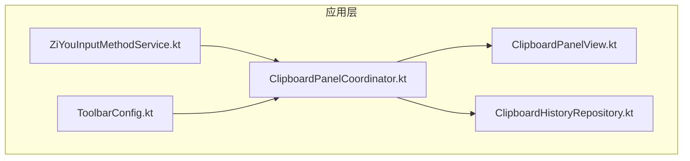
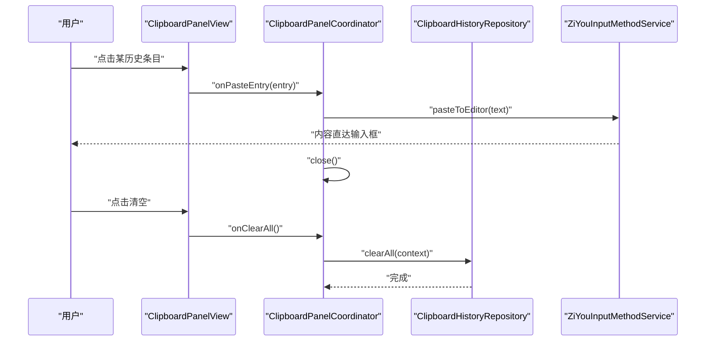
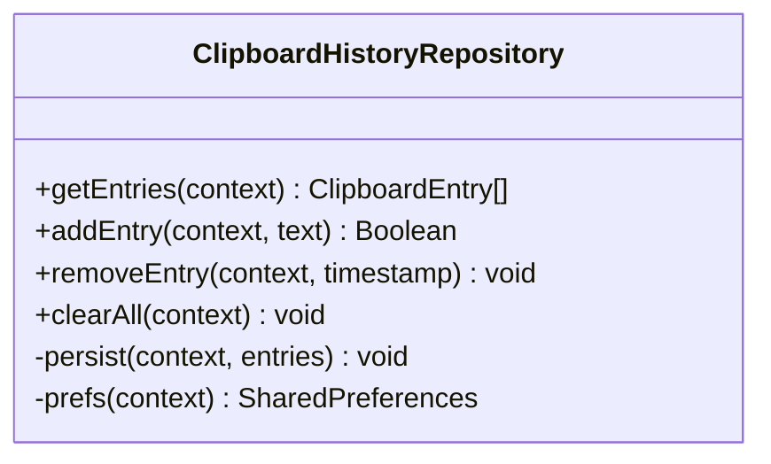
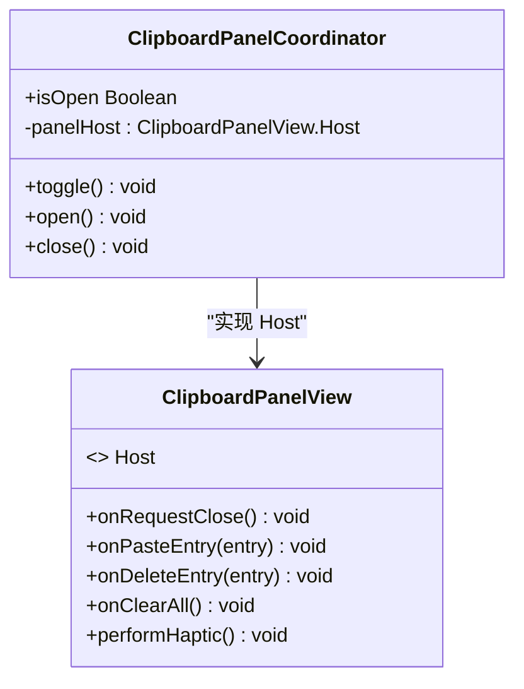
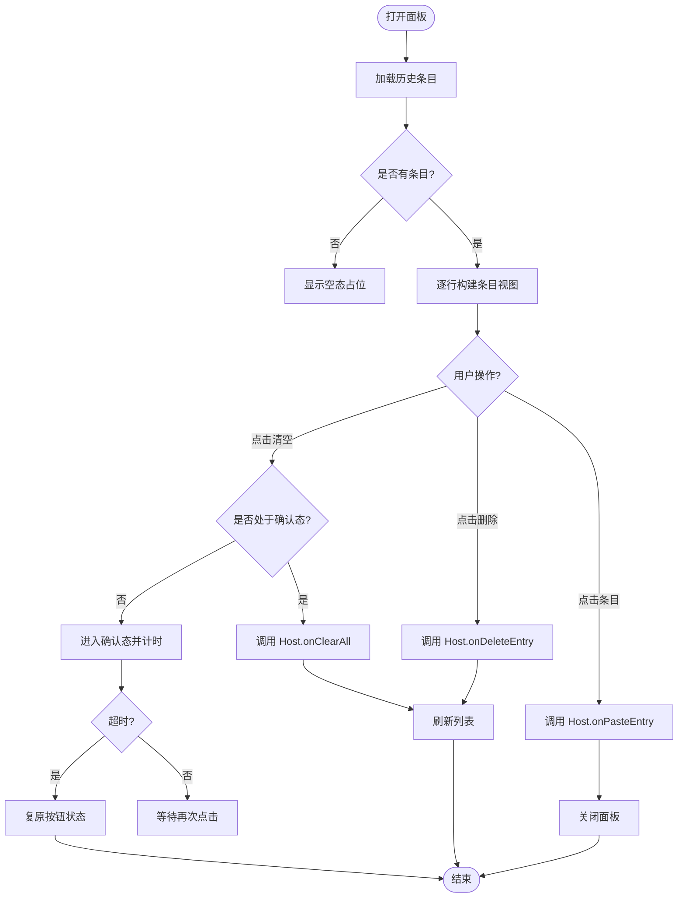
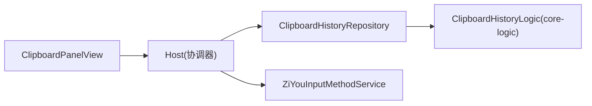

# 剪贴板 API

<cite>
**本文引用的文件**
- [ClipboardHistoryRepository.kt](file://app/src/main/java/com/ziyou/ime/data/ClipboardHistoryRepository.kt)
- [ClipboardPanelCoordinator.kt](file://app/src/main/java/com/ziyou/ime/ime/ClipboardPanelCoordinator.kt)
- [ClipboardPanelView.kt](file://app/src/main/java/com/ziyou/ime/ime/ClipboardPanelView.kt)
- [ToolbarConfig.kt](file://app/src/main/java/com/ziyou/ime/data/ToolbarConfig.kt)
- [ZiYouInputMethodService.kt](file://app/src/main/java/com/ziyou/ime/ime/ZiYouInputMethodService.kt)
- [ClipboardHistoryLogicTest.kt](file://core-logic/src/test/java/com/ziyou/ime/core/clipboard/ClipboardHistoryLogicTest.kt)
</cite>

## 目录
1. [简介](#简介)
2. [项目结构](#项目结构)
3. [核心组件](#核心组件)
4. [架构总览](#架构总览)
5. [详细组件分析](#详细组件分析)
6. [依赖关系分析](#依赖关系分析)
7. [性能考量](#性能考量)
8. [故障排查指南](#故障排查指南)
9. [结论](#结论)
10. [附录](#附录)

## 简介
本文件为输入法工程中的“剪贴板操作 API”完整文档，聚焦于文本内容的读取与写入、历史管理与冲突处理、权限与授权流程、以及安全与用户体验设计。该实现以轻量持久化（SharedPreferences）+ 内存缓存为核心，提供稳定的历史记录能力；通过面板协调器与视图层解耦输入链路，确保对 Rime 引擎零侵入。

## 项目结构
剪贴板相关代码主要分布在 app 模块的 data 与 ime 包中，核心逻辑由仓库与协调器组成，UI 由独立面板视图承载，工具栏配置暴露“粘贴板”入口。

图表来源
- [ZiYouInputMethodService.kt](file://app/src/main/java/com/ziyou/ime/ime/ZiYouInputMethodService.kt)
- [ClipboardPanelCoordinator.kt](file://app/src/main/java/com/ziyou/ime/ime/ClipboardPanelCoordinator.kt)
- [ClipboardPanelView.kt](file://app/src/main/java/com/ziyou/ime/ime/ClipboardPanelView.kt)
- [ClipboardHistoryRepository.kt](file://app/src/main/java/com/ziyou/ime/data/ClipboardHistoryRepository.kt)
- [ToolbarConfig.kt](file://app/src/main/java/com/ziyou/ime/data/ToolbarConfig.kt)

章节来源
- [ClipboardHistoryRepository.kt:1-71](file://app/src/main/java/com/ziyou/ime/data/ClipboardHistoryRepository.kt#L1-L71)
- [ClipboardPanelCoordinator.kt:1-141](file://app/src/main/java/com/ziyou/ime/ime/ClipboardPanelCoordinator.kt#L1-L141)
- [ClipboardPanelView.kt:1-275](file://app/src/main/java/com/ziyou/ime/ime/ClipboardPanelView.kt#L1-L275)
- [ToolbarConfig.kt:1-85](file://app/src/main/java/com/ziyou/ime/data/ToolbarConfig.kt#L1-L85)

## 核心组件
- 剪贴板历史仓库：负责历史条目的读、写、删、清空与持久化，采用单键存储 + 内存缓存，保证热路径无 IO。
- 剪贴板面板协调器：管理面板生命周期、键盘/候选区高度守恒策略、与宿主输入框的直接粘贴通道。
- 剪贴板面板视图：展示历史条目、支持删除与清空二次确认，所有交互通过 Host 接口回调给协调器。
- 工具栏配置：默认包含“粘贴板”按钮，作为用户进入面板的入口之一。

章节来源
- [ClipboardHistoryRepository.kt:19-70](file://app/src/main/java/com/ziyou/ime/data/ClipboardHistoryRepository.kt#L19-L70)
- [ClipboardPanelCoordinator.kt:31-141](file://app/src/main/java/com/ziyou/ime/ime/ClipboardPanelCoordinator.kt#L31-L141)
- [ClipboardPanelView.kt:33-275](file://app/src/main/java/com/ziyou/ime/ime/ClipboardPanelView.kt#L33-L275)
- [ToolbarConfig.kt:28-51](file://app/src/main/java/com/ziyou/ime/data/ToolbarConfig.kt#L28-L51)

## 架构总览
剪贴板 API 的调用链从 UI 到数据层清晰分层：面板点击 → 协调器 → 仓库 → 持久化；粘贴动作绕过面板路由直接提交到宿主输入框，避免对输入法引擎的侵入。

图表来源
- [ClipboardPanelView.kt:206-210](file://app/src/main/java/com/ziyou/ime/ime/ClipboardPanelView.kt#L206-L210)
- [ClipboardPanelCoordinator.kt:120-134](file://app/src/main/java/com/ziyou/ime/ime/ClipboardPanelCoordinator.kt#L120-L134)
- [ClipboardHistoryRepository.kt:55-58](file://app/src/main/java/com/ziyou/ime/data/ClipboardHistoryRepository.kt#L55-L58)
- [ZiYouInputMethodService.kt](file://app/src/main/java/com/ziyou/ime/ime/ZiYouInputMethodService.kt)

## 详细组件分析

### 剪贴板历史仓库（ClipboardHistoryRepository）
- 职责：提供历史列表的读取、新增、删除、清空与持久化；维护内存缓存，读路径 O(1)。
- 数据结构：List<ClipboardEntry>，按时间倒序（最新在前）。
- 持久化：单键 SharedPreferences，编解码委托 core-logic 的 ClipboardHistoryLogic。
- 并发与线程：主线程调用，缓存无并发写；@Volatile 仅兜底可见性。
- 关键方法：
  - getEntries(context): 返回缓存或从 SP 解码并缓存。
  - addEntry(context, text): 头插新条目，去重/截断/容量裁剪由逻辑层决定。
  - removeEntry(context, timestamp): 按时间戳幂等删除。
  - clearAll(context): 清空缓存并移除 SP 键值。

图表来源
- [ClipboardHistoryRepository.kt:29-66](file://app/src/main/java/com/ziyou/ime/data/ClipboardHistoryRepository.kt#L29-L66)

章节来源
- [ClipboardHistoryRepository.kt:19-70](file://app/src/main/java/com/ziyou/ime/data/ClipboardHistoryRepository.kt#L19-L70)

### 剪贴板面板协调器（ClipboardPanelCoordinator）
- 职责：管理面板打开/关闭、键盘与候选区的高度守恒策略、与宿主粘贴通道、面板内事件分发。
- 约束：悬浮键盘模式下不开放面板，提示 Toast。
- 关键行为：
  - open(): 挂载面板、收起键盘/候选区、设置固定高度接管空间。
  - close(): 恢复键盘/候选区可见并从容器移除。
  - toggle(): 切换开关。
  - pasteToEditor(text): 直接提交到宿主输入框，绕过面板路由。
  - 事件回调：删除条目、清空全部、震动反馈。

图表来源
- [ClipboardPanelCoordinator.kt:31-141](file://app/src/main/java/com/ziyou/ime/ime/ClipboardPanelCoordinator.kt#L31-L141)
- [ClipboardPanelView.kt:40-55](file://app/src/main/java/com/ziyou/ime/ime/ClipboardPanelView.kt#L40-L55)

章节来源
- [ClipboardPanelCoordinator.kt:72-134](file://app/src/main/java/com/ziyou/ime/ime/ClipboardPanelCoordinator.kt#L72-L134)

### 剪贴板面板视图（ClipboardPanelView）
- 职责：展示标题栏与条目列表，支持删除与清空二次确认，所有交互通过 Host 回调。
- 交互细节：
  - 清空二次确认：首次点击变为“确认清空？”，超时自动复原。
  - 空态占位：无条目时显示提示文案。
  - 行构建：每行包含文本（最多两行省略）、相对时间、删除按钮。
- 刷新机制：submitEntries(entries) 重建行视图并切换空态。

图表来源
- [ClipboardPanelView.kt:143-162](file://app/src/main/java/com/ziyou/ime/ime/ClipboardPanelView.kt#L143-L162)
- [ClipboardPanelView.kt:216-227](file://app/src/main/java/com/ziyou/ime/ime/ClipboardPanelView.kt#L216-L227)

章节来源
- [ClipboardPanelView.kt:143-241](file://app/src/main/java/com/ziyou/ime/ime/ClipboardPanelView.kt#L143-L241)

### 工具栏配置（ToolbarConfig）
- 作用：定义功能栏预设模板，默认包含“粘贴板”按钮 id。
- 使用方式：设置页选择预设后，功能栏渲染对应按钮；“粘贴板”按钮触发面板协调器的 toggle。

章节来源
- [ToolbarConfig.kt:28-51](file://app/src/main/java/com/ziyou/ime/data/ToolbarConfig.kt#L28-L51)

## 依赖关系分析
- 组件耦合：
  - 面板视图仅依赖 Host 接口，降低与协调器的耦合。
  - 协调器依赖仓库进行数据变更，依赖服务提供的粘贴通道与视图容器。
  - 仓库依赖 core-logic 的编解码逻辑（在测试中体现）。
- 外部依赖：
  - Android SharedPreferences 用于持久化。
  - Android 系统剪贴板 API（读取/写入）由上层服务或宿主实现，当前仓库未直接调用系统剪贴板。

图表来源
- [ClipboardPanelView.kt:40-55](file://app/src/main/java/com/ziyou/ime/ime/ClipboardPanelView.kt#L40-L55)
- [ClipboardPanelCoordinator.kt:117-139](file://app/src/main/java/com/ziyou/ime/ime/ClipboardPanelCoordinator.kt#L117-L139)
- [ClipboardHistoryRepository.kt:4-5](file://app/src/main/java/com/ziyou/ime/data/ClipboardHistoryRepository.kt#L4-L5)

章节来源
- [ClipboardPanelCoordinator.kt:117-139](file://app/src/main/java/com/ziyou/ime/ime/ClipboardPanelCoordinator.kt#L117-L139)
- [ClipboardHistoryRepository.kt:4-5](file://app/src/main/java/com/ziyou/ime/data/ClipboardHistoryRepository.kt#L4-L5)

## 性能考量
- 读路径优化：内存缓存命中即返回，避免重复 IO；冷启动首次解码后缓存。
- 写路径优化：先更新缓存再异步 apply() 落盘，不阻塞主线程。
- 容量限制：历史条目上限由逻辑层控制（测试用例体现），面板展示不超过 10 条，重建开销可忽略。
- 布局策略：面板高度等于键盘+候选区实测高度之和，保持 IME 窗口总高不变，减少重排。

章节来源
- [ClipboardHistoryRepository.kt:29-66](file://app/src/main/java/com/ziyou/ime/data/ClipboardHistoryRepository.kt#L29-L66)
- [ClipboardPanelCoordinator.kt:91-104](file://app/src/main/java/com/ziyou/ime/ime/ClipboardPanelCoordinator.kt#L91-L104)
- [ClipboardPanelView.kt:143-162](file://app/src/main/java/com/ziyou/ime/ime/ClipboardPanelView.kt#L143-L162)
- [ClipboardHistoryLogicTest.kt](file://core-logic/src/test/java/com/ziyou/ime/core/clipboard/ClipboardHistoryLogicTest.kt)

## 故障排查指南
- 面板无法打开：
  - 检查是否在悬浮键盘模式（会提示不支持）。
  - 确认宿主提供的 contentLayout、keyboardContainer、candidatesContainer 非空。
- 粘贴无效：
  - 确认宿主 pasteToEditor 已正确调用 commitDirectToEditor。
- 历史未保存：
  - 检查 SharedPreferences 键名与编码逻辑是否正确。
  - 确认 addEntry 返回值是否为 true（空白文本拒收将跳过落盘）。
- 清空误触：
  - 利用二次确认态防止误操作；若仍发生，检查超时任务是否被取消。

章节来源
- [ClipboardPanelCoordinator.kt:82-85](file://app/src/main/java/com/ziyou/ime/ime/ClipboardPanelCoordinator.kt#L82-L85)
- [ClipboardPanelView.kt:216-227](file://app/src/main/java/com/ziyou/ime/ime/ClipboardPanelView.kt#L216-L227)
- [ClipboardHistoryRepository.kt:39-45](file://app/src/main/java/com/ziyou/ime/data/ClipboardHistoryRepository.kt#L39-L45)

## 结论
本剪贴板 API 以清晰的层次结构与轻量实现，提供了稳定可靠的文本历史管理能力。通过面板协调器与视图解耦，既保证了输入链路的纯净，也提升了用户体验。建议在后续迭代中补充富文本格式支持与更完善的权限提示，同时继续优化敏感信息保护与批量操作体验。

## 附录

### 权限与授权流程
- 系统权限：Android 10+ 对剪贴板访问有隐私限制，需在需要时向用户说明用途并获得授权。
- 建议流程：
  - 首次使用剪贴板功能时，弹出说明并请求授权。
  - 记录用户授权状态，避免重复弹窗。
  - 拒绝授权时降级为只读本地历史，不尝试系统剪贴板。

### 安全性与用户体验
- 敏感信息保护：
  - 对历史条目进行脱敏提示（如密码类关键词）。
  - 提供一键清空与单条删除能力。
- 操作反馈：
  - 点击条目与删除均提供震动反馈。
  - 清空操作需二次确认，防止误删。
- 批量操作：
  - 当前实现以单条为主，可在未来扩展批量选择与批量粘贴。

### 实际应用场景
- 内容复制粘贴：从历史快速插入常用文本。
- 批量操作：未来可扩展多选与批量粘贴。
- 创作效率：结合 AI 面板与技能面板，提升输入效率。