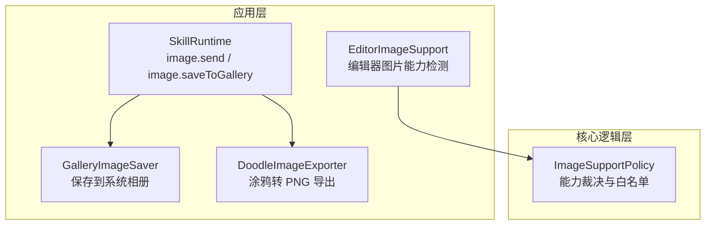
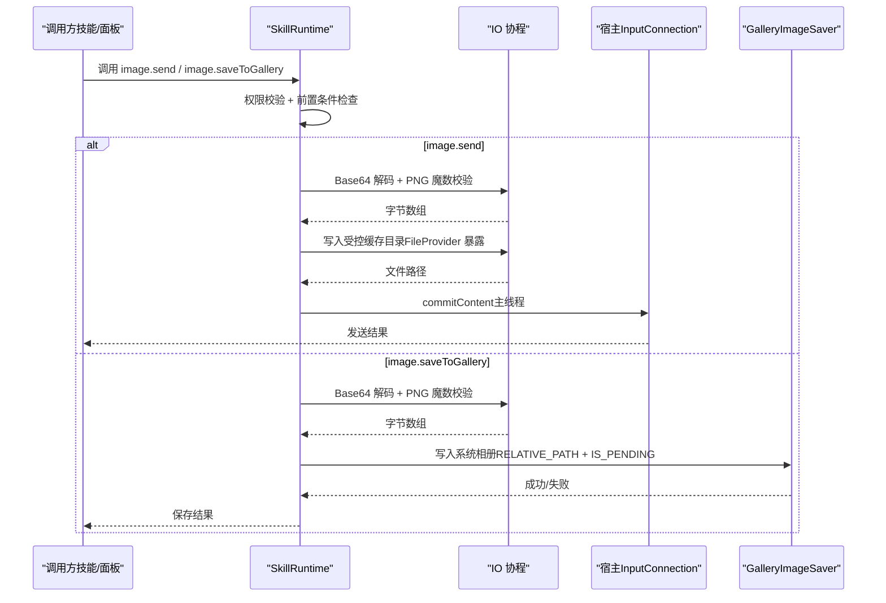
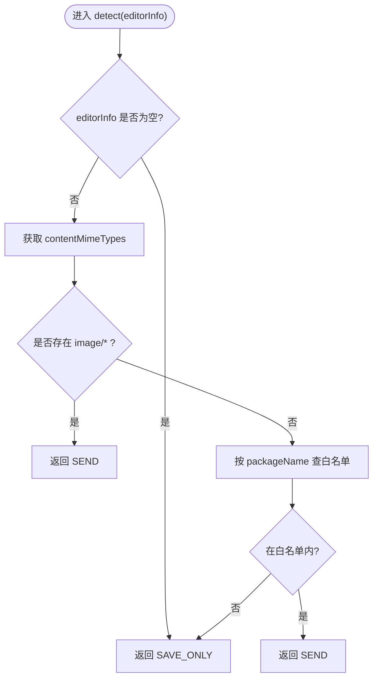
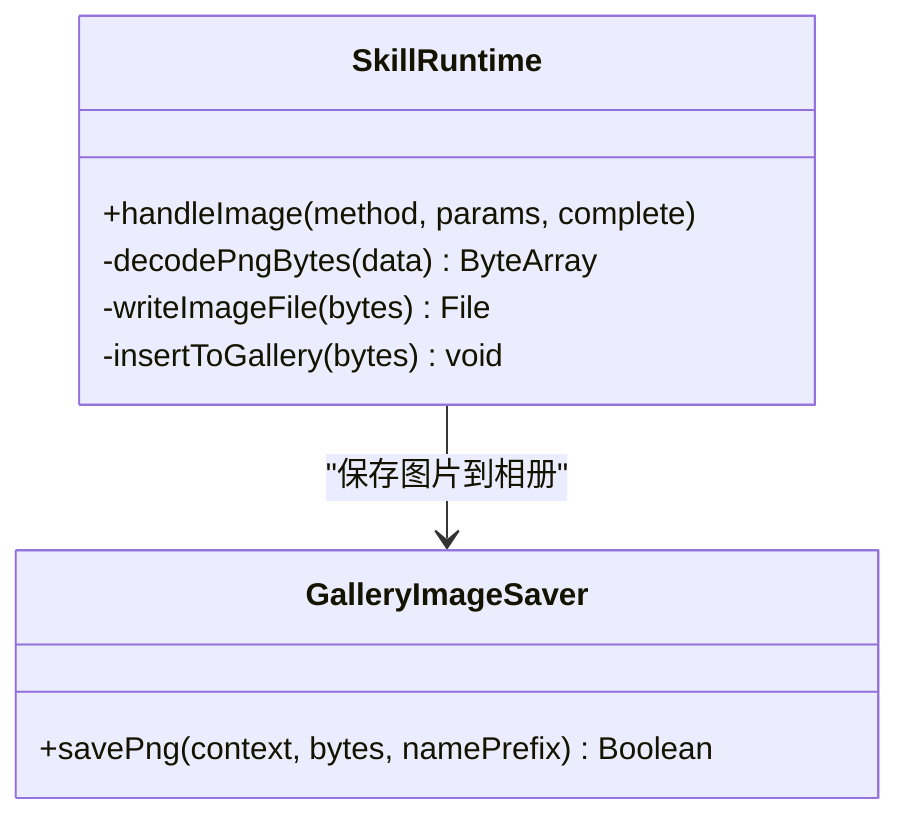
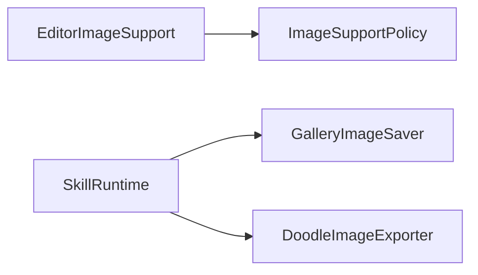

# 图片处理 API

<cite>
**本文引用的文件**   
- [EditorImageSupport.kt](file://app/src/main/java/com/ziyou/ime/ime/EditorImageSupport.kt)
- [ImageSupportPolicy.kt](file://core-logic/src/main/java/com/ziyou/ime/core/image/ImageSupportPolicy.kt)
- [SkillRuntime.kt](file://app/src/main/java/com/ziyou/ime/skill/SkillRuntime.kt)
- [GalleryImageSaver.kt](file://app/src/main/java/com/ziyou/ime/ime/GalleryImageSaver.kt)
- [DoodleImageExporter.kt](file://app/src/main/java/com/ziyou/ime/ime/DoodleImageExporter.kt)
- [ImeImageCacheTest.kt](file://app/src/test/java/com/ziyou/ime/ime/ImeImageCacheTest.kt)
</cite>

## 目录
1. [简介](#简介)
2. [项目结构](#项目结构)
3. [核心组件](#核心组件)
4. [架构总览](#架构总览)
5. [详细组件分析](#详细组件分析)
6. [依赖关系分析](#依赖关系分析)
7. [性能考虑](#性能考虑)
8. [故障排查指南](#故障排查指南)
9. [结论](#结论)
10. [附录](#附录)

## 简介
本文件面向“图片处理相关 API”的完整文档，聚焦 image.* 接口在输入法的图片加载、处理与保存能力。内容涵盖：
- 支持的图片格式与质量策略（PNG 优先，魔数校验）
- 图片发送与保存到系统相册的统一流程
- 编辑器图片能力检测与白名单机制
- 内存管理与缓存策略（含过期清理与上限控制）
- 典型应用场景（涂鸦导出、技能发图/存图、格式转换思路）
- 性能优化建议（懒加载、缩略图、内存泄漏防护）

## 项目结构
与图片处理相关的代码主要分布在以下模块与文件：
- app 层：编辑器能力检测、画廊保存、涂鸦导出、技能运行时图片 API
- core-logic 层：图片能力策略与枚举定义
- 测试：图片缓存清理策略验证

图表来源
- [EditorImageSupport.kt:1-31](file://app/src/main/java/com/ziyou/ime/ime/EditorImageSupport.kt#L1-L31)
- [ImageSupportPolicy.kt:1-61](file://core-logic/src/main/java/com/ziyou/ime/core/image/ImageSupportPolicy.kt#L1-L61)
- [SkillRuntime.kt:280-366](file://app/src/main/java/com/ziyou/ime/skill/SkillRuntime.kt#L280-L366)
- [GalleryImageSaver.kt:1-64](file://app/src/main/java/com/ziyou/ime/ime/GalleryImageSaver.kt#L1-L64)
- [DoodleImageExporter.kt:1-64](file://app/src/main/java/com/ziyou/ime/ime/DoodleImageExporter.kt#L1-L64)

章节来源
- [EditorImageSupport.kt:1-31](file://app/src/main/java/com/ziyou/ime/ime/EditorImageSupport.kt#L1-L31)
- [ImageSupportPolicy.kt:1-61](file://core-logic/src/main/java/com/ziyou/ime/core/image/ImageSupportPolicy.kt#L1-L61)
- [SkillRuntime.kt:280-366](file://app/src/main/java/com/ziyou/ime/skill/SkillRuntime.kt#L280-L366)
- [GalleryImageSaver.kt:1-64](file://app/src/main/java/com/ziyou/ime/ime/GalleryImageSaver.kt#L1-L64)
- [DoodleImageExporter.kt:1-64](file://app/src/main/java/com/ziyou/ime/ime/DoodleImageExporter.kt#L1-L64)

## 核心组件
- 编辑器图片能力检测：依据 EditorInfo 声明的 MIME 类型或包名白名单判定是否支持“发送”富媒体图片，否则仅支持“保存”。
- 技能图片 API：image.send（提交到当前输入框）、image.saveToGallery（写入系统相册），统一权限校验、参数校验与异常处理。
- 相册保存：基于 Android 10+ MediaStore RELATIVE_PATH + IS_PENDING 免权限写入 Pictures/字由输入法/。
- 涂鸦导出：将透明底快照合成白底 PNG，超宽等比降采样，输出至受控缓存目录。
- 图片能力策略：纯逻辑裁决，O(1) 白名单查询，热路径零分配。

章节来源
- [EditorImageSupport.kt:1-31](file://app/src/main/java/com/ziyou/ime/ime/EditorImageSupport.kt#L1-L31)
- [ImageSupportPolicy.kt:1-61](file://core-logic/src/main/java/com/ziyou/ime/core/image/ImageSupportPolicy.kt#L1-L61)
- [SkillRuntime.kt:280-366](file://app/src/main/java/com/ziyou/ime/skill/SkillRuntime.kt#L280-L366)
- [GalleryImageSaver.kt:1-64](file://app/src/main/java/com/ziyou/ime/ime/GalleryImageSaver.kt#L1-L64)
- [DoodleImageExporter.kt:1-64](file://app/src/main/java/com/ziyou/ime/ime/DoodleImageExporter.kt#L1-L64)

## 架构总览
下图展示了从技能调用 image.* 到最终发送或保存的端到端流程，包括权限检查、数据解码、IO 操作与宿主提交。

图表来源
- [SkillRuntime.kt:280-366](file://app/src/main/java/com/ziyou/ime/skill/SkillRuntime.kt#L280-L366)
- [GalleryImageSaver.kt:1-64](file://app/src/main/java/com/ziyou/ime/ime/GalleryImageSaver.kt#L1-L64)

## 详细组件分析

### 编辑器图片能力检测（EditorImageSupport）
- 功能：根据 EditorInfo 的 contentMimeTypes 是否包含 image/* 通配类型，结合包名白名单，返回 ImageSupportLevel（SEND 或 SAVE_ONLY）。
- 行为：当 editorInfo 为 null 时视为仅可保存；每次焦点切换都会重新检测。
- 适用场景：驱动 UI 按钮显示“发送”或“保存”，避免无效操作。

图表来源
- [EditorImageSupport.kt:1-31](file://app/src/main/java/com/ziyou/ime/ime/EditorImageSupport.kt#L1-L31)
- [ImageSupportPolicy.kt:1-61](file://core-logic/src/main/java/com/ziyou/ime/core/image/ImageSupportPolicy.kt#L1-L61)

章节来源
- [EditorImageSupport.kt:1-31](file://app/src/main/java/com/ziyou/ime/ime/EditorImageSupport.kt#L1-L31)
- [ImageSupportPolicy.kt:1-61](file://core-logic/src/main/java/com/ziyou/ime/core/image/ImageSupportPolicy.kt#L1-L61)

### 技能图片 API（SkillRuntime.image.*）
- 方法：
  - image.send：将 PNG 字节通过 FileProvider 暴露的缓存文件，经宿主 commitContent 提交到当前输入框。
  - image.saveToGallery：将 PNG 字节写入系统相册（Android 10+）。
- 安全与校验：
  - 权限：需具备 image 权限。
  - 前置：image.send 要求当前编辑器接受图片；image.saveToGallery 要求 Android 10+。
  - 数据：Base64 解码并校验 PNG 魔数，仅允许 PNG。
- 执行模型：
  - 主线程即时失败（权限/前置/参数），IO 操作（解码/写盘/相册写入）在 IO 协程执行。
  - commitContent 必须在主线程。

图表来源
- [SkillRuntime.kt:280-366](file://app/src/main/java/com/ziyou/ime/skill/SkillRuntime.kt#L280-L366)
- [GalleryImageSaver.kt:1-64](file://app/src/main/java/com/ziyou/ime/ime/GalleryImageSaver.kt#L1-L64)

章节来源
- [SkillRuntime.kt:280-366](file://app/src/main/java/com/ziyou/ime/skill/SkillRuntime.kt#L280-L366)
- [GalleryImageSaver.kt:1-64](file://app/src/main/java/com/ziyou/ime/ime/GalleryImageSaver.kt#L1-L64)

### 相册保存（GalleryImageSaver）
- 目标：统一出口将 PNG 字节写入系统相册 Pictures/字由输入法/。
- 平台特性：基于 Android 10+ MediaStore RELATIVE_PATH + IS_PENDING 免存储权限；低版本直接拒绝。
- 错误处理：写入失败或删除残留 pending 记录，确保一致性。

章节来源
- [GalleryImageSaver.kt:1-64](file://app/src/main/java/com/ziyou/ime/ime/GalleryImageSaver.kt#L1-L64)

### 涂鸦导出（DoodleImageExporter）
- 功能：将透明底快照合成为白底 PNG，宽度超限则等比降采样，输出到受控缓存目录。
- 质量与尺寸：最大导出宽度限制，避免超大 Bitmap 导致内存压力。
- 资源管理：输出 Bitmap 使用后立即 recycle，避免泄漏。

章节来源
- [DoodleImageExporter.kt:1-64](file://app/src/main/java/com/ziyou/ime/ime/DoodleImageExporter.kt#L1-L64)

### 图片能力策略（ImageSupportPolicy）
- 决策逻辑：若编辑器声明 image 通配 MIME 或包名在白名单内，则返回 SEND，否则 SAVE_ONLY。
- 白名单：内置常见聊天应用的包名集合，构建期一次性初始化，查询 O(1)。

章节来源
- [ImageSupportPolicy.kt:1-61](file://core-logic/src/main/java/com/ziyou/ime/core/image/ImageSupportPolicy.kt#L1-L61)

## 依赖关系分析
- EditorImageSupport 依赖 ImageSupportPolicy 进行能力裁决。
- SkillRuntime 依赖 GalleryImageSaver 完成相册写入，并通过宿主提交图片。
- DoodleImageExporter 输出 PNG 文件供发送或保存使用。
- 缓存清理策略由 ImeImageCache 提供（测试覆盖过期删除与上限补删）。

图表来源
- [EditorImageSupport.kt:1-31](file://app/src/main/java/com/ziyou/ime/ime/EditorImageSupport.kt#L1-L31)
- [ImageSupportPolicy.kt:1-61](file://core-logic/src/main/java/com/ziyou/ime/core/image/ImageSupportPolicy.kt#L1-L61)
- [SkillRuntime.kt:280-366](file://app/src/main/java/com/ziyou/ime/skill/SkillRuntime.kt#L280-L366)
- [GalleryImageSaver.kt:1-64](file://app/src/main/java/com/ziyou/ime/ime/GalleryImageSaver.kt#L1-L64)
- [DoodleImageExporter.kt:1-64](file://app/src/main/java/com/ziyou/ime/ime/DoodleImageExporter.kt#L1-L64)

章节来源
- [ImeImageCacheTest.kt:1-71](file://app/src/test/java/com/ziyou/ime/ime/ImeImageCacheTest.kt#L1-L71)

## 性能考虑
- 懒加载与按需解码：仅在需要时解码 Base64 与生成 PNG，避免不必要的 IO。
- 缩略图与降采样：导出时限制最大宽度，减少内存占用与传输体积。
- 缓存与过期清理：
  - 使用受控缓存目录，定期清理过期文件。
  - 保留最近 N 个文件，按 mtime 从旧到新补删，防止爆量。
- 内存管理：
  - 及时 recycle 中间 Bitmap，避免泄漏。
  - 大对象尽量在后台线程处理，避免阻塞主线程。
- 网络与并发（技能 fetch 相关）：限频、限并发、响应大小限制，避免滥用。

[本节为通用指导，不直接分析具体文件]

## 故障排查指南
- 当前输入框不支持接收图片：
  - 现象：image.send 失败。
  - 排查：确认 EditorInfo 是否声明 image/* MIME，或包名是否在白名单。
- 保存到相册失败：
  - 现象：image.saveToGallery 失败。
  - 排查：系统版本是否 Android 10+；MediaStore 写入是否成功；是否有残留 pending 记录。
- 图片数据无效：
  - 现象：Base64 解码失败或 PNG 魔数不符。
  - 排查：确认传入 data 字段有效且为 PNG。
- 缓存空间不足或文件未清理：
  - 现象：频繁发图后磁盘增长。
  - 排查：确认 pruneExpired 是否按过期阈值与上限策略清理。

章节来源
- [SkillRuntime.kt:280-366](file://app/src/main/java/com/ziyou/ime/skill/SkillRuntime.kt#L280-L366)
- [GalleryImageSaver.kt:1-64](file://app/src/main/java/com/ziyou/ime/ime/GalleryImageSaver.kt#L1-L64)
- [ImeImageCacheTest.kt:1-71](file://app/src/test/java/com/ziyou/ime/ime/ImeImageCacheTest.kt#L1-L71)

## 结论
本项目围绕 image.* 接口构建了完整的图片处理能力：
- 以 PNG 为核心格式，严格魔数校验保障安全性与兼容性。
- 通过编辑器能力检测与白名单机制，精准决定“发送”或“保存”路径。
- 统一的相册写入与受控缓存目录，保证跨应用兼容与资源可控。
- 完善的错误处理与性能优化策略，提升用户体验与稳定性。

[本节为总结性内容，不直接分析具体文件]

## 附录
- 支持格式：PNG（强制魔数校验）
- 压缩与质量：导出默认 PNG 无损压缩；如需有损压缩可在导出阶段调整压缩参数（当前实现保持高质量）
- 内存与缓存：中间 Bitmap 及时回收；缓存目录按过期与上限策略清理
- 典型场景：
  - 涂鸦编辑后发送/保存
  - 技能生成图片并发送到输入框或保存到相册
  - 格式转换思路：先解码为 Bitmap，再按需编码为目标格式（当前实现聚焦 PNG）

[本节为补充信息，不直接分析具体文件]