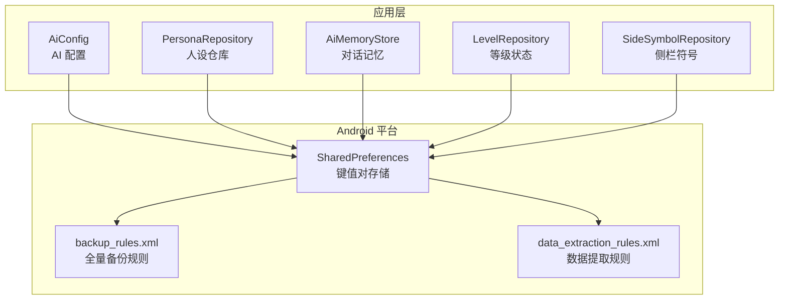
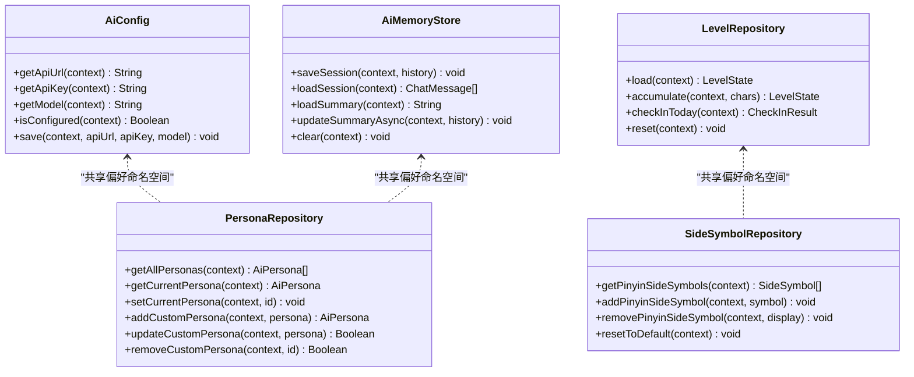
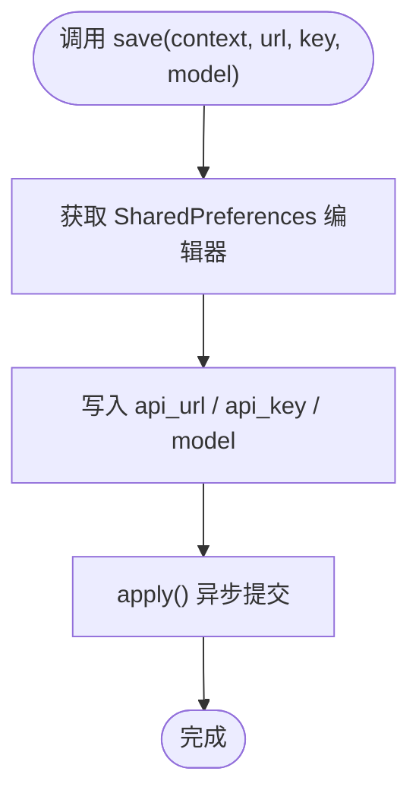
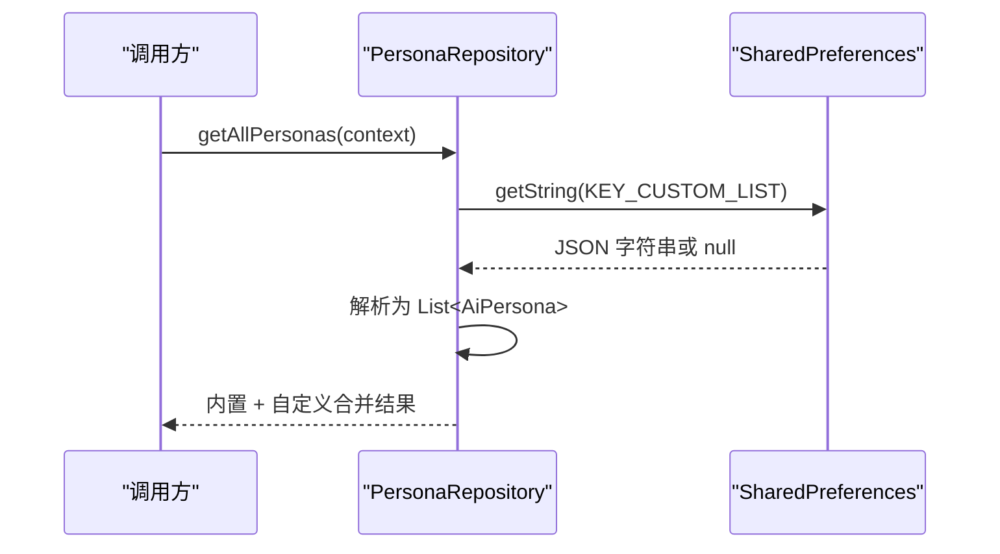
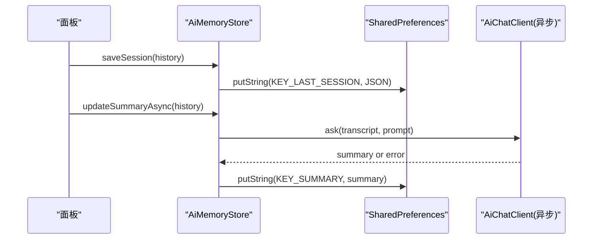
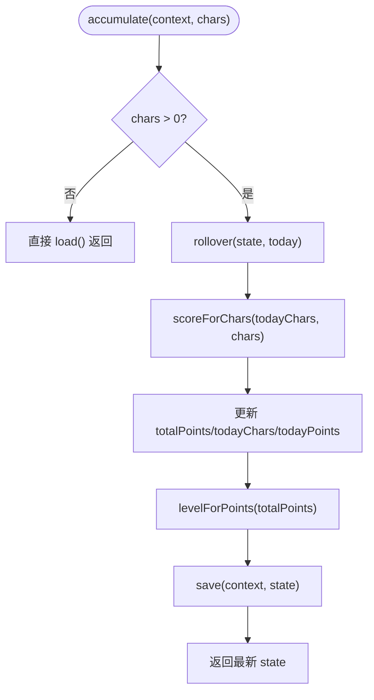
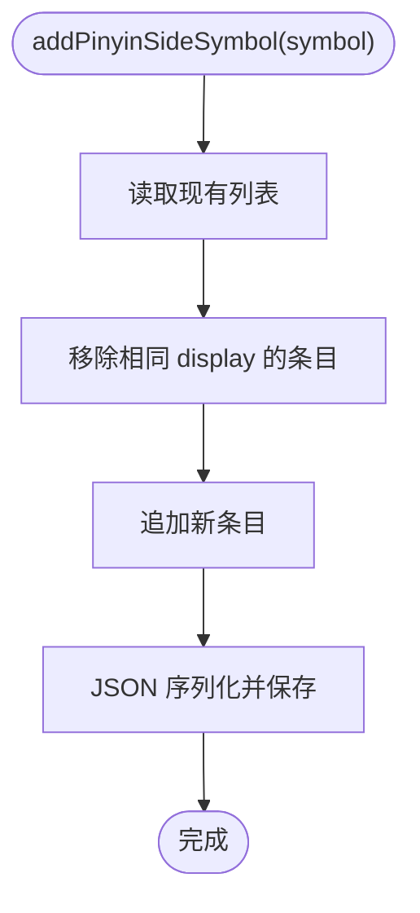
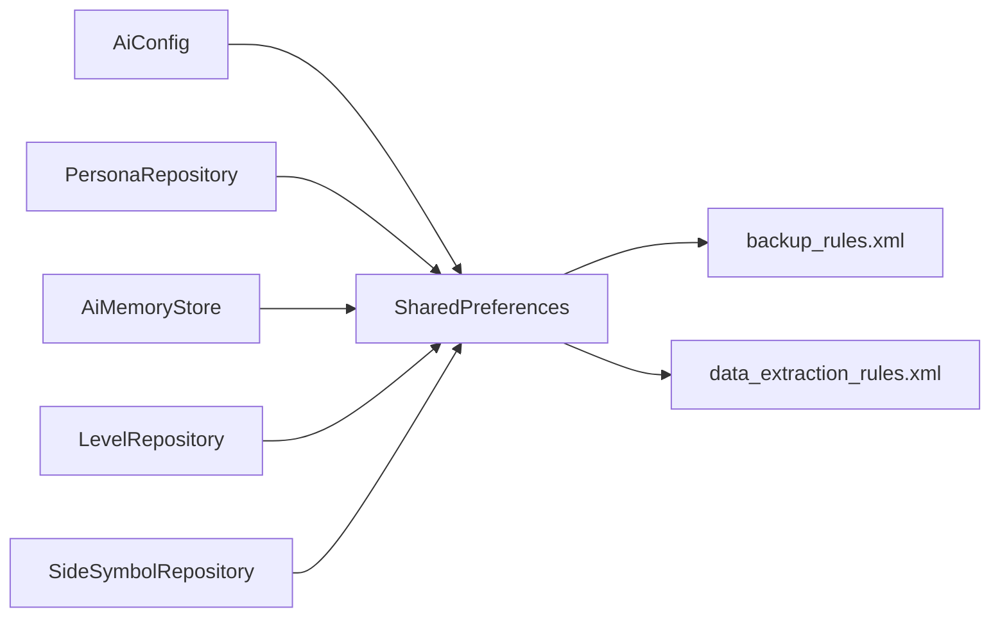

# 存储 API

<cite>
**本文引用的文件**   
- [AiConfig.kt](file://app/src/main/java/com/ziyou/ime/ai/AiConfig.kt)
- [PersonaRepository.kt](file://app/src/main/java/com/ziyou/ime/ai/PersonaRepository.kt)
- [AiMemoryStore.kt](file://app/src/main/java/com/ziyou/ime/ai/knowledge/AiMemoryStore.kt)
- [LevelRepository.kt](file://app/src/main/java/com/ziyou/ime/level/LevelRepository.kt)
- [SideSymbol.kt](file://app/src/main/java/com/ziyou/ime/data/SideSymbol.kt)
- [backup_rules.xml](file://app/src/main/res/xml/backup_rules.xml)
- [data_extraction_rules.xml](file://app/src/main/res/xml/data_extraction_rules.xml)
</cite>

## 目录
1. [简介](#简介)
2. [项目结构](#项目结构)
3. [核心组件](#核心组件)
4. [架构总览](#架构总览)
5. [详细组件分析](#详细组件分析)
6. [依赖关系分析](#依赖关系分析)
7. [性能考量](#性能考量)
8. [故障排查指南](#故障排查指南)
9. [结论](#结论)
10. [附录](#附录)

## 简介
本文件系统化梳理项目中与“存储”相关的 API，覆盖本地键值对持久化、数据序列化、存储空间限制、数据清理策略、备份恢复机制以及异步操作模式。项目采用 SharedPreferences + JSON 的轻量方案实现各类业务数据的持久化，包括 AI 配置、人设管理、对话记忆、等级统计与侧栏符号等。文档同时给出数据安全与隐私保护建议、最佳实践（数据结构设计、缓存策略、数据迁移）及常见问题定位方法。

## 项目结构
存储相关代码集中在 app 模块的多个仓库对象中，均以单例形式提供统一的读写接口；备份规则通过 XML 声明。整体组织方式按功能域划分：AI 配置与记忆、人设、等级系统、侧栏符号，以及 Android 备份/提取规则。

图表来源
- [AiConfig.kt:14-55](file://app/src/main/java/com/ziyou/ime/ai/AiConfig.kt#L14-L55)
- [PersonaRepository.kt:25-147](file://app/src/main/java/com/ziyou/ime/ai/PersonaRepository.kt#L25-L147)
- [AiMemoryStore.kt:28-120](file://app/src/main/java/com/ziyou/ime/ai/knowledge/AiMemoryStore.kt#L28-L120)
- [LevelRepository.kt:53-180](file://app/src/main/java/com/ziyou/ime/level/LevelRepository.kt#L53-L180)
- [SideSymbol.kt:27-93](file://app/src/main/java/com/ziyou/ime/data/SideSymbol.kt#L27-L93)
- [backup_rules.xml:1-13](file://app/src/main/res/xml/backup_rules.xml#L1-L13)
- [data_extraction_rules.xml:1-19](file://app/src/main/res/xml/data_extraction_rules.xml#L1-L19)

章节来源
- [AiConfig.kt:14-55](file://app/src/main/java/com/ziyou/ime/ai/AiConfig.kt#L14-L55)
- [PersonaRepository.kt:25-147](file://app/src/main/java/com/ziyou/ime/ai/PersonaRepository.kt#L25-L147)
- [AiMemoryStore.kt:28-120](file://app/src/main/java/com/ziyou/ime/ai/knowledge/AiMemoryStore.kt#L28-L120)
- [LevelRepository.kt:53-180](file://app/src/main/java/com/ziyou/ime/level/LevelRepository.kt#L53-L180)
- [SideSymbol.kt:27-93](file://app/src/main/java/com/ziyou/ime/data/SideSymbol.kt#L27-L93)
- [backup_rules.xml:1-13](file://app/src/main/res/xml/backup_rules.xml#L1-L13)
- [data_extraction_rules.xml:1-19](file://app/src/main/res/xml/data_extraction_rules.xml#L1-L19)

## 核心组件
- AiConfig：以 SharedPreferences 持久化 OpenAI 兼容接口的连接参数（API 地址、Key、模型名），并提供读取与保存接口。
- PersonaRepository：以 SharedPreferences 存储自定义人设列表与当前选中 ID，内置人设不持久化，合并后返回。
- AiMemoryStore：两级记忆（最近会话历史、跨会话摘要），使用 SharedPreferences 持久化，支持异步生成摘要。
- LevelRepository：等级系统状态（累计积分、等级、当日计数、连续天数等）的持久化，线程安全写入。
- SideSymbolRepository：拼音侧栏符号的增删改查与默认回退，JSON 数组持久化。

章节来源
- [AiConfig.kt:14-55](file://app/src/main/java/com/ziyou/ime/ai/AiConfig.kt#L14-L55)
- [PersonaRepository.kt:25-147](file://app/src/main/java/com/ziyou/ime/ai/PersonaRepository.kt#L25-L147)
- [AiMemoryStore.kt:28-120](file://app/src/main/java/com/ziyou/ime/ai/knowledge/AiMemoryStore.kt#L28-L120)
- [LevelRepository.kt:53-180](file://app/src/main/java/com/ziyou/ime/level/LevelRepository.kt#L53-L180)
- [SideSymbol.kt:27-93](file://app/src/main/java/com/ziyou/ime/data/SideSymbol.kt#L27-L93)

## 架构总览
所有存储组件均围绕 SharedPreferences 构建，统一通过 getSharedPreferences(name, MODE_PRIVATE) 访问。复杂对象序列化为 JSON 字符串存储，读取时反序列化为业务对象。备份与提取规则由 XML 声明，默认未启用包含/排除项。

图表来源
- [AiConfig.kt:14-55](file://app/src/main/java/com/ziyou/ime/ai/AiConfig.kt#L14-L55)
- [PersonaRepository.kt:25-147](file://app/src/main/java/com/ziyou/ime/ai/PersonaRepository.kt#L25-L147)
- [AiMemoryStore.kt:28-120](file://app/src/main/java/com/ziyou/ime/ai/knowledge/AiMemoryStore.kt#L28-L120)
- [LevelRepository.kt:53-180](file://app/src/main/java/com/ziyou/ime/level/LevelRepository.kt#L53-L180)
- [SideSymbol.kt:27-93](file://app/src/main/java/com/ziyou/ime/data/SideSymbol.kt#L27-L93)

## 详细组件分析

### AiConfig（AI 配置）
- 功能：持久化 API 地址、密钥、模型名，提供读取与保存接口，并判断是否已配置。
- 数据格式：三个字符串键值对，分别对应 URL、Key、Model。
- 错误处理：读取时若为空则回退到默认值；保存使用 apply() 异步落盘。
- 安全性：密钥明文存储于私有偏好，避免在日志中输出。

图表来源
- [AiConfig.kt:45-55](file://app/src/main/java/com/ziyou/ime/ai/AiConfig.kt#L45-L55)

章节来源
- [AiConfig.kt:14-55](file://app/src/main/java/com/ziyou/ime/ai/AiConfig.kt#L14-L55)

### PersonaRepository（人设仓库）
- 功能：维护内置与自定义人设，持久化自定义列表与当前选中 ID。
- 数据格式：KEY_CUSTOM_LIST 值为 JSON 数组，元素包含 id、name、description、systemPrompt。
- 一致性：内置人设不持久化，每次查询合并内置与自定义，保证升级后模板更新。
- 错误处理：反序列化失败记录日志并返回空列表；删除当前人设时自动回退默认。

图表来源
- [PersonaRepository.kt:38-49](file://app/src/main/java/com/ziyou/ime/ai/PersonaRepository.kt#L38-L49)
- [PersonaRepository.kt:110-143](file://app/src/main/java/com/ziyou/ime/ai/PersonaRepository.kt#L110-L143)

章节来源
- [PersonaRepository.kt:25-147](file://app/src/main/java/com/ziyou/ime/ai/PersonaRepository.kt#L25-L147)

### AiMemoryStore（对话记忆）
- 功能：两级记忆——最近会话历史（上限固定条数）、跨会话摘要（仅一条）。
- 数据格式：会话历史为 JSON 数组（role、content）；摘要为单条文本。
- 异步摘要：独立 IO 作用域触发网络请求生成摘要，失败静默保留旧摘要。
- 清理策略：清空全部记忆、历史为空时清除记录。

图表来源
- [AiMemoryStore.kt:51-77](file://app/src/main/java/com/ziyou/ime/ai/knowledge/AiMemoryStore.kt#L51-L77)
- [AiMemoryStore.kt:89-108](file://app/src/main/java/com/ziyou/ime/ai/knowledge/AiMemoryStore.kt#L89-L108)

章节来源
- [AiMemoryStore.kt:28-120](file://app/src/main/java/com/ziyou/ime/ai/knowledge/AiMemoryStore.kt#L28-L120)

### LevelRepository（等级状态）
- 功能：累计积分、等级计算、每日签到、连续天数统计。
- 数据格式：多字段键值对（total_points、level、today_date、today_chars、today_points、streak_days、last_active_date）。
- 线程安全：写方法加同步锁，防止并发冲突。
- 日期滚动：跨日重置当日计数，保留累计分与等级。

图表来源
- [LevelRepository.kt:87-102](file://app/src/main/java/com/ziyou/ime/level/LevelRepository.kt#L87-L102)
- [LevelRepository.kt:151-167](file://app/src/main/java/com/ziyou/ime/level/LevelRepository.kt#L151-L167)

章节来源
- [LevelRepository.kt:53-180](file://app/src/main/java/com/ziyou/ime/level/LevelRepository.kt#L53-L180)

### SideSymbolRepository（侧栏符号）
- 功能：拼音侧栏符号的增删改查与默认回退。
- 数据格式：JSON 数组，元素含显示文字与上屏值。
- 去重策略：按 display 去重，新增前移除同显示项。
- 默认行为：无用户自定义时返回内置集合。

图表来源
- [SideSymbol.kt:51-78](file://app/src/main/java/com/ziyou/ime/data/SideSymbol.kt#L51-L78)

章节来源
- [SideSymbol.kt:27-93](file://app/src/main/java/com/ziyou/ime/data/SideSymbol.kt#L27-L93)

## 依赖关系分析
- 耦合性：各仓库彼此解耦，仅通过 SharedPreferences 命名空间隔离；无循环依赖。
- 外部依赖：仅依赖 Android 平台的 SharedPreferences 与 org.json 进行序列化。
- 备份/提取：XML 规则未启用 include/exclude，默认不主动参与系统备份。

图表来源
- [AiConfig.kt:53-55](file://app/src/main/java/com/ziyou/ime/ai/AiConfig.kt#L53-L55)
- [PersonaRepository.kt:145-147](file://app/src/main/java/com/ziyou/ime/ai/PersonaRepository.kt#L145-L147)
- [AiMemoryStore.kt:118-120](file://app/src/main/java/com/ziyou/ime/ai/knowledge/AiMemoryStore.kt#L118-L120)
- [LevelRepository.kt:178-180](file://app/src/main/java/com/ziyou/ime/level/LevelRepository.kt#L178-L180)
- [SideSymbol.kt:91-93](file://app/src/main/java/com/ziyou/ime/data/SideSymbol.kt#L91-L93)
- [backup_rules.xml:1-13](file://app/src/main/res/xml/backup_rules.xml#L1-L13)
- [data_extraction_rules.xml:1-19](file://app/src/main/res/xml/data_extraction_rules.xml#L1-L19)

章节来源
- [backup_rules.xml:1-13](file://app/src/main/res/xml/backup_rules.xml#L1-L13)
- [data_extraction_rules.xml:1-19](file://app/src/main/res/xml/data_extraction_rules.xml#L1-L19)

## 性能考量
- I/O 模型：所有写操作使用 apply() 异步提交，避免阻塞主线程；读操作为同步但开销较小。
- 序列化成本：JSON 数组规模受业务限制（如会话历史上限），避免大对象频繁序列化。
- 并发控制：等级状态写方法加同步锁，确保热路径一致性。
- 内存占用：偏好文件体积增长缓慢，定期清理（如清空记忆）可释放空间。

[本节为通用指导，无需具体文件引用]

## 故障排查指南
- 反序列化异常：检查 JSON 结构是否与解析逻辑一致；捕获异常后回退默认值或空集合。
- 数据不一致：确认 SharedPreferences 名称唯一且未被其他模块覆盖；必要时增加版本字段。
- 备份失效：检查 backup_rules.xml 与 data_extraction_rules.xml 是否启用了 include/exclude。
- 日志定位：关注仓库中的 Log 输出，快速定位序列化失败或网络请求失败场景。

章节来源
- [PersonaRepository.kt:125-128](file://app/src/main/java/com/ziyou/ime/ai/PersonaRepository.kt#L125-L128)
- [AiMemoryStore.kt:73-76](file://app/src/main/java/com/ziyou/ime/ai/knowledge/AiMemoryStore.kt#L73-L76)
- [backup_rules.xml:1-13](file://app/src/main/res/xml/backup_rules.xml#L1-L13)
- [data_extraction_rules.xml:1-19](file://app/src/main/res/xml/data_extraction_rules.xml#L1-L19)

## 结论
本项目以 SharedPreferences + JSON 的轻量方案实现了稳定的本地存储能力，覆盖配置、人设、记忆、等级与侧栏符号等关键业务。通过明确的命名空间、严格的序列化与错误回退、以及必要的并发控制，保证了数据一致性与用户体验。建议在后续演进中引入更现代的存储方案（如 DataStore）以提升类型安全与迁移能力，并在备份规则中显式声明包含/排除项以满足合规要求。

[本节为总结性内容，无需具体文件引用]

## 附录

### 存储空间限制与清理策略
- 限制：SharedPreferences 适合小体积键值对与小型 JSON 数组；不建议存放大文件或高频大数据集。
- 清理：提供 clear/reset 等方法用于清空敏感或临时数据；会话历史有上限，避免无限增长。
- 迁移：可在读取时检测版本号并进行兼容转换，确保向后兼容。

[本节为通用指导，无需具体文件引用]

### 异步存储操作与错误处理
- 异步：写操作使用 apply() 异步落盘；摘要生成使用协程在 IO 线程执行。
- 错误：反序列化失败返回空集合或默认值；网络失败静默保留旧摘要。
- 幂等：签到与累积操作具备幂等性，避免重复发放奖励。

章节来源
- [AiMemoryStore.kt:89-108](file://app/src/main/java/com/ziyou/ime/ai/knowledge/AiMemoryStore.kt#L89-L108)
- [LevelRepository.kt:108-141](file://app/src/main/java/com/ziyou/ime/level/LevelRepository.kt#L108-L141)

### 数据安全与隐私保护
- 最小化：仅存储必要字段，避免敏感信息明文落地；如需加密，应在上层封装。
- 隔离：使用 MODE_PRIVATE 确保仅本应用可访问。
- 审计：对关键写入与异常进行日志记录，便于问题追踪。

章节来源
- [AiConfig.kt:45-55](file://app/src/main/java/com/ziyou/ime/ai/AiConfig.kt#L45-L55)
- [PersonaRepository.kt:110-143](file://app/src/main/java/com/ziyou/ime/ai/PersonaRepository.kt#L110-L143)

### 备份与恢复机制
- 全量备份：backup_rules.xml 示例未启用 include/exclude，默认不参与系统备份。
- 数据提取：data_extraction_rules.xml 示例未启用 cloud-backup/device-transfer。
- 建议：根据业务需求明确包含/排除偏好文件，确保用户数据可迁移与恢复。

章节来源
- [backup_rules.xml:1-13](file://app/src/main/res/xml/backup_rules.xml#L1-L13)
- [data_extraction_rules.xml:1-19](file://app/src/main/res/xml/data_extraction_rules.xml#L1-L19)