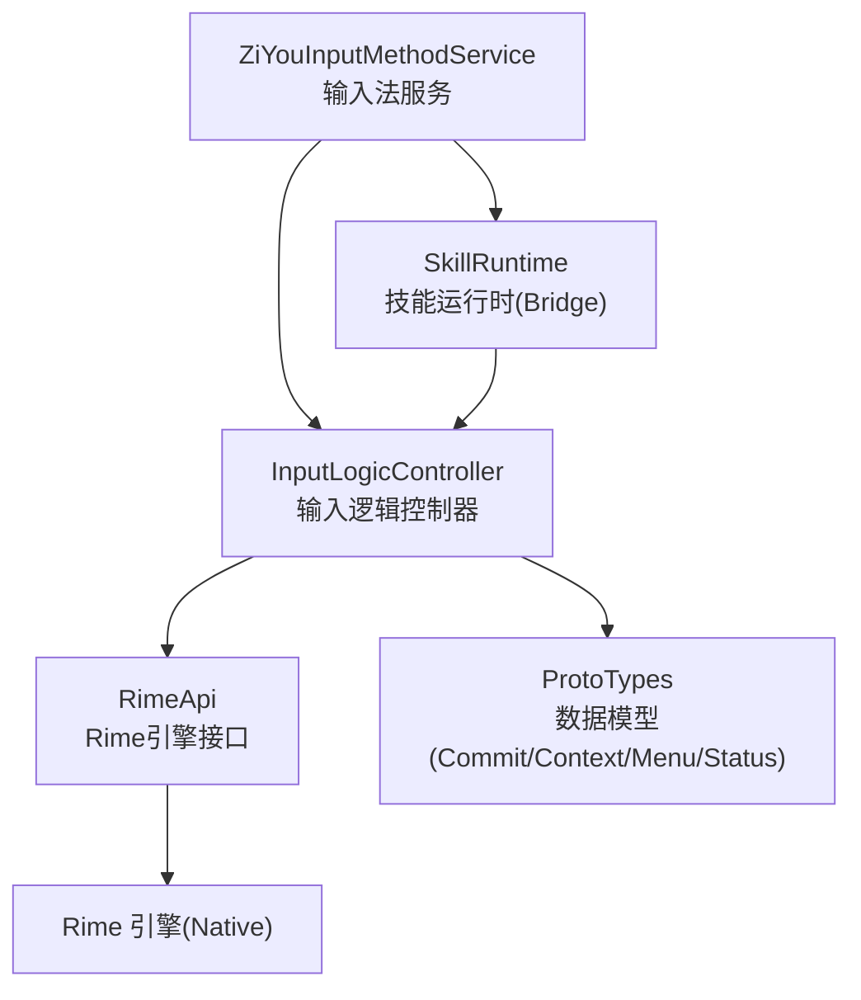
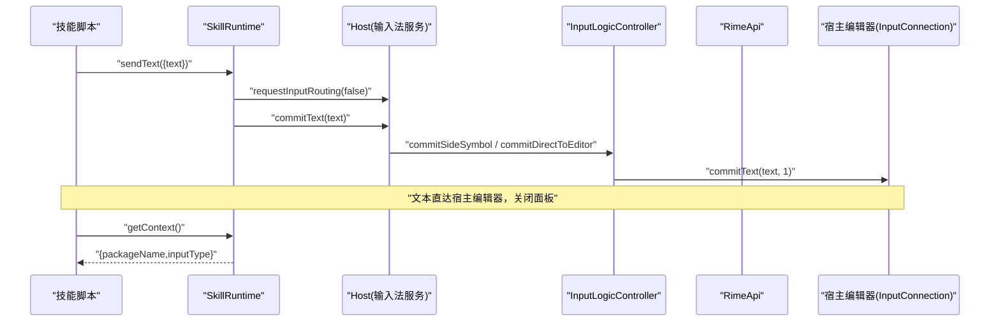
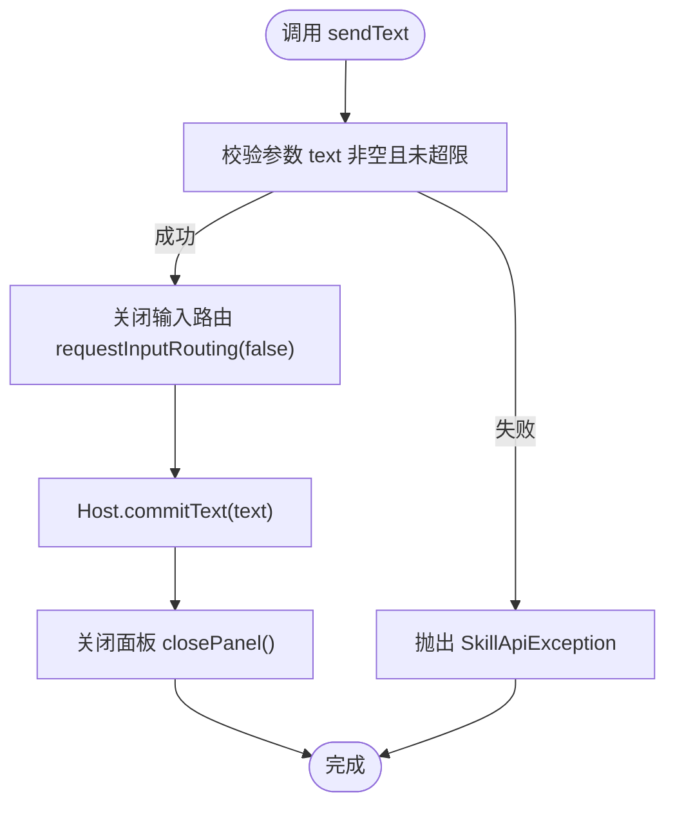
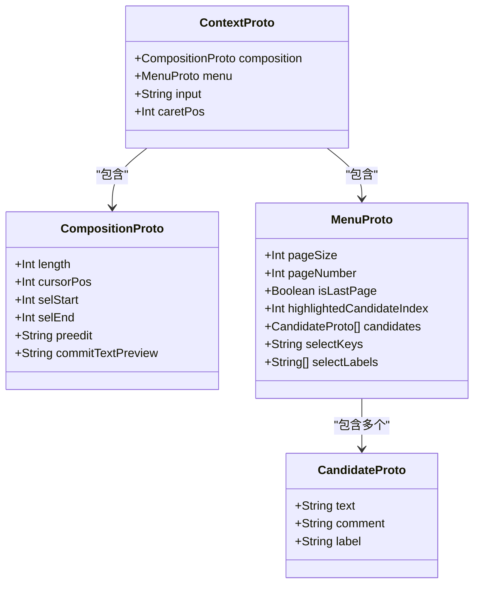
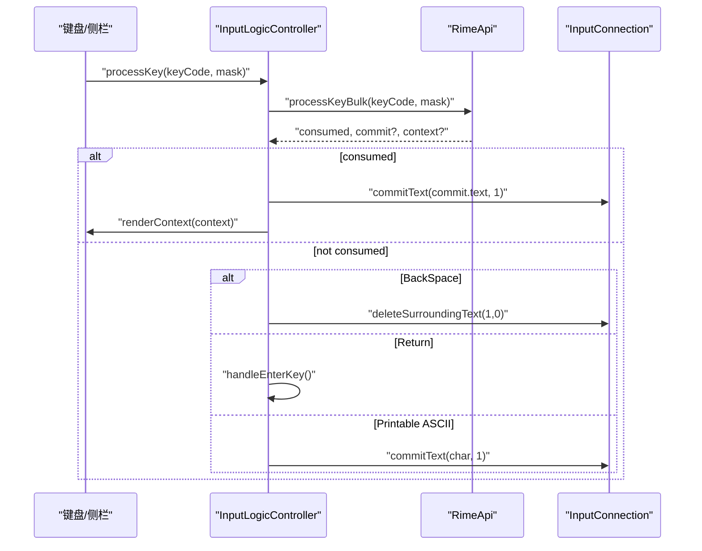
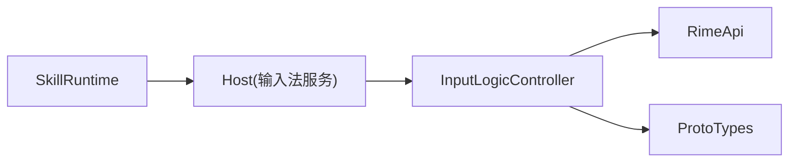

# 文本操作 API

<cite>
**本文引用的文件**   
- [ZiYouInputMethodService.kt](file://app/src/main/java/com/ziyou/ime/ime/ZiYouInputMethodService.kt)
- [InputLogicController.kt](file://app/src/main/java/com/ziyou/ime/ime/InputLogicController.kt)
- [RimeApi.kt](file://app/src/main/java/com/ziyou/ime/core/RimeApi.kt)
- [ProtoTypes.kt](file://app/src/main/java/com/ziyou/ime/core/ProtoTypes.kt)
- [SkillRuntime.kt](file://app/src/main/java/com/ziyou/ime/skill/SkillRuntime.kt)
</cite>

## 目录
1. [简介](#简介)
2. [项目结构](#项目结构)
3. [核心组件](#核心组件)
4. [架构总览](#架构总览)
5. [详细组件分析](#详细组件分析)
6. [依赖关系分析](#依赖关系分析)
7. [性能考量](#性能考量)
8. [故障排查指南](#故障排查指南)
9. [结论](#结论)
10. [附录：使用场景示例](#附录使用场景示例)

## 简介
本文件面向“文本操作相关 API”的完整文档，重点覆盖以下能力与边界：
- sendText：技能脚本向宿主编辑器直接上屏文本的调用方式、参数格式、输入上下文处理与上屏逻辑。
- getContext：返回当前输入状态信息（如光标位置、选中文本、输入法状态等）的数据结构与语义。
- getLocale：获取语言环境信息的返回值与用途。
- 典型使用场景：智能补全、文本替换、格式化等。
- 错误处理与边界情况：长度限制、权限校验、输入路由切换、富媒体支持检测等。

## 项目结构
围绕文本操作的代码主要分布在以下模块与文件：
- 输入法服务层：负责生命周期、视图装配、键盘事件分发与引擎同步。
- 输入逻辑控制器：封装按键处理、候选词选择、上屏出口、回车键行为、图片提交等。
- Rime 引擎接口：定义按键批量处理、上下文查询、候选操作、方案与选项管理等。
- 数据结构：Commit/Context/Candidate/Status 等 Proto 类型，用于跨层传输。
- 技能运行时：对外暴露 Bridge API（sendText/getContext/getLocale/image/* 等），实现权限、限额、网络代理与输入路由控制。

**图表来源** 
- [ZiYouInputMethodService.kt](file://app/src/main/java/com/ziyou/ime/ime/ZiYouInputMethodService.kt)
- [InputLogicController.kt](file://app/src/main/java/com/ziyou/ime/ime/InputLogicController.kt)
- [RimeApi.kt](file://app/src/main/java/com/ziyou/ime/core/RimeApi.kt)
- [ProtoTypes.kt](file://app/src/main/java/com/ziyou/ime/core/ProtoTypes.kt)
- [SkillRuntime.kt](file://app/src/main/java/com/ziyou/ime/skill/SkillRuntime.kt)

**章节来源**
- [ZiYouInputMethodService.kt](file://app/src/main/java/com/ziyou/ime/ime/ZiYouInputMethodService.kt)
- [InputLogicController.kt](file://app/src/main/java/com/ziyou/ime/ime/InputLogicController.kt)
- [RimeApi.kt](file://app/src/main/java/com/ziyou/ime/core/RimeApi.kt)
- [ProtoTypes.kt](file://app/src/main/java/com/ziyou/ime/core/ProtoTypes.kt)
- [SkillRuntime.kt](file://app/src/main/java/com/ziyou/ime/skill/SkillRuntime.kt)

## 核心组件
- InputLogicController：统一的上屏入口与按键处理中枢，负责 commitTarget 路由（面板 vs 宿主编辑器）、回车键语义、图片提交、编码超限防护、UI 刷新。
- RimeApi：对 Rime 引擎的抽象，提供 processKeyBulk、getContext、getCommit、selectCandidate、changePage、setOption/getOption 等。
- SkillRuntime：Bridge API 的实现层，包含 sendText/getContext/getLocale/haptic/storage/image/fetch 等方法，负责权限、限额、输入路由与 UI 控制。
- ProtoTypes：定义 CommitProto、ContextProto、CompositionProto、MenuProto、StatusProto 等数据结构，贯穿 JNI 与上层。

**章节来源**
- [InputLogicController.kt](file://app/src/main/java/com/ziyou/ime/ime/InputLogicController.kt)
- [RimeApi.kt](file://app/src/main/java/com/ziyou/ime/core/RimeApi.kt)
- [SkillRuntime.kt](file://app/src/main/java/com/ziyou/ime/skill/SkillRuntime.kt)
- [ProtoTypes.kt](file://app/src/main/java/com/ziyou/ime/core/ProtoTypes.kt)

## 架构总览
下图展示从技能脚本到宿主编辑器的文本上屏路径，以及上下文查询流程。

**图表来源** 
- [SkillRuntime.kt](file://app/src/main/java/com/ziyou/ime/skill/SkillRuntime.kt)
- [ZiYouInputMethodService.kt](file://app/src/main/java/com/ziyou/ime/ime/ZiYouInputMethodService.kt)
- [InputLogicController.kt](file://app/src/main/java/com/ziyou/ime/ime/InputLogicController.kt)

## 详细组件分析

### sendText 方法详解
- 调用入口：SkillRuntime.handleSync("sendText", params)
- 参数格式：
  - text: 字符串，必填；空串抛异常；超过上限抛异常。
- 输入上下文处理：
  - 强制关闭输入路由（requestInputRouting(false)），确保文本直达宿主编辑器而非注入面板自身。
- 上屏逻辑：
  - 通过 Host.commitText(text) 进入 InputLogicController 的统一上屏出口，最终经 InputConnection.commitText 提交。
- 副作用：
  - 自动关闭技能面板（closePanel）。
- 安全与边界：
  - 单次长度上限 MAX_COMMIT_LENGTH（防超长注入）。
  - 若输入路由仍激活，会先复位路由再上屏，避免回注面板。

**图表来源** 
- [SkillRuntime.kt](file://app/src/main/java/com/ziyou/ime/skill/SkillRuntime.kt)
- [InputLogicController.kt](file://app/src/main/java/com/ziyou/ime/ime/InputLogicController.kt)

**章节来源**
- [SkillRuntime.kt](file://app/src/main/java/com/ziyou/ime/skill/SkillRuntime.kt)
- [InputLogicController.kt](file://app/src/main/java/com/ziyou/ime/ime/InputLogicController.kt)

### getContext 方法详解
- 调用入口：SkillRuntime.handleSync("getContext", params)
- 返回值：JSON 对象，包含：
  - packageName: 当前前台应用包名（可能为空）
  - inputType: 当前输入框类型（如 text/number/phone/datetime）
- 用途：
  - 脚本侧根据输入框类型决定提示策略（例如数字框禁用拼音联想）。
- 注意：
  - 该方法不返回光标位置或选中文本；如需更细粒度上下文，应结合 RimeApi.getContext() 在输入法内部使用。

**章节来源**
- [SkillRuntime.kt](file://app/src/main/java/com/ziyou/ime/skill/SkillRuntime.kt)

### getLocale 方法详解
- 调用入口：SkillRuntime.handleSync("getLocale", params)
- 返回值：当前系统语言标签（如 zh-CN），以 JSON 字符串形式返回。
- 用途：
  - 脚本侧按语言环境调整文案、排序规则或本地化行为。

**章节来源**
- [SkillRuntime.kt](file://app/src/main/java/com/ziyou/ime/skill/SkillRuntime.kt)

### 输入上下文与上屏逻辑（输入法内部）
- 输入上下文：
  - ContextProto 包含 composition（编码区）、menu（候选菜单）、input（当前输入串）、caretPos（光标位置）。
  - CompositionProto 包含 length、cursorPos、selStart、selEnd、preedit、commitTextPreview。
- 上屏出口：
  - InputLogicController.commitAndCount：根据 commitTarget 路由到面板或宿主编辑器；默认走 InputConnection.commitText。
  - commitDirectToEditor：绕过 commitTarget 直接上屏至宿主编辑器（用于面板打开期间仍需写入真实输入框的场景）。
- 回车键行为：
  - handleEnterKey：优先路由给 commitTarget.onEnter；否则按 EditorInfo 动作执行 performEditorAction；多行或无动作时发送一对 ENTER 物理按键事件。
- 图片提交：
  - commitImageToEditor：通过 Commit Content API 提交图片（需编辑器支持 image MIME）。

**图表来源** 
- [ProtoTypes.kt](file://app/src/main/java/com/ziyou/ime/core/ProtoTypes.kt)

**章节来源**
- [InputLogicController.kt](file://app/src/main/java/com/ziyou/ime/ime/InputLogicController.kt)
- [ProtoTypes.kt](file://app/src/main/java/com/ziyou/ime/core/ProtoTypes.kt)

### 按键处理与批量优化
- InputLogicController.processKey：
  - 编码超限保护（MAX_INPUT_LENGTH=30），丢弃多余编码键。
  - 热路径使用 RimeApi.processKeyBulk：一次调度完成 processKey + getCommit + getContext，减少线程往返与 JNI 跨界。
  - 被引擎消费：取 commit 文本上屏并刷新 UI；未消费：退格/回车/可打印字符分支处理。
- 候选选择与翻页：
  - selectCandidate：分段确认时同步九宫格状态机；changePage：更新候选页码。
- 拼音侧栏与 T9 消歧：
  - selectPinyin/restorePinyin/retypeUnconfirmed：基于 replaceKey 与 End/Delete 序列保证已确认段不被破坏。

**图表来源** 
- [InputLogicController.kt](file://app/src/main/java/com/ziyou/ime/ime/InputLogicController.kt)
- [RimeApi.kt](file://app/src/main/java/com/ziyou/ime/core/RimeApi.kt)

**章节来源**
- [InputLogicController.kt](file://app/src/main/java/com/ziyou/ime/ime/InputLogicController.kt)
- [RimeApi.kt](file://app/src/main/java/com/ziyou/ime/core/RimeApi.kt)

## 依赖关系分析
- SkillRuntime 依赖 Host 接口（由 Service 实现）进行输入路由、上屏、面板控制与图片提交。
- InputLogicController 依赖 RimeApi 进行按键处理与上下文查询，并通过 Callbacks 回调 Service 获取 InputConnection 与 EditorInfo。
- ProtoTypes 作为跨层数据契约，贯穿 Native 与 Kotlin 层。

**图表来源** 
- [SkillRuntime.kt](file://app/src/main/java/com/ziyou/ime/skill/SkillRuntime.kt)
- [InputLogicController.kt](file://app/src/main/java/com/ziyou/ime/ime/InputLogicController.kt)
- [RimeApi.kt](file://app/src/main/java/com/ziyou/ime/core/RimeApi.kt)
- [ProtoTypes.kt](file://app/src/main/java/com/ziyou/ime/core/ProtoTypes.kt)

**章节来源**
- [SkillRuntime.kt](file://app/src/main/java/com/ziyou/ime/skill/SkillRuntime.kt)
- [InputLogicController.kt](file://app/src/main/java/com/ziyou/ime/ime/InputLogicController.kt)
- [RimeApi.kt](file://app/src/main/java/com/ziyou/ime/core/RimeApi.kt)
- [ProtoTypes.kt](file://app/src/main/java/com/ziyou/ime/core/ProtoTypes.kt)

## 性能考量
- 热路径优化：processKeyBulk 将三次引擎调用合并为一次，显著降低主线程↔Rime 线程往返与 JNI 跨界次数。
- 编码长度上限：MAX_INPUT_LENGTH=30，防止组合爆炸导致的慢按键与按键积压。
- 慢按键告警：当 processKeyBulk 耗时超过阈值（SLOW_KEY_WARN_MS）记录日志，便于定位退化。
- 输入事务串行化：Mutex 保证一次按键内的多次 Rime 调用原子执行，避免快速连击导致 commit/context 错配。

[本节为通用性能建议，不直接分析具体文件]

## 故障排查指南
- sendText 失败常见原因：
  - text 为空或超长：抛出 SkillApiException，检查参数长度与内容。
  - 输入路由未释放：确保调用前已 releaseFocus 或 sendText 会自动复位路由。
- getContext 返回空包名：
  - 某些环境下 editorPackageName() 可能为空，脚本侧应做空值兼容。
- 图片提交失败：
  - 编辑器不支持 image MIME：通过 host.editorAcceptsImage() 或 InputLogicController.acceptsImageContent() 检测。
  - Android 版本限制：保存到相册需要 Android 10+。
- 回车键行为异常：
  - 单行输入框声明了动作时走 performEditorAction；多行或无动作时发送 ENTER 事件，确保编辑器能正确响应。

**章节来源**
- [SkillRuntime.kt](file://app/src/main/java/com/ziyou/ime/skill/SkillRuntime.kt)
- [InputLogicController.kt](file://app/src/main/java/com/ziyou/ime/ime/InputLogicController.kt)

## 结论
- sendText 是技能脚本直达宿主编辑器的稳定上屏通道，具备长度限制与输入路由保护。
- getContext 提供基础输入框上下文（包名与类型），满足脚本侧差异化策略需求。
- getLocale 返回系统语言标签，便于本地化与区域化处理。
- 输入法内部通过 InputLogicController 与 RimeApi 协同，实现高效、安全的文本处理与上屏。

[本节为总结性内容，不直接分析具体文件]

## 附录：使用场景示例
- 智能补全：
  - 步骤：getContext 获取 inputType，若为 text 则发起 fetch 获取补全建议；用户确认后调用 sendText 上屏。
  - 注意：数字/电话框禁用补全；长文本建议分页加载。
- 文本替换：
  - 步骤：读取剪贴板（clipboard.read），匹配模板后生成新文本，调用 sendText 替换选中内容（需在编辑器层面配合选区操作）。
  - 注意：长度限制与权限校验。
- 格式化：
  - 步骤：fetch 获取格式化规则，对输入文本进行处理，sendText 输出结果。
  - 注意：网络超时与并发限制；失败时降级为原始文本。

[本节为概念性示例，不直接分析具体文件]