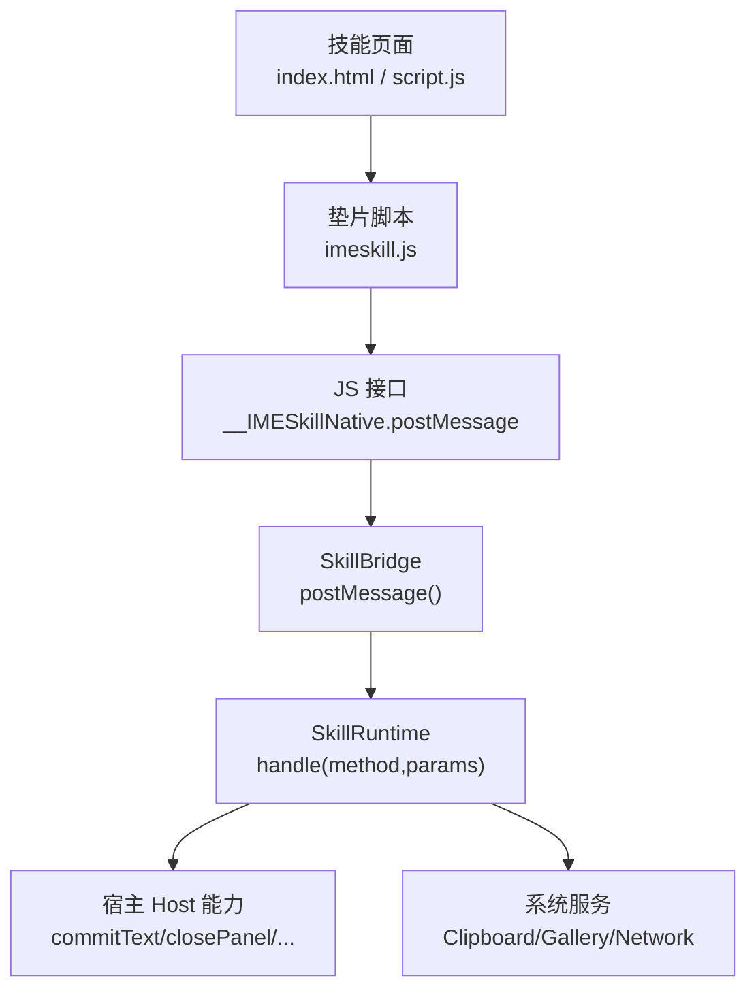
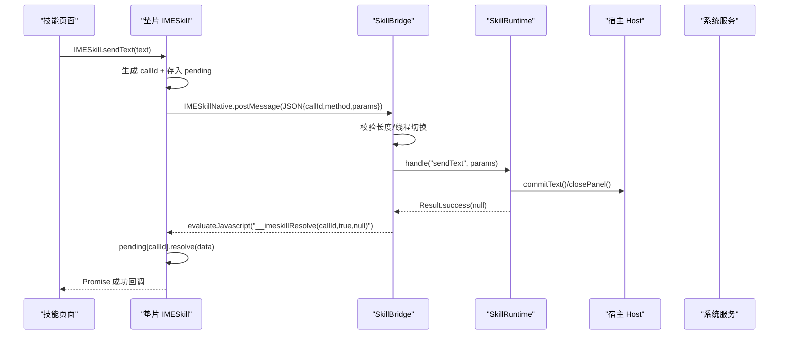
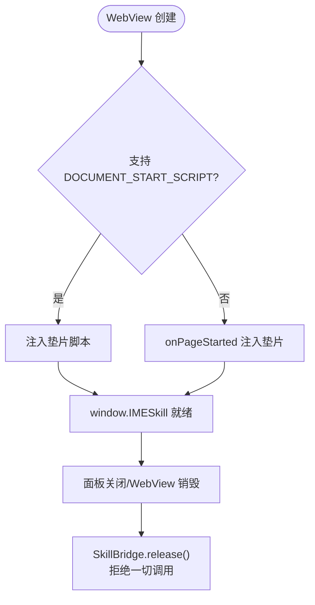
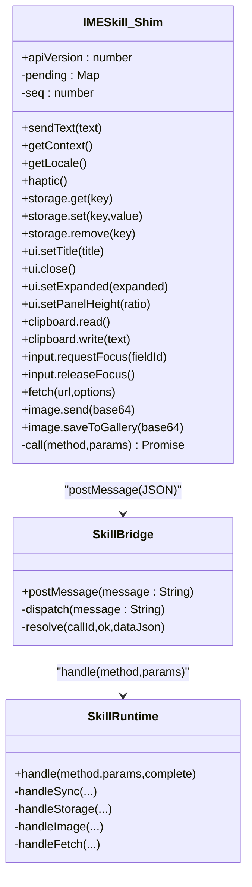
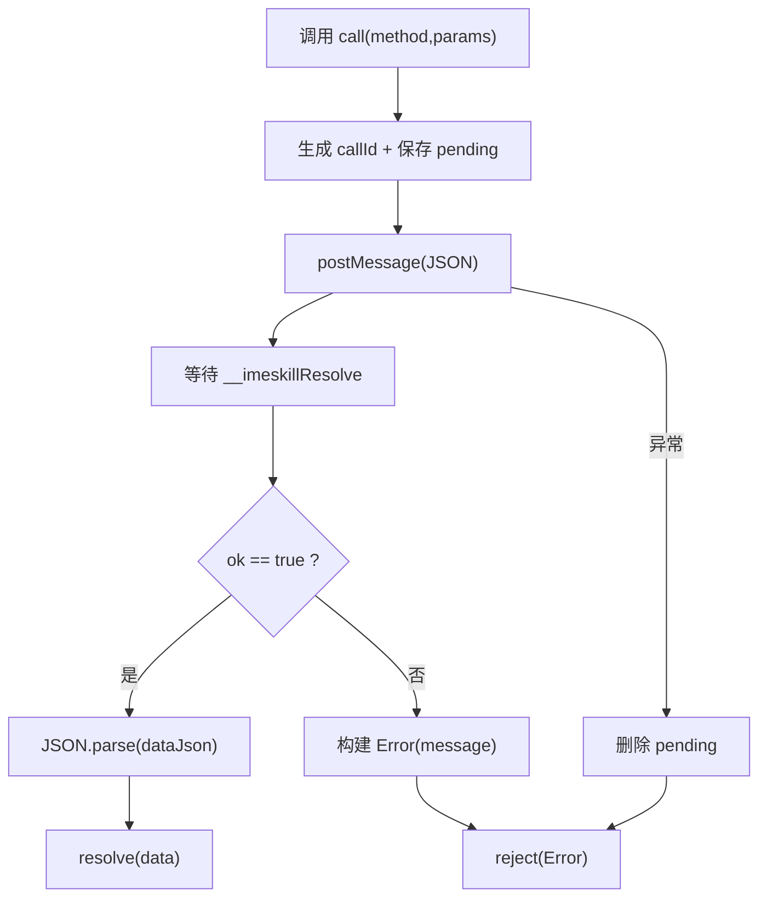
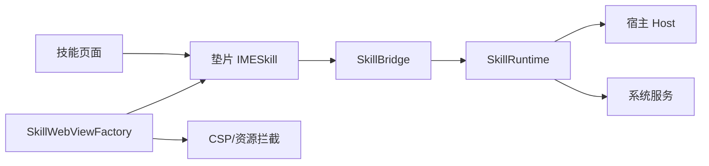

# 核心 API

<cite>
**本文引用的文件**   
- [app/src/main/assets/skill_runtime/imeskill.js](file://app/src/main/assets/skill_runtime/imeskill.js)
- [app/src/main/java/com/ziyou/ime/skill/SkillBridge.kt](file://app/src/main/java/com/ziyou/ime/skill/SkillBridge.kt)
- [app/src/main/java/com/ziyou/ime/skill/SkillRuntime.kt](file://app/src/main/java/com/ziyou/ime/skill/SkillRuntime.kt)
- [app/src/main/java/com/ziyou/ime/skill/SkillWebViewFactory.kt](file://app/src/main/java/com/ziyou/ime/skill/SkillWebViewFactory.kt)
- [core-logic/src/main/java/com/ziyou/ime/core/skill/SkillManifest.kt](file://core-logic/src/main/java/com/ziyou/ime/core/skill/SkillManifest.kt)
- [app/src/main/assets/skills/calculator/index.html](file://app/src/main/assets/skills/calculator/index.html)
- [app/src/main/assets/skills/calculator/manifest.json](file://app/src/main/assets/skills/calculator/manifest.json)
- [skills-dev/com.user.constellation/script.js](file://skills-dev/com.user.constellation/script.js)
</cite>

## 目录
1. [简介](#简介)
2. [项目结构](#项目结构)
3. [核心组件](#核心组件)
4. [架构总览](#架构总览)
5. [详细组件分析](#详细组件分析)
6. [依赖关系分析](#依赖关系分析)
7. [性能考量](#性能考量)
8. [故障排查指南](#故障排查指南)
9. [结论](#结论)
10. [附录：调用示例与最佳实践](#附录调用示例与最佳实践)

## 简介
本文件聚焦输入法技能插件系统的核心 Bridge API，围绕全局对象 window.IMESkill 的初始化、生命周期管理与基础通信机制展开。重点说明 postMessage 的调用格式、消息结构（callId/method/params）、异步响应处理模式；解释 Promise 封装的工作原理（resolve/reject 与错误处理策略）；给出完整的使用示例（成功与失败场景）；并阐述线程模型与安全限制（如单条消息长度上限 512KB、释放后的行为）。

## 项目结构
- 垫片脚本 imeskill.js 在 WebView 启动时注入，提供 window.IMESkill 全局对象，统一通过 __IMESkillNative.postMessage 与宿主通信。
- SkillBridge 是 JS 到 Android 的单入口桥接层，负责消息分发、线程切换与异常兜底。
- SkillRuntime 承载所有能力实现（权限校验、存储限额、网络代理、剪贴板、输入路由、图片输出等）。
- SkillWebViewFactory 负责 WebView 安全配置、资源拦截、垫片注入与 CSP 收紧。
- SkillManifest 描述技能元数据与权限声明，用于运行时权限检查与能力开关。

**图表来源** 
- [app/src/main/assets/skill_runtime/imeskill.js:1-164](file://app/src/main/assets/skill_runtime/imeskill.js#L1-L164)
- [app/src/main/java/com/ziyou/ime/skill/SkillBridge.kt:1-99](file://app/src/main/java/com/ziyou/ime/skill/SkillBridge.kt#L1-L99)
- [app/src/main/java/com/ziyou/ime/skill/SkillRuntime.kt:1-521](file://app/src/main/java/com/ziyou/ime/skill/SkillRuntime.kt#L1-L521)
- [app/src/main/java/com/ziyou/ime/skill/SkillWebViewFactory.kt:1-205](file://app/src/main/java/com/ziyou/ime/skill/SkillWebViewFactory.kt#L1-L205)

**章节来源**
- [app/src/main/assets/skill_runtime/imeskill.js:1-164](file://app/src/main/assets/skill_runtime/imeskill.js#L1-L164)
- [app/src/main/java/com/ziyou/ime/skill/SkillBridge.kt:1-99](file://app/src/main/java/com/ziyou/ime/skill/SkillBridge.kt#L1-L99)
- [app/src/main/java/com/ziyou/ime/skill/SkillRuntime.kt:1-521](file://app/src/main/java/com/ziyou/ime/skill/SkillRuntime.kt#L1-L521)
- [app/src/main/java/com/ziyou/ime/skill/SkillWebViewFactory.kt:1-205](file://app/src/main/java/com/ziyou/ime/skill/SkillWebViewFactory.kt#L1-L205)

## 核心组件
- window.IMESkill（垫片）
  - 暴露统一的 API 命名空间（sendText/getContext/getLocale/haptic/storage/ui/clipboard/input/fetch/image 等）。
  - 内部维护 callId 序列与 pending 映射，将每个调用包装为 Promise。
  - 通过 __IMESkillNative.postMessage 发送 JSON 消息 {callId, method, params}。
  - 通过 window.__imeskillResolve 接收宿主异步回调，解析 dataJson 后 resolve/reject。
- SkillBridge（桥接层）
  - 以 @JavascriptInterface 暴露 postMessage(String)，作为唯一原生入口。
  - 主线程分发、异常全量兜底、消息长度限制（512KB）。
  - 通过 evaluateJavascript 回传结果给 window.__imeskillResolve。
- SkillRuntime（能力实现）
  - 按 method 前缀分派：fetch、storage.*、image.* 与同步方法。
  - 权限校验、参数校验、限额控制（存储 1MB、文本 5000 字符、网络 10s/1MB/30次/分钟/并发≤2）。
  - 输入路由、面板 UI 控制、剪贴板、图片输出（PNG 魔数校验）。
- SkillWebViewFactory（WebView 工厂）
  - 安全基线：仅允许虚拟域名访问技能包内资源，CSP 收紧 connect-src 'none'。
  - 优先 DOCUMENT_START_SCRIPT 注入垫片，不支持则回退 onPageStarted。
  - onRenderProcessGone 兜底保活 IME 主进程。

**章节来源**
- [app/src/main/assets/skill_runtime/imeskill.js:1-164](file://app/src/main/assets/skill_runtime/imeskill.js#L1-L164)
- [app/src/main/java/com/ziyou/ime/skill/SkillBridge.kt:1-99](file://app/src/main/java/com/ziyou/ime/skill/SkillBridge.kt#L1-L99)
- [app/src/main/java/com/ziyou/ime/skill/SkillRuntime.kt:1-521](file://app/src/main/java/com/ziyou/ime/skill/SkillRuntime.kt#L1-L521)
- [app/src/main/java/com/ziyou/ime/skill/SkillWebViewFactory.kt:1-205](file://app/src/main/java/com/ziyou/ime/skill/SkillWebViewFactory.kt#L1-L205)

## 架构总览
下图展示了从技能页面到宿主能力的完整调用链，以及 Promise 的异步闭环。

**图表来源** 
- [app/src/main/assets/skill_runtime/imeskill.js:30-43](file://app/src/main/assets/skill_runtime/imeskill.js#L30-L43)
- [app/src/main/java/com/ziyou/ime/skill/SkillBridge.kt:45-97](file://app/src/main/java/com/ziyou/ime/skill/SkillBridge.kt#L45-L97)
- [app/src/main/java/com/ziyou/ime/skill/SkillRuntime.kt:159-170](file://app/src/main/java/com/ziyou/ime/skill/SkillRuntime.kt#L159-L170)

## 详细组件分析

### 全局对象 window.IMESkill 初始化与生命周期
- 初始化时机
  - 优先通过 DOCUMENT_START_SCRIPT 注入，确保页面任何脚本执行前可用。
  - 若不支持，则在 onPageStarted 中回退注入；垫片具备幂等保护（window.IMESkill 已存在则跳过）。
- 版本协商
  - 垫片中的 apiVersion 会被替换为宿主宏事实源 HOST_API_VERSION，供技能侧进行能力协商。
- 生命周期
  - WebView 销毁或面板关闭时，SkillBridge.release() 会拒绝后续调用；SkillRuntime.release() 取消未完成的协程请求。

**图表来源** 
- [app/src/main/java/com/ziyou/ime/skill/SkillWebViewFactory.kt:162-186](file://app/src/main/java/com/ziyou/ime/skill/SkillWebViewFactory.kt#L162-L186)
- [app/src/main/assets/skill_runtime/imeskill.js:8-11](file://app/src/main/assets/skill_runtime/imeskill.js#L8-L11)
- [app/src/main/java/com/ziyou/ime/skill/SkillBridge.kt:40-43](file://app/src/main/java/com/ziyou/ime/skill/SkillBridge.kt#L40-L43)
- [app/src/main/java/com/ziyou/ime/skill/SkillRuntime.kt:133-136](file://app/src/main/java/com/ziyou/ime/skill/SkillRuntime.kt#L133-L136)

**章节来源**
- [app/src/main/java/com/ziyou/ime/skill/SkillWebViewFactory.kt:162-186](file://app/src/main/java/com/ziyou/ime/skill/SkillWebViewFactory.kt#L162-L186)
- [app/src/main/assets/skill_runtime/imeskill.js:8-11](file://app/src/main/assets/skill_runtime/imeskill.js#L8-L11)
- [app/src/main/java/com/ziyou/ime/skill/SkillBridge.kt:40-43](file://app/src/main/java/com/ziyou/ime/skill/SkillBridge.kt#L40-L43)
- [app/src/main/java/com/ziyou/ime/skill/SkillRuntime.kt:133-136](file://app/src/main/java/com/ziyou/ime/skill/SkillRuntime.kt#L133-L136)

### 基础通信机制与 postMessage 调用格式
- 调用入口
  - 技能侧通过 window.IMESkill.<method>(params) 发起调用。
  - 垫片内部构造 JSON 消息 {callId, method, params}，调用 __IMESkillNative.postMessage(JSON)。
- 消息结构
  - callId: 自增整数，用于匹配请求与响应。
  - method: 字符串，表示能力名（如 sendText、getContext、storage.get、image.send 等）。
  - params: 对象，携带方法所需参数（可为空对象）。
- 异步响应
  - 宿主侧通过 evaluateJavascript 调用 window.__imeskillResolve(callId, ok, dataJson)。
  - 垫片根据 ok 决定 resolve(data) 或 reject(Error(message))。

**图表来源** 
- [app/src/main/assets/skill_runtime/imeskill.js:30-43](file://app/src/main/assets/skill_runtime/imeskill.js#L30-L43)
- [app/src/main/java/com/ziyou/ime/skill/SkillBridge.kt:45-97](file://app/src/main/java/com/ziyou/ime/skill/SkillBridge.kt#L45-L97)
- [app/src/main/java/com/ziyou/ime/skill/SkillRuntime.kt:142-157](file://app/src/main/java/com/ziyou/ime/skill/SkillRuntime.kt#L142-L157)

**章节来源**
- [app/src/main/assets/skill_runtime/imeskill.js:30-43](file://app/src/main/assets/skill_runtime/imeskill.js#L30-L43)
- [app/src/main/java/com/ziyou/ime/skill/SkillBridge.kt:45-97](file://app/src/main/java/com/ziyou/ime/skill/SkillBridge.kt#L45-L97)

### Promise 封装与错误处理策略
- 封装原理
  - 每次调用 call(method,params) 生成唯一 callId，并将 {resolve,reject} 存入 pending[callId]。
  - 通过 __IMESkillNative.postMessage 发送消息后，等待宿主回传 __imeskillResolve。
- 成功路径
  - 宿主返回 ok=true，dataJson 经 JSON.parse 后 resolve(data)。
- 失败路径
  - 宿主返回 ok=false，dataJson.message 作为错误信息 reject(Error(...))。
  - 若 dataJson 为空或解析失败，使用默认错误信息。
- 异常兜底
  - 如果 postMessage 抛出异常（如 released），立即清理 pending 并 reject(e)。

**图表来源** 
- [app/src/main/assets/skill_runtime/imeskill.js:15-28](file://app/src/main/assets/skill_runtime/imeskill.js#L15-L28)
- [app/src/main/assets/skill_runtime/imeskill.js:30-43](file://app/src/main/assets/skill_runtime/imeskill.js#L30-L43)

**章节来源**
- [app/src/main/assets/skill_runtime/imeskill.js:15-28](file://app/src/main/assets/skill_runtime/imeskill.js#L15-L28)
- [app/src/main/assets/skill_runtime/imeskill.js:30-43](file://app/src/main/assets/skill_runtime/imeskill.js#L30-L43)

### 线程模型与安全限制
- 线程模型
  - postMessage 运行在 WebView 的 JavaBridge 线程，立即切至主线程再分发。
  - SkillRuntime.handle 在主线程调用，异步能力（storage/fetch/image）通过协程在 IO/Main 调度。
- 安全限制
  - 单条消息长度上限 512KB，超限直接丢弃。
  - WebView 资源拦截：仅允许虚拟域名下的技能包内资源，其余一律空响应。
  - CSP 收紧：connect-src 'none'，禁止外域连接；script/style 允许内联但禁用 eval。
  - 渲染进程崩溃：onRenderProcessGone 兜底，销毁面板但不影响 IME 主进程。
- 释放后行为
  - SkillBridge.release() 后，postMessage 直接返回，不再分发。
  - SkillRuntime.release() 取消未完成的 fetch/storage 协程。

**章节来源**
- [app/src/main/java/com/ziyou/ime/skill/SkillBridge.kt:30-49](file://app/src/main/java/com/ziyou/ime/skill/SkillBridge.kt#L30-L49)
- [app/src/main/java/com/ziyou/ime/skill/SkillBridge.kt:45-49](file://app/src/main/java/com/ziyou/ime/skill/SkillBridge.kt#L45-L49)
- [app/src/main/java/com/ziyou/ime/skill/SkillWebViewFactory.kt:93-156](file://app/src/main/java/com/ziyou/ime/skill/SkillWebViewFactory.kt#L93-L156)
- [app/src/main/java/com/ziyou/ime/skill/SkillRuntime.kt:133-136](file://app/src/main/java/com/ziyou/ime/skill/SkillRuntime.kt#L133-L136)

### 关键能力详解

#### 文本上屏与面板控制
- sendText(text)
  - 校验非空与长度上限（5000 字符）。
  - 若输入路由激活，先复位路由，再提交文本并关闭面板。
- ui.setTitle(ui.close/ui.setExpanded/ui.setPanelHeight)
  - 标题长度上限 20 字符。
  - setExpanded 控制输入法界面整体展开/收缩（需 needs_input）。
  - setPanelHeight 自定义面板高度比例（API v4，钳制区间）。

**章节来源**
- [app/src/main/java/com/ziyou/ime/skill/SkillRuntime.kt:159-208](file://app/src/main/java/com/ziyou/ime/skill/SkillRuntime.kt#L159-L208)

#### 输入路由（needs_input）
- input.requestFocus(fieldId)
  - 校验 manifest 是否声明 needs_input。
  - 激活输入路由，键盘上屏文本注入指定 id 的 input/textarea。
- input.releaseFocus()
  - 关闭输入路由，恢复直达宿主应用编辑框。

**章节来源**
- [app/src/main/java/com/ziyou/ime/skill/SkillRuntime.kt:226-238](file://app/src/main/java/com/ziyou/ime/skill/SkillRuntime.kt#L226-L238)
- [app/src/main/assets/skill_runtime/imeskill.js:132-144](file://app/src/main/assets/skill_runtime/imeskill.js#L132-L144)

#### 剪贴板
- clipboard.read/write
  - 需要对应权限（clipboard_read / clipboard_write）。
  - read 返回 null 或字符串；write 设置主剪贴板。

**章节来源**
- [app/src/main/java/com/ziyou/ime/skill/SkillRuntime.kt:210-224](file://app/src/main/java/com/ziyou/ime/skill/SkillRuntime.kt#L210-L224)

#### 持久化存储（storage）
- storage.get/set/remove
  - 需要 storage 权限。
  - 串行 IO 保证 set/remove 顺序；序列化后上限 1MB。
  - 读取失败重置为空对象。

**章节来源**
- [app/src/main/java/com/ziyou/ime/skill/SkillRuntime.kt:249-284](file://app/src/main/java/com/ziyou/ime/skill/SkillRuntime.kt#L249-L284)
- [app/src/main/java/com/ziyou/ime/skill/SkillRuntime.kt:497-519](file://app/src/main/java/com/ziyou/ime/skill/SkillRuntime.kt#L497-L519)

#### 网络请求（fetch）
- fetch(url, options)
  - 需要 network 权限与 network_domains 白名单。
  - 强制 HTTPS、禁重定向、超时 10s、响应 ≤1MB、频控 30 次/分钟、并发 ≤2。
  - 返回 {status, body}。

**章节来源**
- [app/src/main/java/com/ziyou/ime/skill/SkillRuntime.kt:374-427](file://app/src/main/java/com/ziyou/ime/skill/SkillRuntime.kt#L374-L427)
- [app/src/main/java/com/ziyou/ime/skill/SkillRuntime.kt:429-471](file://app/src/main/java/com/ziyou/ime/skill/SkillRuntime.kt#L429-L471)

#### 图片输出（image）
- image.send/saveToGallery
  - 需要 image 权限。
  - 仅接受 PNG（文件头魔数校验）。
  - send 经 commitContent 发送到当前输入框（需编辑器接受 image/*）。
  - saveToGallery 写入系统相册（Android 10+）。

**章节来源**
- [app/src/main/java/com/ziyou/ime/skill/SkillRuntime.kt:293-332](file://app/src/main/java/com/ziyou/ime/skill/SkillRuntime.kt#L293-L332)
- [app/src/main/java/com/ziyou/ime/skill/SkillRuntime.kt:334-366](file://app/src/main/java/com/ziyou/ime/skill/SkillRuntime.kt#L334-L366)

## 依赖关系分析
- 技能页面依赖 window.IMESkill（垫片）。
- 垫片依赖 __IMESkillNative（SkillBridge 暴露）。
- SkillBridge 依赖 SkillRuntime 处理业务逻辑。
- SkillRuntime 依赖宿主 Host 接口与系统服务（Clipboard/Gallery/Network）。
- SkillWebViewFactory 依赖 ZipEntryValidator 与 CSP 策略。

**图表来源** 
- [app/src/main/assets/skill_runtime/imeskill.js:1-164](file://app/src/main/assets/skill_runtime/imeskill.js#L1-L164)
- [app/src/main/java/com/ziyou/ime/skill/SkillBridge.kt:1-99](file://app/src/main/java/com/ziyou/ime/skill/SkillBridge.kt#L1-L99)
- [app/src/main/java/com/ziyou/ime/skill/SkillRuntime.kt:1-521](file://app/src/main/java/com/ziyou/ime/skill/SkillRuntime.kt#L1-L521)
- [app/src/main/java/com/ziyou/ime/skill/SkillWebViewFactory.kt:1-205](file://app/src/main/java/com/ziyou/ime/skill/SkillWebViewFactory.kt#L1-L205)

**章节来源**
- [app/src/main/assets/skill_runtime/imeskill.js:1-164](file://app/src/main/assets/skill_runtime/imeskill.js#L1-L164)
- [app/src/main/java/com/ziyou/ime/skill/SkillBridge.kt:1-99](file://app/src/main/java/com/ziyou/ime/skill/SkillBridge.kt#L1-L99)
- [app/src/main/java/com/ziyou/ime/skill/SkillRuntime.kt:1-521](file://app/src/main/java/com/ziyou/ime/skill/SkillRuntime.kt#L1-L521)
- [app/src/main/java/com/ziyou/ime/skill/SkillWebViewFactory.kt:1-205](file://app/src/main/java/com/ziyou/ime/skill/SkillWebViewFactory.kt#L1-L205)

## 性能考量
- 消息长度限制 512KB，避免超大消息阻塞主线程。
- storage 使用单并发 IO 调度器，保证写入顺序且避免竞争。
- fetch 限流（30 次/分钟）与并发（≤2），防止滥用。
- 图片处理在 IO 线程执行，commitContent 回到主线程满足约束。
- WebView 首帧前隐藏，避免黑屏闪烁。

**章节来源**
- [app/src/main/java/com/ziyou/ime/skill/SkillBridge.kt:30-32](file://app/src/main/java/com/ziyou/ime/skill/SkillBridge.kt#L30-L32)
- [app/src/main/java/com/ziyou/ime/skill/SkillRuntime.kt:117-121](file://app/src/main/java/com/ziyou/ime/skill/SkillRuntime.kt#L117-L121)
- [app/src/main/java/com/ziyou/ime/skill/SkillRuntime.kt:390-403](file://app/src/main/java/com/ziyou/ime/skill/SkillRuntime.kt#L390-L403)
- [app/src/main/java/com/ziyou/ime/skill/SkillWebViewFactory.kt:54-71](file://app/src/main/java/com/ziyou/ime/skill/SkillWebViewFactory.kt#L54-L71)

## 故障排查指南
- 常见错误
  - 权限拒绝：manifest 未声明相应权限（network/storage/image/clipboard_*）。
  - 参数错误：key 为空、text 超长、URL 非法、base64 无效或非 PNG。
  - 网络失败：HTTPS 强制、域名不在白名单、超时、响应过大、频控/并发超限。
  - 输入路由不可用：未声明 needs_input 或未正确 requestFocus/releaseFocus。
- 调试建议
  - 检查 window.IMESkill.apiVersion 是否与宿主一致。
  - 查看日志中“非法 Bridge 消息”“Bridge 调用异常”“fetch 失败”等提示。
  - 确认 WebView CSP 与资源拦截策略是否正确。

**章节来源**
- [app/src/main/java/com/ziyou/ime/skill/SkillRuntime.kt:485-495](file://app/src/main/java/com/ziyou/ime/skill/SkillRuntime.kt#L485-L495)
- [app/src/main/java/com/ziyou/ime/skill/SkillBridge.kt:61-64](file://app/src/main/java/com/ziyou/ime/skill/SkillBridge.kt#L61-L64)
- [app/src/main/java/com/ziyou/ime/skill/SkillWebViewFactory.kt:93-119](file://app/src/main/java/com/ziyou/ime/skill/SkillWebViewFactory.kt#L93-L119)

## 结论
Core Bridge API 通过垫片脚本与桥接层实现了安全、稳定、高性能的技能插件通信机制。Promise 封装简化了异步调用，严格的权限与限额控制保障了系统安全与稳定性。遵循本文档的调用规范与最佳实践，可高效开发各类输入法技能。

## 附录：调用示例与最佳实践
- 成功场景
  - 计算器上屏：点击“上屏”按钮调用 IMESkill.sendText(expr)。
  - 星座查询：使用 IMESkill.input.requestFocus 路由输入，查询完成后 IMESkill.ui.setExpanded(false) 收缩界面，最后 IMESkill.sendText 发送结果。
- 失败场景
  - 权限不足：storage/network/image 未声明时调用对应 API 会 reject。
  - 参数错误：sendText 空文本、storage key 为空、fetch URL 非法等。
  - 网络失败：域名不在白名单、超时、响应过大等。
- 最佳实践
  - 始终捕获 Promise 错误并友好提示用户。
  - 合理使用 ui.setExpanded 与 input.requestFocus/releaseFocus 提升交互体验。
  - 控制图片大小（Base64 受 512KB 限制），必要时降分辨率。
  - 对 fetch 做重试与降级策略，避免频繁请求。

**章节来源**
- [app/src/main/assets/skills/calculator/index.html:166-178](file://app/src/main/assets/skills/calculator/index.html#L166-L178)
- [skills-dev/com.user.constellation/script.js:90-101](file://skills-dev/com.user.constellation/script.js#L90-L101)
- [skills-dev/com.user.constellation/script.js:173-181](file://skills-dev/com.user.constellation/script.js#L173-L181)
- [app/src/main/assets/skills/calculator/manifest.json:1-14](file://app/src/main/assets/skills/calculator/manifest.json#L1-L14)
- [core-logic/src/main/java/com/ziyou/ime/core/skill/SkillManifest.kt:9-40](file://core-logic/src/main/java/com/ziyou/ime/core/skill/SkillManifest.kt#L9-L40)