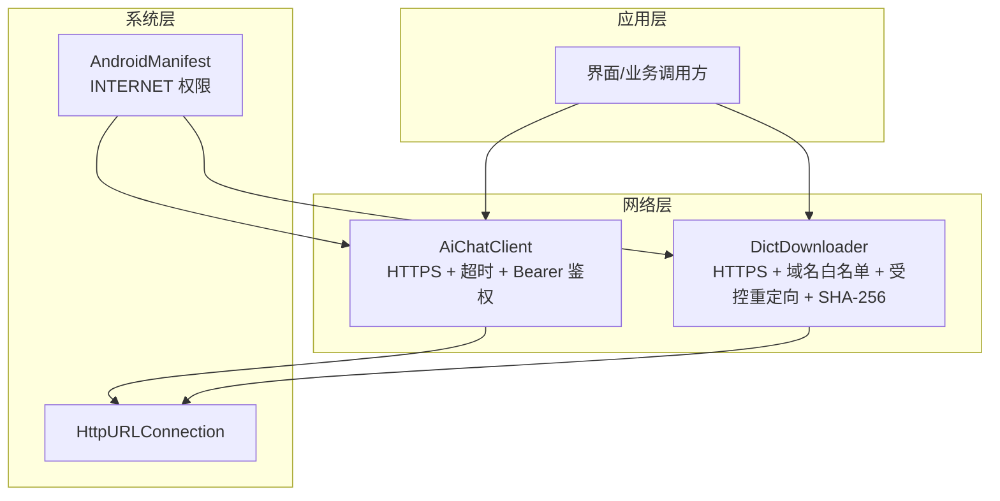
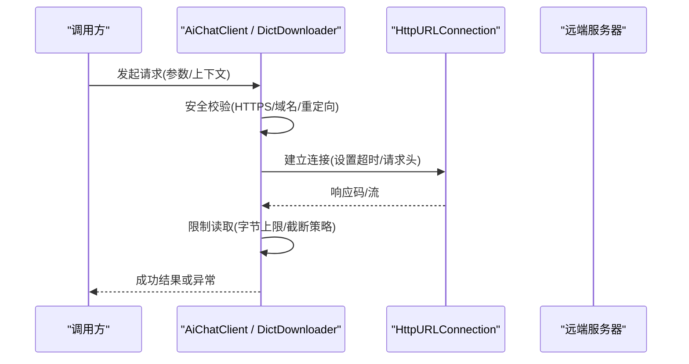
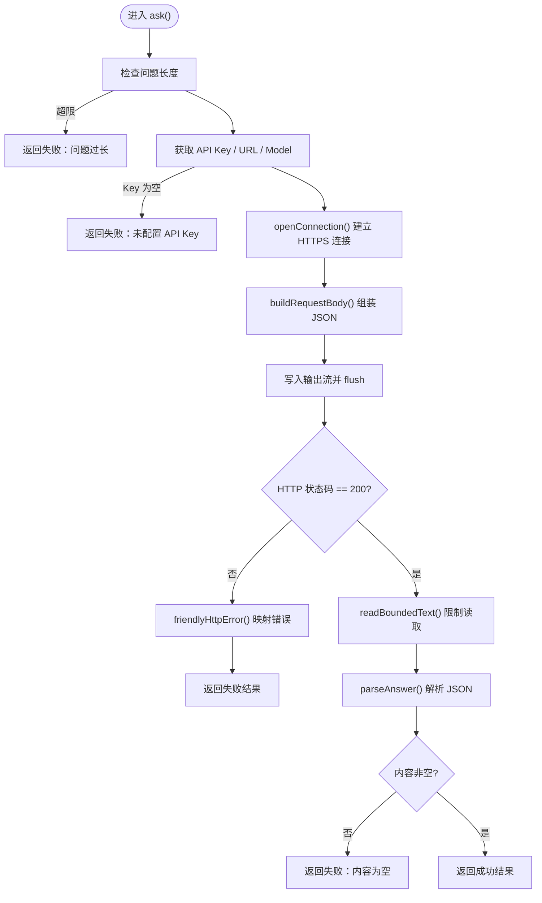
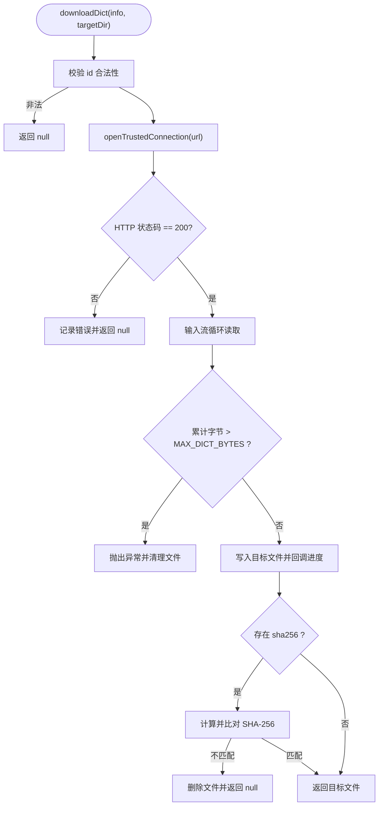
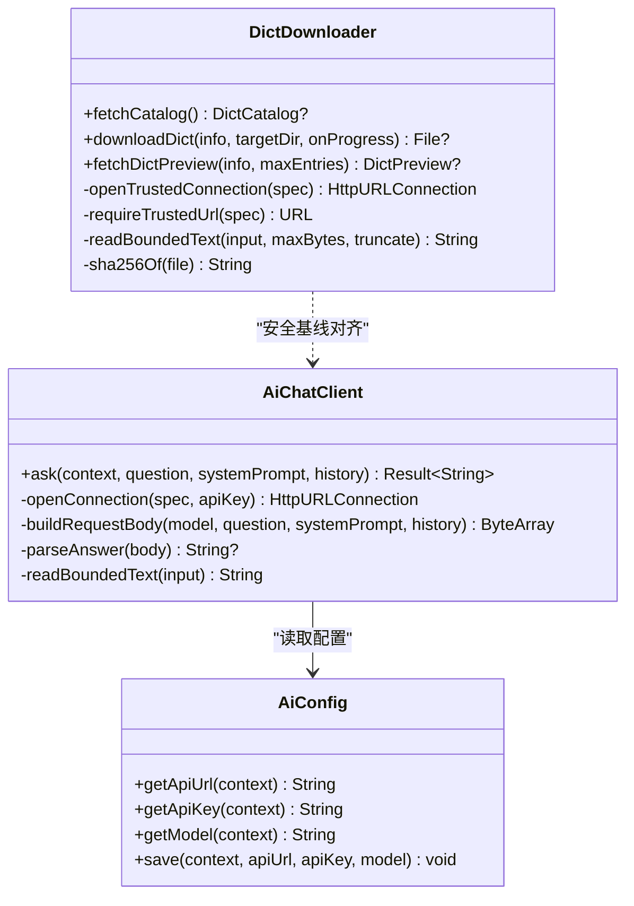
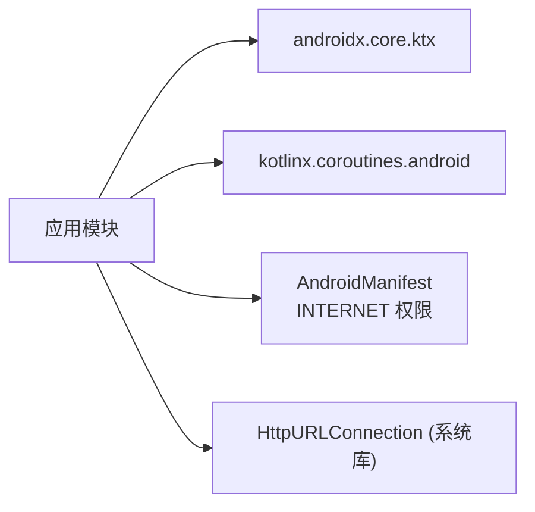

# 网络 API

<cite>
**本文引用的文件**
- [AiChatClient.kt](file://app/src/main/java/com/ziyou/ime/ai/AiChatClient.kt)
- [DictDownloader.kt](file://app/src/main/java/com/ziyou/ime/dict/DictDownloader.kt)
- [AiConfig.kt](file://app/src/main/java/com/ziyou/ime/ai/AiConfig.kt)
- [AndroidManifest.xml](file://app/src/main/AndroidManifest.xml)
- [build.gradle.kts](file://app/build.gradle.kts)
</cite>

## 目录
1. [简介](#简介)
2. [项目结构](#项目结构)
3. [核心组件](#核心组件)
4. [架构总览](#架构总览)
5. [详细组件分析](#详细组件分析)
6. [依赖分析](#依赖分析)
7. [性能考虑](#性能考虑)
8. [故障排查指南](#故障排查指南)
9. [结论](#结论)
10. [附录](#附录)

## 简介
本文件聚焦于本项目中的网络请求相关 API，覆盖以下方面：
- 使用方式与调用流程（以 HttpURLConnection 为基础实现）
- HTTP 请求配置、请求头设置、响应处理
- 网络权限要求、安全限制与重定向控制
- 超时处理、错误恢复策略（不含自动重试）
- 最佳实践建议（缓存、并发控制、资源管理）
- 调试与日志记录指导

说明：项目中未使用 OkHttp/Retrofit 等高级库，所有网络请求均基于 Android 原生 HttpURLConnection 实现。因此“fetch”在本项目中体现为自定义的 openConnection/openTrustedConnection 封装方法，而非浏览器 fetch API。

## 项目结构
与网络相关的代码主要分布在两个模块：
- AI 对话客户端：用于向 OpenAI 兼容端点发起非流式问答请求
- 词库下载器：用于从受信任源拉取目录与词库文件，并做完整性校验

图表来源
- [AiChatClient.kt:116-128](file://app/src/main/java/com/ziyou/ime/ai/AiChatClient.kt#L116-L128)
- [DictDownloader.kt:262-295](file://app/src/main/java/com/ziyou/ime/dict/DictDownloader.kt#L262-L295)
- [AndroidManifest.xml:4](file://app/src/main/AndroidManifest.xml#L4)

章节来源
- [AndroidManifest.xml:1-116](file://app/src/main/AndroidManifest.xml#L1-L116)
- [build.gradle.kts:157-206](file://app/build.gradle.kts#L157-L206)

## 核心组件
- AiChatClient：面向 OpenAI 兼容接口的非流式对话客户端，强制 HTTPS、设置连接/读取超时、注入 Authorization 请求头、限制响应体大小、友好错误提示。
- DictDownloader：面向词库目录与文件的下载器，强制 HTTPS、域名白名单、手动跟随重定向并逐跳校验、限制响应体大小、可选 SHA-256 完整性校验。
- AiConfig：集中管理 AI 服务配置（API URL、API Key、模型名），默认值指向阿里云百炼 DashScope 的 OpenAI 兼容端点。

章节来源
- [AiChatClient.kt:15-30](file://app/src/main/java/com/ziyou/ime/ai/AiChatClient.kt#L15-L30)
- [DictDownloader.kt:18-49](file://app/src/main/java/com/ziyou/ime/dict/DictDownloader.kt#L18-L49)
- [AiConfig.kt:14-28](file://app/src/main/java/com/ziyou/ime/ai/AiConfig.kt#L14-L28)

## 架构总览
整体网络调用流程如下：
- 调用方通过协程在 IO 线程发起请求
- 统一进行安全校验（协议、域名、重定向）
- 设置超时与请求头
- 读取响应并进行边界限制
- 解析结果或返回错误

图表来源
- [AiChatClient.kt:65-114](file://app/src/main/java/com/ziyou/ime/ai/AiChatClient.kt#L65-L114)
- [DictDownloader.kt:54-78](file://app/src/main/java/com/ziyou/ime/dict/DictDownloader.kt#L54-L78)
- [DictDownloader.kt:87-162](file://app/src/main/java/com/ziyou/ime/dict/DictDownloader.kt#L87-L162)

## 详细组件分析

### AiChatClient：AI 对话客户端
- 功能要点
  - 非流式 chat/completions 请求
  - 强制 HTTPS；连接超时约 15s，读取超时约 60s
  - 注入 Authorization: Bearer <apiKey> 请求头
  - 限制单次问题长度与响应体大小
  - 将 HTTP 错误码映射为用户可读提示
  - 所有 IO 切换至 Dispatchers.IO，避免阻塞 UI

- 关键流程
  - 构建请求体：messages 顺序为 system → history → user
  - 打开连接：openConnection(spec, apiKey)
  - 发送请求并读取响应：inputStream 限制最大字节数
  - 解析 JSON 响应：choices[0].message.content

图表来源
- [AiChatClient.kt:65-114](file://app/src/main/java/com/ziyou/ime/ai/AiChatClient.kt#L65-L114)
- [AiChatClient.kt:116-128](file://app/src/main/java/com/ziyou/ime/ai/AiChatClient.kt#L116-L128)
- [AiChatClient.kt:135-153](file://app/src/main/java/com/ziyou/ime/ai/AiChatClient.kt#L135-L153)
- [AiChatClient.kt:156-167](file://app/src/main/java/com/ziyou/ime/ai/AiChatClient.kt#L156-L167)
- [AiChatClient.kt:177-192](file://app/src/main/java/com/ziyou/ime/ai/AiChatClient.kt#L177-L192)

章节来源
- [AiChatClient.kt:1-194](file://app/src/main/java/com/ziyou/ime/ai/AiChatClient.kt#L1-L194)
- [AiConfig.kt:30-40](file://app/src/main/java/com/ziyou/ime/ai/AiConfig.kt#L30-L40)

### DictDownloader：词库下载器
- 功能要点
  - 拉取 catalog.json 与下载词库文件
  - 强制 HTTPS；域名白名单（gitee.com、raw.giteeusercontent.com）
  - 禁用自动重定向，手动跟随并对每一跳重新校验域名
  - 限制 catalog/预览/词库文件大小
  - 可选 SHA-256 完整性校验，失败则删除半成品并拒绝安装

- 关键流程
  - fetchCatalog：拉取目录并解析
  - downloadDict：下载文件到本地，边读边校验大小，完成后校验哈希
  - fetchDictPreview：仅读取前 N 条词条作为预览

图表来源
- [DictDownloader.kt:87-162](file://app/src/main/java/com/ziyou/ime/dict/DictDownloader.kt#L87-L162)
- [DictDownloader.kt:262-295](file://app/src/main/java/com/ziyou/ime/dict/DictDownloader.kt#L262-L295)
- [DictDownloader.kt:297-320](file://app/src/main/java/com/ziyou/ime/dict/DictDownloader.kt#L297-L320)

章节来源
- [DictDownloader.kt:1-367](file://app/src/main/java/com/ziyou/ime/dict/DictDownloader.kt#L1-L367)
- [DictModels.kt:24-56](file://app/src/main/java/com/ziyou/ime/dict/DictModels.kt#L24-L56)

### 类关系图（代码级）

图表来源
- [AiChatClient.kt:31-128](file://app/src/main/java/com/ziyou/ime/ai/AiChatClient.kt#L31-L128)
- [DictDownloader.kt:22-49](file://app/src/main/java/com/ziyou/ime/dict/DictDownloader.kt#L22-L49)
- [AiConfig.kt:14-55](file://app/src/main/java/com/ziyou/ime/ai/AiConfig.kt#L14-L55)

## 依赖分析
- 运行时依赖
  - Android 网络栈：java.net.HttpURLConnection
  - Kotlin 协程：Dispatchers.IO 执行 IO 任务
  - Android 权限：INTERNET
- 构建期依赖
  - 无第三方网络库依赖（如 OkHttp/Retrofit），保持最小化依赖

图表来源
- [build.gradle.kts:177-181](file://app/build.gradle.kts#L177-L181)
- [AndroidManifest.xml:4](file://app/src/main/AndroidManifest.xml#L4)

章节来源
- [build.gradle.kts:157-206](file://app/build.gradle.kts#L157-L206)
- [AndroidManifest.xml:1-116](file://app/src/main/AndroidManifest.xml#L1-L116)

## 性能考虑
- 超时策略
  - 连接超时：约 15s
  - 读取超时：AI 请求约 60s，词库下载约 30s
- 内存与磁盘保护
  - 响应体上限：AI 响应约 1MB，catalog 约 1MB，词库文件约 20MB
  - 预览场景支持截断读取，避免大文件完整加载
- I/O 调度
  - 所有网络 IO 均在 Dispatchers.IO 执行，避免阻塞主线程
- 资源释放
  - 使用 use/finally 确保 InputStream/OutputStream/Connection 正确关闭

章节来源
- [AiChatClient.kt:34-43](file://app/src/main/java/com/ziyou/ime/ai/AiChatClient.kt#L34-L43)
- [DictDownloader.kt:25-48](file://app/src/main/java/com/ziyou/ime/dict/DictDownloader.kt#L25-L48)
- [AiChatClient.kt:105-114](file://app/src/main/java/com/ziyou/ime/ai/AiChatClient.kt#L105-L114)
- [DictDownloader.kt:151-162](file://app/src/main/java/com/ziyou/ime/dict/DictDownloader.kt#L151-L162)

## 故障排查指南
- 常见问题定位
  - 未配置 API Key：返回明确错误提示，引导用户完成设置页配置
  - 非 HTTPS 地址：直接拒绝连接并报错
  - 域名不在白名单：下载被拒绝，需确认 URL 是否来自可信源
  - 重定向过多：超过最大跳数即失败，检查服务端重定向链
  - 响应过大：触发上限保护，检查服务端返回或调整策略
  - 哈希校验失败：删除半成品文件，提示重新下载
- 日志记录
  - 关键路径均有 Log.e/Log.i 记录，便于定位网络异常与解析失败
- 错误恢复策略
  - 当前未实现自动重试；建议在调用层根据错误类型决定是否重试（如网络抖动、429 限流）
  - 对于 401/403 鉴权错误，应提示用户更新 API Key
  - 对于 5xx 服务端错误，可结合指数退避策略在调用层实现重试

章节来源
- [AiChatClient.kt:77-80](file://app/src/main/java/com/ziyou/ime/ai/AiChatClient.kt#L77-L80)
- [AiChatClient.kt:119](file://app/src/main/java/com/ziyou/ime/ai/AiChatClient.kt#L119)
- [AiChatClient.kt:170-175](file://app/src/main/java/com/ziyou/ime/ai/AiChatClient.kt#L170-L175)
- [DictDownloader.kt:265-271](file://app/src/main/java/com/ziyou/ime/dict/DictDownloader.kt#L265-L271)
- [DictDownloader.kt:278-295](file://app/src/main/java/com/ziyou/ime/dict/DictDownloader.kt#L278-L295)
- [DictDownloader.kt:137-147](file://app/src/main/java/com/ziyou/ime/dict/DictDownloader.kt#L137-L147)

## 结论
本项目采用轻量且可控的网络实现：
- 通过 HttpURLConnection 提供基础能力，配合严格的 HTTPS、超时、大小限制与域名白名单，保障安全性与稳定性
- 未内置自动重试机制，但提供了清晰的错误分类与日志，便于上层实现稳健的重试与降级策略
- 建议在调用层补充缓存、并发控制与重试策略，以满足更复杂的业务需求

## 附录

### 网络权限与安全限制清单
- 权限
  - INTERNET：允许应用访问网络
- 安全限制
  - 强制 HTTPS
  - 域名白名单（词库下载）
  - 手动跟随重定向并逐跳校验
  - 响应体大小上限
  - 可选 SHA-256 完整性校验

章节来源
- [AndroidManifest.xml:4](file://app/src/main/AndroidManifest.xml#L4)
- [DictDownloader.kt:32-36](file://app/src/main/java/com/ziyou/ime/dict/DictDownloader.kt#L32-L36)
- [AiChatClient.kt:116-128](file://app/src/main/java/com/ziyou/ime/ai/AiChatClient.kt#L116-L128)

### 请求头与配置要点
- 请求头
  - Content-Type: application/json
  - Authorization: Bearer <apiKey>
- 配置项
  - API URL、API Key、模型名由 AiConfig 管理，支持持久化与默认值

章节来源
- [AiChatClient.kt:125-126](file://app/src/main/java/com/ziyou/ime/ai/AiChatClient.kt#L125-L126)
- [AiConfig.kt:30-40](file://app/src/main/java/com/ziyou/ime/ai/AiConfig.kt#L30-L40)

### 最佳实践建议（调用层补充）
- 请求缓存
  - 对 catalog.json 与词库文件实施本地缓存与版本对比
  - 对 AI 回答可按 key 做短期缓存（注意隐私与时效性）
- 并发控制
  - 使用信号量或队列限制同时进行的下载/请求数量
  - 避免 UI 卡顿与资源争用
- 资源管理
  - 严格关闭流与连接，避免泄漏
  - 合理设置超时与大小上限，防止 OOM/磁盘耗尽
- 重试与降级
  - 针对网络抖动与限流（429）实现指数退避
  - 服务端不可用（5xx）时回退到离线数据或提示用户稍后重试
- 调试与日志
  - 开启详细日志（URL、请求头、响应码、耗时、错误堆栈）
  - 生产环境降低日志级别，保留关键错误信息

[本节为通用指导，不直接分析具体文件]