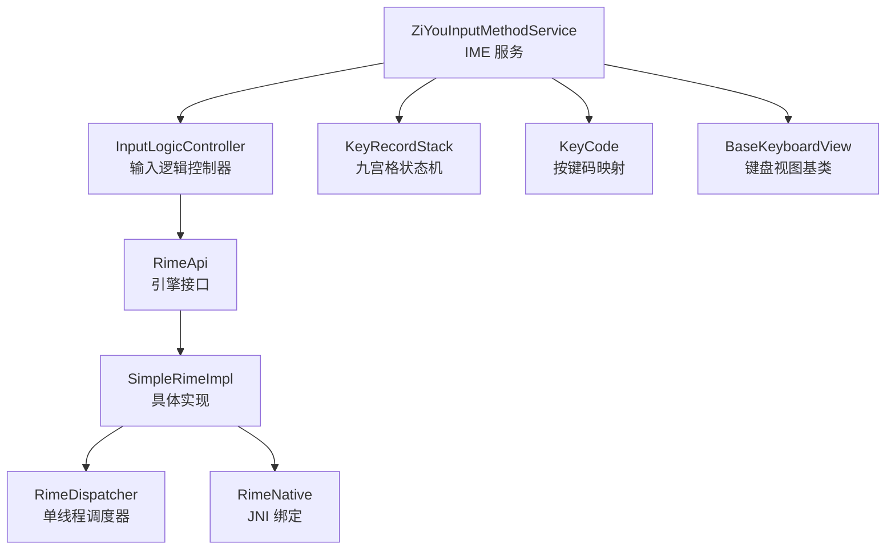
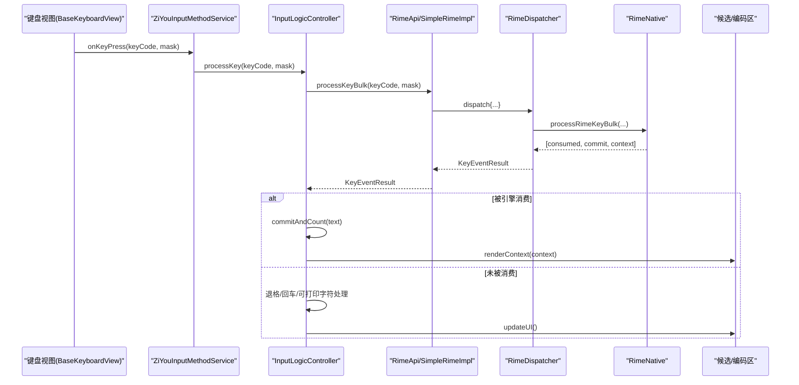
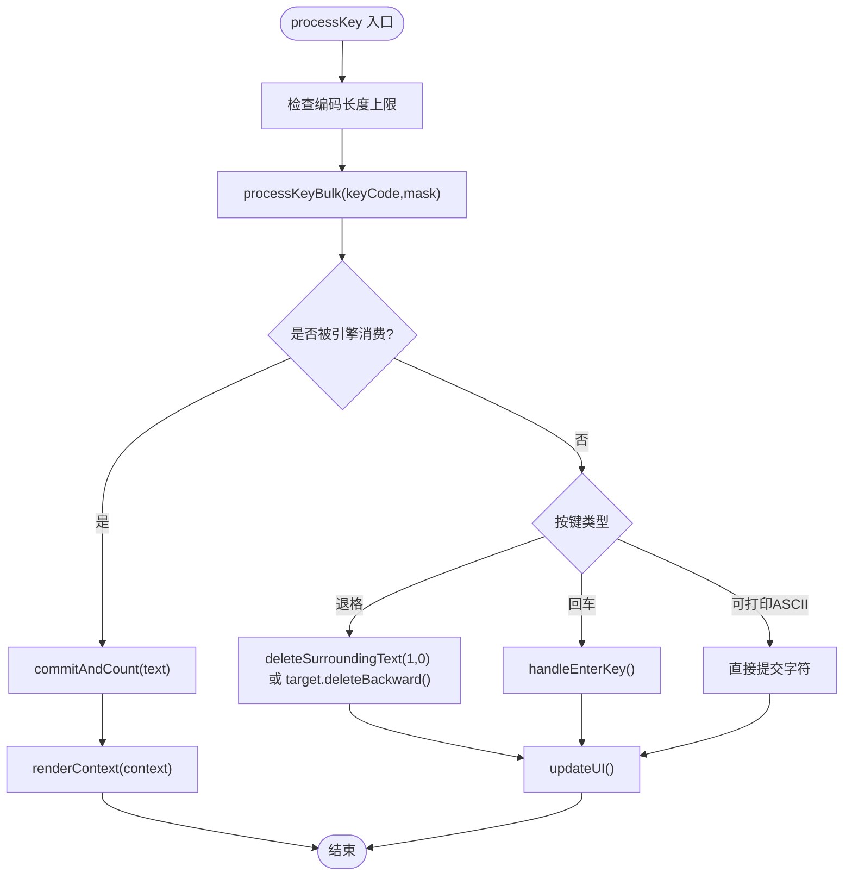
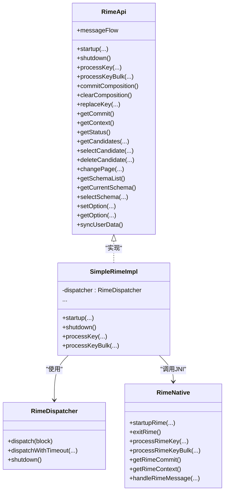
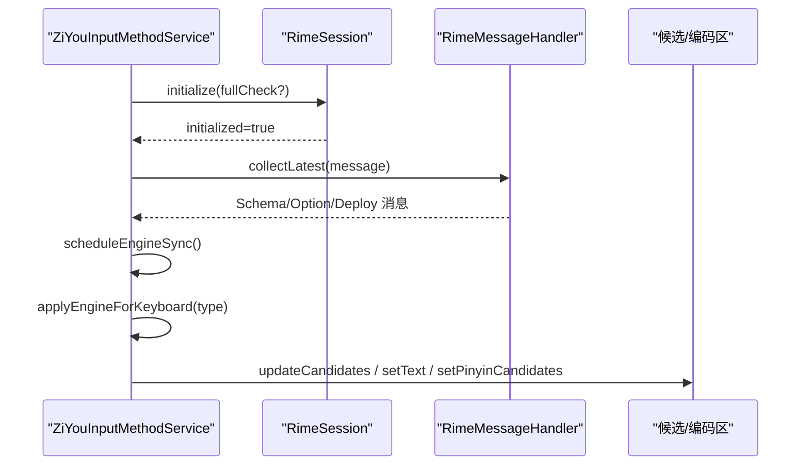
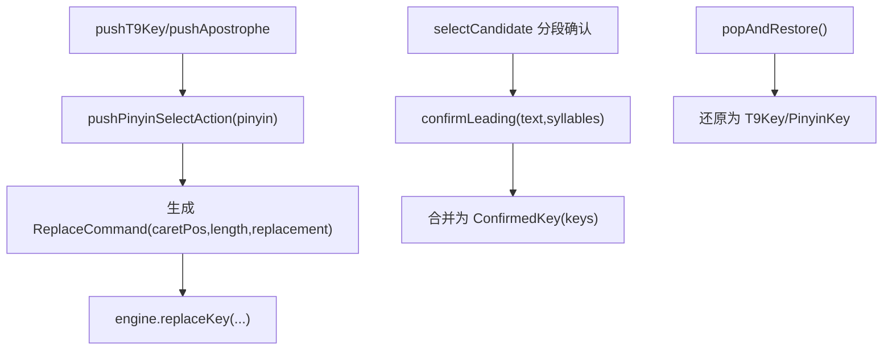
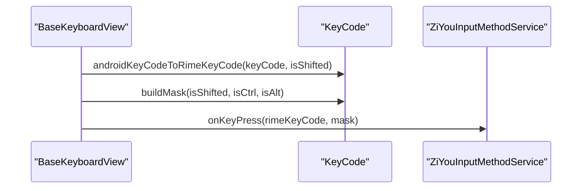
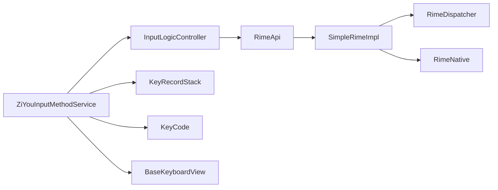

# 输入路由 API

<cite>
**本文引用的文件**   
- [ZiYouInputMethodService.kt](file://app/src/main/java/com/ziyou/ime/ime/ZiYouInputMethodService.kt)
- [InputLogicController.kt](file://app/src/main/java/com/ziyou/ime/ime/InputLogicController.kt)
- [RimeApi.kt](file://app/src/main/java/com/ziyou/ime/core/RimeApi.kt)
- [SimpleRimeImpl.kt](file://app/src/main/java/com/ziyou/ime/core/SimpleRimeImpl.kt)
- [RimeDispatcher.kt](file://app/src/main/java/com/ziyou/ime/core/RimeDispatcher.kt)
- [RimeNative.kt](file://app/src/main/java/com/ziyou/ime/core/RimeNative.kt)
- [RimeSession.kt](file://app/src/main/java/com/ziyou/ime/daemon/RimeSession.kt)
- [KeyCode.kt](file://app/src/main/java/com/ziyou/ime/ime/KeyCode.kt)
- [BaseKeyboardView.kt](file://app/src/main/java/com/ziyou/ime/ime/BaseKeyboardView.kt)
- [KeyRecordStack.kt](file://core-logic/src/main/java/com/ziyou/ime/core/t9/KeyRecordStack.kt)
</cite>

## 目录
1. [简介](#简介)
2. [项目结构](#项目结构)
3. [核心组件](#核心组件)
4. [架构总览](#架构总览)
5. [详细组件分析](#详细组件分析)
6. [依赖关系分析](#依赖关系分析)
7. [性能考量](#性能考量)
8. [故障排查指南](#故障排查指南)
9. [结论](#结论)
10. [附录](#附录)

## 简介
本文件面向“输入路由”相关 API，系统性说明 input.* 接口如何处理键盘事件与输入流，包括按键拦截、事件转发、组合键处理、输入法引擎集成（候选词生成、编码处理）、输入上下文状态管理与事件监听机制。同时给出实际使用示例（自定义快捷键、智能输入辅助），并总结性能优化与兼容性注意事项。

## 项目结构
输入路由由 Android IME 服务层、输入逻辑控制器、Rime 引擎抽象与 JNI 实现、以及九宫格状态机共同构成：
- Service 层负责生命周期、视图装配、键盘布局切换与 UI 同步。
- InputLogicController 封装按键处理、上屏、候选操作与 UI 刷新。
- RimeApi/SimpleRimeImpl/RimeDispatcher/RimeNative 提供线程安全、单线程调度的引擎访问。
- KeyRecordStack 维护九宫格 T9 输入状态，支撑拼音消歧与智能回退。

**图表来源** 
- [ZiYouInputMethodService.kt](file://app/src/main/java/com/ziyou/ime/ime/ZiYouInputMethodService.kt)
- [InputLogicController.kt](file://app/src/main/java/com/ziyou/ime/ime/InputLogicController.kt)
- [RimeApi.kt](file://app/src/main/java/com/ziyou/ime/core/RimeApi.kt)
- [SimpleRimeImpl.kt](file://app/src/main/java/com/ziyou/ime/core/SimpleRimeImpl.kt)
- [RimeDispatcher.kt](file://app/src/main/java/com/ziyou/ime/core/RimeDispatcher.kt)
- [RimeNative.kt](file://app/src/main/java/com/ziyou/ime/core/RimeNative.kt)
- [KeyRecordStack.kt](file://core-logic/src/main/java/com/ziyou/ime/core/t9/KeyRecordStack.kt)
- [BaseKeyboardView.kt](file://app/src/main/java/com/ziyou/ime/ime/BaseKeyboardView.kt)
- [KeyCode.kt](file://app/src/main/java/com/ziyou/ime/ime/KeyCode.kt)

**章节来源**
- [ZiYouInputMethodService.kt](file://app/src/main/java/com/ziyou/ime/ime/ZiYouInputMethodService.kt)
- [InputLogicController.kt](file://app/src/main/java/com/ziyou/ime/ime/InputLogicController.kt)
- [RimeApi.kt](file://app/src/main/java/com/ziyou/ime/core/RimeApi.kt)
- [SimpleRimeImpl.kt](file://app/src/main/java/com/ziyou/ime/core/SimpleRimeImpl.kt)
- [RimeDispatcher.kt](file://app/src/main/java/com/ziyou/ime/core/RimeDispatcher.kt)
- [RimeNative.kt](file://app/src/main/java/com/ziyou/ime/core/RimeNative.kt)
- [KeyRecordStack.kt](file://core-logic/src/main/java/com/ziyou/ime/core/t9/KeyRecordStack.kt)
- [BaseKeyboardView.kt](file://app/src/main/java/com/ziyou/ime/ime/BaseKeyboardView.kt)
- [KeyCode.kt](file://app/src/main/java/com/ziyou/ime/ime/KeyCode.kt)

## 核心组件
- ZiYouInputMethodService：IME 入口，管理引擎生命周期、键盘布局切换、候选区与编码区渲染、面板协调与输入路由目标切换。
- InputLogicController：按键处理热路径、候选选择、翻页、侧栏选拼音、退格重打、回车落地、图片/文本上屏、UI 刷新。
- RimeApi/SimpleRimeImpl/RimeDispatcher/RimeNative：统一线程模型与 JNI 调用，processKeyBulk 热路径批量处理减少跨界开销。
- KeyRecordStack：T9 输入状态机，支持拼音锁定、部分确认、智能回退与替换指令生成。
- KeyCode：Android KeyEvent 到 Rime keysym/mask 的映射。
- BaseKeyboardView：通用键盘绘制与触摸处理，回调 onKeyPress 将按键送入上层。

**章节来源**
- [ZiYouInputMethodService.kt](file://app/src/main/java/com/ziyou/ime/ime/ZiYouInputMethodService.kt)
- [InputLogicController.kt](file://app/src/main/java/com/ziyou/ime/ime/InputLogicController.kt)
- [RimeApi.kt](file://app/src/main/java/com/ziyou/ime/core/RimeApi.kt)
- [SimpleRimeImpl.kt](file://app/src/main/java/com/ziyou/ime/core/SimpleRimeImpl.kt)
- [RimeDispatcher.kt](file://app/src/main/java/com/ziyou/ime/core/RimeDispatcher.kt)
- [RimeNative.kt](file://app/src/main/java/com/ziyou/ime/core/RimeNative.kt)
- [KeyRecordStack.kt](file://core-logic/src/main/java/com/ziyou/ime/core/t9/KeyRecordStack.kt)
- [BaseKeyboardView.kt](file://app/src/main/java/com/ziyou/ime/ime/BaseKeyboardView.kt)
- [KeyCode.kt](file://app/src/main/java/com/ziyou/ime/ime/KeyCode.kt)

## 架构总览
输入路由的关键流程如下：
- 键盘视图捕获用户触摸 → 通过回调发送 (keyCode, mask) 给 Service。
- Service 将按键交给 InputLogicController.processKey。
- processKey 调用 RimeApi.processKeyBulk 进行批量处理（消费则取 commit/context，未消费按规则直接上屏或执行编辑器动作）。
- 引擎状态变化通过消息流通知 Service，用于方案/选项同步与 UI 更新。
- 九宫格特殊路径通过 KeyRecordStack 计算替换指令，调用 replaceKey 与 End 定位，保证候选与编码一致。

**图表来源** 
- [BaseKeyboardView.kt](file://app/src/main/java/com/ziyou/ime/ime/BaseKeyboardView.kt)
- [ZiYouInputMethodService.kt](file://app/src/main/java/com/ziyou/ime/ime/ZiYouInputMethodService.kt)
- [InputLogicController.kt](file://app/src/main/java/com/ziyou/ime/ime/InputLogicController.kt)
- [RimeApi.kt](file://app/src/main/java/com/ziyou/ime/core/RimeApi.kt)
- [SimpleRimeImpl.kt](file://app/src/main/java/com/ziyou/ime/core/SimpleRimeImpl.kt)
- [RimeDispatcher.kt](file://app/src/main/java/com/ziyou/ime/core/RimeDispatcher.kt)
- [RimeNative.kt](file://app/src/main/java/com/ziyou/ime/core/RimeNative.kt)

## 详细组件分析

### 按键处理与输入流（InputLogicController）
- 串行化：内部 Mutex 保证一次按键的 processKey→getCommit→getContext 原子执行，避免快速连击导致的 commit/context 错配。
- 热路径：processKeyBulk 合并三次调用，减少主线程↔Rime 线程往返与 JNI 跨界。
- 编码长度上限：超过阈值丢弃新增编码键，防止组句搜索爆炸导致卡顿。
- 未消费分支：退格直接删字；回车按编辑器语义（performEditorAction 或补发 ENTER 事件）；可打印 ASCII 直接上屏。
- 候选与翻页：selectCandidate/changePage 后统一 updateUI。
- 九宫格拼音侧栏：selectPinyin/restorePinyin 基于 ReplaceCommand 调用 replaceKey 并 End 归位。
- 退格重打：retypeUnconfirmed 使用 KP_Left + Delete 序列避免 Reopen 破坏已确认段。
- 上屏目标：commitTarget 支持技能面板注入；commitDirectToEditor/commitImageToEditor 绕过路由直达宿主编辑器。

**图表来源** 
- [InputLogicController.kt](file://app/src/main/java/com/ziyou/ime/ime/InputLogicController.kt)

**章节来源**
- [InputLogicController.kt](file://app/src/main/java/com/ziyou/ime/ime/InputLogicController.kt)

### 引擎交互与线程模型（RimeApi/SimpleRimeImpl/RimeDispatcher/RimeNative）
- RimeApi：定义所有 suspend 方法，默认 processKeyBulk 组合 processKey/getCommit/getContext。
- SimpleRimeImpl：将调用分发到 RimeDispatcher 单线程执行，确保 librime 线程安全。
- RimeDispatcher：单线程 Executor + CoroutineDispatcher，提供超时与关闭保护。
- RimeNative：JNI 声明，包含 processRimeKeyBulk 等热路径方法与消息回调 handleRimeMessage。

**图表来源** 
- [RimeApi.kt](file://app/src/main/java/com/ziyou/ime/core/RimeApi.kt)
- [SimpleRimeImpl.kt](file://app/src/main/java/com/ziyou/ime/core/SimpleRimeImpl.kt)
- [RimeDispatcher.kt](file://app/src/main/java/com/ziyou/ime/core/RimeDispatcher.kt)
- [RimeNative.kt](file://app/src/main/java/com/ziyou/ime/core/RimeNative.kt)

**章节来源**
- [RimeApi.kt](file://app/src/main/java/com/ziyou/ime/core/RimeApi.kt)
- [SimpleRimeImpl.kt](file://app/src/main/java/com/ziyou/ime/core/SimpleRimeImpl.kt)
- [RimeDispatcher.kt](file://app/src/main/java/com/ziyou/ime/core/RimeDispatcher.kt)
- [RimeNative.kt](file://app/src/main/java/com/ziyou/ime/core/RimeNative.kt)

### 输入上下文与状态管理（ZiYouInputMethodService）
- 引擎就绪等待：awaitEngineReady 轮询，scheduleEngineSync 串行化同步，避免并发交错。
- 键盘布局切换：installKeyboard 重建视图，applyEngineForKeyboard 根据布局切换 schema 与 ascii_mode。
- 候选/编码区渲染：candidatesView.updateCandidates、preeditOverlay.setText、pinyinSideBar.setPinyinCandidates。
- 消息流监听：collectLatest 处理 schema/option/deploy 变更，驱动 UI 与引擎状态一致性。
- 面板协调：技能/AI/涂鸦/粘贴板/工具面板打开前清理编码，保持输入上下文干净。

**图表来源** 
- [ZiYouInputMethodService.kt](file://app/src/main/java/com/ziyou/ime/ime/ZiYouInputMethodService.kt)
- [RimeSession.kt](file://app/src/main/java/com/ziyou/ime/daemon/RimeSession.kt)

**章节来源**
- [ZiYouInputMethodService.kt](file://app/src/main/java/com/ziyou/ime/ime/ZiYouInputMethodService.kt)
- [RimeSession.kt](file://app/src/main/java/com/ziyou/ime/daemon/RimeSession.kt)

### 九宫格状态机（KeyRecordStack）
- 记录类型：T9Key、Apostrophe、PinyinKey、ConfirmedKey，顺序与 Rime 编码串逻辑一致。
- 拼音锁定：pushPinyinSelectAction 原地替换首个未确定音节段，返回 ReplaceCommand。
- 部分确认：confirmLeading 合并栈头为 ConfirmedKey，保持原始编码串偏移正确。
- 智能回退：popAndRestore 解锁末位拼音或展开确认段，还原为原始键序列。
- 未确认原始串：unconfirmedRawChars 供 retypeUnconfirmed 逐键重放。

**图表来源** 
- [KeyRecordStack.kt](file://core-logic/src/main/java/com/ziyou/ime/core/t9/KeyRecordStack.kt)

**章节来源**
- [KeyRecordStack.kt](file://core-logic/src/main/java/com/ziyou/ime/core/t9/KeyRecordStack.kt)

### 键盘视图与按键映射（BaseKeyboardView & KeyCode）
- BaseKeyboardView：统一触摸、长按重复、皮肤缩放、按键矩形缓存与绘制；onKeyPress 回调将 (keyCode, mask) 上报。
- KeyCode：Android KeyEvent → Rime keysym/mask 映射，含功能键与修饰掩码构建。

**图表来源** 
- [BaseKeyboardView.kt](file://app/src/main/java/com/ziyou/ime/ime/BaseKeyboardView.kt)
- [KeyCode.kt](file://app/src/main/java/com/ziyou/ime/ime/KeyCode.kt)

**章节来源**
- [BaseKeyboardView.kt](file://app/src/main/java/com/ziyou/ime/ime/BaseKeyboardView.kt)
- [KeyCode.kt](file://app/src/main/java/com/ziyou/ime/ime/KeyCode.kt)

## 依赖关系分析
- Service 依赖 InputLogicController 完成输入逻辑；InputLogicController 依赖 RimeApi 抽象；SimpleRimeImpl 依赖 RimeDispatcher 与 RimeNative。
- 九宫格路径依赖 KeyRecordStack 生成替换指令；键盘视图依赖 KeyCode 完成键码转换。
- 引擎消息流通过 RimeMessageHandler 暴露 SharedFlow，Service 订阅以保持一致性。

**图表来源** 
- [ZiYouInputMethodService.kt](file://app/src/main/java/com/ziyou/ime/ime/ZiYouInputMethodService.kt)
- [InputLogicController.kt](file://app/src/main/java/com/ziyou/ime/ime/InputLogicController.kt)
- [RimeApi.kt](file://app/src/main/java/com/ziyou/ime/core/RimeApi.kt)
- [SimpleRimeImpl.kt](file://app/src/main/java/com/ziyou/ime/core/SimpleRimeImpl.kt)
- [RimeDispatcher.kt](file://app/src/main/java/com/ziyou/ime/core/RimeDispatcher.kt)
- [RimeNative.kt](file://app/src/main/java/com/ziyou/ime/core/RimeNative.kt)
- [KeyRecordStack.kt](file://core-logic/src/main/java/com/ziyou/ime/core/t9/KeyRecordStack.kt)
- [BaseKeyboardView.kt](file://app/src/main/java/com/ziyou/ime/ime/BaseKeyboardView.kt)
- [KeyCode.kt](file://app/src/main/java/com/ziyou/ime/ime/KeyCode.kt)

**章节来源**
- [ZiYouInputMethodService.kt](file://app/src/main/java/com/ziyou/ime/ime/ZiYouInputMethodService.kt)
- [InputLogicController.kt](file://app/src/main/java/com/ziyou/ime/ime/InputLogicController.kt)
- [RimeApi.kt](file://app/src/main/java/com/ziyou/ime/core/RimeApi.kt)
- [SimpleRimeImpl.kt](file://app/src/main/java/com/ziyou/ime/core/SimpleRimeImpl.kt)
- [RimeDispatcher.kt](file://app/src/main/java/com/ziyou/ime/core/RimeDispatcher.kt)
- [RimeNative.kt](file://app/src/main/java/com/ziyou/ime/core/RimeNative.kt)
- [KeyRecordStack.kt](file://core-logic/src/main/java/com/ziyou/ime/core/t9/KeyRecordStack.kt)
- [BaseKeyboardView.kt](file://app/src/main/java/com/ziyou/ime/ime/BaseKeyboardView.kt)
- [KeyCode.kt](file://app/src/main/java/com/ziyou/ime/ime/KeyCode.kt)

## 性能考量
- 热路径优化：processKeyBulk 单次 JNI 跨界完成 processKey+getCommit+getContext，显著降低线程切换与跨进程开销。
- 慢按键告警：当 processKeyBulk 耗时超过阈值时记录日志，便于发现退化。
- 编码长度上限：MAX_INPUT_LENGTH 限制编码串长度，避免组合爆炸导致的卡顿。
- 引擎就绪等待：awaitEngineReady 与 scheduleEngineSync latest-wins 串行化，避免快速切换导致的迟到写入。
- 内存回收：trimNativeHeap 在部署完成后归还 native 堆空闲页，降低常驻占用。

[本节为通用指导，不直接分析具体文件]

## 故障排查指南
- 引擎未初始化：访问 rime.api 抛出异常，应先调用 initialize 并等待 initialized=true。
- 库加载失败：RimeNative.isLoaded=false 时无法调用 native 方法，检查 ABI 与 .so 文件。
- 方案切换失败：selectSchema 返回 false 时需回退默认方案并记录日志。
- 候选/编码不同步：检查 applyEngineForKeyboard 是否正确设置 ascii_mode 与 schema，并调用 updateUI。
- 九宫格错位：确认 KeyRecordStack 的 confirmLeading 与 popAndRestore 是否成功，必要时清栈降级。

**章节来源**
- [RimeSession.kt](file://app/src/main/java/com/ziyou/ime/daemon/RimeSession.kt)
- [RimeNative.kt](file://app/src/main/java/com/ziyou/ime/core/RimeNative.kt)
- [ZiYouInputMethodService.kt](file://app/src/main/java/com/ziyou/ime/ime/ZiYouInputMethodService.kt)
- [KeyRecordStack.kt](file://core-logic/src/main/java/com/ziyou/ime/core/t9/KeyRecordStack.kt)

## 结论
输入路由通过清晰的层次划分与严格的线程模型，实现了高效稳定的键盘事件处理与输入法引擎集成。InputLogicController 的热路径优化与 Mutex 串行化保障了高吞吐与一致性；RimeApi/SimpleRimeImpl/RimeDispatcher/RimeNative 提供了安全的引擎访问；KeyRecordStack 解决了九宫格复杂状态下的编码与候选一致性。结合消息流与引擎就绪等待机制，整体具备良好性能与兼容性。

[本节为总结，不直接分析具体文件]

## 附录

### 实际使用示例
- 自定义快捷键：在 BaseKeyboardView 中定义自定义 keyCode（如 KEYCODE_SWITCH_SCHEMA），通过 onKeyPress 回调传入 Service，再由 handleSoftKeyPress 分发至对应逻辑。
- 智能输入辅助：利用 KeyRecordStack.pushPinyinSelectAction 生成 ReplaceCommand，调用 engine.replaceKey 与 End 定位，实现拼音消歧与组词候选。
- 面板输入路由：设置 InputLogicController.commitTarget 为面板目标，使候选/选词结果注入面板输入框；需要直达编辑器时使用 commitDirectToEditor/commitImageToEditor。

**章节来源**
- [BaseKeyboardView.kt](file://app/src/main/java/com/ziyou/ime/ime/BaseKeyboardView.kt)
- [InputLogicController.kt](file://app/src/main/java/com/ziyou/ime/ime/InputLogicController.kt)
- [KeyRecordStack.kt](file://core-logic/src/main/java/com/ziyou/ime/core/t9/KeyRecordStack.kt)