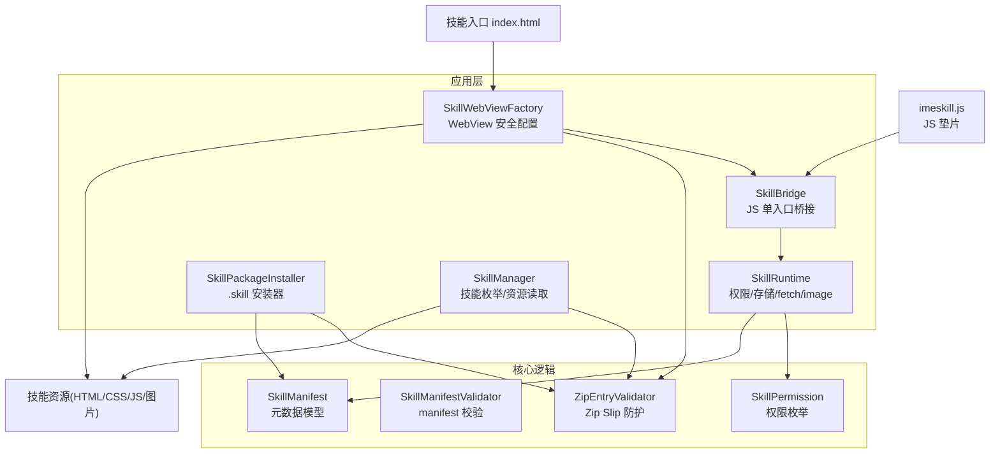
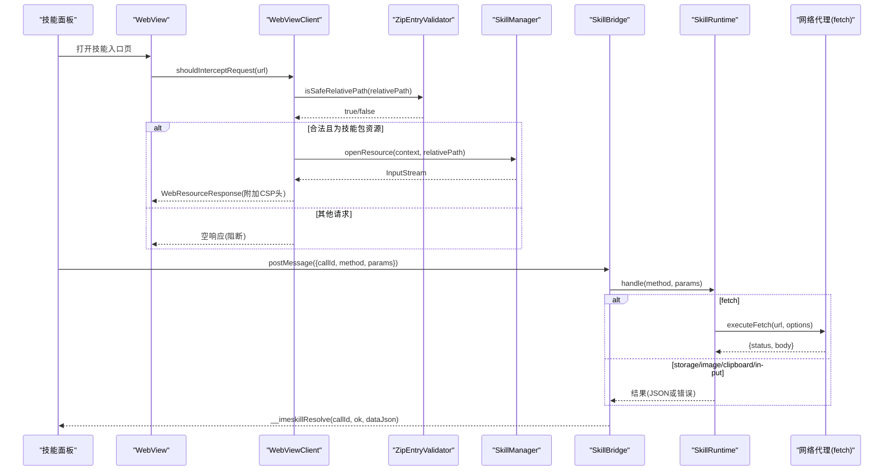
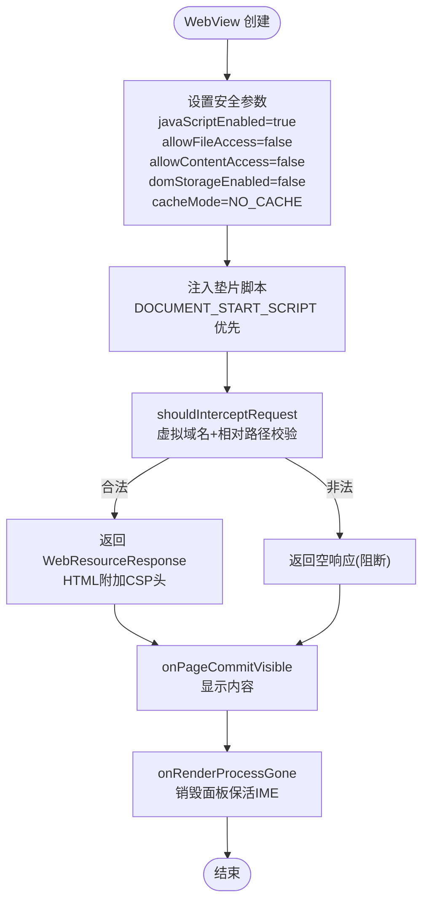
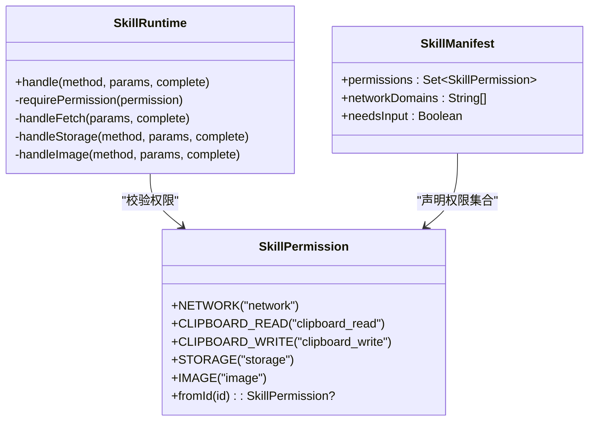
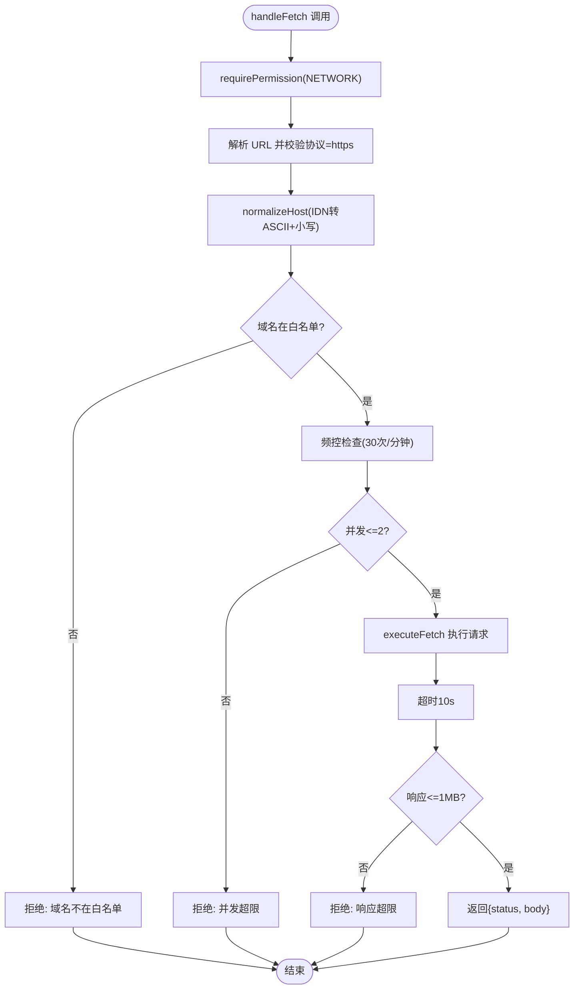
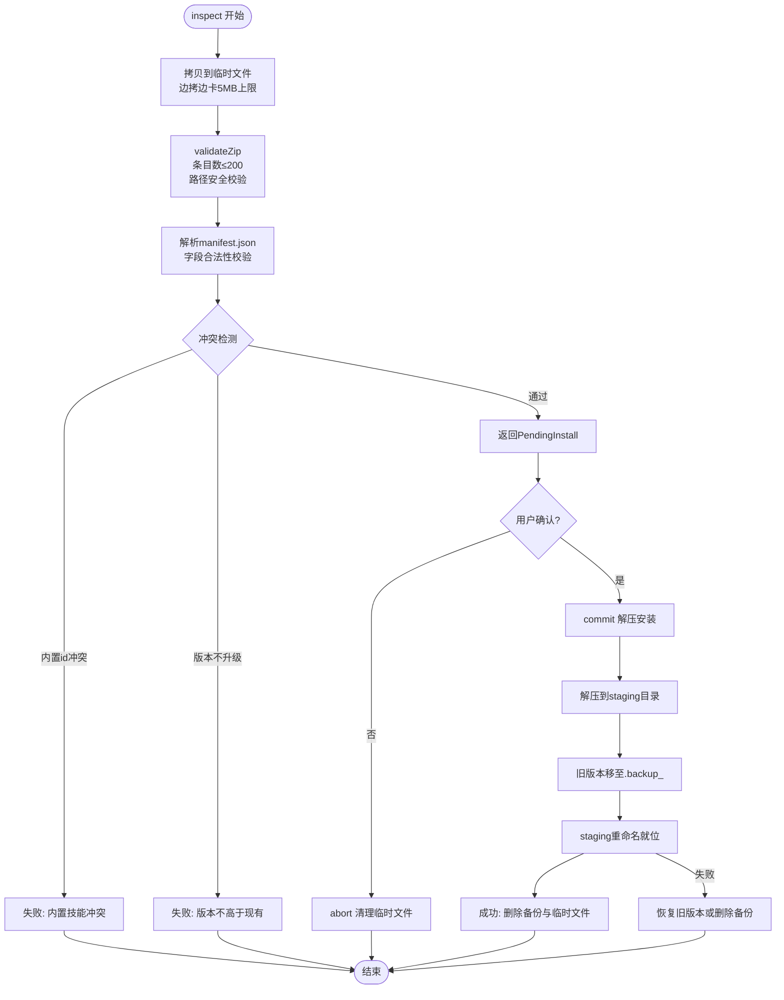
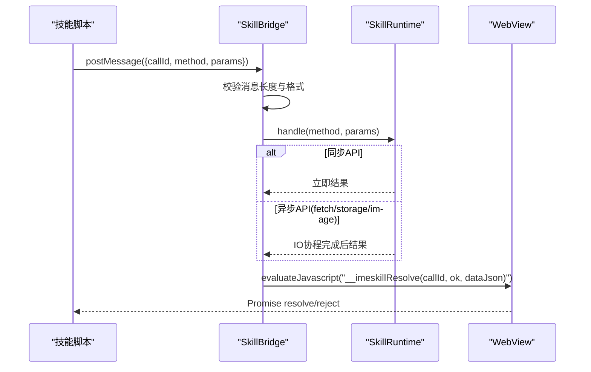
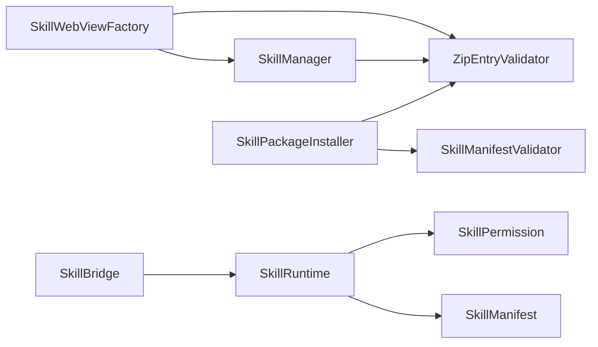

# 安全与沙箱机制

<cite>
**本文引用的文件**   
- [SkillWebViewFactory.kt](file://app/src/main/java/com/ziyou/ime/skill/SkillWebViewFactory.kt)
- [SkillBridge.kt](file://app/src/main/java/com/ziyou/ime/skill/SkillBridge.kt)
- [SkillRuntime.kt](file://app/src/main/java/com/ziyou/ime/skill/SkillRuntime.kt)
- [ZipEntryValidator.kt](file://core-logic/src/main/java/com/ziyou/ime/core/skill/ZipEntryValidator.kt)
- [SkillManifestValidator.kt](file://core-logic/src/main/java/com/ziyou/ime/core/skill/SkillManifestValidator.kt)
- [SkillPermission.kt](file://core-logic/src/main/java/com/ziyou/ime/core/skill/SkillPermission.kt)
- [SkillManifest.kt](file://core-logic/src/main/java/com/ziyou/ime/core/skill/SkillManifest.kt)
- [SkillPackageInstaller.kt](file://app/src/main/java/com/ziyou/ime/skill/SkillPackageInstaller.kt)
- [SkillManager.kt](file://app/src/main/java/com/ziyou/ime/skill/SkillManager.kt)
- [imeskill.js](file://app/src/main/assets/skill_runtime/imeskill.js)
- [calculator manifest.json](file://app/src/main/assets/skills/calculator/manifest.json)
- [weather manifest.json](file://app/src/main/assets/skills/weather/manifest.json)
</cite>

## 目录
1. [简介](#简介)
2. [项目结构](#项目结构)
3. [核心组件](#核心组件)
4. [架构总览](#架构总览)
5. [详细组件分析](#详细组件分析)
6. [依赖关系分析](#依赖关系分析)
7. [性能与安全特性](#性能与安全特性)
8. [故障排查指南](#故障排查指南)
9. [结论](#结论)
10. [附录：最佳实践与常见漏洞防护](#附录最佳实践与常见漏洞防护)

## 简介
本文件系统性阐述技能插件的安全与沙箱机制，覆盖以下关键主题：
- WebView 沙箱限制与安全策略（CSP、网络拦截、文件系统隔离、DOM 存储禁用）
- 权限系统（声明、安装时确认、运行时检查）
- 网络代理安全限制（HTTPS 强制、域名白名单、频控并发限制）
- 安装包校验流程（Zip Slip 防护、路径安全检查、manifest 验证）
- 安全最佳实践与常见漏洞防护措施

该机制确保技能脚本在受限环境中运行，仅通过受控 Bridge API 访问宿主能力，所有资源加载与网络请求均被严格审查。

## 项目结构
技能插件安全相关代码主要分布在 app 层的 skill 包与 core-logic 的 skill 模块中：
- app/src/main/java/com/ziyou/ime/skill：WebView 工厂、Bridge、运行时、安装包安装器、技能管理器
- core-logic/src/main/java/com/ziyou/ime/core/skill：权限枚举、manifest 模型与校验、Zip 条目安全校验
- app/src/main/assets/skill_runtime/imeskill.js：JS 垫片，统一暴露 IMESkill API
- app/src/main/assets/skills/*：内置技能示例及 manifest

**图表来源** 
- [SkillWebViewFactory.kt:1-205](file://app/src/main/java/com/ziyou/ime/skill/SkillWebViewFactory.kt#L1-L205)
- [SkillBridge.kt:1-99](file://app/src/main/java/com/ziyou/ime/skill/SkillBridge.kt#L1-L99)
- [SkillRuntime.kt:1-521](file://app/src/main/java/com/ziyou/ime/skill/SkillRuntime.kt#L1-L521)
- [ZipEntryValidator.kt:1-37](file://core-logic/src/main/java/com/ziyou/ime/core/skill/ZipEntryValidator.kt#L1-L37)
- [SkillManifestValidator.kt:1-78](file://core-logic/src/main/java/com/ziyou/ime/core/skill/SkillManifestValidator.kt#L1-L78)
- [SkillPermission.kt:1-27](file://core-logic/src/main/java/com/ziyou/ime/core/skill/SkillPermission.kt#L1-L27)
- [SkillManifest.kt:1-51](file://core-logic/src/main/java/com/ziyou/ime/core/skill/SkillManifest.kt#L1-L51)
- [SkillPackageInstaller.kt:1-194](file://app/src/main/java/com/ziyou/ime/skill/SkillPackageInstaller.kt#L1-L194)
- [SkillManager.kt:1-110](file://app/src/main/java/com/ziyou/ime/skill/SkillManager.kt#L1-L110)
- [imeskill.js:1-164](file://app/src/main/assets/skill_runtime/imeskill.js#L1-L164)

**章节来源**
- [SkillWebViewFactory.kt:1-205](file://app/src/main/java/com/ziyou/ime/skill/SkillWebViewFactory.kt#L1-L205)
- [SkillBridge.kt:1-99](file://app/src/main/java/com/ziyou/ime/skill/SkillBridge.kt#L1-L99)
- [SkillRuntime.kt:1-521](file://app/src/main/java/com/ziyou/ime/skill/SkillRuntime.kt#L1-L521)
- [ZipEntryValidator.kt:1-37](file://core-logic/src/main/java/com/ziyou/ime/core/skill/ZipEntryValidator.kt#L1-L37)
- [SkillManifestValidator.kt:1-78](file://core-logic/src/main/java/com/ziyou/ime/core/skill/SkillManifestValidator.kt#L1-L78)
- [SkillPermission.kt:1-27](file://core-logic/src/main/java/com/ziyou/ime/core/skill/SkillPermission.kt#L1-L27)
- [SkillManifest.kt:1-51](file://core-logic/src/main/java/com/ziyou/ime/core/skill/SkillManifest.kt#L1-L51)
- [SkillPackageInstaller.kt:1-194](file://app/src/main/java/com/ziyou/ime/skill/SkillPackageInstaller.kt#L1-L194)
- [SkillManager.kt:1-110](file://app/src/main/java/com/ziyou/ime/skill/SkillManager.kt#L1-L110)
- [imeskill.js:1-164](file://app/src/main/assets/skill_runtime/imeskill.js#L1-L164)

## 核心组件
- SkillWebViewFactory：创建并配置 WebView，实施 CSP、全量资源拦截、禁止文件/内容访问、禁用 DOM 存储、渲染进程崩溃兜底
- SkillBridge：JS 单入口桥接，消息长度限制、异步回调、异常兜底
- SkillRuntime：实现 Bridge API（sendText、storage、fetch、image、clipboard、input），执行权限检查、限额控制、频控并发
- ZipEntryValidator：Zip Slip 防护与相对路径安全校验
- SkillManifestValidator：manifest 字段合法性校验（id、版本、入口、域名白名单、权限一致性）
- SkillPermission：权限枚举（network、clipboard_read/write、storage、image）
- SkillPackageInstaller：.skill 包安装流程（临时文件、全量校验、用户确认后解压、回滚保护）
- SkillManager：技能枚举与资源读取（双保险 canonicalPath 校验）
- imeskill.js：JS 垫片，统一暴露 IMESkill API，Promise 封装

**章节来源**
- [SkillWebViewFactory.kt:1-205](file://app/src/main/java/com/ziyou/ime/skill/SkillWebViewFactory.kt#L1-L205)
- [SkillBridge.kt:1-99](file://app/src/main/java/com/ziyou/ime/skill/SkillBridge.kt#L1-L99)
- [SkillRuntime.kt:1-521](file://app/src/main/java/com/ziyou/ime/skill/SkillRuntime.kt#L1-L521)
- [ZipEntryValidator.kt:1-37](file://core-logic/src/main/java/com/ziyou/ime/core/skill/ZipEntryValidator.kt#L1-L37)
- [SkillManifestValidator.kt:1-78](file://core-logic/src/main/java/com/ziyou/ime/core/skill/SkillManifestValidator.kt#L1-L78)
- [SkillPermission.kt:1-27](file://core-logic/src/main/java/com/ziyou/ime/core/skill/SkillPermission.kt#L1-L27)
- [SkillPackageInstaller.kt:1-194](file://app/src/main/java/com/ziyou/ime/skill/SkillPackageInstaller.kt#L1-L194)
- [SkillManager.kt:1-110](file://app/src/main/java/com/ziyou/ime/skill/SkillManager.kt#L1-L110)
- [imeskill.js:1-164](file://app/src/main/assets/skill_runtime/imeskill.js#L1-L164)

## 架构总览
技能插件运行于 WebView 沙箱内，通过 Bridge 与宿主通信；所有资源加载由 WebViewClient 拦截并按虚拟域名映射到技能包内资源；网络请求经 Runtime.fetch 代理，强制 HTTPS、域名白名单、频控并发；安装包在安装前进行全量校验，防止 Zip Slip 与非法 manifest。

**图表来源** 
- [SkillWebViewFactory.kt:93-156](file://app/src/main/java/com/ziyou/ime/skill/SkillWebViewFactory.kt#L93-L156)
- [ZipEntryValidator.kt:29-35](file://core-logic/src/main/java/com/ziyou/ime/core/skill/ZipEntryValidator.kt#L29-L35)
- [SkillManager.kt:29-42](file://app/src/main/java/com/ziyou/ime/skill/SkillManager.kt#L29-L42)
- [SkillBridge.kt:45-98](file://app/src/main/java/com/ziyou/ime/skill/SkillBridge.kt#L45-L98)
- [SkillRuntime.kt:374-471](file://app/src/main/java/com/ziyou/ime/skill/SkillRuntime.kt#L374-L471)

## 详细组件分析

### WebView 沙箱与 CSP 策略
- 资源全量拦截：仅允许虚拟域名下的技能包内资源，其余请求返回空响应
- CSP 注入：HTML 响应附加 Content-Security-Policy，限制 script/style/img/connect-src
- 文件/内容访问关闭：allowFileAccess=false、allowContentAccess=false
- DOM 存储禁用：domStorageEnabled=false
- 首帧隐藏防闪烁：INVISIBLE 至 onPageCommitVisible/VISIBLE
- 渲染进程崩溃兜底：onRenderProcessGone 销毁面板，保活 IME

**图表来源** 
- [SkillWebViewFactory.kt:60-158](file://app/src/main/java/com/ziyou/ime/skill/SkillWebViewFactory.kt#L60-L158)

**章节来源**
- [SkillWebViewFactory.kt:60-158](file://app/src/main/java/com/ziyou/ime/skill/SkillWebViewFactory.kt#L60-L158)

### 权限系统与验证机制
- 权限声明：manifest.permissions 声明所需权限（network、clipboard_read/write、storage、image）
- 安装时确认：inspect 阶段返回 PendingInstall，UI 展示权限后用户确认 commit
- 运行时检查：SkillRuntime.requirePermission 在执行 API 前校验权限，未声明则抛出异常
- 权限枚举：SkillPermission.id 与 manifest 解析一致，未知 id 拒绝

**图表来源** 
- [SkillPermission.kt:10-26](file://core-logic/src/main/java/com/ziyou/ime/core/skill/SkillPermission.kt#L10-L26)
- [SkillManifest.kt:9-40](file://core-logic/src/main/java/com/ziyou/ime/core/skill/SkillManifest.kt#L9-L40)
- [SkillRuntime.kt:485-489](file://app/src/main/java/com/ziyou/ime/skill/SkillRuntime.kt#L485-L489)

**章节来源**
- [SkillPermission.kt:10-26](file://core-logic/src/main/java/com/ziyou/ime/core/skill/SkillPermission.kt#L10-L26)
- [SkillManifest.kt:9-40](file://core-logic/src/main/java/com/ziyou/ime/core/skill/SkillManifest.kt#L9-L40)
- [SkillRuntime.kt:485-489](file://app/src/main/java/com/ziyou/ime/skill/SkillRuntime.kt#L485-L489)

### 网络代理安全限制
- HTTPS 强制：仅允许 https 协议
- 域名白名单：精确匹配 normalizeHost 后的域名，支持 IDN/punycode 归一化
- 频控限制：滑动窗口 30 次/分钟
- 并发限制：最大 2 个并发请求
- 超时限制：连接与读取超时 10s
- 响应大小限制：最大 1MB
- 禁止重定向：instanceFollowRedirects=false，防止白名单逃逸

**图表来源** 
- [SkillRuntime.kt:374-471](file://app/src/main/java/com/ziyou/ime/skill/SkillRuntime.kt#L374-L471)

**章节来源**
- [SkillRuntime.kt:374-471](file://app/src/main/java/com/ziyou/ime/skill/SkillRuntime.kt#L374-L471)

### 安装包校验流程
- 临时文件拷贝：边拷边卡包体上限 5MB
- Zip 条目校验：条目数上限 200，逐条路径安全校验（Zip Slip 防护）
- manifest 解析与验证：必填字段、入口文件存在性、权限一致性
- 冲突检测：内置技能不可覆盖，已安装同 id 仅允许升级
- 原子替换：staging → backup → rename，失败回滚
- 卸载清理：删除安装目录与 storage 数据

**图表来源** 
- [SkillPackageInstaller.kt:40-148](file://app/src/main/java/com/ziyou/ime/skill/SkillPackageInstaller.kt#L40-L148)
- [ZipEntryValidator.kt:29-35](file://core-logic/src/main/java/com/ziyou/ime/core/skill/ZipEntryValidator.kt#L29-L35)
- [SkillManifestValidator.kt:37-76](file://core-logic/src/main/java/com/ziyou/ime/core/skill/SkillManifestValidator.kt#L37-L76)

**章节来源**
- [SkillPackageInstaller.kt:40-148](file://app/src/main/java/com/ziyou/ime/skill/SkillPackageInstaller.kt#L40-L148)
- [ZipEntryValidator.kt:29-35](file://core-logic/src/main/java/com/ziyou/ime/core/skill/ZipEntryValidator.kt#L29-L35)
- [SkillManifestValidator.kt:37-76](file://core-logic/src/main/java/com/ziyou/ime/core/skill/SkillManifestValidator.kt#L37-L76)

### JS Bridge 与运行时
- 单入口设计：__IMESkillNative.postMessage 唯一接口，避免多方法直暴
- 消息长度限制：512KB 上限，防拖垮主线程
- 异步回调：evaluateJavascript 回传 Promise 结果
- 异常兜底：未预期异常转换为通用错误，不波及 IME 主进程
- 面板释放：release 后拒绝一切调用

**图表来源** 
- [SkillBridge.kt:45-98](file://app/src/main/java/com/ziyou/ime/skill/SkillBridge.kt#L45-L98)
- [SkillRuntime.kt:142-157](file://app/src/main/java/com/ziyou/ime/skill/SkillRuntime.kt#L142-L157)

**章节来源**
- [SkillBridge.kt:45-98](file://app/src/main/java/com/ziyou/ime/skill/SkillBridge.kt#L45-L98)
- [SkillRuntime.kt:142-157](file://app/src/main/java/com/ziyou/ime/skill/SkillRuntime.kt#L142-L157)

## 依赖关系分析
- SkillWebViewFactory 依赖 ZipEntryValidator 和 SkillManager 进行资源安全校验与读取
- SkillBridge 依赖 SkillRuntime 处理业务逻辑
- SkillRuntime 依赖 SkillPermission 和 SkillManifest 进行权限与元数据校验
- SkillPackageInstaller 依赖 ZipEntryValidator 和 SkillManifestValidator 进行安装包校验
- SkillManager 提供资源读取的统一入口，包含 canonicalPath 纵深防御

**图表来源** 
- [SkillWebViewFactory.kt:1-205](file://app/src/main/java/com/ziyou/ime/skill/SkillWebViewFactory.kt#L1-L205)
- [SkillBridge.kt:1-99](file://app/src/main/java/com/ziyou/ime/skill/SkillBridge.kt#L1-L99)
- [SkillRuntime.kt:1-521](file://app/src/main/java/com/ziyou/ime/skill/SkillRuntime.kt#L1-L521)
- [SkillPackageInstaller.kt:1-194](file://app/src/main/java/com/ziyou/ime/skill/SkillPackageInstaller.kt#L1-L194)
- [SkillManager.kt:1-110](file://app/src/main/java/com/ziyou/ime/skill/SkillManager.kt#L1-L110)

**章节来源**
- [SkillWebViewFactory.kt:1-205](file://app/src/main/java/com/ziyou/ime/skill/SkillWebViewFactory.kt#L1-L205)
- [SkillBridge.kt:1-99](file://app/src/main/java/com/ziyou/ime/skill/SkillBridge.kt#L1-L99)
- [SkillRuntime.kt:1-521](file://app/src/main/java/com/ziyou/ime/skill/SkillRuntime.kt#L1-L521)
- [SkillPackageInstaller.kt:1-194](file://app/src/main/java/com/ziyou/ime/skill/SkillPackageInstaller.kt#L1-L194)
- [SkillManager.kt:1-110](file://app/src/main/java/com/ziyou/ime/skill/SkillManager.kt#L1-L110)

## 性能与安全特性
- WebView 缓存禁用：避免本地缓存目录膨胀
- 首帧隐藏：减少黑屏闪烁，提升用户体验
- 单并发 storage IO：保证 set/remove 顺序，避免竞态条件
- fetch 频控与并发限制：防止滥用与资源耗尽
- 响应大小限制：1MB 上限，防止内存溢出
- PNG 魔数校验：仅接受 PNG 图片，防止 MIME 伪造
- 存储限额：1MB 序列化后大小限制

**章节来源**
- [SkillWebViewFactory.kt:72-82](file://app/src/main/java/com/ziyou/ime/skill/SkillWebViewFactory.kt#L72-L82)
- [SkillRuntime.kt:48-66](file://app/src/main/java/com/ziyou/ime/skill/SkillRuntime.kt#L48-L66)
- [SkillRuntime.kt:334-347](file://app/src/main/java/com/ziyou/ime/skill/SkillRuntime.kt#L334-L347)
- [SkillRuntime.kt:509-519](file://app/src/main/java/com/ziyou/ime/skill/SkillRuntime.kt#L509-L519)

## 故障排查指南
- WebView 渲染进程崩溃：检查 onRenderProcessGone 回调，确认面板销毁逻辑
- 资源加载失败：检查 shouldInterceptRequest 拦截逻辑与 ZipEntryValidator 校验
- 权限拒绝：确认 manifest.permissions 是否声明对应权限
- fetch 请求失败：检查 HTTPS 协议、域名白名单、频控并发限制
- 安装包安装失败：查看 validateZip 错误信息，确认路径安全与 manifest 合法性
- storage 写入失败：检查文件大小与磁盘空间

**章节来源**
- [SkillWebViewFactory.kt:148-155](file://app/src/main/java/com/ziyou/ime/skill/SkillWebViewFactory.kt#L148-L155)
- [SkillRuntime.kt:485-489](file://app/src/main/java/com/ziyou/ime/skill/SkillRuntime.kt#L485-L489)
- [SkillPackageInstaller.kt:164-190](file://app/src/main/java/com/ziyou/ime/skill/SkillPackageInstaller.kt#L164-L190)

## 结论
本安全机制通过多层防护确保技能插件在受限环境中安全运行：
- WebView 沙箱严格限制资源访问与网络请求
- 权限系统在声明、安装、运行时三重验证
- 网络代理强制 HTTPS、域名白名单、频控并发
- 安装包校验防止 Zip Slip 与非法 manifest
- Bridge 单入口设计避免直接暴露宿主能力

这些措施共同构建了健壮的插件安全体系，有效防范常见漏洞与攻击面。

## 附录：最佳实践与常见漏洞防护
- 最小权限原则：manifest 仅声明必要权限
- 输入验证：所有外部输入（URL、key、text）进行长度与格式校验
- 输出编码：JSON 字符串使用 JSONObject.quote 防止注入
- 资源白名单：仅允许虚拟域名下的技能包内资源
- 协议白名单：仅允许 HTTPS 协议
- 域名白名单：精确匹配，支持 IDN 归一化
- 大小限制：包体 5MB、响应 1MB、消息 512KB、存储 1MB
- 并发限制：fetch 最大 2 并发，storage 单并发串行
- 超时控制：网络请求 10s 超时
- 崩溃兜底：渲染进程崩溃不影响 IME 主进程
- 原子操作：安装过程 staging→backup→rename，失败回滚
- 纵深防御：ZipEntryValidator + canonicalPath 双重校验

**章节来源**
- [SkillManifestValidator.kt:37-76](file://core-logic/src/main/java/com/ziyou/ime/core/skill/SkillManifestValidator.kt#L37-L76)
- [SkillRuntime.kt:374-471](file://app/src/main/java/com/ziyou/ime/skill/SkillRuntime.kt#L374-L471)
- [SkillPackageInstaller.kt:92-143](file://app/src/main/java/com/ziyou/ime/skill/SkillPackageInstaller.kt#L92-L143)
- [SkillManager.kt:29-42](file://app/src/main/java/com/ziyou/ime/skill/SkillManager.kt#L29-L42)