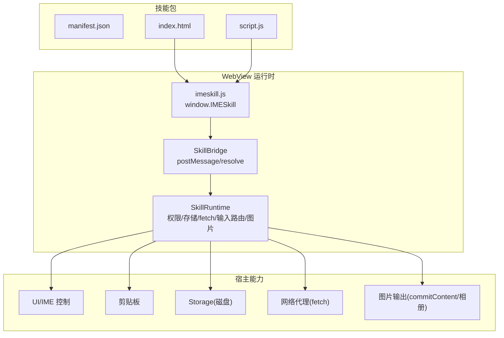
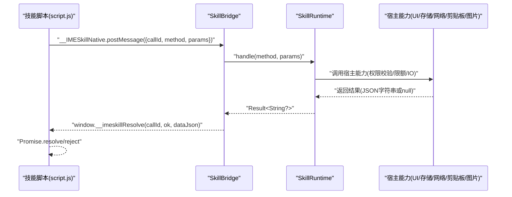
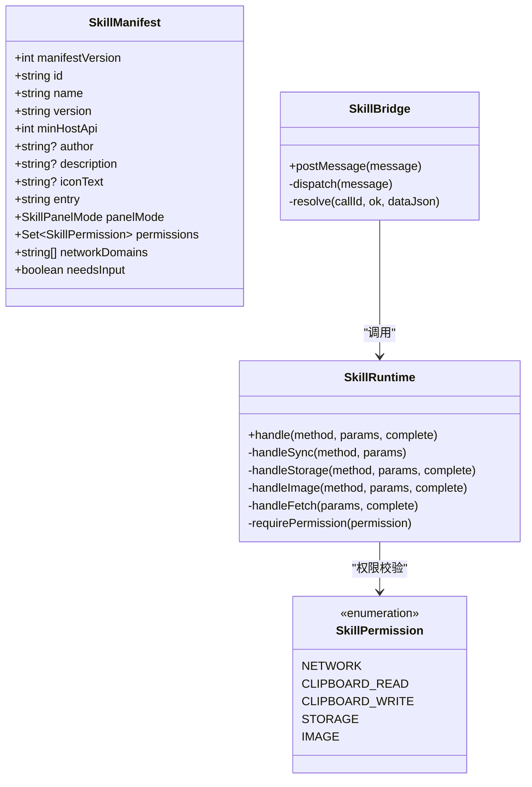
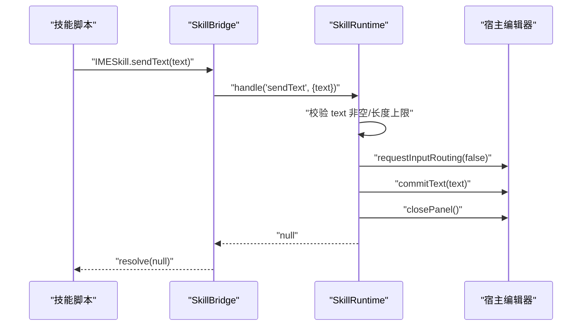
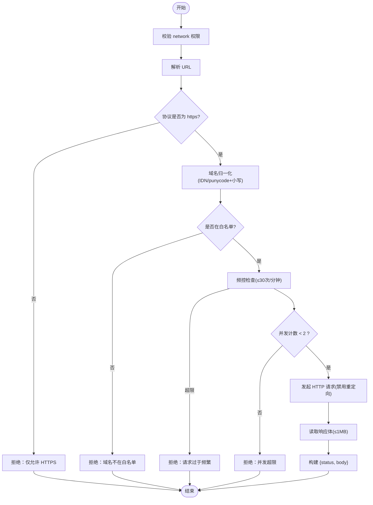
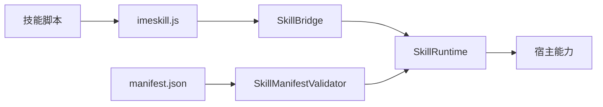

# 开发指南

<cite>
**本文引用的文件**   
- [app/src/main/assets/skill_runtime/imeskill.js](file://app/src/main/assets/skill_runtime/imeskill.js)
- [skills-dev/com.user.constellation/manifest.json](file://skills-dev/com.user.constellation/manifest.json)
- [skills-dev/com.user.constellation/index.html](file://skills-dev/com.user.constellation/index.html)
- [skills-dev/com.user.constellation/script.js](file://skills-dev/com.user.constellation/script.js)
- [core-logic/src/main/java/com/ziyou/ime/core/skill/SkillManifest.kt](file://core-logic/src/main/java/com/ziyou/ime/core/skill/SkillManifest.kt)
- [core-logic/src/main/java/com/ziyou/ime/core/skill/SkillPermission.kt](file://core-logic/src/main/java/com/ziyou/ime/core/skill/SkillPermission.kt)
- [core-logic/src/main/java/com/ziyou/ime/core/skill/SkillManifestValidator.kt](file://core-logic/src/main/java/com/ziyou/ime/core/skill/SkillManifestValidator.kt)
- [app/src/main/java/com/ziyou/ime/skill/SkillRuntime.kt](file://app/src/main/java/com/ziyou/ime/skill/SkillRuntime.kt)
- [app/src/main/java/com/ziyou/ime/skill/SkillBridge.kt](file://app/src/main/java/com/ziyou/ime/skill/SkillBridge.kt)
- [app/src/main/java/com/ziyou/ime/skill/SkillManager.kt](file://app/src/main/java/com/ziyou/ime/skill/SkillManager.kt)
- [app/src/main/assets/skills/calculator/manifest.json](file://app/src/main/assets/skills/calculator/manifest.json)
- [app/src/main/assets/skills/weather/manifest.json](file://app/src/main/assets/skills/weather/manifest.json)
- [app/src/main/assets/skills/calculator/index.html](file://app/src/main/assets/skills/calculator/index.html)
- [app/src/main/assets/skills/weather/index.html](file://app/src/main/assets/skills/weather/index.html)
</cite>

## 目录
1. [简介](#简介)
2. [项目结构](#项目结构)
3. [核心组件](#核心组件)
4. [架构总览](#架构总览)
5. [详细组件分析](#详细组件分析)
6. [依赖关系分析](#依赖关系分析)
7. [性能考量](#性能考量)
8. [故障排查指南](#故障排查指南)
9. [结论](#结论)
10. [附录：完整开发流程与示例](#附录完整开发流程与示例)

## 简介
本指南面向希望为输入法技能系统开发 JavaScript 插件的开发者。内容涵盖：
- 插件目录结构与 manifest.json 字段规范（id、name、version、permissions、needs_input 等）
- JavaScript API 使用方式（IMESkill.sendText、getContext、storage、fetch、input 路由等）
- 从初始化到打包发布的完整开发流程
- 基于 skills-dev 星座插件的逐步讲解，演示 needs_input 模式与输入路由
- 调试技巧（Chrome DevTools 远程调试、日志输出、错误排查）

## 项目结构
技能插件以“包”为单位组织在 assets/skills/<id>/ 或用户安装目录 files/skills/<id>/ 下，每个包包含：
- manifest.json：元数据与权限声明
- index.html：入口页面
- script.js：业务逻辑脚本（可内联于 HTML）
- 其他静态资源（图片、样式等）

宿主侧关键运行时：
- imeskill.js：注入到 WebView 的 Bridge 垫片，暴露 window.IMESkill
- SkillBridge：JS 桥单入口，负责消息分发与线程切换
- SkillRuntime：能力实现层（权限校验、存储限额、网络代理、剪贴板、输入路由、图片输出）
- SkillManager：枚举内置与已安装技能，提供资源读取统一入口

**图表来源** 
- [app/src/main/assets/skill_runtime/imeskill.js:1-164](file://app/src/main/assets/skill_runtime/imeskill.js#L1-L164)
- [app/src/main/java/com/ziyou/ime/skill/SkillBridge.kt:1-99](file://app/src/main/java/com/ziyou/ime/skill/SkillBridge.kt#L1-L99)
- [app/src/main/java/com/ziyou/ime/skill/SkillRuntime.kt:1-521](file://app/src/main/java/com/ziyou/ime/skill/SkillRuntime.kt#L1-L521)

**章节来源**
- [app/src/main/java/com/ziyou/ime/skill/SkillManager.kt:1-110](file://app/src/main/java/com/ziyou/ime/skill/SkillManager.kt#L1-L110)

## 核心组件
- manifest.json：定义技能标识、名称、版本、最低宿主 API 版本、面板模式、是否需要输入路由、权限与域名白名单等
- SkillManifest / SkillPermission / SkillManifestValidator：解析与校验 manifest，确保安全性与兼容性
- imeskill.js：向技能脚本暴露 IMESkill 对象，封装所有异步调用并返回 Promise
- SkillBridge：将 JS 调用转发至 SkillRuntime，保证主线程安全与异常隔离
- SkillRuntime：实现 sendText、getContext、getLocale、haptic、ui.*、clipboard.*、storage.*、image.*、input.*、fetch 等能力，并进行权限与限额校验

**章节来源**
- [core-logic/src/main/java/com/ziyou/ime/core/skill/SkillManifest.kt:1-51](file://core-logic/src/main/java/com/ziyou/ime/core/skill/SkillManifest.kt#L1-L51)
- [core-logic/src/main/java/com/ziyou/ime/core/skill/SkillPermission.kt:1-27](file://core-logic/src/main/java/com/ziyou/ime/core/skill/SkillPermission.kt#L1-L27)
- [core-logic/src/main/java/com/ziyou/ime/core/skill/SkillManifestValidator.kt:1-78](file://core-logic/src/main/java/com/ziyou/ime/core/skill/SkillManifestValidator.kt#L1-L78)
- [app/src/main/assets/skill_runtime/imeskill.js:1-164](file://app/src/main/assets/skill_runtime/imeskill.js#L1-L164)
- [app/src/main/java/com/ziyou/ime/skill/SkillBridge.kt:1-99](file://app/src/main/java/com/ziyou/ime/skill/SkillBridge.kt#L1-L99)
- [app/src/main/java/com/ziyou/ime/skill/SkillRuntime.kt:1-521](file://app/src/main/java/com/ziyou/ime/skill/SkillRuntime.kt#L1-L521)

## 架构总览
技能运行时的端到端调用链如下：
- 技能脚本通过 IMEShell 调用方法
- Bridge 接收 postMessage，解析 callId/method/params
- Runtime 执行具体能力（含权限检查、限额控制、IO 协程）
- 结果经 __imeskillResolve 回传，Promise resolve/reject

**图表来源** 
- [app/src/main/assets/skill_runtime/imeskill.js:1-164](file://app/src/main/assets/skill_runtime/imeskill.js#L1-L164)
- [app/src/main/java/com/ziyou/ime/skill/SkillBridge.kt:1-99](file://app/src/main/java/com/ziyou/ime/skill/SkillBridge.kt#L1-L99)
- [app/src/main/java/com/ziyou/ime/skill/SkillRuntime.kt:1-521](file://app/src/main/java/com/ziyou/ime/skill/SkillRuntime.kt#L1-L521)

## 详细组件分析

### manifest.json 字段说明与约束
- manifest_version：当前仅支持 1
- id：反向域名风格，至少两段，小写字母开头，长度上限 100
- name：展示名称，非空且不超过 30 字符
- version：数字点分格式（如 1.0.0）
- min_host_api：最低宿主 API 版本，需小于等于宿主 HOST_API_VERSION（当前 4）
- author/description/icon_text：可选
- entry：入口 HTML 路径，必须为 .html 且相对安全路径
- panel_mode：embed 或 card
- permissions：权限集合（network、clipboard_read、clipboard_write、storage、image）
- network_domains：当声明 network 权限时允许非空，最多 10 个，精确匹配（IDN/punycode 归一化后比对）
- needs_input：是否启用面板内文本输入路由（Phase 3），true 时宿主以分栏布局打开技能

校验规则由 SkillManifestValidator 实现，非法字段将导致加载失败。

**章节来源**
- [core-logic/src/main/java/com/ziyou/ime/core/skill/SkillManifestValidator.kt:1-78](file://core-logic/src/main/java/com/ziyou/ime/core/skill/SkillManifestValidator.kt#L1-L78)
- [core-logic/src/main/java/com/ziyou/ime/core/skill/SkillManifest.kt:1-51](file://core-logic/src/main/java/com/ziyou/ime/core/skill/SkillManifest.kt#L1-L51)
- [core-logic/src/main/java/com/ziyou/ime/core/skill/SkillPermission.kt:1-27](file://core-logic/src/main/java/com/ziyou/ime/core/skill/SkillPermission.kt#L1-L27)
- [skills-dev/com.user.constellation/manifest.json:1-15](file://skills-dev/com.user.constellation/manifest.json#L1-L15)
- [app/src/main/assets/skills/calculator/manifest.json:1-14](file://app/src/main/assets/skills/calculator/manifest.json#L1-L14)
- [app/src/main/assets/skills/weather/manifest.json:1-16](file://app/src/main/assets/skills/weather/manifest.json#L1-L16)

### JavaScript API 详解（IMESkill）
- sendText(text)：将文本直接上屏到当前应用编辑框，并自动关闭面板；若输入路由仍激活会先复位路由
- getContext()：返回 {packageName, inputType}
- getLocale()：返回系统语言 BCP 47（如 zh-CN）
- haptic()：触发震动反馈
- storage.get/set/remove(key, value?)：轻量 KV 持久化，每技能独立 JSON 文件，序列化后上限 1MB
- ui.setTitle(title)、ui.close()、ui.setExpanded(expanded)、ui.setPanelHeight(ratio)：面板标题、关闭、展开/收缩、高度比例（ratio 钳制到 [0.4, 1.2]）
- clipboard.read/write(text)：读/写剪贴板，需对应权限
- fetch(url, options)：宿主代理网络请求，强制 HTTPS + 白名单 + 超时/响应大小限制 + 频控/并发限制；返回 {status, body}
- image.send(base64)、image.saveToGallery(base64)：发送 PNG 图片或保存到相册（API v3，需 image 权限）
- input.requestFocus(fieldId)、input.releaseFocus()：面板内输入路由（需 needs_input），键盘上屏文本注入指定元素

注意：所有 API 均返回 Promise；错误通过 reject 抛出 Error，message 来自宿主 SkillApiException。

**章节来源**
- [app/src/main/assets/skill_runtime/imeskill.js:1-164](file://app/src/main/assets/skill_runtime/imeskill.js#L1-L164)
- [app/src/main/java/com/ziyou/ime/skill/SkillRuntime.kt:1-521](file://app/src/main/java/com/ziyou/ime/skill/SkillRuntime.kt#L1-L521)

### 输入路由与 needs_input 模式
- 当 manifest.needs_input = true 时，宿主以分栏布局打开技能：面板在上、键盘在下保持可用
- 脚本调用 requestFocus('fieldId') 后，宿主把键盘上屏文本（含中文候选）注入指定 id 的 input/textarea
- releaseFocus() 恢复直达宿主应用编辑框
- setExpanded(false) 可在查询完成后收缩整个输入法界面（键盘/编码区/候选区缩回），面板接管空间展示长内容；再次 requestFocus 会自动恢复

星座与天气示例展示了完整的输入路由与结果展示流程。

**章节来源**
- [skills-dev/com.user.constellation/index.html:1-68](file://skills-dev/com.user.constellation/index.html#L1-L68)
- [skills-dev/com.user.constellation/script.js:1-220](file://skills-dev/com.user.constellation/script.js#L1-L220)
- [app/src/main/assets/skills/weather/index.html:1-125](file://app/src/main/assets/skills/weather/index.html#L1-L125)
- [app/src/main/java/com/ziyou/ime/skill/SkillRuntime.kt:1-521](file://app/src/main/java/com/ziyou/ime/skill/SkillRuntime.kt#L1-L521)

### 类图：运行时核心类型

**图表来源** 
- [core-logic/src/main/java/com/ziyou/ime/core/skill/SkillManifest.kt:1-51](file://core-logic/src/main/java/com/ziyou/ime/core/skill/SkillManifest.kt#L1-L51)
- [core-logic/src/main/java/com/ziyou/ime/core/skill/SkillPermission.kt:1-27](file://core-logic/src/main/java/com/ziyou/ime/core/skill/SkillPermission.kt#L1-L27)
- [app/src/main/java/com/ziyou/ime/skill/SkillRuntime.kt:1-521](file://app/src/main/java/com/ziyou/ime/skill/SkillRuntime.kt#L1-L521)
- [app/src/main/java/com/ziyou/ime/skill/SkillBridge.kt:1-99](file://app/src/main/java/com/ziyou/ime/skill/SkillBridge.kt#L1-L99)

### 序列图：sendText 调用流程

**图表来源** 
- [app/src/main/assets/skill_runtime/imeskill.js:1-164](file://app/src/main/assets/skill_runtime/imeskill.js#L1-L164)
- [app/src/main/java/com/ziyou/ime/skill/SkillBridge.kt:1-99](file://app/src/main/java/com/ziyou/ime/skill/SkillBridge.kt#L1-L99)
- [app/src/main/java/com/ziyou/ime/skill/SkillRuntime.kt:1-521](file://app/src/main/java/com/ziyou/ime/skill/SkillRuntime.kt#L1-L521)

### 流程图：fetch 代理处理

**图表来源** 
- [app/src/main/java/com/ziyou/ime/skill/SkillRuntime.kt:1-521](file://app/src/main/java/com/ziyou/ime/skill/SkillRuntime.kt#L1-L521)

## 依赖关系分析
- 技能脚本依赖 imeskill.js 暴露的 IMESkill
- Bridge 依赖 Runtime 实现能力
- Runtime 依赖宿主能力接口（提交文本、剪贴板、存储、网络、图片）
- Manifest 解析与校验贯穿安装与加载阶段

**图表来源** 
- [app/src/main/assets/skill_runtime/imeskill.js:1-164](file://app/src/main/assets/skill_runtime/imeskill.js#L1-L164)
- [app/src/main/java/com/ziyou/ime/skill/SkillBridge.kt:1-99](file://app/src/main/java/com/ziyou/ime/skill/SkillBridge.kt#L1-L99)
- [app/src/main/java/com/ziyou/ime/skill/SkillRuntime.kt:1-521](file://app/src/main/java/com/ziyou/ime/skill/SkillRuntime.kt#L1-L521)
- [core-logic/src/main/java/com/ziyou/ime/core/skill/SkillManifestValidator.kt:1-78](file://core-logic/src/main/java/com/ziyou/ime/core/skill/SkillManifestValidator.kt#L1-L78)

## 性能考量
- storage 使用单并发 IO 调度器，保证写入顺序与避免竞争
- fetch 限流：超时 10s、响应 ≤1MB、每分钟 ≤30 次、并发 ≤2
- sendText 单次长度上限 5000 字符，防止超长文本注入
- 图片输出仅接受 PNG，带魔数校验，避免伪造 MIME
- Bridge 单条消息上限 512KB，避免拖垮主线程

[本节为通用指导，不直接分析具体文件]

## 故障排查指南
- 权限拒绝：确认 manifest.permissions 包含所需权限（如 storage、network、image）
- 域名白名单：fetch 仅允许白名单域名，且需 HTTPS；检查 normalizeHost 后的匹配
- 输入路由不可用：确保 manifest.needs_input = true，并在点击输入框后调用 requestFocus
- 存储超限：单技能 storage 序列化后 ≤1MB，避免过大值
- 图片失败：确保 base64 为 PNG，必要时降分辨率；Android 10+ 才支持保存到相册
- 日志定位：查看 Bridge/Runtime 的 Log 输出，关注 SkillApiException 的 message

**章节来源**
- [app/src/main/java/com/ziyou/ime/skill/SkillRuntime.kt:1-521](file://app/src/main/java/com/ziyou/ime/skill/SkillRuntime.kt#L1-L521)
- [app/src/main/java/com/ziyou/ime/skill/SkillBridge.kt:1-99](file://app/src/main/java/com/ziyou/ime/skill/SkillBridge.kt#L1-L99)

## 结论
本指南系统化阐述了技能插件的开发规范与运行时机制。通过 manifest 声明、Bridge 通信与 Runtime 能力实现，技能可以在安全的沙箱环境中与宿主交互。遵循权限与限额策略，结合 needs_input 输入路由与丰富的 IMESkill API，可实现高效、稳定的输入法增强功能。

[本节为总结性内容，不直接分析具体文件]

## 附录：完整开发流程与示例

### 开发流程步骤
1. 创建插件目录：assets/skills/<your.id>/ 或 files/skills/<your.id>/
2. 编写 manifest.json：填写 id、name、version、min_host_api、panel_mode、permissions、network_domains（如需）、entry、icon_text、author、description、needs_input（如需）
3. 编写 index.html：设置 CSP、viewport、基础样式与 DOM
4. 编写 script.js：使用 IMESkill API 实现业务逻辑（sendText、getContext、storage、fetch、input 路由、ui 控制等）
5. 本地验证：在输入法中打开技能面板，测试各功能与权限
6. 打包发布：将目录放入 assets/skills/（内置）或 files/skills/（用户安装）

### 基于星座插件的逐步讲解（needs_input 模式）
- manifest 声明 needs_input=true 与 storage 权限
- index.html 提供输入框与结果区，CSP 禁止 connect-src
- script.js：
  - 点击输入框调用 IMESkill.input.requestFocus('sign-input')，开启输入路由
  - 查询成功后调用 IMESkill.ui.setExpanded(false) 收缩输入法界面，面板接管空间
  - 使用 IMESkill.storage 保存最近 5 条历史
  - 点击发送按钮调用 IMESkill.sendText(currentText) 上屏并收起面板

**章节来源**
- [skills-dev/com.user.constellation/manifest.json:1-15](file://skills-dev/com.user.constellation/manifest.json#L1-L15)
- [skills-dev/com.user.constellation/index.html:1-68](file://skills-dev/com.user.constellation/index.html#L1-L68)
- [skills-dev/com.user.constellation/script.js:1-220](file://skills-dev/com.user.constellation/script.js#L1-L220)

### 调试技巧
- Chrome DevTools 远程调试：启用 Android WebView 调试，连接设备后在 chrome://inspect 中选择目标 WebView
- 日志输出：在 script.js 中使用 console.log（可通过 inspect 查看）；宿主侧查看 Logcat 中的 SkillBridge/SkillRuntime 日志
- 错误排查：捕获 Promise.reject 的 message，对照权限与白名单配置；检查 manifest 校验错误信息

[本节为通用指导，不直接分析具体文件]

### 参考示例：计算器与天气
- 计算器：无网络权限，纯本地计算，演示 sendText 上屏与 haptic 反馈
- 天气：声明 network 与 storage 权限，使用 fetch 代理访问 wttr.in，演示输入路由与结果发送

**章节来源**
- [app/src/main/assets/skills/calculator/index.html:1-202](file://app/src/main/assets/skills/calculator/index.html#L1-L202)
- [app/src/main/assets/skills/weather/index.html:1-125](file://app/src/main/assets/skills/weather/index.html#L1-L125)
- [app/src/main/assets/skills/calculator/manifest.json:1-14](file://app/src/main/assets/skills/calculator/manifest.json#L1-L14)
- [app/src/main/assets/skills/weather/manifest.json:1-16](file://app/src/main/assets/skills/weather/manifest.json#L1-L16)