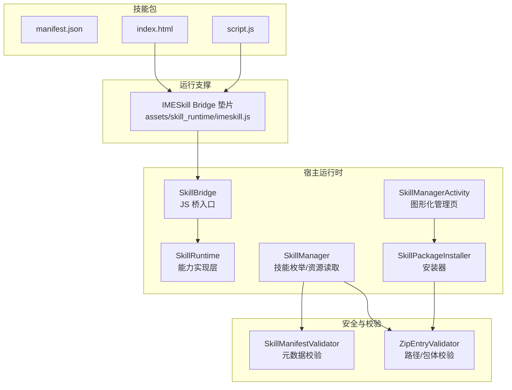
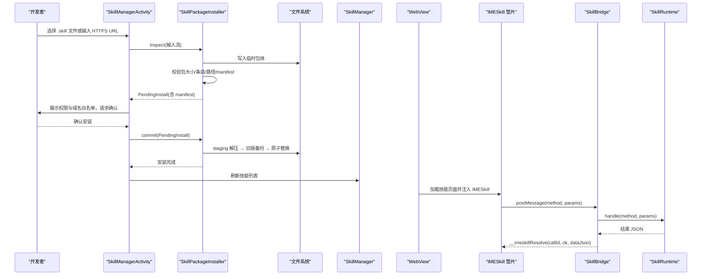
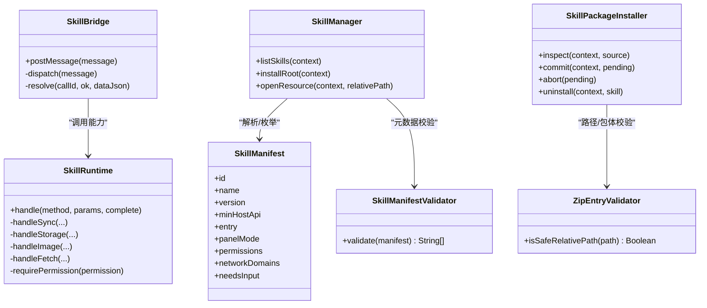

# 开发流程

<cite>
**本文引用的文件**   
- [manifest.json](file://skills-dev/com.user.constellation/manifest.json)
- [index.html](file://skills-dev/com.user.constellation/index.html)
- [script.js](file://skills-dev/com.user.constellation/script.js)
- [imeskill.js](file://app/src/main/assets/skill_runtime/imeskill.js)
- [SkillManifest.kt](file://core-logic/src/main/java/com/ziyou/ime/core/skill/SkillManifest.kt)
- [SkillManifestValidator.kt](file://core-logic/src/main/java/com/ziyou/ime/core/skill/SkillManifestValidator.kt)
- [ZipEntryValidator.kt](file://core-logic/src/main/java/com/ziyou/ime/core/skill/ZipEntryValidator.kt)
- [SkillManager.kt](file://app/src/main/java/com/ziyou/ime/skill/SkillManager.kt)
- [SkillRuntime.kt](file://app/src/main/java/com/ziyou/ime/skill/SkillRuntime.kt)
- [SkillBridge.kt](file://app/src/main/java/com/ziyou/ime/skill/SkillBridge.kt)
- [SkillPackageInstaller.kt](file://app/src/main/java/com/ziyou/ime/skill/SkillPackageInstaller.kt)
- [SkillManagerActivity.kt](file://app/src/main/java/com/ziyou/ime/ui/SkillManagerActivity.kt)
- [技能插件开发指南.md](file://docs/技能插件开发指南.md)
</cite>

## 目录
1. [简介](#简介)
2. [项目结构](#项目结构)
3. [核心组件](#核心组件)
4. [架构总览](#架构总览)
5. [详细组件分析](#详细组件分析)
6. [依赖关系分析](#依赖关系分析)
7. [性能与限制](#性能与限制)
8. [故障排查](#故障排查)
9. [结论](#结论)
10. [附录：完整开发工作流与最佳实践](#附录完整开发工作流与最佳实践)

## 简介
本指南面向技能插件开发者，覆盖从本地环境搭建、浏览器预调试、真机调试到打包发布的全流程。以 skills-dev 目录中的“星座查询”插件为模板，逐步实现功能；并详细说明如何打包为 .skill 文件，以及通过图形化导入与开发者侧载两种方式安装使用。文档同时给出完整的开发工作流示例与最佳实践建议。

## 项目结构
技能插件采用标准 HTML + JS 的 Web 技术栈，宿主通过 WebView 加载技能页面，并通过 Bridge API 提供能力（文本上屏、存储、网络代理、剪贴板、图片输出、输入路由等）。

图示来源
- [manifest.json:1-15](file://skills-dev/com.user.constellation/manifest.json#L1-L15)
- [index.html:1-68](file://skills-dev/com.user.constellation/index.html#L1-L68)
- [script.js:1-220](file://skills-dev/com.user.constellation/script.js#L1-L220)
- [imeskill.js:1-164](file://app/src/main/assets/skill_runtime/imeskill.js#L1-L164)
- [SkillManifest.kt:1-51](file://core-logic/src/main/java/com/ziyou/ime/core/skill/SkillManifest.kt#L1-L51)
- [SkillManifestValidator.kt:1-78](file://core-logic/src/main/java/com/ziyou/ime/core/skill/SkillManifestValidator.kt#L1-L78)
- [ZipEntryValidator.kt:1-37](file://core-logic/src/main/java/com/ziyou/ime/core/skill/ZipEntryValidator.kt#L1-L37)
- [SkillManager.kt:1-110](file://app/src/main/java/com/ziyou/ime/skill/SkillManager.kt#L1-L110)
- [SkillRuntime.kt:1-521](file://app/src/main/java/com/ziyou/ime/skill/SkillRuntime.kt#L1-L521)
- [SkillBridge.kt:1-99](file://app/src/main/java/com/ziyou/ime/skill/SkillBridge.kt#L1-L99)
- [SkillPackageInstaller.kt:1-194](file://app/src/main/java/com/ziyou/ime/skill/SkillPackageInstaller.kt#L1-L194)
- [SkillManagerActivity.kt:1-285](file://app/src/main/java/com/ziyou/ime/ui/SkillManagerActivity.kt#L1-L285)

章节来源
- [技能插件开发指南.md:1-823](file://docs/技能插件开发指南.md#L1-L823)

## 核心组件
- 技能包与元数据
  - manifest.json：定义 id、名称、版本、权限、入口、面板模式、是否需要输入路由等。
  - index.html / script.js：技能 UI 与逻辑，通过 IMESkill Bridge API 与宿主交互。
- 宿主运行时
  - SkillBridge：JS 桥单入口，统一消息分发与线程切换。
  - SkillRuntime：能力实现层（sendText、storage、fetch、clipboard、image、input 路由、ui 控制等），含权限检查与限额。
  - SkillManager：列举内置与已安装技能，统一资源读取入口。
  - SkillPackageInstaller：两段式安装（inspect → commit），保证原子性与回滚。
  - SkillManagerActivity：图形化管理界面，支持 .skill 文件导入与 URL 导入。
- 安全与校验
  - SkillManifestValidator：校验 manifest 字段合法性。
  - ZipEntryValidator：校验 zip 条目路径安全与包大小/条目数限制。
- 运行支撑
  - imeskill.js：注入到页面的 Bridge 垫片，封装 window.IMESkill 对象。

章节来源
- [SkillManifest.kt:1-51](file://core-logic/src/main/java/com/ziyou/ime/core/skill/SkillManifest.kt#L1-L51)
- [SkillManifestValidator.kt:1-78](file://core-logic/src/main/java/com/ziyou/ime/core/skill/SkillManifestValidator.kt#L1-L78)
- [ZipEntryValidator.kt:1-37](file://core-logic/src/main/java/com/ziyou/ime/core/skill/ZipEntryValidator.kt#L1-L37)
- [SkillManager.kt:1-110](file://app/src/main/java/com/ziyou/ime/skill/SkillManager.kt#L1-L110)
- [SkillRuntime.kt:1-521](file://app/src/main/java/com/ziyou/ime/skill/SkillRuntime.kt#L1-L521)
- [SkillBridge.kt:1-99](file://app/src/main/java/com/ziyou/ime/skill/SkillBridge.kt#L1-L99)
- [SkillPackageInstaller.kt:1-194](file://app/src/main/java/com/ziyou/ime/skill/SkillPackageInstaller.kt#L1-L194)
- [SkillManagerActivity.kt:1-285](file://app/src/main/java/com/ziyou/ime/ui/SkillManagerActivity.kt#L1-L285)
- [imeskill.js:1-164](file://app/src/main/assets/skill_runtime/imeskill.js#L1-L164)

## 架构总览
技能在 WebView 中运行，脚本通过 IMESkill Bridge 调用宿主能力。Bridge 将请求转发给 Runtime 处理，结果异步返回。安装阶段由 Installer 进行包体校验与用户确认，最终解压到内部存储。

图示来源
- [SkillManagerActivity.kt:1-285](file://app/src/main/java/com/ziyou/ime/ui/SkillManagerActivity.kt#L1-L285)
- [SkillPackageInstaller.kt:1-194](file://app/src/main/java/com/ziyou/ime/skill/SkillPackageInstaller.kt#L1-L194)
- [SkillManager.kt:1-110](file://app/src/main/java/com/ziyou/ime/skill/SkillManager.kt#L1-L110)
- [imeskill.js:1-164](file://app/src/main/assets/skill_runtime/imeskill.js#L1-L164)
- [SkillBridge.kt:1-99](file://app/src/main/java/com/ziyou/ime/skill/SkillBridge.kt#L1-L99)
- [SkillRuntime.kt:1-521](file://app/src/main/java/com/ziyou/ime/skill/SkillRuntime.kt#L1-L521)

## 详细组件分析

### 技能包结构与 manifest 规范
- 包结构
  - 根目录包含 manifest.json 与入口 HTML（可带 script.js 与 assets 静态资源）。
  - 所有引用必须为包内相对路径，禁止外链与绝对路径。
- manifest 关键字段
  - id：反向域名风格，唯一标识。
  - name/version/min_host_api：展示名、版本号、最低宿主 API 版本。
  - entry：入口 HTML 路径（必须以 .html 结尾）。
  - panel_mode：embed/card。
  - permissions：声明所需权限（如 storage、network、clipboard_read/write、image）。
  - network_domains：仅 network 权限时允许非空，精确匹配域名。
  - needs_input：true 时启用输入路由与提升挂载布局。

章节来源
- [manifest.json:1-15](file://skills-dev/com.user.constellation/manifest.json#L1-L15)
- [SkillManifest.kt:1-51](file://core-logic/src/main/java/com/ziyou/ime/core/skill/SkillManifest.kt#L1-L51)
- [SkillManifestValidator.kt:1-78](file://core-logic/src/main/java/com/ziyou/ime/core/skill/SkillManifestValidator.kt#L1-L78)

### IMESkill Bridge API 与页面交互
- 全局对象 IMESkill 由宿主注入，所有方法返回 Promise。
- 常用能力
  - sendText(text)：文本上屏并自动关闭面板。
  - ui.setTitle/close/setExpanded/setPanelHeight：面板标题、关闭、展开收缩、高度自定义。
  - storage.get/set/remove：KV 持久化（需 storage 权限，总量 1MB）。
  - fetch(url, options)：网络代理（需 network 权限，强制 HTTPS + 白名单 + 频控）。
  - clipboard.read/write：剪贴板读写（需对应权限）。
  - image.send/saveToGallery：PNG 图片输出（需 image 权限）。
  - input.requestFocus/releaseFocus：面板内输入路由（需 needs_input）。
- 星座示例用法
  - 点击输入框申请路由，键盘文本注入 #sign-input。
  - 查询后 setExpanded(false) 收缩输入法界面，面板接管空间展示长内容。
  - sendText 发送结果并自动收起面板。

章节来源
- [imeskill.js:1-164](file://app/src/main/assets/skill_runtime/imeskill.js#L1-L164)
- [script.js:1-220](file://skills-dev/com.user.constellation/script.js#L1-L220)

### 输入路由与布局形态
- needs_input 技能进入后提升至编码区上方，下方键盘可用。
- requestFocus 后键盘上屏文本注入指定元素；releaseFocus 恢复直达宿主编辑框。
- setExpanded(false) 收缩整个输入法界面，面板接管全部空间；requestFocus 自动恢复。

章节来源
- [SkillRuntime.kt:1-521](file://app/src/main/java/com/ziyou/ime/skill/SkillRuntime.kt#L1-L521)
- [技能插件开发指南.md:1-823](file://docs/技能插件开发指南.md#L1-L823)

### 安装与卸载流程
- 两段式安装
  - inspect：读入包体并全量校验（大小/条目/路径/manifest/冲突），返回待确认事务。
  - commit：解压到 staging → 旧版备份 → 原子替换；失败则回滚。
- 卸载：删除安装目录并清理 storage 数据。
- 图形化管理页
  - 支持 .skill 文件导入与 HTTPS URL 导入。
  - 安装前弹窗展示权限与域名白名单，确认后落盘。

章节来源
- [SkillPackageInstaller.kt:1-194](file://app/src/main/java/com/ziyou/ime/skill/SkillPackageInstaller.kt#L1-L194)
- [SkillManagerActivity.kt:1-285](file://app/src/main/java/com/ziyou/ime/ui/SkillManagerActivity.kt#L1-L285)

### 安全与沙箱机制
- 网络全量拦截：外链不可用，必须走 IMESkill.fetch。
- CSP：禁用 eval/new Function；页面自身 fetch/XHR/WebSocket 被禁。
- 文件系统隔离：仅能访问技能包内资源。
- DOM 存储禁用：localStorage/sessionStorage 不可用，使用 IMESkill.storage。
- 页面跳转封锁：location.href 跳转到外部 URL 会被忽略。
- 崩溃隔离：技能页面崩溃不影响输入法主进程。
- 反钓鱼：宿主角标悬浮于页面之上，无法遮盖。
- 通信限制：Bridge 单条消息 ≤512KB。

章节来源
- [技能插件开发指南.md:1-823](file://docs/技能插件开发指南.md#L1-L823)

## 依赖关系分析
- 组件耦合
  - SkillBridge 依赖 SkillRuntime 与 WebViewProvider。
  - SkillRuntime 依赖 Host 接口（由上层实现）与系统服务（剪贴板、相册等）。
  - SkillManager 依赖 SkillManifestParser 与文件系统/Assets。
  - SkillPackageInstaller 依赖 ZipEntryValidator 与 SkillVersionComparator。
- 外部依赖
  - Android 系统 API（WebView、ClipboardManager、MediaStore）。
  - 协程用于异步 IO（storage/fetch/image）。

图示来源
- [SkillBridge.kt:1-99](file://app/src/main/java/com/ziyou/ime/skill/SkillBridge.kt#L1-L99)
- [SkillRuntime.kt:1-521](file://app/src/main/java/com/ziyou/ime/skill/SkillRuntime.kt#L1-L521)
- [SkillManager.kt:1-110](file://app/src/main/java/com/ziyou/ime/skill/SkillManager.kt#L1-L110)
- [SkillPackageInstaller.kt:1-194](file://app/src/main/java/com/ziyou/ime/skill/SkillPackageInstaller.kt#L1-L194)
- [SkillManifestValidator.kt:1-78](file://core-logic/src/main/java/com/ziyou/ime/core/skill/SkillManifestValidator.kt#L1-L78)
- [ZipEntryValidator.kt:1-37](file://core-logic/src/main/java/com/ziyou/ime/core/skill/ZipEntryValidator.kt#L1-L37)
- [SkillManifest.kt:1-51](file://core-logic/src/main/java/com/ziyou/ime/core/skill/SkillManifest.kt#L1-L51)

## 性能与限制
- 包体上限 5MB，条目数 ≤200，单条目路径长度 ≤255。
- storage 总量 1MB（序列化后），按技能隔离。
- sendText 单次长度上限 5000 字符。
- fetch 超时 10s，响应 ≤1MB，频控 ≤30 次/分钟，并发 ≤2，禁重定向。
- Bridge 单条消息 ≤512KB。
- 图片仅支持 PNG，base64 受消息上限约束，超大图需降分辨率。

章节来源
- [SkillRuntime.kt:1-521](file://app/src/main/java/com/ziyou/ime/skill/SkillRuntime.kt#L1-L521)
- [ZipEntryValidator.kt:1-37](file://core-logic/src/main/java/com/ziyou/ime/core/skill/ZipEntryValidator.kt#L1-L37)
- [技能插件开发指南.md:1-823](file://docs/技能插件开发指南.md#L1-L823)

## 故障排查
- 日志查看
  - logcat 过滤 tag：SkillManager、SkillBridge、SkillRuntime、SkillWebViewFactory、SkillPackageInstaller。
- 常见问题定位
  - manifest 校验失败：检查 id 格式、版本号、entry 后缀、权限与域名白名单一致性。
  - 安装失败：检查包大小/条目数、Zip Slip 路径、同 id 升级规则。
  - 网络请求失败：确认 HTTPS、域名在白名单、频控与并发限制。
  - 输入路由无效：确认 needs_input 声明与 requestFocus/releaseFocus 调用顺序。
  - 图片发送失败：确认编辑器接受 image 类型、PNG 魔数校验、消息大小限制。

章节来源
- [SkillManagerActivity.kt:1-285](file://app/src/main/java/com/ziyou/ime/ui/SkillManagerActivity.kt#L1-L285)
- [SkillPackageInstaller.kt:1-194](file://app/src/main/java/com/ziyou/ime/skill/SkillPackageInstaller.kt#L1-L194)
- [SkillRuntime.kt:1-521](file://app/src/main/java/com/ziyou/ime/skill/SkillRuntime.kt#L1-L521)
- [技能插件开发指南.md:1-823](file://docs/技能插件开发指南.md#L1-L823)

## 结论
本指南基于仓库现有实现，提供了从零到一的技能插件开发全流程说明。通过 skills-dev 中的星座插件模板，开发者可以快速上手；借助图形化导入与开发者侧载两种安装方式，能够高效迭代与验证。遵循安全与性能限制，结合最佳实践，可构建稳定可靠的技能插件。

## 附录：完整开发工作流与最佳实践

### 一、本地开发环境搭建
- 准备技能目录
  - 创建 com.user.constellation/ 目录，包含 manifest.json、index.html、script.js。
- 浏览器预调试
  - 在 index.html 头部添加 mock 垫片模拟 IMESkill（真机上将被宿主注入覆盖）。
  - 使用浏览器打开 index.html，验证 UI 与逻辑。

章节来源
- [技能插件开发指南.md:1-823](file://docs/技能插件开发指南.md#L1-L823)

### 二、基于星座插件模板逐步实现
- 参考 manifest.json 字段配置（id、name、version、min_host_api、entry、panel_mode、permissions、needs_input）。
- 在 script.js 中实现：
  - 输入路由：requestFocus/releaseFocus。
  - 查询与展示：setExpanded(false) 收缩输入法界面，展示长内容。
  - 发送结果：sendText 上屏并自动关闭面板。
  - 历史持久化：storage.set/get 保存最近查询。

章节来源
- [manifest.json:1-15](file://skills-dev/com.user.constellation/manifest.json#L1-L15)
- [script.js:1-220](file://skills-dev/com.user.constellation/script.js#L1-L220)

### 三、真机调试方法
- Chrome DevTools 远程调试
  - 连接手机，打开技能面板进入目标技能。
  - 电脑 Chrome 访问 chrome://inspect/#devices，找到 appassets.androidplatform.net/skill/... 页面 inspect。
- logcat 查看错误
  - adb logcat -s SkillManager SkillBridge SkillRuntime SkillWebViewFactory SkillPackageInstaller

章节来源
- [技能插件开发指南.md:1-823](file://docs/技能插件开发指南.md#L1-L823)

### 四、打包为 .skill 文件
- 在技能目录执行打包命令（确保 manifest.json 在包根）：
  - cd com.user.constellation && zip -r ../constellation.skill . -x '.*'
- 校验要点
  - 包大小 ≤5MB，条目数 ≤200，路径安全，manifest 合法，entry 存在。

章节来源
- [技能插件开发指南.md:1-823](file://docs/技能插件开发指南.md#L1-L823)
- [ZipEntryValidator.kt:1-37](file://core-logic/src/main/java/com/ziyou/ime/core/skill/ZipEntryValidator.kt#L1-L37)

### 五、安装与使用
- 图形化导入（推荐）
  - 设置页 → 技能 → 技能插件 → 导入 .skill 文件或从 HTTPS URL 导入。
  - 安装前弹窗展示权限与域名白名单，确认后落盘。
- 开发者侧载（adb）
  - 推送技能目录到临时区，拷入输入法沙箱 files/skills/<id>/，清理临时区。
  - 重新打开技能面板即可看到新技能。

章节来源
- [SkillManagerActivity.kt:1-285](file://app/src/main/java/com/ziyou/ime/ui/SkillManagerActivity.kt#L1-L285)
- [SkillPackageInstaller.kt:1-194](file://app/src/main/java/com/ziyou/ime/skill/SkillPackageInstaller.kt#L1-L194)
- [技能插件开发指南.md:1-823](file://docs/技能插件开发指南.md#L1-L823)

### 六、最佳实践建议
- 优先使用按钮/预设选项交互，减少 needs_input 的使用（面板更大、交互更短）。
- 所有网络请求走 IMESkill.fetch，严格配置 network_domains。
- 使用 textContent 渲染内容，避免拼接 HTML 导致注入风险。
- 合理拆分大体积资源，必要时分档降分辨率（图片）。
- 对异常分支做降级提示（如 sendText 失败引导存相册）。

章节来源
- [技能插件开发指南.md:1-823](file://docs/技能插件开发指南.md#L1-L823)