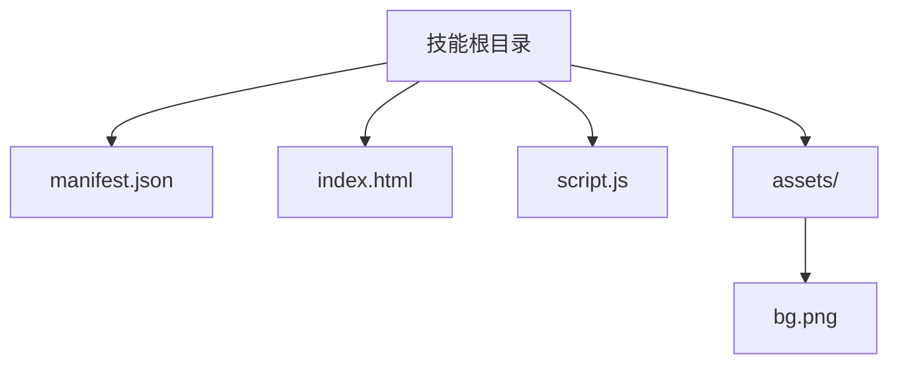
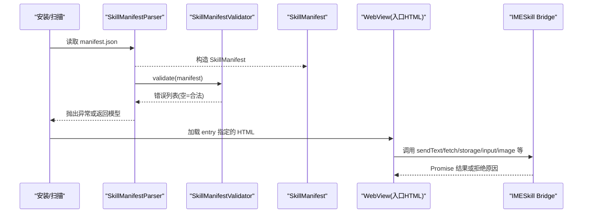
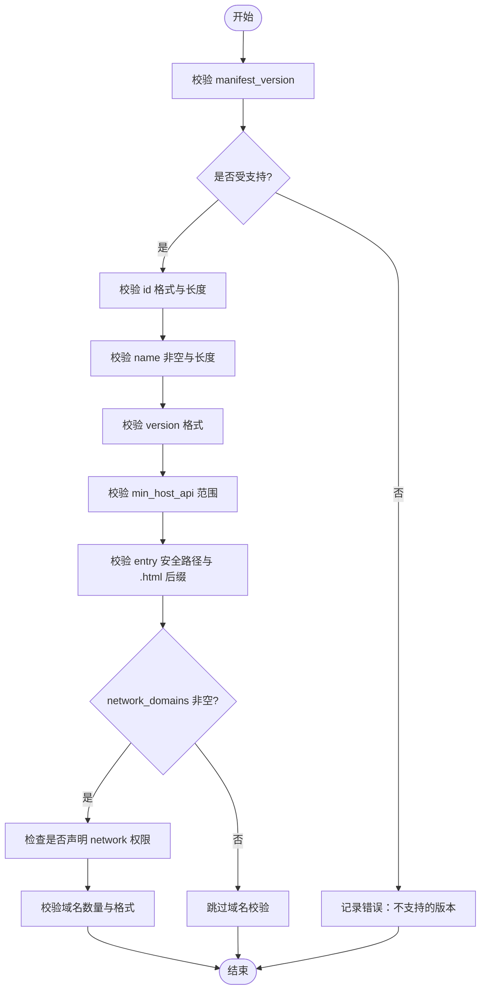
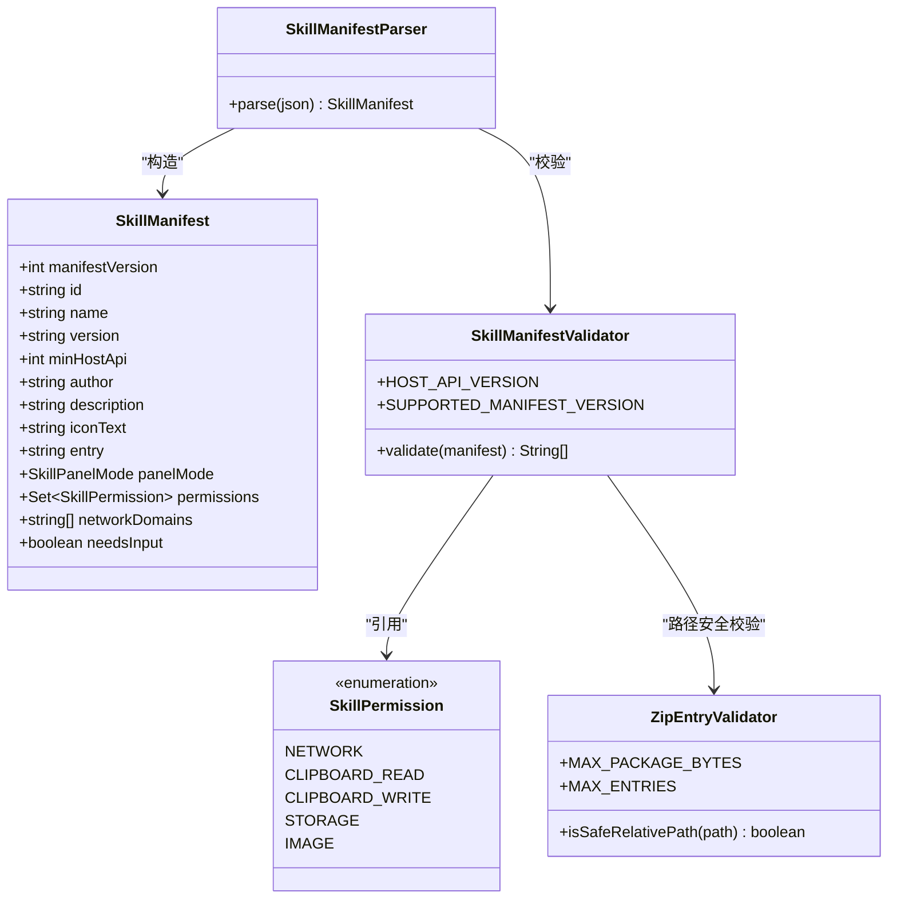

# 插件结构与配置

<cite>
**本文引用的文件**   
- [manifest.json（计算器）](file://app/src/main/assets/skills/calculator/manifest.json)
- [manifest.json（天气）](file://app/src/main/assets/skills/weather/manifest.json)
- [manifest.json（星座，开发示例）](file://skills-dev/com.user.constellation/manifest.json)
- [SkillManifest.kt](file://core-logic/src/main/java/com/ziyou/ime/core/skill/SkillManifest.kt)
- [SkillManifestValidator.kt](file://core-logic/src/main/java/com/ziyou/ime/core/skill/SkillManifestValidator.kt)
- [SkillPermission.kt](file://core-logic/src/main/java/com/ziyou/ime/core/skill/SkillPermission.kt)
- [SkillManifestParser.kt](file://app/src/main/java/com/ziyou/ime/skill/SkillManifestParser.kt)
- [ZipEntryValidator.kt](file://core-logic/src/main/java/com/ziyou/ime/core/skill/ZipEntryValidator.kt)
- [index.html（计算器）](file://app/src/main/assets/skills/calculator/index.html)
- [index.html（天气）](file://app/src/main/assets/skills/weather/index.html)
- [index.html（星座，开发示例）](file://skills-dev/com.user.constellation/index.html)
- [技能插件开发指南.md](file://docs/技能插件开发指南.md)
</cite>

## 目录
1. [简介](#简介)
2. [项目结构](#项目结构)
3. [核心组件](#核心组件)
4. [架构总览](#架构总览)
5. [详细组件分析](#详细组件分析)
6. [依赖关系分析](#依赖关系分析)
7. [性能与限制](#性能与限制)
8. [故障排查](#故障排查)
9. [结论](#结论)
10. [附录：完整 manifest.json 示例](#附录完整-manifestjson-示例)

## 简介
本文件面向技能插件开发者与维护者，系统性说明“技能插件”的包结构、manifest.json 字段规范、校验规则与使用场景，并给出打包约束、常见错误与排错方法。内容基于仓库内实现与官方开发指南整理，确保与实际宿主行为一致。

## 项目结构
一个技能插件是一个目录（分发时打包为 .skill 后缀的 zip），标准结构如下：
- manifest.json：技能元数据（必需）
- index.html：入口 UI 文件（必需，文件名可自定义，由 manifest.entry 指定）
- script.js：逻辑代码（可选，也可直接内联在 html 中）
- assets/：图片等静态资源（可选）

约束要点
- 包大小 ≤ 5MB，条目数 ≤ 200
- 所有路径必须是包内相对路径，禁止 ../、绝对路径、反斜杠等不安全路径
- 页面内引用资源一律用相对路径；外部 URL 会被宿主拦截为空响应

图示来源
- [技能插件开发指南.md](file://docs/技能插件开发指南.md)

章节来源
- [技能插件开发指南.md](file://docs/技能插件开发指南.md)

## 核心组件
- SkillManifest：manifest.json 解析后的纯数据模型，包含 id、name、version、min_host_api、author、description、icon_text、entry、panel_mode、permissions、network_domains、needs_input 等字段。
- SkillManifestValidator：对 SkillManifest 进行字段合法性校验，返回错误列表（空即合法）。
- SkillPermission：权限枚举，定义 network、clipboard_read、clipboard_write、storage、image 等。
- SkillManifestParser：将 JSON 文本解析为 SkillManifest，并调用校验器统一校验。
- ZipEntryValidator：.skill 包解压前逐条目安全校验（防 Zip Slip），以及包大小、条目数上限。

章节来源
- [SkillManifest.kt](file://core-logic/src/main/java/com/ziyou/ime/core/skill/SkillManifest.kt)
- [SkillManifestValidator.kt](file://core-logic/src/main/java/com/ziyou/ime/core/skill/SkillManifestValidator.kt)
- [SkillPermission.kt](file://core-logic/src/main/java/com/ziyou/ime/core/skill/SkillPermission.kt)
- [SkillManifestParser.kt](file://app/src/main/java/com/ziyou/ime/skill/SkillManifestParser.kt)
- [ZipEntryValidator.kt](file://core-logic/src/main/java/com/ziyou/ime/core/skill/ZipEntryValidator.kt)

## 架构总览
技能加载与校验的关键流程：
- 安装或扫描技能包时，读取 manifest.json，解析为 SkillManifest
- 通过 SkillManifestValidator 进行字段合法性校验
- 校验通过后进入运行期，WebView 加载 entry 指定的 HTML
- 运行时通过 IMESkill Bridge API 与宿主交互（网络、存储、剪贴板、输入路由、图片输出等）

图示来源
- [SkillManifestParser.kt](file://app/src/main/java/com/ziyou/ime/skill/SkillManifestParser.kt)
- [SkillManifestValidator.kt](file://core-logic/src/main/java/com/ziyou/ime/core/skill/SkillManifestValidator.kt)
- [SkillManifest.kt](file://core-logic/src/main/java/com/ziyou/ime/core/skill/SkillManifest.kt)

## 详细组件分析

### 包结构与文件职责
- manifest.json：声明技能元数据、权限、网络白名单、面板模式、是否需要输入路由等
- index.html：技能 UI 入口，遵循 CSP 沙箱，仅允许自域资源与内联脚本
- script.js：业务逻辑（可选，也可内联到 HTML）
- assets/：静态资源（图片等），必须通过相对路径引用

章节来源
- [技能插件开发指南.md](file://docs/技能插件开发指南.md)
- [index.html（计算器）](file://app/src/main/assets/skills/calculator/index.html)
- [index.html（天气）](file://app/src/main/assets/skills/weather/index.html)
- [index.html（星座，开发示例）](file://skills-dev/com.user.constellation/index.html)

### manifest.json 字段详解与校验规则
字段含义与规则（结合解析与校验实现）：
- manifest_version：当前仅支持 1
- id：反向域名风格，至少两段，小写字母开头，可含数字/下划线，长度≤100
- name：展示名，非空且≤30字符
- version：数字点分（如 1 / 1.0 / 1.0.0），不支持字母后缀
- min_host_api：最低宿主 API 版本，需≤宿主当前版本（v4）
- author/description/icon_text：可选，用于展示信息
- entry：入口文件路径，必须以 .html 结尾，且为安全相对路径
- panel_mode：embed（工具嵌入）或 card（信息卡片）
- permissions：权限数组，仅限 network、clipboard_read、clipboard_write、storage、image
- network_domains：域名白名单（≤10个），仅当声明 network 权限时允许非空；只写域名（不含协议/路径/通配符）
- needs_input：true 时开启面板内输入路由（提升挂载至编码区上方）

校验逻辑关键点
- manifest_version 必须等于受支持版本
- id/name/version 格式与长度限制
- min_host_api 范围检查
- entry 安全路径与 .html 后缀
- network_domains 非空时必须声明 network 权限
- domain 白名单数量与格式校验

图示来源
- [SkillManifestValidator.kt](file://core-logic/src/main/java/com/ziyou/ime/core/skill/SkillManifestValidator.kt)

章节来源
- [SkillManifestValidator.kt](file://core-logic/src/main/java/com/ziyou/ime/core/skill/SkillManifestValidator.kt)
- [SkillManifest.kt](file://core-logic/src/main/java/com/ziyou/ime/core/skill/SkillManifest.kt)
- [SkillPermission.kt](file://core-logic/src/main/java/com/ziyou/ime/core/skill/SkillPermission.kt)
- [SkillManifestParser.kt](file://app/src/main/java/com/ziyou/ime/skill/SkillManifestParser.kt)

### 权限模型与使用场景
- storage：轻量 KV 持久化，每技能隔离，总量限额（约 1MB）
- network：经宿主代理的网络请求，配合 network_domains 白名单
- clipboard_read/clipboard_write：读/写剪贴板
- image：图片输出（send/saveToGallery），仅 PNG，消息体上限约束

使用建议
- 能不用权限就不用；优先按钮/预设选项交互
- 需要自由文本输入再启用 needs_input + input 路由
- 网络请求务必走 IMESkill.fetch，避免直接 fetch/XHR

章节来源
- [SkillPermission.kt](file://core-logic/src/main/java/com/ziyou/ime/core/skill/SkillPermission.kt)
- [技能插件开发指南.md](file://docs/技能插件开发指南.md)

### 面板形态与输入路由
- embed：工具嵌入，默认覆盖键盘区域
- card：信息卡片，点击结果上屏后收起面板
- needs_input：true 时提升至编码区上方，配合 input.requestFocus 实现面板内打字

章节来源
- [SkillManifest.kt](file://core-logic/src/main/java/com/ziyou/ime/core/skill/SkillManifest.kt)
- [技能插件开发指南.md](file://docs/技能插件开发指南.md)

### 示例 manifest.json 对比
- 计算器：无权限、embed 模式
- 天气：network + storage 权限、card 模式、域名白名单
- 星座：needs_input + storage 权限、embed 模式

章节来源
- [manifest.json（计算器）](file://app/src/main/assets/skills/calculator/manifest.json)
- [manifest.json（天气）](file://app/src/main/assets/skills/weather/manifest.json)
- [manifest.json（星座，开发示例）](file://skills-dev/com.user.constellation/manifest.json)

## 依赖关系分析
- app 层解析 manifest.json 并调用 core-logic 校验器
- core-logic 提供纯逻辑模型与校验，不依赖 Android/JSON 库
- ZipEntryValidator 同时用于安装阶段与资源访问阶段的安全校验

图示来源
- [SkillManifest.kt](file://core-logic/src/main/java/com/ziyou/ime/core/skill/SkillManifest.kt)
- [SkillPermission.kt](file://core-logic/src/main/java/com/ziyou/ime/core/skill/SkillPermission.kt)
- [SkillManifestValidator.kt](file://core-logic/src/main/java/com/ziyou/ime/core/skill/SkillManifestValidator.kt)
- [SkillManifestParser.kt](file://app/src/main/java/com/ziyou/ime/skill/SkillManifestParser.kt)
- [ZipEntryValidator.kt](file://core-logic/src/main/java/com/ziyou/ime/core/skill/ZipEntryValidator.kt)

章节来源
- [SkillManifest.kt](file://core-logic/src/main/java/com/ziyou/ime/core/skill/SkillManifest.kt)
- [SkillManifestValidator.kt](file://core-logic/src/main/java/com/ziyou/ime/core/skill/SkillManifestValidator.kt)
- [SkillPermission.kt](file://core-logic/src/main/java/com/ziyou/ime/core/skill/SkillPermission.kt)
- [SkillManifestParser.kt](file://app/src/main/java/com/ziyou/ime/skill/SkillManifestParser.kt)
- [ZipEntryValidator.kt](file://core-logic/src/main/java/com/ziyou/ime/core/skill/ZipEntryValidator.kt)

## 性能与限制
- 包大小 ≤ 5MB，条目数 ≤ 200（安装与解压阶段严格校验）
- 单条 Bridge 消息 ≤ 512KB（影响图片 base64 传输）
- 网络频控 ≤ 30 次/分钟，并发 ≤ 2，超时 10s，响应 ≤ 1MB
- storage 总量限额约 1MB（序列化后）
- CSP 禁用 eval/new Function，外链 CDN 不可用

章节来源
- [技能插件开发指南.md](file://docs/技能插件开发指南.md)
- [ZipEntryValidator.kt](file://core-logic/src/main/java/com/ziyou/ime/core/skill/ZipEntryValidator.kt)

## 故障排查
常见问题与定位
- manifest 校验失败：查看 logcat tag SkillManager，确认字段格式、权限与域名白名单
- 未知权限 id：整包拒绝，检查 permissions 中的 id 是否在枚举中
- network_domains 未声明 network 权限：校验报错，补充权限
- entry 路径不安全或非 .html：修正路径并确保以 .html 结尾
- 包过大或条目过多：压缩资源、合并文件、减少图片体积
- 网络请求被拒：确认 HTTPS、域名在白名单、未跟随重定向
- 输入路由不可用：确认 needs_input=true，并使用 requestFocus/releaseFocus

章节来源
- [SkillManifestValidator.kt](file://core-logic/src/main/java/com/ziyou/ime/core/skill/SkillManifestValidator.kt)
- [技能插件开发指南.md](file://docs/技能插件开发指南.md)

## 结论
技能插件系统通过严格的 manifest 校验与安全边界（CSP、网络代理、路径安全、权限模型）保障稳定性与安全性。开发者应遵循最小权限原则，合理使用面板形态与输入路由，并遵守包大小与条目数限制，以获得最佳用户体验与兼容性。

## 附录：完整 manifest.json 示例
以下为三个内置/开发示例的 manifest.json 参考（字段与值来源于实际文件）：
- 计算器：无权限、embed 模式
- 天气：network + storage 权限、card 模式、域名白名单
- 星座：needs_input + storage 权限、embed 模式

章节来源
- [manifest.json（计算器）](file://app/src/main/assets/skills/calculator/manifest.json)
- [manifest.json（天气）](file://app/src/main/assets/skills/weather/manifest.json)
- [manifest.json（星座，开发示例）](file://skills-dev/com.user.constellation/manifest.json)