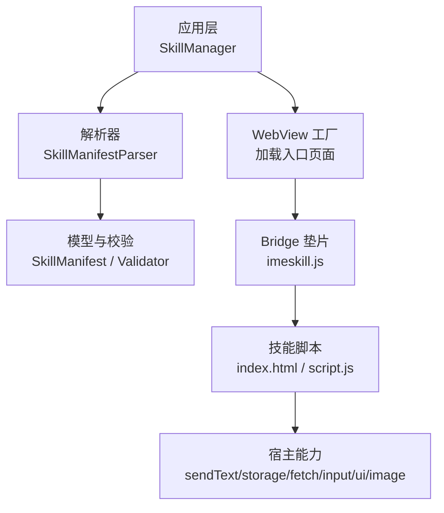
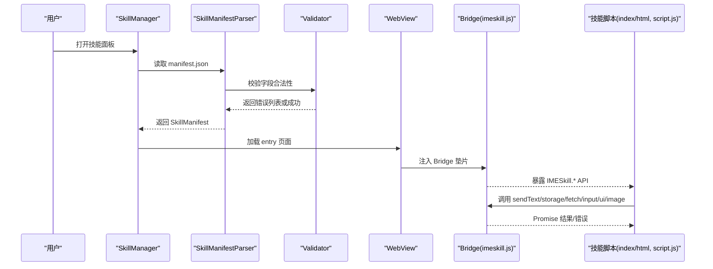
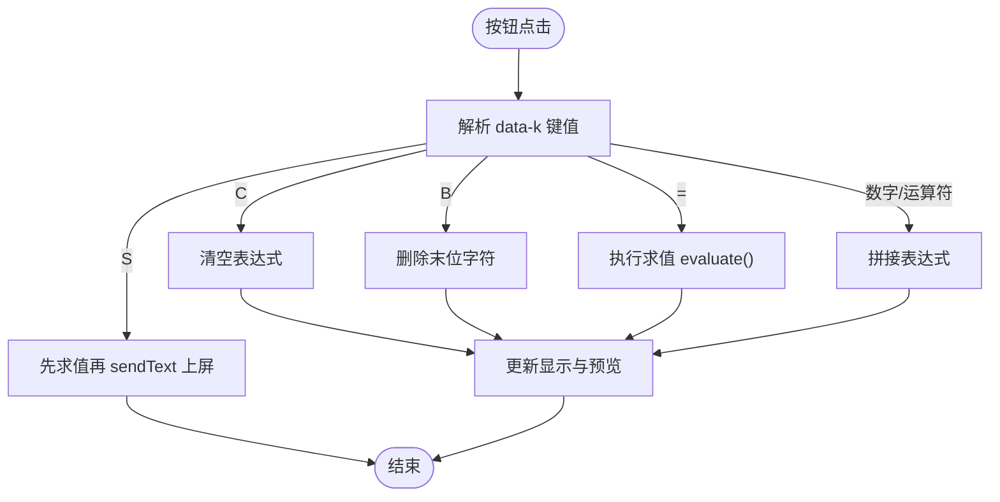
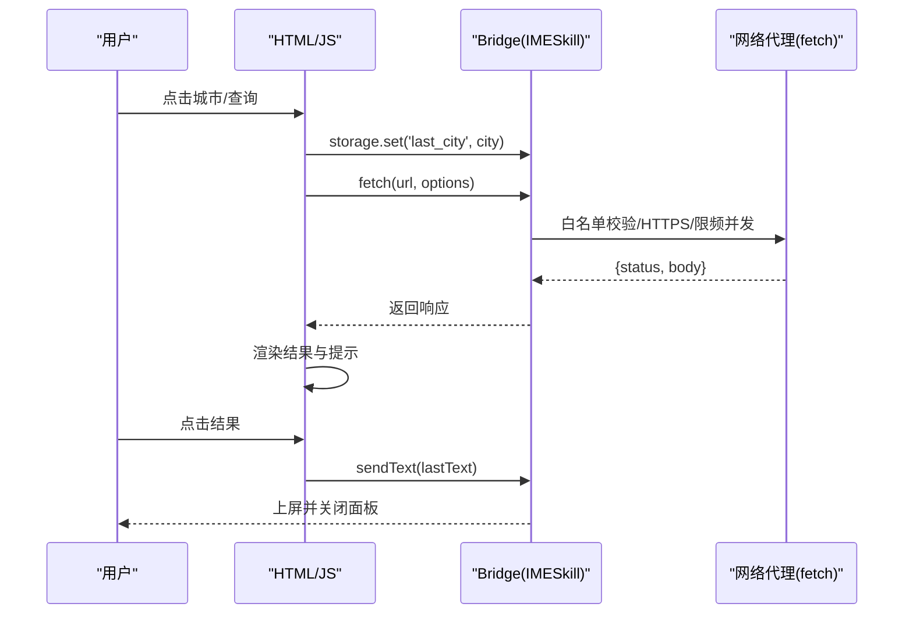
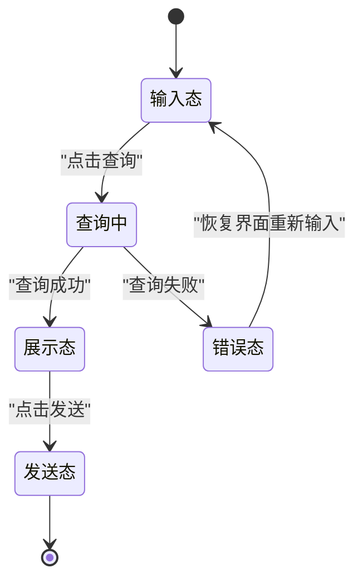
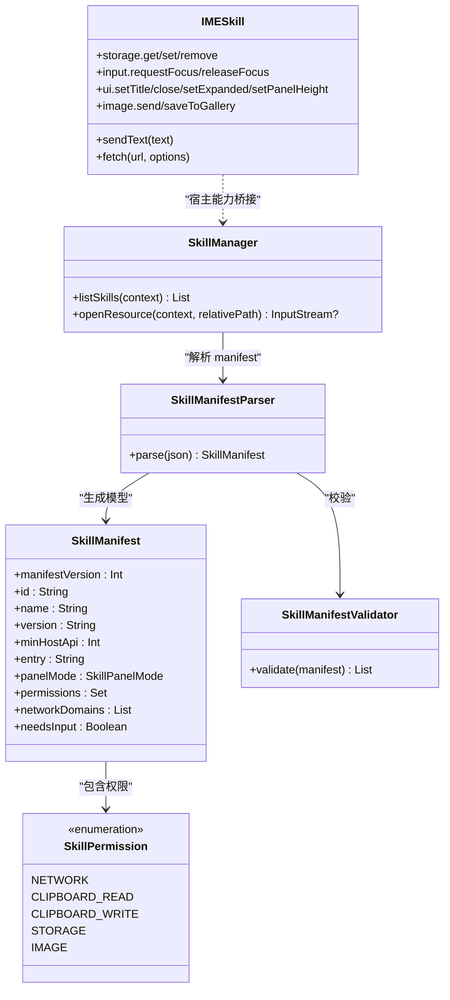

# 示例教程

<cite>
**本文引用的文件**   
- [calculator/manifest.json](file://app/src/main/assets/skills/calculator/manifest.json)
- [calculator/index.html](file://app/src/main/assets/skills/calculator/index.html)
- [weather/manifest.json](file://app/src/main/assets/skills/weather/manifest.json)
- [weather/index.html](file://app/src/main/assets/skills/weather/index.html)
- [constellation/manifest.json](file://skills-dev/com.user.constellation/manifest.json)
- [constellation/index.html](file://skills-dev/com.user.constellation/index.html)
- [constellation/script.js](file://skills-dev/com.user.constellation/script.js)
- [imeskill.js](file://app/src/main/assets/skill_runtime/imeskill.js)
- [SkillManifestParser.kt](file://app/src/main/java/com/ziyou/ime/skill/SkillManifestParser.kt)
- [SkillManifest.kt](file://core-logic/src/main/java/com/ziyou/ime/core/skill/SkillManifest.kt)
- [SkillManager.kt](file://app/src/main/java/com/ziyou/ime/skill/SkillManager.kt)
- [SkillManifestValidator.kt](file://core-logic/src/main/java/com/ziyou/ime/core/skill/SkillManifestValidator.kt)
- [SkillPermission.kt](file://core-logic/src/main/java/com/ziyou/ime/core/skill/SkillPermission.kt)
- [技能插件开发指南.md](file://docs/技能插件开发指南.md)
</cite>

## 目录
1. [简介](#简介)
2. [项目结构](#项目结构)
3. [核心组件](#核心组件)
4. [架构总览](#架构总览)
5. [详细组件分析](#详细组件分析)
6. [依赖关系分析](#依赖关系分析)
7. [性能与体验优化建议](#性能与体验优化建议)
8. [故障排查指南](#故障排查指南)
9. [结论](#结论)
10. [附录：从零开发新技能的完整流程](#附录从零开发新技能的完整流程)

## 简介
本教程以内置的计算器、天气查询和星座查询三个示例为核心，系统讲解输入法技能插件的开发方法与实践技巧。内容覆盖 manifest.json 配置、HTML 结构设计、JavaScript 逻辑实现、UI 交互模式，以及 panel_mode（embed/card）的差异与适用场景；并通过实际 API 演示 storage 持久化、fetch 网络请求、image 图片处理等能力。最后提供从零开始开发新技能的完整指导，包括需求分析、架构设计、编码实现与测试部署。

## 项目结构
技能插件采用“包内 HTML + JS + 元数据”的结构，宿主通过 SkillManager 扫描 assets/skills 与内部存储 files/skills，解析 manifest 并加载入口页面。Bridge 层由 imeskill.js 注入到 WebView，统一暴露 sendText、storage、fetch、input、ui、image 等能力。

图表来源 
- [SkillManager.kt:62-108](file://app/src/main/java/com/ziyou/ime/skill/SkillManager.kt#L62-L108)
- [SkillManifestParser.kt:22-71](file://app/src/main/java/com/ziyou/ime/skill/SkillManifestParser.kt#L22-L71)
- [SkillManifest.kt:9-50](file://core-logic/src/main/java/com/ziyou/ime/core/skill/SkillManifest.kt#L9-L50)
- [SkillManifestValidator.kt:37-76](file://core-logic/src/main/java/com/ziyou/ime/core/skill/SkillManifestValidator.kt#L37-L76)
- [imeskill.js:73-162](file://app/src/main/assets/skill_runtime/imeskill.js#L73-L162)

章节来源
- [SkillManager.kt:62-108](file://app/src/main/java/com/ziyou/ime/skill/SkillManager.kt#L62-L108)
- [技能插件开发指南.md:26-83](file://docs/技能插件开发指南.md#L26-L83)

## 核心组件
- 技能元数据与权限
  - manifest.json：声明 id、name、version、panel_mode、permissions、network_domains、needs_input 等。
  - SkillManifest：纯数据模型，承载解析后的字段。
  - SkillPermission：预定义权限集合（network、clipboard_read/write、storage、image）。
  - SkillManifestValidator：字段合法性校验（版本、id 格式、域名白名单等）。
- 运行时 Bridge
  - imeskill.js：全局 IMESkill 对象，封装 sendText、getContext、getLocale、haptic、storage、ui、input、fetch、image 等 Promise API。
- 技能管理器
  - SkillManager：枚举内置与已安装技能，统一 openResource 读取资源。

章节来源
- [SkillManifest.kt:9-50](file://core-logic/src/main/java/com/ziyou/ime/core/skill/SkillManifest.kt#L9-L50)
- [SkillPermission.kt:10-26](file://core-logic/src/main/java/com/ziyou/ime/core/skill/SkillPermission.kt#L10-L26)
- [SkillManifestValidator.kt:37-76](file://core-logic/src/main/java/com/ziyou/ime/core/skill/SkillManifestValidator.kt#L37-L76)
- [SkillManifestParser.kt:22-71](file://app/src/main/java/com/ziyou/ime/skill/SkillManifestParser.kt#L22-L71)
- [SkillManager.kt:62-108](file://app/src/main/java/com/ziyou/ime/skill/SkillManager.kt#L62-L108)
- [imeskill.js:73-162](file://app/src/main/assets/skill_runtime/imeskill.js#L73-L162)

## 架构总览
技能从清单解析到页面渲染、再到与宿主通信的整体流程如下：

图表来源 
- [SkillManager.kt:62-108](file://app/src/main/java/com/ziyou/ime/skill/SkillManager.kt#L62-L108)
- [SkillManifestParser.kt:22-71](file://app/src/main/java/com/ziyou/ime/skill/SkillManifestParser.kt#L22-L71)
- [SkillManifestValidator.kt:37-76](file://core-logic/src/main/java/com/ziyou/ime/core/skill/SkillManifestValidator.kt#L37-L76)
- [imeskill.js:73-162](file://app/src/main/assets/skill_runtime/imeskill.js#L73-L162)

## 详细组件分析

### 示例一：计算器（embed 模式，零权限）
- 目标与特点
  - 纯本地四则运算，无需网络与存储权限；展示 embed 模式下的工具嵌入形态。
  - 使用 haptic 震动反馈与 sendText 一键上屏。
- manifest.json 要点
  - panel_mode=embed，permissions=[]，entry=index.html。
- HTML 结构与交互
  - 响应式网格布局，显示区与按键区自适应高度；长按退格清空表达式；实时预览计算结果。
- JavaScript 逻辑
  - 无 eval 的双栈求值算法，避免 CSP 限制；点击“上屏”调用 IMESkill.sendText 提交结果。
- 适用场景
  - 轻量工具类技能，无需输入路由，面板直接覆盖键盘区域即可。

图表来源 
- [calculator/index.html:166-178](file://app/src/main/assets/skills/calculator/index.html#L166-L178)
- [calculator/index.html:122-155](file://app/src/main/assets/skills/calculator/index.html#L122-L155)

章节来源
- [calculator/manifest.json:1-14](file://app/src/main/assets/skills/calculator/manifest.json#L1-L14)
- [calculator/index.html:1-202](file://app/src/main/assets/skills/calculator/index.html#L1-L202)

### 示例二：天气查询（card 模式，network + storage）
- 目标与特点
  - 通过 fetch 代理访问 wttr.in 获取天气文本，支持常用城市快捷片与上次选择记忆。
  - card 模式约定：点击结果卡片后上屏并自动收起面板。
- manifest.json 要点
  - panel_mode=card，permissions=["network","storage"]，network_domains=["wttr.in"]，min_host_api=2。
- HTML 结构与交互
  - 顶部输入行与快捷城市 chips；结果区点击触发上屏；路由输入框用于 needs_input 场景（本例未启用）。
- JavaScript 逻辑
  - 使用 IMESkill.fetch 发起网络请求；IMESkill.storage.set/get 持久化最近城市；点击结果调用 IMESkill.sendText。
- 适用场景
  - 信息卡片型技能，结果可一键发送，适合 card 模式。

图表来源 
- [weather/index.html:87-121](file://app/src/main/assets/skills/weather/index.html#L87-L121)
- [imeskill.js:146-150](file://app/src/main/assets/skill_runtime/imeskill.js#L146-L150)

章节来源
- [weather/manifest.json:1-16](file://app/src/main/assets/skills/weather/manifest.json#L1-L16)
- [weather/index.html:1-125](file://app/src/main/assets/skills/weather/index.html#L1-L125)

### 示例三：星座查询（needs_input + 输入路由 + setExpanded）
- 目标与特点
  - 完整的“输入→查询→展示→发送”四阶段交互；离线数据，无需 network；使用 storage 保存查询历史。
  - needs_input=true，结合 input.requestFocus/releaseFocus 与 ui.setExpanded(false/true) 控制界面状态。
- manifest.json 要点
  - panel_mode=embed，needs_input=true，permissions=["storage"]，min_host_api=2。
- HTML 结构与交互
  - 输入行（readonly 输入框+查询按钮）、历史快捷片、结果区、发送按钮；路由态视觉高亮。
- JavaScript 逻辑
  - 输入路由：requestFocus 将键盘文本注入 #sign-input；releaseFocus 恢复直达宿主编辑框。
  - 查询：本地匹配别名映射，构建介绍文本；成功后 setExpanded(false) 收缩输入法界面，面板接管空间展示长内容。
  - 发送：sendText 直达聊天框并自动收起面板。
  - 历史：storage 存取最近 5 条查询记录。
- 适用场景
  - 需要自由文本输入且结果较长时，推荐 needs_input + setExpanded 组合。

图表来源 
- [constellation/index.html:55-67](file://skills-dev/com.user.constellation/index.html#L55-L67)
- [constellation/script.js:90-101](file://skills-dev/com.user.constellation/script.js#L90-L101)
- [constellation/script.js:133-149](file://skills-dev/com.user.constellation/script.js#L133-L149)
- [constellation/script.js:175-181](file://skills-dev/com.user.constellation/script.js#L175-L181)
- [constellation/script.js:200-216](file://skills-dev/com.user.constellation/script.js#L200-L216)

章节来源
- [constellation/manifest.json:1-15](file://skills-dev/com.user.constellation/manifest.json#L1-L15)
- [constellation/index.html:1-68](file://skills-dev/com.user.constellation/index.html#L1-L68)
- [constellation/script.js:1-220](file://skills-dev/com.user.constellation/script.js#L1-L220)

### panel_mode 对比：embed vs card
- embed（工具嵌入）
  - 默认形态，适合工具类技能（如计算器），直接覆盖键盘区域，操作紧凑高效。
- card（信息卡片）
  - 适合信息展示与一键发送（如天气），点击结果上屏后自动收起面板，交互更简洁。

章节来源
- [SkillManifest.kt:42-50](file://core-logic/src/main/java/com/ziyou/ime/core/skill/SkillManifest.kt#L42-L50)
- [技能插件开发指南.md:77](file://docs/技能插件开发指南.md#L77)

### API 实战要点
- storage 持久化
  - 每个技能独立 KV 空间，总量限额 1MB；复杂对象需 JSON 序列化。
- fetch 网络请求
  - 强制 HTTPS，仅允许 network_domains 白名单；超时 10s、响应 ≤1MB、频控 ≤30 次/分钟、并发 ≤2。
- image 图片输出
  - 仅 PNG；send 要求接收方接受 image 类型；saveToGallery 仅 Android 10+；单消息 ≤512KB。
- input 输入路由
  - 仅 needs_input 技能可用；requestFocus 后键盘文本注入指定元素；releaseFocus 恢复直达宿主编辑框。
- ui 面板控制
  - setTitle/close；setExpanded(false/true) 控制输入法界面展开/收缩；setPanelHeight 自定义面板高度（ratio 钳制在 [0.4, 1.2]）。

章节来源
- [技能插件开发指南.md:142-220](file://docs/技能插件开发指南.md#L142-L220)
- [技能插件开发指南.md:336-351](file://docs/技能插件开发指南.md#L336-L351)
- [技能插件开发指南.md:731-763](file://docs/技能插件开发指南.md#L731-L763)
- [imeskill.js:73-162](file://app/src/main/assets/skill_runtime/imeskill.js#L73-L162)

## 依赖关系分析
- 模块耦合
  - SkillManager 依赖 SkillManifestParser 与 SkillManifestValidator；解析器依赖 core-logic 的数据模型与权限枚举。
  - 技能脚本仅依赖 Bridge（imeskill.js），不直接耦合宿主实现。
- 外部依赖
  - 网络依赖通过 fetch 代理受白名单与策略约束；文件系统访问被沙箱隔离。
- 潜在循环依赖
  - 无循环依赖；解析与校验分离，职责清晰。

图表来源 
- [SkillManager.kt:62-108](file://app/src/main/java/com/ziyou/ime/skill/SkillManager.kt#L62-L108)
- [SkillManifestParser.kt:22-71](file://app/src/main/java/com/ziyou/ime/skill/SkillManifestParser.kt#L22-L71)
- [SkillManifest.kt:9-50](file://core-logic/src/main/java/com/ziyou/ime/core/skill/SkillManifest.kt#L9-L50)
- [SkillManifestValidator.kt:37-76](file://core-logic/src/main/java/com/ziyou/ime/core/skill/SkillManifestValidator.kt#L37-L76)
- [SkillPermission.kt:10-26](file://core-logic/src/main/java/com/ziyou/ime/core/skill/SkillPermission.kt#L10-L26)
- [imeskill.js:73-162](file://app/src/main/assets/skill_runtime/imeskill.js#L73-L162)

章节来源
- [SkillManager.kt:62-108](file://app/src/main/java/com/ziyou/ime/skill/SkillManager.kt#L62-L108)
- [SkillManifestParser.kt:22-71](file://app/src/main/java/com/ziyou/ime/skill/SkillManifestParser.kt#L22-L71)
- [SkillManifest.kt:9-50](file://core-logic/src/main/java/com/ziyou/ime/core/skill/SkillManifest.kt#L9-L50)
- [SkillManifestValidator.kt:37-76](file://core-logic/src/main/java/com/ziyou/ime/core/skill/SkillManifestValidator.kt#L37-L76)
- [SkillPermission.kt:10-26](file://core-logic/src/main/java/com/ziyou/ime/core/skill/SkillPermission.kt#L10-L26)
- [imeskill.js:73-162](file://app/src/main/assets/skill_runtime/imeskill.js#L73-L162)

## 性能与体验优化建议
- 布局与尺寸
  - 使用 flex/grid 自适应布局，避免写死高度；为宿主角标预留安全区（左约 90px、右约 40px）。
- 输入路由
  - 仅在确实需要自由文本输入时使用 needs_input；否则优先用按钮/预设选项提升面板利用率。
- 网络请求
  - 合理缓存（storage）减少重复请求；注意频控与并发上限，失败快速降级。
- 图片输出
  - 大图先降分辨率重绘，避免超过 512KB 单消息限制；send 失败引导 saveToGallery。
- 用户体验
  - 使用 haptic 增强按键反馈；错误提示友好且可恢复；结果区点击即上屏（card 模式惯例）。

[本节为通用建议，不直接分析具体文件]

## 故障排查指南
- 常见 manifest 错误
  - 非法 id/version/entry；未声明 network 却填写 network_domains；未知权限 id。
- 常见 Bridge 错误
  - 权限拒绝、域名不在白名单、请求过于频繁、响应超限、存储超限、文本超长等。
- 调试手段
  - 浏览器 mock 垫片预调；真机 Chrome DevTools 远程调试 WebView；logcat 查看 SkillManager/SkillBridge/SkillRuntime 日志。

章节来源
- [技能插件开发指南.md:764-800](file://docs/技能插件开发指南.md#L764-L800)
- [技能插件开发指南.md:313-326](file://docs/技能插件开发指南.md#L313-L326)

## 结论
通过计算器、天气查询与星座查询三个示例，我们系统展示了技能插件在不同 panel_mode 下的设计与实现差异，以及 storage、fetch、image、input、ui 等 Bridge API 的实际用法。遵循安全与隐私约束、合理的布局与交互模式，可以高效开发出稳定、易用的输入法技能。

[本节为总结性内容，不直接分析具体文件]

## 附录：从零开发新技能的完整流程
- 需求分析
  - 明确是否需要自由文本输入（needs_input）；是否需要网络（network）或图片输出（image）；是否仅需本地计算（零权限）。
- 架构设计
  - 确定 panel_mode（embed 工具嵌入 / card 信息卡片）；规划 UI 布局与交互路径；列出所需权限与域名白名单。
- 编码实现
  - 编写 manifest.json（id/name/version/entry/panel_mode/permissions/network_domains/needs_input）；
  - 搭建 index.html（响应式布局、角标安全区、输入路由/按钮交互）；
  - 实现 script.js（Bridge API 调用、错误处理、状态切换）。
- 测试与部署
  - 浏览器 mock 垫片预调；adb 侧载快速迭代；Chrome DevTools 调试 WebView；logcat 定位问题；打包 .skill 文件导入安装。

章节来源
- [技能插件开发指南.md:223-326](file://docs/技能插件开发指南.md#L223-L326)
- [技能插件开发指南.md:26-83](file://docs/技能插件开发指南.md#L26-L83)