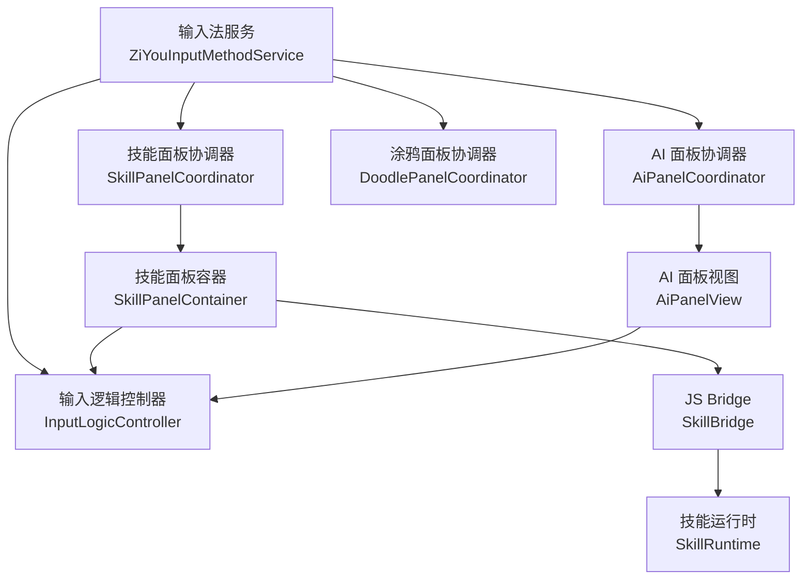
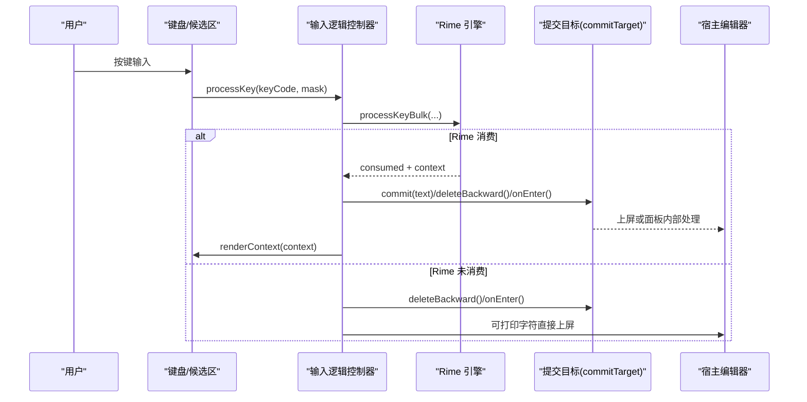
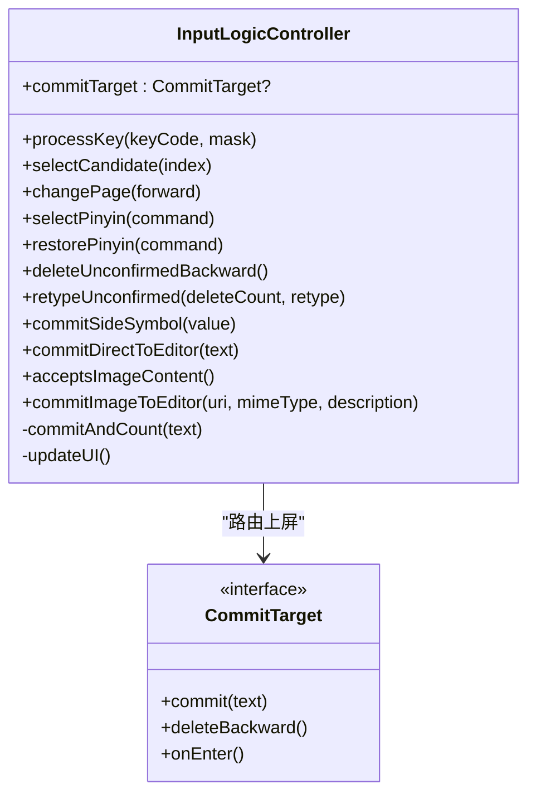
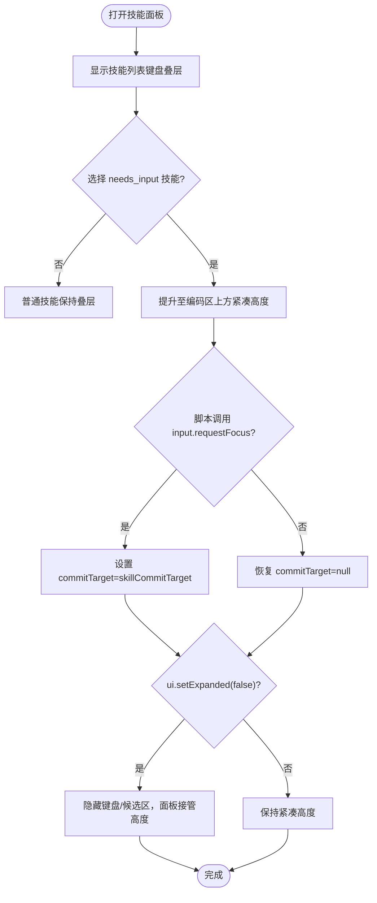
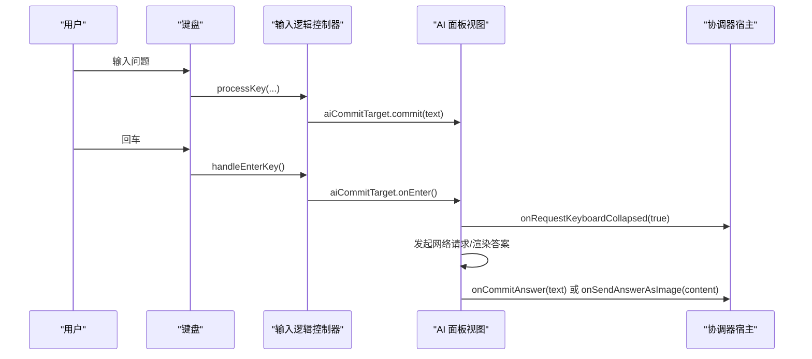
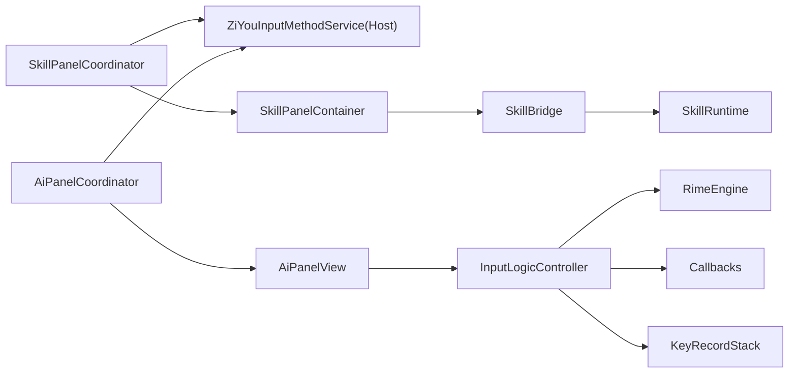
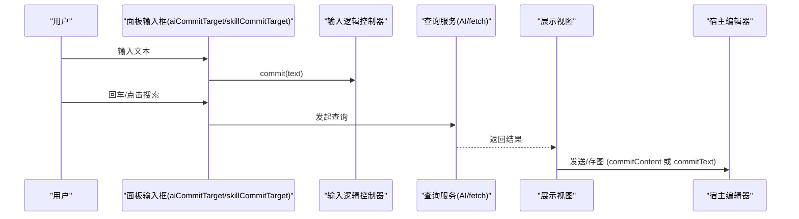

# 输入路由系统

<cite>
**本文引用的文件**   
- [InputLogicController.kt](file://app/src/main/java/com/ziyou/ime/ime/InputLogicController.kt)
- [SkillPanelCoordinator.kt](file://app/src/main/java/com/ziyou/ime/ime/SkillPanelCoordinator.kt)
- [SkillPanelContainer.kt](file://app/src/main/java/com/ziyou/ime/ime/SkillPanelContainer.kt)
- [SkillBridge.kt](file://app/src/main/java/com/ziyou/ime/skill/SkillBridge.kt)
- [SkillRuntime.kt](file://app/src/main/java/com/ziyou/ime/skill/SkillRuntime.kt)
- [AiPanelCoordinator.kt](file://app/src/main/java/com/ziyou/ime/ime/AiPanelCoordinator.kt)
- [AiPanelView.kt](file://app/src/main/java/com/ziyou/ime/ime/AiPanelView.kt)
- [DoodlePanelCoordinator.kt](file://app/src/main/java/com/ziyou/ime/ime/DoodlePanelCoordinator.kt)
- [FloatingPanelContainer.kt](file://app/src/main/java/com/ziyou/ime/ime/FloatingPanelContainer.kt)
- [ZiYouInputMethodService.kt](file://app/src/main/java/com/ziyou/ime/ime/ZiYouInputMethodService.kt)
- [SkillPanelSpec.kt](file://core-logic/src/main/java/com/ziyou/ime/core/skill/SkillPanelSpec.kt)
</cite>

## 目录
1. [引言](#引言)
2. [项目结构](#项目结构)
3. [核心组件](#核心组件)
4. [架构总览](#架构总览)
5. [详细组件分析](#详细组件分析)
6. [依赖关系分析](#依赖关系分析)
7. [性能考量](#性能考量)
8. [故障排查指南](#故障排查指南)
9. [结论](#结论)
10. [附录](#附录)

## 引言
本文件面向“面板内文本输入系统”，聚焦 needs_input 模式与 input 路由的工作原理，详解 requestFocus 与 releaseFocus 的生命周期管理；说明三种布局形态（技能列表、needs_input 提升、setExpanded 收缩）的切换机制与几何计算；梳理输入事件处理流程与 commitTarget 的工作机制；给出完整的四阶段交互模式（输入→查询→展示→发送）的实现示例；并总结安全边界与最佳实践（焦点管理与用户体验优化）。

## 项目结构
- 输入逻辑控制器：统一按键处理、候选词选择、上屏出口、commitTarget 路由。
- 技能面板协调器：负责技能面板生命周期与三态布局编排（键盘叠层、提升挂载、收缩态）。
- 技能面板容器：承载 WebView、JS Bridge、输入路由激活与 commitTarget 实现。
- AI 面板协调器与视图：提问态/答案态布局切换，输入路由接管键盘上屏。
- 涂鸦面板协调器：无文字输入需求，仅接管空间，不介入 commitTarget。
- 悬浮面板容器：FLOATING 形态下的面板几何与拖拽。
- 服务主类：装配各协调器与宿主能力，桥接 Service 生命周期与面板协调器。

**图表来源**
- [ZiYouInputMethodService.kt:102-172](file://app/src/main/java/com/ziyou/ime/ime/ZiYouInputMethodService.kt#L102-L172)
- [InputLogicController.kt:43-112](file://app/src/main/java/com/ziyou/ime/ime/InputLogicController.kt#L43-L112)
- [SkillPanelCoordinator.kt:31-70](file://app/src/main/java/com/ziyou/ime/ime/SkillPanelCoordinator.kt#L31-L70)
- [SkillPanelContainer.kt:38-79](file://app/src/main/java/com/ziyou/ime/ime/SkillPanelContainer.kt#L38-L79)
- [AiPanelCoordinator.kt:28-62](file://app/src/main/java/com/ziyou/ime/ime/AiPanelCoordinator.kt#L28-L62)
- [AiPanelView.kt:55-84](file://app/src/main/java/com/ziyou/ime/ime/AiPanelView.kt#L55-L84)
- [SkillBridge.kt:20-32](file://app/src/main/java/com/ziyou/ime/skill/SkillBridge.kt#L20-L32)
- [SkillRuntime.kt:40-114](file://app/src/main/java/com/ziyou/ime/skill/SkillRuntime.kt#L40-L114)

**章节来源**
- [ZiYouInputMethodService.kt:102-172](file://app/src/main/java/com/ziyou/ime/ime/ZiYouInputMethodService.kt#L102-L172)
- [InputLogicController.kt:43-112](file://app/src/main/java/com/ziyou/ime/ime/InputLogicController.kt#L43-L112)

## 核心组件
- InputLogicController：按键串行化、Rime 引擎交互、commitTarget 路由、UI 刷新回调。
- SkillPanelCoordinator：三态布局（键盘叠层/提升/收缩）、高度守恒策略、commitTarget 切换。
- SkillPanelContainer：WebView 生命周期、input.requestFocus/releaseFocus 驱动的路由开关、skillCommitTarget 实现。
- AiPanelCoordinator/AiPanelView：提问态/答案态布局切换、aiCommitTarget 实现、回车即发送。
- DoodlePanelCoordinator：纯空间接管，不接入 commitTarget。
- FloatingPanelContainer：悬浮面板几何与拖拽。
- SkillBridge/SkillRuntime：JS 到原生 API 的安全通道，权限校验、fetch/storage/image 等能力。

**章节来源**
- [InputLogicController.kt:76-112](file://app/src/main/java/com/ziyou/ime/ime/InputLogicController.kt#L76-L112)
- [SkillPanelCoordinator.kt:31-70](file://app/src/main/java/com/ziyou/ime/ime/SkillPanelCoordinator.kt#L31-L70)
- [SkillPanelContainer.kt:93-108](file://app/src/main/java/com/ziyou/ime/ime/SkillPanelContainer.kt#L93-L108)
- [AiPanelCoordinator.kt:28-62](file://app/src/main/java/com/ziyou/ime/ime/AiPanelCoordinator.kt#L28-L62)
- [AiPanelView.kt:155-161](file://app/src/main/java/com/ziyou/ime/ime/AiPanelView.kt#L155-L161)
- [DoodlePanelCoordinator.kt:24-62](file://app/src/main/java/com/ziyou/ime/ime/DoodlePanelCoordinator.kt#L24-L62)
- [FloatingPanelContainer.kt:40-88](file://app/src/main/java/com/ziyou/ime/ime/FloatingPanelContainer.kt#L40-L88)
- [SkillBridge.kt:20-49](file://app/src/main/java/com/ziyou/ime/skill/SkillBridge.kt#L20-L49)
- [SkillRuntime.kt:142-241](file://app/src/main/java/com/ziyou/ime/skill/SkillRuntime.kt#L142-L241)

## 架构总览
输入路由系统的核心是“commitTarget”抽象：默认直达宿主编辑器；当面板申请输入焦点后，键盘上屏文本改道注入面板输入框。技能面板通过 JS 调用 input.requestFocus/releaseFocus 控制路由开关；AI 面板在打开时直接设置 commitTarget；涂鸦面板不改变 commitTarget。

**图表来源**
- [InputLogicController.kt:126-185](file://app/src/main/java/com/ziyou/ime/ime/InputLogicController.kt#L126-L185)
- [InputLogicController.kt:383-396](file://app/src/main/java/com/ziyou/ime/ime/InputLogicController.kt#L383-L396)
- [InputLogicController.kt:493-504](file://app/src/main/java/com/ziyou/ime/ime/InputLogicController.kt#L493-L504)

## 详细组件分析

### 输入逻辑控制器（InputLogicController）
- 按键处理：processKey 使用 Mutex 串行化，避免快速连击导致 commit/context 错配；对慢按键进行告警；编码长度超限防护。
- 候选词选择：selectCandidate 支持分段确认与九宫格状态机同步。
- 回车键落地：handleEnterKey 优先走 commitTarget.onEnter()，否则按 EditorInfo 动作或补发 ENTER 物理按键事件。
- commitTarget：统一上屏出口，非空时注入面板，为空时直达宿主编辑器；同时触发等级计分监听。
- 图片富媒体：commitImageToEditor 基于 Commit Content API 提交图片。

**图表来源**
- [InputLogicController.kt:95-112](file://app/src/main/java/com/ziyou/ime/ime/InputLogicController.kt#L95-L112)
- [InputLogicController.kt:126-185](file://app/src/main/java/com/ziyou/ime/ime/InputLogicController.kt#L126-L185)
- [InputLogicController.kt:383-396](file://app/src/main/java/com/ziyou/ime/ime/InputLogicController.kt#L383-L396)
- [InputLogicController.kt:493-504](file://app/src/main/java/com/ziyou/ime/ime/InputLogicController.kt#L493-L504)

**章节来源**
- [InputLogicController.kt:126-185](file://app/src/main/java/com/ziyou/ime/ime/InputLogicController.kt#L126-L185)
- [InputLogicController.kt:383-396](file://app/src/main/java/com/ziyou/ime/ime/InputLogicController.kt#L383-L396)
- [InputLogicController.kt:493-504](file://app/src/main/java/com/ziyou/ime/ime/InputLogicController.kt#L493-L504)

### 技能面板协调器（SkillPanelCoordinator）与容器（SkillPanelContainer）
- 三态布局：
  - 键盘叠层：面板覆盖键盘区域，高度锁定为键盘高度。
  - 提升挂载（needs_input）：面板移至内容根容器顶部（编码区上方），紧凑高度约键盘 60%（可 ui.setPanelHeight 调整）。
  - 收缩态（ui.setExpanded(false)）：键盘/编码区/候选区 GONE，面板高度接管三者实测高度之和，窗口总高严格不变。
- 输入路由：
  - SkillPanelContainer 暴露 skillCommitTarget，将 commit/deleteBackward 映射到 JS 垫片 window.__imeskillInput。
  - SkillRuntime.input.requestFocus/releaseFocus 驱动 onInputRoutingChanged，Host 设置 commitTarget。
- 高度规格：SkillPanelSpec.clampHeightRatio 钳制 ratio 到合法区间。

**图表来源**
- [SkillPanelCoordinator.kt:193-255](file://app/src/main/java/com/ziyou/ime/ime/SkillPanelCoordinator.kt#L193-L255)
- [SkillPanelContainer.kt:248-254](file://app/src/main/java/com/ziyou/ime/ime/SkillPanelContainer.kt#L248-L254)
- [SkillRuntime.kt:227-238](file://app/src/main/java/com/ziyou/ime/skill/SkillRuntime.kt#L227-L238)
- [SkillPanelSpec.kt:10-29](file://core-logic/src/main/java/com/ziyou/ime/core/skill/SkillPanelSpec.kt#L10-L29)

**章节来源**
- [SkillPanelCoordinator.kt:93-119](file://app/src/main/java/com/ziyou/ime/ime/SkillPanelCoordinator.kt#L93-L119)
- [SkillPanelCoordinator.kt:193-255](file://app/src/main/java/com/ziyou/ime/ime/SkillPanelCoordinator.kt#L193-L255)
- [SkillPanelContainer.kt:93-108](file://app/src/main/java/com/ziyou/ime/ime/SkillPanelContainer.kt#L93-L108)
- [SkillPanelContainer.kt:248-254](file://app/src/main/java/com/ziyou/ime/ime/SkillPanelContainer.kt#L248-L254)
- [SkillRuntime.kt:227-238](file://app/src/main/java/com/ziyou/ime/skill/SkillRuntime.kt#L227-L238)
- [SkillPanelSpec.kt:10-29](file://core-logic/src/main/java/com/ziyou/ime/core/skill/SkillPanelSpec.kt#L10-L29)

### AI 面板协调器与视图（AiPanelCoordinator / AiPanelView）
- 两种布局：
  - 提问态：面板紧凑高度，键盘可见，commitTarget=aiCommitTarget 接管键盘上屏。
  - 答案态：键盘/候选区收回，面板高度接管三者实测高度之和，答案区独立滚动。
- 回车即发送：aiCommitTarget.onEnter() 触发 sendQuestion。
- 答案输出：支持直接上屏或渲染为图片后提交（commitContent 直发或保存到相册）。

**图表来源**
- [AiPanelCoordinator.kt:79-101](file://app/src/main/java/com/ziyou/ime/ime/AiPanelCoordinator.kt#L79-L101)
- [AiPanelView.kt:155-161](file://app/src/main/java/com/ziyou/ime/ime/AiPanelView.kt#L155-L161)
- [AiPanelView.kt:329-347](file://app/src/main/java/com/ziyou/ime/ime/AiPanelView.kt#L329-L347)
- [InputLogicController.kt:383-396](file://app/src/main/java/com/ziyou/ime/ime/InputLogicController.kt#L383-L396)

**章节来源**
- [AiPanelCoordinator.kt:79-101](file://app/src/main/java/com/ziyou/ime/ime/AiPanelCoordinator.kt#L79-L101)
- [AiPanelView.kt:155-161](file://app/src/main/java/com/ziyou/ime/ime/AiPanelView.kt#L155-L161)
- [AiPanelView.kt:329-347](file://app/src/main/java/com/ziyou/ime/ime/AiPanelView.kt#L329-L347)

### 涂鸦面板协调器（DoodlePanelCoordinator）
- 打开即收起键盘/候选区，面板高度接管二者实测高度之和（高度守恒）。
- 不接管 commitTarget，对 Rime 引擎与输入链路零侵入。
- 提供「发送」或「保存」按钮，依据编辑器图片能力动态切换。

**章节来源**
- [DoodlePanelCoordinator.kt:79-119](file://app/src/main/java/com/ziyou/ime/ime/DoodlePanelCoordinator.kt#L79-L119)

### 悬浮面板容器（FloatingPanelContainer）
- 透明容器撑满 IME 窗口可用高度，内部圆角卡片承载 preedit+候选+键盘。
- 拖动条拖拽移动，逐帧边界钳制，松手后持久化位置；位移触发的绘制遍历让系统重新回调 onComputeInsets，触摸区域随面板实时同步。
- 对外暴露 getPanelRectInWindow 供 Service 裁剪触摸区域。

**章节来源**
- [FloatingPanelContainer.kt:104-136](file://app/src/main/java/com/ziyou/ime/ime/FloatingPanelContainer.kt#L104-L136)
- [FloatingPanelContainer.kt:173-206](file://app/src/main/java/com/ziyou/ime/ime/FloatingPanelContainer.kt#L173-L206)

### 服务主类（ZiYouInputMethodService）
- 装配 SkillPanelCoordinator、AiPanelCoordinator、DoodlePanelCoordinator，提供 Host 能力（容器访问、commitText、setCommitTarget、editorAcceptsImage 等）。
- 面板打开前清理活跃编码与候选/编码区展示（clearCompositionForPanel），保证零状态丢失。

**章节来源**
- [ZiYouInputMethodService.kt:102-172](file://app/src/main/java/com/ziyou/ime/ime/ZiYouInputMethodService.kt#L102-L172)

## 依赖关系分析
- InputLogicController 依赖 RimeEngine、Callbacks（获取 InputConnection/EditorInfo、renderContext）、KeyRecordStack、commitListeners。
- SkillPanelCoordinator 依赖 ZiYouInputMethodService（Host 接口），管理 SkillPanelContainer 生命周期与布局。
- SkillPanelContainer 依赖 SkillRuntime/SkillBridge/Webview，暴露 skillCommitTarget 给 InputLogicController。
- AiPanelCoordinator/AiPanelView 依赖 Host 能力，设置 aiCommitTarget。
- SkillBridge/SkillRuntime 负责 JS 到原生的安全通道，权限校验与资源限制。

**图表来源**
- [InputLogicController.kt:43-49](file://app/src/main/java/com/ziyou/ime/ime/InputLogicController.kt#L43-L49)
- [SkillPanelCoordinator.kt:31-70](file://app/src/main/java/com/ziyou/ime/ime/SkillPanelCoordinator.kt#L31-L70)
- [SkillPanelContainer.kt:38-79](file://app/src/main/java/com/ziyou/ime/ime/SkillPanelContainer.kt#L38-L79)
- [SkillBridge.kt:20-32](file://app/src/main/java/com/ziyou/ime/skill/SkillBridge.kt#L20-L32)
- [SkillRuntime.kt:40-114](file://app/src/main/java/com/ziyou/ime/skill/SkillRuntime.kt#L40-L114)
- [AiPanelCoordinator.kt:28-62](file://app/src/main/java/com/ziyou/ime/ime/AiPanelCoordinator.kt#L28-L62)
- [AiPanelView.kt:55-84](file://app/src/main/java/com/ziyou/ime/ime/AiPanelView.kt#L55-L84)

**章节来源**
- [InputLogicController.kt:43-49](file://app/src/main/java/com/ziyou/ime/ime/InputLogicController.kt#L43-L49)
- [SkillPanelCoordinator.kt:31-70](file://app/src/main/java/com/ziyou/ime/ime/SkillPanelCoordinator.kt#L31-L70)
- [SkillPanelContainer.kt:38-79](file://app/src/main/java/com/ziyou/ime/ime/SkillPanelContainer.kt#L38-L79)
- [SkillBridge.kt:20-32](file://app/src/main/java/com/ziyou/ime/skill/SkillBridge.kt#L20-L32)
- [SkillRuntime.kt:40-114](file://app/src/main/java/com/ziyou/ime/skill/SkillRuntime.kt#L40-L114)
- [AiPanelCoordinator.kt:28-62](file://app/src/main/java/com/ziyou/ime/ime/AiPanelCoordinator.kt#L28-L62)
- [AiPanelView.kt:55-84](file://app/src/main/java/com/ziyou/ime/ime/AiPanelView.kt#L55-L84)

## 性能考量
- 按键串行化：Mutex 保证一次按键的 processKey→getCommit→getContext 原子执行，避免快速连击导致的上下文错乱。
- 慢按键告警：超过阈值记录日志，便于发现退化。
- 编码长度上限：MAX_INPUT_LENGTH 防止组合爆炸导致卡顿。
- 批量处理：processKeyBulk 减少线程往返与 JNI 跨界次数。
- 协程作用域：面板与运行时使用独立协程域，释放时取消任务，避免泄漏。

**章节来源**
- [InputLogicController.kt:67-74](file://app/src/main/java/com/ziyou/ime/ime/InputLogicController.kt#L67-L74)
- [InputLogicController.kt:126-146](file://app/src/main/java/com/ziyou/ime/ime/InputLogicController.kt#L126-L146)
- [InputLogicController.kt:126-138](file://app/src/main/java/com/ziyou/ime/ime/InputLogicController.kt#L126-L138)

## 故障排查指南
- 输入错位/丢字：检查 Mutex 是否被异常中断；确认 processKeyBulk 返回值与 commit 一致性。
- 面板输入无效：确认 input.requestFocus/releaseFocus 配对；检查 commitTarget 是否为空。
- 布局异常：核对 setElevated/setImeExpanded 调用顺序与 visibility 状态；确保高度守恒策略生效。
- 图片提交失败：检查 editorAcceptsImage 检测结果与 commitContent 权限；确认 FileProvider URI 有效。
- 网络请求受限：确认 fetch 白名单、HTTPS 强制、频控与并发限制；查看响应大小限制。

**章节来源**
- [InputLogicController.kt:126-185](file://app/src/main/java/com/ziyou/ime/ime/InputLogicController.kt#L126-L185)
- [SkillPanelContainer.kt:248-254](file://app/src/main/java/com/ziyou/ime/ime/SkillPanelContainer.kt#L248-L254)
- [SkillPanelCoordinator.kt:193-255](file://app/src/main/java/com/ziyou/ime/ime/SkillPanelCoordinator.kt#L193-L255)
- [SkillRuntime.kt:374-427](file://app/src/main/java/com/ziyou/ime/skill/SkillRuntime.kt#L374-L427)

## 结论
本输入路由系统以 commitTarget 为核心，将键盘上屏路径解耦至面板或宿主编辑器；通过 needs_input 模式与 input.requestFocus/releaseFocus 实现安全的焦点与路由切换；三态布局与高度守恒策略保障不同场景下的视觉与交互一致性；AI/技能/涂鸦面板遵循统一的协调器拆分纪律，使 Service 聚焦于生命周期与视图装配。配合严格的权限与资源限制，系统在功能丰富性与安全性之间取得平衡。

## 附录

### 四阶段交互模式（输入→查询→展示→发送）实现示例
- 输入：用户在面板输入框打字，键盘上屏经 commitTarget 注入面板输入缓冲。
- 查询：回车或点击搜索，触发网络请求（AI 问答或技能 fetch）。
- 展示：结果渲染为 Markdown/气泡/技能页面，支持多轮历史与引用来源。
- 发送：支持直接上屏或渲染为图片后提交（commitContent 直发或保存到相册）。

**图表来源**
- [AiPanelView.kt:155-161](file://app/src/main/java/com/ziyou/ime/ime/AiPanelView.kt#L155-L161)
- [SkillPanelContainer.kt:100-108](file://app/src/main/java/com/ziyou/ime/ime/SkillPanelContainer.kt#L100-L108)
- [InputLogicController.kt:493-504](file://app/src/main/java/com/ziyou/ime/ime/InputLogicController.kt#L493-L504)
- [SkillRuntime.kt:374-427](file://app/src/main/java/com/ziyou/ime/skill/SkillRuntime.kt#L374-L427)

### 安全边界与最佳实践
- 权限校验：所有敏感 API（storage/fetch/image/clipboard）需 manifest 声明权限。
- 资源限制：消息长度、存储限额、fetch 超时/并发/响应大小、PNG 魔数校验。
- 焦点管理：requestFocus/releaseFocus 必须成对出现；面板关闭时复位 commitTarget。
- 高度守恒：面板切换与收缩态严格保持 IME 窗口总高不变，避免布局抖动。
- 用户体验：回车语义适配（performEditorAction 或补发 ENTER 事件）；震动反馈与提示文案一致。

**章节来源**
- [SkillRuntime.kt:48-77](file://app/src/main/java/com/ziyou/ime/skill/SkillRuntime.kt#L48-L77)
- [SkillRuntime.kt:374-427](file://app/src/main/java/com/ziyou/ime/skill/SkillRuntime.kt#L374-L427)
- [SkillPanelContainer.kt:248-254](file://app/src/main/java/com/ziyou/ime/ime/SkillPanelContainer.kt#L248-L254)
- [SkillPanelCoordinator.kt:235-255](file://app/src/main/java/com/ziyou/ime/ime/SkillPanelCoordinator.kt#L235-L255)
- [InputLogicController.kt:383-396](file://app/src/main/java/com/ziyou/ime/ime/InputLogicController.kt#L383-L396)