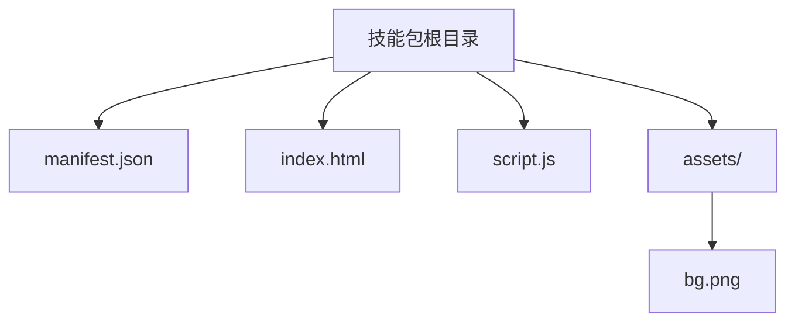
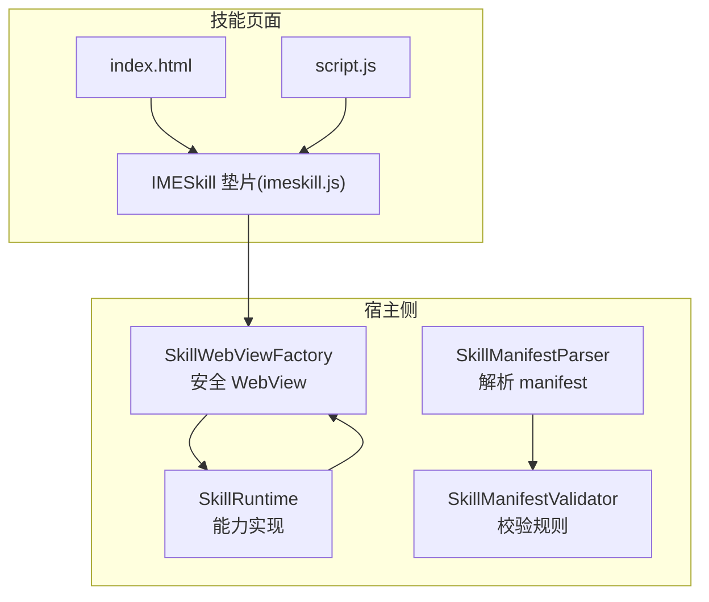
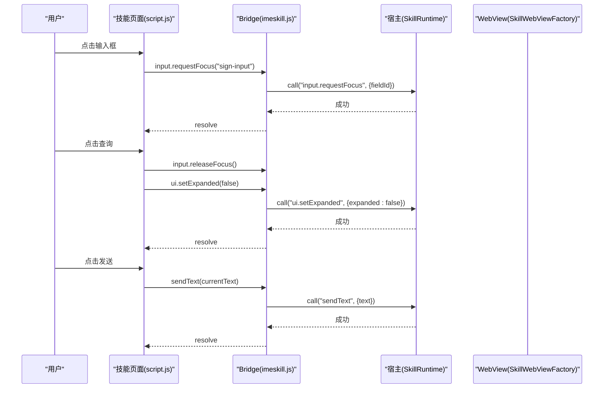
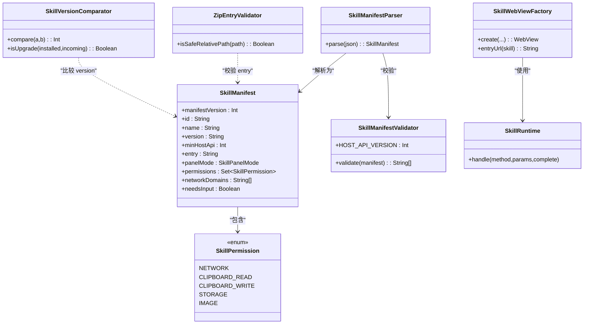

# 插件开发

<cite>
**本文引用的文件**   
- [manifest.json（星座插件）](file://skills-dev/com.user.constellation/manifest.json)
- [index.html（星座插件）](file://skills-dev/com.user.constellation/index.html)
- [script.js（星座插件）](file://skills-dev/com.user.constellation/script.js)
- [imeskill.js（Bridge 垫片）](file://app/src/main/assets/skill_runtime/imeskill.js)
- [SkillManifest.kt](file://core-logic/src/main/java/com/ziyou/ime/core/skill/SkillManifest.kt)
- [SkillPermission.kt](file://core-logic/src/main/java/com/ziyou/ime/core/skill/SkillPermission.kt)
- [SkillManifestValidator.kt](file://core-logic/src/main/java/com/ziyou/ime/core/skill/SkillManifestValidator.kt)
- [ZipEntryValidator.kt](file://core-logic/src/main/java/com/ziyou/ime/core/skill/ZipEntryValidator.kt)
- [SkillVersionComparator.kt](file://core-logic/src/main/java/com/ziyou/ime/core/skill/SkillVersionComparator.kt)
- [SkillManifestParser.kt](file://app/src/main/java/com/ziyou/ime/skill/SkillManifestParser.kt)
- [SkillWebViewFactory.kt](file://app/src/main/java/com/ziyou/ime/skill/SkillWebViewFactory.kt)
- [SkillRuntime.kt](file://app/src/main/java/com/ziyou/ime/skill/SkillRuntime.kt)
- [manifest.json（计算器内置技能）](file://app/src/main/assets/skills/calculator/manifest.json)
- [manifest.json（天气内置技能）](file://app/src/main/assets/skills/weather/manifest.json)
- [技能插件开发指南.md](file://docs/技能插件开发指南.md)
</cite>

## 目录
1. [简介](#简介)
2. [项目结构](#项目结构)
3. [核心组件](#核心组件)
4. [架构总览](#架构总览)
5. [详细组件分析](#详细组件分析)
6. [依赖关系分析](#依赖关系分析)
7. [性能考量](#性能考量)
8. [故障排查指南](#故障排查指南)
9. [结论](#结论)
10. [附录](#附录)

## 简介
本指南面向开发者，系统讲解字由输入法“技能插件”的完整开发流程与最佳实践。内容涵盖：
- 插件目录结构与 manifest.json 字段说明
- JavaScript Bridge API（宿主能力调用、事件处理、数据通信）
- WebView 沙箱限制与安全配置（权限、网络、文件系统）
- 从初始化到打包发布的端到端流程
- 调试技巧（Chrome DevTools、日志、错误定位）
- 基于 skills-dev 中星座插件的实战示例
- 版本管理与兼容性策略
- 性能优化建议

## 项目结构
一个技能插件是一个目录（分发时打包为 .skill 后缀的 zip），典型结构如下：
- manifest.json：元数据与权限声明
- index.html：入口页面
- script.js：逻辑脚本（可内联在 HTML 中）
- assets/：静态资源（图片等）

约束要点：
- 包大小 ≤ 5MB，条目数 ≤ 200
- 所有路径必须为包内相对路径，禁止 ../、绝对路径、反斜杠
- 页面引用资源一律用相对路径；外部 URL 会被宿主拦截为空响应

**章节来源**
- [技能插件开发指南.md:26-44](file://docs/技能插件开发指南.md#L26-L44)

## 核心组件
- 元数据模型与校验：SkillManifest、SkillPermission、SkillManifestValidator
- 解析器：SkillManifestParser（JSON → 模型）
- 运行时与 Bridge：SkillRuntime（能力实现）、SkillWebViewFactory（安全 WebView 工厂）、imeskill.js（JS 垫片）
- 安装与版本：ZipEntryValidator（路径安全）、SkillVersionComparator（版本比较）

**章节来源**
- [SkillManifest.kt:1-51](file://core-logic/src/main/java/com/ziyou/ime/core/skill/SkillManifest.kt#L1-L51)
- [SkillPermission.kt:1-27](file://core-logic/src/main/java/com/ziyou/ime/core/skill/SkillPermission.kt#L1-L27)
- [SkillManifestValidator.kt:1-78](file://core-logic/src/main/java/com/ziyou/ime/core/skill/SkillManifestValidator.kt#L1-L78)
- [SkillManifestParser.kt:1-73](file://app/src/main/java/com/ziyou/ime/skill/SkillManifestParser.kt#L1-L73)
- [ZipEntryValidator.kt:1-37](file://core-logic/src/main/java/com/ziyou/ime/core/skill/ZipEntryValidator.kt#L1-L37)
- [SkillVersionComparator.kt:1-30](file://core-logic/src/main/java/com/ziyou/ime/core/skill/SkillVersionComparator.kt#L1-L30)

## 架构总览
技能运行于 WebView 沙箱中，通过 IMESkill Bridge 与宿主通信。宿主负责：
- 安全注入 imeskill.js 垫片
- 全量资源拦截与 CSP 收紧
- 权限校验、限额控制、网络代理
- 输入路由与面板布局控制

**图示来源**
- [SkillWebViewFactory.kt:1-205](file://app/src/main/java/com/ziyou/ime/skill/SkillWebViewFactory.kt#L1-L205)
- [SkillRuntime.kt:1-521](file://app/src/main/java/com/ziyou/ime/skill/SkillRuntime.kt#L1-L521)
- [SkillManifestParser.kt:1-73](file://app/src/main/java/com/ziyou/ime/skill/SkillManifestParser.kt#L1-L73)
- [SkillManifestValidator.kt:1-78](file://core-logic/src/main/java/com/ziyou/ime/core/skill/SkillManifestValidator.kt#L1-L78)
- [imeskill.js:1-164](file://app/src/main/assets/skill_runtime/imeskill.js#L1-L164)

## 详细组件分析

### manifest.json 字段详解
关键字段与含义：
- manifest_version：固定为 1
- id：反向域名风格唯一标识
- name/version：展示名与版本号（数字点分）
- min_host_api：最低宿主 API 版本（当前 v4）
- author/description/icon_text：可选信息
- entry：入口 HTML 路径（必须以 .html 结尾）
- panel_mode：embed（工具嵌入）或 card（信息卡片）
- permissions：权限数组（network/clipboard_read/clipboard_write/storage/image）
- network_domains：域名白名单（仅 network 权限时允许非空）
- needs_input：是否需要面板内文本输入（Phase 3 输入路由）

示例参考：
- 星座插件 manifest：[manifest.json（星座插件）:1-15](file://skills-dev/com.user.constellation/manifest.json#L1-L15)
- 计算器内置 manifest：[manifest.json（计算器内置技能）:1-14](file://app/src/main/assets/skills/calculator/manifest.json#L1-L14)
- 天气内置 manifest：[manifest.json（天气内置技能）:1-16](file://app/src/main/assets/skills/weather/manifest.json#L1-L16)

**章节来源**
- [SkillManifest.kt:1-51](file://core-logic/src/main/java/com/ziyou/ime/core/skill/SkillManifest.kt#L1-L51)
- [SkillManifestValidator.kt:1-78](file://core-logic/src/main/java/com/ziyou/ime/core/skill/SkillManifestValidator.kt#L1-L78)
- [SkillManifestParser.kt:1-73](file://app/src/main/java/com/ziyou/ime/skill/SkillManifestParser.kt#L1-L73)

### JavaScript Bridge API（IMESkill）
全局对象 window.IMESkill，所有方法返回 Promise。常用能力：
- sendText(text)：上屏并关闭面板
- getContext() / getLocale() / haptic()
- ui.setTitle()/close()/setExpanded()/setPanelHeight()
- storage.get/set/remove（需 storage 权限）
- clipboard.read/write（需对应权限）
- input.requestFocus()/releaseFocus（需 needs_input）
- fetch(url, options)（需 network 权限 + 白名单）
- image.send/saveToGallery（需 image 权限，仅 PNG）

示例参考：
- Bridge 垫片定义：[imeskill.js:1-164](file://app/src/main/assets/skill_runtime/imeskill.js#L1-L164)
- 能力实现（权限/限额/网络代理/输入路由/图片输出）：[SkillRuntime.kt:1-521](file://app/src/main/java/com/ziyou/ime/skill/SkillRuntime.kt#L1-L521)

**章节来源**
- [imeskill.js:1-164](file://app/src/main/assets/skill_runtime/imeskill.js#L1-L164)
- [SkillRuntime.kt:1-521](file://app/src/main/java/com/ziyou/ime/skill/SkillRuntime.kt#L1-L521)

### WebView 沙箱与安全配置
- 资源全量拦截：仅放行虚拟域名下映射到技能包内的资源
- CSP 收紧：default-src 'self'；script/style 允许内联；connect-src 'none'
- 禁用 file/content 访问、DOM Storage、地理位置、多窗口
- 渲染进程崩溃兜底：销毁面板保活主进程
- 垫片注入：优先 DOCUMENT_START_SCRIPT，回退 onPageStarted

示例参考：
- WebView 工厂与安全基线：[SkillWebViewFactory.kt:1-205](file://app/src/main/java/com/ziyou/ime/skill/SkillWebViewFactory.kt#L1-L205)

**章节来源**
- [SkillWebViewFactory.kt:1-205](file://app/src/main/java/com/ziyou/ime/skill/SkillWebViewFactory.kt#L1-L205)

### 输入路由与面板布局（needs_input）
- needs_input=true：面板提升至编码区上方，键盘可用
- requestFocus(fieldId)：将键盘上屏文本注入指定元素
- releaseFocus()：恢复直达宿主编辑框
- setExpanded(false)：收缩整个输入法界面，面板接管空间

示例参考：
- 星座插件输入路由与展开收缩：[script.js:1-220](file://skills-dev/com.user.constellation/script.js#L1-L220)
- 宿主能力接口（输入路由/展开/高度）：[SkillRuntime.kt:1-521](file://app/src/main/java/com/ziyou/ime/skill/SkillRuntime.kt#L1-L521)

**章节来源**
- [script.js:1-220](file://skills-dev/com.user.constellation/script.js#L1-L220)
- [SkillRuntime.kt:1-521](file://app/src/main/java/com/ziyou/ime/skill/SkillRuntime.kt#L1-L521)

### 网络代理（fetch）
- 强制 HTTPS，域名白名单精确匹配（禁跟随重定向）
- 超时 10s，响应 ≤1MB，频控 ≤30 次/分钟，并发 ≤2
- 失败统一 reject 并给出原因（便于脚本降级）

示例参考：
- fetch 代理实现与限额：[SkillRuntime.kt:1-521](file://app/src/main/java/com/ziyou/ime/skill/SkillRuntime.kt#L1-L521)

**章节来源**
- [SkillRuntime.kt:1-521](file://app/src/main/java/com/ziyou/ime/skill/SkillRuntime.kt#L1-L521)

### 图片输出（image）
- 仅支持 PNG（文件头魔数校验）
- send：经 commitContent 发送到当前输入框（需接收方接受 image）
- saveToGallery：保存到系统相册（Android 10+）

示例参考：
- 图片处理与写入相册：[SkillRuntime.kt:1-521](file://app/src/main/java/com/ziyou/ime/skill/SkillRuntime.kt#L1-L521)

**章节来源**
- [SkillRuntime.kt:1-521](file://app/src/main/java/com/ziyou/ime/skill/SkillRuntime.kt#L1-L521)

### 版本管理与兼容性
- 版本号比较：按段数值比较，缺段视为 0
- 升级策略：同 id 仅允许严格更高版本覆盖安装，防降级替换
- 宿主 API 版本协商：min_host_api 不得高于宿主当前版本

示例参考：
- 版本比较与升级判定：[SkillVersionComparator.kt:1-30](file://core-logic/src/main/java/com/ziyou/ime/core/skill/SkillVersionComparator.kt#L1-L30)
- 宿主 API 版本常量：[SkillManifestValidator.kt:1-78](file://core-logic/src/main/java/com/ziyou/ime/core/skill/SkillManifestValidator.kt#L1-L78)

**章节来源**
- [SkillVersionComparator.kt:1-30](file://core-logic/src/main/java/com/ziyou/ime/core/skill/SkillVersionComparator.kt#L1-L30)
- [SkillManifestValidator.kt:1-78](file://core-logic/src/main/java/com/ziyou/ime/core/skill/SkillManifestValidator.kt#L1-L78)

### 实际示例：星座插件逐步讲解
- 入口与样式：[index.html（星座插件）:1-68](file://skills-dev/com.user.constellation/index.html#L1-L68)
- 交互逻辑：输入路由、查询、历史存储、发送结果：[script.js（星座插件）:1-220](file://skills-dev/com.user.constellation/script.js#L1-L220)
- 权限与行为：storage 持久化、无网络权限、CSP 限制 connect-src 'none'

**图示来源**
- [script.js（星座插件）:1-220](file://skills-dev/com.user.constellation/script.js#L1-L220)
- [imeskill.js:1-164](file://app/src/main/assets/skill_runtime/imeskill.js#L1-L164)
- [SkillRuntime.kt:1-521](file://app/src/main/java/com/ziyou/ime/skill/SkillRuntime.kt#L1-L521)
- [SkillWebViewFactory.kt:1-205](file://app/src/main/java/com/ziyou/ime/skill/SkillWebViewFactory.kt#L1-L205)

**章节来源**
- [index.html（星座插件）:1-68](file://skills-dev/com.user.constellation/index.html#L1-L68)
- [script.js（星座插件）:1-220](file://skills-dev/com.user.constellation/script.js#L1-L220)

## 依赖关系分析
- SkillManifestParser 依赖 SkillManifest 与 SkillManifestValidator
- SkillWebViewFactory 注入 imeskill.js 并拦截资源请求
- SkillRuntime 提供全部能力实现，受权限与限额约束
- ZipEntryValidator 用于安装包路径安全校验
- SkillVersionComparator 用于版本升级判断

**图示来源**
- [SkillManifestParser.kt:1-73](file://app/src/main/java/com/ziyou/ime/skill/SkillManifestParser.kt#L1-L73)
- [SkillManifest.kt:1-51](file://core-logic/src/main/java/com/ziyou/ime/core/skill/SkillManifest.kt#L1-L51)
- [SkillManifestValidator.kt:1-78](file://core-logic/src/main/java/com/ziyou/ime/core/skill/SkillManifestValidator.kt#L1-L78)
- [SkillPermission.kt:1-27](file://core-logic/src/main/java/com/ziyou/ime/core/skill/SkillPermission.kt#L1-L27)
- [ZipEntryValidator.kt:1-37](file://core-logic/src/main/java/com/ziyou/ime/core/skill/ZipEntryValidator.kt#L1-L37)
- [SkillVersionComparator.kt:1-30](file://core-logic/src/main/java/com/ziyou/ime/core/skill/SkillVersionComparator.kt#L1-L30)
- [SkillWebViewFactory.kt:1-205](file://app/src/main/java/com/ziyou/ime/skill/SkillWebViewFactory.kt#L1-L205)
- [SkillRuntime.kt:1-521](file://app/src/main/java/com/ziyou/ime/skill/SkillRuntime.kt#L1-L521)

**章节来源**
- [SkillManifestParser.kt:1-73](file://app/src/main/java/com/ziyou/ime/skill/SkillManifestParser.kt#L1-L73)
- [SkillManifest.kt:1-51](file://core-logic/src/main/java/com/ziyou/ime/core/skill/SkillManifest.kt#L1-L51)
- [SkillManifestValidator.kt:1-78](file://core-logic/src/main/java/com/ziyou/ime/core/skill/SkillManifestValidator.kt#L1-L78)
- [SkillPermission.kt:1-27](file://core-logic/src/main/java/com/ziyou/ime/core/skill/SkillPermission.kt#L1-L27)
- [ZipEntryValidator.kt:1-37](file://core-logic/src/main/java/com/ziyou/ime/core/skill/ZipEntryValidator.kt#L1-L37)
- [SkillVersionComparator.kt:1-30](file://core-logic/src/main/java/com/ziyou/ime/core/skill/SkillVersionComparator.kt#L1-L30)
- [SkillWebViewFactory.kt:1-205](file://app/src/main/java/com/ziyou/ime/skill/SkillWebViewFactory.kt#L1-L205)
- [SkillRuntime.kt:1-521](file://app/src/main/java/com/ziyou/ime/skill/SkillRuntime.kt#L1-L521)

## 性能考量
- 避免频繁 DOM 操作与重排，尽量批量更新 UI
- 使用相对路径与本地资源，减少跨域与加载开销
- 合理使用 storage，避免大对象序列化（总量 1MB 限制）
- fetch 频控与并发限制已内置，注意合理重试与缓存策略
- 图片输出前降分辨率，避免超过 Bridge 单消息 512KB 上限
- 首帧闪烁防护已在 WebView 层处理，无需额外优化

[本节为通用指导，不直接分析具体文件]

## 故障排查指南
- Chrome DevTools 远程调试：debug 构建开启 WebView 调试，连接后 inspect 目标页面
- 日志查看：logcat 过滤 tag（SkillManager、SkillBridge、SkillRuntime、SkillWebViewFactory、SkillPackageInstaller）
- 常见错误：
  - 权限拒绝：manifest 未声明对应权限
  - 域名不在白名单/仅允许 HTTPS：检查 network_domains 与协议
  - 请求过于频繁/并发超限：降低频率或合并请求
  - 存储超限/文本超长：压缩数据或拆分提交
  - 渲染进程崩溃：宿主会销毁面板并保活主进程

**章节来源**
- [技能插件开发指南.md:313-326](file://docs/技能插件开发指南.md#L313-L326)
- [SkillRuntime.kt:1-521](file://app/src/main/java/com/ziyou/ime/skill/SkillRuntime.kt#L1-L521)
- [SkillWebViewFactory.kt:1-205](file://app/src/main/java/com/ziyou/ime/skill/SkillWebViewFactory.kt#L1-L205)

## 结论
本指南系统化阐述了技能插件的开发规范、API 用法、安全机制与调试方法。遵循 manifest 规范、权限最小化原则与沙箱约束，结合星座插件的实战经验，可快速构建稳定、安全的技能功能。建议在开发阶段充分使用浏览器预调与 DevTools 调试，发布前进行权限与白名单校验，确保用户体验与安全性。

[本节为总结性内容，不直接分析具体文件]

## 附录

### 开发流程清单
- 初始化：创建目录与 manifest.json，编写 index.html 与 script.js
- 本地调试：浏览器 mock IMESkill 垫片，验证交互与样式
- 导入测试：打包为 .skill 并通过设置页导入，或使用 adb 侧载
- 真机调试：启用 WebView 远程调试，查看 console 与断点
- 发布准备：校验 manifest、权限、白名单与资源路径，确保包大小与条目数合规

**章节来源**
- [技能插件开发指南.md:223-326](file://docs/技能插件开发指南.md#L223-L326)

### 安全与隐私要点
- 网络全量拦截，connect-src 'none'，外链不可用
- 禁用 eval/new Function，仅允许内联脚本
- 文件系统隔离，localStorage 禁用
- 页面跳转封锁，崩溃隔离与反钓鱼设计

**章节来源**
- [SkillWebViewFactory.kt:1-205](file://app/src/main/java/com/ziyou/ime/skill/SkillWebViewFactory.kt#L1-L205)
- [技能插件开发指南.md:730-762](file://docs/技能插件开发指南.md#L730-L762)