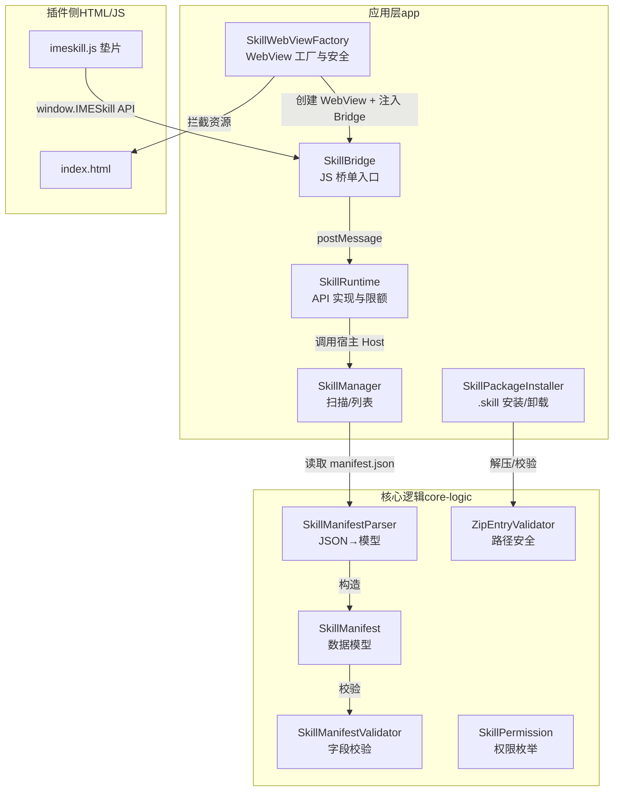
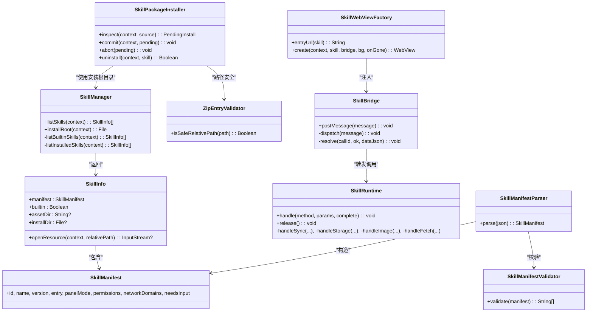
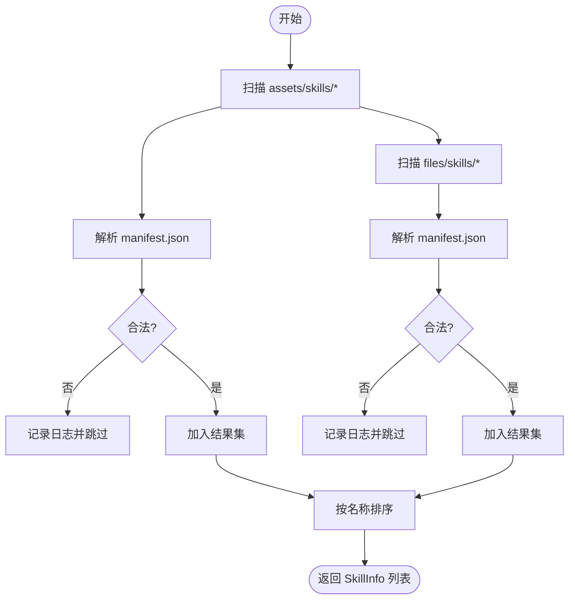
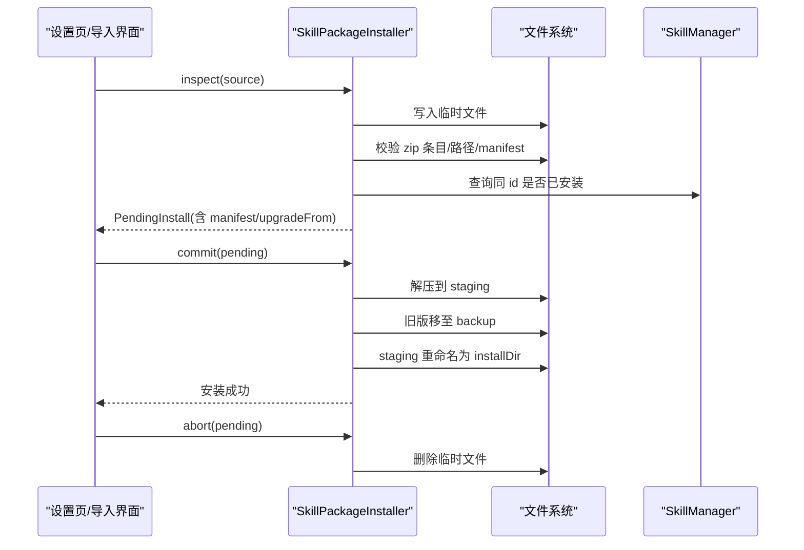
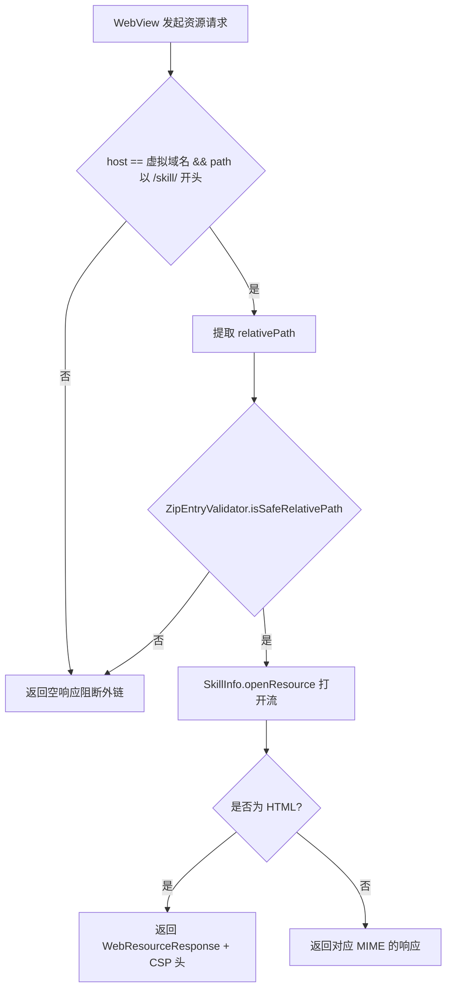
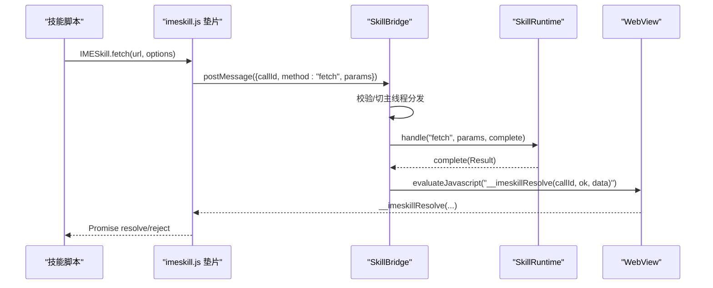
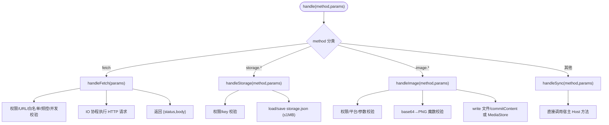
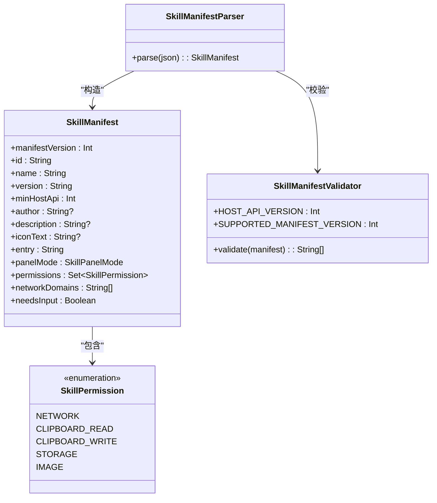
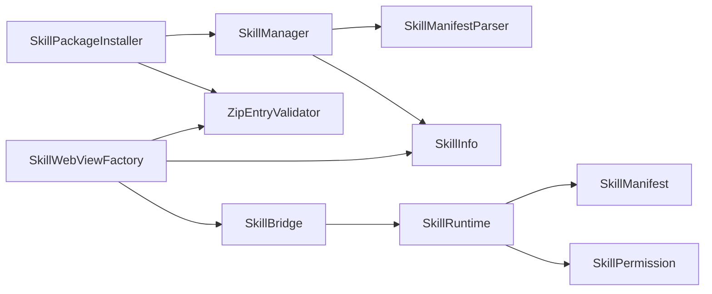
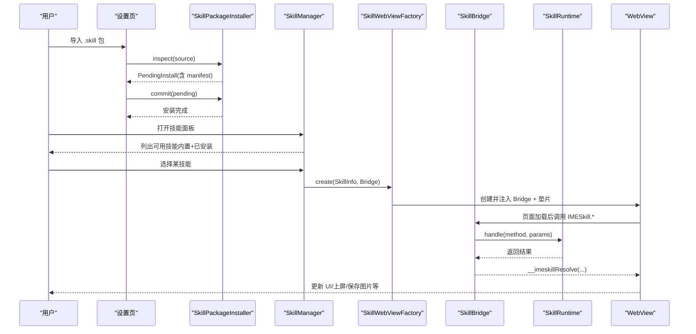

# 插件架构设计

<cite>
**本文引用的文件**   
- [SkillManager.kt](file://app/src/main/java/com/ziyou/ime/skill/SkillManager.kt)
- [SkillRuntime.kt](file://app/src/main/java/com/ziyou/ime/skill/SkillRuntime.kt)
- [SkillBridge.kt](file://app/src/main/java/com/ziyou/ime/skill/SkillBridge.kt)
- [SkillWebViewFactory.kt](file://app/src/main/java/com/ziyou/ime/skill/SkillWebViewFactory.kt)
- [SkillPackageInstaller.kt](file://app/src/main/java/com/ziyou/ime/skill/SkillPackageInstaller.kt)
- [SkillManifestParser.kt](file://app/src/main/java/com/ziyou/ime/skill/SkillManifestParser.kt)
- [SkillManifest.kt](file://core-logic/src/main/java/com/ziyou/ime/core/skill/SkillManifest.kt)
- [SkillManifestValidator.kt](file://core-logic/src/main/java/com/ziyou/ime/core/skill/SkillManifestValidator.kt)
- [SkillPermission.kt](file://core-logic/src/main/java/com/ziyou/ime/core/skill/SkillPermission.kt)
- [ZipEntryValidator.kt](file://core-logic/src/main/java/com/ziyou/ime/core/skill/ZipEntryValidator.kt)
- [imeskill.js](file://app/src/main/assets/skill_runtime/imeskill.js)
- [manifest.json（计算器）](file://app/src/main/assets/skills/calculator/manifest.json)
- [manifest.json（天气）](file://app/src/main/assets/skills/weather/manifest.json)
</cite>

## 目录
1. [引言](#引言)
2. [项目结构](#项目结构)
3. [核心组件](#核心组件)
4. [架构总览](#架构总览)
5. [详细组件分析](#详细组件分析)
6. [依赖关系分析](#依赖关系分析)
7. [性能与资源限制](#性能与资源限制)
8. [故障排查指南](#故障排查指南)
9. [结论](#结论)
10. [附录：从安装到执行的完整流程](#附录从安装到执行的完整流程)

## 引言
本文件系统化阐述输入法技能插件（Skill）的架构设计与实现要点，覆盖宿主与插件通信机制、WebView 沙箱隔离、插件生命周期管理、SkillManager 扫描/加载/卸载、SkillRuntime 对 WebView 实例与 JS Bridge 的管理、manifest.json 解析与权限模型、以及插件间数据隔离与资源限制。文档同时提供架构图与数据流图，帮助读者快速理解从插件安装到执行的全链路。

## 项目结构
- 应用层（app）负责 WebView 安全配置、Bridge 注入、运行时能力实现、包安装器与清单解析。
- 核心逻辑（core-logic）提供纯 Kotlin 的数据模型与校验器（manifest 结构、权限枚举、路径安全校验等），便于单测与跨模块复用。
- 内置技能位于 assets/skills/<id>/，用户安装技能位于 files/skills/<id>/，统一通过 SkillInfo.openResource 访问。

**图表来源** 
- [SkillManager.kt:1-110](file://app/src/main/java/com/ziyou/ime/skill/SkillManager.kt#L1-L110)
- [SkillPackageInstaller.kt:1-194](file://app/src/main/java/com/ziyou/ime/skill/SkillPackageInstaller.kt#L1-L194)
- [SkillWebViewFactory.kt:1-205](file://app/src/main/java/com/ziyou/ime/skill/SkillWebViewFactory.kt#L1-L205)
- [SkillBridge.kt:1-99](file://app/src/main/java/com/ziyou/ime/skill/SkillBridge.kt#L1-L99)
- [SkillRuntime.kt:1-521](file://app/src/main/java/com/ziyou/ime/skill/SkillRuntime.kt#L1-L521)
- [SkillManifestParser.kt:1-73](file://app/src/main/java/com/ziyou/ime/skill/SkillManifestParser.kt#L1-L73)
- [SkillManifest.kt:1-51](file://core-logic/src/main/java/com/ziyou/ime/core/skill/SkillManifest.kt#L1-L51)
- [SkillManifestValidator.kt:1-78](file://core-logic/src/main/java/com/ziyou/ime/core/skill/SkillManifestValidator.kt#L1-L78)
- [SkillPermission.kt:1-27](file://core-logic/src/main/java/com/ziyou/ime/core/skill/SkillPermission.kt#L1-L27)
- [ZipEntryValidator.kt:1-37](file://core-logic/src/main/java/com/ziyou/ime/core/skill/ZipEntryValidator.kt#L1-L37)

**章节来源**
- [SkillManager.kt:1-110](file://app/src/main/java/com/ziyou/ime/skill/SkillManager.kt#L1-L110)
- [SkillWebViewFactory.kt:1-205](file://app/src/main/java/com/ziyou/ime/skill/SkillWebViewFactory.kt#L1-L205)
- [SkillManifestParser.kt:1-73](file://app/src/main/java/com/ziyou/ime/skill/SkillManifestParser.kt#L1-L73)
- [SkillManifestValidator.kt:1-78](file://core-logic/src/main/java/com/ziyou/ime/core/skill/SkillManifestValidator.kt#L1-L78)

## 核心组件
- SkillManager：枚举内置与已安装技能，统一资源打开入口，按名称稳定排序；非法 manifest 跳过并记录日志。
- SkillPackageInstaller：两段式安装（inspect → commit/abort），Zip Slip 防护、版本升级约束、原子替换与回滚。
- SkillWebViewFactory：WebView 安全基线（全量资源拦截、CSP、禁用 file/content 访问）、虚拟域名映射、首帧防闪烁、渲染进程崩溃兜底。
- SkillBridge：JS 桥单入口，消息长度限制、主线程分发、异常兜底、异步 resolve/reject。
- SkillRuntime：Bridge API 业务实现（storage/fetch/image/clipboard/input/ui），权限检查、限额控制、协程调度与释放。
- SkillManifestParser + SkillManifest + SkillManifestValidator：manifest JSON 解析、字段合法性校验、权限与网络白名单一致性检查。
- ZipEntryValidator：包内相对路径安全校验，防止路径穿越。

**章节来源**
- [SkillManager.kt:1-110](file://app/src/main/java/com/ziyou/ime/skill/SkillManager.kt#L1-L110)
- [SkillPackageInstaller.kt:1-194](file://app/src/main/java/com/ziyou/ime/skill/SkillPackageInstaller.kt#L1-L194)
- [SkillWebViewFactory.kt:1-205](file://app/src/main/java/com/ziyou/ime/skill/SkillWebViewFactory.kt#L1-L205)
- [SkillBridge.kt:1-99](file://app/src/main/java/com/ziyou/ime/skill/SkillBridge.kt#L1-L99)
- [SkillRuntime.kt:1-521](file://app/src/main/java/com/ziyou/ime/skill/SkillRuntime.kt#L1-L521)
- [SkillManifestParser.kt:1-73](file://app/src/main/java/com/ziyou/ime/skill/SkillManifestParser.kt#L1-L73)
- [SkillManifest.kt:1-51](file://core-logic/src/main/java/com/ziyou/ime/core/skill/SkillManifest.kt#L1-L51)
- [SkillManifestValidator.kt:1-78](file://core-logic/src/main/java/com/ziyou/ime/core/skill/SkillManifestValidator.kt#L1-L78)
- [ZipEntryValidator.kt:1-37](file://core-logic/src/main/java/com/ziyou/ime/core/skill/ZipEntryValidator.kt#L1-L37)

## 架构总览
下图展示宿主与插件的交互边界与关键组件职责。WebView 作为插件运行容器，通过 SkillWebViewFactory 严格受限；SkillBridge 作为唯一 JS 入口；SkillRuntime 承载所有能力实现；SkillManager 负责插件发现与资源访问；SkillPackageInstaller 负责安装与卸载。

**图表来源** 
- [SkillManager.kt:1-110](file://app/src/main/java/com/ziyou/ime/skill/SkillManager.kt#L1-L110)
- [SkillPackageInstaller.kt:1-194](file://app/src/main/java/com/ziyou/ime/skill/SkillPackageInstaller.kt#L1-L194)
- [SkillWebViewFactory.kt:1-205](file://app/src/main/java/com/ziyou/ime/skill/SkillWebViewFactory.kt#L1-L205)
- [SkillBridge.kt:1-99](file://app/src/main/java/com/ziyou/ime/skill/SkillBridge.kt#L1-L99)
- [SkillRuntime.kt:1-521](file://app/src/main/java/com/ziyou/ime/skill/SkillRuntime.kt#L1-L521)
- [SkillManifestParser.kt:1-73](file://app/src/main/java/com/ziyou/ime/skill/SkillManifestParser.kt#L1-L73)
- [SkillManifest.kt:1-51](file://core-logic/src/main/java/com/ziyou/ime/core/skill/SkillManifest.kt#L1-L51)
- [SkillManifestValidator.kt:1-78](file://core-logic/src/main/java/com/ziyou/ime/core/skill/SkillManifestValidator.kt#L1-L78)
- [ZipEntryValidator.kt:1-37](file://core-logic/src/main/java/com/ziyou/ime/core/skill/ZipEntryValidator.kt#L1-L37)

## 详细组件分析

### SkillManager：插件扫描、加载与资源访问
- 扫描内置技能（assets/skills/*）与已安装技能（files/skills/*），合并并按名称排序。
- 每个技能目录需包含 manifest.json，解析失败则跳过并记录日志。
- openResource 统一打开资源流：内置走 assets，安装走内部存储，并对 canonicalPath 做纵深防御防止路径穿越。

**图表来源** 
- [SkillManager.kt:1-110](file://app/src/main/java/com/ziyou/ime/skill/SkillManager.kt#L1-L110)
- [SkillManifestParser.kt:1-73](file://app/src/main/java/com/ziyou/ime/skill/SkillManifestParser.kt#L1-L73)

**章节来源**
- [SkillManager.kt:1-110](file://app/src/main/java/com/ziyou/ime/skill/SkillManager.kt#L1-L110)

### SkillPackageInstaller：安装/卸载与校验
- inspect：拷贝输入流到临时文件，边读边卡大小上限；校验 zip 条目数、Zip Slip、manifest 存在性与入口文件存在性；冲突检测（内置不可覆盖，已安装仅允许升级）。
- commit：staging 解压 → 旧版移至 .backup_* → staging 重命名就位 → 成功后删除备份；空间不足或写入失败时回滚。
- uninstall：删除安装目录并清理 storage 数据。

**图表来源** 
- [SkillPackageInstaller.kt:1-194](file://app/src/main/java/com/ziyou/ime/skill/SkillPackageInstaller.kt#L1-L194)
- [ZipEntryValidator.kt:1-37](file://core-logic/src/main/java/com/ziyou/ime/core/skill/ZipEntryValidator.kt#L1-L37)
- [SkillManager.kt:1-110](file://app/src/main/java/com/ziyou/ime/skill/SkillManager.kt#L1-L110)

**章节来源**
- [SkillPackageInstaller.kt:1-194](file://app/src/main/java/com/ziyou/ime/skill/SkillPackageInstaller.kt#L1-L194)

### SkillWebViewFactory：WebView 沙箱与安全策略
- 虚拟域名 appassets.androidplatform.net 映射 /skill/<entry> 到技能包内资源。
- shouldInterceptRequest 全量拦截：仅放行虚拟域名下且经 ZipEntryValidator 校验的路径；其余请求返回空响应。
- HTML 响应附加 CSP 头收紧脚本与连接策略；禁止 location.href 跳转外域。
- 优先 DOCUMENT_START_SCRIPT 注入 imeskill.js，不支持则回退 onPageStarted；首帧提交前隐藏避免黑屏。
- onRenderProcessGone 回调销毁面板，保证 IME 主进程存活。

**图表来源** 
- [SkillWebViewFactory.kt:1-205](file://app/src/main/java/com/ziyou/ime/skill/SkillWebViewFactory.kt#L1-L205)
- [ZipEntryValidator.kt:1-37](file://core-logic/src/main/java/com/ziyou/ime/core/skill/ZipEntryValidator.kt#L1-L37)
- [SkillManager.kt:1-110](file://app/src/main/java/com/ziyou/ime/skill/SkillManager.kt#L1-L110)

**章节来源**
- [SkillWebViewFactory.kt:1-205](file://app/src/main/java/com/ziyou/ime/skill/SkillWebViewFactory.kt#L1-L205)

### SkillBridge：JS Bridge 单入口与线程模型
- 仅暴露 __IMESkillNative.postMessage 单入口，消息体含 callId/method/params。
- postMessage 在 WebView 线程接收，立即切主线程分发；所有异常兜底，避免技能崩溃影响宿主。
- 结果通过 evaluateJavascript("__imeskillResolve(...)") 异步回传，Promise 语义由垫片实现。

**图表来源** 
- [SkillBridge.kt:1-99](file://app/src/main/java/com/ziyou/ime/skill/SkillBridge.kt#L1-L99)
- [SkillRuntime.kt:1-521](file://app/src/main/java/com/ziyou/ime/skill/SkillRuntime.kt#L1-L521)
- [imeskill.js:1-164](file://app/src/main/assets/skill_runtime/imeskill.js#L1-L164)

**章节来源**
- [SkillBridge.kt:1-99](file://app/src/main/java/com/ziyou/ime/skill/SkillBridge.kt#L1-L99)

### SkillRuntime：运行时能力与限额控制
- 同步能力（sendText/getContext/getLocale/haptic/ui.*）立即完成；异步能力（storage/fetch/image）通过协程在 IO 线程执行后切回主线程回调。
- 权限模型：调用前 requirePermission，未声明则拒绝。
- 限额与策略：
  - storage：每技能独立 KV 文件，序列化后 ≤1MB；串行 IO 保证顺序。
  - fetch：强制 HTTPS、域名白名单精确匹配、超时 10s、响应 ≤1MB、频控 30 次/分钟、并发 ≤2、禁跟随重定向。
  - image：仅 PNG（文件头魔数校验），send 需编辑框接受 image 类型，saveToGallery 需 Android 10+。
  - sendText：单次 ≤5000 字符，上屏后关闭面板。
- release() 取消未完成请求并复位路由。

**图表来源** 
- [SkillRuntime.kt:1-521](file://app/src/main/java/com/ziyou/ime/skill/SkillRuntime.kt#L1-L521)

**章节来源**
- [SkillRuntime.kt:1-521](file://app/src/main/java/com/ziyou/ime/skill/SkillRuntime.kt#L1-L521)

### manifest.json 解析与验证机制
- SkillManifestParser 将 JSON 转换为 SkillManifest，并解析 permissions、network_domains、panel_mode 等字段。
- SkillManifestValidator 校验字段合法性：manifest_version、id/name/version/minHostApi/entry/permissions/network_domains 等规则；minHostApi 不得高于宿主当前版本。
- 示例 manifest：
  - 计算器：无权限、embed 模式。
  - 天气：network + storage 权限、card 模式、needs_input 为 true、network_domains 限定 wttr.in。

**图表来源** 
- [SkillManifestParser.kt:1-73](file://app/src/main/java/com/ziyou/ime/skill/SkillManifestParser.kt#L1-L73)
- [SkillManifest.kt:1-51](file://core-logic/src/main/java/com/ziyou/ime/core/skill/SkillManifest.kt#L1-L51)
- [SkillManifestValidator.kt:1-78](file://core-logic/src/main/java/com/ziyou/ime/core/skill/SkillManifestValidator.kt#L1-L78)
- [SkillPermission.kt:1-27](file://core-logic/src/main/java/com/ziyou/ime/core/skill/SkillPermission.kt#L1-L27)

**章节来源**
- [SkillManifestParser.kt:1-73](file://app/src/main/java/com/ziyou/ime/skill/SkillManifestParser.kt#L1-L73)
- [SkillManifest.kt:1-51](file://core-logic/src/main/java/com/ziyou/ime/core/skill/SkillManifest.kt#L1-L51)
- [SkillManifestValidator.kt:1-78](file://core-logic/src/main/java/com/ziyou/ime/core/skill/SkillManifestValidator.kt#L1-L78)
- [manifest.json（计算器）:1-14](file://app/src/main/assets/skills/calculator/manifest.json#L1-L14)
- [manifest.json（天气）:1-16](file://app/src/main/assets/skills/weather/manifest.json#L1-L16)

## 依赖关系分析
- SkillManager 依赖 SkillManifestParser 与 SkillInfo.openResource。
- SkillPackageInstaller 依赖 ZipEntryValidator 与 SkillManager.installRoot。
- SkillWebViewFactory 依赖 ZipEntryValidator 与 SkillInfo.openResource，并通过 addJavascriptInterface 注入 SkillBridge。
- SkillBridge 依赖 SkillRuntime 进行业务处理。
- SkillRuntime 依赖 SkillManifest.permissions 与 Host 接口（文本上屏、剪贴板、图片提交等）。
- 核心逻辑模块（core-logic）被 app 层引用，提供纯逻辑能力，降低耦合。

**图表来源** 
- [SkillManager.kt:1-110](file://app/src/main/java/com/ziyou/ime/skill/SkillManager.kt#L1-L110)
- [SkillPackageInstaller.kt:1-194](file://app/src/main/java/com/ziyou/ime/skill/SkillPackageInstaller.kt#L1-L194)
- [SkillWebViewFactory.kt:1-205](file://app/src/main/java/com/ziyou/ime/skill/SkillWebViewFactory.kt#L1-L205)
- [SkillBridge.kt:1-99](file://app/src/main/java/com/ziyou/ime/skill/SkillBridge.kt#L1-L99)
- [SkillRuntime.kt:1-521](file://app/src/main/java/com/ziyou/ime/skill/SkillRuntime.kt#L1-L521)

**章节来源**
- [SkillManager.kt:1-110](file://app/src/main/java/com/ziyou/ime/skill/SkillManager.kt#L1-L110)
- [SkillPackageInstaller.kt:1-194](file://app/src/main/java/com/ziyou/ime/skill/SkillPackageInstaller.kt#L1-L194)
- [SkillWebViewFactory.kt:1-205](file://app/src/main/java/com/ziyou/ime/skill/SkillWebViewFactory.kt#L1-L205)
- [SkillBridge.kt:1-99](file://app/src/main/java/com/ziyou/ime/skill/SkillBridge.kt#L1-L99)
- [SkillRuntime.kt:1-521](file://app/src/main/java/com/ziyou/ime/skill/SkillRuntime.kt#L1-L521)

## 性能与资源限制
- WebView：禁用缓存、DOM Storage 与多窗口，减少内存占用与攻击面；首帧前隐藏避免黑屏。
- Bridge：单条消息 ≤512KB，防止超大消息阻塞主线程。
- Runtime：
  - storage：单技能 ≤1MB，串行 IO 保证顺序与一致性。
  - fetch：超时 10s、响应 ≤1MB、频控 30 次/分钟、并发 ≤2。
  - image：仅 PNG，base64 受 Bridge 消息上限约束。
- 安装：zip 大小 ≤5MB、条目数 ≤200，解压前空间预检，失败回滚。

[本节为通用指导，不直接分析具体文件]

## 故障排查指南
- 常见错误来源：
  - manifest 解析/校验失败：查看 logcat 中 SkillManager 日志，确认字段合法性与权限声明。
  - WebView 资源拦截：确认 entry 路径与 CSP 策略，确保资源在包内且路径安全。
  - Bridge 调用异常：SkillBridge 会捕获并返回“内部错误”，检查 SkillRuntime 权限与参数。
  - fetch 失败：检查 HTTPS、域名白名单、频控与并发限制。
  - 渲染进程崩溃：onRenderProcessGone 触发后应销毁面板并恢复状态。
- 调试建议：
  - 使用 adb 侧载快速迭代，Chrome DevTools 远程调试 WebView。
  - 关注 tag：SkillManager、SkillBridge、SkillRuntime、SkillWebViewFactory、SkillPackageInstaller。

**章节来源**
- [SkillManager.kt:1-110](file://app/src/main/java/com/ziyou/ime/skill/SkillManager.kt#L1-L110)
- [SkillBridge.kt:1-99](file://app/src/main/java/com/ziyou/ime/skill/SkillBridge.kt#L1-L99)
- [SkillRuntime.kt:1-521](file://app/src/main/java/com/ziyou/ime/skill/SkillRuntime.kt#L1-L521)
- [SkillWebViewFactory.kt:1-205](file://app/src/main/java/com/ziyou/ime/skill/SkillWebViewFactory.kt#L1-L205)
- [SkillPackageInstaller.kt:1-194](file://app/src/main/java/com/ziyou/ime/skill/SkillPackageInstaller.kt#L1-L194)

## 结论
该插件系统通过严格的 WebView 沙箱、统一的 JS Bridge 单入口、完善的 manifest 校验与权限模型、以及细粒度的运行时限额控制，实现了安全、可隔离、可扩展的技能生态。SkillManager 与 SkillPackageInstaller 分别负责插件发现与安装生命周期，SkillWebViewFactory 与 SkillBridge 保障通信与隔离，SkillRuntime 提供可控的能力边界。整体架构清晰、职责分明，便于后续扩展更多能力与场景。

[本节为总结性内容，不直接分析具体文件]

## 附录：从安装到执行的完整流程

**图表来源** 
- [SkillPackageInstaller.kt:1-194](file://app/src/main/java/com/ziyou/ime/skill/SkillPackageInstaller.kt#L1-L194)
- [SkillManager.kt:1-110](file://app/src/main/java/com/ziyou/ime/skill/SkillManager.kt#L1-L110)
- [SkillWebViewFactory.kt:1-205](file://app/src/main/java/com/ziyou/ime/skill/SkillWebViewFactory.kt#L1-L205)
- [SkillBridge.kt:1-99](file://app/src/main/java/com/ziyou/ime/skill/SkillBridge.kt#L1-L99)
- [SkillRuntime.kt:1-521](file://app/src/main/java/com/ziyou/ime/skill/SkillRuntime.kt#L1-L521)
- [imeskill.js:1-164](file://app/src/main/assets/skill_runtime/imeskill.js#L1-L164)