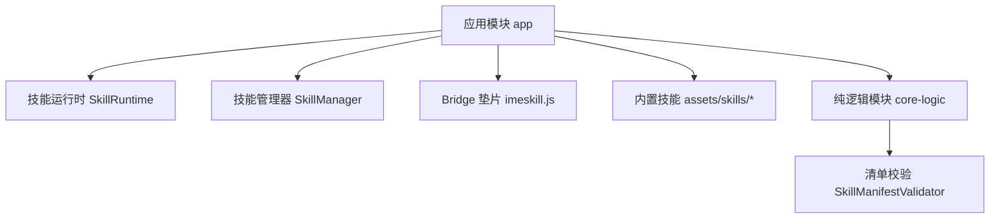
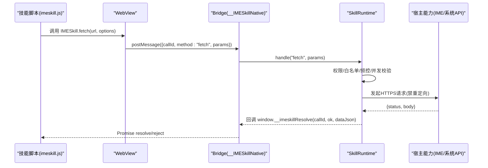
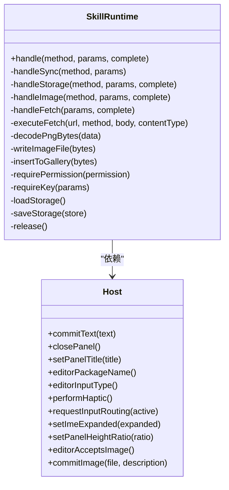
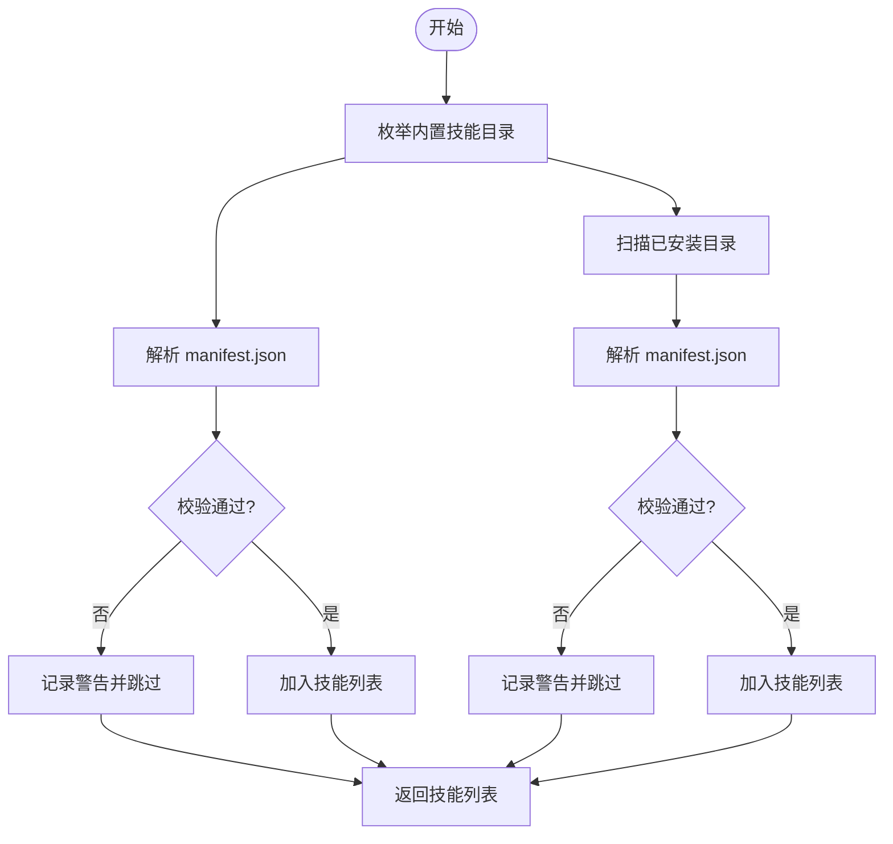
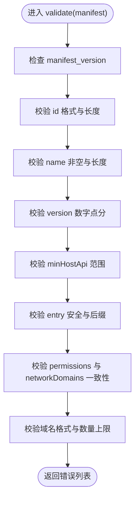
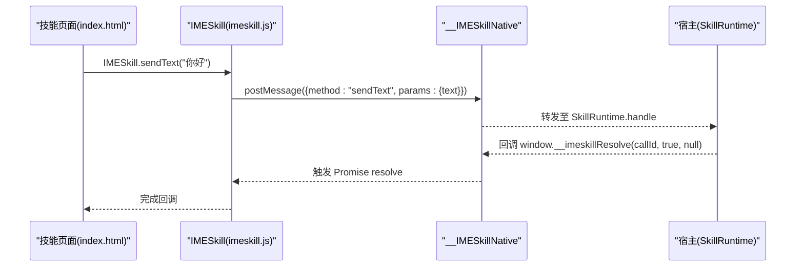
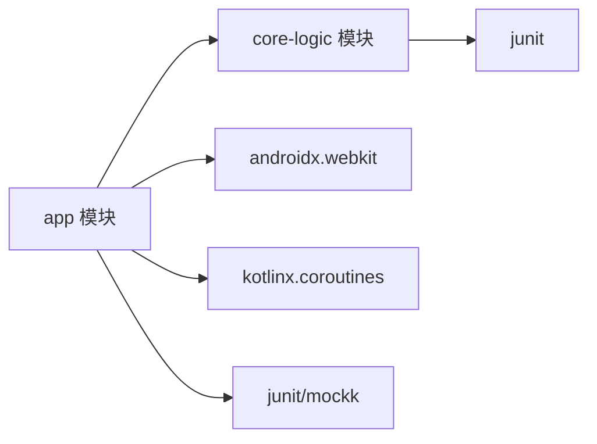

# 调试与测试

<cite>
**本文引用的文件**   
- [AndroidManifest.xml](file://app/src/main/AndroidManifest.xml)
- [build.gradle.kts（应用模块）](file://app/build.gradle.kts)
- [build.gradle.kts（根工程）](file://build.gradle.kts)
- [gradle.properties](file://gradle.properties)
- [SkillRuntime.kt](file://app/src/main/java/com/ziyou/ime/skill/SkillRuntime.kt)
- [SkillManager.kt](file://app/src/main/java/com/ziyou/ime/skill/SkillManager.kt)
- [SkillManifestValidator.kt](file://core-logic/src/main/java/com/ziyou/ime/core/skill/SkillManifestValidator.kt)
- [imeskill.js](file://app/src/main/assets/skill_runtime/imeskill.js)
- [calculator manifest.json](file://app/src/main/assets/skills/calculator/manifest.json)
- [skills-dev manifest.json](file://skills-dev/com.user.constellation/manifest.json)
- [SkillRuntimeImageTest.kt](file://app/src/test/java/com/ziyou/ime/skill/SkillRuntimeImageTest.kt)
- [SkillManifestValidatorTest.kt](file://core-logic/src/test/java/com/ziyou/ime/core/skill/SkillManifestValidatorTest.kt)
- [core-logic build.gradle.kts](file://core-logic/build.gradle.kts)
</cite>

## 目录
1. [简介](#简介)
2. [项目结构](#项目结构)
3. [核心组件](#核心组件)
4. [架构总览](#架构总览)
5. [详细组件分析](#详细组件分析)
6. [依赖关系分析](#依赖关系分析)
7. [性能考量](#性能考量)
8. [故障排查指南](#故障排查指南)
9. [结论](#结论)
10. [附录](#附录)

## 简介
本指南面向“技能插件”开发者与维护者，覆盖本地开发环境搭建、浏览器预调与 mock 垫片使用、静态资源准备、真机调试方法（Chrome DevTools 远程调试、logcat、断点）、测试策略（单元、集成、UI）、常见问题诊断与解决、性能分析工具使用，以及自动化测试与持续集成配置示例。内容基于仓库现有实现，确保可操作性与可追溯性。

## 项目结构
- 应用模块 app：包含输入法服务、技能运行时、WebView 注入的 Bridge 垫片、内置技能资源与测试用例。
- 纯逻辑模块 core-logic：承载与 Android 框架解耦的校验器、版本比较器等，便于独立单元测试。
- 构建与脚本：Gradle 配置统一了编译选项、NDK 打包、测试运行参数与文档同步任务。

图表来源 
- [build.gradle.kts（应用模块）:157-206](file://app/build.gradle.kts#L157-L206)
- [core-logic build.gradle.kts:1-29](file://core-logic/build.gradle.kts#L1-L29)

章节来源
- [build.gradle.kts（应用模块）:1-206](file://app/build.gradle.kts#L1-L206)
- [build.gradle.kts（根工程）:1-7](file://build.gradle.kts#L1-L7)
- [gradle.properties:1-24](file://gradle.properties#L1-L24)

## 核心组件
- 技能运行时 SkillRuntime：实现 Bridge API（sendText、getContext、getLocale、haptic、storage.*、ui.*、clipboard.*、input.*、fetch、image.*），负责权限校验、限额控制、IO 异步处理与宿主能力调用。
- 技能管理器 SkillManager：枚举内置与已安装技能，提供 openResource 统一读取入口，支持 assets 与内部存储两种来源。
- 清单校验 SkillManifestValidator：对 manifest 字段进行合法性校验，返回错误列表，用于安装/加载失败时的用户提示。
- Bridge 垫片 imeskill.js：在 WebView 中注入的全局 IMESkill API，封装 Promise 调用并通过 __IMESkillNative.postMessage 与宿主通信。

章节来源
- [SkillRuntime.kt:1-521](file://app/src/main/java/com/ziyou/ime/skill/SkillRuntime.kt#L1-L521)
- [SkillManager.kt:1-110](file://app/src/main/java/com/ziyou/ime/skill/SkillManager.kt#L1-L110)
- [SkillManifestValidator.kt:1-78](file://core-logic/src/main/java/com/ziyou/ime/core/skill/SkillManifestValidator.kt#L1-L78)
- [imeskill.js:1-164](file://app/src/main/assets/skill_runtime/imeskill.js#L1-L164)

## 架构总览
技能插件系统采用“宿主 + WebView + Bridge 垫片”的架构：
- 宿主（App/IME Service）通过 SkillRuntime 暴露能力；
- WebView 加载技能页面，注入 imeskill.js 作为前端 API；
- 前端通过 Promise 调用 Bridge，宿主侧按权限与白名单执行并回调结果。

图表来源 
- [imeskill.js:1-164](file://app/src/main/assets/skill_runtime/imeskill.js#L1-L164)
- [SkillRuntime.kt:368-471](file://app/src/main/java/com/ziyou/ime/skill/SkillRuntime.kt#L368-L471)

章节来源
- [SkillRuntime.kt:1-521](file://app/src/main/java/com/ziyou/ime/skill/SkillRuntime.kt#L1-L521)
- [imeskill.js:1-164](file://app/src/main/assets/skill_runtime/imeskill.js#L1-L164)

## 详细组件分析

### 技能运行时 SkillRuntime
- 职责：集中实现所有 Bridge API，包括文本上屏、上下文获取、语言设置、震动反馈、KV 存储、面板 UI 控制、剪贴板读写、输入路由、网络代理与图片输出。
- 关键特性：
  - 权限模型：基于 manifest.permissions 的细粒度权限控制（network、storage、image、clipboard_*）。
  - 安全限制：fetch 强制 HTTPS、域名白名单精确匹配、禁用重定向、超时与响应大小限制、频控与并发限制。
  - 异步 IO：storage 与 image 操作走协程 IO 调度器，避免阻塞主线程；主线程仅做参数校验与最终回调。
  - 资源路径安全：openResource 使用 canonicalPath 校验防止 Zip Slip。
- 典型流程：handle(method, params) 分发到具体处理器，成功以 JSON 字符串回传，失败抛出 SkillApiException 透传给脚本 reject。

图表来源 
- [SkillRuntime.kt:1-521](file://app/src/main/java/com/ziyou/ime/skill/SkillRuntime.kt#L1-L521)

章节来源
- [SkillRuntime.kt:1-521](file://app/src/main/java/com/ziyou/ime/skill/SkillRuntime.kt#L1-L521)

### 技能管理器 SkillManager
- 职责：列举内置与已安装技能，提供 openResource 统一读取入口，屏蔽 assets 与内部存储差异。
- 关键点：
  - 内置技能位于 assets/skills/<dir>/，已安装技能位于 filesDir/skills/<id>/。
  - 安装目录读取时二次校验 canonicalPath，防御路径穿越攻击。
  - 解析 manifest 失败时记录日志并跳过该技能，不影响其他技能。

图表来源 
- [SkillManager.kt:1-110](file://app/src/main/java/com/ziyou/ime/skill/SkillManager.kt#L1-L110)

章节来源
- [SkillManager.kt:1-110](file://app/src/main/java/com/ziyou/ime/skill/SkillManager.kt#L1-L110)

### 清单校验 SkillManifestValidator
- 职责：校验 manifest 字段合法性，包括版本、id、名称、版本号、minHostApi、entry 路径、permissions 与 networkDomains。
- 关键点：
  - 支持 HOST_API_VERSION 协商，拒绝高于宿主的 minHostApi。
  - entry 必须为相对 .html 路径，禁止绝对路径与逃逸。
  - networkDomains 需配套 network 权限，且域名格式严格校验。

图表来源 
- [SkillManifestValidator.kt:1-78](file://core-logic/src/main/java/com/ziyou/ime/core/skill/SkillManifestValidator.kt#L1-L78)

章节来源
- [SkillManifestValidator.kt:1-78](file://core-logic/src/main/java/com/ziyou/ime/core/skill/SkillManifestValidator.kt#L1-L78)

### Bridge 垫片 imeskill.js
- 职责：在 WebView 中注入全局 IMESkill API，封装 Promise 调用，通过 __IMESkillNative.postMessage 与宿主通信，并由 window.__imeskillResolve 异步回传结果。
- 关键点：
  - 幂等注入：重复初始化不重复创建。
  - 输入路由：支持 requestFocus/releaseFocus 将键盘输入注入指定 input/textarea。
  - fetch 代理：统一返回 {status, body}，支持 POST 方法与自定义 Content-Type。
  - image 输出：仅接受 PNG（base64，容忍 data URL 前缀）。

图表来源 
- [imeskill.js:1-164](file://app/src/main/assets/skill_runtime/imeskill.js#L1-L164)
- [SkillRuntime.kt:142-157](file://app/src/main/java/com/ziyou/ime/skill/SkillRuntime.kt#L142-L157)

章节来源
- [imeskill.js:1-164](file://app/src/main/assets/skill_runtime/imeskill.js#L1-L164)
- [SkillRuntime.kt:1-521](file://app/src/main/java/com/ziyou/ime/skill/SkillRuntime.kt#L1-L521)

### 技能清单示例
- 内置计算器清单：声明基础字段与权限为空。
- 用户开发清单：声明 needs_input 与 storage 权限，体现提升挂载与持久化能力。

章节来源
- [calculator manifest.json:1-14](file://app/src/main/assets/skills/calculator/manifest.json#L1-L14)
- [skills-dev manifest.json:1-15](file://skills-dev/com.user.constellation/manifest.json#L1-L15)

## 依赖关系分析
- 模块依赖：app 依赖 core-logic，单向边界由编译器保证。
- 运行时依赖：SkillRuntime 依赖宿主 Host 接口；SkillManager 依赖 Context 与文件系统；SkillManifestValidator 为纯逻辑无外部依赖。
- 构建依赖：应用模块启用 Compose、Webkit、Coroutines、JUnit/MockK 等；core-logic 仅依赖 JUnit。

图表来源 
- [build.gradle.kts（应用模块）:157-206](file://app/build.gradle.kts#L157-L206)
- [core-logic build.gradle.kts:1-29](file://core-logic/build.gradle.kts#L1-L29)

章节来源
- [build.gradle.kts（应用模块）:1-206](file://app/build.gradle.kts#L1-L206)
- [core-logic build.gradle.kts:1-29](file://core-logic/build.gradle.kts#L1-L29)

## 性能考量
- 内存占用监控：
  - 使用 Android Studio Profiler 观察 Java/Kotlin 堆与 GC 行为，关注 SkillRuntime 协程作用域释放时机。
  - 针对图片处理路径，注意 base64 解码与临时文件落盘带来的峰值内存。
- 网络请求分析：
  - 使用 Chrome DevTools Network 或系统抓包工具查看 fetch 代理请求，确认 HTTPS、域名白名单命中与响应大小。
  - 关注频控与并发限制是否导致请求排队或拒绝。
- 渲染性能优化：
  - WebView 页面应避免大 DOM 与频繁重排，合理使用 CSS 动画与懒加载。
  - 技能面板高度与展开状态切换应平滑，避免布局抖动。

[本节为通用指导，不直接分析具体文件]

## 故障排查指南
- manifest 校验失败：
  - 常见原因：manifest_version 不支持、id 格式非法、name 超长、version 非数字点分、minHostApi 高于宿主、entry 非 .html 或路径不安全、networkDomains 未声明 network 权限、域名格式非法。
  - 定位方法：查看 SkillManifestValidator.validate 返回的错误列表；参考单元测试 SkillManifestValidatorTest。
- 权限拒绝：
  - 现象：调用 storage、clipboard、image、network 等方法时报错。
  - 定位方法：检查 manifest.permissions 是否包含对应权限；查看 SkillRuntime.requirePermission 抛出的异常信息。
- 网络请求失败：
  - 现象：fetch 返回错误或超时。
  - 定位方法：确认 URL 协议为 HTTPS、域名在白名单内、未触发频控/并发限制；查看 executeFetch 中的超时与响应大小限制。
- 图片发送失败：
  - 现象：image.send 失败或保存相册失败。
  - 定位方法：检查编辑器是否接受图片、base64 是否为 PNG、系统版本是否满足要求；查看 writeImageFile 与 insertToGallery 的实现。
- 输入路由问题：
  - 现象：键盘输入未注入面板输入框。
  - 定位方法：确认 manifest 声明 needs_input；检查 requestFocus 与 releaseFocus 调用顺序；验证目标元素 id 存在。

章节来源
- [SkillManifestValidator.kt:1-78](file://core-logic/src/main/java/com/ziyou/ime/core/skill/SkillManifestValidator.kt#L1-L78)
- [SkillRuntime.kt:1-521](file://app/src/main/java/com/ziyou/ime/skill/SkillRuntime.kt#L1-L521)
- [SkillManifestValidatorTest.kt:1-107](file://core-logic/src/test/java/com/ziyou/ime/core/skill/SkillManifestValidatorTest.kt#L1-L107)
- [SkillRuntimeImageTest.kt:1-246](file://app/src/test/java/com/ziyou/ime/skill/SkillRuntimeImageTest.kt#L1-L246)

## 结论
本指南围绕技能插件系统的运行时、管理器、清单校验与 Bridge 垫片，提供了从本地开发到真机调试、从单元测试到性能分析的完整实践路径。通过严格的权限与安全校验、清晰的异步处理与完善的测试覆盖，开发者可以高效地开发与维护技能插件。

[本节为总结性内容，不直接分析具体文件]

## 附录

### 本地开发环境搭建
- 构建与运行：
  - 使用 Gradle 构建应用模块，启用 Compose 与 NDK 打包；默认最小 SDK 24，目标 SDK 35。
  - 文档同步任务会在构建时将 docs/ 下的开发文档拷贝至 assets/docs，供应用内展示。
- 浏览器预调与 mock 垫片：
  - 在 WebView 中注入 imeskill.js 作为前端 API，模拟真实宿主能力；可通过替换 __IMESkillNative.postMessage 实现本地 mock。
- 静态资源准备：
  - 内置技能位于 assets/skills/<dir>/，每个技能包含 index.html 与 manifest.json；开发阶段可在 skills-dev/ 下维护用户技能样例。

章节来源
- [build.gradle.kts（应用模块）:113-156](file://app/build.gradle.kts#L113-L156)
- [build.gradle.kts（应用模块）:1-112](file://app/build.gradle.kts#L1-L112)
- [imeskill.js:1-164](file://app/src/main/assets/skill_runtime/imeskill.js#L1-L164)
- [calculator manifest.json:1-14](file://app/src/main/assets/skills/calculator/manifest.json#L1-L14)
- [skills-dev manifest.json:1-15](file://skills-dev/com.user.constellation/manifest.json#L1-L15)

### 真机调试方法
- Chrome DevTools 远程调试：
  - 在 WebView 中启用调试端口，连接后查看 Console、Network、Sources 面板，断点调试 imeskill.js 与技能页面脚本。
- logcat 日志查看：
  - 过滤 TAG 如 “SkillRuntime”、“SkillManager”，观察权限校验、网络请求、图片处理与存储操作的日志。
- 断点调试技巧：
  - 在 SkillRuntime.handle 与各子处理器设置断点，结合参数 JSON 与返回值 Result 快速定位问题。

[本节为通用指导，不直接分析具体文件]

### 测试策略
- 单元测试：
  - 使用 JUnit 与 MockK 对 SkillRuntime 与 SkillManifestValidator 进行测试，覆盖权限拒绝、参数校验、IO 路径与异常分支。
  - 参考 SkillRuntimeImageTest 与 SkillManifestValidatorTest 的测试结构与断言方式。
- 集成测试：
  - 通过 Instrumentation Runner 运行 androidTest，验证 WebView 注入、Bridge 通信与宿主能力联调。
- UI 测试：
  - 使用 Espresso 与 Compose UI Testing 验证技能面板交互、输入路由与图片提交流程。

章节来源
- [build.gradle.kts（应用模块）:105-111](file://app/build.gradle.kts#L105-L111)
- [build.gradle.kts（应用模块）:193-206](file://app/build.gradle.kts#L193-L206)
- [SkillRuntimeImageTest.kt:1-246](file://app/src/test/java/com/ziyou/ime/skill/SkillRuntimeImageTest.kt#L1-L246)
- [SkillManifestValidatorTest.kt:1-107](file://core-logic/src/test/java/com/ziyou/ime/core/skill/SkillManifestValidatorTest.kt#L1-L107)

### 常见问题排查
- manifest 校验失败：检查字段格式与权限声明，参考校验器与测试用例。
- 权限拒绝：确认 manifest.permissions 包含所需权限。
- 网络请求失败：确认 HTTPS、域名白名单、频控与并发限制。
- 图片发送失败：检查 PNG 数据、编辑器支持与系统版本。
- 输入路由问题：确认 needs_input 与焦点管理。

章节来源
- [SkillManifestValidator.kt:1-78](file://core-logic/src/main/java/com/ziyou/ime/core/skill/SkillManifestValidator.kt#L1-L78)
- [SkillRuntime.kt:1-521](file://app/src/main/java/com/ziyou/ime/skill/SkillRuntime.kt#L1-L521)

### 性能分析工具使用指南
- 内存占用监控：使用 Android Studio Profiler 观察堆与 GC，关注协程作用域释放与临时文件清理。
- 网络请求分析：使用抓包工具或 DevTools 查看 fetch 代理请求，确认白名单命中与响应大小。
- 渲染性能优化：优化 WebView 页面 DOM 与样式，减少重排与重绘。

[本节为通用指导，不直接分析具体文件]

### 自动化测试脚本与持续集成配置示例
- 本地运行测试：
  - 使用 gradlew 执行单元测试与仪器化测试，确保 testOptions 中 isReturnDefaultValues=true 以兼容 Android 桩。
- CI 配置建议：
  - 在 CI 环境中安装 JDK 21（Android Studio JBR），配置 Gradle 缓存与并行构建，执行构建与测试任务。
  - 生成测试报告与覆盖率，上传至 CI 平台以便审查。

章节来源
- [build.gradle.kts（应用模块）:105-111](file://app/build.gradle.kts#L105-L111)
- [gradle.properties:1-24](file://gradle.properties#L1-L24)