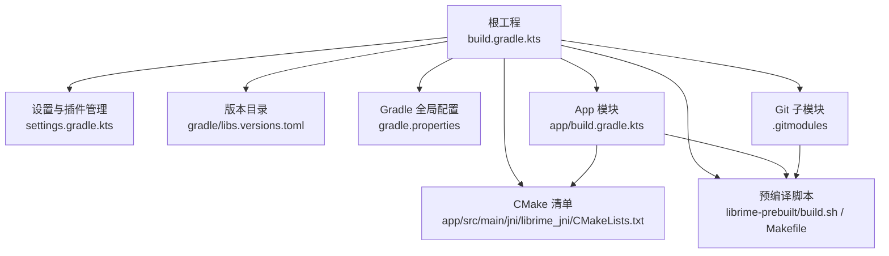
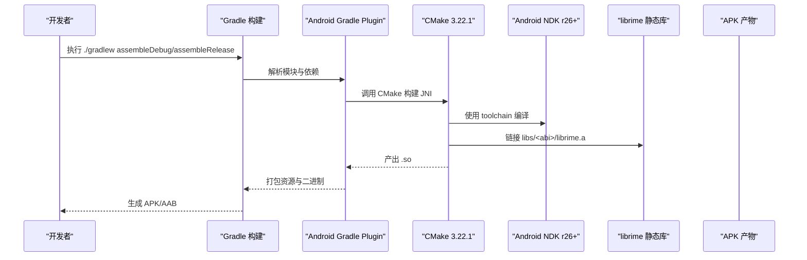
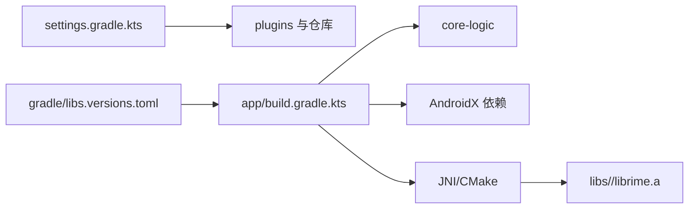

# 环境搭建

<cite>
**本文引用的文件**   
- [gradle.properties](file://gradle.properties)
- [build.gradle.kts](file://build.gradle.kts)
- [settings.gradle.kts](file://settings.gradle.kts)
- [app/build.gradle.kts](file://app/build.gradle.kts)
- [gradle/libs.versions.toml](file://gradle/libs.versions.toml)
- [.gitmodules](file://.gitmodules)
- [librime-prebuilt/build.sh](file://librime-prebuilt/build.sh)
- [librime-prebuilt/Makefile](file://librime-prebuilt/Makefile)
- [keystore.properties.template](file://keystore.properties.template)
- [app/src/main/jni/librime_jni/CMakeLists.txt](file://app/src/main/jni/librime_jni/CMakeLists.txt)
- [gradle/gradle-daemon-jvm.properties](file://gradle/gradle-daemon-jvm.properties)
</cite>

## 目录
1. [简介](#简介)
2. [项目结构](#项目结构)
3. [核心组件](#核心组件)
4. [架构总览](#架构总览)
5. [详细组件分析](#详细组件分析)
6. [依赖分析](#依赖分析)
7. [性能考虑](#性能考虑)
8. [故障排查指南](#故障排查指南)
9. [结论](#结论)
10. [附录](#附录)

## 简介
本指南面向首次搭建字由输入法 Android 项目的开发者，提供从工具链安装、Gradle/AGP 配置、NDK/CMake 准备、Git 子模块初始化与构建、arm64-v8a 库获取、签名配置到常见问题排查的完整步骤。目标是确保在本地环境中顺利编译并运行应用。

## 项目结构
- 顶层 Gradle 脚本统一插件版本与仓库源，启用 Foojay Toolchains 自动解析 JDK 21。
- app 模块包含 Android 应用、JNI 层 CMake 构建与签名配置。
- core-logic 为纯 Kotlin 逻辑模块（无 JNI）。
- librime-prebuilt 提供预编译脚本与 Makefile，用于交叉编译 librime 静态库并输出到 libs/<abi>/librime.a。
- .gitmodules 声明了 librime 源码与 predict 插件两个子模块路径与远端地址。

**图表来源** 
- [build.gradle.kts:1-7](file://build.gradle.kts#L1-L7)
- [settings.gradle.kts:1-28](file://settings.gradle.kts#L1-L28)
- [gradle/libs.versions.toml:1-51](file://gradle/libs.versions.toml#L1-L51)
- [gradle.properties:1-24](file://gradle.properties#L1-L24)
- [app/build.gradle.kts:1-192](file://app/build.gradle.kts#L1-L192)
- [app/src/main/jni/librime_jni/CMakeLists.txt:1-78](file://app/src/main/jni/librime_jni/CMakeLists.txt#L1-L78)
- [librime-prebuilt/build.sh:1-198](file://librime-prebuilt/build.sh#L1-L198)
- [librime-prebuilt/Makefile:1-36](file://librime-prebuilt/Makefile#L1-L36)
- [.gitmodules:1-7](file://.gitmodules#L1-L7)

**章节来源**
- [build.gradle.kts:1-7](file://build.gradle.kts#L1-L7)
- [settings.gradle.kts:1-28](file://settings.gradle.kts#L1-L28)
- [gradle/libs.versions.toml:1-51](file://gradle/libs.versions.toml#L1-L51)
- [gradle.properties:1-24](file://gradle.properties#L1-L24)

## 核心组件
- 工具链与版本
  - AGP：9.3.0（通过版本目录统一管理）
  - Kotlin：2.2.10
  - Gradle：9.x（由 settings 中 foojay-resolver 与 gradle-wrapper 共同决定）
  - CMake：3.22.1（app 模块外部构建指定）
  - NDK：r26+（构建脚本要求具备 android.toolchain.cmake）
  - JDK：21（Gradle 工具链与 daemon 使用）
- 关键配置点
  - gradle.properties：JDK 安装路径、禁用 IDE 自动探测、JVM 参数与配置缓存
  - gradle/libs.versions.toml：AGP/Kotlin/Compose 等版本集中管理
  - settings.gradle.kts：插件仓库、Foojay Toolchains 约定、模块包含
  - app/build.gradle.kts：compileSdk/targetSdk/minSdk、ABI 过滤、CMake 版本、签名、ProGuard、JNI 打包策略
  - CMakeLists.txt：WITH_PREDICT 开关、头文件与静态库路径、链接系统库
  - build.sh/Makefile：NDK/CMake 自动探测、多 ABI 构建、可选插件开关

**章节来源**
- [gradle/libs.versions.toml:1-51](file://gradle/libs.versions.toml#L1-L51)
- [gradle.properties:1-24](file://gradle.properties#L1-L24)
- [settings.gradle.kts:1-28](file://settings.gradle.kts#L1-L28)
- [app/build.gradle.kts:1-192](file://app/build.gradle.kts#L1-L192)
- [app/src/main/jni/librime_jni/CMakeLists.txt:1-78](file://app/src/main/jni/librime_jni/CMakeLists.txt#L1-L78)
- [librime-prebuilt/build.sh:1-198](file://librime-prebuilt/build.sh#L1-L198)
- [librime-prebuilt/Makefile:1-36](file://librime-prebuilt/Makefile#L1-L36)

## 架构总览
下图展示了从 Gradle 构建到 CMake/Ndk 编译再到最终 APK 产物的整体流程，以及 librime 预编译库的生成位置与依赖关系。

**图表来源** 
- [app/build.gradle.kts:92-97](file://app/build.gradle.kts#L92-L97)
- [app/src/main/jni/librime_jni/CMakeLists.txt:52-77](file://app/src/main/jni/librime_jni/CMakeLists.txt#L52-L77)
- [librime-prebuilt/build.sh:160-193](file://librime-prebuilt/build.sh#L160-L193)

## 详细组件分析

### 工具链与环境要求
- Android Studio：建议使用最新版，以匹配 AGP 9.x 与 Kotlin 2.2.x。
- JDK 21：Gradle 工具链与 daemon 使用；可通过 Foojay 自动下载或指向本地安装路径。
- NDK r26+：需包含 cmake/android.toolchain.cmake，用于交叉编译。
- CMake 3.22.1：app 模块外部构建强制指定该版本。

验证要点
- 在终端执行 Gradle 任务时，若未显式配置 JDK 路径，将回退到 settings 中的 Foojay 解析与 gradle-daemon-jvm.properties 指定的版本 21。
- NDK 可通过环境变量或 local.properties/sdk.dir 自动探测。

**章节来源**
- [gradle.properties:20-24](file://gradle.properties#L20-L24)
- [gradle/gradle-daemon-jvm.properties:1-13](file://gradle/gradle-daemon-jvm.properties#L1-L13)
- [settings.gradle.kts:14-16](file://settings.gradle.kts#L14-L16)
- [app/build.gradle.kts:92-97](file://app/build.gradle.kts#L92-L97)
- [librime-prebuilt/build.sh:52-88](file://librime-prebuilt/build.sh#L52-L88)

### Gradle 与 AGP 配置
- 版本管理：所有版本集中在 gradle/libs.versions.toml，避免散落在各模块。
- 插件与仓库：settings 中声明 google/mavenCentral/gradlePluginPortal，并通过 foojay-resolver 规范工具链。
- 全局 JVM 参数：gradle.properties 中配置 org.gradle.jvmargs 与配置缓存。
- JDK 安装路径：通过 org.gradle.java.installations.paths 指向 Android Studio JBR，并关闭自动检测以避免 IDE 内置 JRE 干扰。

建议
- 保持 AGP 与 Kotlin 版本一致，避免不兼容。
- 开启配置缓存以提升增量构建速度。

**章节来源**
- [gradle/libs.versions.toml:1-51](file://gradle/libs.versions.toml#L1-L51)
- [settings.gradle.kts:1-28](file://settings.gradle.kts#L1-L28)
- [gradle.properties:1-24](file://gradle.properties#L1-L24)

### Git 子模块与 librime 预编译库
- 子模块定义：.gitmodules 声明 librime 源码与 predict 插件的路径与远端仓库。
- 初始化流程：
  - 克隆仓库后执行 git submodule update --init --recursive，拉取 librime 及其依赖子模块。
  - 进入 librime-prebuilt 目录，执行 make 或 ./build.sh 进行多 ABI 构建。
  - 构建产物输出至 ../libs/<abi>/librime.a 与 include/rime_api.h。
- 可选插件：通过 WITH_PREDICT=ON 等环境变量控制是否编译 predict 等模块。

注意
- 若缺少依赖子模块（如 glog、yaml-cpp、leveldb、marisa-trie、opencc），构建会失败，需先完成子模块初始化。
- 构建脚本会自动探测 NDK 与 CMake，若失败请检查环境变量或 SDK 路径。

**章节来源**
- [.gitmodules:1-7](file://.gitmodules#L1-L7)
- [librime-prebuilt/build.sh:130-155](file://librime-prebuilt/build.sh#L130-L155)
- [librime-prebuilt/build.sh:160-193](file://librime-prebuilt/build.sh#L160-L193)
- [librime-prebuilt/Makefile:10-28](file://librime-prebuilt/Makefile#L10-L28)

### arm64-v8a 架构库获取
- 默认 ABI：app 模块 releaseAbis 默认为 ["arm64-v8a"]，可通过 -Pziyou.abis 覆盖。
- 构建命令：在 librime-prebuilt 目录下执行 make 或 ./build.sh 即可生成对应 ABI 的静态库。
- 产物位置：libs/arm64-v8a/librime.a 与 libs/include/rime_api.h。

验证
- 确认 libs/arm64-v8a/librime.a 存在且非空。
- CMake 构建时应能打印 Found librime 信息。

**章节来源**
- [app/build.gradle.kts:16-21](file://app/build.gradle.kts#L16-L21)
- [librime-prebuilt/build.sh:160-193](file://librime-prebuilt/build.sh#L160-L193)
- [app/src/main/jni/librime_jni/CMakeLists.txt:62-72](file://app/src/main/jni/librime_jni/CMakeLists.txt#L62-L72)

### 签名配置（keystore.properties）
- 模板文件：keystore.properties.template 提供字段说明与示例。
- 使用方法：
  - 复制模板为 keystore.properties（该文件被 .gitignore 忽略，勿提交）。
  - 填入 storeFile、storePassword、keyAlias、keyPassword。
  - 支持相对仓库根路径或绝对路径。
- 构建行为：
  - 存在 keystore.properties 时，release 构建会使用正式签名。
  - 不存在则产出未签名 APK（便于 CI 校验）。

安全建议
- 妥善保管密钥库，丢失将无法覆盖升级。
- 不要将 keystore.properties 提交到版本库。

**章节来源**
- [keystore.properties.template:1-12](file://keystore.properties.template#L1-L12)
- [app/build.gradle.kts:8-14](file://app/build.gradle.kts#L8-L14)
- [app/build.gradle.kts:50-59](file://app/build.gradle.kts#L50-L59)
- [app/build.gradle.kts:78-80](file://app/build.gradle.kts#L78-L80)

### JNI 与 CMake 集成
- CMake 清单：
  - 指定 C++17 标准与 WITH_PREDICT 等选项。
  - 计算 ZIYOU_IME_ROOT 并定位 libs/include 与 libs/${ANDROID_ABI}。
  - 链接 librime.a 与系统库 log。
- 构建参数：
  - app/build.gradle.kts 中 externalNativeBuild.cmake.version 固定为 3.22.1。
  - defaultConfig.externalNativeBuild.arguments 传递 WITH_PREDICT=ON。

注意
- 若未生成对应 ABI 的 librime.a，CMake 会报找不到库的错误。
- WITH_PREDICT 开关必须与 librime-prebuilt 侧的 WITH_PREDICT 一致，否则会出现符号缺失。

**章节来源**
- [app/src/main/jni/librime_jni/CMakeLists.txt:1-78](file://app/src/main/jni/librime_jni/CMakeLists.txt#L1-L78)
- [app/build.gradle.kts:40-47](file://app/build.gradle.kts#L40-L47)
- [app/build.gradle.kts:92-97](file://app/build.gradle.kts#L92-L97)

## 依赖分析
- 插件与仓库：
  - settings 中启用 google、mavenCentral、gradlePluginPortal。
  - 通过 alias(libs.plugins.*) 引用 AGP/Kotlin Compose 插件。
- 版本集中管理：
  - gradle/libs.versions.toml 统一管理 AGP、Kotlin、Compose BOM 等版本。
- 模块依赖：
  - app 依赖 core-logic 与大量 AndroidX 库。
  - JNI 层依赖 librime 静态库与系统库。

**图表来源** 
- [settings.gradle.kts:1-28](file://settings.gradle.kts#L1-L28)
- [gradle/libs.versions.toml:1-51](file://gradle/libs.versions.toml#L1-L51)
- [app/build.gradle.kts:143-191](file://app/build.gradle.kts#L143-L191)

**章节来源**
- [settings.gradle.kts:1-28](file://settings.gradle.kts#L1-L28)
- [gradle/libs.versions.toml:1-51](file://gradle/libs.versions.toml#L1-L51)
- [app/build.gradle.kts:143-191](file://app/build.gradle.kts#L143-L191)

## 性能考虑
- 开启 Gradle 配置缓存（org.gradle.configuration-cache=true）以减少配置阶段耗时。
- 合理设置 org.gradle.jvmargs（例如 -Xmx2048m）避免内存不足。
- 使用增量构建与并行构建（org.gradle.parallel=true 视项目情况启用）。
- 对 JNI 重度应用，保持 ProGuard 压缩但关闭激进优化，避免破坏反射与 JNI 符号。

[本节为通用指导，无需特定文件引用]

## 故障排查指南
- JDK 版本冲突
  - 现象：Gradle 使用 IDE 内置 JRE 导致 jlink 不可用或工具链解析失败。
  - 解决：确保 gradle.properties 中 org.gradle.java.installations.paths 指向 Android Studio JBR，并关闭自动检测。
- NDK 路径错误
  - 现象：构建脚本提示未找到 NDK 或 android.toolchain.cmake。
  - 解决：设置 ANDROID_NDK_HOME 或 ANDROID_NDK，或在 local.properties 中配置 sdk.dir，确保 SDK 中包含 ndk 目录。
- CMake 编译失败
  - 现象：CMake 报找不到 librime.a 或符号缺失。
  - 解决：确认已为对应 ABI 生成 libs/<abi>/librime.a；确保 WITH_PREDICT 开关与 CMake 清单一致。
- 子模块缺失
  - 现象：依赖子模块（glog、yaml-cpp 等）缺失导致构建失败。
  - 解决：执行 git submodule update --init --recursive 初始化依赖。
- 签名问题
  - 现象：release 构建无法签名或 APK 未签名。
  - 解决：确保 keystore.properties 存在且字段正确；若无则仅产出未签名 APK。

验证命令与预期输出
- 检查 Gradle 工具链与 Java 版本：
  - 命令：./gradlew --version
  - 预期：显示 Gradle 版本与使用的 Java 版本（应为 21）。
- 检查 NDK 与 CMake：
  - 命令：cd librime-prebuilt && ./build.sh arm64-v8a
  - 预期：输出“使用 NDK”“使用 CMake”，并在 libs/arm64-v8a 下生成 librime.a。
- 检查 JNI 构建：
  - 命令：./gradlew :app:externalNativeBuildDebug
  - 预期：CMake 打印 Found librime 信息并成功生成 .so。
- 检查签名：
  - 命令：./gradlew :app:assembleRelease
  - 预期：若存在 keystore.properties 则生成已签名 APK；否则生成未签名 APK。

**章节来源**
- [gradle.properties:20-24](file://gradle.properties#L20-L24)
- [librime-prebuilt/build.sh:52-88](file://librime-prebuilt/build.sh#L52-L88)
- [librime-prebuilt/build.sh:160-193](file://librime-prebuilt/build.sh#L160-L193)
- [app/src/main/jni/librime_jni/CMakeLists.txt:62-72](file://app/src/main/jni/librime_jni/CMakeLists.txt#L62-L72)
- [app/build.gradle.kts:78-80](file://app/build.gradle.kts#L78-L80)

## 结论
按照本指南完成 JDK 21、NDK r26+、CMake 3.22.1 的安装与配置，结合 Gradle 9.x + AGP 9.x 的版本管理与工具链解析，即可完成 librime 预编译库的构建与 JNI 集成。遵循子模块初始化与 ABI 构建流程，配合 keystore.properties 签名配置，即可稳定产出可安装的 APK/AAB。遇到问题时，依据排查指南逐项核对环境与配置，通常可快速定位并解决。

[本节为总结性内容，无需特定文件引用]

## 附录
- 常用命令速查
  - 初始化子模块：git submodule update --init --recursive
  - 构建 librime：cd librime-prebuilt && ./build.sh arm64-v8a
  - 清理构建：cd librime-prebuilt && make clean
  - 调试构建：./gradlew :app:assembleDebug --info
  - 发布构建：./gradlew :app:assembleRelease

[本节为补充信息，无需特定文件引用]