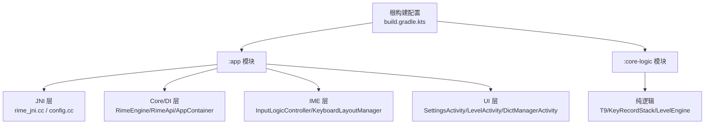
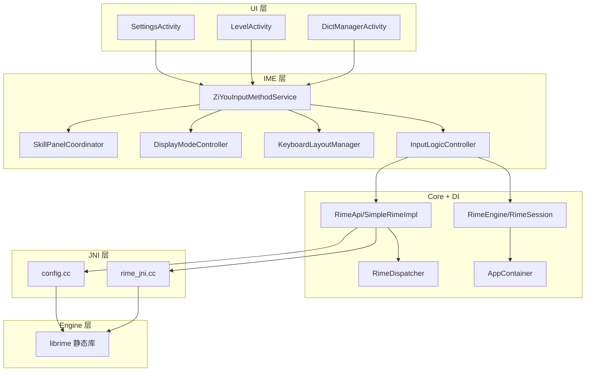
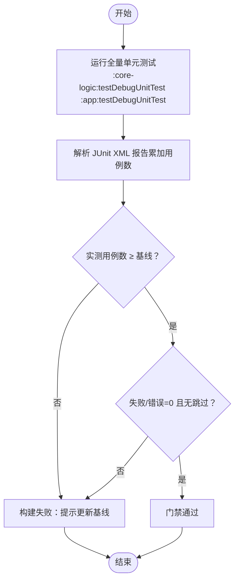
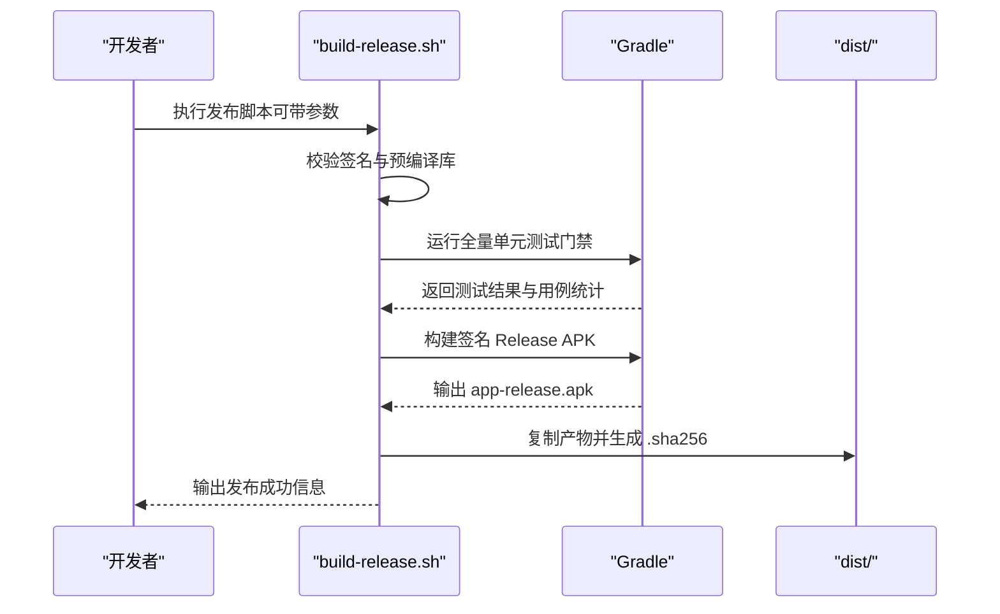
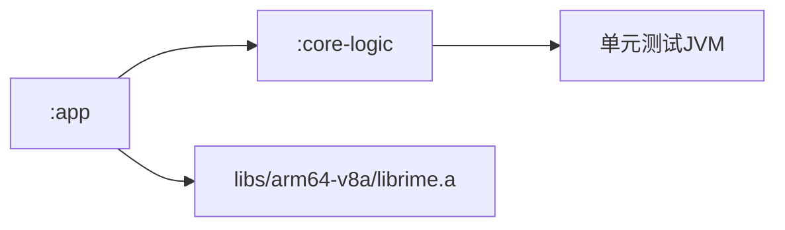

# 贡献指南

<cite>
**本文引用的文件**   
- [README.md](file://README.md)
- [AGENTS.md](file://AGENTS.md)
- [ARCHITECTURE.md](file://ARCHITECTURE.md)
- [build.gradle.kts](file://build.gradle.kts)
- [gradle.properties](file://gradle.properties)
- [scripts/build-release.sh](file://scripts/build-release.sh)
- [scripts/unit-test-baseline.txt](file://scripts/unit-test-baseline.txt)
</cite>

## 目录
1. [简介](#简介)
2. [项目结构](#项目结构)
3. [核心组件](#核心组件)
4. [架构总览](#架构总览)
5. [详细组件分析](#详细组件分析)
6. [依赖分析](#依赖分析)
7. [性能考量](#性能考量)
8. [故障排查指南](#故障排查指南)
9. [结论](#结论)
10. [附录](#附录)

## 简介
本指南面向希望参与字由输入法（Ziyou IME）项目的贡献者，涵盖从 Fork、分支管理、提交规范到 Pull Request 审查流程的完整路径；明确测试要求与基线维护规则；说明文档同步更新要求；给出发布流程与版本管理；并包含社区行为准则、沟通规范以及常见贡献场景的操作指引。

## 项目结构
本项目采用 Gradle 多模块组织：
- :app：Android 应用层，包含 JNI/引擎集成、IME 服务、UI 与业务域持久化
- :core-logic：纯 Kotlin 逻辑库，承载 T9 映射、九宫格状态机、等级计分等可独立单测的纯逻辑

构建与运行关键要点：
- 使用 AGP 9.x、Kotlin 2.2、Compose BOM 2026.02.01
- NDK r26+、CMake 3.22.1；当前仅打包 arm64-v8a ABI
- 单元测试命令与脚本见下文“测试要求”

图表来源
- [build.gradle.kts:1-7](file://build.gradle.kts#L1-L7)

章节来源
- [README.md:1-120](file://README.md#L1-L120)
- [AGENTS.md:1-65](file://AGENTS.md#L1-L65)
- [ARCHITECTURE.md:1-120](file://ARCHITECTURE.md#L1-L120)

## 核心组件
- 引擎接口与实现：RimeEngine（生命周期）、RimeApi（操作接口），生产实现为 RimeSession/SimpleRimeImpl，通过 AppContainer 注入
- 输入热路径：InputLogicController 负责按键处理、上屏路由与 UI 刷新回调
- 键盘布局：BaseKeyboardView 抽象 + Qwerty/NineGrid 具体实现，由 KeyboardLayoutManager 组装
- 消息流：SharedFlow 广播引擎通知（方案切换、选项变更、部署状态）
- 纯逻辑模块：:core-logic 中的 T9 映射、状态机、等级计分等，便于快速单测

章节来源
- [ARCHITECTURE.md:120-260](file://ARCHITECTURE.md#L120-L260)
- [ARCHITECTURE.md:260-420](file://ARCHITECTURE.md#L260-L420)
- [ARCHITECTURE.md:420-520](file://ARCHITECTURE.md#L420-L520)

## 架构总览
下图展示五层引擎栈与横向业务域的交互关系，以及依赖方向（单向向下）。

图表来源
- [ARCHITECTURE.md:1-120](file://ARCHITECTURE.md#L1-L120)
- [ARCHITECTURE.md:120-260](file://ARCHITECTURE.md#L120-L260)

## 详细组件分析

### 贡献工作流（Fork → 分支 → PR）
- Fork 仓库并在本地克隆
- 创建功能分支：feature/your-feature
- 开发过程中遵循代码规范与硬性约束（见后文）
- 提交更改：遵循 Conventional Commits
- 推送分支并提交 Pull Request
- 等待 CI 检查与代码审查

章节来源
- [README.md:319-352](file://README.md#L319-L352)
- [AGENTS.md:1-65](file://AGENTS.md#L1-L65)

### 代码审查流程
- 审查者职责
  - 确保改动符合架构约束与硬性约束（如 librime 非线程安全、RAII 资源管理、热路径零 IO）
  - 检查新增/修改的 API 是否保持向后兼容
  - 确认测试覆盖与用例数不下降（基线只增不减）
  - 评估性能影响（尤其是 JNI 往返与主线程阻塞）
- 审查清单
  - 命名与风格：Kotlin 官方规范、C++ .clang-format
  - 线程模型：所有 Rime 调用经 RimeDispatcher；输入事务串行化
  - 资源管理：JNI 层 RAII；避免内存泄漏
  - 数据流：消息流订阅者是否正确消费；缓存/阈值策略是否合理
  - 安全性：技能插件权限、网络白名单、Zip Slip 防护
- 反馈处理
  - 评审意见以评论形式标注，按优先级分类（阻断/建议/可选）
  - 作者需在合并前完成全部阻断项修复，其余项协商决定
  - 若涉及行为变更，需补充或更新测试与文档

章节来源
- [ARCHITECTURE.md:68-120](file://ARCHITECTURE.md#L68-L120)
- [ARCHITECTURE.md:460-520](file://ARCHITECTURE.md#L460-L520)

### 测试要求与基线维护
- 新增功能的单元测试
  - 纯逻辑必须下沉至 :core-logic 并提供对应单测
  - 涉及引擎的逻辑可通过 AppContainer.overrideRimeEngine() 注入替身进行测试
- 现有测试维护
  - 禁止跳过既有用例（@Ignore）使套件变绿
  - 删除用例需同步下调基线并说明理由
- 测试基线更新规则
  - 基线唯一来源：scripts/unit-test-baseline.txt
  - 运行全量单测后，将实测总数写入该文件（首个纯数字行即基线）
  - 正式发布脚本会校验失败/错误数为 0 且实测用例数不低于基线

图表来源
- [scripts/build-release.sh:100-165](file://scripts/build-release.sh#L100-L165)
- [scripts/unit-test-baseline.txt:1-13](file://scripts/unit-test-baseline.txt#L1-L13)

章节来源
- [AGENTS.md:1-65](file://AGENTS.md#L1-L65)
- [scripts/build-release.sh:100-165](file://scripts/build-release.sh#L100-L165)
- [scripts/unit-test-baseline.txt:1-13](file://scripts/unit-test-baseline.txt#L1-L13)

### 文档更新要求
- API 文档
  - 新增/变更 RimeApi、RimeEngine、配置管理等接口时，同步更新 ARCHITECTURE.md 的 API 参考表
- 用户手册
  - 输入方案、设置页功能、扩展词库、等级体系等使用说明需与 README.md 保持一致
- 技术文档
  - 架构变更、模块拆分、JNI 新增函数、线程模型调整等需更新 ARCHITECTURE.md 与 AGENTS.md 的硬性约束

章节来源
- [README.md:120-250](file://README.md#L120-L250)
- [ARCHITECTURE.md:520-632](file://ARCHITECTURE.md#L520-L632)
- [AGENTS.md:1-65](file://AGENTS.md#L1-L65)

### 发布流程与版本管理
- 版本号管理
  - 版本号来源于 app/build.gradle.kts 的 versionName
- 变更日志维护
  - 建议在 PR 中记录主要变更点，便于生成发布说明
- 发布渠道
  - 使用 scripts/build-release.sh 一键构建 Release APK，产物输出至 dist/
  - 支持 --abis 指定 ABI 列表、--rebuild-native 重建预编译库、--skip-tests 跳过测试（仅限本地验证）
- 前置条件
  - 存在 keystore.properties（签名配置）
  - libs/<abi>/librime.a 已就位或使用 --rebuild-native

图表来源
- [scripts/build-release.sh:1-195](file://scripts/build-release.sh#L1-L195)

章节来源
- [scripts/build-release.sh:1-195](file://scripts/build-release.sh#L1-L195)

### 社区行为准则与沟通规范
- 尊重与包容：在 Issue/PR 讨论中保持专业与礼貌
- 透明沟通：问题描述清晰，复现步骤完整；变更原因与影响范围明确
- 协作方式：优先在 PR 评论中讨论技术细节；重大决策形成文档沉淀
- 行为红线：禁止泄露用户隐私数据；技能插件不得读取其他应用输入内容

章节来源
- [ARCHITECTURE.md:68-120](file://ARCHITECTURE.md#L68-L120)

### 常见贡献场景操作指南
- Bug 修复
  - 定位问题：复现最小用例，必要时添加回归测试
  - 修复原则：最小改动、避免引入新风险；热路径零 IO 约束
  - 提交信息：fix: 描述修复的问题与影响范围
- 新功能开发
  - 设计先行：明确接口契约与数据流；纯逻辑下沉 :core-logic
  - 实现要点：遵循线程模型与 RAII；批量 JNI 减少跨界
  - 提交信息：feat: 描述新增能力与使用方式
- 文档改进
  - 更新 README.md/ARCHITECTURE.md/AGENTS.md 中与改动相关的部分
  - 保持术语一致，示例可运行

章节来源
- [README.md:319-352](file://README.md#L319-L352)
- [ARCHITECTURE.md:504-520](file://ARCHITECTURE.md#L504-L520)

### 如何报告问题与请求功能
- 报告问题
  - 提供设备型号、系统版本、复现步骤、期望与实际结果
  - 附上必要日志与截图；如涉及输入内容，请脱敏
- 请求功能
  - 描述使用场景、预期行为、对现有功能的影响
  - 如有可能，提供接口草案或伪代码

章节来源
- [README.md:319-352](file://README.md#L319-L352)

## 依赖分析
- 模块依赖方向
  - :app → :core-logic（单向，编译器强制）
- 运行时依赖
  - librime 预编译静态库（arm64-v8a）
  - Kotlin Coroutines、Jetpack Compose、AndroidX 组件
- 构建环境
  - JDK 21（Gradle daemon）、NDK r26+、CMake 3.22.1

图表来源
- [build.gradle.kts:1-7](file://build.gradle.kts#L1-L7)
- [AGENTS.md:1-65](file://AGENTS.md#L1-L65)

章节来源
- [AGENTS.md:1-65](file://AGENTS.md#L1-L65)
- [ARCHITECTURE.md:1-120](file://ARCHITECTURE.md#L1-L120)

## 性能考量
- 输入热路径零磁盘 IO：onCommit 仅 O(1) 内存自增，阈值或生命周期节点异步落盘
- 批量 JNI 调用：processKeyBulk 一次跨界返回 consumed/commit/context，减少往返
- 单线程 Dispatcher：RimeDispatcher 保证 librime 调用顺序，避免竞态
- 视图绘制优化：Canvas 绘制键盘，避免 XML inflate 开销

章节来源
- [ARCHITECTURE.md:68-120](file://ARCHITECTURE.md#L68-L120)
- [ARCHITECTURE.md:420-520](file://ARCHITECTURE.md#L420-L520)

## 故障排查指南
- 构建失败
  - 缺少 keystore.properties 或密钥库路径错误：检查签名配置
  - 缺少 libs/<abi>/librime.a：先执行 librime-prebuilt 构建或使用 --rebuild-native
- 测试门禁失败
  - 用例失败/错误：修复用例或回归问题
  - 用例被跳过：禁止 @Ignore 掩盖问题；确需调整时更新基线并说明
  - 用例数低于基线：补回或删除用例并更新基线
- 运行时异常
  - 引擎初始化超时：检查资源部署与 fullCheck 标志
  - 候选错乱：确认 InputLogicController 的 inputMutex 未绕过；检查 replaceKey 调用

章节来源
- [scripts/build-release.sh:60-165](file://scripts/build-release.sh#L60-L165)
- [ARCHITECTURE.md:200-260](file://ARCHITECTURE.md#L200-L260)

## 结论
本指南提供了从贡献入口到发布上线的全链路规范，结合项目的分层架构与硬性约束，确保贡献质量与稳定性。请严格遵循测试基线与文档同步要求，共同维护高质量、可演进的输入法工程。

## 附录
- 常用命令
  - 编译 Debug：./gradlew :app:assembleDebug
  - 运行单测：./gradlew :core-logic:testDebugUnitTest :app:testDebugUnitTest
  - 格式化 JNI：clang-format -i app/src/main/jni/librime_jni/*.cc app/src/main/jni/librime_jni/*.h
  - 发布构建：./scripts/build-release.sh [--abis] [--rebuild-native] [--skip-tests]

章节来源
- [AGENTS.md:1-65](file://AGENTS.md#L1-L65)
- [README.md:319-352](file://README.md#L319-L352)