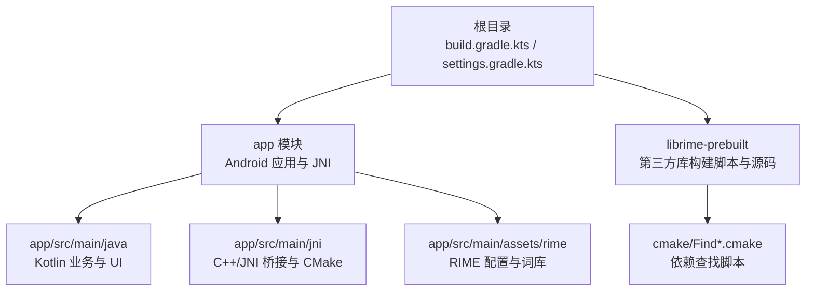
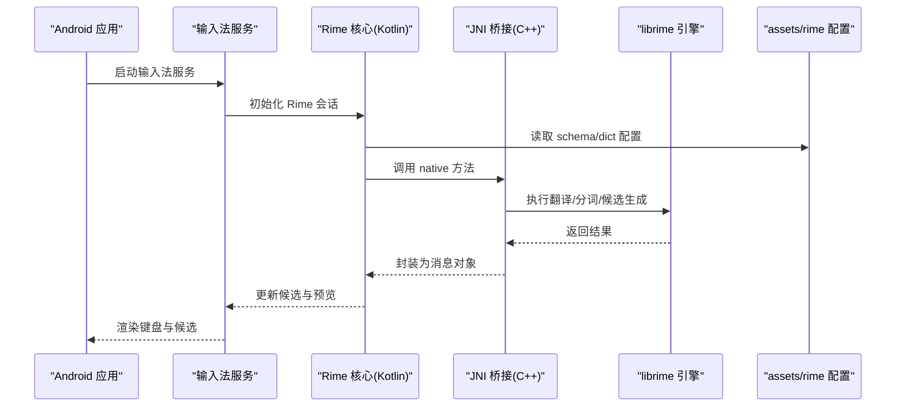
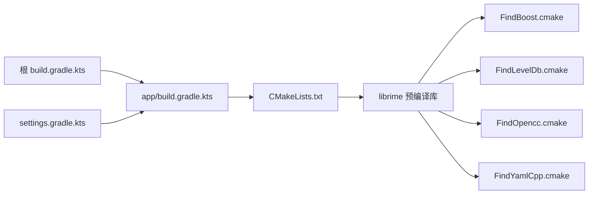

# 快速开始

<cite>
**本文引用的文件**   
- [README.md](file://README.md)
- [build.gradle.kts](file://build.gradle.kts)
- [settings.gradle.kts](file://settings.gradle.kts)
- [gradle.properties](file://gradle.properties)
- [gradle/wrapper/gradle-wrapper.properties](file://gradle/wrapper/gradle-wrapper.properties)
- [app/build.gradle.kts](file://app/build.gradle.kts)
- [app/src/main/jni/librime_jni/CMakeLists.txt](file://app/src/main/jni/librime_jni/CMakeLists.txt)
- [app/src/main/jni/librime_jni/rime_jni.cc](file://app/src/main/jni/librime_jni/rime_jni.cc)
- [librime-prebuilt/build.sh](file://librime-prebuilt/build.sh)
- [librime-prebuilt/Makefile](file://librime-prebuilt/Makefile)
- [librime-prebuilt/README.md](file://librime-prebuilt/README.md)
- [ARCHITECTURE.md](file://ARCHITECTURE.md)
</cite>

## 目录
1. [简介](#简介)
2. [项目结构](#项目结构)
3. [核心组件](#核心组件)
4. [架构总览](#架构总览)
5. [详细组件分析](#详细组件分析)
6. [依赖分析](#依赖分析)
7. [性能考虑](#性能考虑)
8. [故障排除指南](#故障排除指南)
9. [结论](#结论)
10. [附录](#附录)

## 简介
本指南面向首次接触 ziyou-ime 的开发者，目标是帮助你在最短时间内完成环境搭建、依赖下载与首次构建，并验证 JNI 与 C++ 编译链路是否正常工作。内容涵盖：
- Android Studio 版本要求与 Gradle/NDK 配置要点
- 项目克隆、子模块初始化与依赖下载
- 首次构建与运行调试步骤
- 常见构建问题与解决方案

## 项目结构
ziyou-ime 采用多模块 Android 工程组织方式，核心输入逻辑位于 app 模块，JNI 桥接与 librime 预编译库位于 app/src/main/jni 与 librime-prebuilt 目录，Gradle 脚本集中在根目录与 app 模块中。

图表来源
- [build.gradle.kts:1-200](file://build.gradle.kts#L1-L200)
- [settings.gradle.kts:1-200](file://settings.gradle.kts#L1-L200)
- [app/build.gradle.kts:1-200](file://app/build.gradle.kts#L1-L200)
- [app/src/main/jni/librime_jni/CMakeLists.txt:1-200](file://app/src/main/jni/librime_jni/CMakeLists.txt#L1-L200)

章节来源
- [build.gradle.kts:1-200](file://build.gradle.kts#L1-L200)
- [settings.gradle.kts:1-200](file://settings.gradle.kts#L1-L200)
- [app/build.gradle.kts:1-200](file://app/build.gradle.kts#L1-L200)

## 核心组件
- Android 应用层（app 模块）
  - Kotlin 代码负责输入法服务、键盘视图、配置管理、主题与资源部署等。
  - assets/rime 包含 RIME 引擎所需的 schema 与词典配置文件。
- JNI 桥接层（C++）
  - rime_jni.cc 暴露 Java/Kotlin 可调用的 native 接口。
  - CMakeLists.txt 定义 C++ 编译目标与链接选项。
- 第三方库（librime-prebuilt）
  - 提供 librime 的构建脚本与 cmake 辅助脚本，用于生成或集成预编译库。

章节来源
- [app/src/main/java/com/ziyou/ime/ime/SimpleRimeInputMethodService.kt:1-200](file://app/src/main/java/com/ziyou/ime/ime/SimpleRimeInputMethodService.kt#L1-L200)
- [app/src/main/jni/librime_jni/rime_jni.cc:1-200](file://app/src/main/jni/librime_jni/rime_jni.cc#L1-L200)
- [app/src/main/jni/librime_jni/CMakeLists.txt:1-200](file://app/src/main/jni/librime_jni/CMakeLists.txt#L1-L200)
- [librime-prebuilt/README.md:1-200](file://librime-prebuilt/README.md#L1-L200)

## 架构总览
下图展示了从 Android 应用到 C++ 引擎的关键调用路径，以及资源与配置的加载位置。

图表来源
- [app/src/main/java/com/ziyou/ime/core/RimeNative.kt:1-200](file://app/src/main/java/com/ziyou/ime/core/RimeNative.kt#L1-L200)
- [app/src/main/jni/librime_jni/rime_jni.cc:1-200](file://app/src/main/jni/librime_jni/rime_jni.cc#L1-L200)
- [app/src/main/assets/rime/default.yaml:1-200](file://app/src/main/assets/rime/default.yaml#L1-L200)

## 详细组件分析

### 环境与工具链准备
- Android Studio
  - 建议使用较新版本以兼容 Kotlin DSL 与新版 Gradle。
  - 安装 Android SDK、平台工具与 NDK（推荐通过 SDK Manager 安装）。
- Gradle 与 Wrapper
  - 使用 gradlew 进行构建，避免本地 Gradle 版本不一致。
  - 检查 gradle-wrapper.properties 中的 distributionUrl 与版本号。
- NDK 与 CMake
  - 在 Android Studio 中确认已安装对应版本的 NDK 与 CMake。
  - 若需自定义 NDK 路径，可在 gradle.properties 或 local.properties 中设置。

章节来源
- [gradle/wrapper/gradle-wrapper.properties:1-200](file://gradle/wrapper/gradle-wrapper.properties#L1-L200)
- [gradle.properties:1-200](file://gradle.properties#L1-L200)

### 项目克隆与子模块初始化
- 克隆仓库后，请确保初始化并更新子模块（如 librime-prebuilt），以便获取完整的构建脚本与依赖查找文件。
- 首次打开项目时，Android Studio 会同步 Gradle 脚本并下载依赖。

章节来源
- [.gitmodules:1-200](file://.gitmodules#L1-L200)
- [librime-prebuilt/README.md:1-200](file://librime-prebuilt/README.md#L1-L200)

### 首次构建与运行
- 构建流程
  - 使用 ./gradlew assembleDebug 或 ./gradlew build 触发全量构建。
  - app 模块将编译 Kotlin、打包资源，并通过 CMake 编译 JNI 模块。
- 运行调试
  - 在设备上启用“开发者选项”和“USB 调试”。
  - 选择设备并运行 app 模块的默认启动类（输入法服务）。
  - 在系统设置中将 ziyou-ime 设置为当前输入法，验证候选与预览是否正常。

章节来源
- [app/build.gradle.kts:1-200](file://app/build.gradle.kts#L1-L200)
- [app/src/main/jni/librime_jni/CMakeLists.txt:1-200](file://app/src/main/jni/librime_jni/CMakeLists.txt#L1-L200)

### JNI 与 C++ 开发配置
- CMake 目标
  - CMakeLists.txt 定义了 native 库的目标名称、源文件与链接库。
  - 新增 C++ 源文件需在 CMakeLists.txt 中添加对应条目。
- JNI 接口
  - rime_jni.cc 实现 Java/Kotlin 声明的 native 方法，负责与 librime 交互。
  - 修改接口时需保持签名一致，必要时重新生成头文件。

章节来源
- [app/src/main/jni/librime_jni/CMakeLists.txt:1-200](file://app/src/main/jni/librime_jni/CMakeLists.txt#L1-L200)
- [app/src/main/jni/librime_jni/rime_jni.cc:1-200](file://app/src/main/jni/librime_jni/rime_jni.cc#L1-L200)

### 第三方库集成（librime-prebuilt）
- 构建脚本
  - build.sh 与 Makefile 提供跨平台构建入口。
  - cmake/Find*.cmake 用于定位 Boost、LevelDB、OpenCC、YamlCpp 等依赖。
- 预编译库
  - 若已有预编译产物，可直接链接；否则按 README 指引构建。

章节来源
- [librime-prebuilt/build.sh:1-200](file://librime-prebuilt/build.sh#L1-L200)
- [librime-prebuilt/Makefile:1-200](file://librime-prebuilt/Makefile#L1-L200)
- [librime-prebuilt/cmake/FindBoost.cmake:1-200](file://librime-prebuilt/cmake/FindBoost.cmake#L1-L200)
- [librime-prebuilt/cmake/FindLevelDb.cmake:1-200](file://librime-prebuilt/cmake/FindLevelDb.cmake#L1-L200)
- [librime-prebuilt/cmake/FindOpencc.cmake:1-200](file://librime-prebuilt/cmake/FindOpencc.cmake#L1-L200)
- [librime-prebuilt/cmake/FindYamlCpp.cmake:1-200](file://librime-prebuilt/cmake/FindYamlCpp.cmake#L1-L200)

## 依赖分析
- Gradle 依赖
  - 根级与 app 级 build.gradle.kts 定义了 Android 插件、Kotlin 插件与依赖版本。
  - settings.gradle.kts 声明了模块结构与仓库源。
- NDK/CMake 依赖
  - CMakeLists.txt 指定了需要链接的库与头文件路径。
  - librime-prebuilt 的 Find*.cmake 脚本协助定位外部依赖。

图表来源
- [build.gradle.kts:1-200](file://build.gradle.kts#L1-L200)
- [settings.gradle.kts:1-200](file://settings.gradle.kts#L1-L200)
- [app/build.gradle.kts:1-200](file://app/build.gradle.kts#L1-L200)
- [app/src/main/jni/librime_jni/CMakeLists.txt:1-200](file://app/src/main/jni/librime_jni/CMakeLists.txt#L1-L200)
- [librime-prebuilt/cmake/FindBoost.cmake:1-200](file://librime-prebuilt/cmake/FindBoost.cmake#L1-L200)
- [librime-prebuilt/cmake/FindLevelDb.cmake:1-200](file://librime-prebuilt/cmake/FindLevelDb.cmake#L1-L200)
- [librime-prebuilt/cmake/FindOpencc.cmake:1-200](file://librime-prebuilt/cmake/FindOpencc.cmake#L1-L200)
- [librime-prebuilt/cmake/FindYamlCpp.cmake:1-200](file://librime-prebuilt/cmake/FindYamlCpp.cmake#L1-L200)

章节来源
- [build.gradle.kts:1-200](file://build.gradle.kts#L1-L200)
- [settings.gradle.kts:1-200](file://settings.gradle.kts#L1-L200)
- [app/build.gradle.kts:1-200](file://app/build.gradle.kts#L1-L200)

## 性能考虑
- 构建优化
  - 启用 Gradle 并行与守护进程，减少构建时间。
  - 合理划分模块，避免不必要的重复编译。
- 运行时优化
  - 控制 RIME 配置与词典大小，减少内存占用。
  - 按需加载候选集，避免频繁大对象分配。

[本节为通用建议，不直接分析具体文件]

## 故障排除指南
- Gradle 版本不匹配
  - 现象：同步失败或构建报错。
  - 处理：检查 gradle-wrapper.properties 的 distributionUrl，确保与 Android Studio 兼容。
- NDK/CMake 未安装或版本不符
  - 现象：JNI 编译失败。
  - 处理：通过 SDK Manager 安装 NDK 与 CMake，或在项目中指定正确路径。
- 子模块缺失
  - 现象：找不到 librime-prebuilt 文件或脚本。
  - 处理：执行 git submodule update --init --recursive 拉取子模块。
- 依赖查找失败（Boost/LevelDB/OpenCC/YamlCpp）
  - 现象：CMake 报找不到依赖。
  - 处理：根据 librime-prebuilt 的 README 安装依赖，或调整 Find*.cmake 的路径。
- 无法设置为输入法
  - 现象：系统设置中看不到 ziyou-ime。
  - 处理：确认 AndroidManifest.xml 中输入法声明正确，并在设备上授予相应权限。

章节来源
- [gradle/wrapper/gradle-wrapper.properties:1-200](file://gradle/wrapper/gradle-wrapper.properties#L1-L200)
- [gradle.properties:1-200](file://gradle.properties#L1-L200)
- [librime-prebuilt/README.md:1-200](file://librime-prebuilt/README.md#L1-L200)

## 结论
按照本指南完成环境准备、依赖下载与首次构建后，即可在设备上运行 ziyou-ime 输入法并进行基本调试。若遇到构建或运行问题，可参考故障排除部分逐步定位。建议在熟悉基础流程后，进一步阅读 ARCHITECTURE.md 了解整体设计与扩展点。

[本节为总结性内容，不直接分析具体文件]

## 附录
- 常用命令
  - 清理构建：./gradlew clean
  - 构建 Debug：./gradlew assembleDebug
  - 构建 Release：./gradlew assembleRelease
  - 运行测试：./gradlew test
- 参考文档
  - 架构说明：ARCHITECTURE.md
  - 第三方库构建：librime-prebuilt/README.md

章节来源
- [ARCHITECTURE.md:1-200](file://ARCHITECTURE.md#L1-L200)
- [librime-prebuilt/README.md:1-200](file://librime-prebuilt/README.md#L1-L200)