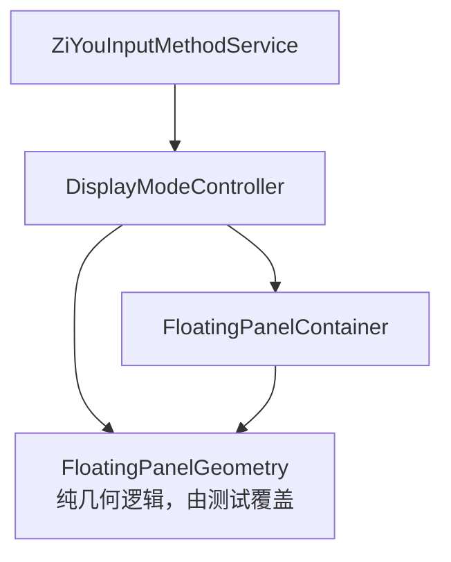
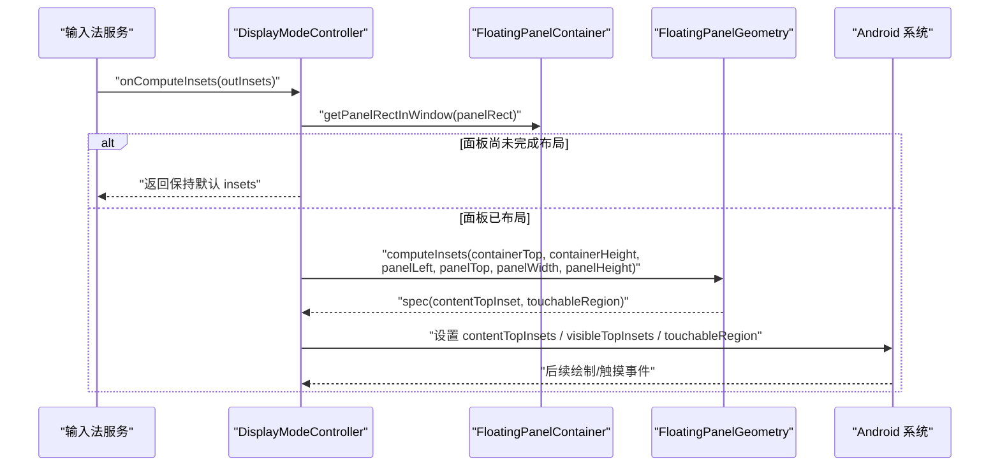
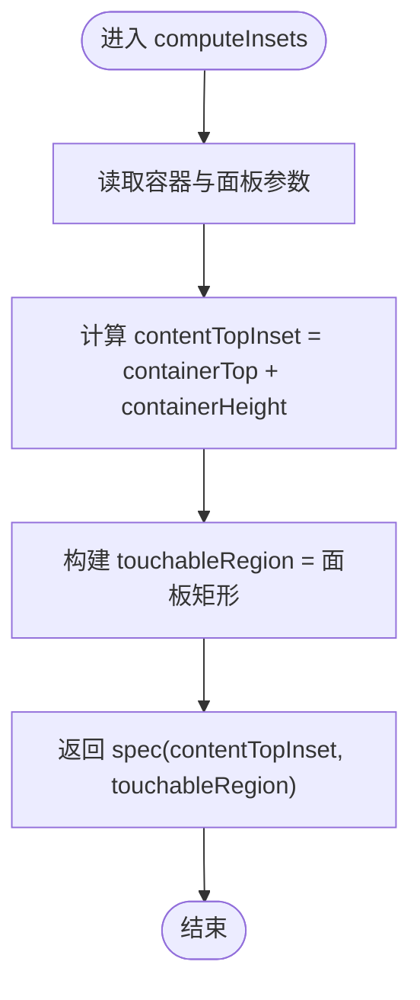
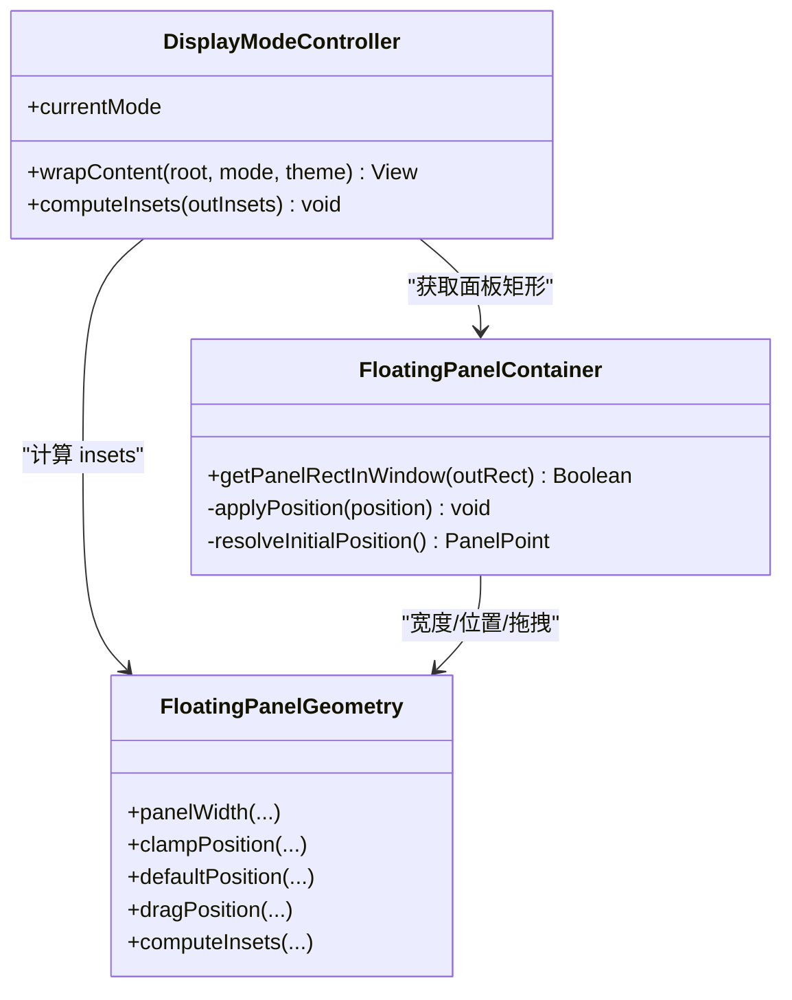

# 几何计算

<cite>
**本文引用的文件**   
- [FloatingPanelGeometryTest.kt](file://core-logic/src/test/java/com/ziyou/ime/core/floating/FloatingPanelGeometryTest.kt)
- [DisplayModeController.kt](file://app/src/main/java/com/ziyou/ime/ime/DisplayModeController.kt)
- [FloatingPanelContainer.kt](file://app/src/main/java/com/ziyou/ime/ime/FloatingPanelContainer.kt)
</cite>

## 目录
1. [简介](#简介)
2. [项目结构](#项目结构)
3. [核心组件](#核心组件)
4. [架构总览](#架构总览)
5. [详细组件分析](#详细组件分析)
6. [依赖关系分析](#依赖关系分析)
7. [性能考量](#性能考量)
8. [故障排查指南](#故障排查指南)
9. [结论](#结论)
10. [附录](#附录)

## 简介
本技术文档聚焦悬浮面板的几何计算，重点解析 FloatingPanelGeometry.computeInsets() 的核心算法与行为：容器顶部位置、容器高度、面板矩形、触摸区域的计算逻辑；解释 contentTopInset 的计算原理（使宿主应用视键盘高度为 0）；说明 touchableRegion 的裁剪机制（将触摸区域限制为悬浮面板矩形，面板外触摸穿透给下层应用）；描述拖动中的 translation 位移处理如何触发绘制遍历并让系统重新回调 computeInsets；补充横屏模式下的特殊处理（全屏模式与游戏画面保护）。同时给出数学计算公式与边界情况示例。

## 项目结构
围绕悬浮面板几何计算的代码主要分布在以下模块：
- app 层负责 UI 组装与系统回调桥接：DisplayModeController 负责形态切换与 insets 计算入口；FloatingPanelContainer 负责悬浮面板的布局、拖拽与对外暴露面板矩形。
- core-logic 层提供纯几何算法与单测：FloatingPanelGeometryTest 覆盖 panelWidth、clampPosition、defaultPosition、dragPosition、computeInsets 等关键用例。

图表来源 
- [DisplayModeController.kt:124-146](file://app/src/main/java/com/ziyou/ime/ime/DisplayModeController.kt#L124-L146)
- [FloatingPanelContainer.kt:130-136](file://app/src/main/java/com/ziyou/ime/ime/FloatingPanelContainer.kt#L130-L136)

章节来源
- [DisplayModeController.kt:124-146](file://app/src/main/java/com/ziyou/ime/ime/DisplayModeController.kt#L124-L146)
- [FloatingPanelContainer.kt:130-136](file://app/src/main/java/com/ziyou/ime/ime/FloatingPanelContainer.kt#L130-L136)
- [FloatingPanelGeometryTest.kt:125-161](file://core-logic/src/test/java/com/ziyou/ime/core/floating/FloatingPanelGeometryTest.kt#L125-L161)

## 核心组件
- DisplayModeController：在 FLOATING 模式下，从悬浮容器获取面板窗口坐标与尺寸，调用 FloatingPanelGeometry.computeInsets 生成 insets 规范，并写入 InputMethodService.Insets，包括内容 inset、可见 inset 与可触摸区域。
- FloatingPanelContainer：悬浮面板根容器，透明背景实现“面板外视觉穿透”；通过 translationX/Y 实现零 relayout 的拖拽移动；对外暴露 getPanelRectInWindow 供 onComputeInsets 使用。
- FloatingPanelGeometry（纯逻辑，由测试覆盖）：提供 panelWidth、clampPosition、defaultPosition、dragPosition、computeInsets 等几何方法，确保面板宽度、位置钳制、默认位置、拖拽位移与 insets 计算的正确性。

章节来源
- [DisplayModeController.kt:117-146](file://app/src/main/java/com/ziyou/ime/ime/DisplayModeController.kt#L117-L146)
- [FloatingPanelContainer.kt:104-136](file://app/src/main/java/com/ziyou/ime/ime/FloatingPanelContainer.kt#L104-L136)
- [FloatingPanelGeometryTest.kt:125-161](file://core-logic/src/test/java/com/ziyou/ime/core/floating/FloatingPanelGeometryTest.kt#L125-L161)

## 架构总览
下图展示悬浮面板在 Android IME 生命周期中的关键交互：Service 回调 onComputeInsets 时，DisplayModeController 委托 FloatingPanelGeometry 计算 insets，并将结果写回系统。

图表来源 
- [DisplayModeController.kt:124-146](file://app/src/main/java/com/ziyou/ime/ime/DisplayModeController.kt#L124-L146)
- [FloatingPanelContainer.kt:130-136](file://app/src/main/java/com/ziyou/ime/ime/FloatingPanelContainer.kt#L130-L136)

## 详细组件分析

### FloatingPanelGeometry.computeInsets() 算法详解
- 输入参数
  - containerTopInWindow：IME 窗口中容器的顶部坐标（窗口坐标系）
  - containerHeight：容器高度（IME 窗口可用高度）
  - panelLeftInWindow：面板左边缘在窗口坐标系的 X
  - panelTopInWindow：面板上边缘在窗口坐标系的 Y
  - panelWidth：面板宽度
  - panelHeight：面板高度
- 输出 spec
  - contentTopInset：内容顶部 inset，用于让宿主应用认为键盘高度为 0（避免顶起游戏画面）
  - touchableLeft/top/right/bottom：可触摸区域矩形（仅面板内可接收触摸，面板外穿透）
- 核心计算
  - contentTopInset = containerTopInWindow + containerHeight
    - 含义：将内容 inset 压到容器底部，使上层应用认为键盘未占用空间（键盘高度视为 0）
  - touchableRegion = 面板矩形
    - left = panelLeftInWindow
    - top = panelTopInWindow
    - right = panelLeftInWindow + panelWidth
    - bottom = panelTopInWindow + panelHeight
- 设计意图
  - 宿主应用视键盘高度为 0：contentTopInset 设置为容器底部，避免输入法遮挡或顶起上层应用（尤其游戏全屏场景）
  - 触摸区域裁剪：仅面板矩形内可被输入法拦截，面板外触摸直接穿透至下层应用，提升沉浸体验

图表来源 
- [FloatingPanelGeometryTest.kt:125-161](file://core-logic/src/test/java/com/ziyou/ime/core/floating/FloatingPanelGeometryTest.kt#L125-L161)

章节来源
- [FloatingPanelGeometryTest.kt:125-161](file://core-logic/src/test/java/com/ziyou/ime/core/floating/FloatingPanelGeometryTest.kt#L125-L161)

### 容器顶部位置与高度来源
- containerTopInWindow：由 DisplayModeController 通过 container.getLocationInWindow 获取容器在窗口的顶部坐标
- containerHeight：直接使用 container.height（IME 窗口可用高度）
- 面板矩形：由 FloatingPanelContainer.getPanelRectInWindow 返回面板在窗口的 Rect

章节来源
- [DisplayModeController.kt:130-139](file://app/src/main/java/com/ziyou/ime/ime/DisplayModeController.kt#L130-L139)
- [FloatingPanelContainer.kt:130-136](file://app/src/main/java/com/ziyou/ime/ime/FloatingPanelContainer.kt#L130-L136)

### 触摸区域裁剪机制
- 当 currentMode == FLOATING 且面板已完成布局时，设置 outInsets.touchableInsets = TOUCHABLE_INSETS_REGION，并填充 touchableRegion 为面板矩形
- 面板外触摸穿透：由于触摸区域仅为面板矩形，其他区域不拦截触摸，交由下层应用处理
- 面板未布局时的回退：若面板尚未完成布局，computeInsets 直接返回，避免空触摸区域吞掉所有触摸

章节来源
- [DisplayModeController.kt:124-146](file://app/src/main/java/com/ziyou/ime/ime/DisplayModeController.kt#L124-L146)
- [FloatingPanelContainer.kt:130-136](file://app/src/main/java/com/ziyou/ime/ime/FloatingPanelContainer.kt#L130-L136)

### 拖动中的 translation 位移处理
- 使用 translationX/Y 实现面板位移，避免触发 relayout，保证 60fps 流畅度
- 每次 MOVE 事件后，applyPosition 更新 translation，触发绘制遍历，系统随之重新回调 onComputeInsets，使触摸区域与面板位置实时同步
- 边界钳制：dragPosition 与 clampPosition 确保面板始终位于容器可视范围内

章节来源
- [FloatingPanelContainer.kt:178-206](file://app/src/main/java/com/ziyou/ime/ime/FloatingPanelContainer.kt#L178-L206)
- [FloatingPanelContainer.kt:226-232](file://app/src/main/java/com/ziyou/ime/ime/FloatingPanelContainer.kt#L226-L232)
- [FloatingPanelGeometryTest.kt:86-123](file://core-logic/src/test/java/com/ziyou/ime/core/floating/FloatingPanelGeometryTest.kt#L86-L123)

### 横屏模式下的特殊处理
- 自动悬浮：横屏时可自动切换到 FLOATING 模式，减少键盘对游戏画面的遮挡
- 位置持久化：按屏幕方向分别保存面板位置，横屏与竖屏独立记忆
- 面板宽度策略：根据屏幕宽度按比例计算面板宽度，并限制在上下限之间，小屏设备兜底不超过容器宽度

章节来源
- [DisplayModeController.kt:54-61](file://app/src/main/java/com/ziyou/ime/ime/DisplayModeController.kt#L54-L61)
- [FloatingPanelContainer.kt:236-244](file://app/src/main/java/com/ziyou/ime/ime/FloatingPanelContainer.kt#L236-L244)
- [FloatingPanelGeometryTest.kt:14-44](file://core-logic/src/test/java/com/ziyou/ime/core/floating/FloatingPanelGeometryTest.kt#L14-L44)

### 数学计算公式与边界情况示例
- contentTopInset 公式
  - contentTopInset = containerTopInWindow + containerHeight
  - 示例：containerTop=0, containerHeight=1080 → contentTopInset=1080（宿主视键盘高度为 0）
- touchableRegion 公式
  - left = panelLeftInWindow
  - top = panelTopInWindow
  - right = panelLeftInWindow + panelWidth
  - bottom = panelTopInWindow + panelHeight
  - 示例：panelLeft=1200, panelTop=600, panelWidth=500, panelHeight=400 → touchable=[1200,600,1700,1000]
- 边界情况
  - 容器非窗口顶部：containerTopInWindow=100, containerHeight=900 → contentTopInset=1000
  - 面板大于容器：clampPosition 将位置钳制到 (0,0)，避免越界
  - 负坐标：clampPosition 将负值钳制到 0
  - 拖拽出界：逐帧钳制，确保最终位置在容器可视范围内

章节来源
- [FloatingPanelGeometryTest.kt:125-161](file://core-logic/src/test/java/com/ziyou/ime/core/floating/FloatingPanelGeometryTest.kt#L125-L161)
- [FloatingPanelGeometryTest.kt:46-70](file://core-logic/src/test/java/com/ziyou/ime/core/floating/FloatingPanelGeometryTest.kt#L46-L70)
- [FloatingPanelGeometryTest.kt:86-123](file://core-logic/src/test/java/com/ziyou/ime/core/floating/FloatingPanelGeometryTest.kt#L86-L123)

## 依赖关系分析
- DisplayModeController 依赖 FloatingPanelContainer 获取面板矩形，依赖 FloatingPanelGeometry 进行几何计算
- FloatingPanelContainer 依赖 FloatingPanelGeometry 进行宽度计算、位置钳制、默认位置与拖拽位移计算
- 测试覆盖 FloatingPanelGeometry 的所有关键方法，确保几何逻辑正确性与稳定性

图表来源 
- [DisplayModeController.kt:105-146](file://app/src/main/java/com/ziyou/ime/ime/DisplayModeController.kt#L105-L146)
- [FloatingPanelContainer.kt:211-244](file://app/src/main/java/com/ziyou/ime/ime/FloatingPanelContainer.kt#L211-L244)

章节来源
- [DisplayModeController.kt:105-146](file://app/src/main/java/com/ziyou/ime/ime/DisplayModeController.kt#L105-L146)
- [FloatingPanelContainer.kt:211-244](file://app/src/main/java/com/ziyou/ime/ime/FloatingPanelContainer.kt#L211-L244)

## 性能考量
- 使用 translationX/Y 实现拖拽位移，避免 relayout，降低重绘开销，维持高帧率
- 仅在必要时触发 onComputeInsets（位移引发的绘制遍历），避免频繁计算
- 面板未布局时回退默认 insets，防止空触摸区域导致触摸异常
- 面板宽度按比例计算并限制在合理范围，避免过小或过大影响交互

[本节为通用指导，无需引用具体文件]

## 故障排查指南
- 触摸区域为空：检查面板是否已完成布局（getPanelRectInWindow 返回 false 时应回退默认 insets）
- 触摸无法穿透：确认 touchableRegion 是否正确设置为面板矩形，且未误设为全容器
- 面板越界：检查 clampPosition 与 dragPosition 的边界钳制逻辑，确保位置在容器可视范围内
- 横屏异常：确认横屏自动悬浮开关与位置持久化逻辑是否生效

章节来源
- [DisplayModeController.kt:124-146](file://app/src/main/java/com/ziyou/ime/ime/DisplayModeController.kt#L124-L146)
- [FloatingPanelContainer.kt:130-136](file://app/src/main/java/com/ziyou/ime/ime/FloatingPanelContainer.kt#L130-L136)
- [FloatingPanelGeometryTest.kt:46-70](file://core-logic/src/test/java/com/ziyou/ime/core/floating/FloatingPanelGeometryTest.kt#L46-L70)

## 结论
FloatingPanelGeometry.computeInsets() 通过将 contentTopInset 设置为容器底部，使宿主应用视键盘高度为 0，从而避免遮挡或顶起上层应用（尤其是游戏全屏场景）。触摸区域裁剪为面板矩形，确保面板外触摸穿透，提升沉浸体验。拖动过程中的 translation 位移触发绘制遍历，系统重新回调 computeInsets，实现触摸区域与面板位置的实时同步。横屏模式下支持自动悬浮与位置持久化，面板宽度按比例计算并限制在合理范围，保障不同设备的交互一致性。

[本节为总结，无需引用具体文件]

## 附录
- 相关测试用例覆盖了 panelWidth、clampPosition、defaultPosition、dragPosition、computeInsets 等关键路径，可作为算法验证与回归测试的依据

章节来源
- [FloatingPanelGeometryTest.kt:14-161](file://core-logic/src/test/java/com/ziyou/ime/core/floating/FloatingPanelGeometryTest.kt#L14-L161)