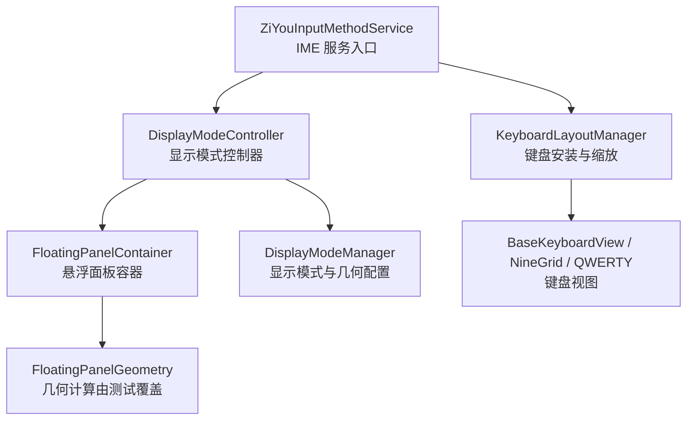
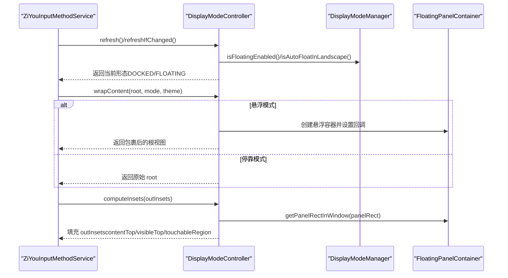
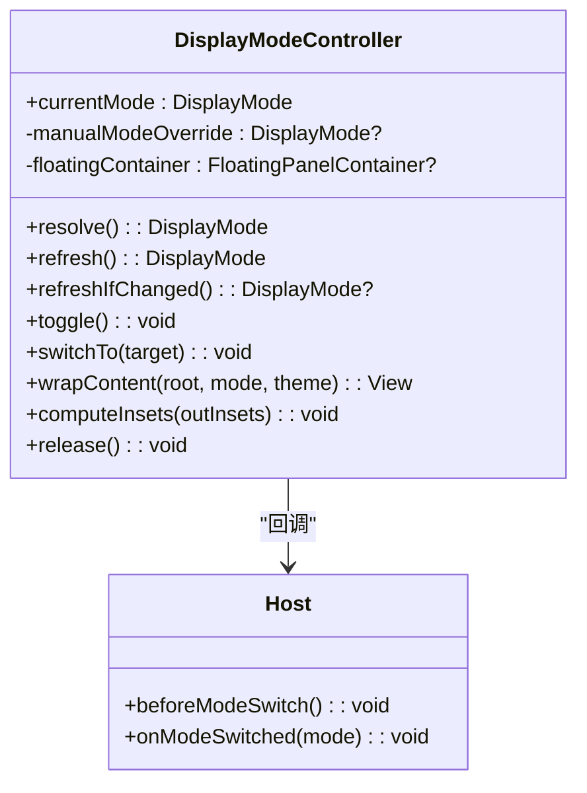
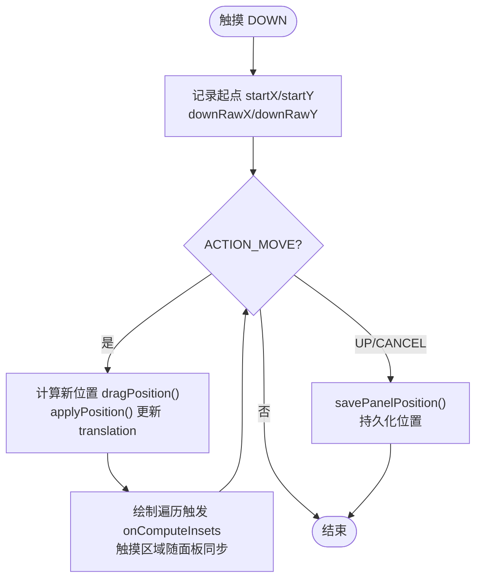
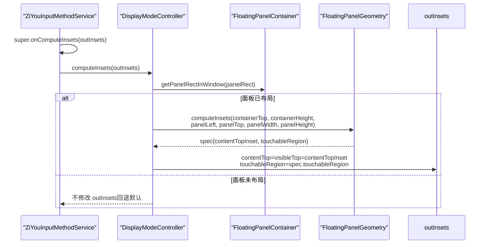
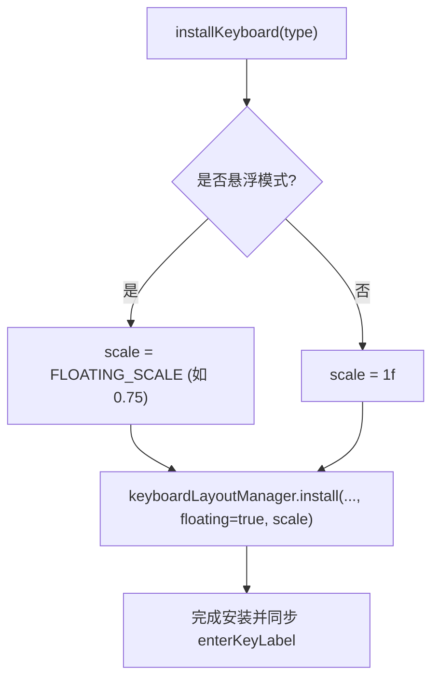
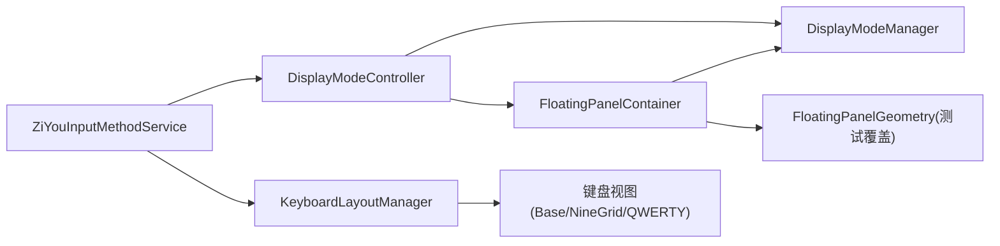
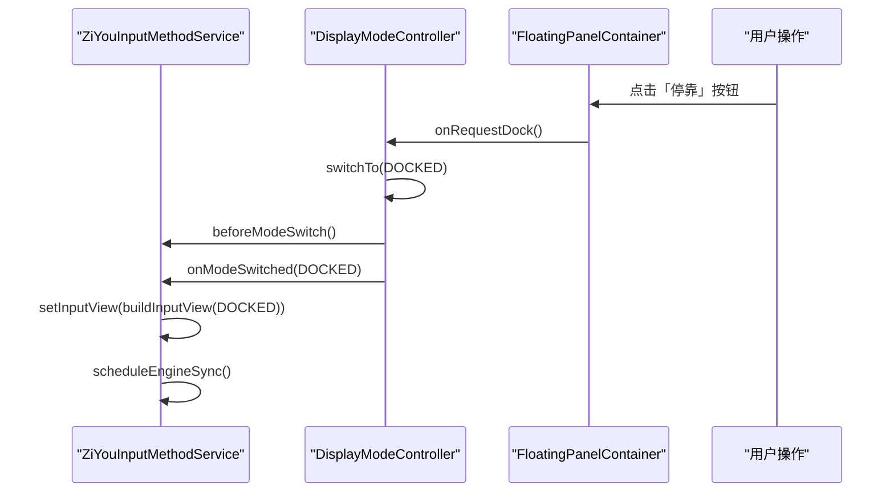

# 悬浮键盘形态

<cite>
**本文引用的文件**   
- [DisplayMode.kt](file://app/src/main/java/com/ziyou/ime/ime/DisplayMode.kt)
- [DisplayModeController.kt](file://app/src/main/java/com/ziyou/ime/ime/DisplayModeController.kt)
- [FloatingPanelContainer.kt](file://app/src/main/java/com/ziyou/ime/ime/FloatingPanelContainer.kt)
- [DisplayModeManager.kt](file://app/src/main/java/com/ziyou/ime/config/DisplayModeManager.kt)
- [ZiYouInputMethodService.kt](file://app/src/main/java/com/ziyou/ime/ime/ZiYouInputMethodService.kt)
- [FloatingPanelGeometryTest.kt](file://core-logic/src/test/java/com/ziyou/ime/core/floating/FloatingPanelGeometryTest.kt)
</cite>

## 目录
1. [简介](#简介)
2. [项目结构](#项目结构)
3. [核心组件](#核心组件)
4. [架构总览](#架构总览)
5. [详细组件分析](#详细组件分析)
6. [依赖关系分析](#依赖关系分析)
7. [性能考量](#性能考量)
8. [故障排查指南](#故障排查指南)
9. [结论](#结论)
10. [附录：自定义悬浮面板行为示例](#附录自定义悬浮面板行为示例)

## 简介
本技术文档聚焦于输入法“悬浮键盘形态”的实现与使用，围绕显示模式控制、悬浮窗口容器、窗口 insets 处理、缩放机制以及横屏全屏保护等关键能力进行系统化说明。读者可据此理解停靠（DOCKED）与悬浮（FLOATING）两种形态的解析优先级与切换流程，掌握悬浮面板的拖拽、位置持久化、几何计算委托与触摸区域裁剪等实现细节，并能在不破坏输入引擎状态的前提下扩展自定义悬浮行为。

## 项目结构
悬浮键盘形态相关代码主要分布在 ime 层与 config 层：
- ime 层负责显示模式控制、悬浮容器与 Service 生命周期集成
- config 层负责用户偏好与几何常量管理
- core-logic 测试覆盖悬浮几何算法（纯逻辑、可单测）

图表来源 
- [ZiYouInputMethodService.kt:550-564](file://app/src/main/java/com/ziyou/ime/ime/ZiYouInputMethodService.kt#L550-L564)
- [DisplayModeController.kt:105-146](file://app/src/main/java/com/ziyou/ime/ime/DisplayModeController.kt#L105-L146)
- [FloatingPanelContainer.kt:40-102](file://app/src/main/java/com/ziyou/ime/ime/FloatingPanelContainer.kt#L40-L102)
- [DisplayModeManager.kt:18-82](file://app/src/main/java/com/ziyou/ime/config/DisplayModeManager.kt#L18-L82)

章节来源
- [ZiYouInputMethodService.kt:550-564](file://app/src/main/java/com/ziyou/ime/ime/ZiYouInputMethodService.kt#L550-L564)
- [DisplayModeController.kt:105-146](file://app/src/main/java/com/ziyou/ime/ime/DisplayModeController.kt#L105-L146)
- [FloatingPanelContainer.kt:40-102](file://app/src/main/java/com/ziyou/ime/ime/FloatingPanelContainer.kt#L40-L102)
- [DisplayModeManager.kt:18-82](file://app/src/main/java/com/ziyou/ime/config/DisplayModeManager.kt#L18-L82)

## 核心组件
- DisplayMode：定义停靠与悬浮两种形态，与键盘布局正交。
- DisplayModeController：解析当前生效形态、切换形态、包裹内容根为悬浮容器、计算悬浮 insets。
- FloatingPanelContainer：悬浮面板 UI 容器，提供拖拽、位置持久化、停靠按钮、几何计算委托。
- DisplayModeManager：存储悬浮开关、横屏自动悬浮、面板位置与缩放因子等配置。
- ZiYouInputMethodService：IME 服务主类，集成显示模式切换、onComputeInsets 委托、键盘安装与缩放。

章节来源
- [DisplayMode.kt:1-18](file://app/src/main/java/com/ziyou/ime/ime/DisplayMode.kt#L1-L18)
- [DisplayModeController.kt:22-98](file://app/src/main/java/com/ziyou/ime/ime/DisplayModeController.kt#L22-L98)
- [FloatingPanelContainer.kt:40-102](file://app/src/main/java/com/ziyou/ime/ime/FloatingPanelContainer.kt#L40-L102)
- [DisplayModeManager.kt:18-82](file://app/src/main/java/com/ziyou/ime/config/DisplayModeManager.kt#L18-L82)
- [ZiYouInputMethodService.kt:550-564](file://app/src/main/java/com/ziyou/ime/ime/ZiYouInputMethodService.kt#L550-L564)

## 架构总览
显示模式解析与切换遵循“手动覆盖 > 总开关 > 横屏自动悬浮”的优先级；悬浮模式下通过 IME 窗口 + onComputeInsets 裁剪触摸区域，实现面板外穿透效果，无需悬浮窗权限。

图表来源 
- [DisplayModeController.kt:54-98](file://app/src/main/java/com/ziyou/ime/ime/DisplayModeController.kt#L54-L98)
- [DisplayModeController.kt:105-146](file://app/src/main/java/com/ziyou/ime/ime/DisplayModeController.kt#L105-L146)
- [FloatingPanelContainer.kt:124-136](file://app/src/main/java/com/ziyou/ime/ime/FloatingPanelContainer.kt#L124-L136)
- [DisplayModeManager.kt:44-57](file://app/src/main/java/com/ziyou/ime/config/DisplayModeManager.kt#L44-L57)
- [ZiYouInputMethodService.kt:560-564](file://app/src/main/java/com/ziyou/ime/ime/ZiYouInputMethodService.kt#L560-L564)

## 详细组件分析

### DisplayModeController：显示模式控制逻辑
- 解析优先级：本次服务生命周期内的手动覆盖 > 悬浮总开关 > 横屏自动悬浮。
- 切换流程：切换前清理临时输入状态，持久化开关，重建输入视图并重同步引擎状态。
- 悬浮包裹：在悬浮模式下将内容根包装进 FloatingPanelContainer，并保存引用供 computeInsets 使用。
- insets 计算：仅悬浮模式生效，将内容 inset 压到容器底部，触摸区域裁剪为面板矩形，面板外穿透。

图表来源 
- [DisplayModeController.kt:22-98](file://app/src/main/java/com/ziyou/ime/ime/DisplayModeController.kt#L22-L98)
- [DisplayModeController.kt:105-146](file://app/src/main/java/com/ziyou/ime/ime/DisplayModeController.kt#L105-L146)

章节来源
- [DisplayModeController.kt:54-98](file://app/src/main/java/com/ziyou/ime/ime/DisplayModeController.kt#L54-L98)
- [DisplayModeController.kt:105-146](file://app/src/main/java/com/ziyou/ime/ime/DisplayModeController.kt#L105-L146)

### FloatingPanelContainer：悬浮窗口实现
- 容器结构：透明 FrameLayout 内嵌圆角半透明 LinearLayout（拖动条 + 内容区）。
- 拖拽功能：DOWN 记录起点，MOVE 逐帧钳制位移，UP 持久化最终位置；使用 translationX/Y 避免 relayout，保持流畅。
- 位置持久化：横竖屏各一份，首次布局恢复或默认右下角内缩位置。
- 停靠按钮：点击触发 onRequestDock 回调，请求退出悬浮模式。
- 几何计算委托：宽度、默认位置、拖拽钳制、insets 计算均委托给 FloatingPanelGeometry（纯逻辑，可单测）。

图表来源 
- [FloatingPanelContainer.kt:173-206](file://app/src/main/java/com/ziyou/ime/ime/FloatingPanelContainer.kt#L173-L206)
- [FloatingPanelContainer.kt:211-232](file://app/src/main/java/com/ziyou/ime/ime/FloatingPanelContainer.kt#L211-L232)

章节来源
- [FloatingPanelContainer.kt:40-102](file://app/src/main/java/com/ziyou/ime/ime/FloatingPanelContainer.kt#L40-L102)
- [FloatingPanelContainer.kt:124-136](file://app/src/main/java/com/ziyou/ime/ime/FloatingPanelContainer.kt#L124-L136)
- [FloatingPanelContainer.kt:173-206](file://app/src/main/java/com/ziyou/ime/ime/FloatingPanelContainer.kt#L173-L206)
- [FloatingPanelContainer.kt:211-232](file://app/src/main/java/com/ziyou/ime/ime/FloatingPanelContainer.kt#L211-L232)

### 窗口 insets 处理机制
- 内容 inset 压到底部：宿主应用视键盘高度为 0，避免游戏画面被顶起。
- 触摸区域裁剪为面板矩形：面板外触摸穿透给下层应用。
- 拖动中的 translation 位移会触发绘制遍历，系统随之重新回调 onComputeInsets，触摸区域与面板位置实时同步。
- 几何计算委托 FloatingPanelGeometry.computeInsets，确保面板未布局完成时回退默认 insets，避免吞掉所有触摸。

图表来源 
- [ZiYouInputMethodService.kt:560-564](file://app/src/main/java/com/ziyou/ime/ime/ZiYouInputMethodService.kt#L560-L564)
- [DisplayModeController.kt:124-146](file://app/src/main/java/com/ziyou/ime/ime/DisplayModeController.kt#L124-L146)
- [FloatingPanelContainer.kt:124-136](file://app/src/main/java/com/ziyou/ime/ime/FloatingPanelContainer.kt#L124-L136)
- [FloatingPanelGeometryTest.kt:128-161](file://core-logic/src/test/java/com/ziyou/ime/core/floating/FloatingPanelGeometryTest.kt#L128-L161)

章节来源
- [ZiYouInputMethodService.kt:560-564](file://app/src/main/java/com/ziyou/ime/ime/ZiYouInputMethodService.kt#L560-L564)
- [DisplayModeController.kt:124-146](file://app/src/main/java/com/ziyou/ime/ime/DisplayModeController.kt#L124-L146)
- [FloatingPanelContainer.kt:124-136](file://app/src/main/java/com/ziyou/ime/ime/FloatingPanelContainer.kt#L124-L136)
- [FloatingPanelGeometryTest.kt:128-161](file://core-logic/src/test/java/com/ziyou/ime/core/floating/FloatingPanelGeometryTest.kt#L128-L161)

### 悬浮时的缩放机制
- 统一缩放因子：悬浮模式下键盘/候选/编码区统一按固定档位缩放（如 0.75），避免局部缩放导致视觉不一致。
- 安装键盘时传入 floating 标志与 scale，由 KeyboardLayoutManager 统一应用到子视图。
- 停靠模式 scale=1f，保持原尺寸。

图表来源 
- [ZiYouInputMethodService.kt:603-615](file://app/src/main/java/com/ziyou/ime/ime/ZiYouInputMethodService.kt#L603-L615)
- [DisplayModeManager.kt:29-31](file://app/src/main/java/com/ziyou/ime/config/DisplayModeManager.kt#L29-L31)

章节来源
- [ZiYouInputMethodService.kt:603-615](file://app/src/main/java/com/ziyou/ime/ime/ZiYouInputMethodService.kt#L603-L615)
- [DisplayModeManager.kt:29-31](file://app/src/main/java/com/ziyou/ime/config/DisplayModeManager.kt#L29-L31)

### 横屏下的全屏模式处理与游戏画面保护
- 始终禁用全屏提取模式（extract mode），避免横屏下系统用全屏输入框替代应用画面，保障游戏场景体验。
- 悬浮形态必须禁用；停靠形态禁用后横屏也能看到原应用界面。

章节来源
- [ZiYouInputMethodService.kt:566-571](file://app/src/main/java/com/ziyou/ime/ime/ZiYouInputMethodService.kt#L566-L571)

## 依赖关系分析
- DisplayModeController 依赖 DisplayModeManager 读取/写入用户偏好与几何常量。
- FloatingPanelContainer 依赖 DisplayModeManager 持久化位置与几何常量，依赖 FloatingPanelGeometry 进行纯逻辑计算。
- ZiYouInputMethodService 作为宿主，协调 DisplayModeController、KeyboardLayoutManager、皮肤管理与引擎同步。

图表来源 
- [DisplayModeController.kt:54-98](file://app/src/main/java/com/ziyou/ime/ime/DisplayModeController.kt#L54-L98)
- [FloatingPanelContainer.kt:211-232](file://app/src/main/java/com/ziyou/ime/ime/FloatingPanelContainer.kt#L211-L232)
- [ZiYouInputMethodService.kt:603-615](file://app/src/main/java/com/ziyou/ime/ime/ZiYouInputMethodService.kt#L603-L615)

章节来源
- [DisplayModeController.kt:54-98](file://app/src/main/java/com/ziyou/ime/ime/DisplayModeController.kt#L54-L98)
- [FloatingPanelContainer.kt:211-232](file://app/src/main/java/com/ziyou/ime/ime/FloatingPanelContainer.kt#L211-L232)
- [ZiYouInputMethodService.kt:603-615](file://app/src/main/java/com/ziyou/ime/ime/ZiYouInputMethodService.kt#L603-L615)

## 性能考量
- 使用 translationX/Y 实现拖拽位移，避免 relayout，保证 60fps 流畅度。
- insets 计算仅在悬浮模式且面板已布局时执行，未布局时回退默认，避免空触摸区域吞掉触摸。
- 引擎状态同步采用 latest-wins 串行化，避免快速切换导致的迟到写入与竞态。
- 皮肤样式变更走增量路径（STYLE_ONLY）减少重建开销。

章节来源
- [FloatingPanelContainer.kt:173-206](file://app/src/main/java/com/ziyou/ime/ime/FloatingPanelContainer.kt#L173-L206)
- [DisplayModeController.kt:124-146](file://app/src/main/java/com/ziyou/ime/ime/DisplayModeController.kt#L124-L146)
- [ZiYouInputMethodService.kt:677-699](file://app/src/main/java/com/ziyou/ime/ime/ZiYouInputMethodService.kt#L677-L699)
- [ZiYouInputMethodService.kt:1364-1380](file://app/src/main/java/com/ziyou/ime/ime/ZiYouInputMethodService.kt#L1364-L1380)

## 故障排查指南
- 触摸无效：检查面板是否已完成布局（getPanelRectInWindow 返回 false 时应回退默认 insets）。
- 面板越界：确认 clampPosition/dragPosition 是否正确钳制；查看容器宽高与面板尺寸。
- 悬浮不生效：核对优先级（手动覆盖 > 总开关 > 横屏自动悬浮），确认 onEvaluateFullscreenMode 返回 false。
- 引擎状态不同步：检查 scheduleEngineSync 是否被取消或超时；确认 awaitEngineReady 成功。

章节来源
- [FloatingPanelContainer.kt:124-136](file://app/src/main/java/com/ziyou/ime/ime/FloatingPanelContainer.kt#L124-L136)
- [FloatingPanelGeometryTest.kt:46-84](file://core-logic/src/test/java/com/ziyou/ime/core/floating/FloatingPanelGeometryTest.kt#L46-L84)
- [ZiYouInputMethodService.kt:566-571](file://app/src/main/java/com/ziyou/ime/ime/ZiYouInputMethodService.kt#L566-L571)
- [ZiYouInputMethodService.kt:677-699](file://app/src/main/java/com/ziyou/ime/ime/ZiYouInputMethodService.kt#L677-L699)

## 结论
悬浮键盘形态通过清晰的职责拆分与纯几何计算委托，实现了高可用、高性能的悬浮交互。显示模式解析优先级明确，insets 处理与触摸裁剪保障了游戏场景体验，统一缩放机制确保视觉一致性。开发者可在不触碰输入引擎状态的前提下，灵活扩展悬浮面板行为。

## 附录：自定义悬浮面板行为示例
以下示例展示如何在现有架构基础上扩展自定义悬浮面板行为（以“自定义停靠按钮文案与提示”为例）：

图表来源 
- [FloatingPanelContainer.kt:160-171](file://app/src/main/java/com/ziyou/ime/ime/FloatingPanelContainer.kt#L160-L171)
- [DisplayModeController.kt:80-98](file://app/src/main/java/com/ziyou/ime/ime/DisplayModeController.kt#L80-L98)
- [ZiYouInputMethodService.kt:91-100](file://app/src/main/java/com/ziyou/ime/ime/ZiYouInputMethodService.kt#L91-L100)

步骤要点（基于仓库实现）：
- 在 FloatingPanelContainer 中修改停靠按钮文案或增加额外操作，通过 onRequestDock 回调通知上层。
- 在 DisplayModeController.switchTo 中执行切换逻辑，确保持久化开关与重建视图。
- 在 ZiYouInputMethodService 的 Host 回调中重建输入视图并重同步引擎状态。

章节来源
- [FloatingPanelContainer.kt:160-171](file://app/src/main/java/com/ziyou/ime/ime/FloatingPanelContainer.kt#L160-L171)
- [DisplayModeController.kt:80-98](file://app/src/main/java/com/ziyou/ime/ime/DisplayModeController.kt#L80-L98)
- [ZiYouInputMethodService.kt:91-100](file://app/src/main/java/com/ziyou/ime/ime/ZiYouInputMethodService.kt#L91-L100)