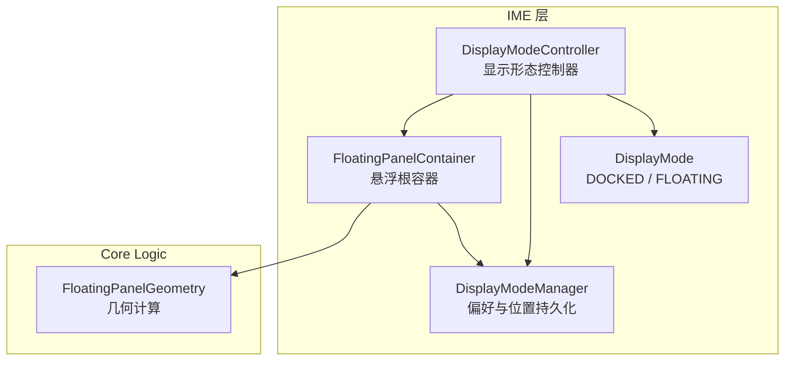
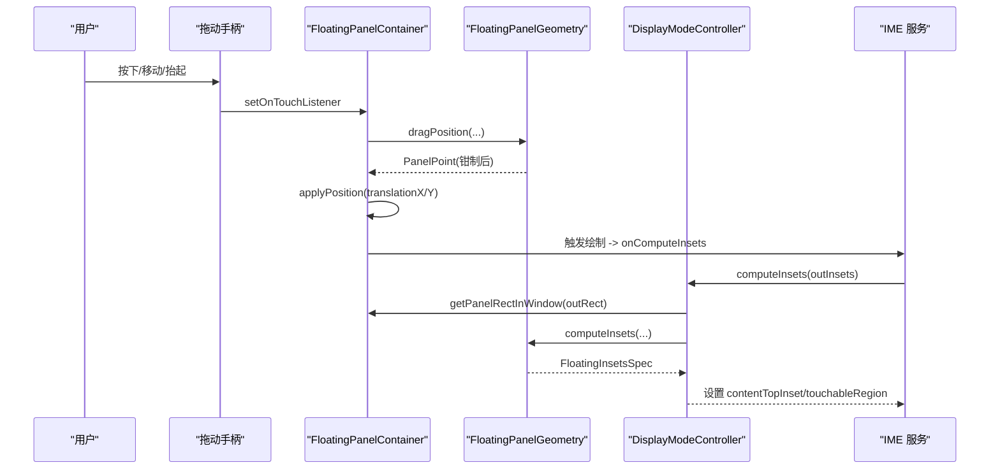
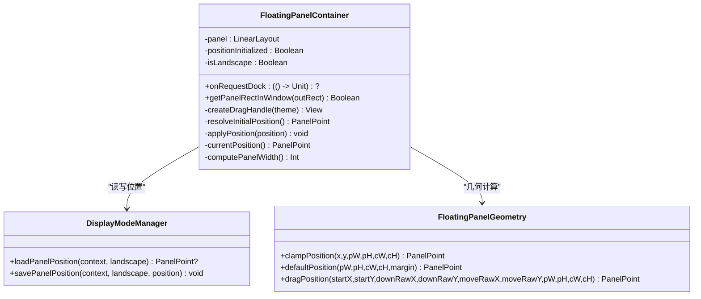
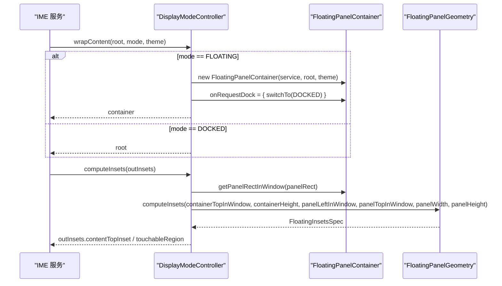
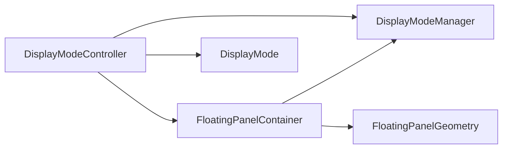

# 悬浮面板容器

<cite>
**本文引用的文件**   
- [FloatingPanelContainer.kt](file://app/src/main/java/com/ziyou/ime/ime/FloatingPanelContainer.kt)
- [DisplayModeController.kt](file://app/src/main/java/com/ziyou/ime/ime/DisplayModeController.kt)
- [DisplayModeManager.kt](file://app/src/main/java/com/ziyou/ime/config/DisplayModeManager.kt)
- [FloatingPanelGeometry.kt](file://core-logic/src/main/java/com/ziyou/ime/core/floating/FloatingPanelGeometry.kt)
- [DisplayMode.kt](file://app/src/main/java/com/ziyou/ime/ime/DisplayMode.kt)
- [FloatingPanelGeometryTest.kt](file://core-logic/src/test/java/com/ziyou/ime/core/floating/FloatingPanelGeometryTest.kt)
</cite>

## 目录
1. [简介](#简介)
2. [项目结构](#项目结构)
3. [核心组件](#核心组件)
4. [架构总览](#架构总览)
5. [详细组件分析](#详细组件分析)
6. [依赖关系分析](#依赖关系分析)
7. [性能考量](#性能考量)
8. [故障排查指南](#故障排查指南)
9. [结论](#结论)
10. [附录：使用示例与最佳实践](#附录使用示例与最佳实践)

## 简介
本文件围绕“悬浮形态根容器” FloatingPanelContainer 的实现进行系统化技术说明，涵盖以下关键点：
- 拖拽交互的触摸事件处理流程与边界钳制
- 位置持久化（SharedPreferences）策略与横竖屏独立存储
- 停靠按钮点击回调 onRequestDock 的使用方式
- getPanelRectInWindow() 的面板矩形计算逻辑（窗口坐标转换、边界检测）
- 与 DisplayModeController 的协作关系及 wrapContent() 包装过程
- 拖拽过程中的实时位置更新与动画效果处理
- 自定义悬浮面板行为与交互的实现建议

## 项目结构
悬浮面板相关代码分布在 ime 层与 core-logic 层：
- ime 层负责 UI 容器、触摸事件、与 IME 服务集成
- core-logic 层提供纯几何计算与数据模型（无 Android 依赖），便于单测与复用

图表来源
- [FloatingPanelContainer.kt:1-251](file://app/src/main/java/com/ziyou/ime/ime/FloatingPanelContainer.kt#L1-L251)
- [DisplayModeController.kt:1-153](file://app/src/main/java/com/ziyou/ime/ime/DisplayModeController.kt#L1-L153)
- [DisplayModeManager.kt:1-82](file://app/src/main/java/com/ziyou/ime/config/DisplayModeManager.kt#L1-L82)
- [FloatingPanelGeometry.kt:1-120](file://core-logic/src/main/java/com/ziyou/ime/core/floating/FloatingPanelGeometry.kt#L1-L120)
- [DisplayMode.kt:1-18](file://app/src/main/java/com/ziyou/ime/ime/DisplayMode.kt#L1-L18)

章节来源
- [FloatingPanelContainer.kt:1-251](file://app/src/main/java/com/ziyou/ime/ime/FloatingPanelContainer.kt#L1-L251)
- [DisplayModeController.kt:1-153](file://app/src/main/java/com/ziyou/ime/ime/DisplayModeController.kt#L1-L153)
- [DisplayModeManager.kt:1-82](file://app/src/main/java/com/ziyou/ime/config/DisplayModeManager.kt#L1-L82)
- [FloatingPanelGeometry.kt:1-120](file://core-logic/src/main/java/com/ziyou/ime/core/floating/FloatingPanelGeometry.kt#L1-L120)
- [DisplayMode.kt:1-18](file://app/src/main/java/com/ziyou/ime/ime/DisplayMode.kt#L1-L18)

## 核心组件
- FloatingPanelContainer：悬浮形态的根容器，承载面板、拖拽条、内容视图；实现拖拽、位置持久化、停靠回调。
- DisplayModeController：控制 DOCKED/FLOATING 切换，封装 wrapContent() 将内容包裹进悬浮容器，并计算 onComputeInsets。
- DisplayModeManager：管理悬浮开关、横屏自动悬浮、面板位置等 SharedPreferences 读写。
- FloatingPanelGeometry：纯函数几何计算（面板宽度、位置钳制、默认位置、拖拽位移、insets 计算）。
- DisplayMode：枚举表示停靠/悬浮两种显示形态。

章节来源
- [FloatingPanelContainer.kt:1-251](file://app/src/main/java/com/ziyou/ime/ime/FloatingPanelContainer.kt#L1-L251)
- [DisplayModeController.kt:1-153](file://app/src/main/java/com/ziyou/ime/ime/DisplayModeController.kt#L1-L153)
- [DisplayModeManager.kt:1-82](file://app/src/main/java/com/ziyou/ime/config/DisplayModeManager.kt#L1-L82)
- [FloatingPanelGeometry.kt:1-120](file://core-logic/src/main/java/com/ziyou/ime/core/floating/FloatingPanelGeometry.kt#L1-L120)
- [DisplayMode.kt:1-18](file://app/src/main/java/com/ziyou/ime/ime/DisplayMode.kt#L1-L18)

## 架构总览
FloatingPanelContainer 作为悬浮形态的根容器，通过 translationX/Y 实现零 relayout 的拖拽移动；每次位移触发绘制遍历，系统重新调用 onComputeInsets，从而动态裁剪可触摸区域为面板矩形，面板外触摸穿透给下层应用。DisplayModeController 在 wrapContent() 中把输入视图包装进 FloatingPanelContainer，并在 computeInsets() 中委托 FloatingPanelGeometry 计算 insets。

图表来源
- [FloatingPanelContainer.kt:173-206](file://app/src/main/java/com/ziyou/ime/ime/FloatingPanelContainer.kt#L173-L206)
- [FloatingPanelGeometry.kt:84-99](file://core-logic/src/main/java/com/ziyou/ime/core/floating/FloatingPanelGeometry.kt#L84-L99)
- [DisplayModeController.kt:124-146](file://app/src/main/java/com/ziyou/ime/ime/DisplayModeController.kt#L124-L146)

## 详细组件分析

### FloatingPanelContainer 悬浮根容器
职责与要点：
- 容器透明，内部 panel 为圆角半透明卡片，包含拖动条与内容视图
- 测量阶段撑满 IME 窗口可用高度，使面板可在任意位置拖拽
- 首次布局时恢复持久化位置或默认右下角位置，并进行边界钳制
- 对外暴露 getPanelRectInWindow() 供 Service 的 onComputeInsets 裁剪触摸区域
- 拖动条 DOWN/MOVE/UP 事件处理：记录起点、逐帧计算新位置、松手后持久化
- 停靠按钮 onClick 回调 onRequestDock，由上层切换到 DOCKED 模式

关键方法说明：
- getPanelRectInWindow(outRect): 获取面板在窗口中的矩形；若面板未布局完成返回 false，避免吞掉所有触摸
- createDragHandle(theme): 构建拖动手柄与停靠按钮，绑定触摸监听与点击回调
- resolveInitialPosition(): 读取持久化位置，失败则回退到默认右下角位置
- applyPosition(position): 通过 translationX/Y 设置位移，不触发 relayout
- currentPosition(): 读取当前 translationX/Y 作为 PanelPoint

图表来源
- [FloatingPanelContainer.kt:40-102](file://app/src/main/java/com/ziyou/ime/ime/FloatingPanelContainer.kt#L40-L102)
- [FloatingPanelContainer.kt:130-136](file://app/src/main/java/com/ziyou/ime/ime/FloatingPanelContainer.kt#L130-L136)
- [FloatingPanelContainer.kt:173-206](file://app/src/main/java/com/ziyou/ime/ime/FloatingPanelContainer.kt#L173-L206)
- [FloatingPanelContainer.kt:212-232](file://app/src/main/java/com/ziyou/ime/ime/FloatingPanelContainer.kt#L212-L232)
- [FloatingPanelGeometry.kt:48-99](file://core-logic/src/main/java/com/ziyou/ime/core/floating/FloatingPanelGeometry.kt#L48-L99)
- [DisplayModeManager.kt:62-77](file://app/src/main/java/com/ziyou/ime/config/DisplayModeManager.kt#L62-L77)

章节来源
- [FloatingPanelContainer.kt:104-122](file://app/src/main/java/com/ziyou/ime/ime/FloatingPanelContainer.kt#L104-L122)
- [FloatingPanelContainer.kt:130-136](file://app/src/main/java/com/ziyou/ime/ime/FloatingPanelContainer.kt#L130-L136)
- [FloatingPanelContainer.kt:173-206](file://app/src/main/java/com/ziyou/ime/ime/FloatingPanelContainer.kt#L173-L206)
- [FloatingPanelContainer.kt:212-232](file://app/src/main/java/com/ziyou/ime/ime/FloatingPanelContainer.kt#L212-L232)

### DisplayModeController 显示形态控制器
职责与要点：
- 解析当前应生效的显示形态（手动覆盖 > 悬浮总开关 > 横屏自动悬浮）
- 提供 toggle()/switchTo() 切换 DOCKED/FLOATING，并持久化开关状态
- wrapContent(root, mode, theme)：FLOATING 时将 root 包裹进 FloatingPanelContainer，并注入 onRequestDock 回调；DOCKED 直接返回 root
- computeInsets(outInsets)：FLOATING 模式下，基于面板矩形计算 contentTopInset 与 touchableRegion，实现面板外触摸穿透

图表来源
- [DisplayModeController.kt:105-115](file://app/src/main/java/com/ziyou/ime/ime/DisplayModeController.kt#L105-L115)
- [DisplayModeController.kt:124-146](file://app/src/main/java/com/ziyou/ime/ime/DisplayModeController.kt#L124-L146)
- [FloatingPanelContainer.kt:130-136](file://app/src/main/java/com/ziyou/ime/ime/FloatingPanelContainer.kt#L130-L136)
- [FloatingPanelGeometry.kt:105-118](file://core-logic/src/main/java/com/ziyou/ime/core/floating/FloatingPanelGeometry.kt#L105-L118)

章节来源
- [DisplayModeController.kt:54-98](file://app/src/main/java/com/ziyou/ime/ime/DisplayModeController.kt#L54-L98)
- [DisplayModeController.kt:105-115](file://app/src/main/java/com/ziyou/ime/ime/DisplayModeController.kt#L105-L115)
- [DisplayModeController.kt:124-146](file://app/src/main/java/com/ziyou/ime/ime/DisplayModeController.kt#L124-L146)

### DisplayModeManager 偏好与位置持久化
职责与要点：
- 管理悬浮模式开关、横屏自动悬浮开关
- 横竖屏分别保存面板位置（x/y），键名区分 portrait/landscape
- savePanelPosition/loadPanelPosition 用于持久化与恢复位置

章节来源
- [DisplayModeManager.kt:41-57](file://app/src/main/java/com/ziyou/ime/config/DisplayModeManager.kt#L41-L57)
- [DisplayModeManager.kt:62-77](file://app/src/main/java/com/ziyou/ime/config/DisplayModeManager.kt#L62-L77)

### FloatingPanelGeometry 几何计算
职责与要点：
- panelWidth：按容器宽度比例计算面板宽度，并钳制在最小/最大 dp 范围内，且不超过容器宽度
- clampPosition：将面板位置钳制到容器内，防止越界
- defaultPosition：默认右下角内缩 margin，再经 clampPosition 保证落在容器内
- dragPosition：根据手指位移计算新位置，逐帧钳制
- computeInsets：计算 contentTopInset 与 touchableRegion，实现面板外触摸穿透

章节来源
- [FloatingPanelGeometry.kt:36-42](file://core-logic/src/main/java/com/ziyou/ime/core/floating/FloatingPanelGeometry.kt#L36-L42)
- [FloatingPanelGeometry.kt:48-59](file://core-logic/src/main/java/com/ziyou/ime/core/floating/FloatingPanelGeometry.kt#L48-L59)
- [FloatingPanelGeometry.kt:65-75](file://core-logic/src/main/java/com/ziyou/ime/core/floating/FloatingPanelGeometry.kt#L65-L75)
- [FloatingPanelGeometry.kt:84-99](file://core-logic/src/main/java/com/ziyou/ime/core/floating/FloatingPanelGeometry.kt#L84-L99)
- [FloatingPanelGeometry.kt:105-118](file://core-logic/src/main/java/com/ziyou/ime/core/floating/FloatingPanelGeometry.kt#L105-L118)

### DisplayMode 显示形态
- DOCKED：停靠形态，键盘停靠屏幕底部横跨全宽
- FLOATING：悬浮形态，小面板悬浮于应用之上，可拖拽，面板外触摸穿透

章节来源
- [DisplayMode.kt:1-18](file://app/src/main/java/com/ziyou/ime/ime/DisplayMode.kt#L1-L18)

## 依赖关系分析
- FloatingPanelContainer 依赖 DisplayModeManager 进行位置持久化，依赖 FloatingPanelGeometry 进行几何计算
- DisplayModeController 依赖 FloatingPanelContainer 与 DisplayModeManager，并在 wrapContent() 中注入 onRequestDock 回调
- FloatingPanelGeometry 是纯函数模块，无 Android 依赖，便于测试与复用

图表来源
- [FloatingPanelContainer.kt:1-251](file://app/src/main/java/com/ziyou/ime/ime/FloatingPanelContainer.kt#L1-L251)
- [DisplayModeController.kt:1-153](file://app/src/main/java/com/ziyou/ime/ime/DisplayModeController.kt#L1-L153)
- [DisplayModeManager.kt:1-82](file://app/src/main/java/com/ziyou/ime/config/DisplayModeManager.kt#L1-L82)
- [FloatingPanelGeometry.kt:1-120](file://core-logic/src/main/java/com/ziyou/ime/core/floating/FloatingPanelGeometry.kt#L1-L120)
- [DisplayMode.kt:1-18](file://app/src/main/java/com/ziyou/ime/ime/DisplayMode.kt#L1-L18)

章节来源
- [FloatingPanelContainer.kt:1-251](file://app/src/main/java/com/ziyou/ime/ime/FloatingPanelContainer.kt#L1-L251)
- [DisplayModeController.kt:1-153](file://app/src/main/java/com/ziyou/ime/ime/DisplayModeController.kt#L1-L153)
- [DisplayModeManager.kt:1-82](file://app/src/main/java/com/ziyou/ime/config/DisplayModeManager.kt#L1-L82)
- [FloatingPanelGeometry.kt:1-120](file://core-logic/src/main/java/com/ziyou/ime/core/floating/FloatingPanelGeometry.kt#L1-L120)
- [DisplayMode.kt:1-18](file://app/src/main/java/com/ziyou/ime/ime/DisplayMode.kt#L1-L18)

## 性能考量
- 使用 translationX/Y 实现拖拽位移，避免 relayout，保持 60fps 流畅度
- 仅当面板尺寸变化时重新钳制位置，减少不必要的计算
- insets 计算委托纯函数模块，避免在 UI 线程执行复杂逻辑
- 位置持久化采用 SharedPreferences.apply() 异步写入，降低主线程压力

[本节为通用指导，无需特定文件引用]

## 故障排查指南
常见问题与定位思路：
- 面板未出现或触摸无效
  - 检查 getPanelRectInWindow() 是否返回 false（面板尚未布局完成）
  - 确认 onComputeInsets 已正确设置 touchableRegion 与 contentTopInset
- 拖拽卡顿或越界
  - 检查 dragPosition 与 clampPosition 参数是否正确传入面板与容器宽高
  - 确认 translationX/Y 设置后触发了重绘与 insets 更新
- 位置未持久化或转屏后丢失
  - 检查 savePanelPosition 是否被调用（ACTION_UP/ACTION_CANCEL）
  - 确认横竖屏键名区分正确（portrait/landscape）
- 停靠按钮无效
  - 检查 onRequestDock 是否被正确注入到 FloatingPanelContainer
  - 确认 switchTo(DisplayMode.DOCKED) 被调用

章节来源
- [FloatingPanelContainer.kt:130-136](file://app/src/main/java/com/ziyou/ime/ime/FloatingPanelContainer.kt#L130-L136)
- [FloatingPanelContainer.kt:173-206](file://app/src/main/java/com/ziyou/ime/ime/FloatingPanelContainer.kt#L173-L206)
- [DisplayModeController.kt:124-146](file://app/src/main/java/com/ziyou/ime/ime/DisplayModeController.kt#L124-L146)
- [DisplayModeManager.kt:62-77](file://app/src/main/java/com/ziyou/ime/config/DisplayModeManager.kt#L62-L77)

## 结论
FloatingPanelContainer 以轻量、高性能的方式实现了悬浮面板的拖拽、位置持久化与触摸裁剪。通过与 DisplayModeController 和 FloatingPanelGeometry 的协作，系统在保持输入引擎状态不变的前提下，灵活切换停靠与悬浮形态，满足游戏场景下的便捷输入需求。

[本节为总结性内容，无需特定文件引用]

## 附录：使用示例与最佳实践

### 实现自定义悬浮面板行为与交互逻辑
- 在 buildInputView 末尾调用 DisplayModeController.wrapContent(root, mode, theme)，将输入视图包装进悬浮容器
- 如需扩展停靠按钮行为，可在 onRequestDock 回调中注入自定义逻辑（例如先提示用户确认）
- 若需自定义面板外观，可在 FloatingPanelContainer 初始化时调整 panel 的背景、圆角、边框等属性
- 若需自定义面板宽度策略，可修改 computePanelWidth() 中的比例与上下限参数

章节来源
- [DisplayModeController.kt:105-115](file://app/src/main/java/com/ziyou/ime/ime/DisplayModeController.kt#L105-L115)
- [FloatingPanelContainer.kt:71-87](file://app/src/main/java/com/ziyou/ime/ime/FloatingPanelContainer.kt#L71-L87)
- [FloatingPanelContainer.kt:236-244](file://app/src/main/java/com/ziyou/ime/ime/FloatingPanelContainer.kt#L236-L244)

### getPanelRectInWindow() 使用示例
- 在 IME 服务的 onComputeInsets 中，先调用 super 默认计算，再调用 DisplayModeController.computeInsets(outInsets)
- 若 getPanelRectInWindow() 返回 false，应回退到默认 insets，避免吞掉所有触摸

章节来源
- [DisplayModeController.kt:124-146](file://app/src/main/java/com/ziyou/ime/ime/DisplayModeController.kt#L124-L146)
- [FloatingPanelContainer.kt:130-136](file://app/src/main/java/com/ziyou/ime/ime/FloatingPanelContainer.kt#L130-L136)

### onRequestDock 回调使用示例
- 在 DisplayModeController.wrapContent() 中，已将 onRequestDock 设置为 switchTo(DisplayMode.DOCKED)
- 如需额外逻辑（如保存状态、提示用户），可在外部注入新的 onRequestDock 实现

章节来源
- [DisplayModeController.kt:105-115](file://app/src/main/java/com/ziyou/ime/ime/DisplayModeController.kt#L105-L115)
- [FloatingPanelContainer.kt:167](file://app/src/main/java/com/ziyou/ime/ime/FloatingPanelContainer.kt#L167-L167)

### 拖拽与动画效果处理
- 使用 translationX/Y 实现拖拽位移，避免 relayout，保持流畅
- 松手后调用 savePanelPosition 持久化位置
- 如需添加动画（如吸附边缘、弹性效果），可在 applyPosition() 前后插入动画逻辑

章节来源
- [FloatingPanelContainer.kt:173-206](file://app/src/main/java/com/ziyou/ime/ime/FloatingPanelContainer.kt#L173-L206)
- [FloatingPanelContainer.kt:226-232](file://app/src/main/java/com/ziyou/ime/ime/FloatingPanelContainer.kt#L226-L232)

### 几何计算验证
- 参考 FloatingPanelGeometryTest 对 panelWidth、clampPosition、defaultPosition、dragPosition、computeInsets 的单元测试用例，确保几何逻辑正确

章节来源
- [FloatingPanelGeometryTest.kt:1-163](file://core-logic/src/test/java/com/ziyou/ime/core/floating/FloatingPanelGeometryTest.kt#L1-L163)