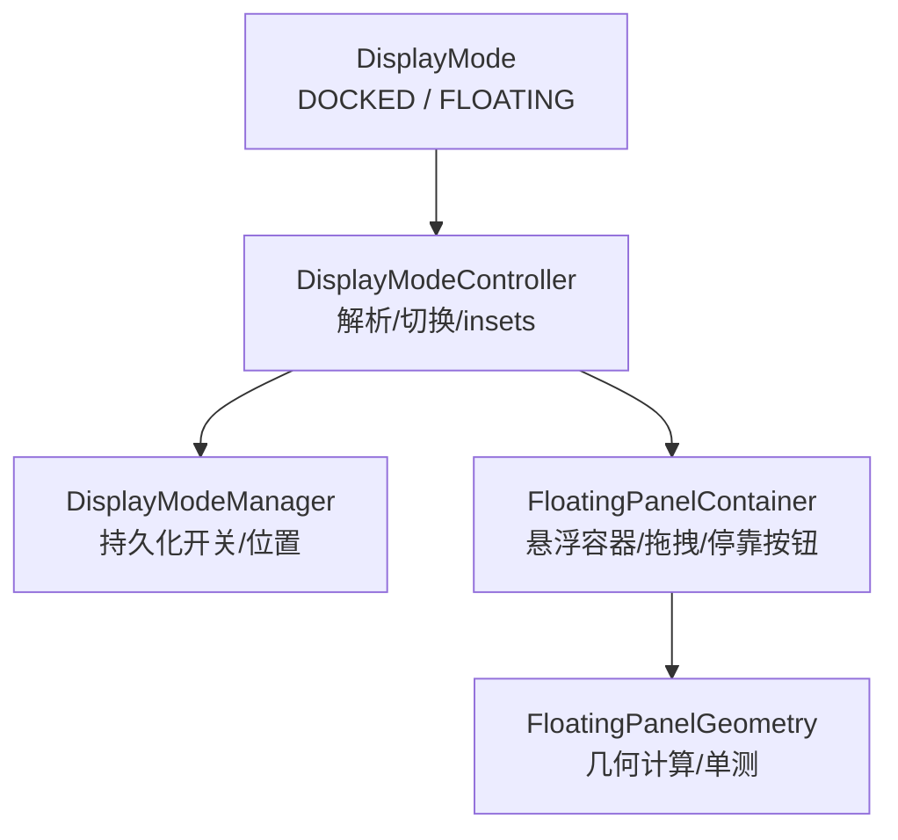
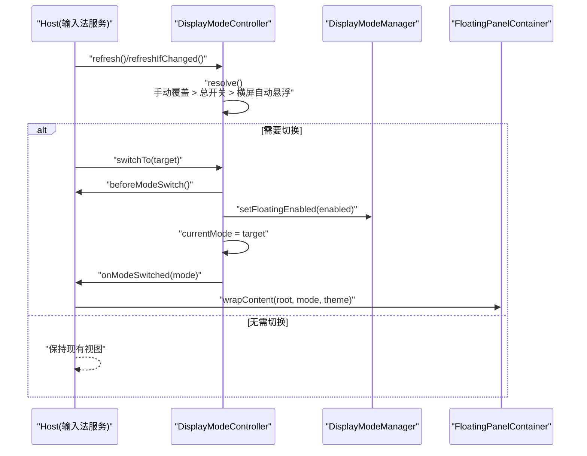
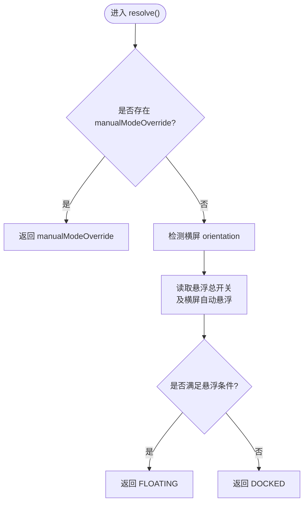
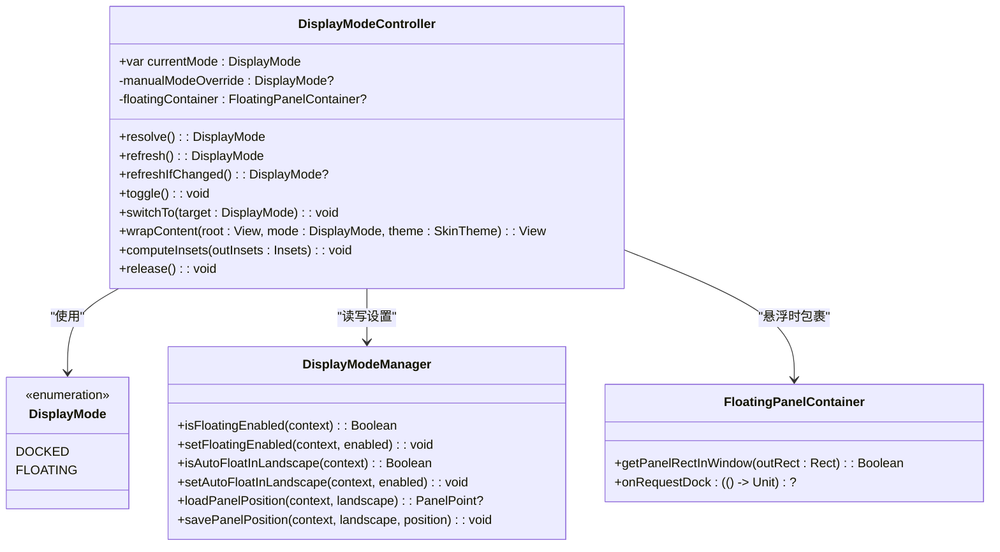
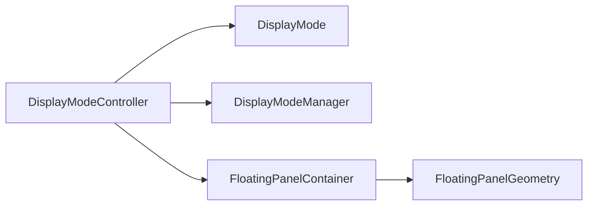

# 显示模式控制

<cite>
**本文引用的文件**   
- [DisplayModeController.kt](file://app/src/main/java/com/ziyou/ime/ime/DisplayModeController.kt)
- [DisplayMode.kt](file://app/src/main/java/com/ziyou/ime/ime/DisplayMode.kt)
- [DisplayModeManager.kt](file://app/src/main/java/com/ziyou/ime/config/DisplayModeManager.kt)
- [FloatingPanelContainer.kt](file://app/src/main/java/com/ziyou/ime/ime/FloatingPanelContainer.kt)
- [FloatingPanelGeometryTest.kt](file://core-logic/src/test/java/com/ziyou/ime/core/floating/FloatingPanelGeometryTest.kt)
</cite>

## 目录
1. [简介](#简介)
2. [项目结构](#项目结构)
3. [核心组件](#核心组件)
4. [架构总览](#架构总览)
5. [详细组件分析](#详细组件分析)
6. [依赖关系分析](#依赖关系分析)
7. [性能考量](#性能考量)
8. [故障排查指南](#故障排查指南)
9. [结论](#结论)
10. [附录：调用示例与最佳实践](#附录调用示例与最佳实践)

## 简介
本技术文档聚焦输入法“显示模式控制”能力，围绕 DisplayModeController 的职责、优先级策略与关键方法展开。显示模式包含两种形态：停靠（DOCKED）与悬浮（FLOATING）。解析优先级为：手动覆盖（本次服务生命周期内）> 悬浮总开关 > 横屏自动悬浮。切换仅重建视图层，不影响 Rime 引擎状态。

## 项目结构
- 显示模式类型定义位于 DisplayMode.kt，提供 DOCKED 与 FLOATING 两个枚举值。
- 控制器 DisplayModeController.kt 负责形态解析、切换与悬浮窗口 insets 计算。
- 设置与持久化由 DisplayModeManager.kt 管理（悬浮总开关、横屏自动悬浮、面板位置等）。
- 悬浮形态的容器 FloatingPanelContainer.kt 负责面板绘制、拖拽与停靠按钮交互。
- 几何计算逻辑通过 FloatingPanelGeometry（纯逻辑，可单测）完成，测试用例见 FloatingPanelGeometryTest.kt。

图表来源
- [DisplayMode.kt:1-18](file://app/src/main/java/com/ziyou/ime/ime/DisplayMode.kt#L1-L18)
- [DisplayModeController.kt:1-153](file://app/src/main/java/com/ziyou/ime/ime/DisplayModeController.kt#L1-L153)
- [DisplayModeManager.kt:1-82](file://app/src/main/java/com/ziyou/ime/config/DisplayModeManager.kt#L1-L82)
- [FloatingPanelContainer.kt:1-200](file://app/src/main/java/com/ziyou/ime/ime/FloatingPanelContainer.kt#L1-L200)
- [FloatingPanelGeometryTest.kt:1-163](file://core-logic/src/test/java/com/ziyou/ime/core/floating/FloatingPanelGeometryTest.kt#L1-L163)

章节来源
- [DisplayMode.kt:1-18](file://app/src/main/java/com/ziyou/ime/ime/DisplayMode.kt#L1-L18)
- [DisplayModeController.kt:1-153](file://app/src/main/java/com/ziyou/ime/ime/DisplayModeController.kt#L1-L153)
- [DisplayModeManager.kt:1-82](file://app/src/main/java/com/ziyou/ime/config/DisplayModeManager.kt#L1-L82)
- [FloatingPanelContainer.kt:1-200](file://app/src/main/java/com/ziyou/ime/ime/FloatingPanelContainer.kt#L1-L200)

## 核心组件
- DisplayMode：枚举类型，表示键盘显示形态（停靠/悬浮），与键盘布局正交。
- DisplayModeController：显示模式控制器，负责：
  - 当前形态 currentMode 维护
  - 解析 resolve()：按优先级确定生效形态
  - 切换 switchTo()：清理、持久化、重建视图
  - 互切 toggle()：在 DOCKED 与 FLOATING 之间切换
  - 刷新 refresh()/refreshIfChanged()：生命周期入口
  - 包裹 wrapContent()：将内容放入悬浮容器或返回原根
  - 计算 insets computeInsets()：悬浮模式下裁剪触摸区域
- DisplayModeManager：持久化存储与读取悬浮相关偏好（总开关、横屏自动悬浮、面板位置等）。
- FloatingPanelContainer：悬浮形态的根容器，处理拖拽、停靠按钮、位置持久化。

章节来源
- [DisplayMode.kt:1-18](file://app/src/main/java/com/ziyou/ime/ime/DisplayMode.kt#L1-L18)
- [DisplayModeController.kt:1-153](file://app/src/main/java/com/ziyou/ime/ime/DisplayModeController.kt#L1-L153)
- [DisplayModeManager.kt:1-82](file://app/src/main/java/com/ziyou/ime/config/DisplayModeManager.kt#L1-L82)
- [FloatingPanelContainer.kt:1-200](file://app/src/main/java/com/ziyou/ime/ime/FloatingPanelContainer.kt#L1-L200)

## 架构总览
显示模式控制的核心在于“解析—切换—渲染—持久化”的闭环：
- 解析：根据手动覆盖、悬浮总开关、横屏自动悬浮三者优先级决定当前形态。
- 切换：先清理输入临时状态，再写入持久化并更新当前形态，最后回调宿主重建视图。
- 渲染：悬浮形态下将内容包裹进 FloatingPanelContainer；停靠形态直接返回原根视图。
- 持久化：悬浮总开关与面板位置通过 DisplayModeManager 读写 SharedPreferences。

图表来源
- [DisplayModeController.kt:54-98](file://app/src/main/java/com/ziyou/ime/ime/DisplayModeController.kt#L54-L98)
- [DisplayModeManager.kt:44-57](file://app/src/main/java/com/ziyou/ime/config/DisplayModeManager.kt#L44-L57)
- [FloatingPanelContainer.kt:105-115](file://app/src/main/java/com/ziyou/ime/ime/FloatingPanelContainer.kt#L105-L115)

## 详细组件分析

### DisplayModeController 类与方法
- 职责边界
  - 从输入法服务中剥离“形态解析、切换与悬浮窗口 insets”职责，使服务专注于生命周期与视图装配。
  - 形态切换仅重建视图层，不触碰输入核心（Rime 引擎状态不受影响）。

- 关键属性
  - currentMode：当前显示形态（DOCKED/FLOATING）。
  - manualModeOverride：本次服务生命周期内的手动覆盖，优先级最高。
  - floatingContainer：悬浮形态下的根容器引用，用于 insets 裁剪。

- 核心方法
  - resolve(): 解析当前应生效的显示形态。流程如下：
    1) 若存在 manualModeOverride，直接返回该值。
    2) 检测横屏：orientation == ORIENTATION_LANDSCAPE。
    3) 读取设置项：isFloatingEnabled(service) 或 (landscape && isAutoFloatInLandscape(service))。
    4) 若任一条件为真则返回 FLOATING，否则返回 DOCKED。
  - refresh(): 在 onCreateInputView 入口调用，赋值 currentMode 并返回。
  - refreshIfChanged(): 在 onStartInputView 入口调用，若解析结果变化则更新 currentMode 并返回新形态，未变化返回 null。
  - toggle(): 互切逻辑，基于 currentMode 取反后调用 switchTo()。
  - switchTo(target): 切换机制：
    1) 若目标与当前相同则直接返回。
    2) 调用 host.beforeModeSwitch() 清理临时输入状态。
    3) 设置 manualModeOverride = target（本次服务生命周期内优先）。
    4) 持久化：DisplayModeManager.setFloatingEnabled(service, target == FLOATING)。
    5) 更新 currentMode = target。
    6) 回调 host.onModeSwitched(target) 重建视图并重同步引擎状态到新视图。
  - wrapContent(root, mode, theme): 悬浮时创建 FloatingPanelContainer 包裹 root，并设置 onRequestDock 回调；停靠时清空 floatingContainer 引用并返回 root。
  - computeInsets(outInsets): 悬浮模式下，根据面板矩形与容器位置计算 contentTopInsets、visibleTopInsets、touchableInsets 与 touchableRegion，实现面板外触摸穿透。
  - release(): 服务销毁时释放 floatingContainer 引用。

图表来源
- [DisplayModeController.kt:54-61](file://app/src/main/java/com/ziyou/ime/ime/DisplayModeController.kt#L54-L61)

图表来源
- [DisplayMode.kt:1-18](file://app/src/main/java/com/ziyou/ime/ime/DisplayMode.kt#L1-L18)
- [DisplayModeController.kt:22-153](file://app/src/main/java/com/ziyou/ime/ime/DisplayModeController.kt#L22-L153)
- [DisplayModeManager.kt:1-82](file://app/src/main/java/com/ziyou/ime/config/DisplayModeManager.kt#L1-L82)
- [FloatingPanelContainer.kt:1-200](file://app/src/main/java/com/ziyou/ime/ime/FloatingPanelContainer.kt#L1-L200)

章节来源
- [DisplayModeController.kt:22-153](file://app/src/main/java/com/ziyou/ime/ime/DisplayModeController.kt#L22-L153)
- [DisplayModeManager.kt:1-82](file://app/src/main/java/com/ziyou/ime/config/DisplayModeManager.kt#L1-L82)
- [FloatingPanelContainer.kt:1-200](file://app/src/main/java/com/ziyou/ime/ime/FloatingPanelContainer.kt#L1-L200)

### 悬浮面板容器 FloatingPanelContainer
- 职责
  - 作为 FLOATING 形态的输入视图根，透明容器承载圆角卡片面板。
  - 面板宽度计算与摆放委托给 FloatingPanelGeometry（纯逻辑可单测）。
  - 拖动条支持拖拽移动、逐帧边界钳制，松手后按屏幕方向持久化位置。
  - 对外暴露 getPanelRectInWindow 供 Service 的 onComputeInsets 裁剪触摸区域。
- 交互
  - 右侧「停靠」按钮触发 onRequestDock 回调，请求退出悬浮模式（回到 DOCKED）。
  - 拖动过程使用 translationX/Y 位移实现，零 relayout，保持流畅。

章节来源
- [FloatingPanelContainer.kt:1-200](file://app/src/main/java/com/ziyou/ime/ime/FloatingPanelContainer.kt#L1-L200)

### 几何计算 FloatingPanelGeometry（纯逻辑）
- 功能
  - panelWidth：按比例计算面板宽度并钳制到上下限。
  - clampPosition：将位置约束到容器范围内。
  - defaultPosition：默认右下角内缩位置。
  - dragPosition：跟随手指位移并逐帧钳制。
  - computeInsets：计算内容 inset 压到容器底部，触摸区域等于面板矩形。
- 验证
  - 单元测试覆盖上述方法的边界与异常场景。

章节来源
- [FloatingPanelGeometryTest.kt:1-163](file://core-logic/src/test/java/com/ziyou/ime/core/floating/FloatingPanelGeometryTest.kt#L1-L163)

## 依赖关系分析
- DisplayModeController 依赖：
  - DisplayMode：形态枚举。
  - DisplayModeManager：持久化悬浮开关与面板位置。
  - FloatingPanelContainer：悬浮形态的容器封装。
  - FloatingPanelGeometry：几何计算（通过测试文件间接体现）。
- 耦合与内聚
  - Controller 与 Host（输入法服务）通过接口解耦，避免循环依赖。
  - 悬浮几何计算下沉至 core-logic，便于单测与复用。
- 外部依赖
  - Android Configuration 用于横屏检测。
  - SharedPreferences 用于持久化。

图表来源
- [DisplayModeController.kt:1-153](file://app/src/main/java/com/ziyou/ime/ime/DisplayModeController.kt#L1-L153)
- [DisplayModeManager.kt:1-82](file://app/src/main/java/com/ziyou/ime/config/DisplayModeManager.kt#L1-L82)
- [FloatingPanelContainer.kt:1-200](file://app/src/main/java/com/ziyou/ime/ime/FloatingPanelContainer.kt#L1-L200)
- [FloatingPanelGeometryTest.kt:1-163](file://core-logic/src/test/java/com/ziyou/ime/core/floating/FloatingPanelGeometryTest.kt#L1-L163)

章节来源
- [DisplayModeController.kt:1-153](file://app/src/main/java/com/ziyou/ime/ime/DisplayModeController.kt#L1-L153)
- [DisplayModeManager.kt:1-82](file://app/src/main/java/com/ziyou/ime/config/DisplayModeManager.kt#L1-L82)
- [FloatingPanelContainer.kt:1-200](file://app/src/main/java/com/ziyou/ime/ime/FloatingPanelContainer.kt#L1-L200)

## 性能考量
- 视图重建最小化：switchTo() 仅在形态变化时执行 beforeModeSwitch() 与 onModeSwitched()，避免不必要的重绘。
- 悬浮拖拽零 relayout：使用 translationX/Y 位移，减少布局开销，维持 60fps 流畅度。
- insets 计算延迟：面板尚未完成布局时回退默认 insets，避免空触摸区域吞掉所有触摸。
- 持久化 I/O：使用 apply() 异步落盘，避免阻塞主线程。

[本节为通用指导，不直接分析具体文件]

## 故障排查指南
- 现象：悬浮面板触摸无效或吞掉所有触摸
  - 检查 computeInsets() 是否在面板布局完成后正确设置 touchableRegion。
  - 确认 getPanelRectInWindow() 返回 false 时回退默认 insets。
- 现象：横屏自动悬浮未生效
  - 校验 isAutoFloatInLandscape() 是否开启且 orientation 为 LANDSCAPE。
  - 确认 resolve() 未被 manualModeOverride 覆盖。
- 现象：切换后视图未重建
  - 确保 onModeSwitched() 被调用并在宿主侧重建输入视图。
  - 检查 refreshIfChanged() 返回值是否为 null（未变化）。
- 现象：面板位置丢失
  - 检查 savePanelPosition() 是否在拖拽结束时调用。
  - 确认 loadPanelPosition() 读取键名与横竖屏匹配。

章节来源
- [DisplayModeController.kt:124-146](file://app/src/main/java/com/ziyou/ime/ime/DisplayModeController.kt#L124-L146)
- [FloatingPanelContainer.kt:197-200](file://app/src/main/java/com/ziyou/ime/ime/FloatingPanelContainer.kt#L197-L200)
- [DisplayModeManager.kt:62-77](file://app/src/main/java/com/ziyou/ime/config/DisplayModeManager.kt#L62-L77)

## 结论
DisplayModeController 以清晰的优先级策略与严格的职责边界实现了停靠/悬浮两种显示形态的控制。通过 Host 接口解耦输入法服务，结合 DisplayModeManager 的持久化与 FloatingPanelContainer 的悬浮能力，形成稳定、可测试、易扩展的显示模式控制系统。

[本节为总结性内容，不直接分析具体文件]

## 附录：调用示例与最佳实践
- 在 onCreateInputView 中初始化显示模式
  - 调用 refresh() 获取并设置 currentMode，随后构建输入视图。
- 在 onStartInputView 中重新解析
  - 调用 refreshIfChanged()，若返回非 null 则重建输入视图并重同步引擎状态。
- 用户点击「浮」键进行互切
  - 调用 toggle()，内部会依据 currentMode 取反并执行 switchTo()。
- 显式切换到指定形态
  - 调用 switchTo(DisplayMode.FLOATING) 或 switchTo(DisplayMode.DOCKED)，确保宿主实现 beforeModeSwitch() 与 onModeSwitched()。
- 悬浮容器包裹
  - 在 buildInputView 末尾调用 wrapContent(root, currentMode, theme)，根据形态决定是否包裹 FloatingPanelContainer。
- 计算 insets
  - 在 onComputeInsets 中调用 computeInsets(outInsets)，并确保先执行系统默认计算。

章节来源
- [DisplayModeController.kt:64-78](file://app/src/main/java/com/ziyou/ime/ime/DisplayModeController.kt#L64-L78)
- [DisplayModeController.kt:81-98](file://app/src/main/java/com/ziyou/ime/ime/DisplayModeController.kt#L81-L98)
- [DisplayModeController.kt:105-115](file://app/src/main/java/com/ziyou/ime/ime/DisplayModeController.kt#L105-L115)
- [DisplayModeController.kt:124-146](file://app/src/main/java/com/ziyou/ime/ime/DisplayModeController.kt#L124-L146)