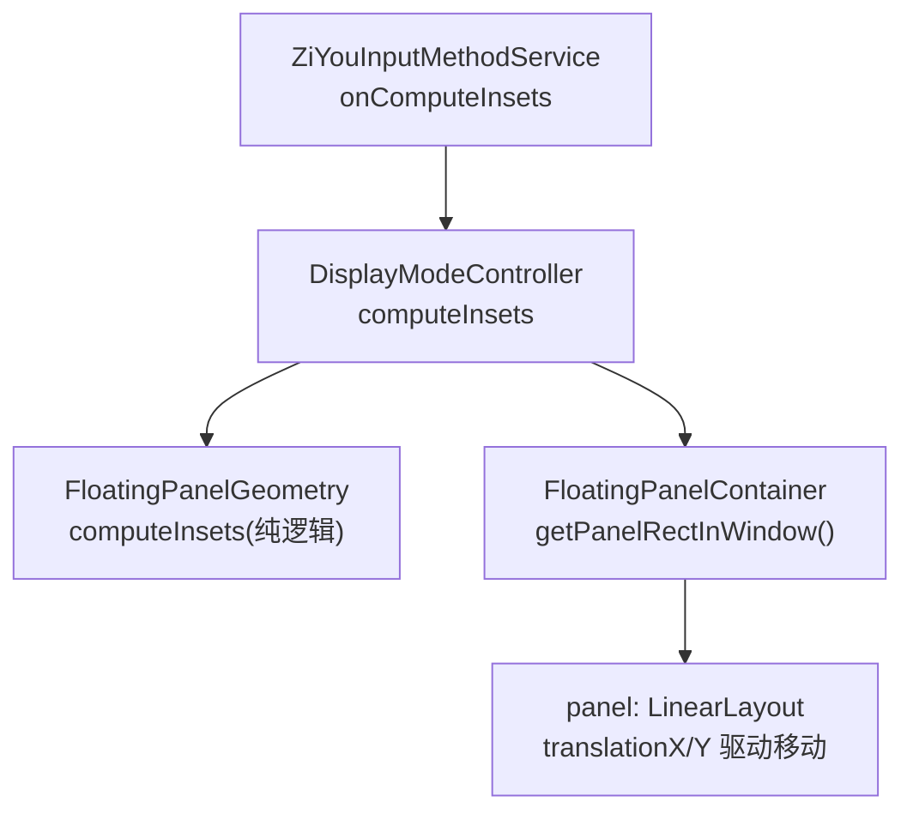
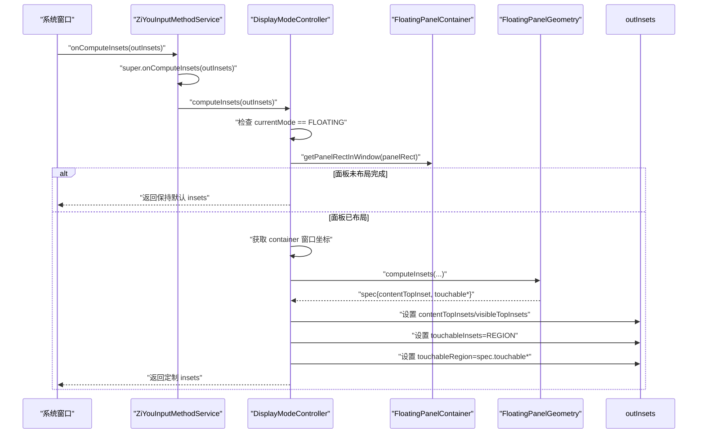
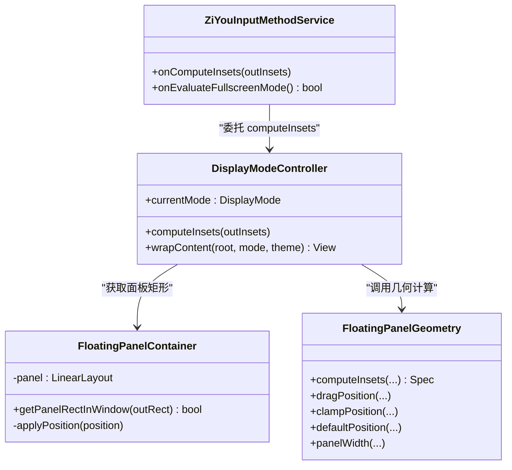

# 窗口 Insets 管理

<cite>
**本文引用的文件**   
- [DisplayModeController.kt](file://app/src/main/java/com/ziyou/ime/ime/DisplayModeController.kt)
- [FloatingPanelContainer.kt](file://app/src/main/java/com/ziyou/ime/ime/FloatingPanelContainer.kt)
- [ZiYouInputMethodService.kt](file://app/src/main/java/com/ziyou/ime/ime/ZiYouInputMethodService.kt)
- [FloatingPanelGeometryTest.kt](file://core-logic/src/test/java/com/ziyou/ime/core/floating/FloatingPanelGeometryTest.kt)
</cite>

## 目录
1. [简介](#简介)
2. [项目结构](#项目结构)
3. [核心组件](#核心组件)
4. [架构总览](#架构总览)
5. [详细组件分析](#详细组件分析)
6. [依赖关系分析](#依赖关系分析)
7. [性能考量](#性能考量)
8. [故障排查指南](#故障排查指南)
9. [结论](#结论)
10. [附录](#附录)

## 简介
本技术文档聚焦于输入法在悬浮形态下的窗口 Insets 管理机制，重点解析 computeInsets() 的实现逻辑与系统窗口管理的集成方式。内容涵盖：
- 悬浮形态下 InputMethodService.Insets 的配置策略
- contentTopInsets 与 visibleTopInsets 的设置原则，确保宿主应用内容不被顶起
- TOUCHABLE_INSETS_REGION 模式启用与 touchableRegion 的矩形设置
- 面板尚未完成布局时的回退机制，避免空触摸区域吞掉所有触摸事件
- 拖动过程中的实时更新机制（translation 位移触发绘制遍历与 insets 重算）
- 与系统窗口的集成要点及在不同应用场景下的行为保证
- 调试方法与常见问题解决方案

## 项目结构
围绕悬浮面板与 Insets 管理的代码主要分布在以下模块：
- 显示形态控制器：负责悬浮/停靠形态切换、包裹内容与计算窗口 insets
- 悬浮面板容器：承载输入视图，提供拖拽、位置持久化、面板矩形查询等能力
- 输入法服务：统一生命周期与视图装配，委托形态控制器处理悬浮 insets
- 几何计算测试：覆盖面板宽度、位置钳制、默认位置、拖拽位移与 insets 计算的断言

**图表来源** 
- [ZiYouInputMethodService.kt:560-564](file://app/src/main/java/com/ziyou/ime/ime/ZiYouInputMethodService.kt#L560-L564)
- [DisplayModeController.kt:124-146](file://app/src/main/java/com/ziyou/ime/ime/DisplayModeController.kt#L124-L146)
- [FloatingPanelContainer.kt:126-136](file://app/src/main/java/com/ziyou/ime/ime/FloatingPanelContainer.kt#L126-L136)

**章节来源**
- [ZiYouInputMethodService.kt:550-580](file://app/src/main/java/com/ziyou/ime/ime/ZiYouInputMethodService.kt#L550-L580)
- [DisplayModeController.kt:1-153](file://app/src/main/java/com/ziyou/ime/ime/DisplayModeController.kt#L1-L153)
- [FloatingPanelContainer.kt:1-251](file://app/src/main/java/com/ziyou/ime/ime/FloatingPanelContainer.kt#L1-L251)

## 核心组件
- DisplayModeController：封装悬浮/停靠形态解析、切换与悬浮窗口 insets 计算；在悬浮模式下将内容包裹进 FloatingPanelContainer，并对外暴露 computeInsets() 以裁剪触摸区域与设置内容 inset。
- FloatingPanelContainer：悬浮形态根容器，透明背景，内部包含圆角卡片面板与输入内容；通过 translationX/Y 实现零 relayout 的拖拽移动，并提供 getPanelRectInWindow() 供 onComputeInsets 使用。
- ZiYouInputMethodService：统一入口，重写 onComputeInsets()，先调用 super 获取默认 insets，再委托 DisplayModeController.computeInsets() 进行悬浮模式定制。

关键职责边界：
- 几何计算下沉至纯逻辑层（由测试覆盖），UI 仅负责状态与交互
- 触摸区域裁剪与内容 inset 设置集中在 computeInsets() 中，保证宿主应用不受键盘高度影响
- 拖动过程通过 translation 驱动，避免布局重排，提升帧率

**章节来源**
- [DisplayModeController.kt:100-146](file://app/src/main/java/com/ziyou/ime/ime/DisplayModeController.kt#L100-L146)
- [FloatingPanelContainer.kt:20-38](file://app/src/main/java/com/ziyou/ime/ime/FloatingPanelContainer.kt#L20-L38)
- [ZiYouInputMethodService.kt:560-564](file://app/src/main/java/com/ziyou/ime/ime/ZiYouInputMethodService.kt#L560-L564)

## 架构总览
下图展示悬浮形态下 computeInsets() 的调用链与数据流：

**图表来源** 
- [ZiYouInputMethodService.kt:560-564](file://app/src/main/java/com/ziyou/ime/ime/ZiYouInputMethodService.kt#L560-L564)
- [DisplayModeController.kt:124-146](file://app/src/main/java/com/ziyou/ime/ime/DisplayModeController.kt#L124-L146)
- [FloatingPanelContainer.kt:126-136](file://app/src/main/java/com/ziyou/ime/ime/FloatingPanelContainer.kt#L126-L136)

## 详细组件分析

### DisplayModeController.computeInsets() 实现逻辑
- 前置条件：仅在 currentMode == FLOATING 时生效；若 floatingContainer 为空则直接返回
- 面板矩形获取：调用 container.getPanelRectInWindow(panelRect)，若面板尚未完成布局（宽高为 0）则返回 false，此时不修改 outInsets，保持系统默认 insets，避免空触摸区域吞掉所有触摸
- 容器坐标获取：container.getLocationInWindow(containerLoc) 用于后续几何计算
- 几何计算：调用 FloatingPanelGeometry.computeInsets(...) 得到 spec，包含 contentTopInset 与 touchable* 四个边值
- 设置 Inset 字段：
  - outInsets.contentTopInsets = spec.contentTopInset
  - outInsets.visibleTopInsets = spec.contentTopInset
  - outInsets.touchableInsets = InputMethodService.Insets.TOUCHABLE_INSETS_REGION
  - outInsets.touchableRegion.set(spec.touchableLeft, spec.touchableTop, spec.touchableRight, spec.touchableBottom)

上述设置确保：
- 宿主应用认为键盘高度为 0（内容不被顶起）
- 触摸区域被裁剪为面板矩形，面板外触摸穿透给下层应用

**章节来源**
- [DisplayModeController.kt:124-146](file://app/src/main/java/com/ziyou/ime/ime/DisplayModeController.kt#L124-L146)

### FloatingPanelContainer 的面板矩形与回退机制
- getPanelRectInWindow(outRect): 当 panel.width 或 panel.height 为 0 时返回 false，表示面板尚未完成布局；否则通过 getLocationInWindow 计算面板在 IME 窗口中的矩形
- 首次布局与尺寸变化：onLayout 中根据持久化位置或默认位置初始化面板位置，并使用 clampPosition 钳制到容器内
- 面板尺寸变化监听：当面板高度变化（如切换键盘布局）后重新钳制位置，避免底部越界

回退机制的意义：
- 在面板未完成布局时，不设置任何触摸区域，避免吞掉所有触摸事件
- 系统默认 insets 作为兜底，保证基础交互可用

**章节来源**
- [FloatingPanelContainer.kt:126-136](file://app/src/main/java/com/ziyou/ime/ime/FloatingPanelContainer.kt#L126-L136)
- [FloatingPanelContainer.kt:115-122](file://app/src/main/java/com/ziyou/ime/ime/FloatingPanelContainer.kt#L115-L122)
- [FloatingPanelContainer.kt:91-101](file://app/src/main/java/com/ziyou/ime/ime/FloatingPanelContainer.kt#L91-L101)

### 拖动过程中的实时更新机制
- 拖动条 onTouchListener 处理 DOWN/MOVE/UP 事件
- MOVE 阶段：调用 FloatingPanelGeometry.dragPosition(...) 计算新位置，并通过 applyPosition(pos) 设置 panel.translationX/Y
- translation 位移不触发 relayout，但会触发绘制遍历，系统随之重新回调 onComputeInsets，从而更新 touchableRegion 与面板位置同步
- UP/CANCEL 阶段：保存最终位置（按横竖屏区分），并根据位移阈值判断是否为点击

该机制保证：
- 拖动过程中触摸区域实时跟随面板移动
- 无布局重排，维持高帧率

**章节来源**
- [FloatingPanelContainer.kt:178-206](file://app/src/main/java/com/ziyou/ime/ime/FloatingPanelContainer.kt#L178-L206)

### 与系统窗口管理的集成
- ZiYouInputMethodService.onComputeInsets(): 先调用 super.onComputeInsets(outInsets) 获取系统默认 insets，再委托 DisplayModeController.computeInsets(outInsets) 进行悬浮模式定制
- onEvaluateFullscreenMode(): 始终返回 false，禁用全屏提取模式，避免横屏下系统用全屏输入框替代应用画面，改善游戏内打字体验

集成要点：
- 必须优先执行 super 默认计算，确保基础 insets 有效
- 悬浮模式下通过 region 裁剪触摸区域，面板外触摸穿透给下层应用
- 禁用全屏提取模式，避免遮挡游戏画面

**章节来源**
- [ZiYouInputMethodService.kt:560-571](file://app/src/main/java/com/ziyou/ime/ime/ZiYouInputMethodService.kt#L560-L571)

### 几何计算与测试覆盖
- FloatingPanelGeometry.computeInsets() 的断言覆盖：
  - 内容 inset 压到容器底部（宿主视键盘高度为 0）
  - 触摸矩形等于面板矩形
  - 容器非窗口顶部时叠加偏移
- 其他几何函数测试：panelWidth、clampPosition、defaultPosition、dragPosition

这些测试确保：
- 几何逻辑正确性与边界情况处理
- UI 层无需重复验证，降低耦合

**章节来源**
- [FloatingPanelGeometryTest.kt:125-161](file://core-logic/src/test/java/com/ziyou/ime/core/floating/FloatingPanelGeometryTest.kt#L125-L161)

## 依赖关系分析

**图表来源** 
- [ZiYouInputMethodService.kt:560-571](file://app/src/main/java/com/ziyou/ime/ime/ZiYouInputMethodService.kt#L560-L571)
- [DisplayModeController.kt:124-146](file://app/src/main/java/com/ziyou/ime/ime/DisplayModeController.kt#L124-L146)
- [FloatingPanelContainer.kt:126-136](file://app/src/main/java/com/ziyou/ime/ime/FloatingPanelContainer.kt#L126-L136)

**章节来源**
- [DisplayModeController.kt:1-153](file://app/src/main/java/com/ziyou/ime/ime/DisplayModeController.kt#L1-L153)
- [FloatingPanelContainer.kt:1-251](file://app/src/main/java/com/ziyou/ime/ime/FloatingPanelContainer.kt#L1-L251)
- [ZiYouInputMethodService.kt:550-580](file://app/src/main/java/com/ziyou/ime/ime/ZiYouInputMethodService.kt#L550-L580)

## 性能考量
- 使用 translationX/Y 实现拖拽移动，避免 relayout，减少布局开销，维持 60fps
- 几何计算下沉至纯逻辑层，UI 层仅做状态与交互，降低耦合与复杂度
- 面板尺寸变化监听仅触发位置钳制，不重建视图，避免额外开销
- 触摸区域裁剪使用 region，避免全窗口拦截，提升系统事件分发效率

[本节为通用指导，不涉及具体文件分析]

## 故障排查指南
常见问题与解决方案：
- 触摸区域为空导致无法交互
  - 原因：面板尚未完成布局，getPanelRectInWindow 返回 false
  - 解决：保持系统默认 insets，等待面板布局完成后再次回调 onComputeInsets
- 内容被顶起
  - 原因：contentTopInsets/visibleTopInsets 未设置为容器底部
  - 解决：确保 computeInsets 中设置 contentTopInset 为容器底部
- 触摸区域未随面板移动
  - 原因：translation 未触发绘制遍历或未更新 touchableRegion
  - 解决：确认 applyPosition 设置 translationX/Y，且 onComputeInsets 在绘制遍历中被重新调用
- 面板越界
  - 原因：位置未钳制到容器内
  - 解决：使用 clampPosition 限制位置，或在面板尺寸变化时重新钳制

调试方法：
- 打印面板矩形与容器坐标，确认 getPanelRectInWindow 返回值
- 检查 outInsets 各字段设置是否符合预期
- 观察拖动过程中 onComputeInsets 是否被多次回调

**章节来源**
- [FloatingPanelContainer.kt:126-136](file://app/src/main/java/com/ziyou/ime/ime/FloatingPanelContainer.kt#L126-L136)
- [DisplayModeController.kt:124-146](file://app/src/main/java/com/ziyou/ime/ime/DisplayModeController.kt#L124-L146)

## 结论
通过 DisplayModeController 与 FloatingPanelContainer 的协作，输入法在悬浮形态下实现了精确的窗口 Insets 管理：
- 内容不被顶起，宿主应用保持原有布局
- 触摸区域裁剪为面板矩形，面板外触摸穿透
- 拖动过程实时更新触摸区域，保持高帧率
- 与系统窗口管理良好集成，禁用全屏提取模式，适配多场景

该设计在保证用户体验的同时，兼顾了性能与可维护性。

[本节为总结，不涉及具体文件分析]

## 附录
- 相关术语：
  - Insets：窗口插入区域，控制内容可见区域与触摸区域
  - Translation：视图位移属性，不触发布局重排
  - Region：触摸区域裁剪，指定可接收触摸事件的矩形范围

[本节为概念说明，不涉及具体文件分析]