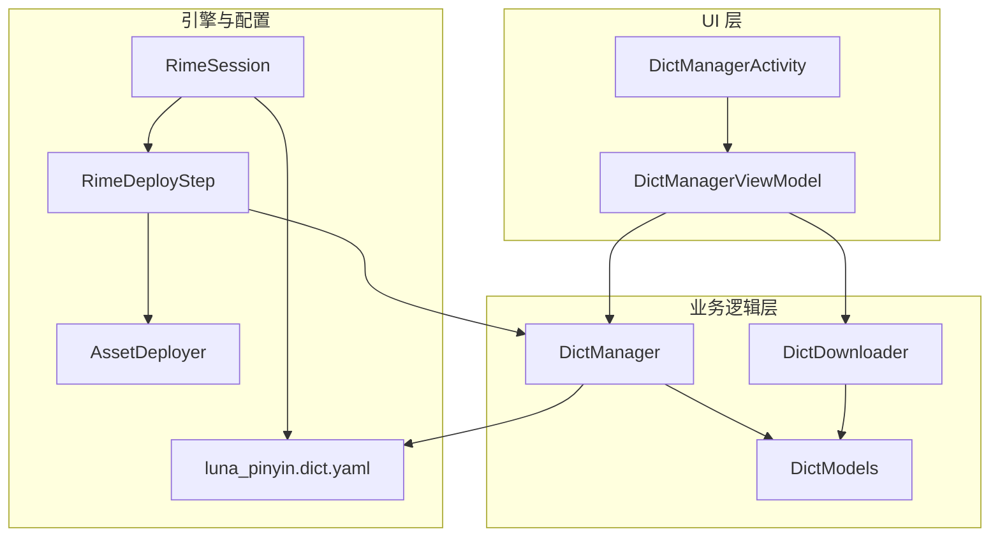
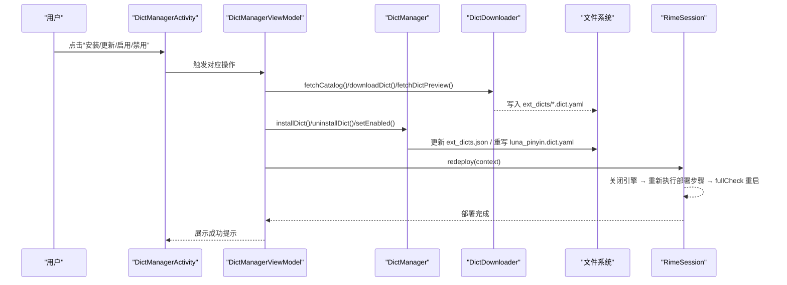
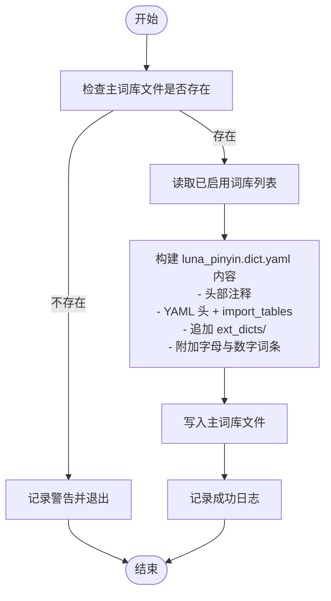
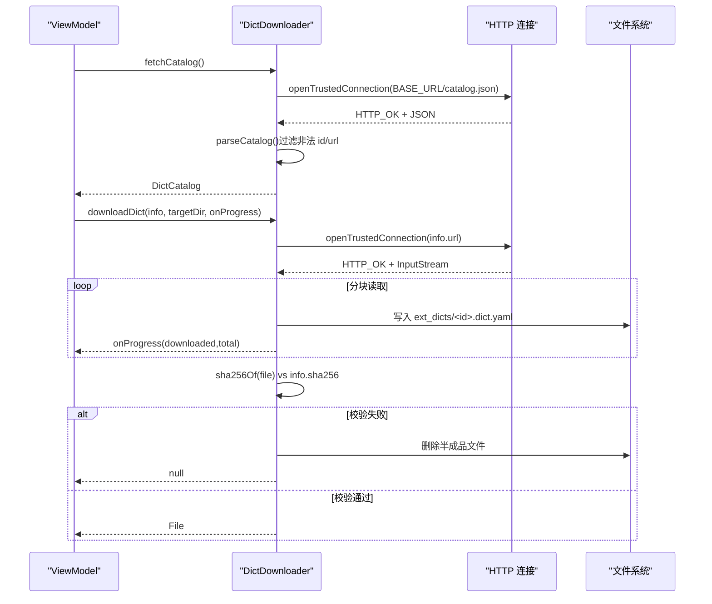
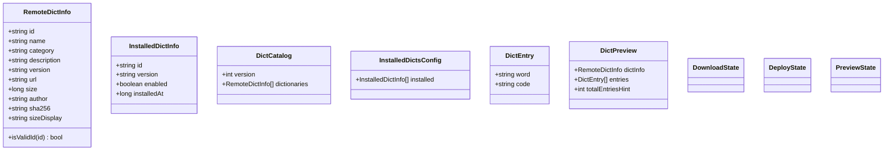
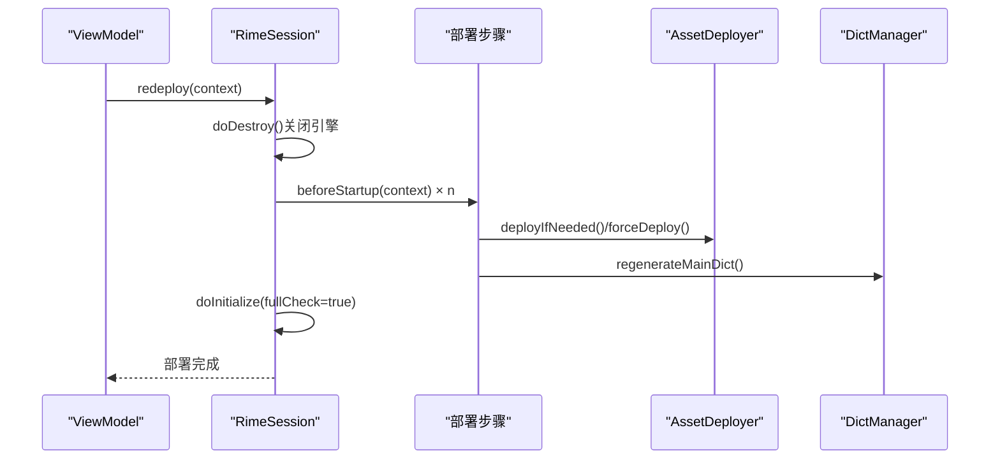
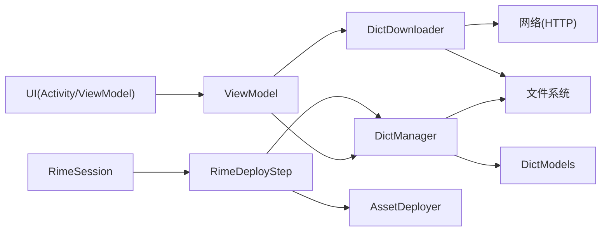

# 扩展词库系统

<cite>
**本文引用的文件**   
- [DictManager.kt](file://app/src/main/java/com/ziyou/ime/dict/DictManager.kt)
- [DictDownloader.kt](file://app/src/main/java/com/ziyou/ime/dict/DictDownloader.kt)
- [DictModels.kt](file://app/src/main/java/com/ziyou/ime/dict/DictModels.kt)
- [RimeSession.kt](file://app/src/main/java/com/ziyou/ime/daemon/RimeSession.kt)
- [RimeDeployStep.kt](file://app/src/main/java/com/ziyou/ime/daemon/RimeDeployStep.kt)
- [AssetDeployer.kt](file://app/src/main/java/com/ziyou/ime/config/AssetDeployer.kt)
- [DictManagerActivity.kt](file://app/src/main/java/com/ziyou/ime/ui/DictManagerActivity.kt)
- [DictManagerViewModel.kt](file://app/src/main/java/com/ziyou/ime/ui/DictManagerViewModel.kt)
- [luna_pinyin.dict.yaml](file://app/src/main/assets/rime/luna_pinyin.dict.yaml)
</cite>

## 目录
1. [简介](#简介)
2. [项目结构](#项目结构)
3. [核心组件](#核心组件)
4. [架构总览](#架构总览)
5. [详细组件分析](#详细组件分析)
6. [依赖关系分析](#依赖关系分析)
7. [性能考量](#性能考量)
8. [故障排查指南](#故障排查指南)
9. [结论](#结论)
10. [附录：使用场景与代码示例路径](#附录使用场景与代码示例路径)

## 简介
本技术文档围绕“扩展词库系统”展开，系统性说明以下能力：
- DictManager 的词库管理机制：安装、卸载、启用/禁用、主词库重组（regenerateMainDict 重写 luna_pinyin.dict.yaml 注入已启用词库）。
- DictDownloader 的下载流程：catalog.json 清单解析、词库文件下载进度回调、远程预览抓取。
- DictModels 的数据模型设计：RemoteDictInfo、InstalledDictInfo、DictCatalog、DictPreview 等。
- 供应链安全保障机制：id 白名单正则校验、sha256 完整性验证、防止路径穿越攻击。
- 词库生效链路：变更 → regenerateMainDict → RimeSession.redeploy 热部署。
- 结合 UI 层（Activity/ViewModel）的使用场景与关键代码路径。

## 项目结构
扩展词库系统位于 app 模块的 dict、ui、daemon、config 包中，配合 assets 中的默认词典模板与 Rime 引擎生命周期管理协同工作。

图表来源 
- [DictManagerActivity.kt:1-738](file://app/src/main/java/com/ziyou/ime/ui/DictManagerActivity.kt#L1-L738)
- [DictManagerViewModel.kt:1-234](file://app/src/main/java/com/ziyou/ime/ui/DictManagerViewModel.kt#L1-L234)
- [DictManager.kt:1-376](file://app/src/main/java/com/ziyou/ime/dict/DictManager.kt#L1-L376)
- [DictDownloader.kt:1-367](file://app/src/main/java/com/ziyou/ime/dict/DictDownloader.kt#L1-L367)
- [DictModels.kt:1-113](file://app/src/main/java/com/ziyou/ime/dict/DictModels.kt#L1-L113)
- [RimeSession.kt:1-226](file://app/src/main/java/com/ziyou/ime/daemon/RimeSession.kt#L1-L226)
- [RimeDeployStep.kt:1-20](file://app/src/main/java/com/ziyou/ime/daemon/RimeDeployStep.kt#L1-L20)
- [AssetDeployer.kt:1-162](file://app/src/main/java/com/ziyou/ime/config/AssetDeployer.kt#L1-L162)
- [luna_pinyin.dict.yaml:1-68](file://app/src/main/assets/rime/luna_pinyin.dict.yaml#L1-L68)

章节来源
- [DictManagerActivity.kt:1-738](file://app/src/main/java/com/ziyou/ime/ui/DictManagerActivity.kt#L1-L738)
- [DictManagerViewModel.kt:1-234](file://app/src/main/java/com/ziyou/ime/ui/DictManagerViewModel.kt#L1-L234)
- [DictManager.kt:1-376](file://app/src/main/java/com/ziyou/ime/dict/DictManager.kt#L1-L376)
- [DictDownloader.kt:1-367](file://app/src/main/java/com/ziyou/ime/dict/DictDownloader.kt#L1-L367)
- [DictModels.kt:1-113](file://app/src/main/java/com/ziyou/ime/dict/DictModels.kt#L1-L113)
- [RimeSession.kt:1-226](file://app/src/main/java/com/ziyou/ime/daemon/RimeSession.kt#L1-L226)
- [RimeDeployStep.kt:1-20](file://app/src/main/java/com/ziyou/ime/daemon/RimeDeployStep.kt#L1-L20)
- [AssetDeployer.kt:1-162](file://app/src/main/java/com/ziyou/ime/config/AssetDeployer.kt#L1-L162)
- [luna_pinyin.dict.yaml:1-68](file://app/src/main/assets/rime/luna_pinyin.dict.yaml#L1-L68)

## 核心组件
- DictManager：单例管理器，负责安装/卸载/启停、本地安装记录读写、主词库重组（regenerateMainDict），以及本地预览读取。
- DictDownloader：网络下载器，负责 catalog.json 拉取与解析、词库文件下载（含进度回调）、远程预览抓取、可信连接与完整性校验。
- DictModels：数据模型定义，包括 RemoteDictInfo、InstalledDictInfo、DictCatalog、DictPreview、DownloadState、DeployState、PreviewState 等。
- RimeSession：Rime 会话与引擎生命周期管理，提供 initialize/redeploy 接口；通过部署步骤在启动前执行资源部署与词库注入。
- AssetDeployer：资源部署器，将 assets/rime 部署到应用内部存储，并维护版本信息。
- UI 层：DictManagerActivity + DictManagerViewModel，提供浏览、下载、预览、启停、更新等操作界面与状态流。

章节来源
- [DictManager.kt:1-376](file://app/src/main/java/com/ziyou/ime/dict/DictManager.kt#L1-L376)
- [DictDownloader.kt:1-367](file://app/src/main/java/com/ziyou/ime/dict/DictDownloader.kt#L1-L367)
- [DictModels.kt:1-113](file://app/src/main/java/com/ziyou/ime/dict/DictModels.kt#L1-L113)
- [RimeSession.kt:1-226](file://app/src/main/java/com/ziyou/ime/daemon/RimeSession.kt#L1-L226)
- [AssetDeployer.kt:1-162](file://app/src/main/java/com/ziyou/ime/config/AssetDeployer.kt#L1-L162)
- [DictManagerActivity.kt:1-738](file://app/src/main/java/com/ziyou/ime/ui/DictManagerActivity.kt#L1-L738)
- [DictManagerViewModel.kt:1-234](file://app/src/main/java/com/ziyou/ime/ui/DictManagerViewModel.kt#L1-L234)

## 架构总览
扩展词库系统采用分层架构：UI 层通过 ViewModel 调用业务层（DictManager/DictDownloader），业务层操作本地文件系统与网络，最终通过 RimeSession 的热部署使词库变更即时生效。

图表来源 
- [DictManagerActivity.kt:1-738](file://app/src/main/java/com/ziyou/ime/ui/DictManagerActivity.kt#L1-L738)
- [DictManagerViewModel.kt:1-234](file://app/src/main/java/com/ziyou/ime/ui/DictManagerViewModel.kt#L1-L234)
- [DictManager.kt:1-376](file://app/src/main/java/com/ziyou/ime/dict/DictManager.kt#L1-L376)
- [DictDownloader.kt:1-367](file://app/src/main/java/com/ziyou/ime/dict/DictDownloader.kt#L1-L367)
- [RimeSession.kt:1-226](file://app/src/main/java/com/ziyou/ime/daemon/RimeSession.kt#L1-L226)

## 详细组件分析

### DictManager：词库管理与主词库重组
- 安装/卸载/启用/禁用：
  - installDict：调用 DictDownloader.downloadDict 下载词库，更新本地安装记录（ext_dicts.json），然后调用 regenerateMainDict 重写主词库。
  - uninstallDict：删除 ext_dicts/<id>.dict.yaml，更新安装记录，再生成主词库。
  - setEnabled：切换 enabled 标志，保存后再生成主词库。
- 主词库重组（regenerateMainDict）：
  - 读取已启用词库列表，构建新的 luna_pinyin.dict.yaml 内容，保留基础 import_tables，并在其后追加 ext_dicts/<id> 条目。
  - 同时附加大写字母与数字词条，确保造词能力。
- 本地预览：
  - readLocalDictPreview：从 ext_dicts/<id>.dict.yaml 解析前 N 条词条，返回 DictPreview。

图表来源 
- [DictManager.kt:222-302](file://app/src/main/java/com/ziyou/ime/dict/DictManager.kt#L222-L302)
- [luna_pinyin.dict.yaml:1-68](file://app/src/main/assets/rime/luna_pinyin.dict.yaml#L1-L68)

章节来源
- [DictManager.kt:61-110](file://app/src/main/java/com/ziyou/ime/dict/DictManager.kt#L61-L110)
- [DictManager.kt:120-193](file://app/src/main/java/com/ziyou/ime/dict/DictManager.kt#L120-L193)
- [DictManager.kt:222-302](file://app/src/main/java/com/ziyou/ime/dict/DictManager.kt#L222-L302)
- [DictManager.kt:314-374](file://app/src/main/java/com/ziyou/ime/dict/DictManager.kt#L314-L374)

### DictDownloader：下载流程与安全控制
- catalog.json 拉取与解析：
  - fetchCatalog：打开可信连接（HTTPS + 域名白名单 + 受控重定向），限制响应大小，解析为 DictCatalog。
  - parseCatalog：过滤非法 id 与不可信 url，构造 RemoteDictInfo 列表。
- 词库文件下载：
  - downloadDict：校验 id 合法性，建立可信连接，边读边写并上报进度，达到上限则拒绝；下载完成后进行 sha256 校验（若提供），失败则删除文件并返回空。
- 远程预览抓取：
  - fetchDictPreview：限制读取大小，解析前 N 条词条，返回 DictPreview。
- 安全机制：
  - ALLOWED_HOSTS：仅允许 gitee.com 与 raw.giteeusercontent.com。
  - requireTrustedUrl：强制 HTTPS 与域名白名单。
  - openTrustedConnection：禁用自动重定向，手动跟随并重验白名单，限制最大跳数。
  - readBoundedText：按上限截断或抛错，防内存/磁盘耗尽。
  - ID 白名单正则：RemoteDictInfo.isValidId 阻断路径穿越（如 "../../foo"）。

图表来源 
- [DictDownloader.kt:54-78](file://app/src/main/java/com/ziyou/ime/dict/DictDownloader.kt#L54-L78)
- [DictDownloader.kt:87-162](file://app/src/main/java/com/ziyou/ime/dict/DictDownloader.kt#L87-L162)
- [DictDownloader.kt:170-202](file://app/src/main/java/com/ziyou/ime/dict/DictDownloader.kt#L170-L202)
- [DictDownloader.kt:264-320](file://app/src/main/java/com/ziyou/ime/dict/DictDownloader.kt#L264-L320)
- [DictDownloader.kt:323-365](file://app/src/main/java/com/ziyou/ime/dict/DictDownloader.kt#L323-L365)

章节来源
- [DictDownloader.kt:54-78](file://app/src/main/java/com/ziyou/ime/dict/DictDownloader.kt#L54-L78)
- [DictDownloader.kt:87-162](file://app/src/main/java/com/ziyou/ime/dict/DictDownloader.kt#L87-L162)
- [DictDownloader.kt:170-202](file://app/src/main/java/com/ziyou/ime/dict/DictDownloader.kt#L170-L202)
- [DictDownloader.kt:264-320](file://app/src/main/java/com/ziyou/ime/dict/DictDownloader.kt#L264-L320)
- [DictDownloader.kt:323-365](file://app/src/main/java/com/ziyou/ime/dict/DictDownloader.kt#L323-L365)

### DictModels：数据模型设计
- RemoteDictInfo：远程词库元数据（id/name/category/description/version/url/size/author/sha256），包含 sizeDisplay 与 isValidId 校验。
- InstalledDictInfo：本地安装记录（id/version/enabled/installAt）。
- DictCatalog：catalog.json 完整结构（version/dictionaries）。
- InstalledDictsConfig：ext_dicts.json 结构（installed）。
- DownloadState/DeployState/PreviewState：UI 状态封装。
- DictEntry/DictPreview：词条与预览数据结构。

图表来源 
- [DictModels.kt:24-56](file://app/src/main/java/com/ziyou/ime/dict/DictModels.kt#L24-L56)
- [DictModels.kt:59-75](file://app/src/main/java/com/ziyou/ime/dict/DictModels.kt#L59-L75)
- [DictModels.kt:67-70](file://app/src/main/java/com/ziyou/ime/dict/DictModels.kt#L67-L70)
- [DictModels.kt:73-75](file://app/src/main/java/com/ziyou/ime/dict/DictModels.kt#L73-L75)
- [DictModels.kt:94-104](file://app/src/main/java/com/ziyou/ime/dict/DictModels.kt#L94-L104)
- [DictModels.kt:78-91](file://app/src/main/java/com/ziyou/ime/dict/DictModels.kt#L78-L91)
- [DictModels.kt:107-112](file://app/src/main/java/com/ziyou/ime/dict/DictModels.kt#L107-L112)

章节来源
- [DictModels.kt:1-113](file://app/src/main/java/com/ziyou/ime/dict/DictModels.kt#L1-L113)

### RimeSession：引擎生命周期与热部署
- initialize：串行化初始化，执行部署步骤（AssetDeployer 部署资源、DictManager 注入词库），创建 dispatcher/api，启动引擎（带超时保护）。
- redeploy：关闭当前引擎 → 以 fullCheck 模式重新启动，重新执行部署步骤，实现词库变更热部署。
- deploySteps：抽象部署步骤接口（RimeDeployStep），由组合根装配，保证单向依赖。

图表来源 
- [RimeSession.kt:189-198](file://app/src/main/java/com/ziyou/ime/daemon/RimeSession.kt#L189-L198)
- [RimeSession.kt:88-153](file://app/src/main/java/com/ziyou/ime/daemon/RimeSession.kt#L88-L153)
- [RimeDeployStep.kt:15-19](file://app/src/main/java/com/ziyou/ime/daemon/RimeDeployStep.kt#L15-L19)
- [AssetDeployer.kt:25-42](file://app/src/main/java/com/ziyou/ime/config/AssetDeployer.kt#L25-L42)
- [DictManager.kt:222-302](file://app/src/main/java/com/ziyou/ime/dict/DictManager.kt#L222-L302)

章节来源
- [RimeSession.kt:88-153](file://app/src/main/java/com/ziyou/ime/daemon/RimeSession.kt#L88-L153)
- [RimeSession.kt:189-198](file://app/src/main/java/com/ziyou/ime/daemon/RimeSession.kt#L189-L198)
- [RimeDeployStep.kt:15-19](file://app/src/main/java/com/ziyou/ime/daemon/RimeDeployStep.kt#L15-L19)

### UI 层：交互与状态流
- DictManagerActivity：Compose 界面，监听部署状态并 Toast 提示，渲染分类筛选、词库卡片、下载进度与预览弹窗。
- DictManagerViewModel：管理 catalogState/installedDicts/downloadState/deployState/updatableIds/previewState 等状态流；提供 refreshCatalog、installDict、uninstallDict、toggleEnabled、updateDict、loadPreview 等方法；在操作成功后触发 redeploy。

章节来源
- [DictManagerActivity.kt:1-738](file://app/src/main/java/com/ziyou/ime/ui/DictManagerActivity.kt#L1-L738)
- [DictManagerViewModel.kt:1-234](file://app/src/main/java/com/ziyou/ime/ui/DictManagerViewModel.kt#L1-L234)

## 依赖关系分析
- UI 层依赖 ViewModel，ViewModel 依赖业务层（DictManager/DictDownloader）。
- DictManager 依赖文件系统与 DictModels，不直接依赖网络。
- DictDownloader 依赖网络与文件系统，严格的安全校验贯穿始终。
- RimeSession 通过 RimeDeployStep 抽象解耦业务模块，避免向上依赖。
- AssetDeployer 负责资源部署，与 DictManager 共同构成启动前部署步骤。

图表来源 
- [DictManagerViewModel.kt:1-234](file://app/src/main/java/com/ziyou/ime/ui/DictManagerViewModel.kt#L1-L234)
- [DictManager.kt:1-376](file://app/src/main/java/com/ziyou/ime/dict/DictManager.kt#L1-L376)
- [DictDownloader.kt:1-367](file://app/src/main/java/com/ziyou/ime/dict/DictDownloader.kt#L1-L367)
- [RimeSession.kt:1-226](file://app/src/main/java/com/ziyou/ime/daemon/RimeSession.kt#L1-L226)
- [RimeDeployStep.kt:1-20](file://app/src/main/java/com/ziyou/ime/daemon/RimeDeployStep.kt#L1-L20)
- [AssetDeployer.kt:1-162](file://app/src/main/java/com/ziyou/ime/config/AssetDeployer.kt#L1-L162)

章节来源
- [DictManagerViewModel.kt:1-234](file://app/src/main/java/com/ziyou/ime/ui/DictManagerViewModel.kt#L1-L234)
- [DictManager.kt:1-376](file://app/src/main/java/com/ziyou/ime/dict/DictManager.kt#L1-L376)
- [DictDownloader.kt:1-367](file://app/src/main/java/com/ziyou/ime/dict/DictDownloader.kt#L1-L367)
- [RimeSession.kt:1-226](file://app/src/main/java/com/ziyou/ime/daemon/RimeSession.kt#L1-L226)
- [RimeDeployStep.kt:1-20](file://app/src/main/java/com/ziyou/ime/daemon/RimeDeployStep.kt#L1-L20)
- [AssetDeployer.kt:1-162](file://app/src/main/java/com/ziyou/ime/config/AssetDeployer.kt#L1-L162)

## 性能考量
- IO 线程隔离：DictManager.install/uninstall/setEnabled 均在 Dispatchers.IO 执行，避免阻塞主线程。
- 下载限速与上限：MAX_DICT_BYTES 限制单个词库文件大小，readBoundedText 限制 catalog/预览大小，防止内存/磁盘耗尽。
- 进度回调：downloadDict 实时回调 onProgress，提升用户体验。
- 引擎启动超时：RimeSession.initialize 设置 STARTUP_TIMEOUT_MS，避免长时间阻塞。
- 部署步骤串行：RimeSession 使用 lifecycleMutex 串行化 initialize/destroy/redeploy，避免并发导致的状态不一致。

[本节为通用指导，无需具体文件引用]

## 故障排查指南
- catalog 拉取失败：
  - 检查网络连接与服务器可达性；查看 DictDownloader.fetchCatalog 的错误日志。
- 下载失败或中断：
  - 检查 URL 是否命中白名单与 HTTPS；确认 contentLength 与 size 一致性；查看 onProgress 与异常日志。
- SHA-256 校验失败：
  - 确认 catalog 提供的 sha256 与实际文件一致；失败会自动删除半成品文件，需重试。
- 主词库生成失败：
  - 检查 luna_pinyin.dict.yaml 是否存在且可写；查看 DictManager.regenerateMainDict 的异常日志。
- 引擎启动超时：
  - 检查词典文件格式与完整性；降低 fullCheck 或优化资源规模；查看 RimeSession 超时日志。

章节来源
- [DictDownloader.kt:54-78](file://app/src/main/java/com/ziyou/ime/dict/DictDownloader.kt#L54-L78)
- [DictDownloader.kt:87-162](file://app/src/main/java/com/ziyou/ime/dict/DictDownloader.kt#L87-L162)
- [DictManager.kt:222-302](file://app/src/main/java/com/ziyou/ime/dict/DictManager.kt#L222-L302)
- [RimeSession.kt:88-153](file://app/src/main/java/com/ziyou/ime/daemon/RimeSession.kt#L88-L153)

## 结论
扩展词库系统通过清晰的职责划分与严格的安全控制，实现了安全的词库分发、安装与热部署。DictManager 负责词库生命周期与主词库重组，DictDownloader 保障下载过程的可控性与完整性，RimeSession 提供可靠的引擎热部署能力。UI 层通过 StateFlow 驱动状态更新，提供流畅的用户体验。整体架构具备良好的可扩展性与可测试性。

[本节为总结性内容，无需具体文件引用]

## 附录：使用场景与代码示例路径
- 安装词库：
  - 入口：DictManagerViewModel.installDict → DictManager.installDict → DictDownloader.downloadDict → regenerateMainDict → RimeSession.redeploy
  - 参考路径：
    - [DictManagerViewModel.kt:129-148](file://app/src/main/java/com/ziyou/ime/ui/DictManagerViewModel.kt#L129-L148)
    - [DictManager.kt:120-150](file://app/src/main/java/com/ziyou/ime/dict/DictManager.kt#L120-L150)
    - [DictDownloader.kt:87-162](file://app/src/main/java/com/ziyou/ime/dict/DictDownloader.kt#L87-L162)
    - [DictManager.kt:222-302](file://app/src/main/java/com/ziyou/ime/dict/DictManager.kt#L222-L302)
    - [RimeSession.kt:189-198](file://app/src/main/java/com/ziyou/ime/daemon/RimeSession.kt#L189-L198)
- 卸载词库：
  - 入口：DictManagerViewModel.uninstallDict → DictManager.uninstallDict → regenerateMainDict → RimeSession.redeploy
  - 参考路径：
    - [DictManagerViewModel.kt:151-158](file://app/src/main/java/com/ziyou/ime/ui/DictManagerViewModel.kt#L151-L158)
    - [DictManager.kt:155-172](file://app/src/main/java/com/ziyou/ime/dict/DictManager.kt#L155-L172)
- 启用/禁用词库：
  - 入口：DictManagerViewModel.toggleEnabled → DictManager.setEnabled → regenerateMainDict → RimeSession.redeploy
  - 参考路径：
    - [DictManagerViewModel.kt:161-168](file://app/src/main/java/com/ziyou/ime/ui/DictManagerViewModel.kt#L161-L168)
    - [DictManager.kt:177-193](file://app/src/main/java/com/ziyou/ime/dict/DictManager.kt#L177-L193)
- 更新词库：
  - 入口：DictManagerViewModel.updateDict → installDict（同安装流程）
  - 参考路径：
    - [DictManagerViewModel.kt:171-173](file://app/src/main/java/com/ziyou/ime/ui/DictManagerViewModel.kt#L171-L173)
- 预览词库：
  - 已安装：DictManager.readLocalDictPreview
  - 未安装：DictDownloader.fetchDictPreview
  - 参考路径：
    - [DictManagerViewModel.kt:206-227](file://app/src/main/java/com/ziyou/ime/ui/DictManagerViewModel.kt#L206-L227)
    - [DictManager.kt:314-374](file://app/src/main/java/com/ziyou/ime/dict/DictManager.kt#L314-L374)
    - [DictDownloader.kt:170-202](file://app/src/main/java/com/ziyou/ime/dict/DictDownloader.kt#L170-L202)
- 主词库重组：
  - 入口：DictManager.regenerateMainDict → buildMainDictContent → 写入 luna_pinyin.dict.yaml
  - 参考路径：
    - [DictManager.kt:222-302](file://app/src/main/java/com/ziyou/ime/dict/DictManager.kt#L222-L302)
    - [luna_pinyin.dict.yaml:1-68](file://app/src/main/assets/rime/luna_pinyin.dict.yaml#L1-L68)
- 引擎热部署：
  - 入口：RimeSession.redeploy → doDestroy → doInitialize(fullCheck=true)
  - 参考路径：
    - [RimeSession.kt:189-198](file://app/src/main/java/com/ziyou/ime/daemon/RimeSession.kt#L189-L198)
    - [RimeSession.kt:88-153](file://app/src/main/java/com/ziyou/ime/daemon/RimeSession.kt#L88-L153)