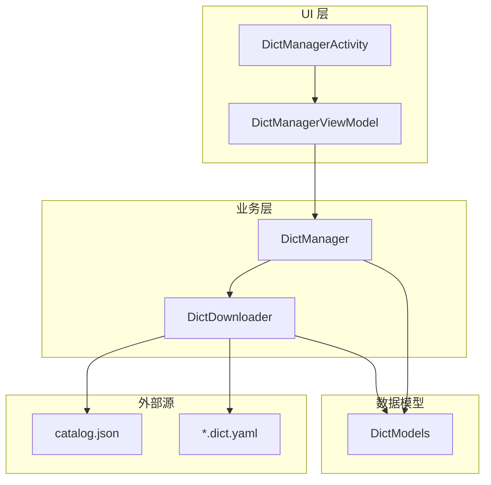
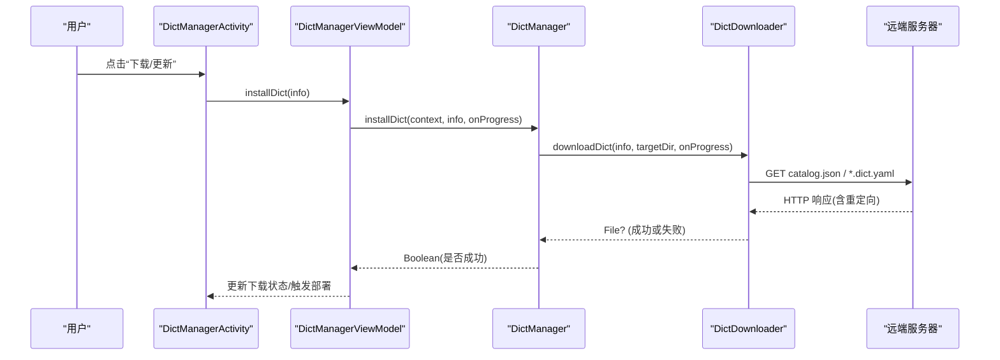
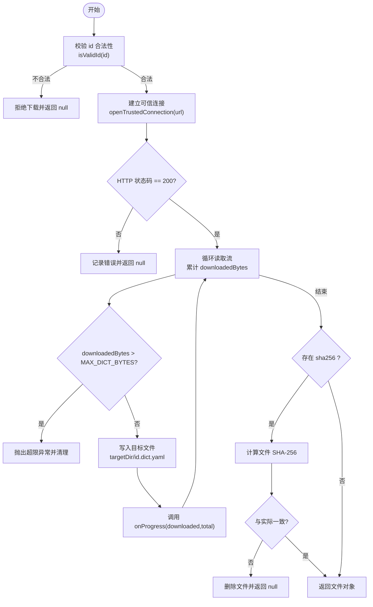
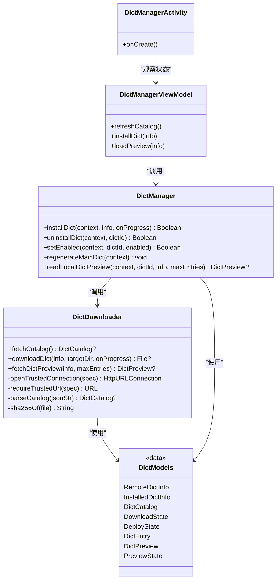

# 词库下载器

<cite>
**本文引用的文件**   
- [DictDownloader.kt](file://app/src/main/java/com/ziyou/ime/dict/DictDownloader.kt)
- [DictModels.kt](file://app/src/main/java/com/ziyou/ime/dict/DictModels.kt)
- [DictManager.kt](file://app/src/main/java/com/ziyou/ime/dict/DictManager.kt)
- [DictManagerActivity.kt](file://app/src/main/java/com/ziyou/ime/ui/DictManagerActivity.kt)
- [DictManagerViewModel.kt](file://app/src/main/java/com/ziyou/ime/ui/DictManagerViewModel.kt)
</cite>

## 目录
1. [简介](#简介)
2. [项目结构](#项目结构)
3. [核心组件](#核心组件)
4. [架构总览](#架构总览)
5. [详细组件分析](#详细组件分析)
6. [依赖关系分析](#依赖关系分析)
7. [性能考量](#性能考量)
8. [故障排查指南](#故障排查指南)
9. [结论](#结论)
10. [附录：使用示例与最佳实践](#附录使用示例与最佳实践)

## 简介
本技术文档围绕“词库下载器”的实现进行系统化说明，重点覆盖 DictDownloader 类的下载流程、catalog.json 清单解析、RemoteDictInfo 数据获取与处理、downloadDict 方法的完整下载链路（网络请求、进度回调 onProgress、文件保存路径管理、错误处理）、远程预览抓取（图片资源下载与 DictPreview 封装）以及供应链安全保障机制（id 白名单正则校验、sha256 完整性验证、防止路径穿越攻击）。同时提供 UI 层如何消费下载状态与预览数据的示例路径，帮助读者快速理解并正确使用该模块。

## 项目结构
词库下载相关代码集中在 app 模块的 dict 包与 ui 包中：
- dict 包：负责数据模型、下载器与安装管理器
- ui 包：负责界面展示与状态流转（Compose + ViewModel）

图表来源
- [DictManagerActivity.kt:1-738](file://app/src/main/java/com/ziyou/ime/ui/DictManagerActivity.kt#L1-L738)
- [DictManagerViewModel.kt:1-234](file://app/src/main/java/com/ziyou/ime/ui/DictManagerViewModel.kt#L1-L234)
- [DictManager.kt:1-376](file://app/src/main/java/com/ziyou/ime/dict/DictManager.kt#L1-L376)
- [DictDownloader.kt:1-367](file://app/src/main/java/com/ziyou/ime/dict/DictDownloader.kt#L1-L367)
- [DictModels.kt:1-113](file://app/src/main/java/com/ziyou/ime/dict/DictModels.kt#L1-L113)

章节来源
- [DictManagerActivity.kt:1-738](file://app/src/main/java/com/ziyou/ime/ui/DictManagerActivity.kt#L1-L738)
- [DictManagerViewModel.kt:1-234](file://app/src/main/java/com/ziyou/ime/ui/DictManagerViewModel.kt#L1-L234)
- [DictManager.kt:1-376](file://app/src/main/java/com/ziyou/ime/dict/DictManager.kt#L1-L376)
- [DictDownloader.kt:1-367](file://app/src/main/java/com/ziyou/ime/dict/DictDownloader.kt#L1-L367)
- [DictModels.kt:1-113](file://app/src/main/java/com/ziyou/ime/dict/DictModels.kt#L1-L113)

## 核心组件
- DictDownloader：词库下载器，负责 catalog.json 拉取、词库文件下载、预览抓取、安全校验与受限重定向。
- DictManager：词库管理器，负责安装/卸载/启用禁用、主词库重新生成、本地安装记录读写。
- DictModels：数据模型定义，包括 RemoteDictInfo、InstalledDictInfo、DictCatalog、DownloadState、DeployState、DictEntry、DictPreview、PreviewState 等。
- UI 层：DictManagerActivity 与 DictManagerViewModel 负责状态管理与用户交互。

章节来源
- [DictDownloader.kt:1-367](file://app/src/main/java/com/ziyou/ime/dict/DictDownloader.kt#L1-L367)
- [DictManager.kt:1-376](file://app/src/main/java/com/ziyou/ime/dict/DictManager.kt#L1-L376)
- [DictModels.kt:1-113](file://app/src/main/java/com/ziyou/ime/dict/DictModels.kt#L1-L113)
- [DictManagerActivity.kt:1-738](file://app/src/main/java/com/ziyou/ime/ui/DictManagerActivity.kt#L1-L738)
- [DictManagerViewModel.kt:1-234](file://app/src/main/java/com/ziyou/ime/ui/DictManagerViewModel.kt#L1-L234)

## 架构总览
整体采用分层架构：UI 层通过 ViewModel 调用 DictManager，后者协调 DictDownloader 完成网络与文件系统操作，数据模型贯穿各层。

图表来源
- [DictManagerViewModel.kt:128-148](file://app/src/main/java/com/ziyou/ime/ui/DictManagerViewModel.kt#L128-L148)
- [DictManager.kt:120-150](file://app/src/main/java/com/ziyou/ime/dict/DictManager.kt#L120-L150)
- [DictDownloader.kt:87-162](file://app/src/main/java/com/ziyou/ime/dict/DictDownloader.kt#L87-L162)

## 详细组件分析

### DictDownloader：下载器核心
- catalog.json 解析
  - fetchCatalog() 在 IO 线程执行，建立可信连接后读取 JSON 文本，限制最大字节数，解析为 DictCatalog。
  - parseCatalog() 对每个字典条目进行 id 合法性校验与 URL 可信校验（HTTPS + 域名白名单），非法项直接丢弃。
- RemoteDictInfo 获取与处理
  - 从 catalog.json 的 dictionaries 数组构建 RemoteDictInfo，包含 id、name、category、description、version、url、size、author、sha256。
- downloadDict 完整下载流程
  - 输入参数：RemoteDictInfo、目标目录、onProgress 回调。
  - 防御性校验：id 必须满足正则（仅字母/数字/下划线/连字符），防止路径穿越写盘。
  - 网络请求：openTrustedConnection() 强制 HTTPS、域名白名单、手动跟随重定向且每跳都重新校验。
  - 进度回调：边读边写，累计 downloadedBytes，计算 totalBytes（优先 response contentLength，否则回退 catalog.size），周期性调用 onProgress(downloadedBytes, totalBytes)。
  - 文件保存：写入 targetDir/${info.id}.dict.yaml；异常时删除半成品。
  - 完整性校验：若 sha256 非空，则计算文件 SHA-256 并与 catalog 提供的值比较，不一致则删除文件并返回失败。
  - 错误处理：捕获 IOException 与通用 Exception，记录日志并清理临时文件，返回 null。
- 远程预览抓取
  - fetchDictPreview() 同样受白名单与重定向管控，读取前 N 条词条（MAX_PREVIEW_BYTES 截断），解析为 DictEntry 列表，封装为 DictPreview（包含 dictInfo、entries、totalEntriesHint）。
- 供应链安全保障
  - id 白名单正则：RemoteDictInfo.isValidId() 严格限定字符集，阻断 “../” 等路径穿越。
  - sha256 完整性验证：下载后计算并比对，确保未被篡改。
  - 防路径穿越：id 拼接文件名前校验，非法 id 直接拒绝下载。
  - 可控重定向：禁止自动重定向，手动跟随并限制最大跳数，每跳均过白名单校验。
  - 域名白名单：ALLOWED_HOSTS 限定 gitee.com 与 raw.giteeusercontent.com。
  - 大小上限：catalog.json 与单个词库文件均有字节上限，避免恶意自报小 size 实际超大文件耗尽磁盘。

图表来源
- [DictDownloader.kt:87-162](file://app/src/main/java/com/ziyou/ime/dict/DictDownloader.kt#L87-L162)
- [DictDownloader.kt:249-260](file://app/src/main/java/com/ziyou/ime/dict/DictDownloader.kt#L249-L260)
- [DictDownloader.kt:262-295](file://app/src/main/java/com/ziyou/ime/dict/DictDownloader.kt#L262-L295)

章节来源
- [DictDownloader.kt:54-78](file://app/src/main/java/com/ziyou/ime/dict/DictDownloader.kt#L54-L78)
- [DictDownloader.kt:87-162](file://app/src/main/java/com/ziyou/ime/dict/DictDownloader.kt#L87-L162)
- [DictDownloader.kt:170-202](file://app/src/main/java/com/ziyou/ime/dict/DictDownloader.kt#L170-L202)
- [DictDownloader.kt:208-247](file://app/src/main/java/com/ziyou/ime/dict/DictDownloader.kt#L208-L247)
- [DictDownloader.kt:262-295](file://app/src/main/java/com/ziyou/ime/dict/DictDownloader.kt#L262-L295)
- [DictDownloader.kt:322-365](file://app/src/main/java/com/ziyou/ime/dict/DictDownloader.kt#L322-L365)

### DictModels：数据模型与安全校验
- RemoteDictInfo：包含 id、name、category、description、version、url、size、author、sha256 等字段，并提供 isValidId() 正则校验。
- DictCategory：分类枚举，支持 fromValue 转换。
- DownloadState/DeployState：用于 UI 状态机（Idle、Downloading、Success、Error 等）。
- DictEntry/DictPreview：预览数据结构，包含词条列表与总数提示。
- InstalledDictsConfig/InstalledDictInfo：本地安装记录结构。

章节来源
- [DictModels.kt:23-56](file://app/src/main/java/com/ziyou/ime/dict/DictModels.kt#L23-L56)
- [DictModels.kt:58-76](file://app/src/main/java/com/ziyou/ime/dict/DictModels.kt#L58-L76)
- [DictModels.kt:77-92](file://app/src/main/java/com/ziyou/ime/dict/DictModels.kt#L77-L92)
- [DictModels.kt:93-113](file://app/src/main/java/com/ziyou/ime/dict/DictModels.kt#L93-L113)

### DictManager：安装管理与主词库重建
- 安装/卸载/启用禁用：维护 ext_dicts.json 安装记录，并在变更后重新生成主词库 luna_pinyin.dict.yaml。
- 主词库重建：保留基础 import_tables，动态追加已启用的扩展词库路径，输出 YAML 头部与词条片段。
- 本地预览：readLocalDictPreview() 读取已安装词库文件，解析前 N 条词条并封装为 DictPreview。

章节来源
- [DictManager.kt:120-150](file://app/src/main/java/com/ziyou/ime/dict/DictManager.kt#L120-L150)
- [DictManager.kt:155-172](file://app/src/main/java/com/ziyou/ime/dict/DictManager.kt#L155-L172)
- [DictManager.kt:177-193](file://app/src/main/java/com/ziyou/ime/dict/DictManager.kt#L177-L193)
- [DictManager.kt:222-302](file://app/src/main/java/com/ziyou/ime/dict/DictManager.kt#L222-L302)
- [DictManager.kt:314-339](file://app/src/main/java/com/ziyou/ime/dict/DictManager.kt#L314-L339)

### UI 层：状态管理与用户交互
- DictManagerViewModel：
  - 刷新 catalog：调用 DictDownloader.fetchCatalog()，更新 CatalogState。
  - 安装词库：调用 DictManager.installDict()，传入 onProgress 回调以更新 DownloadState。
  - 预览加载：已安装走本地预览，未安装走远程预览 fetchDictPreview()。
- DictManagerActivity：
  - Compose 界面展示分类筛选、词库卡片、下载进度条、预览弹窗等。
  - 监听 deployState 变化，给出 Toast 提示。

章节来源
- [DictManagerViewModel.kt:76-91](file://app/src/main/java/com/ziyou/ime/ui/DictManagerViewModel.kt#L76-L91)
- [DictManagerViewModel.kt:128-148](file://app/src/main/java/com/ziyou/ime/ui/DictManagerViewModel.kt#L128-L148)
- [DictManagerViewModel.kt:206-227](file://app/src/main/java/com/ziyou/ime/ui/DictManagerViewModel.kt#L206-L227)
- [DictManagerActivity.kt:74-156](file://app/src/main/java/com/ziyou/ime/ui/DictManagerActivity.kt#L74-L156)
- [DictManagerActivity.kt:475-493](file://app/src/main/java/com/ziyou/ime/ui/DictManagerActivity.kt#L475-L493)
- [DictManagerActivity.kt:515-717](file://app/src/main/java/com/ziyou/ime/ui/DictManagerActivity.kt#L515-L717)

## 依赖关系分析
- DictDownloader 依赖 java.net.HttpURLConnection、java.io.*、java.security.MessageDigest、org.json.*。
- DictManager 依赖 android.content.Context、java.io.File、org.json.*。
- UI 层依赖 kotlinx.coroutines.flow、lifecycleScope、Compose 组件。
- 数据模型在各层间共享，保证类型一致性。

图表来源
- [DictDownloader.kt:1-367](file://app/src/main/java/com/ziyou/ime/dict/DictDownloader.kt#L1-L367)
- [DictManager.kt:1-376](file://app/src/main/java/com/ziyou/ime/dict/DictManager.kt#L1-L376)
- [DictModels.kt:1-113](file://app/src/main/java/com/ziyou/ime/dict/DictModels.kt#L1-L113)
- [DictManagerViewModel.kt:1-234](file://app/src/main/java/com/ziyou/ime/ui/DictManagerViewModel.kt#L1-L234)
- [DictManagerActivity.kt:1-738](file://app/src/main/java/com/ziyou/ime/ui/DictManagerActivity.kt#L1-L738)

章节来源
- [DictDownloader.kt:1-367](file://app/src/main/java/com/ziyou/ime/dict/DictDownloader.kt#L1-L367)
- [DictManager.kt:1-376](file://app/src/main/java/com/ziyou/ime/dict/DictManager.kt#L1-L376)
- [DictModels.kt:1-113](file://app/src/main/java/com/ziyou/ime/dict/DictModels.kt#L1-L113)
- [DictManagerViewModel.kt:1-234](file://app/src/main/java/com/ziyou/ime/ui/DictManagerViewModel.kt#L1-L234)
- [DictManagerActivity.kt:1-738](file://app/src/main/java/com/ziyou/ime/ui/DictManagerActivity.kt#L1-L738)

## 性能考量
- 网络 I/O：所有网络请求均在 IO 线程执行（withContext(Dispatchers.IO)），避免阻塞主线程。
- 流式读写：下载过程按固定缓冲区大小循环读取与写入，降低内存占用。
- 预览截断：预览读取设置 MAX_PREVIEW_BYTES，仅提取前 N 条词条，减少带宽与 CPU 消耗。
- 文件大小限制：catalog.json 与单个词库文件分别设置上限，防止恶意资源耗尽磁盘。
- 重定向控制：限制最大跳转次数，避免无限重定向导致的性能问题。

[本节为通用指导，无需特定文件引用]

## 故障排查指南
- catalog.json 拉取失败
  - 检查网络连接与服务器可达性，查看 HTTP 状态码与日志。
  - 确认 BASE_URL 与 ALLOWED_HOSTS 配置正确。
- 下载失败或中断
  - 检查 onProgress 回调是否正常触发，确认 downloadedBytes 与 totalBytes 合理。
  - 查看是否存在 IOException 或超时，必要时调整 CONNECT_TIMEOUT/READ_TIMEOUT。
- SHA-256 校验失败
  - 确认 catalog 提供的 sha256 是否正确，检查下载内容是否被篡改。
  - 失败会删除文件并返回 null，需重试或更换源。
- 预览加载失败
  - 已安装词库：检查本地文件是否存在与可读。
  - 未安装词库：检查远程 URL 是否可达，预览截断逻辑是否影响词条数量。
- 路径穿越防护
  - 非法 id 会被拒绝下载，检查 catalog 中的 id 是否符合正则。
  - 若出现异常，检查 openTrustedConnection 的重定向链是否命中白名单。

章节来源
- [DictDownloader.kt:54-78](file://app/src/main/java/com/ziyou/ime/dict/DictDownloader.kt#L54-L78)
- [DictDownloader.kt:87-162](file://app/src/main/java/com/ziyou/ime/dict/DictDownloader.kt#L87-L162)
- [DictDownloader.kt:170-202](file://app/src/main/java/com/ziyou/ime/dict/DictDownloader.kt#L170-L202)
- [DictDownloader.kt:262-295](file://app/src/main/java/com/ziyou/ime/dict/DictDownloader.kt#L262-L295)
- [DictManager.kt:314-339](file://app/src/main/java/com/ziyou/ime/dict/DictManager.kt#L314-L339)

## 结论
词库下载器通过严格的供应链安全策略（id 白名单、sha256 校验、可控重定向、域名白名单、大小上限）保障了下载过程的安全性与稳定性。downloadDict 方法实现了完整的下载流程，包括进度回调、文件路径管理与错误处理；远程预览功能提供了轻量化的预览能力。UI 层通过 ViewModel 与 StateFlow 将下载状态与预览结果直观呈现给用户。整体设计清晰、健壮，适合在生产环境中使用。

[本节为总结性内容，无需特定文件引用]

## 附录：使用示例与最佳实践
- 处理下载进度
  - 在 ViewModel 中调用 installDict(info) 时传入 onProgress 回调，根据 downloaded/total 计算 progress 并更新 DownloadState.Downloading。
  - UI 层通过 LinearProgressIndicator 显示进度条。
  - 参考路径：[DictManagerViewModel.kt:128-148](file://app/src/main/java/com/ziyou/ime/ui/DictManagerViewModel.kt#L128-L148)、[DictManagerActivity.kt:475-493](file://app/src/main/java/com/ziyou/ime/ui/DictManagerActivity.kt#L475-L493)
- 错误处理与异常恢复
  - 下载失败时，UI 层应提示用户并重试；可结合 CatalogState.Error 的 onRetry 按钮实现。
  - 参考路径：[DictManagerActivity.kt:496-510](file://app/src/main/java/com/ziyou/ime/ui/DictManagerActivity.kt#L496-L510)
- 预览加载
  - 已安装词库优先读取本地文件，未安装则远程预览；失败时显示错误弹窗。
  - 参考路径：[DictManagerViewModel.kt:206-227](file://app/src/main/java/com/ziyou/ime/ui/DictManagerViewModel.kt#L206-L227)、[DictManagerActivity.kt:515-717](file://app/src/main/java/com/ziyou/ime/ui/DictManagerActivity.kt#L515-L717)
- 供应链安全最佳实践
  - 始终使用 isValidId() 校验 id，避免路径穿越。
  - 启用 sha256 校验，确保文件完整性。
  - 保持 ALLOWED_HOSTS 与 MAX_REDIRECTS 配置合理，防止外链投毒与重定向逃逸。
  - 参考路径：[DictModels.kt:46-56](file://app/src/main/java/com/ziyou/ime/dict/DictModels.kt#L46-L56)、[DictDownloader.kt:262-295](file://app/src/main/java/com/ziyou/ime/dict/DictDownloader.kt#L262-L295)

章节来源
- [DictManagerViewModel.kt:128-148](file://app/src/main/java/com/ziyou/ime/ui/DictManagerViewModel.kt#L128-L148)
- [DictManagerActivity.kt:475-493](file://app/src/main/java/com/ziyou/ime/ui/DictManagerActivity.kt#L475-L493)
- [DictManagerActivity.kt:496-510](file://app/src/main/java/com/ziyou/ime/ui/DictManagerActivity.kt#L496-L510)
- [DictManagerViewModel.kt:206-227](file://app/src/main/java/com/ziyou/ime/ui/DictManagerViewModel.kt#L206-L227)
- [DictManagerActivity.kt:515-717](file://app/src/main/java/com/ziyou/ime/ui/DictManagerActivity.kt#L515-L717)
- [DictModels.kt:46-56](file://app/src/main/java/com/ziyou/ime/dict/DictModels.kt#L46-L56)
- [DictDownloader.kt:262-295](file://app/src/main/java/com/ziyou/ime/dict/DictDownloader.kt#L262-L295)