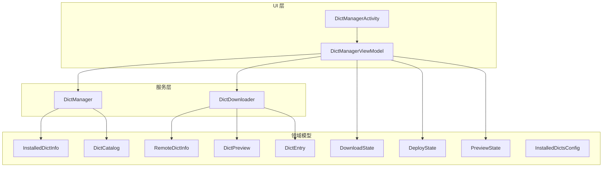
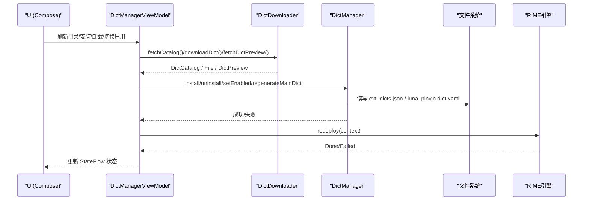
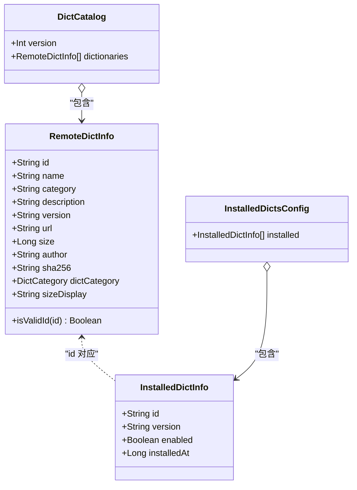
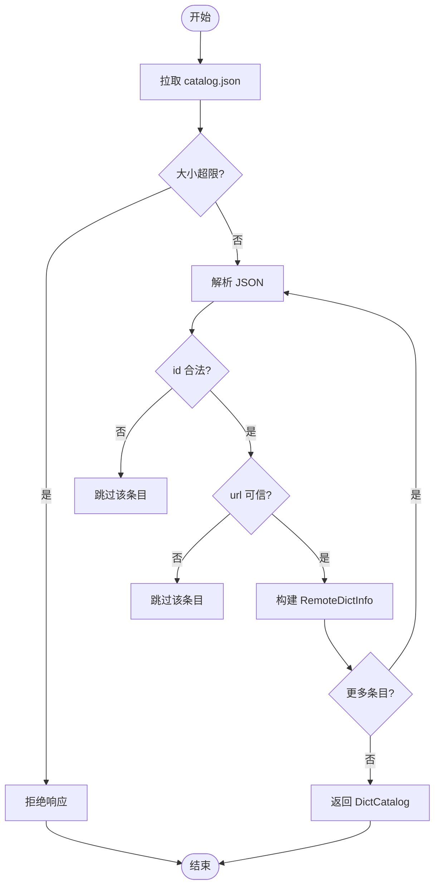
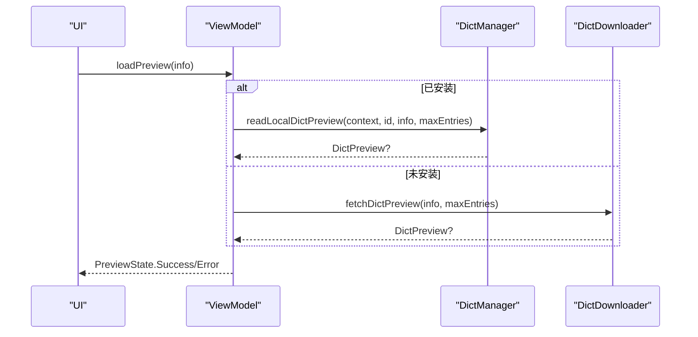
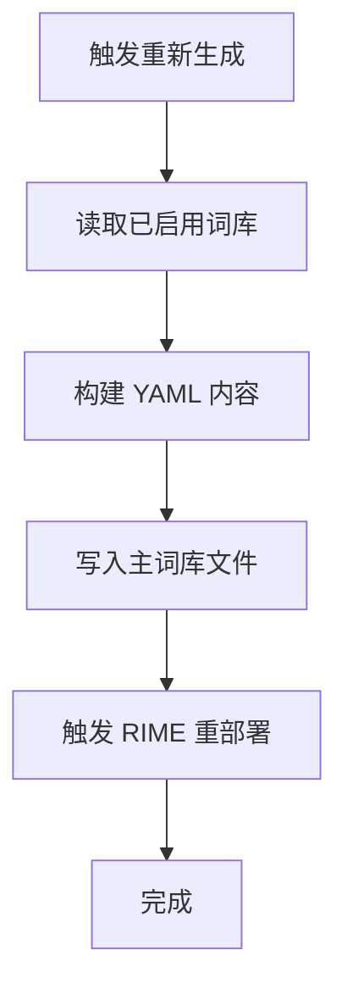
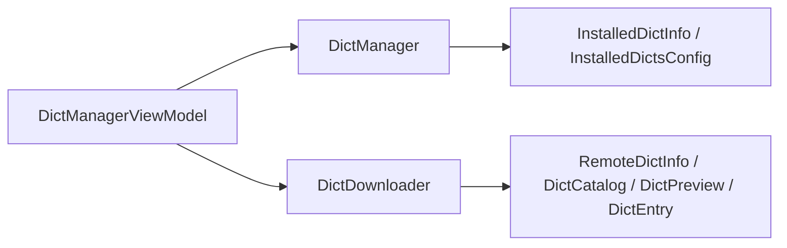

# 词库数据模型

<cite>
**本文引用的文件**   
- [DictModels.kt](file://app/src/main/java/com/ziyou/ime/dict/DictModels.kt)
- [DictManager.kt](file://app/src/main/java/com/ziyou/ime/dict/DictManager.kt)
- [DictDownloader.kt](file://app/src/main/java/com/ziyou/ime/dict/DictDownloader.kt)
- [DictManagerActivity.kt](file://app/src/main/java/com/ziyou/ime/ui/DictManagerActivity.kt)
- [DictManagerViewModel.kt](file://app/src/main/java/com/ziyou/ime/ui/DictManagerViewModel.kt)
</cite>

## 目录
1. [简介](#简介)
2. [项目结构](#项目结构)
3. [核心组件](#核心组件)
4. [架构总览](#架构总览)
5. [详细组件分析](#详细组件分析)
6. [依赖关系分析](#依赖关系分析)
7. [性能考量](#性能考量)
8. [故障排查指南](#故障排查指南)
9. [结论](#结论)
10. [附录：数据示例与使用场景](#附录数据示例与使用场景)

## 简介
本技术文档聚焦于扩展词库的数据模型与相关处理逻辑，围绕 DictModels.kt 中定义的核心数据结构展开，包括 RemoteDictInfo、InstalledDictInfo、DictCatalog、DictPreview、DictEntry 等。文档将详细说明各数据类的字段含义、类型约束、业务语义，以及它们在不同组件间的流转与状态转换（如远程目录到本地安装记录的映射、预览数据的生成）。同时涵盖数据校验规则（ID 合法性、版本格式、文件大小限制）、错误处理策略与典型使用场景，帮助读者全面理解并正确使用这些模型。

## 项目结构
词库数据模型位于 app 模块的 dict 包内，UI 层通过 ViewModel 和 Activity 消费这些模型；下载与持久化由 DictManager 与 DictDownloader 负责。整体组织方式以“领域模型 + 管理器 + 下载器 + UI”分层清晰，便于维护与扩展。

图表来源
- [DictManagerActivity.kt:1-738](file://app/src/main/java/com/ziyou/ime/ui/DictManagerActivity.kt#L1-L738)
- [DictManagerViewModel.kt:1-234](file://app/src/main/java/com/ziyou/ime/ui/DictManagerViewModel.kt#L1-L234)
- [DictManager.kt:1-376](file://app/src/main/java/com/ziyou/ime/dict/DictManager.kt#L1-L376)
- [DictDownloader.kt:1-367](file://app/src/main/java/com/ziyou/ime/dict/DictDownloader.kt#L1-L367)
- [DictModels.kt:1-113](file://app/src/main/java/com/ziyou/ime/dict/DictModels.kt#L1-L113)

章节来源
- [DictModels.kt:1-113](file://app/src/main/java/com/ziyou/ime/dict/DictModels.kt#L1-L113)
- [DictManager.kt:1-376](file://app/src/main/java/com/ziyou/ime/dict/DictManager.kt#L1-L376)
- [DictDownloader.kt:1-367](file://app/src/main/java/com/ziyou/ime/dict/DictDownloader.kt#L1-L367)
- [DictManagerActivity.kt:1-738](file://app/src/main/java/com/ziyou/ime/ui/DictManagerActivity.kt#L1-L738)
- [DictManagerViewModel.kt:1-234](file://app/src/main/java/com/ziyou/ime/ui/DictManagerViewModel.kt#L1-L234)

## 核心组件
本节对数据模型进行逐类说明，包含字段、类型约束、业务含义与关联关系。

- DictCategory（枚举）
  - 用途：词库分类展示与筛选。
  - 字段：displayName（显示名称）。
  - 行为：提供 fromValue(value) 从字符串解析为枚举，默认回退到专业行业。
  - 约束：值需与枚举名一致（忽略大小写），否则回退默认值。

- RemoteDictInfo（远程词库信息）
  - 字段：
    - id：唯一标识，必须仅含字母/数字/下划线/连字符，用于安全拼接文件名，防止路径穿越。
    - name：词库名称。
    - category：分类字符串，可转换为 DictCategory。
    - description：描述文本。
    - version：版本号（字符串，比较时按字符串不等判断是否需要更新）。
    - url：下载地址（强制 HTTPS，域名白名单校验）。
    - size：预估大小（字节）。
    - author：作者（可选）。
    - sha256：完整性校验哈希（十六进制，可选；为空则跳过校验）。
  - 派生属性：
    - dictCategory：由 category 解析得到。
    - sizeDisplay：人类可读的大小展示（B/KB/MB）。
  - 校验：isValidId(id) 确保 id 合法，避免恶意 catalog 注入路径穿越风险。

- InstalledDictInfo（已安装词库信息）
  - 字段：
    - id：与 RemoteDictInfo.id 对应。
    - version：本地安装版本。
    - enabled：是否启用。
    - installedAt：安装时间戳。
  - 用途：记录本地安装状态，驱动主词库重新生成与启用控制。

- DictCatalog（远程目录）
  - 字段：
    - version：目录版本（整数）。
    - dictionaries：RemoteDictInfo 列表。
  - 用途：表示 catalog.json 的完整结构，供 UI 展示与更新检查。

- InstalledDictsConfig（本地安装配置）
  - 字段：installed：InstalledDictInfo 列表。
  - 用途：ext_dicts.json 的根结构，持久化本地安装记录。

- DownloadState（下载进度状态）
  - 状态：Idle、Downloading(dictId, progress, downloadedBytes, totalBytes)、Success(dictId)、Error(dictId, message)。
  - 用途：UI 展示下载进度与结果。

- DeployState（部署状态）
  - 状态：Idle、Deploying、Done、Failed(message)。
  - 用途：RIME 引擎重部署生命周期。

- PreviewState（预览加载状态）
  - 状态：Idle、Loading(dictId)、Success(preview)、Error(dictId, message)。
  - 用途：词库预览弹窗的状态机。

- DictEntry（词条）
  - 字段：word（词语）、code（编码）。
  - 用途：RIME dict.yaml 中的单条词条（Tab 分隔）。

- DictPreview（词库预览数据）
  - 字段：dictInfo（RemoteDictInfo）、entries（List<DictEntry>）、totalEntriesHint（词条总数提示）。
  - 用途：展示词库基本信息与部分词条样例。

章节来源
- [DictModels.kt:1-113](file://app/src/main/java/com/ziyou/ime/dict/DictModels.kt#L1-L113)

## 架构总览
数据流从远程目录拉取开始，经过下载与校验，写入本地安装记录，最终触发 RIME 引擎重部署，使启用的扩展词库生效。UI 层通过 StateFlow 暴露状态，驱动 Compose 界面更新。

图表来源
- [DictManagerViewModel.kt:1-234](file://app/src/main/java/com/ziyou/ime/ui/DictManagerViewModel.kt#L1-L234)
- [DictDownloader.kt:1-367](file://app/src/main/java/com/ziyou/ime/dict/DictDownloader.kt#L1-L367)
- [DictManager.kt:1-376](file://app/src/main/java/com/ziyou/ime/dict/DictManager.kt#L1-L376)

## 详细组件分析

### RemoteDictInfo 与 InstalledDictInfo 的关系与状态转换
- 关系映射：
  - RemoteDictInfo.id 与 InstalledDictInfo.id 一一对应。
  - 安装后，InstalledDictInfo.version 可能落后于 RemoteDictInfo.version，从而触发更新。
- 状态转换：
  - 未安装 -> 安装成功：新增 InstalledDictInfo，enabled=true，installedAt=当前时间。
  - 已安装 -> 禁用/启用：修改 enabled 字段，并触发主词库重新生成。
  - 已安装 -> 卸载：删除本地 .dict.yaml 文件，移除 InstalledDictInfo，并重新生成主词库。
  - 已安装 -> 更新：比较 version，若不同则重新下载并覆盖安装。

图表来源
- [DictModels.kt:1-113](file://app/src/main/java/com/ziyou/ime/dict/DictModels.kt#L1-L113)
- [DictManager.kt:1-376](file://app/src/main/java/com/ziyou/ime/dict/DictManager.kt#L1-L376)

章节来源
- [DictModels.kt:1-113](file://app/src/main/java/com/ziyou/ime/dict/DictModels.kt#L1-L113)
- [DictManager.kt:1-376](file://app/src/main/java/com/ziyou/ime/dict/DictManager.kt#L1-L376)

### DictCatalog 层级结构与解析流程
- 结构：version（目录版本）+ dictionaries（RemoteDictInfo 列表）。
- 解析流程：
  - 从 BASE_URL/catalog.json 拉取 JSON。
  - 限制响应大小（MAX_CATALOG_BYTES），超出即拒绝。
  - 逐项校验 id 合法性与 url 可信性（HTTPS + 域名白名单）。
  - 构造 DictCatalog 返回。

图表来源
- [DictDownloader.kt:1-367](file://app/src/main/java/com/ziyou/ime/dict/DictDownloader.kt#L1-L367)

章节来源
- [DictDownloader.kt:1-367](file://app/src/main/java/com/ziyou/ime/dict/DictDownloader.kt#L1-L367)

### DictPreview 与 DictEntry 的生成与展示
- 生成：
  - 已安装：读取本地 .dict.yaml，解析“...”之后的词条行（Tab 分隔），限制最大条目数。
  - 未安装：从远程 URL 拉取内容，同样解析前 N 条词条，限制读取上限（MAX_PREVIEW_BYTES）。
- 展示：
  - UI 弹窗展示基本信息（名称、分类、版本、大小、作者、词条数提示）与词条列表（词语、编码）。

图表来源
- [DictManagerViewModel.kt:1-234](file://app/src/main/java/com/ziyou/ime/ui/DictManagerViewModel.kt#L1-L234)
- [DictManager.kt:1-376](file://app/src/main/java/com/ziyou/ime/dict/DictManager.kt#L1-L376)
- [DictDownloader.kt:1-367](file://app/src/main/java/com/ziyou/ime/dict/DictDownloader.kt#L1-L367)

章节来源
- [DictManager.kt:1-376](file://app/src/main/java/com/ziyou/ime/dict/DictManager.kt#L1-L376)
- [DictDownloader.kt:1-367](file://app/src/main/java/com/ziyou/ime/dict/DictDownloader.kt#L1-L367)
- [DictManagerViewModel.kt:1-234](file://app/src/main/java/com/ziyou/ime/ui/DictManagerViewModel.kt#L1-L234)

### 主词库重新生成与启用控制
- 触发时机：应用启动、安装/卸载/启用/禁用后。
- 过程：
  - 读取已启用 InstalledDictInfo 列表。
  - 保留基础 import_tables，追加 EXT_DICTS_DIR/{id}。
  - 写入 luna_pinyin.dict.yaml，随后触发 RIME 重部署。

图表来源
- [DictManager.kt:1-376](file://app/src/main/java/com/ziyou/ime/dict/DictManager.kt#L1-L376)

章节来源
- [DictManager.kt:1-376](file://app/src/main/java/com/ziyou/ime/dict/DictManager.kt#L1-L376)

## 依赖关系分析
- 模型依赖：
  - DictCatalog 依赖 RemoteDictInfo。
  - InstalledDictsConfig 依赖 InstalledDictInfo。
  - DictPreview 依赖 RemoteDictInfo 与 DictEntry。
- 组件依赖：
  - DictManagerViewModel 依赖 DictManager 与 DictDownloader。
  - DictManager 操作文件系统与 JSON 持久化。
  - DictDownloader 负责网络请求、白名单校验、完整性校验。

图表来源
- [DictManagerViewModel.kt:1-234](file://app/src/main/java/com/ziyou/ime/ui/DictManagerViewModel.kt#L1-L234)
- [DictManager.kt:1-376](file://app/src/main/java/com/ziyou/ime/dict/DictManager.kt#L1-L376)
- [DictDownloader.kt:1-367](file://app/src/main/java/com/ziyou/ime/dict/DictDownloader.kt#L1-L367)
- [DictModels.kt:1-113](file://app/src/main/java/com/ziyou/ime/dict/DictModels.kt#L1-L113)

章节来源
- [DictManagerViewModel.kt:1-234](file://app/src/main/java/com/ziyou/ime/ui/DictManagerViewModel.kt#L1-L234)
- [DictManager.kt:1-376](file://app/src/main/java/com/ziyou/ime/dict/DictManager.kt#L1-L376)
- [DictDownloader.kt:1-367](file://app/src/main/java/com/ziyou/ime/dict/DictDownloader.kt#L1-L367)
- [DictModels.kt:1-113](file://app/src/main/java/com/ziyou/ime/dict/DictModels.kt#L1-L113)

## 性能考量
- 网络与 I/O：
  - 所有网络与磁盘操作均在 IO 线程执行，避免阻塞主线程。
  - catalog 与单个词库文件均设置大小上限，防止恶意资源耗尽内存或磁盘。
- 预览优化：
  - 预览读取限制最大字节数，仅解析前 N 条词条，减少解析开销。
- 状态管理：
  - 使用 StateFlow 在 UI 层高效传递状态变更，减少不必要的重组。

[本节为通用指导，不直接分析具体文件]

## 故障排查指南
- 常见问题与定位：
  - 无法连接词库服务器：检查网络与 BASE_URL 可达性。
  - 下载失败/校验失败：确认 SHA-256 是否匹配，检查 url 是否在白名单。
  - 非法 id：catalog 中的 id 不符合正则将被跳过，检查 catalog 源。
  - 重定向超限：超过 MAX_REDIRECTS 将拒绝，检查重定向链。
  - 主词库重新生成失败：检查文件权限与路径是否存在。
- 日志关键字：
  - DictManager、DictDownloader 的 Log.e 输出包含错误原因与上下文。

章节来源
- [DictManager.kt:1-376](file://app/src/main/java/com/ziyou/ime/dict/DictManager.kt#L1-L376)
- [DictDownloader.kt:1-367](file://app/src/main/java/com/ziyou/ime/dict/DictDownloader.kt#L1-L367)

## 结论
词库数据模型设计清晰、职责明确，结合严格的输入校验与安全策略（HTTPS、域名白名单、SHA-256 校验、大小限制），有效保障了词库生态的安全性与稳定性。UI 层通过 StateFlow 与 Compose 实现响应式交互，ViewModel 协调下载与安装流程，DictManager 与 DictDownloader 分别承担持久化与网络任务。整体架构具备良好的可扩展性与可维护性。

[本节为总结性内容，不直接分析具体文件]

## 附录：数据示例与使用场景
- RemoteDictInfo 示例（来自 catalog.json 条目）：
  - id: "tech_terms"
  - name: "科技术语"
  - category: "professional"
  - description: "收录常见科技词汇"
  - version: "1.2.0"
  - url: "https://gitee.com/qiaodashaoye/ziyou-ime-dicts/raw/main/tech_terms.dict.yaml"
  - size: 1048576
  - author: "AuthorA"
  - sha256: "abcdef1234567890..."
- InstalledDictInfo 示例（ext_dicts.json 条目）：
  - id: "tech_terms"
  - version: "1.2.0"
  - enabled: true
  - installedAt: 1719000000000
- DictCatalog 示例：
  - version: 1
  - dictionaries: [RemoteDictInfo...]
- DictPreview 示例：
  - dictInfo: RemoteDictInfo(...)
  - entries: [DictEntry("词语", "编码"), ...]
  - totalEntriesHint: 1200
- 使用场景：
  - 浏览与筛选：UI 根据 DictCategory 过滤 RemoteDictInfo 列表。
  - 安装流程：点击“下载”触发 downloadDict，成功后更新 InstalledDictInfo 并重新生成主词库。
  - 预览查看：已安装优先读本地，未安装则远程拉取前 N 条词条。
  - 更新检测：比较 InstalledDictInfo.version 与 RemoteDictInfo.version，标记需要更新的 id。

章节来源
- [DictManagerActivity.kt:1-738](file://app/src/main/java/com/ziyou/ime/ui/DictManagerActivity.kt#L1-L738)
- [DictManagerViewModel.kt:1-234](file://app/src/main/java/com/ziyou/ime/ui/DictManagerViewModel.kt#L1-L234)
- [DictManager.kt:1-376](file://app/src/main/java/com/ziyou/ime/dict/DictManager.kt#L1-L376)
- [DictDownloader.kt:1-367](file://app/src/main/java/com/ziyou/ime/dict/DictDownloader.kt#L1-L367)
- [DictModels.kt:1-113](file://app/src/main/java/com/ziyou/ime/dict/DictModels.kt#L1-L113)