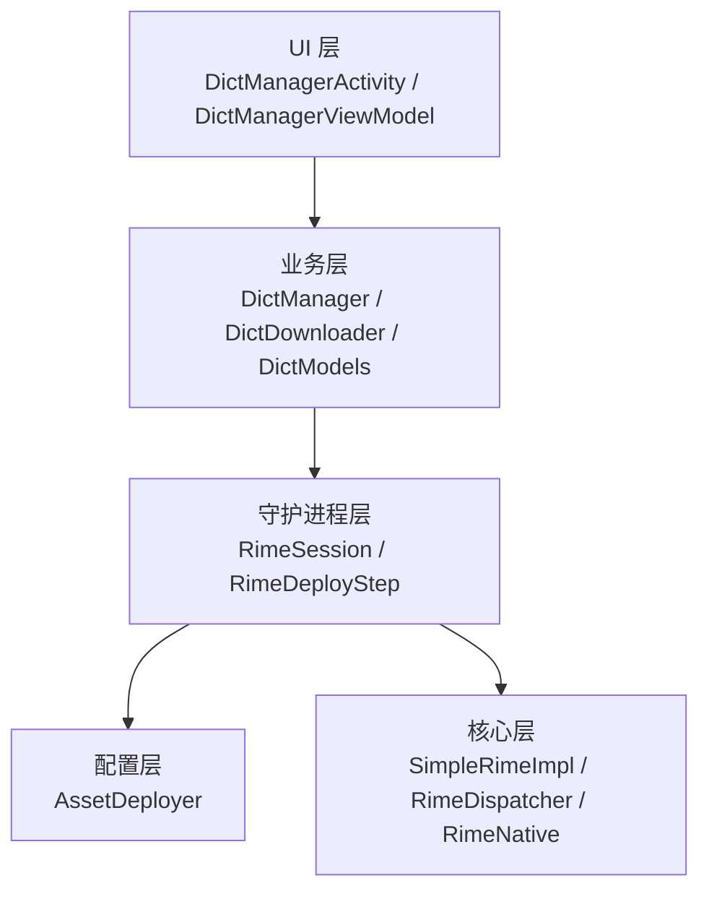
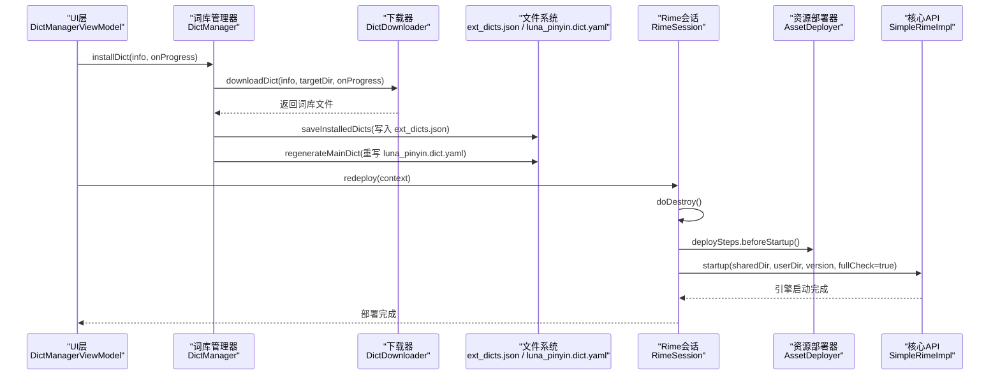
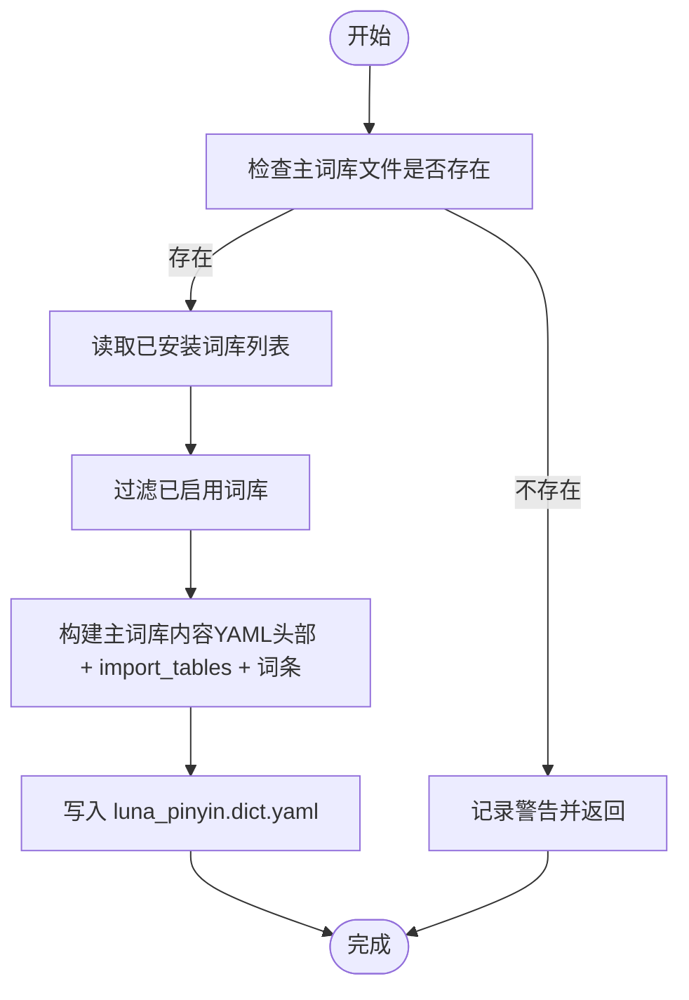
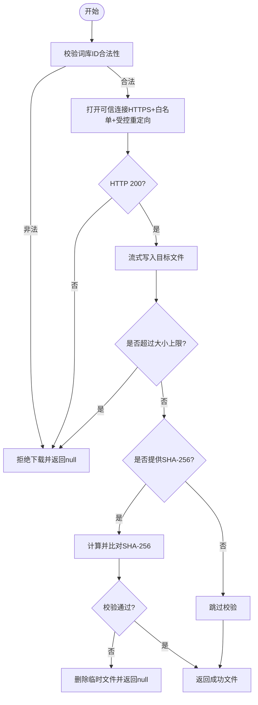
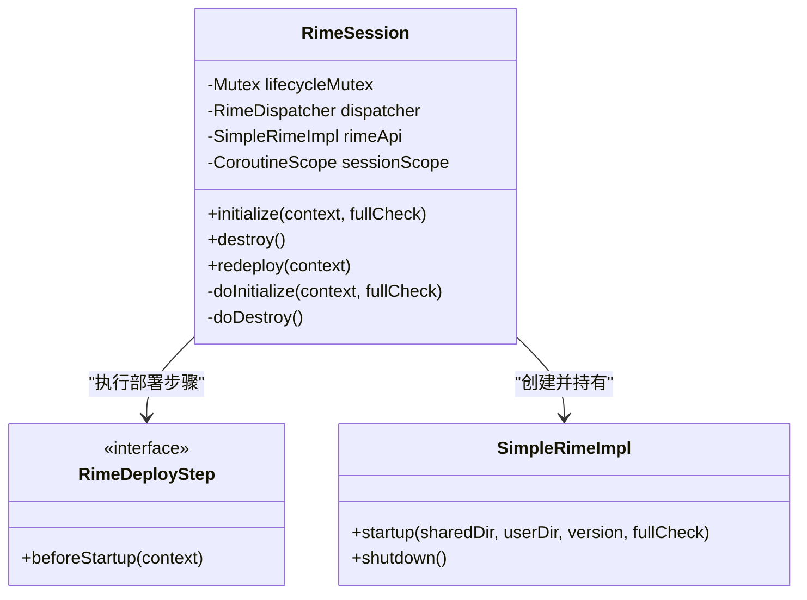
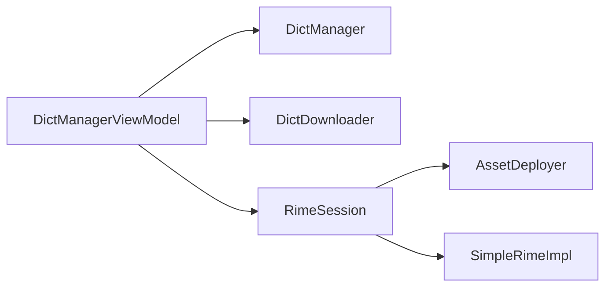
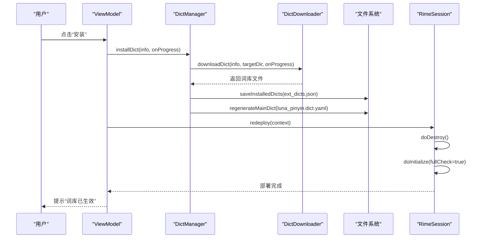
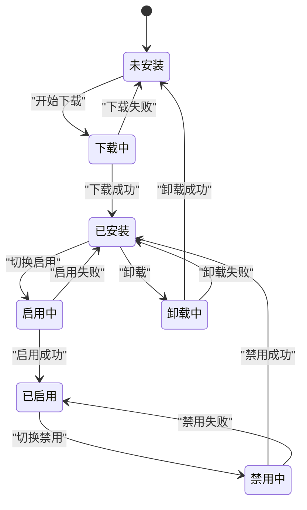

# 词库生命周期管理

<cite>
**本文引用的文件**   
- [DictManager.kt](file://app/src/main/java/com/ziyou/ime/dict/DictManager.kt)
- [RimeSession.kt](file://app/src/main/java/com/ziyou/ime/daemon/RimeSession.kt)
- [SimpleRimeImpl.kt](file://app/src/main/java/com/ziyou/ime/core/SimpleRimeImpl.kt)
- [AssetDeployer.kt](file://app/src/main/java/com/ziyou/ime/config/AssetDeployer.kt)
- [RimeDeployStep.kt](file://app/src/main/java/com/ziyou/ime/daemon/RimeDeployStep.kt)
- [DictDownloader.kt](file://app/src/main/java/com/ziyou/ime/dict/DictDownloader.kt)
- [DictModels.kt](file://app/src/main/java/com/ziyou/ime/dict/DictModels.kt)
- [DictManagerActivity.kt](file://app/src/main/java/com/ziyou/ime/ui/DictManagerActivity.kt)
- [DictManagerViewModel.kt](file://app/src/main/java/com/ziyou/ime/ui/DictManagerViewModel.kt)
</cite>

## 目录
1. [简介](#简介)
2. [项目结构](#项目结构)
3. [核心组件](#核心组件)
4. [架构总览](#架构总览)
5. [详细组件分析](#详细组件分析)
6. [依赖关系分析](#依赖关系分析)
7. [性能考量](#性能考量)
8. [故障排查指南](#故障排查指南)
9. [结论](#结论)
10. [附录](#附录)

## 简介
本技术文档围绕输入法项目的“词库生命周期管理”展开，系统性说明从安装到生效的完整流程，重点覆盖以下调用链路：installDict → saveInstalledDicts → regenerateMainDict → RimeSession.redeploy。文档进一步解释热部署机制的实现原理、主词库文件变更后的引擎重新加载过程、状态同步与并发安全考虑，并通过时序图与状态转换图帮助读者理解整个生命周期。

## 项目结构
本项目采用分层组织方式：
- UI 层：词库管理界面（Compose）与 ViewModel，负责用户交互与状态展示。
- 业务层：词库管理器（安装/卸载/启用/禁用）、下载器（网络与校验）、数据模型。
- 守护进程层：Rime 会话管理（初始化/销毁/重部署），通过部署步骤抽象解耦具体实现。
- 配置层：资源部署器（assets 到内部存储）。
- 核心层：Rime API 封装（调度到单线程执行，避免 JNI 非线程安全问题）。

图表来源
- [DictManagerActivity.kt](file://app/src/main/java/com/ziyou/ime/ui/DictManagerActivity.kt)
- [DictManagerViewModel.kt](file://app/src/main/java/com/ziyou/ime/ui/DictManagerViewModel.kt)
- [DictManager.kt](file://app/src/main/java/com/ziyou/ime/dict/DictManager.kt)
- [DictDownloader.kt](file://app/src/main/java/com/ziyou/ime/dict/DictDownloader.kt)
- [DictModels.kt](file://app/src/main/java/com/ziyou/ime/dict/DictModels.kt)
- [RimeSession.kt](file://app/src/main/java/com/ziyou/ime/daemon/RimeSession.kt)
- [RimeDeployStep.kt](file://app/src/main/java/com/ziyou/ime/daemon/RimeDeployStep.kt)
- [AssetDeployer.kt](file://app/src/main/java/com/ziyou/ime/config/AssetDeployer.kt)
- [SimpleRimeImpl.kt](file://app/src/main/java/com/ziyou/ime/core/SimpleRimeImpl.kt)

章节来源
- [DictManager.kt](file://app/src/main/java/com/ziyou/ime/dict/DictManager.kt)
- [RimeSession.kt](file://app/src/main/java/com/ziyou/ime/daemon/RimeSession.kt)
- [SimpleRimeImpl.kt](file://app/src/main/java/com/ziyou/ime/core/SimpleRimeImpl.kt)
- [AssetDeployer.kt](file://app/src/main/java/com/ziyou/ime/config/AssetDeployer.kt)
- [RimeDeployStep.kt](file://app/src/main/java/com/ziyou/ime/daemon/RimeDeployStep.kt)
- [DictDownloader.kt](file://app/src/main/java/com/ziyou/ime/dict/DictDownloader.kt)
- [DictModels.kt](file://app/src/main/java/com/ziyou/ime/dict/DictModels.kt)
- [DictManagerActivity.kt](file://app/src/main/java/com/ziyou/ime/ui/DictManagerActivity.kt)
- [DictManagerViewModel.kt](file://app/src/main/java/com/ziyou/ime/ui/DictManagerViewModel.kt)

## 核心组件
- 词库管理器（DictManager）：负责扩展词库的安装、卸载、启用/禁用、本地安装记录读写、主词库文件再生成。
- 词库下载器（DictDownloader）：负责远程目录拉取、词库文件下载、完整性校验（SHA-256）、预览读取。
- Rime 会话（RimeSession）：管理引擎生命周期（initialize/destroy/redeploy），串行化关键操作，确保线程安全。
- 资源部署器（AssetDeployer）：将 assets/rime 部署到应用内部存储，并维护已部署版本。
- 部署步骤（RimeDeployStep）：抽象启动前任务（如资源部署、主词库注入），由组合根装配顺序执行。
- 核心 API（SimpleRimeImpl）：将 Rime 操作调度到单一线程，避免 JNI 非线程安全问题。

章节来源
- [DictManager.kt](file://app/src/main/java/com/ziyou/ime/dict/DictManager.kt)
- [DictDownloader.kt](file://app/src/main/java/com/ziyou/ime/dict/DictDownloader.kt)
- [RimeSession.kt](file://app/src/main/java/com/ziyou/ime/daemon/RimeSession.kt)
- [AssetDeployer.kt](file://app/src/main/java/com/ziyou/ime/config/AssetDeployer.kt)
- [RimeDeployStep.kt](file://app/src/main/java/com/ziyou/ime/daemon/RimeDeployStep.kt)
- [SimpleRimeImpl.kt](file://app/src/main/java/com/ziyou/ime/core/SimpleRimeImpl.kt)

## 架构总览
下图展示了词库从安装到生效的端到端调用链路与热部署机制。

图表来源
- [DictManagerViewModel.kt](file://app/src/main/java/com/ziyou/ime/ui/DictManagerViewModel.kt)
- [DictManager.kt](file://app/src/main/java/com/ziyou/ime/dict/DictManager.kt)
- [DictDownloader.kt](file://app/src/main/java/com/ziyou/ime/dict/DictDownloader.kt)
- [RimeSession.kt](file://app/src/main/java/com/ziyou/ime/daemon/RimeSession.kt)
- [AssetDeployer.kt](file://app/src/main/java/com/ziyou/ime/config/AssetDeployer.kt)
- [SimpleRimeImpl.kt](file://app/src/main/java/com/ziyou/ime/core/SimpleRimeImpl.kt)

## 详细组件分析

### 词库管理器（DictManager）
职责与关键点：
- 安装/卸载/启用/禁用：更新本地安装记录（ext_dicts.json），并触发主词库文件再生成。
- 主词库再生成：保留基础 import_tables，动态追加已启用的扩展词库路径至 luna_pinyin.dict.yaml。
- 并发安全：所有写盘操作在 IO 线程执行，避免阻塞主线程；异常时回滚或清理半成品文件。

图表来源
- [DictManager.kt](file://app/src/main/java/com/ziyou/ime/dict/DictManager.kt)

章节来源
- [DictManager.kt](file://app/src/main/java/com/ziyou/ime/dict/DictManager.kt)

### 词库下载器（DictDownloader）
职责与关键点：
- 目录拉取：获取 catalog.json，解析为 RemoteDictInfo 列表。
- 下载与校验：强制 HTTPS、域名白名单、受控重定向、大小上限保护、SHA-256 完整性校验。
- 预览读取：限制读取字节数，解析前 N 条词条用于展示。

图表来源
- [DictDownloader.kt](file://app/src/main/java/com/ziyou/ime/dict/DictDownloader.kt)

章节来源
- [DictDownloader.kt](file://app/src/main/java/com/ziyou/ime/dict/DictDownloader.kt)

### Rime 会话（RimeSession）
职责与关键点：
- 生命周期互斥锁：使用 Mutex 串行化 initialize/destroy/redeploy，防止并发导致双重初始化与线程泄漏。
- 部署步骤：在 startup 之前按顺序执行 beforeStartup（资源部署、主词库注入等）。
- 热部署：redeploy 关闭当前引擎，以 fullCheck 模式重新启动，确保配置与词库变更生效。

图表来源
- [RimeSession.kt](file://app/src/main/java/com/ziyou/ime/daemon/RimeSession.kt)
- [RimeDeployStep.kt](file://app/src/main/java/com/ziyou/ime/daemon/RimeDeployStep.kt)
- [SimpleRimeImpl.kt](file://app/src/main/java/com/ziyou/ime/core/SimpleRimeImpl.kt)

章节来源
- [RimeSession.kt](file://app/src/main/java/com/ziyou/ime/daemon/RimeSession.kt)
- [SimpleRimeImpl.kt](file://app/src/main/java/com/ziyou/ime/core/SimpleRimeImpl.kt)

### 资源部署器（AssetDeployer）
职责与关键点：
- 版本对比：比较应用版本与已部署版本，决定是否重新部署。
- 递归复制：将 assets/rime 目录复制到应用内部存储，并部署 predict.db 到用户目录。
- 持久化版本：记录已部署版本，避免重复部署。

章节来源
- [AssetDeployer.kt](file://app/src/main/java/com/ziyou/ime/config/AssetDeployer.kt)

### UI 与 ViewModel（DictManagerActivity / DictManagerViewModel）
职责与关键点：
- 状态管理：catalogState、installedDicts、downloadState、deployState、updatableIds、previewState。
- 用户操作：安装、卸载、启用/禁用、更新、预览，均触发 redeploy 以生效。
- 进度反馈：下载进度与部署状态提示。

章节来源
- [DictManagerActivity.kt](file://app/src/main/java/com/ziyou/ime/ui/DictManagerActivity.kt)
- [DictManagerViewModel.kt](file://app/src/main/java/com/ziyou/ime/ui/DictManagerViewModel.kt)

## 依赖关系分析
- UI 层依赖 ViewModel，ViewModel 依赖业务层（DictManager、DictDownloader）。
- 业务层通过 RimeSession 触发引擎重部署，RimeSession 依赖部署步骤（AssetDeployer）与核心 API（SimpleRimeImpl）。
- 部署步骤在 initialize/redeploy 时按注册顺序执行，确保资源就绪后再启动引擎。

图表来源
- [DictManagerViewModel.kt](file://app/src/main/java/com/ziyou/ime/ui/DictManagerViewModel.kt)
- [DictManager.kt](file://app/src/main/java/com/ziyou/ime/dict/DictManager.kt)
- [DictDownloader.kt](file://app/src/main/java/com/ziyou/ime/dict/DictDownloader.kt)
- [RimeSession.kt](file://app/src/main/java/com/ziyou/ime/daemon/RimeSession.kt)
- [AssetDeployer.kt](file://app/src/main/java/com/ziyou/ime/config/AssetDeployer.kt)
- [SimpleRimeImpl.kt](file://app/src/main/java/com/ziyou/ime/core/SimpleRimeImpl.kt)

章节来源
- [DictManagerViewModel.kt](file://app/src/main/java/com/ziyou/ime/ui/DictManagerViewModel.kt)
- [DictManager.kt](file://app/src/main/java/com/ziyou/ime/dict/DictManager.kt)
- [DictDownloader.kt](file://app/src/main/java/com/ziyou/ime/dict/DictDownloader.kt)
- [RimeSession.kt](file://app/src/main/java/com/ziyou/ime/daemon/RimeSession.kt)
- [AssetDeployer.kt](file://app/src/main/java/com/ziyou/ime/config/AssetDeployer.kt)
- [SimpleRimeImpl.kt](file://app/src/main/java/com/ziyou/ime/core/SimpleRimeImpl.kt)

## 性能考量
- IO 线程隔离：安装、卸载、启用/禁用、主词库再生成均在 IO 线程执行，避免主线程阻塞。
- 超时保护：引擎启动带超时保护（120秒），防止长时间维护阻塞。
- 文件大小限制：下载器对 catalog、词库文件、预览读取设置上限，防止恶意或异常数据耗尽资源。
- 序列化部署：部署步骤串行执行，避免并发竞争导致的文件损坏或状态不一致。

## 故障排查指南
- 安装失败：检查网络连通性、下载源白名单、SHA-256 校验结果；查看日志中“下载失败”“校验失败”信息。
- 主词库未生效：确认 ext_dicts.json 是否正确写入、luna_pinyin.dict.yaml 是否被重写；检查 redeploy 是否成功。
- 引擎启动超时：检查词典文件完整性、fullCheck 模式是否必要；适当降低 fullCheck 或优化词典规模。
- 并发问题：确保 initialize/destroy/redeploy 通过 lifecycleMutex 串行执行，避免重复初始化。

章节来源
- [DictDownloader.kt](file://app/src/main/java/com/ziyou/ime/dict/DictDownloader.kt)
- [DictManager.kt](file://app/src/main/java/com/ziyou/ime/dict/DictManager.kt)
- [RimeSession.kt](file://app/src/main/java/com/ziyou/ime/daemon/RimeSession.kt)

## 结论
本方案通过清晰的职责分离与严格的并发控制，实现了词库从安装到生效的完整生命周期管理。热部署机制确保主词库变更后引擎能无缝重新加载，状态同步保证本地记录与实际文件一致。用户体验方面，候选词排序变化即时生效，部署状态透明反馈。整体设计兼顾安全性、性能与可维护性。

## 附录

### 生命周期时序图（安装→生效）

图表来源
- [DictManagerViewModel.kt](file://app/src/main/java/com/ziyou/ime/ui/DictManagerViewModel.kt)
- [DictManager.kt](file://app/src/main/java/com/ziyou/ime/dict/DictManager.kt)
- [DictDownloader.kt](file://app/src/main/java/com/ziyou/ime/dict/DictDownloader.kt)
- [RimeSession.kt](file://app/src/main/java/com/ziyou/ime/daemon/RimeSession.kt)

### 状态转换图（词库安装状态）

[本图为概念性状态转换，不直接映射具体代码文件，故无图表来源]