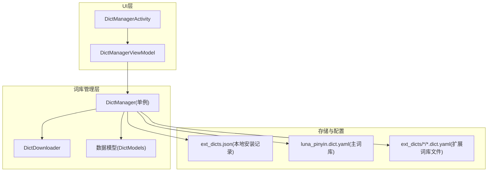
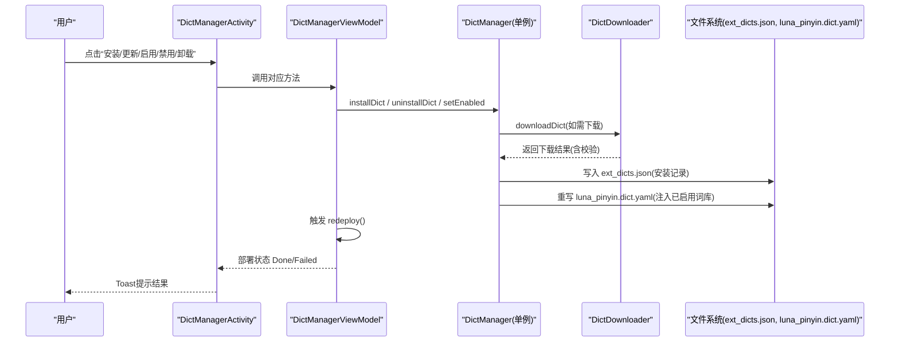
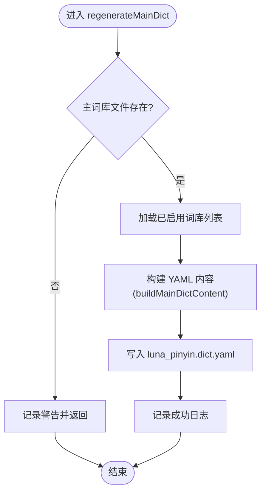
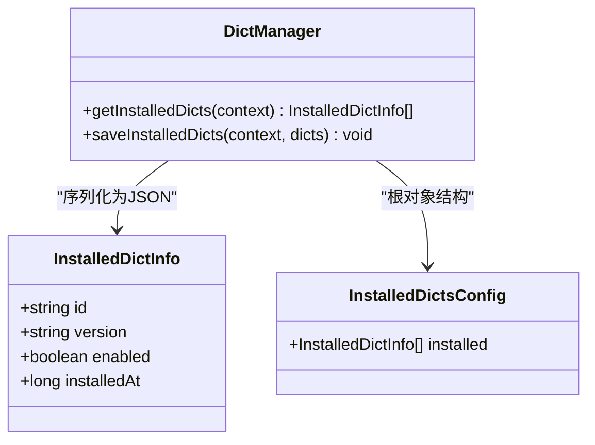
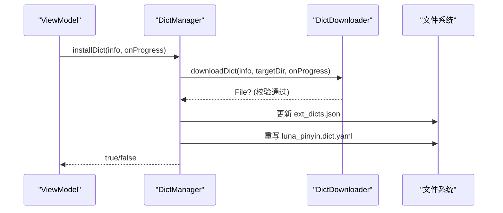
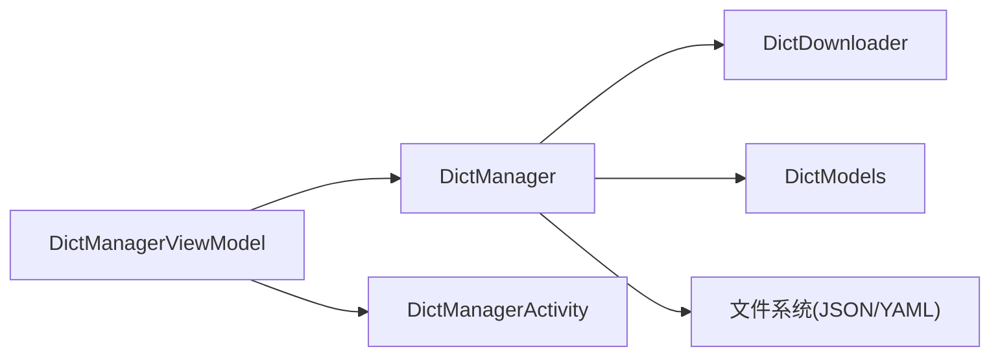

# 词库管理器

<cite>
**本文引用的文件**
- [DictManager.kt](file://app/src/main/java/com/ziyou/ime/dict/DictManager.kt)
- [DictModels.kt](file://app/src/main/java/com/ziyou/ime/dict/DictModels.kt)
- [DictDownloader.kt](file://app/src/main/java/com/ziyou/ime/dict/DictDownloader.kt)
- [luna_pinyin.dict.yaml](file://app/src/main/assets/rime/luna_pinyin.dict.yaml)
- [others.dict.yaml](file://app/src/main/assets/rime/cn_dicts/others.dict.yaml)
- [DictManagerActivity.kt](file://app/src/main/java/com/ziyou/ime/ui/DictManagerActivity.kt)
- [DictManagerViewModel.kt](file://app/src/main/java/com/ziyou/ime/ui/DictManagerViewModel.kt)
</cite>

## 目录
1. [简介](#简介)
2. [项目结构](#项目结构)
3. [核心组件](#核心组件)
4. [架构总览](#架构总览)
5. [详细组件分析](#详细组件分析)
6. [依赖关系分析](#依赖关系分析)
7. [性能考量](#性能考量)
8. [故障排查指南](#故障排查指南)
9. [结论](#结论)
10. [附录：API使用示例](#附录api使用示例)

## 简介
本技术文档聚焦于“词库管理器”子系统，围绕 DictManager 单例类的设计模式与职责边界展开，系统说明扩展词库的安装、卸载、启用、禁用流程；重点解析 regenerateMainDict 方法如何重写 luna_pinyin.dict.yaml 以注入已启用的扩展词库，BASE_IMPORT_TABLES 基础词库列表的维护策略，以及 buildMainDictContent 的 YAML 内容生成逻辑。同时详细说明 getInstalledDicts 与 saveInstalledDicts 的 JSON 持久化机制（InstalledDictInfo 的序列化/反序列化）、MAX_ENABLED_DICTS 限制策略与词库冲突处理机制，并给出可直接用于实际操作的 API 调用示例路径。

## 项目结构
词库管理相关代码位于 app 模块的 dict 包与 ui 包中，核心由三个 Kotlin 源文件组成：
- DictManager.kt：词库管理的单例实现，负责安装/卸载/启用/禁用、主词库重建、本地记录读写等。
- DictModels.kt：数据模型定义，包括 RemoteDictInfo、InstalledDictInfo、DictCatalog、预览数据结构等。
- DictDownloader.kt：网络下载器，负责 catalog.json 拉取、词库文件下载、完整性校验、预览读取等。
- UI 层通过 DictManagerActivity.kt 和 DictManagerViewModel.kt 暴露用户操作入口，并在状态变化后触发 RIME 引擎重部署。

图表来源
- [DictManager.kt:1-376](file://app/src/main/java/com/ziyou/ime/dict/DictManager.kt#L1-L376)
- [DictModels.kt:1-113](file://app/src/main/java/com/ziyou/ime/dict/DictModels.kt#L1-L113)
- [DictDownloader.kt:1-367](file://app/src/main/java/com/ziyou/ime/dict/DictDownloader.kt#L1-L367)
- [DictManagerActivity.kt:1-738](file://app/src/main/java/com/ziyou/ime/ui/DictManagerActivity.kt#L1-L738)
- [DictManagerViewModel.kt:1-234](file://app/src/main/java/com/ziyou/ime/ui/DictManagerViewModel.kt#L1-L234)

章节来源
- [DictManager.kt:1-376](file://app/src/main/java/com/ziyou/ime/dict/DictManager.kt#L1-L376)
- [DictModels.kt:1-113](file://app/src/main/java/com/ziyou/ime/dict/DictModels.kt#L1-L113)
- [DictDownloader.kt:1-367](file://app/src/main/java/com/ziyou/ime/dict/DictDownloader.kt#L1-L367)
- [DictManagerActivity.kt:1-738](file://app/src/main/java/com/ziyou/ime/ui/DictManagerActivity.kt#L1-L738)
- [DictManagerViewModel.kt:1-234](file://app/src/main/java/com/ziyou/ime/ui/DictManagerViewModel.kt#L1-L234)

## 核心组件
- DictManager（单例）
  - 职责：管理扩展词库生命周期（安装/卸载/启用/禁用），动态重写主词库文件，维护本地安装记录。
  - 关键常量：EXT_DICTS_DIR、CONFIG_FILE、MAIN_DICT_FILE、BASE_IMPORT_TABLES、MAX_ENABLED_DICTS。
- DictDownloader
  - 职责：安全地拉取 catalog.json、下载词库文件、SHA-256 校验、预览读取、域名白名单与受控重定向。
- 数据模型（DictModels）
  - 职责：定义远程词库信息、本地安装记录、目录结构、预览数据、下载/部署状态等。
- UI 层（Activity + ViewModel）
  - 职责：提供用户界面与交互，驱动安装/卸载/启用/禁用等操作，并在完成后触发 RIME 引擎重部署。

章节来源
- [DictManager.kt:1-376](file://app/src/main/java/com/ziyou/ime/dict/DictManager.kt#L1-L376)
- [DictModels.kt:1-113](file://app/src/main/java/com/ziyou/ime/dict/DictModels.kt#L1-L113)
- [DictDownloader.kt:1-367](file://app/src/main/java/com/ziyou/ime/dict/DictDownloader.kt#L1-L367)
- [DictManagerActivity.kt:1-738](file://app/src/main/java/com/ziyou/ime/ui/DictManagerActivity.kt#L1-L738)
- [DictManagerViewModel.kt:1-234](file://app/src/main/java/com/ziyou/ime/ui/DictManagerViewModel.kt#L1-L234)

## 架构总览
词库管理器采用“单例服务 + 下载器 + 数据模型 + UI 驱动”的分层架构。UI 层通过 ViewModel 调用 DictManager 的单例方法完成业务操作；DictManager 在 IO 线程执行磁盘和网络相关任务，确保不阻塞主线程；最终通过重写主词库文件并触发 RIME 引擎重部署生效。

图表来源
- [DictManager.kt:112-193](file://app/src/main/java/com/ziyou/ime/dict/DictManager.kt#L112-L193)
- [DictDownloader.kt:87-162](file://app/src/main/java/com/ziyou/ime/dict/DictDownloader.kt#L87-L162)
- [DictManagerViewModel.kt:128-188](file://app/src/main/java/com/ziyou/ime/ui/DictManagerViewModel.kt#L128-L188)
- [DictManagerActivity.kt:54-71](file://app/src/main/java/com/ziyou/ime/ui/DictManagerActivity.kt#L54-L71)

## 详细组件分析

### DictManager 单例设计与职责
- 设计模式：Kotlin object 单例，全局唯一实例，避免重复初始化与状态不一致。
- 核心职责：
  - 安装/卸载/启用/禁用：统一在 IO 线程执行，保证磁盘读写与网络请求不阻塞主线程。
  - 主词库重建：regenerateMainDict 根据当前已启用词库集合重写 luna_pinyin.dict.yaml。
  - 本地记录持久化：getInstalledDicts/saveInstalledDicts 维护 ext_dicts.json。
  - 检查更新：checkUpdates 对比本地版本与 catalog 版本差异。

章节来源
- [DictManager.kt:19-40](file://app/src/main/java/com/ziyou/ime/dict/DictManager.kt#L19-L40)
- [DictManager.kt:112-193](file://app/src/main/java/com/ziyou/ime/dict/DictManager.kt#L112-L193)
- [DictManager.kt:212-238](file://app/src/main/java/com/ziyou/ime/dict/DictManager.kt#L212-L238)
- [DictManager.kt:199-210](file://app/src/main/java/com/ziyou/ime/dict/DictManager.kt#L199-L210)

### BASE_IMPORT_TABLES 基础词库列表维护
- 位置与含义：BASE_IMPORT_TABLES 是始终包含的基础 import_tables 列表，确保核心字表与常用词库稳定可用。
- 维护策略：新增基础词库时直接修改该列表；运行时不会因用户操作而移除基础项。
- 影响范围：buildMainDictContent 会按顺序输出这些基础项，随后追加已启用扩展词库。

章节来源
- [DictManager.kt:30-37](file://app/src/main/java/com/ziyou/ime/dict/DictManager.kt#L30-L37)
- [DictManager.kt:243-302](file://app/src/main/java/com/ziyou/ime/dict/DictManager.kt#L243-L302)

### regenerateMainDict 工作原理
- 触发时机：应用启动（RimeSession.initialize 之后）、安装/卸载/启用/禁用后。
- 工作流程：
  1) 读取已启用词库列表（filter enabled）。
  2) 调用 buildMainDictContent 生成完整 YAML 内容。
  3) 将内容写回 luna_pinyin.dict.yaml。
- 注意事项：若主词库文件不存在则跳过；异常会被捕获并记录日志。

图表来源
- [DictManager.kt:222-238](file://app/src/main/java/com/ziyou/ime/dict/DictManager.kt#L222-L238)
- [DictManager.kt:243-302](file://app/src/main/java/com/ziyou/ime/dict/DictManager.kt#L243-L302)

章节来源
- [DictManager.kt:212-238](file://app/src/main/java/com/ziyou/ime/dict/DictManager.kt#L212-L238)

### buildMainDictContent 的 YAML 内容生成逻辑
- 头部注释：描述词库组成与来源，动态显示已启用扩展词库名称。
- YAML 头部：name、version、sort、import_tables。
- import_tables 拼接：先输出 BASE_IMPORT_TABLES，再依次追加 EXT_DICTS_DIR/{dict.id}。
- 附加词条：大写字母与数字参与造词的映射条目。
- 输出格式：标准 YAML 文档体（--- ... ---），末尾为词条行。

章节来源
- [DictManager.kt:243-302](file://app/src/main/java/com/ziyou/ime/dict/DictManager.kt#L243-L302)
- [luna_pinyin.dict.yaml:1-68](file://app/src/main/assets/rime/luna_pinyin.dict.yaml#L1-L68)

### getInstalledDicts 与 saveInstalledDicts 的 JSON 持久化机制
- 存储位置：ext_dicts.json，位于应用 filesDir/rime 目录下。
- 数据结构：
  - InstalledDictInfo：id、version、enabled、installedAt。
  - InstalledDictsConfig：installed 列表（根对象字段）。
- 序列化过程（saveInstalledDicts）：
  - 将 List<InstalledDictInfo> 转为 JSONArray，每个元素为 JSONObject，包含 id/version/enabled/installedAt。
  - 外层包裹 { installed: [...] }，格式化输出到文件。
- 反序列化过程（getInstalledDicts）：
  - 读取文件文本，解析 root JSONObject，取出 installed 数组。
  - 逐项构造 InstalledDictInfo，缺失字段使用默认值（如 version="1.0.0", enabled=true, installedAt=0）。
- 错误处理：解析失败或文件不存在时返回空列表，并记录日志。

图表来源
- [DictModels.kt:58-75](file://app/src/main/java/com/ziyou/ime/dict/DictModels.kt#L58-L75)
- [DictManager.kt:61-110](file://app/src/main/java/com/ziyou/ime/dict/DictManager.kt#L61-L110)

章节来源
- [DictManager.kt:61-110](file://app/src/main/java/com/ziyou/ime/dict/DictManager.kt#L61-L110)
- [DictModels.kt:58-75](file://app/src/main/java/com/ziyou/ime/dict/DictModels.kt#L58-L75)

### MAX_ENABLED_DICTS 限制策略与词库冲突处理
- 限制策略：MAX_ENABLED_DICTS 定义为建议最大同时启用词库数（当前值为 5），用于指导 UI 展示与用户决策。
- 冲突处理：
  - 当前实现未强制拦截超过限制的启用操作，但建议在 UI 层进行提示或阻止。
  - 若未来需要强制限制，可在 setEnabled 中增加计数校验与冲突提示。
- 建议实践：在 toggleEnabled 前统计已启用数量，超过阈值时提示用户先禁用其他词库。

章节来源
- [DictManager.kt:39-40](file://app/src/main/java/com/ziyou/ime/dict/DictManager.kt#L39-L40)
- [DictManager.kt:177-193](file://app/src/main/java/com/ziyou/ime/dict/DictManager.kt#L177-L193)

### 安装/卸载/启用/禁用操作流程
- installDict：
  - 调用 DictDownloader.downloadDict 下载词库文件。
  - 更新安装记录（去重+添加新记录），保存至 ext_dicts.json。
  - 调用 regenerateMainDict 重写主词库。
- uninstallDict：
  - 删除 ext_dicts/{dictId}.dict.yaml。
  - 从安装记录中移除对应条目，保存。
  - 调用 regenerateMainDict 重写主词库。
- setEnabled：
  - 查找并更新对应条目的 enabled 状态，保存。
  - 调用 regenerateMainDict 重写主词库。

图表来源
- [DictManager.kt:120-150](file://app/src/main/java/com/ziyou/ime/dict/DictManager.kt#L120-L150)
- [DictDownloader.kt:87-162](file://app/src/main/java/com/ziyou/ime/dict/DictDownloader.kt#L87-L162)

章节来源
- [DictManager.kt:120-193](file://app/src/main/java/com/ziyou/ime/dict/DictManager.kt#L120-L193)

### 词库预览与本地读取
- readLocalDictPreview：
  - 读取 ext_dicts/{dictId}.dict.yaml，解析词条（跳过 YAML 头部与注释）。
  - 返回 DictPreview（包含部分词条与总数提示）。
- fetchDictPreview（远程）：
  - 从 URL 读取有限字节内容，解析前 N 条词条，用于未安装词库的预览。

章节来源
- [DictManager.kt:314-374](file://app/src/main/java/com/ziyou/ime/dict/DictManager.kt#L314-L374)
- [DictDownloader.kt:170-202](file://app/src/main/java/com/ziyou/ime/dict/DictDownloader.kt#L170-L202)

## 依赖关系分析
- 组件耦合：
  - DictManager 依赖 DictDownloader（网络下载）、文件系统（JSON/YAML）、数据模型（InstalledDictInfo/RemoteDictInfo）。
  - UI 层通过 ViewModel 调用 DictManager，并在成功后触发 RIME 引擎重部署。
- 外部依赖：
  - Android Context（文件路径、日志）。
  - kotlinx.coroutines（IO 调度）。
  - org.json（JSON 解析与生成）。
- 潜在循环依赖：无直接循环，单向依赖清晰。

图表来源
- [DictManager.kt:1-376](file://app/src/main/java/com/ziyou/ime/dict/DictManager.kt#L1-L376)
- [DictManagerViewModel.kt:1-234](file://app/src/main/java/com/ziyou/ime/ui/DictManagerViewModel.kt#L1-L234)
- [DictManagerActivity.kt:1-738](file://app/src/main/java/com/ziyou/ime/ui/DictManagerActivity.kt#L1-L738)

章节来源
- [DictManager.kt:1-376](file://app/src/main/java/com/ziyou/ime/dict/DictManager.kt#L1-L376)
- [DictManagerViewModel.kt:1-234](file://app/src/main/java/com/ziyou/ime/ui/DictManagerViewModel.kt#L1-L234)

## 性能考量
- IO 线程隔离：所有磁盘与网络操作均在 Dispatchers.IO 执行，避免阻塞主线程。
- 流式下载：DictDownloader 使用缓冲流分块写入，支持进度回调与大文件下载。
- 资源限制：catalog.json 与词库文件大小上限保护，防止恶意资源耗尽磁盘。
- 校验优化：仅在 catalog 提供 sha256 时进行完整性校验，向后兼容旧目录。
- 主词库重建频率：仅在必要操作后触发，避免频繁重写造成 I/O 压力。

[本节为通用性能讨论，不直接分析具体文件]

## 故障排查指南
- 常见问题：
  - 下载失败：检查网络连接、URL 白名单、重定向次数限制。
  - 校验失败：确认 catalog 中的 sha256 与实际文件一致。
  - 主词库未生效：确认 regenerateMainDict 是否被调用，检查 luna_pinyin.dict.yaml 内容是否正确。
  - 安装记录损坏：ext_dicts.json 解析失败时会返回空列表，需检查文件格式。
- 日志定位：
  - DictManager.TAG 与 DictDownloader.TAG 输出关键步骤日志。
  - 关注“重新生成主词库失败”、“下载词库失败”、“读取安装记录失败”等错误信息。

章节来源
- [DictManager.kt:82-86](file://app/src/main/java/com/ziyou/ime/dict/DictManager.kt#L82-L86)
- [DictManager.kt:107-110](file://app/src/main/java/com/ziyou/ime/dict/DictManager.kt#L107-L110)
- [DictManager.kt:235-237](file://app/src/main/java/com/ziyou/ime/dict/DictManager.kt#L235-L237)
- [DictDownloader.kt:151-161](file://app/src/main/java/com/ziyou/ime/dict/DictDownloader.kt#L151-L161)

## 结论
词库管理器通过单例模式集中管理扩展词库的生命周期，结合安全的下载器与严格的数据模型，实现了可靠的安装/卸载/启用/禁用流程。regenerateMainDict 与 buildMainDictContent 确保了主词库文件的动态更新，BASE_IMPORT_TABLES 提供了稳定的基础词库保障。JSON 持久化机制保证了安装状态的可靠存储。MAX_ENABLED_DICTS 为后续限制策略预留了扩展点。整体架构清晰、职责明确，便于维护与扩展。

[本节为总结性内容，不直接分析具体文件]

## 附录：API使用示例
以下示例展示如何通过 DictManager 的公开 API 进行词库管理操作。请根据实际上下文（Context）与协程作用域调用。

- 安装词库
  - 调用路径：[installDict:120-150](file://app/src/main/java/com/ziyou/ime/dict/DictManager.kt#L120-L150)
  - 参数：context、RemoteDictInfo、可选进度回调
  - 行为：下载词库、更新安装记录、重写主词库

- 卸载词库
  - 调用路径：[uninstallDict:155-172](file://app/src/main/java/com/ziyou/ime/dict/DictManager.kt#L155-L172)
  - 参数：context、dictId
  - 行为：删除词库文件、更新安装记录、重写主词库

- 启用/禁用词库
  - 调用路径：[setEnabled:177-193](file://app/src/main/java/com/ziyou/ime/dict/DictManager.kt#L177-L193)
  - 参数：context、dictId、enabled
  - 行为：更新启用状态、保存记录、重写主词库

- 获取已安装词库
  - 调用路径：[getInstalledDicts:61-86](file://app/src/main/java/com/ziyou/ime/dict/DictManager.kt#L61-L86)
  - 参数：context
  - 返回：List<InstalledDictInfo>

- 检查可更新词库
  - 调用路径：[checkUpdates:199-210](file://app/src/main/java/com/ziyou/ime/dict/DictManager.kt#L199-L210)
  - 参数：context、DictCatalog
  - 返回：List<String>（需要更新的词库 ID）

- 读取本地词库预览
  - 调用路径：[readLocalDictPreview:314-339](file://app/src/main/java/com/ziyou/ime/dict/DictManager.kt#L314-L339)
  - 参数：context、dictId、RemoteDictInfo、maxEntries
  - 返回：DictPreview?

- 触发主词库重建
  - 调用路径：[regenerateMainDict:222-238](file://app/src/main/java/com/ziyou/ime/dict/DictManager.kt#L222-L238)
  - 参数：context
  - 行为：根据已启用词库重写 luna_pinyin.dict.yaml

章节来源
- [DictManager.kt:61-86](file://app/src/main/java/com/ziyou/ime/dict/DictManager.kt#L61-L86)
- [DictManager.kt:120-193](file://app/src/main/java/com/ziyou/ime/dict/DictManager.kt#L120-L193)
- [DictManager.kt:199-210](file://app/src/main/java/com/ziyou/ime/dict/DictManager.kt#L199-L210)
- [DictManager.kt:222-238](file://app/src/main/java/com/ziyou/ime/dict/DictManager.kt#L222-L238)
- [DictManager.kt:314-339](file://app/src/main/java/com/ziyou/ime/dict/DictManager.kt#L314-L339)