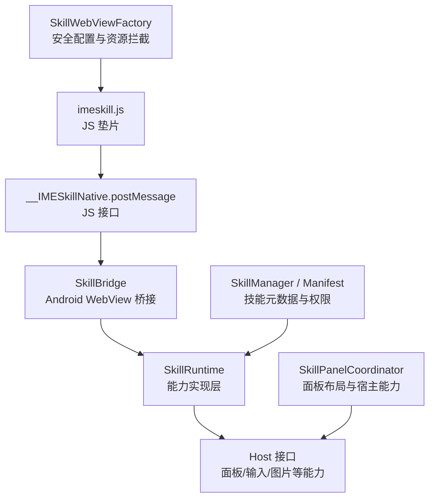
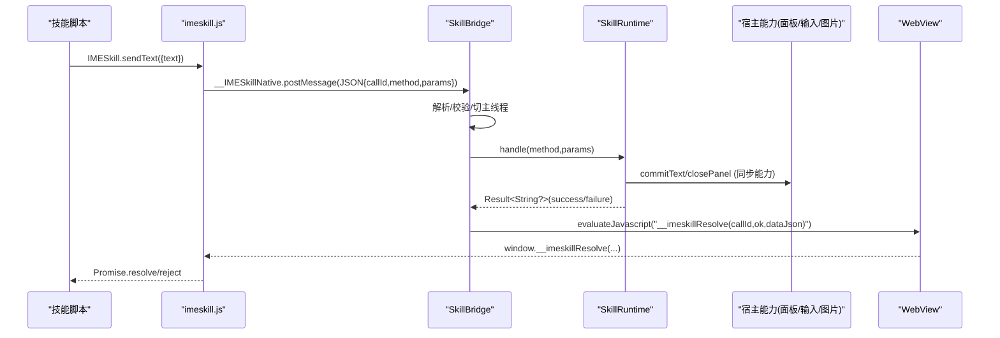
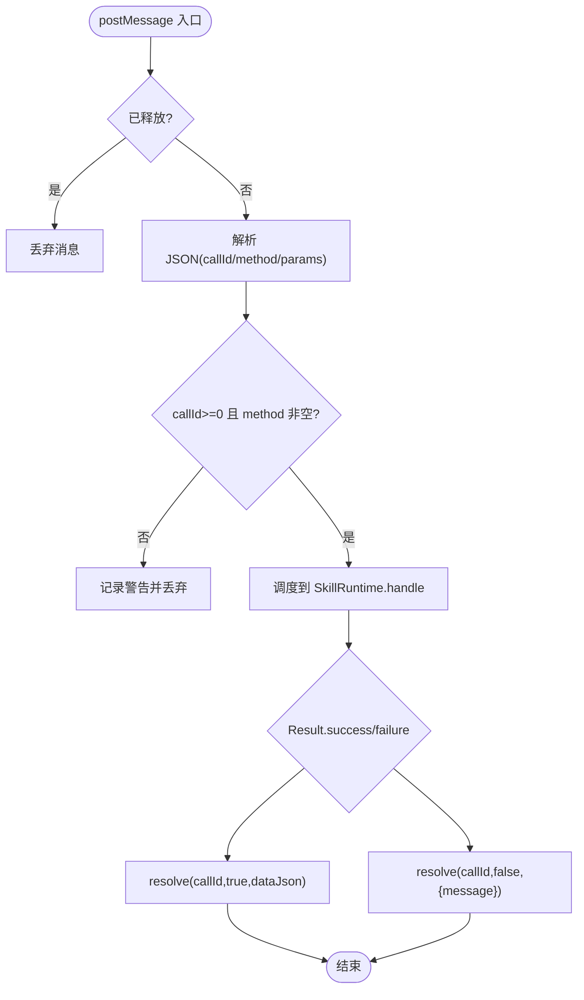
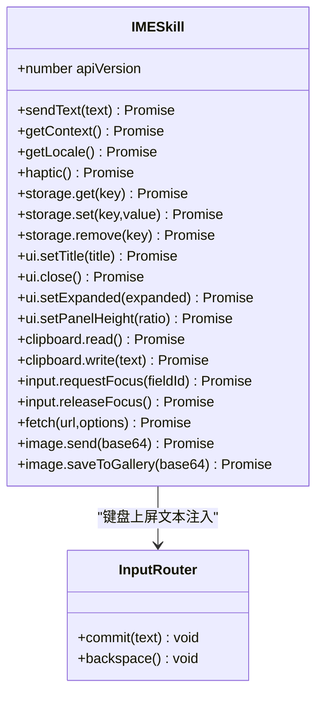
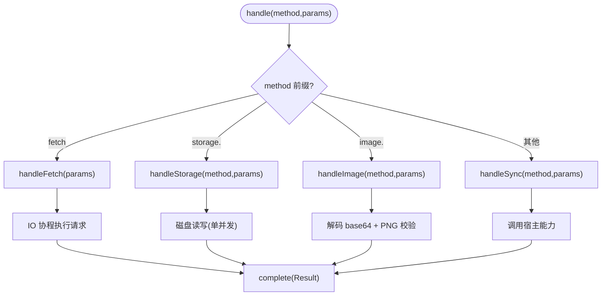
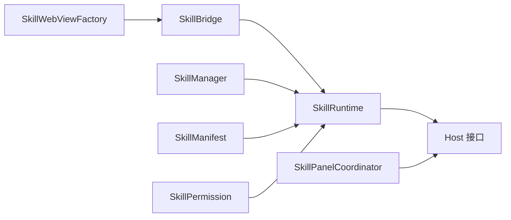

# JS Bridge 通信

<cite>
**本文引用的文件**   
- [app/src/main/assets/skill_runtime/imeskill.js](file://app/src/main/assets/skill_runtime/imeskill.js)
- [app/src/main/java/com/ziyou/ime/skill/SkillBridge.kt](file://app/src/main/java/com/ziyou/ime/skill/SkillBridge.kt)
- [app/src/main/java/com/ziyou/ime/skill/SkillRuntime.kt](file://app/src/main/java/com/ziyou/ime/skill/SkillRuntime.kt)
- [app/src/main/java/com/ziyou/ime/skill/SkillWebViewFactory.kt](file://app/src/main/java/com/ziyou/ime/skill/SkillWebViewFactory.kt)
- [app/src/main/java/com/ziyou/ime/skill/SkillManager.kt](file://app/src/main/java/com/ziyou/ime/skill/SkillManager.kt)
- [app/src/main/java/com/ziyou/ime/skill/SkillManifestParser.kt](file://app/src/main/java/com/ziyou/ime/skill/SkillManifestParser.kt)
- [core-logic/src/main/java/com/ziyou/ime/core/skill/SkillManifest.kt](file://core-logic/src/main/java/com/ziyou/ime/core/skill/SkillManifest.kt)
- [core-logic/src/main/java/com/ziyou/ime/core/skill/SkillPermission.kt](file://core-logic/src/main/java/com/ziyou/ime/core/skill/SkillPermission.kt)
- [app/src/main/java/com/ziyou/ime/ime/SkillPanelCoordinator.kt](file://app/src/main/java/com/ziyou/ime/ime/SkillPanelCoordinator.kt)
</cite>

## 目录
1. [简介](#简介)
2. [项目结构](#项目结构)
3. [核心组件](#核心组件)
4. [架构总览](#架构总览)
5. [详细组件分析](#详细组件分析)
6. [依赖关系分析](#依赖关系分析)
7. [性能与可靠性](#性能与可靠性)
8. [调试与故障排查](#调试与故障排查)
9. [结论](#结论)
10. [附录：API 参考](#附录api-参考)

## 简介
本文件系统性梳理并文档化输入法技能（Skill）的 JS Bridge 通信机制，覆盖以下要点：
- SkillBridge 的 JavaScript 桥接实现：单入口 __IMESkillNative.postMessage、Promise 异步封装、异常处理。
- imeskill.js 运行时：宿主能力暴露、事件注入、错误上报路径。
- 双向通信协议：消息格式、序列号匹配、超时与重试策略说明。
- 数据类型转换：Java/Kotlin 对象与 JavaScript 对象的映射、序列化/反序列化过程。
- 完整 API 参考：所有可用宿主能力方法、参数、返回值、使用示例。
- 调试技巧与常见问题解决方案。

## 项目结构
JS Bridge 相关代码主要分布在 app 层的 skill 包与 assets 中的运行时脚本，以及 core-logic 的权限与清单模型。

**图示来源** 
- [app/src/main/assets/skill_runtime/imeskill.js:1-164](file://app/src/main/assets/skill_runtime/imeskill.js#L1-L164)
- [app/src/main/java/com/ziyou/ime/skill/SkillBridge.kt:1-99](file://app/src/main/java/com/ziyou/ime/skill/SkillBridge.kt#L1-L99)
- [app/src/main/java/com/ziyou/ime/skill/SkillRuntime.kt:1-521](file://app/src/main/java/com/ziyou/ime/skill/SkillRuntime.kt#L1-L521)
- [app/src/main/java/com/ziyou/ime/skill/SkillWebViewFactory.kt:1-205](file://app/src/main/java/com/ziyou/ime/skill/SkillWebViewFactory.kt#L1-L205)
- [app/src/main/java/com/ziyou/ime/ime/SkillPanelCoordinator.kt:1-257](file://app/src/main/java/com/ziyou/ime/ime/SkillPanelCoordinator.kt#L1-L257)
- [app/src/main/java/com/ziyou/ime/skill/SkillManager.kt:1-110](file://app/src/main/java/com/ziyou/ime/skill/SkillManager.kt#L1-L110)
- [core-logic/src/main/java/com/ziyou/ime/core/skill/SkillManifest.kt:1-51](file://core-logic/src/main/java/com/ziyou/ime/core/skill/SkillManifest.kt#L1-L51)
- [core-logic/src/main/java/com/ziyou/ime/core/skill/SkillPermission.kt:1-27](file://core-logic/src/main/java/com/ziyou/ime/core/skill/SkillPermission.kt#L1-L27)

**章节来源**
- [app/src/main/assets/skill_runtime/imeskill.js:1-164](file://app/src/main/assets/skill_runtime/imeskill.js#L1-L164)
- [app/src/main/java/com/ziyou/ime/skill/SkillBridge.kt:1-99](file://app/src/main/java/com/ziyou/ime/skill/SkillBridge.kt#L1-L99)
- [app/src/main/java/com/ziyou/ime/skill/SkillRuntime.kt:1-521](file://app/src/main/java/com/ziyou/ime/skill/SkillRuntime.kt#L1-L521)
- [app/src/main/java/com/ziyou/ime/skill/SkillWebViewFactory.kt:1-205](file://app/src/main/java/com/ziyou/ime/skill/SkillWebViewFactory.kt#L1-L205)
- [app/src/main/java/com/ziyou/ime/ime/SkillPanelCoordinator.kt:1-257](file://app/src/main/java/com/ziyou/ime/ime/SkillPanelCoordinator.kt#L1-L257)
- [app/src/main/java/com/ziyou/ime/skill/SkillManager.kt:1-110](file://app/src/main/java/com/ziyou/ime/skill/SkillManager.kt#L1-L110)
- [core-logic/src/main/java/com/ziyou/ime/core/skill/SkillManifest.kt:1-51](file://core-logic/src/main/java/com/ziyou/ime/core/skill/SkillManifest.kt#L1-L51)
- [core-logic/src/main/java/com/ziyou/ime/core/skill/SkillPermission.kt:1-27](file://core-logic/src/main/java/com/ziyou/ime/core/skill/SkillPermission.kt#L1-L27)

## 核心组件
- imeskill.js：在 WebView 中注入的 JS 垫片，提供 window.IMESkill 统一 API，内部通过 __IMESkillNative.postMessage 发起调用，并以 Promise 封装异步结果；同时提供 window.__imeskillResolve 接收宿主回传结果。
- SkillBridge：Android 侧 @JavascriptInterface 单入口，负责解析 JSON 消息、线程切换至主线程、分发到 SkillRuntime，并通过 evaluateJavascript 将结果回传给 JS。
- SkillRuntime：承载全部业务逻辑（权限校验、storage、fetch、image、input 路由、UI 控制），以 Result<String?> 回调形式返回成功或失败信息。
- SkillWebViewFactory：创建安全的 WebView，全量资源拦截、CSP 收紧、垫片脚本优先 DOCUMENT_START_SCRIPT 注入，崩溃兜底保护 IME 进程。
- SkillPanelCoordinator：面板三态布局与宿主能力对接，支持提升挂载、收缩态、输入路由切换。
- SkillManager / Manifest / Permission：技能元数据与权限模型，驱动运行时行为与安全检查。

**章节来源**
- [app/src/main/assets/skill_runtime/imeskill.js:1-164](file://app/src/main/assets/skill_runtime/imeskill.js#L1-L164)
- [app/src/main/java/com/ziyou/ime/skill/SkillBridge.kt:1-99](file://app/src/main/java/com/ziyou/ime/skill/SkillBridge.kt#L1-L99)
- [app/src/main/java/com/ziyou/ime/skill/SkillRuntime.kt:1-521](file://app/src/main/java/com/ziyou/ime/skill/SkillRuntime.kt#L1-L521)
- [app/src/main/java/com/ziyou/ime/skill/SkillWebViewFactory.kt:1-205](file://app/src/main/java/com/ziyou/ime/skill/SkillWebViewFactory.kt#L1-L205)
- [app/src/main/java/com/ziyou/ime/ime/SkillPanelCoordinator.kt:1-257](file://app/src/main/java/com/ziyou/ime/ime/SkillPanelCoordinator.kt#L1-L257)
- [app/src/main/java/com/ziyou/ime/skill/SkillManager.kt:1-110](file://app/src/main/java/com/ziyou/ime/skill/SkillManager.kt#L1-L110)
- [core-logic/src/main/java/com/ziyou/ime/core/skill/SkillManifest.kt:1-51](file://core-logic/src/main/java/com/ziyou/ime/core/skill/SkillManifest.kt#L1-L51)
- [core-logic/src/main/java/com/ziyou/ime/core/skill/SkillPermission.kt:1-27](file://core-logic/src/main/java/com/ziyou/ime/core/skill/SkillPermission.kt#L1-L27)

## 架构总览
下图展示从 JS 调用到 Android 宿主能力的完整链路，包括消息路由、异步回传与安全边界。

**图示来源** 
- [app/src/main/assets/skill_runtime/imeskill.js:1-164](file://app/src/main/assets/skill_runtime/imeskill.js#L1-L164)
- [app/src/main/java/com/ziyou/ime/skill/SkillBridge.kt:1-99](file://app/src/main/java/com/ziyou/ime/skill/SkillBridge.kt#L1-L99)
- [app/src/main/java/com/ziyou/ime/skill/SkillRuntime.kt:1-521](file://app/src/main/java/com/ziyou/ime/skill/SkillRuntime.kt#L1-L521)
- [app/src/main/java/com/ziyou/ime/ime/SkillPanelCoordinator.kt:1-257](file://app/src/main/java/com/ziyou/ime/ime/SkillPanelCoordinator.kt#L1-L257)

## 详细组件分析

### SkillBridge：单入口消息路由与线程切换
- 单入口 postMessage：仅暴露一个 JS 接口，避免多方法直暴的安全风险。
- 线程模型：postMessage 运行在 WebView JavaBridge 线程，立即切换到主线程再分发，确保 UI 操作安全。
- 消息解析：解析 callId/method/params，非法消息直接丢弃。
- 异常兜底：所有异常被捕获并转化为通用错误，保证技能崩溃不影响 IME 主进程。
- 结果回传：通过 evaluateJavascript 调用 window.__imeskillResolve，传递 callId、ok、dataJson（JSON 字符串字面量）。

**图示来源** 
- [app/src/main/java/com/ziyou/ime/skill/SkillBridge.kt:1-99](file://app/src/main/java/com/ziyou/ime/skill/SkillBridge.kt#L1-L99)

**章节来源**
- [app/src/main/java/com/ziyou/ime/skill/SkillBridge.kt:1-99](file://app/src/main/java/com/ziyou/ime/skill/SkillBridge.kt#L1-L99)

### imeskill.js：运行时与 Promise 封装
- 全局唯一性：window.IMESkill 初始化幂等，避免重复注入。
- 消息发送：call(method, params) 生成自增 callId，维护 pending 表，通过 __IMESkillNative.postMessage 发送。
- 结果接收：window.__imeskillResolve 根据 callId 查找 pending Promise，解析 dataJson 后 resolve/reject。
- 输入路由：__imeskillInput.commit/backspace 向当前聚焦元素插入或删除文本，并触发 input 事件。
- API 暴露：sendText/getContext/getLocale/haptic/storage/ui/clipboard/input/fetch/image 等方法均返回 Promise。

**图示来源** 
- [app/src/main/assets/skill_runtime/imeskill.js:1-164](file://app/src/main/assets/skill_runtime/imeskill.js#L1-L164)

**章节来源**
- [app/src/main/assets/skill_runtime/imeskill.js:1-164](file://app/src/main/assets/skill_runtime/imeskill.js#L1-L164)

### SkillRuntime：能力实现与协议处理
- 方法分发：handle(method, params, complete) 按前缀区分 fetch/storage/image/其他同步能力。
- 权限校验：requirePermission 检查 manifest 声明的权限集合。
- storage：异步串行 IO（单并发），限额 1MB，缓存内存中 JSONObject。
- image：仅接受 PNG（魔数校验），send 经 commitContent 提交，saveToGallery 写入系统相册（Android 10+）。
- fetch：强制 HTTPS、域名白名单、超时 10s、响应 ≤1MB、频控 30 次/分钟、并发 ≤2、禁止重定向。
- input 路由：requestFocus/releaseFocus 切换宿主 CommitTarget，配合面板输入框。
- UI 控制：setTitle/close/setExpanded/setPanelHeight。

**图示来源** 
- [app/src/main/java/com/ziyou/ime/skill/SkillRuntime.kt:1-521](file://app/src/main/java/com/ziyou/ime/skill/SkillRuntime.kt#L1-L521)

**章节来源**
- [app/src/main/java/com/ziyou/ime/skill/SkillRuntime.kt:1-521](file://app/src/main/java/com/ziyou/ime/skill/SkillRuntime.kt#L1-L521)

### SkillWebViewFactory：安全基线与资源拦截
- 安全设置：禁用文件/内容访问、DOM Storage、地理定位、多窗口、自动打开窗口。
- 资源拦截：仅允许虚拟域名下的技能包内资源，其余一律返回空响应；HTML 附加 CSP。
- 垫片注入：优先 DOCUMENT_START_SCRIPT，不支持则回退 onPageStarted；幂等可重复。
- 崩溃兜底：onRenderProcessGone 销毁面板，保活 IME 主进程。
- 防闪烁：首帧提交前隐藏 WebView，背景色与主题一致。

**章节来源**
- [app/src/main/java/com/ziyou/ime/skill/SkillWebViewFactory.kt:1-205](file://app/src/main/java/com/ziyou/ime/skill/SkillWebViewFactory.kt#L1-L205)

### SkillPanelCoordinator：面板布局与宿主能力
- 三态布局：键盘叠层、提升挂载、收缩态（IME 窗口总高不变）。
- 输入路由：激活时 setCommitTarget 指向面板输入框，关闭时恢复。
- 高度比例：ui.setPanelHeight 调整提升挂载高度，默认紧凑比例。
- 收缩态：setImeExpanded(false) 隐藏键盘/候选区，面板接管空间。

**章节来源**
- [app/src/main/java/com/ziyou/ime/ime/SkillPanelCoordinator.kt:1-257](file://app/src/main/java/com/ziyou/ime/ime/SkillPanelCoordinator.kt#L1-L257)

## 依赖关系分析
- SkillBridge 依赖 SkillRuntime 与 WebViewProvider。
- SkillRuntime 依赖 Host 接口（由面板协调器实现）与权限/清单模型。
- SkillWebViewFactory 依赖 ZipEntryValidator 与 CSP 策略。
- SkillManager 与 Manifest/Permission 为运行时提供元数据与权限约束。

**图示来源** 
- [app/src/main/java/com/ziyou/ime/skill/SkillBridge.kt:1-99](file://app/src/main/java/com/ziyou/ime/skill/SkillBridge.kt#L1-L99)
- [app/src/main/java/com/ziyou/ime/skill/SkillRuntime.kt:1-521](file://app/src/main/java/com/ziyou/ime/skill/SkillRuntime.kt#L1-L521)
- [app/src/main/java/com/ziyou/ime/skill/SkillWebViewFactory.kt:1-205](file://app/src/main/java/com/ziyou/ime/skill/SkillWebViewFactory.kt#L1-L205)
- [app/src/main/java/com/ziyou/ime/ime/SkillPanelCoordinator.kt:1-257](file://app/src/main/java/com/ziyou/ime/ime/SkillPanelCoordinator.kt#L1-L257)
- [app/src/main/java/com/ziyou/ime/skill/SkillManager.kt:1-110](file://app/src/main/java/com/ziyou/ime/skill/SkillManager.kt#L1-L110)
- [core-logic/src/main/java/com/ziyou/ime/core/skill/SkillManifest.kt:1-51](file://core-logic/src/main/java/com/ziyou/ime/core/skill/SkillManifest.kt#L1-L51)
- [core-logic/src/main/java/com/ziyou/ime/core/skill/SkillPermission.kt:1-27](file://core-logic/src/main/java/com/ziyou/ime/core/skill/SkillPermission.kt#L1-L27)

**章节来源**
- [app/src/main/java/com/ziyou/ime/skill/SkillBridge.kt:1-99](file://app/src/main/java/com/ziyou/ime/skill/SkillBridge.kt#L1-L99)
- [app/src/main/java/com/ziyou/ime/skill/SkillRuntime.kt:1-521](file://app/src/main/java/com/ziyou/ime/skill/SkillRuntime.kt#L1-L521)
- [app/src/main/java/com/ziyou/ime/skill/SkillWebViewFactory.kt:1-205](file://app/src/main/java/com/ziyou/ime/skill/SkillWebViewFactory.kt#L1-L205)
- [app/src/main/java/com/ziyou/ime/ime/SkillPanelCoordinator.kt:1-257](file://app/src/main/java/com/ziyou/ime/ime/SkillPanelCoordinator.kt#L1-L257)
- [app/src/main/java/com/ziyou/ime/skill/SkillManager.kt:1-110](file://app/src/main/java/com/ziyou/ime/skill/SkillManager.kt#L1-L110)
- [core-logic/src/main/java/com/ziyou/ime/core/skill/SkillManifest.kt:1-51](file://core-logic/src/main/java/com/ziyou/ime/core/skill/SkillManifest.kt#L1-L51)
- [core-logic/src/main/java/com/ziyou/ime/core/skill/SkillPermission.kt:1-27](file://core-logic/src/main/java/com/ziyou/ime/core/skill/SkillPermission.kt#L1-L27)

## 性能与可靠性
- 消息长度限制：单条消息最大 512KB，防止超大消息拖垮主线程。
- 存储限额：每技能 storage 上限 1MB，序列化后校验。
- 网络限制：fetch 超时 10s，响应 ≤1MB，频控 30 次/分钟，并发 ≤2，禁重定向。
- 线程模型：Bridge 主线程分发，storage/fetch 使用协程与 IO 调度器，避免阻塞。
- 崩溃隔离：渲染进程崩溃不波及 IME 主进程，面板销毁保活。

[本节为通用指导，无需特定文件引用]

## 调试与故障排查
- 启用远程调试：debuggable 构建下开启 WebView 远程调试（生产包禁用）。
- 日志观察：Bridge 与 Runtime 对非法消息、异常、网络失败均有日志输出。
- 常见错误：
  - 未知方法：检查 manifest 与 API 版本协商。
  - 权限拒绝：确认 manifest 声明对应权限。
  - 域名不在白名单：检查 network_domains。
  - 图片无效：确认 base64 为 PNG 且含正确魔数。
  - 存储超限：清理或减少存储数据。
- 输入路由问题：确认 needs_input 与 requestFocus/releaseFocus 配对调用。

**章节来源**
- [app/src/main/java/com/ziyou/ime/skill/SkillBridge.kt:1-99](file://app/src/main/java/com/ziyou/ime/skill/SkillBridge.kt#L1-L99)
- [app/src/main/java/com/ziyou/ime/skill/SkillRuntime.kt:1-521](file://app/src/main/java/com/ziyou/ime/skill/SkillRuntime.kt#L1-L521)
- [app/src/main/java/com/ziyou/ime/skill/SkillWebViewFactory.kt:1-205](file://app/src/main/java/com/ziyou/ime/skill/SkillWebViewFactory.kt#L1-L205)

## 结论
本 JS Bridge 通信机制通过单入口、全异步、严格权限与资源拦截，实现了安全可靠的技能面板与宿主交互。Promise 封装简化了异步调用，运行时提供了丰富的宿主能力，面板协调器确保了灵活的布局与输入路由。整体设计兼顾性能、安全与可扩展性，适合输入法技能生态的发展。

[本节为总结，无需特定文件引用]

## 附录：API 参考

### 消息格式规范
- 请求体（JSON）：
  - callId：自增整数，用于匹配响应。
  - method：方法名，如 sendText、storage.get、image.send 等。
  - params：对象，包含方法所需参数。
- 响应回传：
  - window.__imeskillResolve(callId, ok, dataJson)
  - ok：布尔值，表示成功或失败。
  - dataJson：JSON 字符串（null 或有效 JSON），失败时为 {message: string}。

**章节来源**
- [app/src/main/assets/skill_runtime/imeskill.js:1-164](file://app/src/main/assets/skill_runtime/imeskill.js#L1-L164)
- [app/src/main/java/com/ziyou/ime/skill/SkillBridge.kt:1-99](file://app/src/main/java/com/ziyou/ime/skill/SkillBridge.kt#L1-L99)

### 序列号匹配与超时处理
- 序列号匹配：pending 表以 callId 为键，__imeskillResolve 查找并删除。
- 超时处理：当前实现未内置超时机制；fetch 有 10s 超时，其他能力无显式超时。
- 重试机制：未实现自动重试；技能脚本可自行实现重试逻辑。

**章节来源**
- [app/src/main/assets/skill_runtime/imeskill.js:1-164](file://app/src/main/assets/skill_runtime/imeskill.js#L1-L164)
- [app/src/main/java/com/ziyou/ime/skill/SkillRuntime.kt:1-521](file://app/src/main/java/com/ziyou/ime/skill/SkillRuntime.kt#L1-L521)

### 数据类型转换规则
- Java/Kotlin → JavaScript：
  - String：直接作为 JSON 字符串。
  - Number：转为 JSON 数字。
  - Boolean：转为 JSON 布尔。
  - Object：转为 JSON 对象（JSONObject.toString）。
  - null：转为 JSON null。
- JavaScript → Java/Kotlin：
  - JSON.parse(dataJson) 解析为 JS 对象。
  - 参数通过 optString/optBoolean/optLong 等读取。

**章节来源**
- [app/src/main/java/com/ziyou/ime/skill/SkillBridge.kt:1-99](file://app/src/main/java/com/ziyou/ime/skill/SkillBridge.kt#L1-L99)
- [app/src/main/java/com/ziyou/ime/skill/SkillRuntime.kt:1-521](file://app/src/main/java/com/ziyou/ime/skill/SkillRuntime.kt#L1-L521)

### 宿主能力 API 参考
- sendText(text)：上屏文本并关闭面板。
  - 参数：text（string）
  - 返回：Promise<void>
- getContext()：获取宿主环境信息。
  - 返回：Promise<{packageName:string, inputType:string}>
- getLocale()：获取系统语言（BCP 47）。
  - 返回：Promise<string>
- haptic()：震动反馈。
  - 返回：Promise<void>
- storage.get(key)：读取 KV。
  - 参数：key（string）
  - 返回：Promise<string|null>
- storage.set(key, value)：写入 KV。
  - 参数：key（string）、value（string）
  - 返回：Promise<void>
- storage.remove(key)：删除 KV。
  - 参数：key（string）
  - 返回：Promise<void>
- ui.setTitle(title)：设置面板标题。
  - 参数：title（string）
  - 返回：Promise<void>
- ui.close()：关闭面板。
  - 返回：Promise<void>
- ui.setExpanded(expanded)：展开/收缩输入法界面。
  - 参数：expanded（boolean，默认 true）
  - 返回：Promise<void>
- ui.setPanelHeight(ratio)：自定义面板高度比例。
  - 参数：ratio（number，钳制到 [0.4, 1.2]）
  - 返回：Promise<void>
- clipboard.read()：读取剪贴板。
  - 返回：Promise<string|null>
- clipboard.write(text)：写入剪贴板。
  - 参数：text（string）
  - 返回：Promise<void>
- input.requestFocus(fieldId)：请求面板内输入焦点。
  - 参数：fieldId（string，DOM 元素 id）
  - 返回：Promise<void>
- input.releaseFocus()：释放面板输入焦点。
  - 返回：Promise<void>
- fetch(url, options)：网络请求代理。
  - 参数：url（string）、options（{method:'POST'|'GET', body:string, contentType:string}）
  - 返回：Promise<{status:number, body:string}>
- image.send(base64)：发送图片到当前输入框。
  - 参数：base64（string，PNG base64，可带 data URL 前缀）
  - 返回：Promise<void>
- image.saveToGallery(base64)：保存到系统相册。
  - 参数：base64（string，PNG base64）
  - 返回：Promise<void>

**章节来源**
- [app/src/main/assets/skill_runtime/imeskill.js:1-164](file://app/src/main/assets/skill_runtime/imeskill.js#L1-L164)
- [app/src/main/java/com/ziyou/ime/skill/SkillRuntime.kt:1-521](file://app/src/main/java/com/ziyou/ime/skill/SkillRuntime.kt#L1-L521)