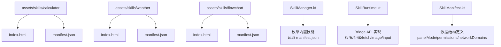
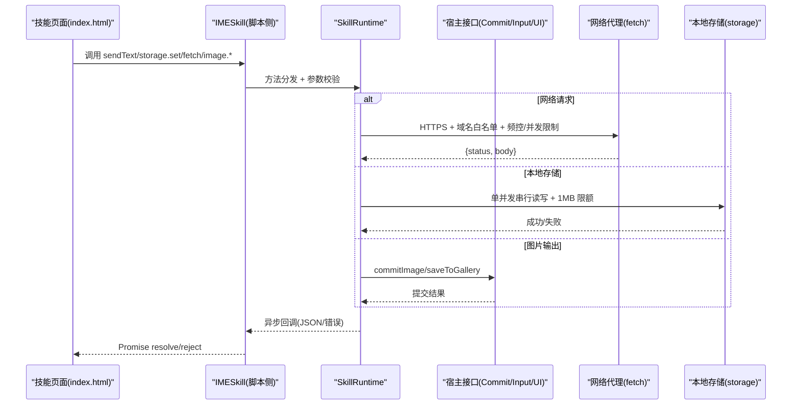
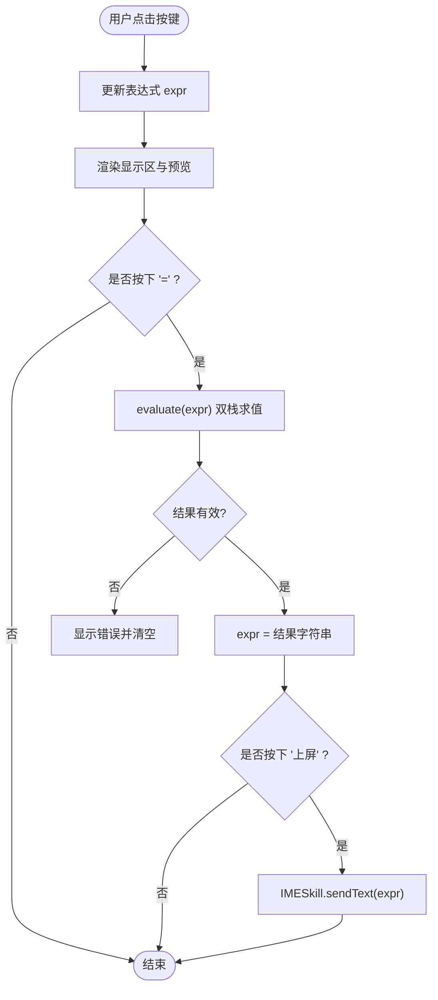
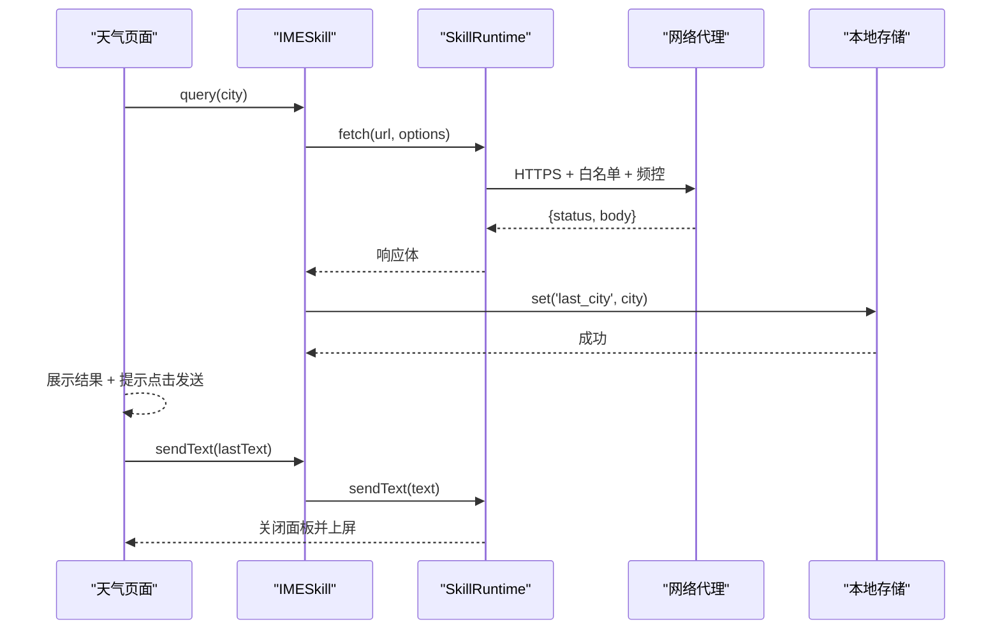
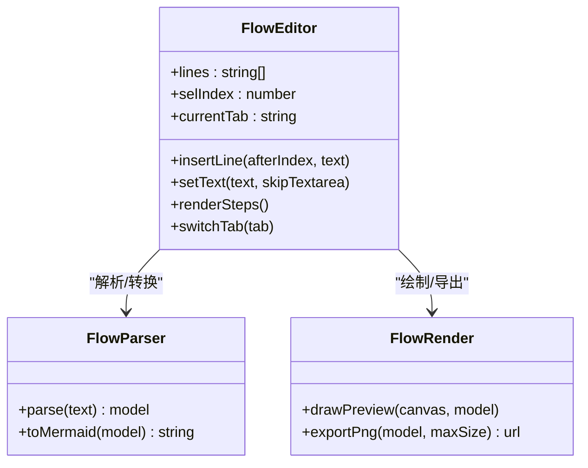
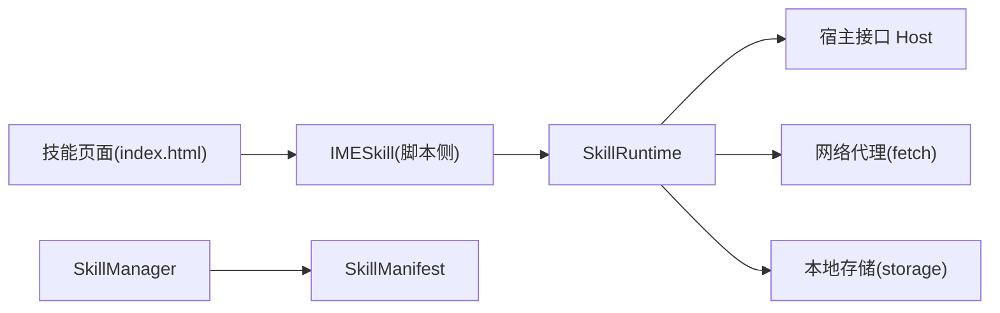

# 内置技能示例

<cite>
**本文引用的文件**   
- [计算器 index.html](file://app/src/main/assets/skills/calculator/index.html)
- [计算器 manifest.json](file://app/src/main/assets/skills/calculator/manifest.json)
- [天气查询 index.html](file://app/src/main/assets/skills/weather/index.html)
- [天气查询 manifest.json](file://app/src/main/assets/skills/weather/manifest.json)
- [流程图 index.html](file://app/src/main/assets/skills/flowchart/index.html)
- [流程图 manifest.json](file://app/src/main/assets/skills/flowchart/manifest.json)
- [流程图 script.js](file://app/src/main/assets/skills/flowchart/script.js)
- [SkillManager.kt](file://app/src/main/java/com/ziyou/ime/skill/SkillManager.kt)
- [SkillRuntime.kt](file://app/src/main/java/com/ziyou/ime/skill/SkillRuntime.kt)
- [SkillManifest.kt](file://core-logic/src/main/java/com/ziyou/ime/core/skill/SkillManifest.kt)
</cite>

## 目录
1. [简介](#简介)
2. [项目结构](#项目结构)
3. [核心组件](#核心组件)
4. [架构总览](#架构总览)
5. [详细组件分析](#详细组件分析)
6. [依赖关系分析](#依赖关系分析)
7. [性能考量](#性能考量)
8. [故障排查指南](#故障排查指南)
9. [结论](#结论)
10. [附录](#附录)

## 简介
本文件围绕输入法应用中的“内置技能”示例进行系统化文档化，重点覆盖：
- 计算器技能：数学表达式解析、结果格式化、一键上屏与交互设计。
- 天气查询技能：API 调用流程、数据缓存策略、城市输入路由与定位体验。
- 名言警句技能：仓库中未提供该技能的实现，本节以通用设计模式说明其随机算法、本地存储与分享能力，供开发者参考。
- 流程图技能（替代示例）：可视化编辑、文本模式双向同步、Mermaid 代码生成与图片导出。
- 技能配置 manifest.json：权限需求、面板形态、界面适配与交互设计要点。
- 技能运行时与宿主桥接：Bridge API、权限校验、网络代理、存储限额、输入路由等。
- 测试方法与质量评估标准：功能、安全、性能与可维护性维度。

## 项目结构
内置技能位于 assets/skills/<skill_id>/ 目录下，每个技能包含入口 HTML 与 manifest.json；宿主侧通过 SkillManager 枚举并加载，SkillRuntime 提供 Bridge API 能力。

**图表来源** 
- [SkillManager.kt:62-108](file://app/src/main/java/com/ziyou/ime/skill/SkillManager.kt#L62-L108)
- [SkillRuntime.kt:142-241](file://app/src/main/java/com/ziyou/ime/skill/SkillRuntime.kt#L142-L241)
- [SkillManifest.kt:9-40](file://core-logic/src/main/java/com/ziyou/ime/core/skill/SkillManifest.kt#L9-L40)

**章节来源**
- [SkillManager.kt:62-108](file://app/src/main/java/com/ziyou/ime/skill/SkillManager.kt#L62-L108)
- [SkillManifest.kt:9-40](file://core-logic/src/main/java/com/ziyou/ime/core/skill/SkillManifest.kt#L9-L40)

## 核心组件
- 技能清单模型：SkillManifest 定义了 id、name、version、minHostApi、panelMode、permissions、networkDomains、needsInput 等字段，用于描述技能元数据与能力声明。
- 技能管理器：SkillManager 负责扫描 assets/skills 与内部存储安装目录，解析 manifest.json 并返回可用技能列表。
- 技能运行时：SkillRuntime 提供 Bridge API（sendText、storage.*、image.*、fetch、input.*、ui.*、clipboard.*），承载权限校验、限额控制、IO 调度与宿主交互。

**章节来源**
- [SkillManifest.kt:9-40](file://core-logic/src/main/java/com/ziyou/ime/core/skill/SkillManifest.kt#L9-L40)
- [SkillManager.kt:62-108](file://app/src/main/java/com/ziyou/ime/skill/SkillManager.kt#L62-L108)
- [SkillRuntime.kt:142-241](file://app/src/main/java/com/ziyou/ime/skill/SkillRuntime.kt#L142-L241)

## 架构总览
技能运行在 WebView 中，通过 IMESkill 对象调用宿主提供的 Bridge API。宿主侧由 SkillRuntime 统一处理权限、资源限制与系统能力调用。

**图表来源** 
- [SkillRuntime.kt:142-241](file://app/src/main/java/com/ziyou/ime/skill/SkillRuntime.kt#L142-L241)
- [SkillRuntime.kt:374-471](file://app/src/main/java/com/ziyou/ime/skill/SkillRuntime.kt#L374-L471)
- [SkillRuntime.kt:250-284](file://app/src/main/java/com/ziyou/ime/skill/SkillRuntime.kt#L250-L284)
- [SkillRuntime.kt:293-332](file://app/src/main/java/com/ziyou/ime/skill/SkillRuntime.kt#L293-L332)

## 详细组件分析

### 计算器技能
- 功能概述：四则运算表达式解析与求值，实时预览结果，支持一键上屏。
- 表达式解析：采用双栈算符优先级算法，避免使用 eval，满足 CSP 限制。
- 结果格式化：浮点尾差消除（toFixed(10) 后去零），异常时抖动提示。
- 交互设计：网格按键布局，操作键高亮，发送键跨列显示；长按删除键快速清空。
- manifest 特点：无网络权限，嵌入模式，最小 host API 版本要求较低。

**图表来源** 
- [计算器 index.html:122-155](file://app/src/main/assets/skills/calculator/index.html#L122-L155)
- [计算器 index.html:166-178](file://app/src/main/assets/skills/calculator/index.html#L166-L178)

**章节来源**
- [计算器 index.html:1-202](file://app/src/main/assets/skills/calculator/index.html#L1-L202)
- [计算器 manifest.json:1-14](file://app/src/main/assets/skills/calculator/manifest.json#L1-L14)

### 天气查询技能
- 功能概述：输入或选择城市，查询实时天气，结果点击发送到聊天框。
- API 调用：通过 IMESkill.fetch 访问 wttr.in，format=3 返回单行文本；强制 HTTPS 与域名白名单。
- 数据缓存：使用 IMESkill.storage 保存 last_city，恢复上次查询城市。
- 输入路由：点击输入框后通过 IMESkill.input.requestFocus 将键盘上屏文本路由到面板输入框，提升 in-app 输入体验。
- manifest 特点：声明 network 与 storage 权限，card 面板模式，needs_input=true，限定 network_domains。

**图表来源** 
- [天气查询 index.html:87-121](file://app/src/main/assets/skills/weather/index.html#L87-L121)
- [SkillRuntime.kt:374-471](file://app/src/main/java/com/ziyou/ime/skill/SkillRuntime.kt#L374-L471)
- [SkillRuntime.kt:250-284](file://app/src/main/java/com/ziyou/ime/skill/SkillRuntime.kt#L250-L284)

**章节来源**
- [天气查询 index.html:1-125](file://app/src/main/assets/skills/weather/index.html#L1-L125)
- [天气查询 manifest.json:1-16](file://app/src/main/assets/skills/weather/manifest.json#L1-L16)

### 名言警句技能（概念设计）
由于仓库未提供该技能实现，以下给出通用设计建议：
- 随机算法：从本地 JSON 或在线 API 获取语料库，使用均匀分布随机索引选取；离线优先，在线回退。
- 本地数据存储：使用 IMESkill.storage 缓存最近 N 条与收藏列表，设置过期策略与容量上限。
- 分享功能：支持复制文本、发送文本、生成图片（调用 image.saveToGallery）。
- manifest 建议：若仅本地使用，无需 network 权限；如需在线语料，声明 network 与 network_domains。

[本节为概念性内容，不直接分析具体文件]

### 流程图技能（替代示例）
- 功能概述：可视化编排流程图，支持编辑、文本模式与预览三视图；生成 Mermaid 代码上屏或导出 PNG 图片。
- 状态机：单一事实源为伪代码文本 lines，可视化操作与文本编辑双向同步。
- 输入路由：表单与文本区域通过 input.requestFocus/releaseFocus 管理焦点态。
- 输出能力：sendText 上屏代码；image.send/saveToGallery 发送或保存图片。
- manifest 特点：声明 storage 与 image 权限，needs_input=true，embed 面板模式。

**图表来源** 
- [流程图 script.js:1-347](file://app/src/main/assets/skills/flowchart/script.js#L1-L347)
- [流程图 index.html:1-133](file://app/src/main/assets/skills/flowchart/index.html#L1-L133)

**章节来源**
- [流程图 script.js:1-347](file://app/src/main/assets/skills/flowchart/script.js#L1-L347)
- [流程图 index.html:1-133](file://app/src/main/assets/skills/flowchart/index.html#L1-L133)
- [流程图 manifest.json:1-15](file://app/src/main/assets/skills/flowchart/manifest.json#L1-L15)

## 依赖关系分析
- 技能页面依赖 IMESkill 暴露的 API（sendText、storage、fetch、image、input、ui、clipboard）。
- SkillRuntime 作为 Bridge 的实现层，依赖宿主接口 Host 完成文本上屏、图片提交、输入路由与 UI 控制。
- SkillManager 负责发现与加载技能，SkillManifest 提供数据结构与枚举类型。

**图表来源** 
- [SkillRuntime.kt:142-241](file://app/src/main/java/com/ziyou/ime/skill/SkillRuntime.kt#L142-L241)
- [SkillManager.kt:62-108](file://app/src/main/java/com/ziyou/ime/skill/SkillManager.kt#L62-L108)
- [SkillManifest.kt:9-40](file://core-logic/src/main/java/com/ziyou/ime/core/skill/SkillManifest.kt#L9-L40)

**章节来源**
- [SkillRuntime.kt:142-241](file://app/src/main/java/com/ziyou/ime/skill/SkillRuntime.kt#L142-L241)
- [SkillManager.kt:62-108](file://app/src/main/java/com/ziyou/ime/skill/SkillManager.kt#L62-L108)
- [SkillManifest.kt:9-40](file://core-logic/src/main/java/com/ziyou/ime/core/skill/SkillManifest.kt#L9-L40)

## 性能考量
- 表达式求值：计算器使用双栈算法，时间复杂度 O(n)，空间复杂度 O(n)，避免 eval 带来的安全风险与开销。
- 网络请求：fetch 代理限制超时、响应大小、频率与并发，防止滥用与卡顿。
- 存储读写：storage 使用单并发 IO 调度器，保证顺序写入与一致性，限制 1MB 总量。
- 图片处理：PNG 魔数校验与大小限制，避免非法数据与内存溢出。
- 输入路由：仅在 needs_input 技能启用，减少不必要的焦点切换成本。

[本节为通用指导，不直接分析具体文件]

## 故障排查指南
- 权限拒绝：检查 manifest.permissions 是否包含所需权限（如 network、storage、image）。
- 网络失败：确认 URL 协议为 HTTPS，域名在白名单内，且未触发频控或并发限制。
- 存储超限：序列化后超过 1MB 会失败，需精简数据或清理旧条目。
- 图片发送失败：当前编辑器可能不支持图片富媒体，或 base64 非 PNG。
- 输入路由不可用：技能未声明 needs_input 或未正确调用 requestFocus/releaseFocus。

**章节来源**
- [SkillRuntime.kt:250-284](file://app/src/main/java/com/ziyou/ime/skill/SkillRuntime.kt#L250-L284)
- [SkillRuntime.kt:374-471](file://app/src/main/java/com/ziyou/ime/skill/SkillRuntime.kt#L374-L471)
- [SkillRuntime.kt:293-332](file://app/src/main/java/com/ziyou/ime/skill/SkillRuntime.kt#L293-L332)

## 结论
内置技能通过清晰的 manifest 声明与统一的 Bridge API，实现了安全、可控、可扩展的能力注入。计算器与天气查询展示了典型的数据处理与网络交互模式；流程图技能提供了复杂交互与多视图同步的设计范式。开发者可借鉴其权限管理、限额控制、输入路由与输出能力，快速构建高质量技能。

[本节为总结性内容，不直接分析具体文件]

## 附录
- 技能测试方法：
  - 单元测试：对表达式求值、解析器与渲染器进行边界用例覆盖。
  - 集成测试：模拟 IMESkill API 调用，验证权限、限额与宿主交互。
  - 端到端测试：自动化点击与输入路由，验证上屏与面板行为。
- 质量评估标准：
  - 安全性：CSP、eval 禁用、域名白名单、PNG 魔数校验。
  - 稳定性：异常路径处理、抖动提示、降级策略。
  - 性能：O(n) 求值、限流与并发控制、IO 串行化。
  - 可维护性：单一事实源、模块化脚本、清晰 manifest 结构。

[本节为通用指导，不直接分析具体文件]