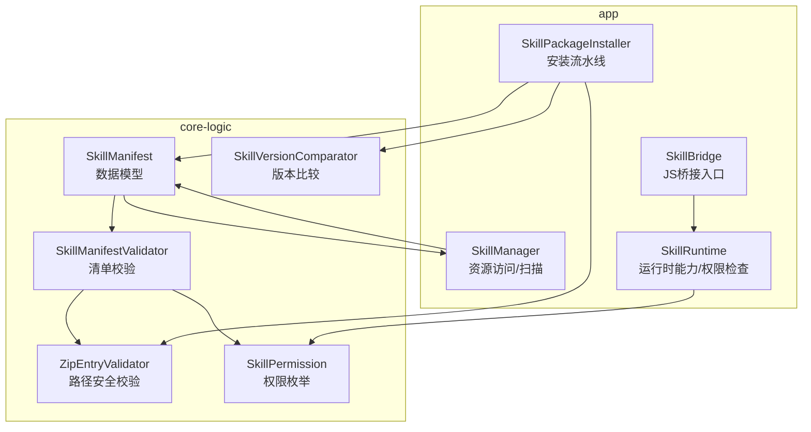
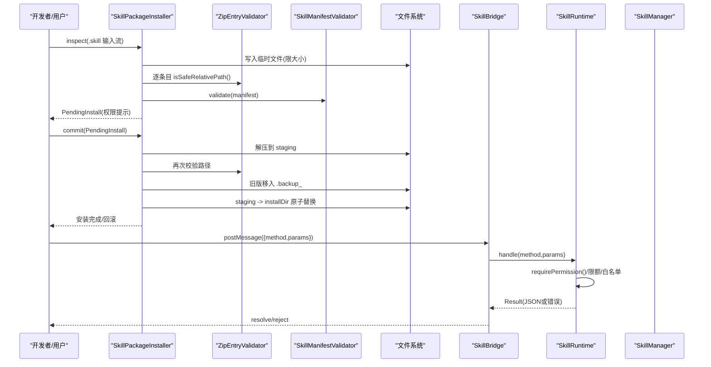
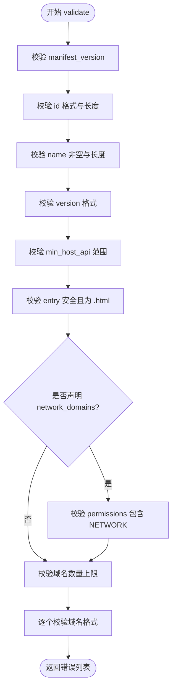
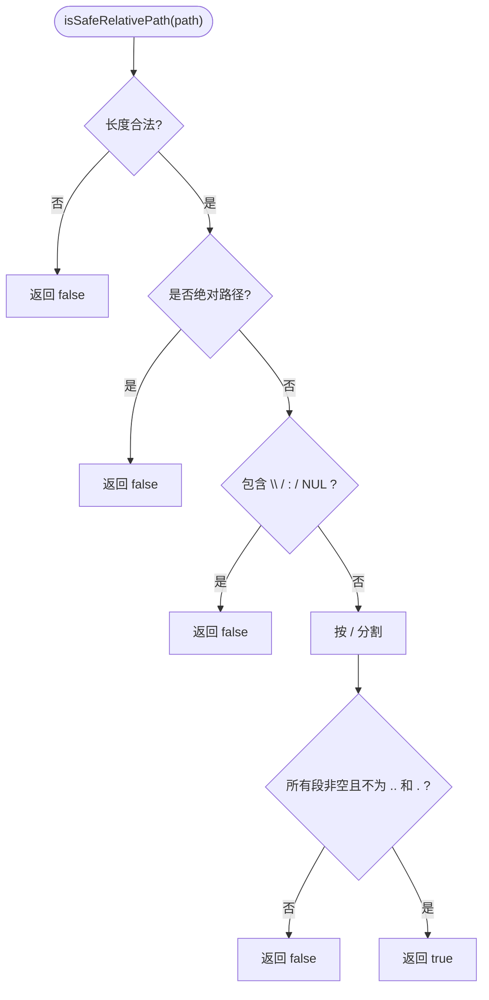
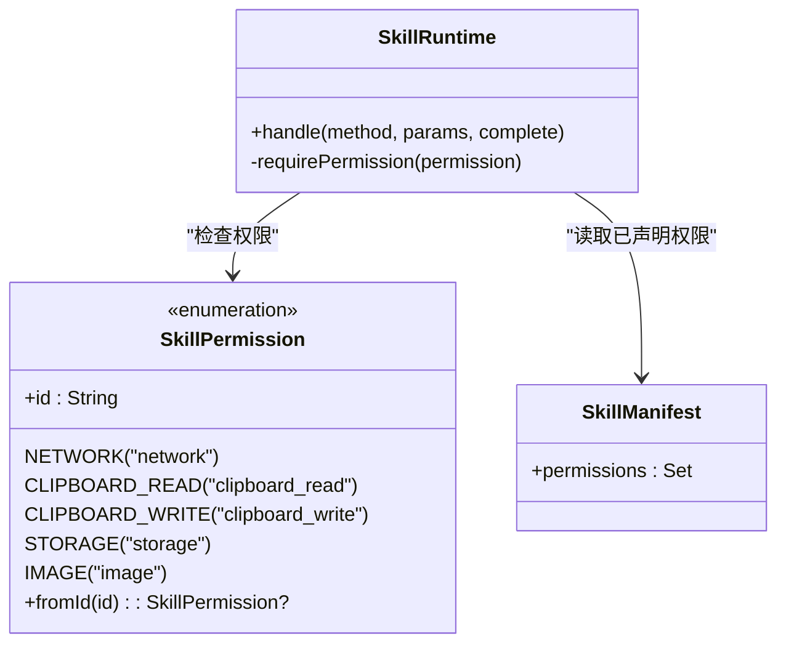
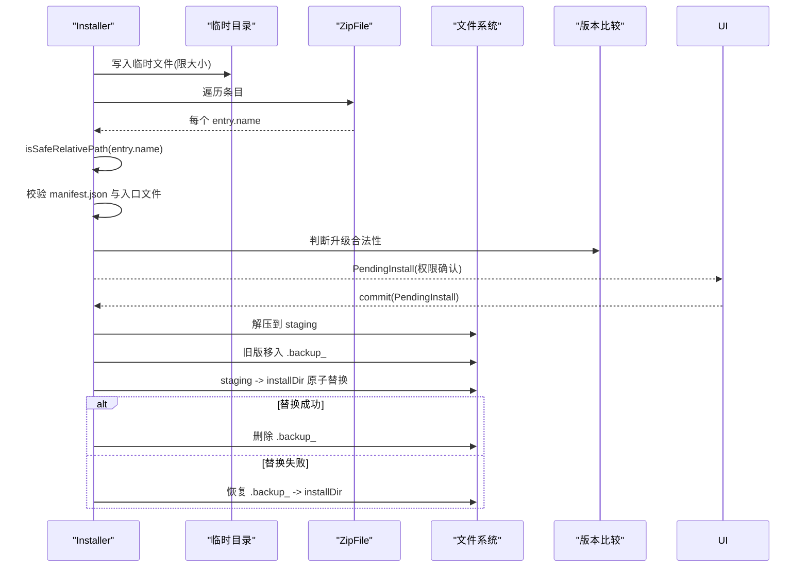
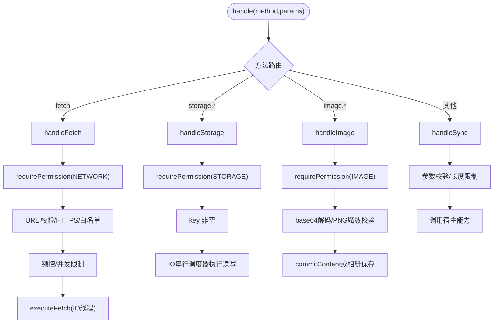
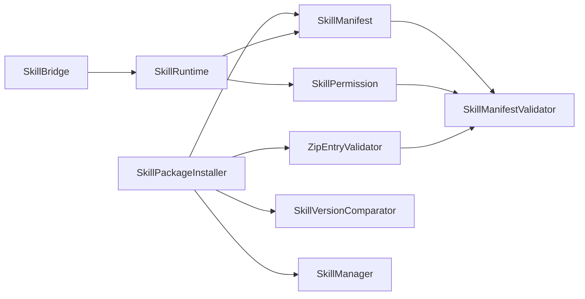

# 安全机制

<cite>
**本文引用的文件**   
- [SkillManifestValidator.kt](file://core-logic/src/main/java/com/ziyou/ime/core/skill/SkillManifestValidator.kt)
- [ZipEntryValidator.kt](file://core-logic/src/main/java/com/ziyou/ime/core/skill/ZipEntryValidator.kt)
- [SkillPermission.kt](file://core-logic/src/main/java/com/ziyou/ime/core/skill/SkillPermission.kt)
- [SkillPackageInstaller.kt](file://app/src/main/java/com/ziyou/ime/skill/SkillPackageInstaller.kt)
- [SkillManifest.kt](file://core-logic/src/main/java/com/ziyou/ime/core/skill/SkillManifest.kt)
- [SkillVersionComparator.kt](file://core-logic/src/main/java/com/ziyou/ime/core/skill/SkillVersionComparator.kt)
- [SkillManager.kt](file://app/src/main/java/com/ziyou/ime/skill/SkillManager.kt)
- [SkillRuntime.kt](file://app/src/main/java/com/ziyou/ime/skill/SkillRuntime.kt)
- [SkillBridge.kt](file://app/src/main/java/com/ziyou/ime/skill/SkillBridge.kt)
- [SkillManifestValidatorTest.kt](file://core-logic/src/test/java/com/ziyou/ime/core/skill/SkillManifestValidatorTest.kt)
- [ZipEntryValidatorTest.kt](file://core-logic/src/test/java/com/ziyou/ime/core/skill/ZipEntryValidatorTest.kt)
</cite>

## 目录
1. [简介](#简介)
2. [项目结构](#项目结构)
3. [核心组件](#核心组件)
4. [架构总览](#架构总览)
5. [详细组件分析](#详细组件分析)
6. [依赖关系分析](#依赖关系分析)
7. [性能考量](#性能考量)
8. [故障排查指南](#故障排查指南)
9. [结论](#结论)
10. [附录：威胁分析与防护对照表](#附录威胁分析与防护对照表)

## 简介
本技术文档聚焦技能插件系统的安全机制，围绕清单验证、压缩包安全检查、权限模型与运行时检查、安装流水线等关键环节展开。目标是帮助开发者理解并正确使用 SkillManifestValidator、ZipEntryValidator、SkillPermission、SkillPackageInstaller 等组件，确保技能包从导入到运行全生命周期的安全性。

## 项目结构
技能插件安全相关代码主要分布在 core-logic（纯逻辑校验）与 app（Android 集成与运行时）两个模块中：
- core-logic: 清单校验、路径安全校验、版本比较、权限枚举等无 Android 依赖的纯逻辑实现
- app: 安装器、运行时、桥接层、资源访问封装等 Android 集成实现

图表来源
- [SkillManifest.kt](file://core-logic/src/main/java/com/ziyou/ime/core/skill/SkillManifest.kt)
- [SkillManifestValidator.kt](file://core-logic/src/main/java/com/ziyou/ime/core/skill/SkillManifestValidator.kt)
- [ZipEntryValidator.kt](file://core-logic/src/main/java/com/ziyou/ime/core/skill/ZipEntryValidator.kt)
- [SkillPermission.kt](file://core-logic/src/main/java/com/ziyou/ime/core/skill/SkillPermission.kt)
- [SkillVersionComparator.kt](file://core-logic/src/main/java/com/ziyou/ime/core/skill/SkillVersionComparator.kt)
- [SkillManager.kt](file://app/src/main/java/com/ziyou/ime/skill/SkillManager.kt)
- [SkillPackageInstaller.kt](file://app/src/main/java/com/ziyou/ime/skill/SkillPackageInstaller.kt)
- [SkillRuntime.kt](file://app/src/main/java/com/ziyou/ime/skill/SkillRuntime.kt)
- [SkillBridge.kt](file://app/src/main/java/com/ziyou/ime/skill/SkillBridge.kt)

章节来源
- [SkillManifest.kt](file://core-logic/src/main/java/com/ziyou/ime/core/skill/SkillManifest.kt)
- [SkillManifestValidator.kt](file://core-logic/src/main/java/com/ziyou/ime/core/skill/SkillManifestValidator.kt)
- [ZipEntryValidator.kt](file://core-logic/src/main/java/com/ziyou/ime/core/skill/ZipEntryValidator.kt)
- [SkillPermission.kt](file://core-logic/src/main/java/com/ziyou/ime/core/skill/SkillPermission.kt)
- [SkillVersionComparator.kt](file://core-logic/src/main/java/com/ziyou/ime/core/skill/SkillVersionComparator.kt)
- [SkillManager.kt](file://app/src/main/java/com/ziyou/ime/skill/SkillManager.kt)
- [SkillPackageInstaller.kt](file://app/src/main/java/com/ziyou/ime/skill/SkillPackageInstaller.kt)
- [SkillRuntime.kt](file://app/src/main/java/com/ziyou/ime/skill/SkillRuntime.kt)
- [SkillBridge.kt](file://app/src/main/java/com/ziyou/ime/skill/SkillBridge.kt)

## 核心组件
- 清单校验器 SkillManifestValidator：对 manifest.json 解析后的数据进行必填字段、格式、版本兼容性、权限声明一致性等校验
- 压缩包路径校验 ZipEntryValidator：防御 Zip Slip 攻击，限制路径长度、字符集、段合法性
- 权限模型 SkillPermission：预定义权限类型，配合运行时 requirePermission 进行调用级检查
- 安装器 SkillPackageInstaller：两阶段安装（inspect + commit），临时隔离、完整性校验、回滚机制
- 运行时 SkillRuntime：Bridge API 实现，集中进行权限检查、限额控制、网络代理、图片处理等
- 桥接层 SkillBridge：统一 JS 入口，消息长度限制、异常兜底、异步回调

章节来源
- [SkillManifestValidator.kt](file://core-logic/src/main/java/com/ziyou/ime/core/skill/SkillManifestValidator.kt)
- [ZipEntryValidator.kt](file://core-logic/src/main/java/com/ziyou/ime/core/skill/ZipEntryValidator.kt)
- [SkillPermission.kt](file://core-logic/src/main/java/com/ziyou/ime/core/skill/SkillPermission.kt)
- [SkillPackageInstaller.kt](file://app/src/main/java/com/ziyou/ime/skill/SkillPackageInstaller.kt)
- [SkillRuntime.kt](file://app/src/main/java/com/ziyou/ime/skill/SkillRuntime.kt)
- [SkillBridge.kt](file://app/src/main/java/com/ziyou/ime/skill/SkillBridge.kt)

## 架构总览
技能插件从导入到运行的安全链路如下：
- 导入阶段：SkillPackageInstaller.inspect 将 .skill 包写入临时目录，执行包大小、条目数、路径安全、manifest 存在性与入口文件存在性校验，返回 PendingInstall 供 UI 展示权限确认
- 安装阶段：用户确认后 SkillPackageInstaller.commit 解压到 staging，旧版本移至备份，原子替换；失败则回滚
- 运行阶段：SkillBridge 接收 JS 调用，转交给 SkillRuntime；SkillRuntime 在方法入口处进行权限检查、参数校验、限额控制、网络白名单等
- 资源访问：SkillManager.openResource 提供统一入口，内置与已安装技能分别通过 assets 与内部存储读取，并对相对路径做 canonicalPath 二次校验

图表来源
- [SkillPackageInstaller.kt](file://app/src/main/java/com/ziyou/ime/skill/SkillPackageInstaller.kt)
- [ZipEntryValidator.kt](file://core-logic/src/main/java/com/ziyou/ime/core/skill/ZipEntryValidator.kt)
- [SkillManifestValidator.kt](file://core-logic/src/main/java/com/ziyou/ime/core/skill/SkillManifestValidator.kt)
- [SkillBridge.kt](file://app/src/main/java/com/ziyou/ime/skill/SkillBridge.kt)
- [SkillRuntime.kt](file://app/src/main/java/com/ziyou/ime/skill/SkillRuntime.kt)
- [SkillManager.kt](file://app/src/main/java/com/ziyou/ime/skill/SkillManager.kt)

## 详细组件分析

### 清单文件验证：SkillManifestValidator
- 必填字段与格式校验
  - manifest_version：仅支持当前版本
  - id：反向域名风格，至少两段，小写字母开头，长度上限
  - name：非空且长度上限
  - version：数字点分格式
  - min_host_api：不低于 1，且不高于宿主 HOST_API_VERSION
  - entry：相对路径安全且以 .html 结尾
  - network_domains：域名白名单需符合规范，数量上限，且必须声明 NETWORK 权限
- 版本兼容性检查
  - 对比 HOST_API_VERSION，拒绝需要更高 API 版本的技能
- 权限声明验证
  - 若声明了 network_domains，则必须在 permissions 中包含 NETWORK
- 错误收集
  - 返回错误列表，便于向用户展示具体原因

图表来源
- [SkillManifestValidator.kt](file://core-logic/src/main/java/com/ziyou/ime/core/skill/SkillManifestValidator.kt)
- [SkillManifest.kt](file://core-logic/src/main/java/com/ziyou/ime/core/skill/SkillManifest.kt)

章节来源
- [SkillManifestValidator.kt](file://core-logic/src/main/java/com/ziyou/ime/core/skill/SkillManifestValidator.kt)
- [SkillManifestValidatorTest.kt](file://core-logic/src/test/java/com/ziyou/ime/core/skill/SkillManifestValidatorTest.kt)

### 压缩包安全检查：ZipEntryValidator
- 路径遍历攻击防护（Zip Slip）
  - 拒绝空路径、绝对路径、反斜杠、盘符冒号、NUL 字符
  - 拒绝包含 .. 或 . 的路径段，防止逃逸
  - 限制单条路径长度上限
- 文件大小与条目数限制
  - 包大小上限（字节）、条目数上限
- 使用场景
  - 安装前逐条目校验
  - WebView 资源映射前的路径校验

图表来源
- [ZipEntryValidator.kt](file://core-logic/src/main/java/com/ziyou/ime/core/skill/ZipEntryValidator.kt)

章节来源
- [ZipEntryValidator.kt](file://core-logic/src/main/java/com/ziyou/ime/core/skill/ZipEntryValidator.kt)
- [ZipEntryValidatorTest.kt](file://core-logic/src/test/java/com/ziyou/ime/core/skill/ZipEntryValidatorTest.kt)

### 权限模型设计：SkillPermission
- 预定义权限类型
  - NETWORK：经宿主代理的网络请求（配合 networkDomains 白名单）
  - CLIPBOARD_READ：读剪贴板
  - CLIPBOARD_WRITE：写剪贴板
  - STORAGE：轻量 KV 持久化（每技能独立空间，限额见运行时）
  - IMAGE：图片输出（API v3）
- 权限申请流程
  - manifest.permissions 声明所需权限集合
  - 安装时由 UI 展示权限确认（PendingInstall 携带 manifest）
- 运行时权限检查
  - SkillRuntime 在每个敏感方法入口调用 requirePermission(permission)
  - 未声明则抛出 SkillApiException，透传给脚本侧 reject

图表来源
- [SkillPermission.kt](file://core-logic/src/main/java/com/ziyou/ime/core/skill/SkillPermission.kt)
- [SkillRuntime.kt](file://app/src/main/java/com/ziyou/ime/skill/SkillRuntime.kt)
- [SkillManifest.kt](file://core-logic/src/main/java/com/ziyou/ime/core/skill/SkillManifest.kt)

章节来源
- [SkillPermission.kt](file://core-logic/src/main/java/com/ziyou/ime/core/skill/SkillPermission.kt)
- [SkillRuntime.kt](file://app/src/main/java/com/ziyou/ime/skill/SkillRuntime.kt)

### 安装安全流水线：SkillPackageInstaller
- 临时目录隔离
  - 使用 cacheDir/skill_import 临时文件存放待安装包，避免污染安装目录
- 完整性校验
  - 包大小上限、条目数上限、Zip Slip 防护、manifest 存在性与入口文件存在性
- 冲突与升级判定
  - 内置技能不可覆盖；同 id 仅允许严格更高版本升级
- 回滚机制
  - staging 解压 → 旧版移至 .backup_ → staging 重命名就位 → 成功删除备份；失败恢复旧版
- 卸载
  - 删除安装目录与对应 storage 数据

图表来源
- [SkillPackageInstaller.kt](file://app/src/main/java/com/ziyou/ime/skill/SkillPackageInstaller.kt)
- [ZipEntryValidator.kt](file://core-logic/src/main/java/com/ziyou/ime/core/skill/ZipEntryValidator.kt)
- [SkillVersionComparator.kt](file://core-logic/src/main/java/com/ziyou/ime/core/skill/SkillVersionComparator.kt)

章节来源
- [SkillPackageInstaller.kt](file://app/src/main/java/com/ziyou/ime/skill/SkillPackageInstaller.kt)

### 运行时权限检查与安全策略：SkillRuntime
- 权限检查
  - 每个敏感方法入口调用 requirePermission，未声明则拒绝
- 限额与防注入
  - sendText 文本长度上限
  - storage 序列化后 1MB 上限
  - fetch 超时、响应大小、频控、并发限制
- 网络代理
  - 强制 HTTPS、域名白名单精确匹配、禁止重定向跟随
- 图片处理
  - 仅接受 PNG（文件头魔数校验），commitContent 发送或保存到相册

图表来源
- [SkillRuntime.kt](file://app/src/main/java/com/ziyou/ime/skill/SkillRuntime.kt)

章节来源
- [SkillRuntime.kt](file://app/src/main/java/com/ziyou/ime/skill/SkillRuntime.kt)

### 资源访问安全：SkillManager
- 统一入口 openResource
  - 内置技能通过 assets 打开
  - 已安装技能通过内部存储打开，并使用 canonicalPath 二次校验，确保不越权访问
- 隐藏目录过滤
  - 扫描安装目录时过滤 .staging_* 中间目录

章节来源
- [SkillManager.kt](file://app/src/main/java/com/ziyou/ime/skill/SkillManager.kt)

### JS 桥接安全：SkillBridge
- 单入口 postMessage
  - 消息长度上限，非法消息丢弃
- 异常兜底
  - 所有异常被捕获并转换为通用错误，避免崩溃传播
- 异步回调
  - 结果通过 evaluateJavascript 异步返回，避免同步暴露原生方法

章节来源
- [SkillBridge.kt](file://app/src/main/java/com/ziyou/ime/skill/SkillBridge.kt)

## 依赖关系分析
- 组件耦合与内聚
  - SkillManifestValidator 与 SkillManifest、SkillPermission、ZipEntryValidator 低耦合，纯逻辑可单测
  - SkillPackageInstaller 依赖 ZipEntryValidator、SkillVersionComparator、SkillManager，负责安装流程编排
  - SkillRuntime 依赖 SkillPermission、SkillManager（资源访问）、Host 接口，承载运行时安全策略
  - SkillBridge 仅作为消息转发与异常兜底，降低暴露面
- 外部依赖与集成点
  - Android Context、Assets、Files、Clipboard、MediaStore、WebView
  - HttpURLConnection 用于 fetch 代理

图表来源
- [SkillManifest.kt](file://core-logic/src/main/java/com/ziyou/ime/core/skill/SkillManifest.kt)
- [SkillManifestValidator.kt](file://core-logic/src/main/java/com/ziyou/ime/core/skill/SkillManifestValidator.kt)
- [ZipEntryValidator.kt](file://core-logic/src/main/java/com/ziyou/ime/core/skill/ZipEntryValidator.kt)
- [SkillPackageInstaller.kt](file://app/src/main/java/com/ziyou/ime/skill/SkillPackageInstaller.kt)
- [SkillVersionComparator.kt](file://core-logic/src/main/java/com/ziyou/ime/core/skill/SkillVersionComparator.kt)
- [SkillManager.kt](file://app/src/main/java/com/ziyou/ime/skill/SkillManager.kt)
- [SkillRuntime.kt](file://app/src/main/java/com/ziyou/ime/skill/SkillRuntime.kt)
- [SkillBridge.kt](file://app/src/main/java/com/ziyou/ime/skill/SkillBridge.kt)

章节来源
- [SkillManifest.kt](file://core-logic/src/main/java/com/ziyou/ime/core/skill/SkillManifest.kt)
- [SkillManifestValidator.kt](file://core-logic/src/main/java/com/ziyou/ime/core/skill/SkillManifestValidator.kt)
- [ZipEntryValidator.kt](file://core-logic/src/main/java/com/ziyou/ime/core/skill/ZipEntryValidator.kt)
- [SkillPackageInstaller.kt](file://app/src/main/java/com/ziyou/ime/skill/SkillPackageInstaller.kt)
- [SkillVersionComparator.kt](file://core-logic/src/main/java/com/ziyou/ime/core/skill/SkillVersionComparator.kt)
- [SkillManager.kt](file://app/src/main/java/com/ziyou/ime/skill/SkillManager.kt)
- [SkillRuntime.kt](file://app/src/main/java/com/ziyou/ime/skill/SkillRuntime.kt)
- [SkillBridge.kt](file://app/src/main/java/com/ziyou/ime/skill/SkillBridge.kt)

## 性能考量
- 安装阶段
  - 边拷贝边卡包体上限，避免大文件占满内存
  - 磁盘空间预检，不足即早失败，减少中途失败概率
  - 解压过程逐条目校验，避免恶意路径导致额外开销
- 运行时
  - storage 使用单并发 IO 调度器保证顺序与稳定性
  - fetch 频控与并发限制，避免滥用
  - 图片处理仅在 IO 协程执行，主线程只负责回调与 UI 操作

[本节为通用指导，无需特定文件引用]

## 故障排查指南
- 清单校验失败
  - 常见错误：manifest_version 不支持、id 格式非法、name 为空或超长、version 格式非法、min_host_api 过高、entry 不安全或非 .html、network_domains 未声明 NETWORK 权限、域名格式非法
  - 参考测试用例定位问题
- 压缩包校验失败
  - 常见错误：包过大、条目过多、路径包含 .. 或绝对路径、缺少 manifest.json、入口文件不存在
- 安装失败
  - 常见错误：存储空间不足、旧版无法移出、staging 重命名失败、升级版本不高于现有版本
- 运行时权限拒绝
  - 常见错误：未声明相应权限、key 为空、URL 非 HTTPS、域名不在白名单、请求过于频繁、并发超限、图片非 PNG、输入框不支持图片

章节来源
- [SkillManifestValidatorTest.kt](file://core-logic/src/test/java/com/ziyou/ime/core/skill/SkillManifestValidatorTest.kt)
- [ZipEntryValidatorTest.kt](file://core-logic/src/test/java/com/ziyou/ime/core/skill/ZipEntryValidatorTest.kt)
- [SkillPackageInstaller.kt](file://app/src/main/java/com/ziyou/ime/skill/SkillPackageInstaller.kt)
- [SkillRuntime.kt](file://app/src/main/java/com/ziyou/ime/skill/SkillRuntime.kt)

## 结论
本安全机制通过“清单校验 + 路径安全 + 权限模型 + 安装流水线 + 运行时检查”的多层防护，有效抵御常见的技能插件安全风险。建议在开发技能时严格遵守 manifest 规范与权限声明，并在安装与运行过程中关注日志与错误信息，以便快速定位问题。

[本节为总结，无需特定文件引用]

## 附录：威胁分析与防护对照表
- 路径遍历攻击（Zip Slip）
  - 威胁：恶意 zip 条目通过 ../ 逃逸到任意目录
  - 防护：ZipEntryValidator.isSafeRelativePath 拒绝 ..、绝对路径、反斜杠、盘符、NUL；安装与资源访问双重校验
- 超大包与 DoS
  - 威胁：恶意大包拖垮内存/CPU
  - 防护：包大小上限、条目数上限、边拷贝边卡上限
- 版本降级替换攻击
  - 威胁：用旧版本覆盖新版本
  - 防护：SkillVersionComparator.isUpgrade 严格更高才允许升级
- 权限滥用
  - 威胁：未声明权限却调用敏感 API
  - 防护：SkillRuntime.requirePermission 在方法入口检查，未声明直接拒绝
- 网络绕过白名单
  - 威胁：通过重定向或 IDN 同形域名绕过
  - 防护：强制 HTTPS、禁止重定向、域名归一化（IDN 转 ASCII + 小写）、精确匹配白名单
- 图片伪造 MIME
  - 威胁：非 PNG 伪装成图片
  - 防护：PNG 文件头魔数校验
- 存储溢出
  - 威胁：单个技能 storage 超过限额
  - 防护：序列化后 1MB 上限，超出即拒绝
- 输入注入
  - 威胁：超长文本注入
  - 防护：sendText 长度上限
- 资源越权访问
  - 威胁：WebView 资源请求读取任意文件
  - 防护：openResource 使用 canonicalPath 二次校验，确保落在安装目录内

[本节为概念性内容，无需特定文件引用]