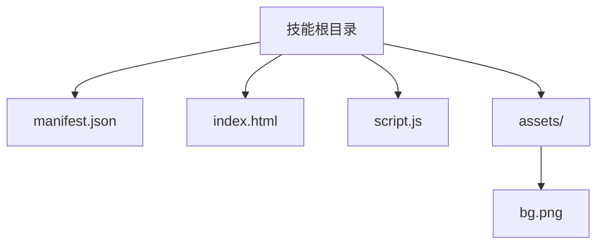
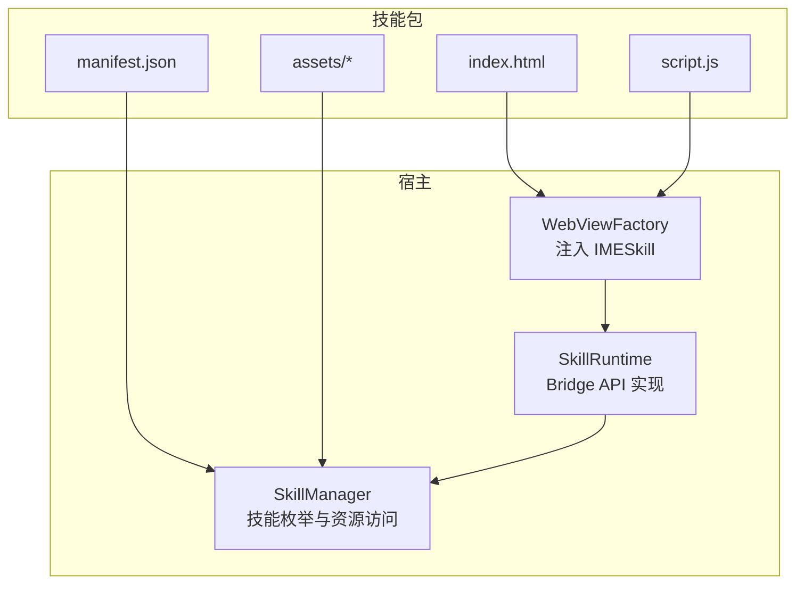
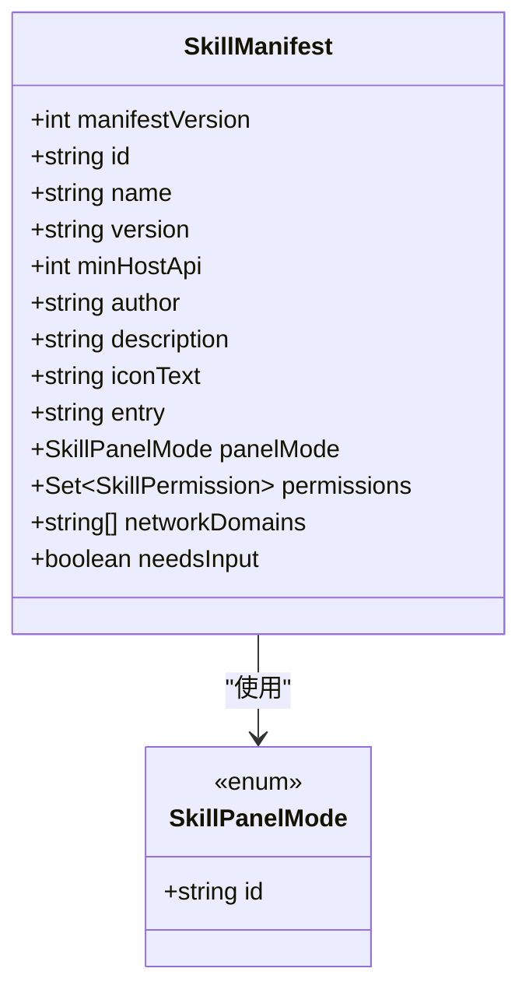
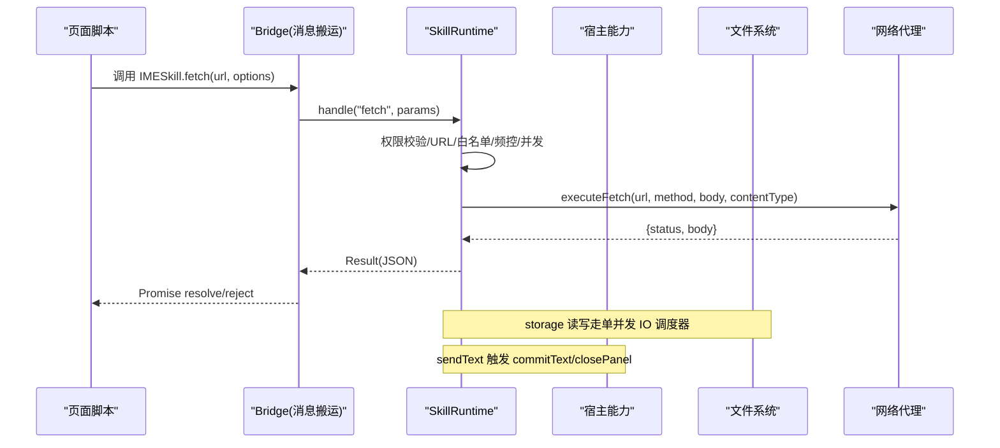
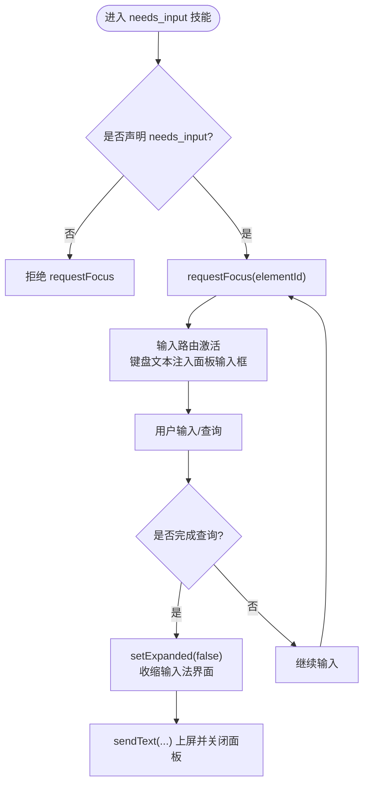
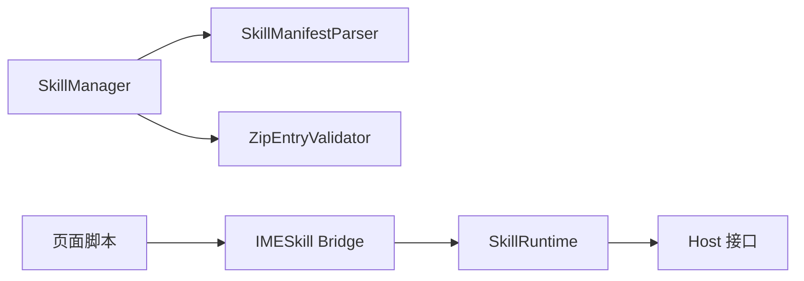

# 开发指南

<cite>
**本文引用的文件**   
- [SkillManifest.kt](file://core-logic/src/main/java/com/ziyou/ime/core/skill/SkillManifest.kt)
- [SkillManifestValidator.kt](file://core-logic/src/main/java/com/ziyou/ime/core/skill/SkillManifestValidator.kt)
- [SkillPermission.kt](file://core-logic/src/main/java/com/ziyou/ime/core/skill/SkillPermission.kt)
- [SkillManager.kt](file://app/src/main/java/com/ziyou/ime/skill/SkillManager.kt)
- [SkillRuntime.kt](file://app/src/main/java/com/ziyou/ime/skill/SkillRuntime.kt)
- [manifest.json（计算器）](file://app/src/main/assets/skills/calculator/manifest.json)
- [index.html（计算器）](file://app/src/main/assets/skills/calculator/index.html)
- [manifest.json（天气）](file://app/src/main/assets/skills/weather/manifest.json)
- [index.html（天气）](file://app/src/main/assets/skills/weather/index.html)
- [manifest.json（星座）](file://skills-dev/com.user.constellation/manifest.json)
- [index.html（星座）](file://skills-dev/com.user.constellation/index.html)
- [script.js（星座）](file://skills-dev/com.user.constellation/script.js)
</cite>

## 目录
1. [简介](#简介)
2. [项目结构](#项目结构)
3. [核心组件](#核心组件)
4. [架构总览](#架构总览)
5. [详细组件分析](#详细组件分析)
6. [依赖关系分析](#依赖关系分析)
7. [性能考量](#性能考量)
8. [故障排查指南](#故障排查指南)
9. [结论](#结论)
10. [附录](#附录)

## 简介
本指南面向技能插件开发者，系统讲解字由输入法技能插件的完整开发流程与最佳实践。内容涵盖：
- 技能包结构与 manifest.json 字段规范
- HTML/CSS/JavaScript 组织与资源管理
- SkillManifest 配置项含义、权限模型与版本控制
- IMESkill Bridge API 使用教程（storage、fetch、剪贴板、输入路由、图片输出等）
- 开发环境搭建、调试与打包发布流程
- 完整示例：计算器、天气查询、星座运势
- 性能优化、错误处理与用户体验设计建议
- 常见问题排查与故障排除

## 项目结构
一个技能插件是一个目录（分发时打包为 .skill 后缀的 zip），典型结构如下：
- manifest.json：技能元数据（必需）
- index.html：入口 UI 文件（必需，文件名可自定义，manifest.entry 指定）
- script.js：逻辑代码（可选，也可直接内联在 html 中）
- assets/：图片等静态资源（可选）

约束要点：
- 包体大小与条目数限制
- 所有文件路径必须是包内相对路径，禁止 ../、绝对路径、反斜杠
- 页面内引用资源一律用相对路径；外部 URL 会被宿主拦截为空响应

[本节为概念性说明，不直接分析具体文件]

## 核心组件
- SkillManifest：技能包元数据的数据模型，对应 manifest.json 解析结果
- SkillManifestValidator：校验 manifest 字段合法性（格式、长度、域名白名单、权限等）
- SkillPermission：权限枚举（network、clipboard_read/write、storage、image）
- SkillManager：列举内置与已安装技能，统一资源读取入口
- SkillRuntime：Bridge API 能力实现层（权限检查、storage 限额、fetch 代理、剪贴板、输入路由、图片输出）

**章节来源**
- [SkillManifest.kt:1-51](file://core-logic/src/main/java/com/ziyou/ime/core/skill/SkillManifest.kt#L1-L51)
- [SkillManifestValidator.kt:1-78](file://core-logic/src/main/java/com/ziyou/ime/core/skill/SkillManifestValidator.kt#L1-L78)
- [SkillPermission.kt:1-27](file://core-logic/src/main/java/com/ziyou/ime/core/skill/SkillPermission.kt#L1-L27)
- [SkillManager.kt:1-110](file://app/src/main/java/com/ziyou/ime/skill/SkillManager.kt#L1-L110)
- [SkillRuntime.kt:1-521](file://app/src/main/java/com/ziyou/ime/skill/SkillRuntime.kt#L1-L521)

## 架构总览
技能插件运行于宿主 WebView 中，通过 Bridge 与宿主通信。宿主负责：
- 技能发现与加载（扫描 assets/skills 与 files/skills）
- manifest 解析与校验
- 权限检查与安全策略（网络白名单、CSP、存储限额）
- 输入路由与面板布局切换（needs_input 提升挂载）
- 资源访问与请求代理（fetch）

**图表来源**
- [SkillManager.kt:1-110](file://app/src/main/java/com/ziyou/ime/skill/SkillManager.kt#L1-L110)
- [SkillRuntime.kt:1-521](file://app/src/main/java/com/ziyou/ime/skill/SkillRuntime.kt#L1-L521)

**章节来源**
- [SkillManager.kt:1-110](file://app/src/main/java/com/ziyou/ime/skill/SkillManager.kt#L1-L110)
- [SkillRuntime.kt:1-521](file://app/src/main/java/com/ziyou/ime/skill/SkillRuntime.kt#L1-L521)

## 详细组件分析

### manifest.json 字段详解与校验规则
- manifest_version：固定为 1
- id：反向域名风格，全小写，至少两段，字母开头，≤100 字符
- name：展示名，非空且 ≤30 字符
- version：数字点分（如 1.0.0）
- min_host_api：最低宿主 API 版本（当前 v4）
- author/description/icon_text：可选
- entry：入口文件相对路径，必须以 .html 结尾
- panel_mode：embed 或 card
- permissions：权限数组（未知 id 整包拒绝）
- network_domains：域名白名单（≤10 个，仅声明 network 时允许非空）
- needs_input：是否需要面板内文本输入（true 时提升至编码区上方）

校验器会逐项验证并返回错误列表，非法技能不会出现在列表中。

**章节来源**
- [SkillManifestValidator.kt:1-78](file://core-logic/src/main/java/com/ziyou/ime/core/skill/SkillManifestValidator.kt#L1-L78)
- [manifest.json（计算器）:1-14](file://app/src/main/assets/skills/calculator/manifest.json#L1-L14)
- [manifest.json（天气）:1-16](file://app/src/main/assets/skills/weather/manifest.json#L1-L16)
- [manifest.json（星座）:1-15](file://skills-dev/com.user.constellation/manifest.json#L1-L15)

### SkillManifest 数据模型与面板形态
- 字段包括 manifestVersion、id、name、version、minHostApi、author、description、iconText、entry、panelMode、permissions、networkDomains、needsInput
- 面板形态：embed（工具嵌入）、card（信息卡片，点击上屏后收起）

**图表来源**
- [SkillManifest.kt:1-51](file://core-logic/src/main/java/com/ziyou/ime/core/skill/SkillManifest.kt#L1-L51)

**章节来源**
- [SkillManifest.kt:1-51](file://core-logic/src/main/java/com/ziyou/ime/core/skill/SkillManifest.kt#L1-L51)

### 权限模型与能力矩阵
- storage：轻量 KV 持久化（每技能独立空间，总量 1MB）
- network：经宿主代理的网络请求（强制 HTTPS、白名单、频控并发限制）
- clipboard_read / clipboard_write：读/写剪贴板（需对应权限）
- image：图片输出（send/saveToGallery，仅 PNG，Android 10+ 支持相册写入）

未声明权限调用对应 API 将 reject 并提示“权限拒绝”。

**章节来源**
- [SkillPermission.kt:1-27](file://core-logic/src/main/java/com/ziyou/ime/core/skill/SkillPermission.kt#L1-L27)
- [SkillRuntime.kt:1-521](file://app/src/main/java/com/ziyou/ime/skill/SkillRuntime.kt#L1-L521)

### 技能管理器与资源访问
- listSkills：列出内置与已安装技能（按名称稳定排序）
- openResource：统一打开技能包内相对路径对应的资源流（内置 assets 与用户安装 files 双源）
- installRoot：用户安装技能的内部存储根目录

安全纵深防御：canonicalPath 必须落在安装目录内，防止 Zip Slip。

**章节来源**
- [SkillManager.kt:1-110](file://app/src/main/java/com/ziyou/ime/skill/SkillManager.kt#L1-L110)

### Bridge API 运行时（SkillRuntime）
- handle：统一调度方法分发（fetch、storage.*、image.*、同步能力）
- 同步能力：sendText、getContext、getLocale、haptic、ui.setTitle/ui.close/ui.setExpanded/ui.setPanelHeight、clipboard.read/write、input.requestFocus/releaseFocus
- 异步能力：storage.get/set/remove（单并发 IO，保证顺序）、fetch（IO 协程执行，超时/限流/并发限制）、image.send/saveToGallery（PNG 校验、commitContent 提交）

**图表来源**
- [SkillRuntime.kt:1-521](file://app/src/main/java/com/ziyou/ime/skill/SkillRuntime.kt#L1-L521)

**章节来源**
- [SkillRuntime.kt:1-521](file://app/src/main/java/com/ziyou/ime/skill/SkillRuntime.kt#L1-L521)

### 输入路由与面板布局（needs_input）
- needs_input=true：技能面板提升至编码区上方（紧凑高度约键盘 60%），下方键盘可用
- input.requestFocus(elementId)：把键盘上屏文本改道注入面板输入框
- input.releaseFocus()：恢复直达宿主应用编辑框
- ui.setExpanded(false)：收缩整个输入法界面，面板接管全部空间展示长内容

**图表来源**
- [SkillRuntime.kt:1-521](file://app/src/main/java/com/ziyou/ime/skill/SkillRuntime.kt#L1-L521)

**章节来源**
- [SkillRuntime.kt:1-521](file://app/src/main/java/com/ziyou/ime/skill/SkillRuntime.kt#L1-L521)

### 示例一：计算器（embed 模式，零权限）
- 特点：纯本地计算、无网络、无需权限
- 关键交互：按钮操作、实时预览、一键上屏
- 沙箱约束：禁用 eval/new Function，采用双栈算符优先求值

**章节来源**
- [manifest.json（计算器）:1-14](file://app/src/main/assets/skills/calculator/manifest.json#L1-L14)
- [index.html（计算器）:1-202](file://app/src/main/assets/skills/calculator/index.html#L1-L202)

### 示例二：天气查询（card 模式，network + storage）
- 特点：使用 fetch 代理访问 wttr.in，storage 记忆常用城市
- 交互：预设城市快捷片，点击结果上屏并自动收起面板
- 安全：域名白名单、HTTPS 强制、频控并发限制

**章节来源**
- [manifest.json（天气）:1-16](file://app/src/main/assets/skills/weather/manifest.json#L1-L16)
- [index.html（天气）:1-125](file://app/src/main/assets/skills/weather/index.html#L1-L125)

### 示例三：星座查询（needs_input + 输入路由 + setExpanded）
- 特点：离线数据、输入路由、查询历史（storage）、结果发送
- 四阶段：输入 → 查询 → 展示（收缩界面）→ 发送
- 别名归一：支持多种星座别称映射

**章节来源**
- [manifest.json（星座）:1-15](file://skills-dev/com.user.constellation/manifest.json#L1-L15)
- [index.html（星座）:1-68](file://skills-dev/com.user.constellation/index.html#L1-L68)
- [script.js（星座）:1-220](file://skills-dev/com.user.constellation/script.js#L1-L220)

## 依赖关系分析
- SkillManager 依赖 SkillManifestParser（解析 manifest）与 ZipEntryValidator（路径安全校验）
- SkillRuntime 依赖 Host 接口（文本上屏、面板控制、输入路由、图片提交）
- 技能页面依赖 IMESkill Bridge API（宿主注入的全局对象）

**图表来源**
- [SkillManager.kt:1-110](file://app/src/main/java/com/ziyou/ime/skill/SkillManager.kt#L1-L110)
- [SkillRuntime.kt:1-521](file://app/src/main/java/com/ziyou/ime/skill/SkillRuntime.kt#L1-L521)

**章节来源**
- [SkillManager.kt:1-110](file://app/src/main/java/com/ziyou/ime/skill/SkillManager.kt#L1-L110)
- [SkillRuntime.kt:1-521](file://app/src/main/java/com/ziyou/ime/skill/SkillRuntime.kt#L1-L521)

## 性能考量
- storage 使用单并发 IO 调度器，避免主线程阻塞，保证 set/remove 顺序
- fetch 频控（≤30 次/分钟）、并发（≤2）、超时（10s）、响应体积（≤1MB）
- 图片输出仅接受 PNG，避免大体积 base64 导致消息超限（512KB）
- 面板布局高度守恒，避免频繁重排与重绘
- 资源加载使用相对路径，减少跨域与额外开销

[本节提供通用指导，不直接分析具体文件]

## 故障排查指南
常见错误与定位：
- manifest 校验失败：查看 logcat tag `SkillManager`，检查 id/name/version/entry/permissions/network_domains
- 权限拒绝：确认 manifest.permissions 是否包含所需权限
- fetch 失败：检查域名白名单、HTTPS、频控/并发限制、网络状态
- storage 超限：序列化后超过 1MB，精简数据或分批存储
- 输入路由不可用：确认 manifest.needs_input 为 true，正确调用 requestFocus/releaseFocus
- 图片发送失败：确认编辑器接受 image 类型，Android 版本≥10（保存相册）

调试技巧：
- 浏览器预调：添加 mock 垫片模拟 IMESkill
- 真机调试：Chrome DevTools 远程调试 WebView
- 日志抓取：adb logcat -s SkillManager SkillBridge SkillRuntime SkillWebViewFactory SkillPackageInstaller

**章节来源**
- [SkillManager.kt:1-110](file://app/src/main/java/com/ziyou/ime/skill/SkillManager.kt#L1-L110)
- [SkillRuntime.kt:1-521](file://app/src/main/java/com/ziyou/ime/skill/SkillRuntime.kt#L1-L521)

## 结论
本指南系统阐述了技能插件的开发全流程，从项目结构、manifest 规范、权限模型到 Bridge API 使用与示例实现。遵循安全机制与最佳实践，可有效提升技能质量与用户体验。建议在开发过程中充分利用调试工具与日志，确保问题快速定位与解决。

[本节为总结性内容，不直接分析具体文件]

## 附录
- 开发环境搭建：使用本地浏览器预调 + 真机调试（Chrome DevTools）
- 打包发布：zip 压缩为 .skill，确保 manifest.json 在包根
- 开发者侧载：adb push/run-as 快速迭代
- 图形化导入：设置页 → 技能插件 → 导入 .skill 文件或 URL

[本节为补充说明，不直接分析具体文件]