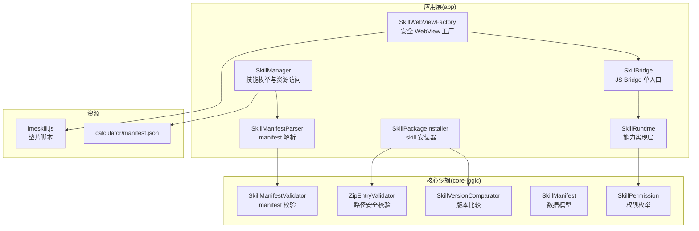
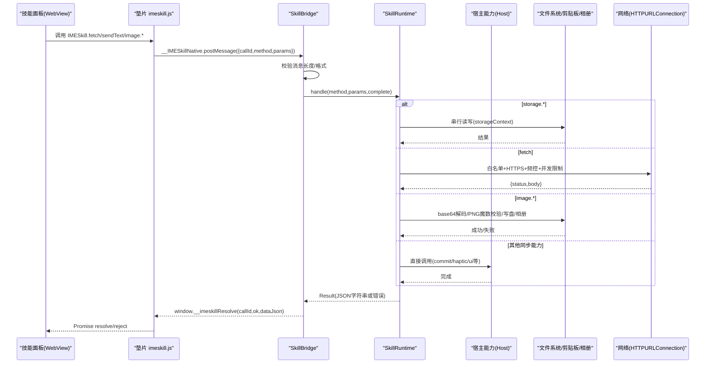
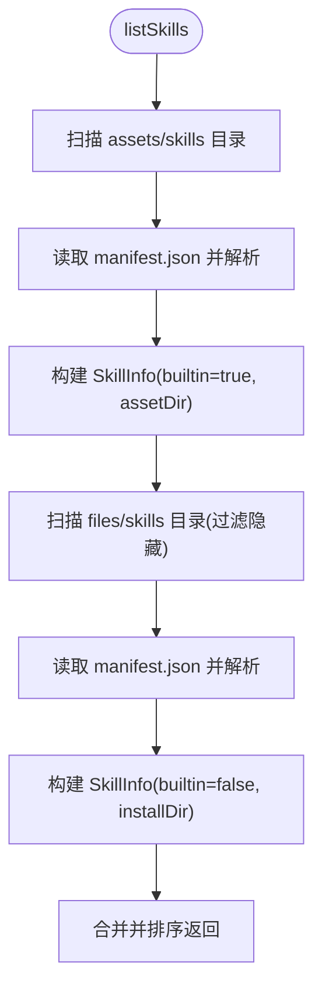
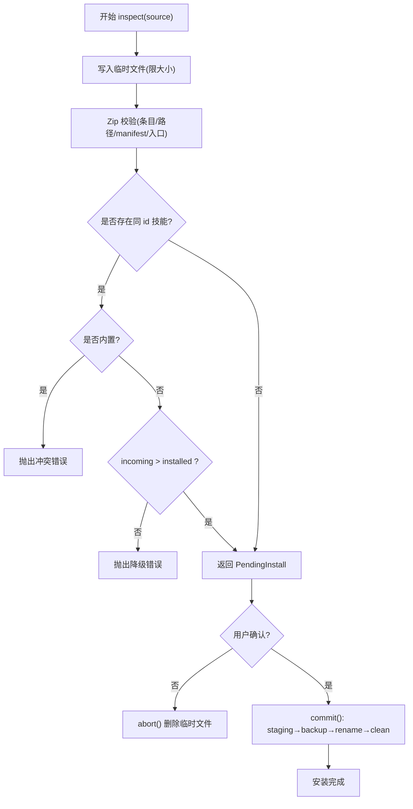
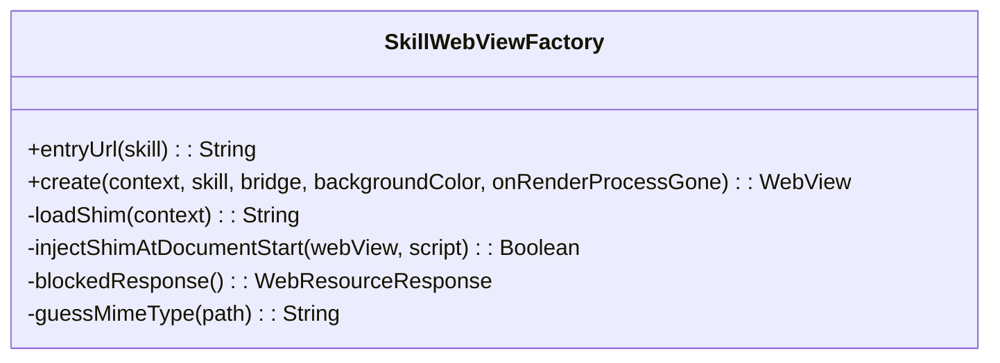
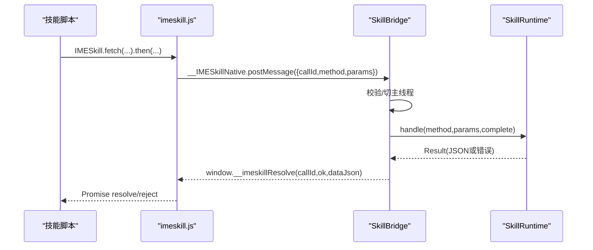
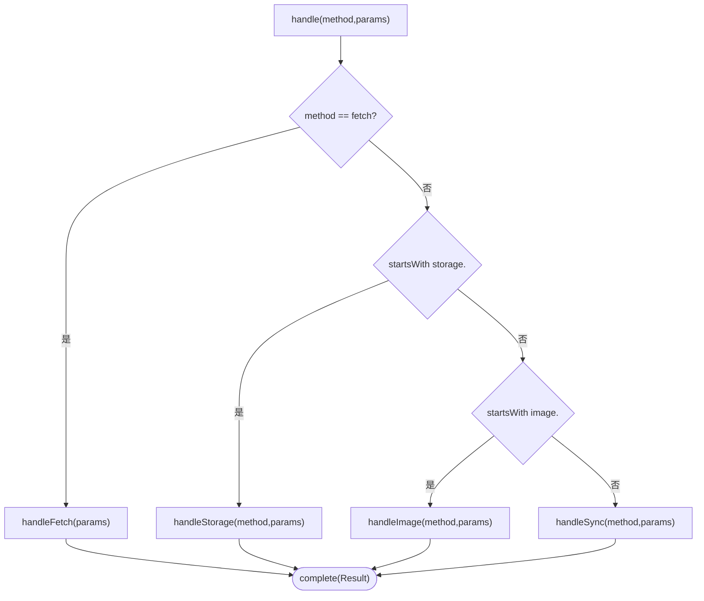
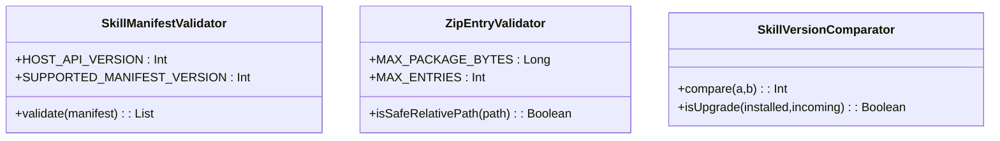
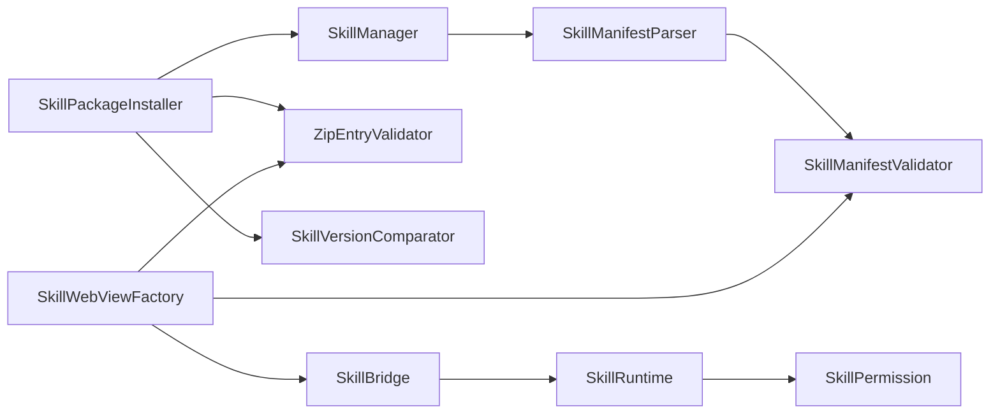

# 技能插件系统

<cite>
**本文引用的文件**   
- [SkillManager.kt](file://app/src/main/java/com/ziyou/ime/skill/SkillManager.kt)
- [SkillPackageInstaller.kt](file://app/src/main/java/com/ziyou/ime/skill/SkillPackageInstaller.kt)
- [SkillWebViewFactory.kt](file://app/src/main/java/com/ziyou/ime/skill/SkillWebViewFactory.kt)
- [SkillBridge.kt](file://app/src/main/java/com/ziyou/ime/skill/SkillBridge.kt)
- [SkillRuntime.kt](file://app/src/main/java/com/ziyou/ime/skill/SkillRuntime.kt)
- [SkillManifestParser.kt](file://app/src/main/java/com/ziyou/ime/skill/SkillManifestParser.kt)
- [SkillManifestValidator.kt](file://core-logic/src/main/java/com/ziyou/ime/core/skill/SkillManifestValidator.kt)
- [ZipEntryValidator.kt](file://core-logic/src/main/java/com/ziyou/ime/core/skill/ZipEntryValidator.kt)
- [SkillVersionComparator.kt](file://core-logic/src/main/java/com/ziyou/ime/core/skill/SkillVersionComparator.kt)
- [SkillManifest.kt](file://core-logic/src/main/java/com/ziyou/ime/core/skill/SkillManifest.kt)
- [SkillPermission.kt](file://core-logic/src/main/java/com/ziyou/ime/core/skill/SkillPermission.kt)
- [imeskill.js](file://app/src/main/assets/skill_runtime/imeskill.js)
- [calculator manifest.json](file://app/src/main/assets/skills/calculator/manifest.json)
</cite>

## 目录
1. [简介](#简介)
2. [项目结构](#项目结构)
3. [核心组件](#核心组件)
4. [架构总览](#架构总览)
5. [详细组件分析](#详细组件分析)
6. [依赖关系分析](#依赖关系分析)
7. [性能考量](#性能考量)
8. [故障排查指南](#故障排查指南)
9. [结论](#结论)
10. [附录：技能开发指南](#附录技能开发指南)

## 简介
本技术文档围绕“基于 WebView 沙箱的可扩展技能面板”展开，系统性阐述以下能力与实现：
- SkillManager 的插件扫描与加载机制（内置 assets 与用户安装 files）
- SkillPackageInstaller 的 .skill 包安装流水线（两段式、原子替换、回滚）
- SkillWebViewFactory 的安全 WebView 工厂（资源拦截、CSP、进程崩溃兜底）
- SkillBridge 的 JS Bridge 通信机制（单入口 postMessage、Promise 异步、异常处理）
- SkillRuntime 的能力实现层（权限检查、storage 串行 IO、fetch 代理网络请求、剪贴板、图片输出、输入路由）
- core-logic 纯校验逻辑（SkillManifestValidator、ZipEntryValidator、SkillVersionComparator）
- 技能开发指南（manifest.json 配置、JavaScript API 使用与安全最佳实践）

## 项目结构
技能插件系统由 app 层运行时与 core-logic 纯逻辑模块组成。app 层负责 Android 平台集成、WebView 安全隔离、桥接与运行时；core-logic 提供无平台依赖的校验与比较工具。

图表来源 
- [SkillManager.kt:1-110](file://app/src/main/java/com/ziyou/ime/skill/SkillManager.kt#L1-L110)
- [SkillPackageInstaller.kt:1-194](file://app/src/main/java/com/ziyou/ime/skill/SkillPackageInstaller.kt#L1-L194)
- [SkillWebViewFactory.kt:1-205](file://app/src/main/java/com/ziyou/ime/skill/SkillWebViewFactory.kt#L1-L205)
- [SkillBridge.kt:1-99](file://app/src/main/java/com/ziyou/ime/skill/SkillBridge.kt#L1-L99)
- [SkillRuntime.kt:1-521](file://app/src/main/java/com/ziyou/ime/skill/SkillRuntime.kt#L1-L521)
- [SkillManifestParser.kt:1-73](file://app/src/main/java/com/ziyou/ime/skill/SkillManifestParser.kt#L1-L73)
- [SkillManifestValidator.kt:1-78](file://core-logic/src/main/java/com/ziyou/ime/core/skill/SkillManifestValidator.kt#L1-L78)
- [ZipEntryValidator.kt:1-37](file://core-logic/src/main/java/com/ziyou/ime/core/skill/ZipEntryValidator.kt#L1-L37)
- [SkillVersionComparator.kt:1-30](file://core-logic/src/main/java/com/ziyou/ime/core/skill/SkillVersionComparator.kt#L1-L30)
- [SkillManifest.kt:1-51](file://core-logic/src/main/java/com/ziyou/ime/core/skill/SkillManifest.kt#L1-L51)
- [SkillPermission.kt:1-27](file://core-logic/src/main/java/com/ziyou/ime/core/skill/SkillPermission.kt#L1-L27)
- [imeskill.js:1-164](file://app/src/main/assets/skill_runtime/imeskill.js#L1-L164)
- [calculator manifest.json:1-14](file://app/src/main/assets/skills/calculator/manifest.json#L1-L14)

章节来源
- [SkillManager.kt:1-110](file://app/src/main/java/com/ziyou/ime/skill/SkillManager.kt#L1-L110)
- [SkillPackageInstaller.kt:1-194](file://app/src/main/java/com/ziyou/ime/skill/SkillPackageInstaller.kt#L1-L194)
- [SkillWebViewFactory.kt:1-205](file://app/src/main/java/com/ziyou/ime/skill/SkillWebViewFactory.kt#L1-L205)
- [SkillBridge.kt:1-99](file://app/src/main/java/com/ziyou/ime/skill/SkillBridge.kt#L1-L99)
- [SkillRuntime.kt:1-521](file://app/src/main/java/com/ziyou/ime/skill/SkillRuntime.kt#L1-L521)
- [SkillManifestParser.kt:1-73](file://app/src/main/java/com/ziyou/ime/skill/SkillManifestParser.kt#L1-L73)
- [SkillManifestValidator.kt:1-78](file://core-logic/src/main/java/com/ziyou/ime/core/skill/SkillManifestValidator.kt#L1-L78)
- [ZipEntryValidator.kt:1-37](file://core-logic/src/main/java/com/ziyou/ime/core/skill/ZipEntryValidator.kt#L1-L37)
- [SkillVersionComparator.kt:1-30](file://core-logic/src/main/java/com/ziyou/ime/core/skill/SkillVersionComparator.kt#L1-L30)
- [SkillManifest.kt:1-51](file://core-logic/src/main/java/com/ziyou/ime/core/skill/SkillManifest.kt#L1-L51)
- [SkillPermission.kt:1-27](file://core-logic/src/main/java/com/ziyou/ime/core/skill/SkillPermission.kt#L1-L27)
- [imeskill.js:1-164](file://app/src/main/assets/skill_runtime/imeskill.js#L1-L164)
- [calculator manifest.json:1-14](file://app/src/main/assets/skills/calculator/manifest.json#L1-L14)

## 核心组件
- SkillManager：统一枚举内置与已安装技能，提供 openResource 按相对路径读取资源（assets 或内部存储），并过滤非法 manifest。
- SkillPackageInstaller：两段式安装（inspect → commit/abort），包含包体大小限制、条目数限制、Zip Slip 防护、manifest 校验、冲突与升级判定、原子替换与回滚。
- SkillWebViewFactory：创建安全 WebView，全量资源拦截仅放行虚拟域名下的技能包内资源，附加 CSP，禁用文件/内容访问，注入垫片脚本，渲染进程崩溃兜底。
- SkillBridge：JS Bridge 单入口 __IMESkillNative.postMessage，消息长度限制，主线程分发，Promise 异步回调，异常统一包装为错误对象。
- SkillRuntime：承载所有宿主能力（sendText、getContext、getLocale、haptic、ui.*、clipboard.*、input.*、image.*、storage.*、fetch），权限检查、限额控制、串行 storage IO、网络白名单与频控。
- core-logic 校验器：SkillManifestValidator（字段合法性）、ZipEntryValidator（路径安全）、SkillVersionComparator（版本比较）。

章节来源
- [SkillManager.kt:1-110](file://app/src/main/java/com/ziyou/ime/skill/SkillManager.kt#L1-L110)
- [SkillPackageInstaller.kt:1-194](file://app/src/main/java/com/ziyou/ime/skill/SkillPackageInstaller.kt#L1-L194)
- [SkillWebViewFactory.kt:1-205](file://app/src/main/java/com/ziyou/ime/skill/SkillWebViewFactory.kt#L1-L205)
- [SkillBridge.kt:1-99](file://app/src/main/java/com/ziyou/ime/skill/SkillBridge.kt#L1-L99)
- [SkillRuntime.kt:1-521](file://app/src/main/java/com/ziyou/ime/skill/SkillRuntime.kt#L1-L521)
- [SkillManifestValidator.kt:1-78](file://core-logic/src/main/java/com/ziyou/ime/core/skill/SkillManifestValidator.kt#L1-L78)
- [ZipEntryValidator.kt:1-37](file://core-logic/src/main/java/com/ziyou/ime/core/skill/ZipEntryValidator.kt#L1-L37)
- [SkillVersionComparator.kt:1-30](file://core-logic/src/main/java/com/ziyou/ime/core/skill/SkillVersionComparator.kt#L1-L30)

## 架构总览
技能面板运行在受控 WebView 中，通过 Bridge 与宿主通信，所有能力经 Runtime 授权与限流，安装包经 Installer 严格校验与原子部署。

图表来源 
- [SkillWebViewFactory.kt:1-205](file://app/src/main/java/com/ziyou/ime/skill/SkillWebViewFactory.kt#L1-L205)
- [SkillBridge.kt:1-99](file://app/src/main/java/com/ziyou/ime/skill/SkillBridge.kt#L1-L99)
- [SkillRuntime.kt:1-521](file://app/src/main/java/com/ziyou/ime/skill/SkillRuntime.kt#L1-L521)
- [imeskill.js:1-164](file://app/src/main/assets/skill_runtime/imeskill.js#L1-L164)

## 详细组件分析

### SkillManager：插件扫描与加载
- 列举内置技能（assets/skills/<dir>/manifest.json）与已安装技能（files/skills/<id>/manifest.json），合并并按名称稳定排序。
- openResource 根据 builtin 标志选择 assets.open 或 File 输入流，并对非内置场景进行 canonicalPath 前缀校验以防御 Zip Slip。
- 解析 manifest 失败记录日志并跳过该技能，保证整体可用性。

图表来源 
- [SkillManager.kt:1-110](file://app/src/main/java/com/ziyou/ime/skill/SkillManager.kt#L1-L110)

章节来源
- [SkillManager.kt:1-110](file://app/src/main/java/com/ziyou/ime/skill/SkillManager.kt#L1-L110)

### SkillPackageInstaller：.skill 包安装流水线
- inspect：拷贝到临时文件，边拷边限制包大小；Zip 结构校验（条目数、路径安全、manifest 存在性与入口文件存在性）；冲突与升级判定（内置不可覆盖，同 id 必须更高版本）。
- commit：解压到 staging → 旧版移至 .backup → staging 重命名就位 → 成功后删除备份；失败则恢复旧版，避免“卸载式升级”。
- abort：清理临时包体。
- uninstall：删除安装目录并清理对应 storage 数据。

图表来源 
- [SkillPackageInstaller.kt:1-194](file://app/src/main/java/com/ziyou/ime/skill/SkillPackageInstaller.kt#L1-L194)
- [ZipEntryValidator.kt:1-37](file://core-logic/src/main/java/com/ziyou/ime/core/skill/ZipEntryValidator.kt#L1-L37)
- [SkillVersionComparator.kt:1-30](file://core-logic/src/main/java/com/ziyou/ime/core/skill/SkillVersionComparator.kt#L1-L30)

章节来源
- [SkillPackageInstaller.kt:1-194](file://app/src/main/java/com/ziyou/ime/skill/SkillPackageInstaller.kt#L1-L194)
- [ZipEntryValidator.kt:1-37](file://core-logic/src/main/java/com/ziyou/ime/core/skill/ZipEntryValidator.kt#L1-L37)
- [SkillVersionComparator.kt:1-30](file://core-logic/src/main/java/com/ziyou/ime/core/skill/SkillVersionComparator.kt#L1-L30)

### SkillWebViewFactory：安全 WebView 工厂
- 虚拟域名与路径前缀：仅允许 appassets.androidplatform.net/skill/... 的请求映射到技能包内资源。
- 资源拦截：HTML 响应附加 CSP（default-src 'self'，script/style 允许内联，img 允许 data，connect-src 'none'），其余一律空响应。
- 安全设置：关闭文件/内容访问、DOM Storage、定位、多窗口、自动打开窗口；按需开启远程调试（debuggable）。
- 垫片注入：优先 DOCUMENT_START_SCRIPT，不支持时回退 onPageStarted；首帧提交前隐藏 WebView 防黑屏闪烁。
- 崩溃兜底：onRenderProcessGone 销毁面板，确保 IME 主进程存活。

图表来源 
- [SkillWebViewFactory.kt:1-205](file://app/src/main/java/com/ziyou/ime/skill/SkillWebViewFactory.kt#L1-L205)

章节来源
- [SkillWebViewFactory.kt:1-205](file://app/src/main/java/com/ziyou/ime/skill/SkillWebViewFactory.kt#L1-L205)

### SkillBridge：JS Bridge 通信机制
- 单入口：__IMESkillNative.postMessage(json)，消息长度上限 512KB。
- 线程模型：WebView JavaBridge 线程接收，立即切主线程 Handler 分发。
- 协议：{callId, method, params}，宿主通过 evaluateJavascript("window.__imeskillResolve(...)") 异步 resolve/reject。
- 异常处理：SkillApiException 透传 message，未预期异常统一包装为“内部错误”，确保技能崩溃不波及宿主。

图表来源 
- [SkillBridge.kt:1-99](file://app/src/main/java/com/ziyou/ime/skill/SkillBridge.kt#L1-L99)
- [imeskill.js:1-164](file://app/src/main/assets/skill_runtime/imeskill.js#L1-L164)

章节来源
- [SkillBridge.kt:1-99](file://app/src/main/java/com/ziyou/ime/skill/SkillBridge.kt#L1-L99)
- [imeskill.js:1-164](file://app/src/main/assets/skill_runtime/imeskill.js#L1-L164)

### SkillRuntime：能力实现层
- 权限模型：每个方法前置 requirePermission(SkillPermission.*)，未声明即拒绝。
- storage：KV 持久化，单技能独立 JSON 文件，序列化后 1MB 上限；storageContext 单并发 IO 保证 set/remove 顺序。
- fetch：强制 HTTPS、manifest.networkDomains 精确匹配（IDN/punycode 归一化）、超时 10s、响应 ≤1MB、频控 30 次/分钟、并发 ≤2、禁止跟随重定向。
- image：base64 PNG 魔数校验，发送经 commitContent 到宿主编辑器，保存至相册（Android 10+）。
- clipboard：读/写剪贴板需对应权限。
- ui：setTitle/close/setExpanded/setPanelHeight（ratio 钳制）。
- input：requestFocus/releaseFocus（需 needs_input）。
- sendText：文本上屏并关闭面板，若输入路由激活先复位。
- 生命周期：release() 取消协程域，避免泄漏。

图表来源 
- [SkillRuntime.kt:1-521](file://app/src/main/java/com/ziyou/ime/skill/SkillRuntime.kt#L1-L521)

章节来源
- [SkillRuntime.kt:1-521](file://app/src/main/java/com/ziyou/ime/skill/SkillRuntime.kt#L1-L521)

### core-logic 纯校验逻辑
- SkillManifestValidator：校验 manifest_version、id/name/version/minHostApi/entry/network_domains/permissions 等字段，返回错误列表。
- ZipEntryValidator：isSafeRelativePath 防御 Zip Slip，限制路径长度与字符集。
- SkillVersionComparator：点分数字比较，isUpgrade 严格大于才允许升级。

图表来源 
- [SkillManifestValidator.kt:1-78](file://core-logic/src/main/java/com/ziyou/ime/core/skill/SkillManifestValidator.kt#L1-L78)
- [ZipEntryValidator.kt:1-37](file://core-logic/src/main/java/com/ziyou/ime/core/skill/ZipEntryValidator.kt#L1-L37)
- [SkillVersionComparator.kt:1-30](file://core-logic/src/main/java/com/ziyou/ime/core/skill/SkillVersionComparator.kt#L1-L30)

章节来源
- [SkillManifestValidator.kt:1-78](file://core-logic/src/main/java/com/ziyou/ime/core/skill/SkillManifestValidator.kt#L1-L78)
- [ZipEntryValidator.kt:1-37](file://core-logic/src/main/java/com/ziyou/ime/core/skill/ZipEntryValidator.kt#L1-L37)
- [SkillVersionComparator.kt:1-30](file://core-logic/src/main/java/com/ziyou/ime/core/skill/SkillVersionComparator.kt#L1-L30)

## 依赖关系分析
- SkillManager 依赖 SkillManifestParser 与 SkillManifestValidator（解析与校验）。
- SkillPackageInstaller 依赖 ZipEntryValidator、SkillVersionComparator 与 SkillManager（冲突检测）。
- SkillWebViewFactory 依赖 SkillBridge、ZipEntryValidator、SkillManifestValidator（垫片 apiVersion 宏替换）。
- SkillBridge 依赖 SkillRuntime 与 WebView 提供者。
- SkillRuntime 依赖 SkillPermission、宿主 Host 接口、系统服务（剪贴板、相册、输入框）。
- core-logic 模块被 app 层多处引用，保持纯逻辑可测试性。

图表来源 
- [SkillManager.kt:1-110](file://app/src/main/java/com/ziyou/ime/skill/SkillManager.kt#L1-L110)
- [SkillPackageInstaller.kt:1-194](file://app/src/main/java/com/ziyou/ime/skill/SkillPackageInstaller.kt#L1-L194)
- [SkillWebViewFactory.kt:1-205](file://app/src/main/java/com/ziyou/ime/skill/SkillWebViewFactory.kt#L1-L205)
- [SkillBridge.kt:1-99](file://app/src/main/java/com/ziyou/ime/skill/SkillBridge.kt#L1-L99)
- [SkillRuntime.kt:1-521](file://app/src/main/java/com/ziyou/ime/skill/SkillRuntime.kt#L1-L521)
- [SkillManifestParser.kt:1-73](file://app/src/main/java/com/ziyou/ime/skill/SkillManifestParser.kt#L1-L73)
- [SkillManifestValidator.kt:1-78](file://core-logic/src/main/java/com/ziyou/ime/core/skill/SkillManifestValidator.kt#L1-L78)
- [ZipEntryValidator.kt:1-37](file://core-logic/src/main/java/com/ziyou/ime/core/skill/ZipEntryValidator.kt#L1-L37)
- [SkillVersionComparator.kt:1-30](file://core-logic/src/main/java/com/ziyou/ime/core/skill/SkillVersionComparator.kt#L1-L30)
- [SkillPermission.kt:1-27](file://core-logic/src/main/java/com/ziyou/ime/core/skill/SkillPermission.kt#L1-L27)

章节来源
- [SkillManager.kt:1-110](file://app/src/main/java/com/ziyou/ime/skill/SkillManager.kt#L1-L110)
- [SkillPackageInstaller.kt:1-194](file://app/src/main/java/com/ziyou/ime/skill/SkillPackageInstaller.kt#L1-L194)
- [SkillWebViewFactory.kt:1-205](file://app/src/main/java/com/ziyou/ime/skill/SkillWebViewFactory.kt#L1-L205)
- [SkillBridge.kt:1-99](file://app/src/main/java/com/ziyou/ime/skill/SkillBridge.kt#L1-L99)
- [SkillRuntime.kt:1-521](file://app/src/main/java/com/ziyou/ime/skill/SkillRuntime.kt#L1-L521)
- [SkillManifestParser.kt:1-73](file://app/src/main/java/com/ziyou/ime/skill/SkillManifestParser.kt#L1-L73)
- [SkillManifestValidator.kt:1-78](file://core-logic/src/main/java/com/ziyou/ime/core/skill/SkillManifestValidator.kt#L1-L78)
- [ZipEntryValidator.kt:1-37](file://core-logic/src/main/java/com/ziyou/ime/core/skill/ZipEntryValidator.kt#L1-L37)
- [SkillVersionComparator.kt:1-30](file://core-logic/src/main/java/com/ziyou/ime/core/skill/SkillVersionComparator.kt#L1-L30)
- [SkillPermission.kt:1-27](file://core-logic/src/main/java/com/ziyou/ime/core/skill/SkillPermission.kt#L1-L27)

## 性能考量
- WebView 缓存禁用：避免本地缓存膨胀，资源从技能包直取。
- storage 串行 IO：limitedParallelism(1) 保证顺序且避免竞争。
- fetch 频控与并发限制：滑动窗口 30 次/分钟，并发 ≤2，响应 ≤1MB，超时 10s。
- 首帧可见优化：首帧前隐藏 WebView，避免硬件加速黑屏闪烁。
- 大消息保护：Bridge 单条消息 512KB 上限，防止拖垮主线程。

[本节为通用指导，无需特定文件来源]

## 故障排查指南
- 安装失败
  - 包过大/条目过多：检查 MAX_PACKAGE_BYTES/MAX_ENTRIES 限制。
  - 路径不安全：ZipEntryValidator.isSafeRelativePath 拒绝包含 .. 或绝对路径。
  - 冲突/降级：内置 id 不可覆盖；同 id 必须严格更高版本。
- WebView 无法加载资源
  - 资源路径不在虚拟域名下或被 CSP 拦截；检查 shouldInterceptRequest 与 CSP。
  - 渲染进程崩溃：onRenderProcessGone 触发，需销毁面板并重建。
- Bridge 调用失败
  - 权限不足：manifest 未声明对应权限。
  - 参数非法：如 key 为空、URL 非法、PNG 魔数不符。
  - 网络受限：非 HTTPS、域名不在白名单、频控/并发超限。
- storage 写入失败
  - 超过 1MB 序列化上限；磁盘空间不足。
- 图片输出失败
  - 当前输入框不接受图片；Android 版本低于 10 无法保存到相册。

章节来源
- [SkillPackageInstaller.kt:1-194](file://app/src/main/java/com/ziyou/ime/skill/SkillPackageInstaller.kt#L1-L194)
- [SkillWebViewFactory.kt:1-205](file://app/src/main/java/com/ziyou/ime/skill/SkillWebViewFactory.kt#L1-L205)
- [SkillBridge.kt:1-99](file://app/src/main/java/com/ziyou/ime/skill/SkillBridge.kt#L1-L99)
- [SkillRuntime.kt:1-521](file://app/src/main/java/com/ziyou/ime/skill/SkillRuntime.kt#L1-L521)

## 结论
本系统通过严格的 WebView 沙箱、两段式安装与原子替换、统一的 Bridge 协议与能力实现层，以及纯逻辑校验模块，构建了安全、可扩展、可维护的技能插件生态。开发者只需遵循 manifest 规范与 API 约定，即可快速构建安全的技能面板。

[本节为总结，无需特定文件来源]

## 附录：技能开发指南
- manifest.json 必填字段
  - manifest_version：当前支持 1
  - id：反向域名风格，至少两段，小写字母开头
  - name：展示名称（≤30 字符）
  - version：数字点分（如 1.0.0）
  - min_host_api：最低宿主 API 版本（≤当前 HOST_API_VERSION=4）
  - entry：入口 HTML 文件路径（必须以 .html 结尾）
  - panel_mode：embed 或 card
  - permissions：可选 network / clipboard_read / clipboard_write / storage / image
  - network_domains：声明 network 权限时才允许非空，域名需符合正则
  - needs_input：是否需要面板内输入路由（Phase 3）
- JavaScript API（window.IMESkill）
  - sendText(text)：上屏并关闭面板
  - getContext()：获取 packageName、inputType
  - getLocale()：语言标签（zh-CN）
  - haptic()：震动反馈
  - storage.get/set/remove(key,value)：KV 持久化（需 storage 权限）
  - ui.setTitle(title)、ui.close()、ui.setExpanded(expanded)、ui.setPanelHeight(ratio)
  - clipboard.read()、clipboard.write(text)（需对应权限）
  - input.requestFocus(fieldId)、input.releaseFocus()（需 needs_input）
  - fetch(url,options)：POST 支持 body/contentType，返回 {status,body}（需 network 权限）
  - image.send(base64)、image.saveToGallery(base64)（需 image 权限，仅 PNG）
- 安全最佳实践
  - 不要尝试绕过 CSP 或虚拟域名；所有外部资源应通过 fetch 代理。
  - 合理声明权限，最小化暴露面。
  - 对网络请求进行域名白名单管理，避免敏感信息泄露。
  - 控制消息大小与请求频率，避免性能问题。
  - 图片输出使用 PNG 并控制分辨率，避免超大消息。

章节来源
- [SkillManifestValidator.kt:1-78](file://core-logic/src/main/java/com/ziyou/ime/core/skill/SkillManifestValidator.kt#L1-L78)
- [SkillManifest.kt:1-51](file://core-logic/src/main/java/com/ziyou/ime/core/skill/SkillManifest.kt#L1-L51)
- [SkillPermission.kt:1-27](file://core-logic/src/main/java/com/ziyou/ime/core/skill/SkillPermission.kt#L1-L27)
- [imeskill.js:1-164](file://app/src/main/assets/skill_runtime/imeskill.js#L1-L164)
- [calculator manifest.json:1-14](file://app/src/main/assets/skills/calculator/manifest.json#L1-L14)