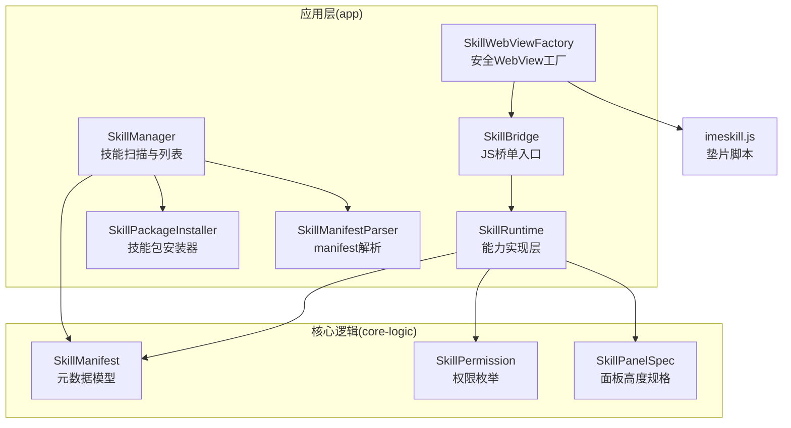
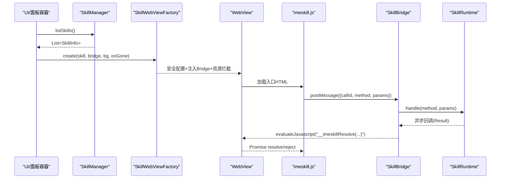
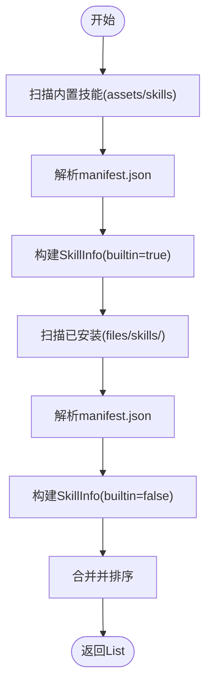
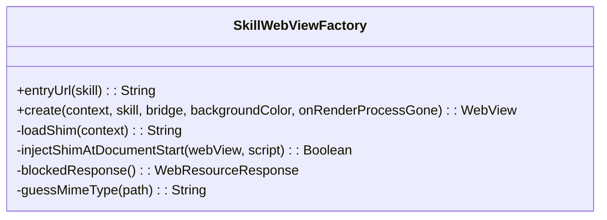
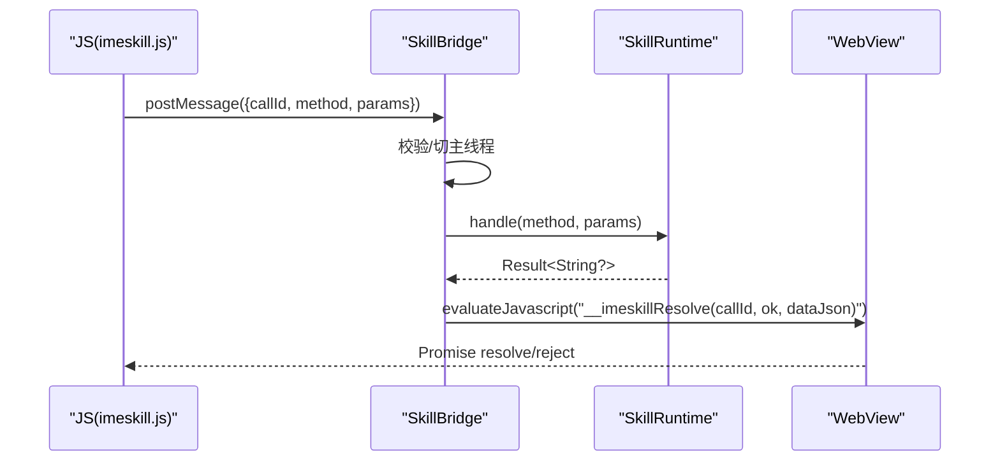
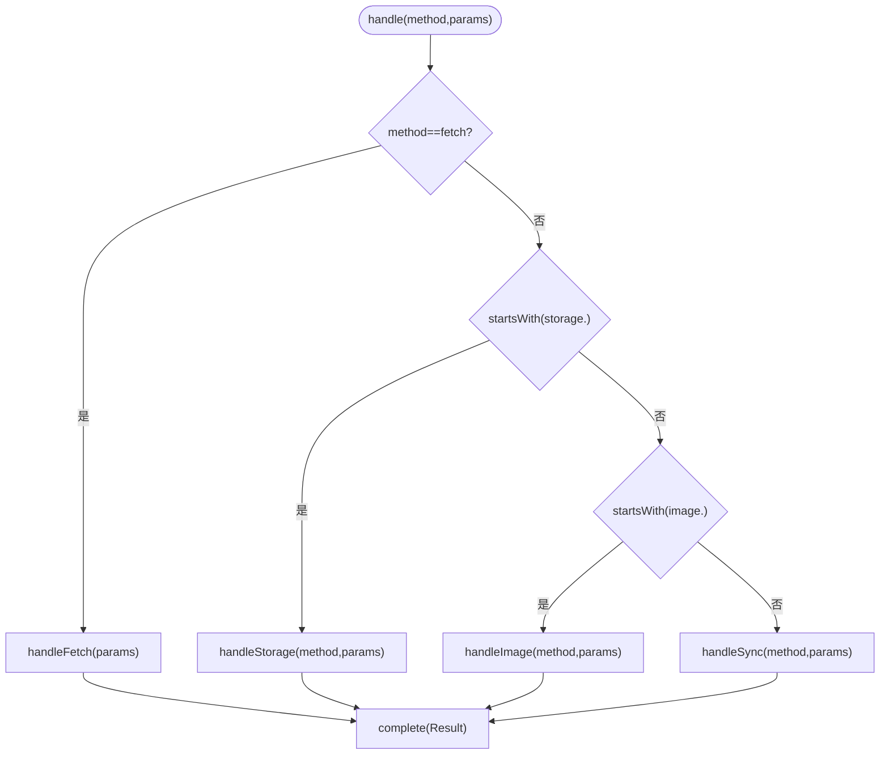
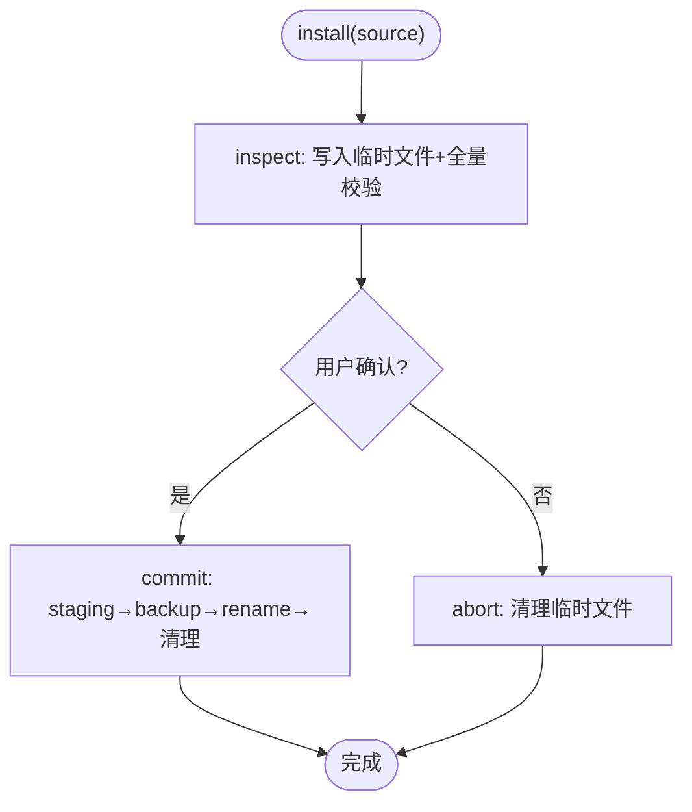
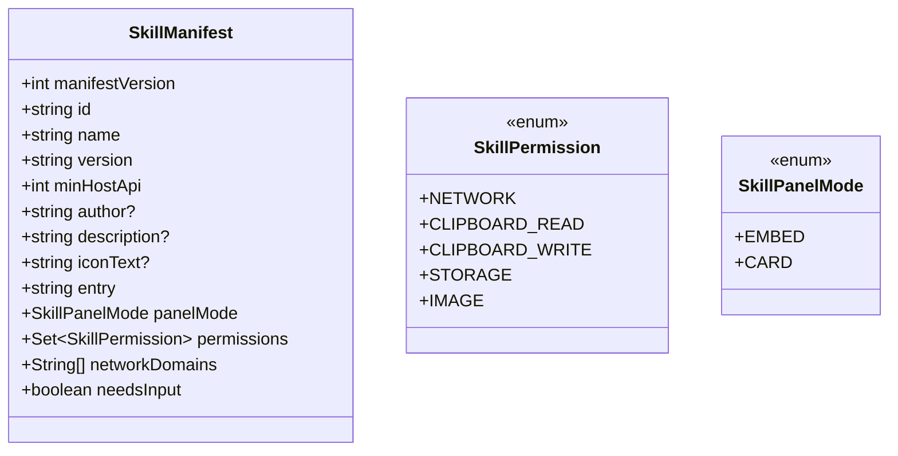
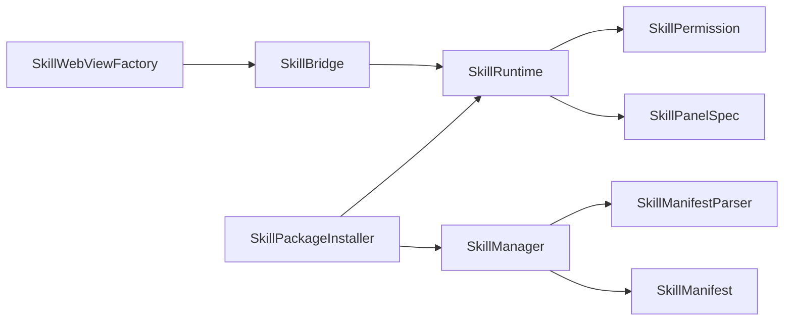

# 架构设计

<cite>
**本文引用的文件**   
- [SkillManager.kt](file://app/src/main/java/com/ziyou/ime/skill/SkillManager.kt)
- [SkillRuntime.kt](file://app/src/main/java/com/ziyou/ime/skill/SkillRuntime.kt)
- [SkillWebViewFactory.kt](file://app/src/main/java/com/ziyou/ime/skill/SkillWebViewFactory.kt)
- [SkillBridge.kt](file://app/src/main/java/com/ziyou/ime/skill/SkillBridge.kt)
- [SkillManifestParser.kt](file://app/src/main/java/com/ziyou/ime/skill/SkillManifestParser.kt)
- [SkillPackageInstaller.kt](file://app/src/main/java/com/ziyou/ime/skill/SkillPackageInstaller.kt)
- [SkillManifest.kt](file://core-logic/src/main/java/com/ziyou/ime/core/skill/SkillManifest.kt)
- [SkillPermission.kt](file://core-logic/src/main/java/com/ziyou/ime/core/skill/SkillPermission.kt)
- [SkillPanelSpec.kt](file://core-logic/src/main/java/com/ziyou/ime/core/skill/SkillPanelSpec.kt)
- [imeskill.js](file://app/src/main/assets/skill_runtime/imeskill.js)
</cite>

## 目录
1. [引言](#引言)
2. [项目结构](#项目结构)
3. [核心组件](#核心组件)
4. [架构总览](#架构总览)
5. [详细组件分析](#详细组件分析)
6. [依赖关系分析](#依赖关系分析)
7. [性能考量](#性能考量)
8. [故障排查指南](#故障排查指南)
9. [结论](#结论)
10. [附录](#附录)

## 引言
本文件面向技能插件系统的架构设计与实现，围绕基于 WebView 沙箱的可扩展技能面板展开。重点说明：
- SkillManager 的插件扫描与加载机制（内置与用户安装统一抽象）
- SkillInfo 数据模型设计
- SkillWebViewFactory 的安全 WebView 工厂（沙箱、JS 接口注入、资源拦截）
- SkillRuntime 的能力实现层（权限检查、storage 串行 IO、fetch 代理网络请求）
- 插件生命周期管理（从扫描发现到加载运行）
- 架构图与数据流图，展示各组件交互关系

## 项目结构
技能系统由 app 层与 core-logic 模块共同构成：
- app 层负责 Android 平台能力集成（WebView、Bridge、运行时、安装器、管理器）
- core-logic 提供纯逻辑的数据模型与校验（manifest、权限、面板规格等）

图表来源 
- [SkillManager.kt:1-110](file://app/src/main/java/com/ziyou/ime/skill/SkillManager.kt#L1-L110)
- [SkillWebViewFactory.kt:1-205](file://app/src/main/java/com/ziyou/ime/skill/SkillWebViewFactory.kt#L1-L205)
- [SkillBridge.kt:1-99](file://app/src/main/java/com/ziyou/ime/skill/SkillBridge.kt#L1-L99)
- [SkillRuntime.kt:1-521](file://app/src/main/java/com/ziyou/ime/skill/SkillRuntime.kt#L1-L521)
- [SkillPackageInstaller.kt:1-194](file://app/src/main/java/com/ziyou/ime/skill/SkillPackageInstaller.kt#L1-L194)
- [SkillManifestParser.kt:1-73](file://app/src/main/java/com/ziyou/ime/skill/SkillManifestParser.kt#L1-L73)
- [SkillManifest.kt:1-51](file://core-logic/src/main/java/com/ziyou/ime/core/skill/SkillManifest.kt#L1-L51)
- [SkillPermission.kt:1-27](file://core-logic/src/main/java/com/ziyou/ime/core/skill/SkillPermission.kt#L1-L27)
- [SkillPanelSpec.kt:1-30](file://core-logic/src/main/java/com/ziyou/ime/core/skill/SkillPanelSpec.kt#L1-L30)
- [imeskill.js:1-164](file://app/src/main/assets/skill_runtime/imeskill.js#L1-L164)

章节来源
- [SkillManager.kt:1-110](file://app/src/main/java/com/ziyou/ime/skill/SkillManager.kt#L1-L110)
- [SkillManifest.kt:1-51](file://core-logic/src/main/java/com/ziyou/ime/core/skill/SkillManifest.kt#L1-L51)

## 核心组件
- SkillManager：枚举并加载内置与已安装技能，统一 openResource 访问入口，返回 SkillInfo。
- SkillInfo：封装 manifest、资源来源（assets 或内部存储）、是否内置等元信息。
- SkillWebViewFactory：创建具备严格安全策略的 WebView，注入 Bridge 与垫片脚本，全量资源拦截。
- SkillBridge：JS 侧唯一原生入口，消息分发至 SkillRuntime，异步回调结果。
- SkillRuntime：承载所有宿主能力（权限校验、storage 串行 IO、fetch 代理、剪贴板、输入路由、图片输出）。
- SkillPackageInstaller：两段式安装（inspect → commit/abort），Zip 校验与冲突检测。
- SkillManifestParser：JSON → SkillManifest 转换，委托 core-logic 校验。
- core-logic 模型：SkillManifest、SkillPermission、SkillPanelSpec 等纯数据与规则。

章节来源
- [SkillManager.kt:1-110](file://app/src/main/java/com/ziyou/ime/skill/SkillManager.kt#L1-L110)
- [SkillWebViewFactory.kt:1-205](file://app/src/main/java/com/ziyou/ime/skill/SkillWebViewFactory.kt#L1-L205)
- [SkillBridge.kt:1-99](file://app/src/main/java/com/ziyou/ime/skill/SkillBridge.kt#L1-L99)
- [SkillRuntime.kt:1-521](file://app/src/main/java/com/ziyou/ime/skill/SkillRuntime.kt#L1-L521)
- [SkillPackageInstaller.kt:1-194](file://app/src/main/java/com/ziyou/ime/skill/SkillPackageInstaller.kt#L1-L194)
- [SkillManifestParser.kt:1-73](file://app/src/main/java/com/ziyou/ime/skill/SkillManifestParser.kt#L1-L73)
- [SkillManifest.kt:1-51](file://core-logic/src/main/java/com/ziyou/ime/core/skill/SkillManifest.kt#L1-L51)
- [SkillPermission.kt:1-27](file://core-logic/src/main/java/com/ziyou/ime/core/skill/SkillPermission.kt#L1-L27)
- [SkillPanelSpec.kt:1-30](file://core-logic/src/main/java/com/ziyou/ime/core/skill/SkillPanelSpec.kt#L1-L30)

## 架构总览
技能面板以 WebView 为渲染容器，通过 Bridge 与宿主通信；SkillRuntime 作为能力边界，集中权限控制与资源限制；SkillManager 负责插件发现与统一抽象；安装器保障包体安全与原子性。

图表来源 
- [SkillManager.kt:62-67](file://app/src/main/java/com/ziyou/ime/skill/SkillManager.kt#L62-L67)
- [SkillWebViewFactory.kt:60-158](file://app/src/main/java/com/ziyou/ime/skill/SkillWebViewFactory.kt#L60-L158)
- [SkillBridge.kt:45-98](file://app/src/main/java/com/ziyou/ime/skill/SkillBridge.kt#L45-L98)
- [SkillRuntime.kt:142-157](file://app/src/main/java/com/ziyou/ime/skill/SkillRuntime.kt#L142-L157)
- [imeskill.js:30-43](file://app/src/main/assets/skill_runtime/imeskill.js#L30-L43)

## 详细组件分析

### SkillManager 与 SkillInfo：插件扫描与统一抽象
- 扫描流程：
  - 内置技能：遍历 assets/skills 目录，读取 manifest.json，解析为 SkillInfo(builtin=true, assetDir=...)
  - 已安装技能：扫描 files/skills/<id>/ 目录，过滤隐藏目录，解析 manifest.json，返回 SkillInfo(builtin=false, installDir=...)
- 资源访问：SkillInfo.openResource 根据 builtin 分支选择 assets.open 或 File 流，并对非内置路径做 canonicalPath 白名单校验，防止 Zip Slip。
- 错误处理：解析失败记录日志并跳过该技能，不影响其他技能加载。

图表来源 
- [SkillManager.kt:72-91](file://app/src/main/java/com/ziyou/ime/skill/SkillManager.kt#L72-L91)
- [SkillManager.kt:93-108](file://app/src/main/java/com/ziyou/ime/skill/SkillManager.kt#L93-L108)
- [SkillManager.kt:29-42](file://app/src/main/java/com/ziyou/ime/skill/SkillManager.kt#L29-L42)

章节来源
- [SkillManager.kt:1-110](file://app/src/main/java/com/ziyou/ime/skill/SkillManager.kt#L1-L110)

### SkillWebViewFactory：安全 WebView 工厂
- 安全基线：
  - 禁用文件/内容访问、DOM Storage、定位、多窗口、自动打开窗口
  - 仅允许虚拟域名下的技能包内资源，其余一律空响应
  - HTML 响应附加 CSP，禁止 connect-src
  - 首帧前隐藏 WebView 避免黑屏闪烁
- JS 注入：优先 DOCUMENT_START_SCRIPT 注入垫片，不支持则回退 onPageStarted
- 崩溃兜底：onRenderProcessGone 销毁面板但不影响 IME 主进程

图表来源 
- [SkillWebViewFactory.kt:30-158](file://app/src/main/java/com/ziyou/ime/skill/SkillWebViewFactory.kt#L30-L158)
- [SkillWebViewFactory.kt:164-203](file://app/src/main/java/com/ziyou/ime/skill/SkillWebViewFactory.kt#L164-L203)

章节来源
- [SkillWebViewFactory.kt:1-205](file://app/src/main/java/com/ziyou/ime/skill/SkillWebViewFactory.kt#L1-L205)

### SkillBridge：JS 桥单入口
- 职责：接收 JS 调用，切主线程分发，调用 SkillRuntime.handle，异步回调结果
- 安全：单条消息长度上限、释放后拒绝一切调用、异常兜底不波及主进程

图表来源 
- [SkillBridge.kt:45-98](file://app/src/main/java/com/ziyou/ime/skill/SkillBridge.kt#L45-L98)
- [SkillRuntime.kt:142-157](file://app/src/main/java/com/ziyou/ime/skill/SkillRuntime.kt#L142-L157)

章节来源
- [SkillBridge.kt:1-99](file://app/src/main/java/com/ziyou/ime/skill/SkillBridge.kt#L1-L99)

### SkillRuntime：能力实现层
- 权限检查：每个 API 调用前校验 manifest.permissions
- storage：
  - 串行 IO 调度器 limitedParallelism(1)，保证 set/remove 顺序
  - 每技能独立 JSON 文件，限额 1MB，缓存内存中
- fetch：
  - 强制 HTTPS，域名白名单精确匹配（IDN/punycode 归一化）
  - 超时 10s，响应 ≤1MB，频控 30 次/分钟，并发 ≤2，禁重定向
- 图片输出：base64 PNG 魔数校验，commitContent 发送或保存到相册
- 输入路由：requestFocus/releaseFocus 将键盘上屏文本注入面板输入框（需 needs_input）

图表来源 
- [SkillRuntime.kt:142-157](file://app/src/main/java/com/ziyou/ime/skill/SkillRuntime.kt#L142-L157)
- [SkillRuntime.kt:250-284](file://app/src/main/java/com/ziyou/ime/skill/SkillRuntime.kt#L250-L284)
- [SkillRuntime.kt:374-427](file://app/src/main/java/com/ziyou/ime/skill/SkillRuntime.kt#L374-L427)
- [SkillRuntime.kt:293-332](file://app/src/main/java/com/ziyou/ime/skill/SkillRuntime.kt#L293-L332)
- [SkillRuntime.kt:159-241](file://app/src/main/java/com/ziyou/ime/skill/SkillRuntime.kt#L159-L241)

章节来源
- [SkillRuntime.kt:1-521](file://app/src/main/java/com/ziyou/ime/skill/SkillRuntime.kt#L1-L521)

### SkillPackageInstaller：安装器与生命周期
- 两段式安装：
  - inspect：拷贝临时文件、Zip 校验（大小/条目/Zip Slip/manifest/入口）、冲突检测（内置不可覆盖、版本升级约束）
  - commit：解压到 staging → 旧版移至 .backup → 原子替换 → 成功后清理备份
  - abort：清理临时包体
- 卸载：删除安装目录并清理对应 storage 文件

图表来源 
- [SkillPackageInstaller.kt:40-82](file://app/src/main/java/com/ziyou/ime/skill/SkillPackageInstaller.kt#L40-L82)
- [SkillPackageInstaller.kt:92-143](file://app/src/main/java/com/ziyou/ime/skill/SkillPackageInstaller.kt#L92-L143)
- [SkillPackageInstaller.kt:150-159](file://app/src/main/java/com/ziyou/ime/skill/SkillPackageInstaller.kt#L150-L159)

章节来源
- [SkillPackageInstaller.kt:1-194](file://app/src/main/java/com/ziyou/ime/skill/SkillPackageInstaller.kt#L1-L194)

### SkillManifestParser 与 Manifest 模型
- 解析：JSON → SkillManifest，权限集合与 network_domains 数组解析
- 校验：委托 core-logic 校验器，非法字段抛出异常
- 模型：包含 id/name/version/minHostApi/panelMode/permissions/networkDomains/needsInput 等

图表来源 
- [SkillManifest.kt:9-40](file://core-logic/src/main/java/com/ziyou/ime/core/skill/SkillManifest.kt#L9-L40)
- [SkillPermission.kt:10-26](file://core-logic/src/main/java/com/ziyou/ime/core/skill/SkillPermission.kt#L10-L26)
- [SkillManifest.kt:43-50](file://core-logic/src/main/java/com/ziyou/ime/core/skill/SkillManifest.kt#L43-L50)

章节来源
- [SkillManifestParser.kt:1-73](file://app/src/main/java/com/ziyou/ime/skill/SkillManifestParser.kt#L1-L73)
- [SkillManifest.kt:1-51](file://core-logic/src/main/java/com/ziyou/ime/core/skill/SkillManifest.kt#L1-L51)
- [SkillPermission.kt:1-27](file://core-logic/src/main/java/com/ziyou/ime/core/skill/SkillPermission.kt#L1-L27)

### 垫片脚本 imeskill.js：JS 侧统一 API
- 暴露 window.IMESkill 对象，全部方法返回 Promise
- 通过 __IMESkillNative.postMessage 单入口与宿主通信
- 支持 sendText、getContext、getLocale、haptic、storage.*、ui.*、clipboard.*、input.*、fetch、image.*

章节来源
- [imeskill.js:1-164](file://app/src/main/assets/skill_runtime/imeskill.js#L1-L164)

## 依赖关系分析
- SkillManager 依赖 SkillManifestParser 与 core-logic 模型
- SkillWebViewFactory 依赖 SkillBridge 与 ZipEntryValidator（用于路径安全）
- SkillBridge 依赖 SkillRuntime 与 WebView
- SkillRuntime 依赖 core-logic 模型（权限、面板规格）与宿主 Host 接口
- SkillPackageInstaller 依赖 ZipEntryValidator、SkillManager、SkillRuntime（卸载时清理 storage）

图表来源 
- [SkillManager.kt:62-67](file://app/src/main/java/com/ziyou/ime/skill/SkillManager.kt#L62-L67)
- [SkillWebViewFactory.kt:88-92](file://app/src/main/java/com/ziyou/ime/skill/SkillWebViewFactory.kt#L88-L92)
- [SkillBridge.kt:20-23](file://app/src/main/java/com/ziyou/ime/skill/SkillBridge.kt#L20-L23)
- [SkillRuntime.kt:40-44](file://app/src/main/java/com/ziyou/ime/skill/SkillRuntime.kt#L40-L44)
- [SkillPackageInstaller.kt:150-159](file://app/src/main/java/com/ziyou/ime/skill/SkillPackageInstaller.kt#L150-L159)

章节来源
- [SkillManager.kt:1-110](file://app/src/main/java/com/ziyou/ime/skill/SkillManager.kt#L1-L110)
- [SkillWebViewFactory.kt:1-205](file://app/src/main/java/com/ziyou/ime/skill/SkillWebViewFactory.kt#L1-L205)
- [SkillBridge.kt:1-99](file://app/src/main/java/com/ziyou/ime/skill/SkillBridge.kt#L1-L99)
- [SkillRuntime.kt:1-521](file://app/src/main/java/com/ziyou/ime/skill/SkillRuntime.kt#L1-L521)
- [SkillPackageInstaller.kt:1-194](file://app/src/main/java/com/ziyou/ime/skill/SkillPackageInstaller.kt#L1-L194)

## 性能考量
- WebView 首帧前隐藏避免黑屏闪烁，减少视觉抖动
- 禁用 WebView 缓存，避免本地膨胀；资源直接从 assets/files 读取
- storage 使用单并发 IO 调度器，避免磁盘竞争与乱序
- fetch 限流与并发控制，保护宿主与网络资源
- 图片 base64 传输存在 512KB 消息上限，建议大图先降分辨率

[本节为通用指导，无需特定文件引用]

## 故障排查指南
- 技能加载失败：查看 SkillManager 日志，确认 manifest 合法与入口文件存在
- WebView 崩溃：onRenderProcessGone 回调会销毁面板，检查资源路径与 CSP
- Bridge 调用异常：SkillBridge 会捕获并返回“内部错误”，检查参数与方法名
- storage 写入失败：检查权限与限额（1MB），确认序列化后大小
- fetch 失败：检查 HTTPS、域名白名单、频控与并发限制
- 图片发送失败：确认编辑器接受 image/* 且 PNG 魔数正确

章节来源
- [SkillManager.kt:72-91](file://app/src/main/java/com/ziyou/ime/skill/SkillManager.kt#L72-L91)
- [SkillWebViewFactory.kt:148-155](file://app/src/main/java/com/ziyou/ime/skill/SkillWebViewFactory.kt#L148-L155)
- [SkillBridge.kt:67-86](file://app/src/main/java/com/ziyou/ime/skill/SkillBridge.kt#L67-L86)
- [SkillRuntime.kt:497-519](file://app/src/main/java/com/ziyou/ime/skill/SkillRuntime.kt#L497-L519)
- [SkillRuntime.kt:430-471](file://app/src/main/java/com/ziyou/ime/skill/SkillRuntime.kt#L430-L471)
- [SkillRuntime.kt:335-347](file://app/src/main/java/com/ziyou/ime/skill/SkillRuntime.kt#L335-L347)

## 结论
本架构通过 SkillManager 统一抽象插件来源，SkillWebViewFactory 提供强隔离 WebView 环境，SkillBridge 收敛 JS 入口，SkillRuntime 集中权限与能力边界，配合两段式安装器保障安全性与稳定性。整体设计兼顾可扩展性与安全性，适合输入法场景下的技能生态演进。

[本节为总结，无需特定文件引用]

## 附录
- 面板高度规格：默认 0.6 倍键盘高度，钳制区间 [0.4, 1.2]
- 权限模型：network、clipboard_read、clipboard_write、storage、image
- 生命周期：扫描 → 解析 → 安装/加载 → 运行 → 卸载/释放

章节来源
- [SkillPanelSpec.kt:10-29](file://core-logic/src/main/java/com/ziyou/ime/core/skill/SkillPanelSpec.kt#L10-L29)
- [SkillPermission.kt:10-26](file://core-logic/src/main/java/com/ziyou/ime/core/skill/SkillPermission.kt#L10-L26)
- [SkillPackageInstaller.kt:92-143](file://app/src/main/java/com/ziyou/ime/skill/SkillPackageInstaller.kt#L92-L143)