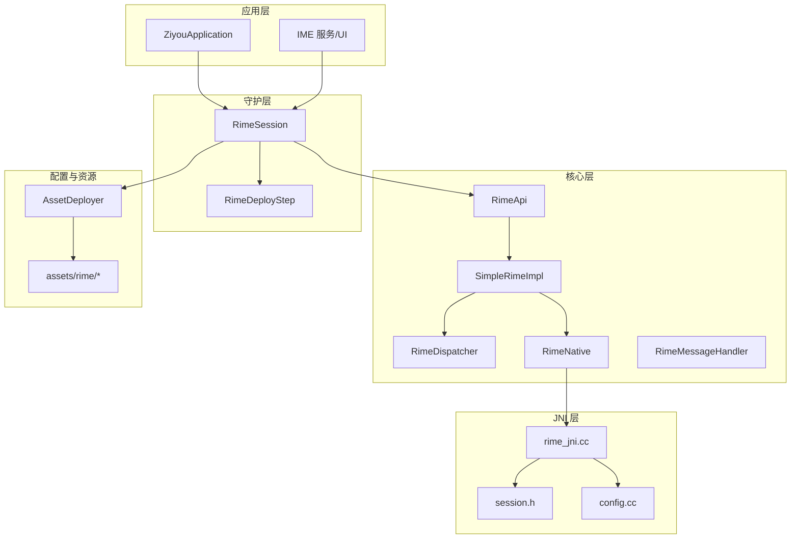
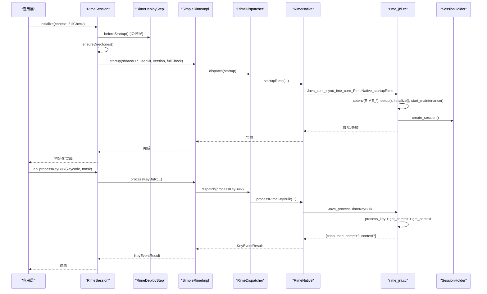
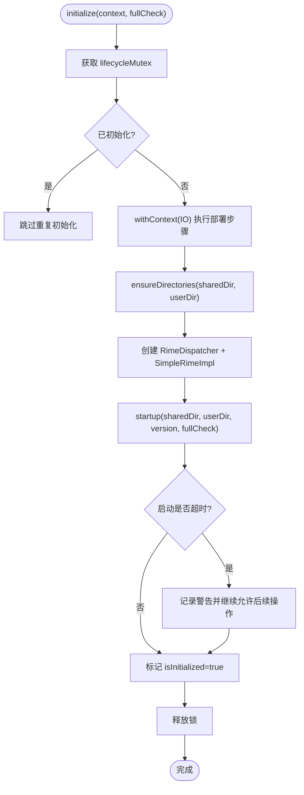
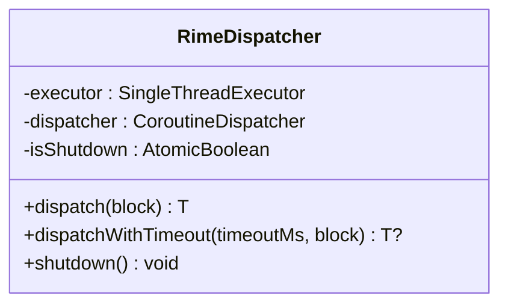
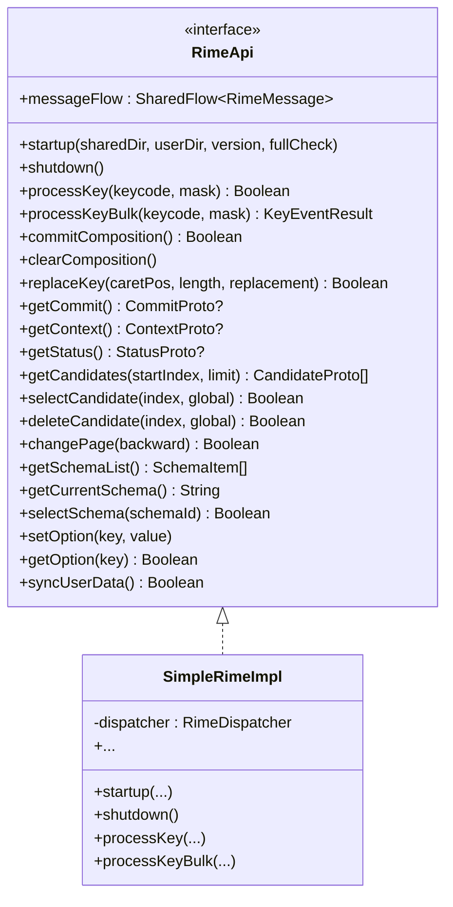
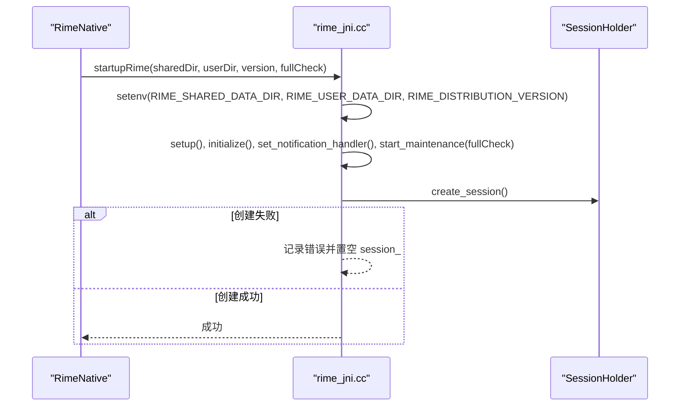
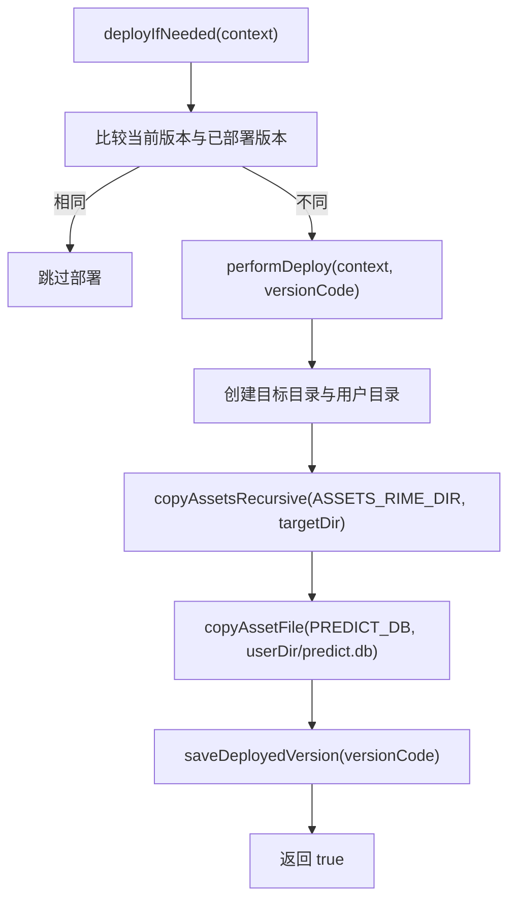
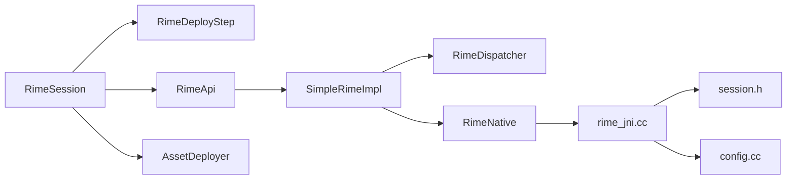

# 常见问题诊断

<cite>
**本文引用的文件**   
- [RimeSession.kt](file://app/src/main/java/com/ziyou/ime/daemon/RimeSession.kt)
- [RimeDeployStep.kt](file://app/src/main/java/com/ziyou/ime/daemon/RimeDeployStep.kt)
- [RimeNative.kt](file://app/src/main/java/com/ziyou/ime/core/RimeNative.kt)
- [rime_jni.cc](file://app/src/main/jni/librime_jni/rime_jni.cc)
- [session.h](file://app/src/main/jni/librime_jni/session.h)
- [AssetDeployer.kt](file://app/src/main/java/com/ziyou/ime/config/AssetDeployer.kt)
- [RimeDispatcher.kt](file://app/src/main/java/com/ziyou/ime/core/RimeDispatcher.kt)
- [SimpleRimeImpl.kt](file://app/src/main/java/com/ziyou/ime/core/SimpleRimeImpl.kt)
- [RimeApi.kt](file://app/src/main/java/com/ziyou/ime/core/RimeApi.kt)
- [RimeMessage.kt](file://app/src/main/java/com/ziyou/ime/core/RimeMessage.kt)
- [config.cc](file://app/src/main/jni/librime_jni/config.cc)
- [ZiyouApplication.kt](file://app/src/main/java/com/ziyou/ime/ZiyouApplication.kt)
</cite>

## 目录
1. [简介](#简介)
2. [项目结构](#项目结构)
3. [核心组件](#核心组件)
4. [架构总览](#架构总览)
5. [详细组件分析](#详细组件分析)
6. [依赖关系分析](#依赖关系分析)
7. [性能注意事项](#性能注意事项)
8. [故障排查指南](#故障排查指南)
9. [结论](#结论)
10. [附录](#附录)

## 简介
本指南聚焦于 Rime 输入法在 Android 集成中的常见问题与解决方案，覆盖引擎初始化失败、JNI 崩溃、内存泄漏、性能瓶颈等典型问题；深入解析 RimeSession 生命周期问题（会话创建失败、资源清理异常、线程同步问题）；详解 RimeDeployStep 部署过程中的常见错误（词库加载失败、配置文件解析错误、权限不足等）。文档提供症状描述、定位步骤、修复建议与预防措施，帮助开发者快速定位并解决问题。

## 项目结构
本项目采用分层设计：
- 应用层：IME 服务与 UI
- 守护层（daemon）：RimeSession、RimeDeployStep
- 核心层（core）：RimeApi、SimpleRimeImpl、RimeDispatcher、RimeNative、消息流
- JNI 层：rime_jni.cc、session.h、config.cc
- 配置与资源：AssetDeployer、assets/rime 资源

**图表来源** 
- [RimeSession.kt:1-226](file://app/src/main/java/com/ziyou/ime/daemon/RimeSession.kt#L1-L226)
- [RimeDeployStep.kt:1-20](file://app/src/main/java/com/ziyou/ime/daemon/RimeDeployStep.kt#L1-L20)
- [RimeNative.kt:1-170](file://app/src/main/java/com/ziyou/ime/core/RimeNative.kt#L1-L170)
- [rime_jni.cc:1-528](file://app/src/main/jni/librime_jni/rime_jni.cc#L1-L528)
- [session.h:1-36](file://app/src/main/jni/librime_jni/session.h#L1-L36)
- [AssetDeployer.kt:1-162](file://app/src/main/java/com/ziyou/ime/config/AssetDeployer.kt#L1-L162)
- [RimeDispatcher.kt:1-91](file://app/src/main/java/com/ziyou/ime/core/RimeDispatcher.kt#L1-L91)
- [SimpleRimeImpl.kt:1-177](file://app/src/main/java/com/ziyou/ime/core/SimpleRimeImpl.kt#L1-L177)
- [RimeApi.kt:1-105](file://app/src/main/java/com/ziyou/ime/core/RimeApi.kt#L1-L105)
- [RimeMessage.kt:1-42](file://app/src/main/java/com/ziyou/ime/core/RimeMessage.kt#L1-L42)
- [config.cc:1-111](file://app/src/main/jni/librime_jni/config.cc#L1-L111)
- [ZiyouApplication.kt:1-26](file://app/src/main/java/com/ziyou/ime/ZiyouApplication.kt#L1-L26)

**章节来源**
- [RimeSession.kt:1-226](file://app/src/main/java/com/ziyou/ime/daemon/RimeSession.kt#L1-L226)
- [RimeDeployStep.kt:1-20](file://app/src/main/java/com/ziyou/ime/daemon/RimeDeployStep.kt#L1-L20)
- [RimeNative.kt:1-170](file://app/src/main/java/com/ziyou/ime/core/RimeNative.kt#L1-L170)
- [rime_jni.cc:1-528](file://app/src/main/jni/librime_jni/rime_jni.cc#L1-L528)
- [session.h:1-36](file://app/src/main/jni/librime_jni/session.h#L1-L36)
- [AssetDeployer.kt:1-162](file://app/src/main/java/com/ziyou/ime/config/AssetDeployer.kt#L1-L162)
- [RimeDispatcher.kt:1-91](file://app/src/main/java/com/ziyou/ime/core/RimeDispatcher.kt#L1-L91)
- [SimpleRimeImpl.kt:1-177](file://app/src/main/java/com/ziyou/ime/core/SimpleRimeImpl.kt#L1-L177)
- [RimeApi.kt:1-105](file://app/src/main/java/com/ziyou/ime/core/RimeApi.kt#L1-L105)
- [RimeMessage.kt:1-42](file://app/src/main/java/com/ziyou/ime/core/RimeMessage.kt#L1-L42)
- [config.cc:1-111](file://app/src/main/jni/librime_jni/config.cc#L1-L111)
- [ZiyouApplication.kt:1-26](file://app/src/main/java/com/ziyou/ime/ZiyouApplication.kt#L1-L26)

## 核心组件
- RimeSession：单例会话管理器，负责完整生命周期（初始化、运行、销毁）、部署步骤执行、目录准备、启动超时保护与重新部署。
- RimeDeployStep：抽象部署步骤接口，用于解耦 daemon 层与业务模块，按顺序串行执行。
- SimpleRimeImpl：RimeApi 实现，通过 RimeDispatcher 将全部操作调度到单一线程执行，保证 librime 非线程安全约束。
- RimeDispatcher：单线程协程调度器，封装 Executor，提供带超时的任务执行能力。
- RimeNative：JNI 接口声明，封装所有 native 方法，包含库加载检查与消息回调入口。
- rime_jni.cc：JNI 实现，管理 Rime 引擎实例、会话创建、输入处理、状态查询、候选操作、方案管理与用户数据同步。
- session.h：RAII 会话包装，自动创建/销毁 Rime 会话。
- AssetDeployer：资源部署器，将 assets/rime 复制到应用内部存储，维护部署版本。
- RimeMessageHandler：接收 JNI 通知并通过 SharedFlow 广播给 UI。

**章节来源**
- [RimeSession.kt:1-226](file://app/src/main/java/com/ziyou/ime/daemon/RimeSession.kt#L1-L226)
- [RimeDeployStep.kt:1-20](file://app/src/main/java/com/ziyou/ime/daemon/RimeDeployStep.kt#L1-L20)
- [SimpleRimeImpl.kt:1-177](file://app/src/main/java/com/ziyou/ime/core/SimpleRimeImpl.kt#L1-L177)
- [RimeDispatcher.kt:1-91](file://app/src/main/java/com/ziyou/ime/core/RimeDispatcher.kt#L1-L91)
- [RimeNative.kt:1-170](file://app/src/main/java/com/ziyou/ime/core/RimeNative.kt#L1-L170)
- [rime_jni.cc:1-528](file://app/src/main/jni/librime_jni/rime_jni.cc#L1-L528)
- [session.h:1-36](file://app/src/main/jni/librime_jni/session.h#L1-L36)
- [AssetDeployer.kt:1-162](file://app/src/main/java/com/ziyou/ime/config/AssetDeployer.kt#L1-L162)
- [RimeMessage.kt:1-42](file://app/src/main/java/com/ziyou/ime/core/RimeMessage.kt#L1-L42)

## 架构总览
下图展示从应用层到 JNI 层的调用链与数据流，包括初始化、输入处理与消息回调路径。

**图表来源** 
- [RimeSession.kt:88-153](file://app/src/main/java/com/ziyou/ime/daemon/RimeSession.kt#L88-L153)
- [SimpleRimeImpl.kt:32-42](file://app/src/main/java/com/ziyou/ime/core/SimpleRimeImpl.kt#L32-L42)
- [RimeDispatcher.kt:48-60](file://app/src/main/java/com/ziyou/ime/core/RimeDispatcher.kt#L48-L60)
- [RimeNative.kt:44-71](file://app/src/main/java/com/ziyou/ime/core/RimeNative.kt#L44-L71)
- [rime_jni.cc:280-315](file://app/src/main/jni/librime_jni/rime_jni.cc#L280-L315)
- [session.h:14-21](file://app/src/main/jni/librime_jni/session.h#L14-L21)

## 详细组件分析

### RimeSession 生命周期与线程同步
- 生命周期互斥锁：使用 Mutex 串行化 initialize/destroy/redeploy，避免并发导致的重复初始化与线程泄漏。
- 初始化流程：先执行部署步骤（IO 线程），再创建调度器与 API 实例，最后启动引擎并设置超时保护。
- 销毁流程：关闭引擎、取消协程作用域、释放调度器与引用，重置状态。
- 重新部署：关闭当前引擎后以 fullCheck 模式重启，确保词库变更后生效。

**图表来源** 
- [RimeSession.kt:88-153](file://app/src/main/java/com/ziyou/ime/daemon/RimeSession.kt#L88-L153)

**章节来源**
- [RimeSession.kt:88-198](file://app/src/main/java/com/ziyou/ime/daemon/RimeSession.kt#L88-L198)

### RimeDispatcher 单线程调度与超时
- 单线程 Executor：确保所有 librime 调用在同一线程执行，避免数据竞争。
- 超时机制：dispatchWithTimeout 支持任务超时返回 null，防止阻塞。
- 关闭保护：shutdown 后拒绝新任务，避免资源泄露。

**图表来源** 
- [RimeDispatcher.kt:22-90](file://app/src/main/java/com/ziyou/ime/core/RimeDispatcher.kt#L22-L90)

**章节来源**
- [RimeDispatcher.kt:22-90](file://app/src/main/java/com/ziyou/ime/core/RimeDispatcher.kt#L22-L90)

### SimpleRimeImpl 与 RimeApi 实现
- 所有 suspend 方法通过 dispatcher.dispatch 调度到单线程执行。
- processKeyBulk 默认组合三次调用，生产实现由 JNI 层单次跨界优化。
- 消息流暴露 messageFlow，供 UI 订阅 Rime 状态变更。

**图表来源** 
- [RimeApi.kt:10-105](file://app/src/main/java/com/ziyou/ime/core/RimeApi.kt#L10-L105)
- [SimpleRimeImpl.kt:10-177](file://app/src/main/java/com/ziyou/ime/core/SimpleRimeImpl.kt#L10-L177)

**章节来源**
- [RimeApi.kt:10-105](file://app/src/main/java/com/ziyou/ime/core/RimeApi.kt#L10-L105)
- [SimpleRimeImpl.kt:10-177](file://app/src/main/java/com/ziyou/ime/core/SimpleRimeImpl.kt#L10-L177)

### JNI 层与会话管理
- 引擎启动：设置环境变量、setup/initialize/start_maintenance，注册通知回调。
- 会话创建：SessionHolder RAII 管理，异常时记录日志并置空会话。
- 输入处理：processRimeKeyBulk 合并 process_key + get_commit + get_context，减少 JNI 跨界次数。
- 资源回收：exit() 释放会话与 finalize 引擎。

**图表来源** 
- [rime_jni.cc:280-315](file://app/src/main/jni/librime_jni/rime_jni.cc#L280-L315)
- [session.h:14-21](file://app/src/main/jni/librime_jni/session.h#L14-L21)

**章节来源**
- [rime_jni.cc:280-315](file://app/src/main/jni/librime_jni/rime_jni.cc#L280-L315)
- [session.h:14-21](file://app/src/main/jni/librime_jni/session.h#L14-L21)

### 资源部署与配置读取
- AssetDeployer：检测版本变化，递归复制 assets/rime 到应用内部存储，部署 predict.db 到用户目录，保存部署版本。
- config.cc：提供 Rime 配置读写 JNI 接口，打开/关闭配置、读取键值、列表项路径等。

**图表来源** 
- [AssetDeployer.kt:25-91](file://app/src/main/java/com/ziyou/ime/config/AssetDeployer.kt#L25-L91)

**章节来源**
- [AssetDeployer.kt:25-91](file://app/src/main/java/com/ziyou/ime/config/AssetDeployer.kt#L25-L91)
- [config.cc:12-57](file://app/src/main/jni/librime_jni/config.cc#L12-L57)

## 依赖关系分析
- RimeSession 依赖 RimeDeployStep（抽象解耦）、RimeApi（SimpleRimeImpl）、RimeDispatcher、RimeNative。
- SimpleRimeImpl 依赖 RimeDispatcher 与 RimeNative。
- rime_jni.cc 依赖 session.h（会话管理）与 config.cc（配置读写）。
- AssetDeployer 独立于 daemon 层，通过 RimeSession 的部署步骤注入。

**图表来源** 
- [RimeSession.kt:1-226](file://app/src/main/java/com/ziyou/ime/daemon/RimeSession.kt#L1-L226)
- [RimeDeployStep.kt:1-20](file://app/src/main/java/com/ziyou/ime/daemon/RimeDeployStep.kt#L1-L20)
- [SimpleRimeImpl.kt:1-177](file://app/src/main/java/com/ziyou/ime/core/SimpleRimeImpl.kt#L1-L177)
- [RimeDispatcher.kt:1-91](file://app/src/main/java/com/ziyou/ime/core/RimeDispatcher.kt#L1-L91)
- [RimeNative.kt:1-170](file://app/src/main/java/com/ziyou/ime/core/RimeNative.kt#L1-L170)
- [rime_jni.cc:1-528](file://app/src/main/jni/librime_jni/rime_jni.cc#L1-L528)
- [session.h:1-36](file://app/src/main/jni/librime_jni/session.h#L1-L36)
- [config.cc:1-111](file://app/src/main/jni/librime_jni/config.cc#L1-L111)
- [AssetDeployer.kt:1-162](file://app/src/main/java/com/ziyou/ime/config/AssetDeployer.kt#L1-L162)

**章节来源**
- [RimeSession.kt:1-226](file://app/src/main/java/com/ziyou/ime/daemon/RimeSession.kt#L1-L226)
- [SimpleRimeImpl.kt:1-177](file://app/src/main/java/com/ziyou/ime/core/SimpleRimeImpl.kt#L1-L177)
- [rime_jni.cc:1-528](file://app/src/main/jni/librime_jni/rime_jni.cc#L1-L528)

## 性能注意事项
- 热路径优化：processRimeKeyBulk 合并多次 JNI 调用，减少线程切换与跨界开销。
- 内存释放：trimNativeHeap 调用 mallopt M_PURGE 归还空闲页，降低部署后的常驻内存占用。
- 超时保护：startup 使用 withTimeoutOrNull 避免长时间阻塞；dispatchWithTimeout 防止任务卡死。
- 单线程调度：RimeDispatcher 确保 librime 调用顺序执行，避免并发竞争导致的额外开销。

[本节为通用性能指导，不直接分析具体文件]

## 故障排查指南

### 一、Rime 引擎初始化失败
- 症状
  - 启动时报错或无响应，UI 无法获取候选词。
  - 日志中出现“rime_jni 库未加载”或“启动超时”。
- 可能原因
  - ABI 不匹配或缺失 .so 文件。
  - sharedDir/userDir 无效或不可写。
  - 资源未正确部署（assets/rime 缺失或版本不一致）。
  - fullCheck 导致启动时间过长。
- 定位步骤
  - 检查 RimeNative.isLoaded 是否为 true。
  - 确认 AssetDeployer 部署成功且版本一致。
  - 查看 RimeSession 初始化日志与超时信息。
  - 验证 sharedDir/userDir 是否存在且可写。
- 解决步骤
  - 确保构建产物包含 arm64-v8a 的 .so。
  - 强制重新部署资源（forceDeploy）。
  - 首次安装/升级时使用 fullCheck=true，后续使用 false。
  - 增加 STARTUP_TIMEOUT_MS 或降低 fullCheck。

**章节来源**
- [RimeNative.kt:18-40](file://app/src/main/java/com/ziyou/ime/core/RimeNative.kt#L18-L40)
- [AssetDeployer.kt:25-91](file://app/src/main/java/com/ziyou/ime/config/AssetDeployer.kt#L25-L91)
- [RimeSession.kt:134-153](file://app/src/main/java/com/ziyou/ime/daemon/RimeSession.kt#L134-L153)

### 二、JNI 崩溃
- 症状
  - 应用崩溃，logcat 出现 JNI 异常或段错误。
  - 会话创建失败或消息回调异常。
- 可能原因
  - SessionHolder 创建会话失败。
  - JNI 回调中抛出异常未捕获。
  - 多线程访问 librime。
- 定位步骤
  - 检查 rime_jni.cc 中会话创建日志。
  - 查看 handleRimeMessage 的异常处理。
  - 确认所有 JNI 调用均通过 RimeDispatcher 单线程执行。
- 解决步骤
  - 确保仅在单线程调用 JNI。
  - 在 JNI 回调中捕获并清除异常。
  - 增加会话创建失败的日志与降级逻辑。

**章节来源**
- [rime_jni.cc:245-264](file://app/src/main/jni/librime_jni/rime_jni.cc#L245-L264)
- [rime_jni.cc:305-312](file://app/src/main/jni/librime_jni/rime_jni.cc#L305-L312)
- [RimeDispatcher.kt:48-60](file://app/src/main/java/com/ziyou/ime/core/RimeDispatcher.kt#L48-L60)

### 三、内存泄漏
- 症状
  - 应用运行一段时间后内存持续增长。
  - 部署后常驻内存偏高。
- 可能原因
  - 未调用 shutdown 或 destroy。
  - 词库部署产生的临时分配未被释放。
  - 协程作用域未正确取消。
- 定位步骤
  - 检查 RimeSession.destroy 是否被调用。
  - 观察 trimNativeHeap 是否调用。
  - 监控协程作用域生命周期。
- 解决步骤
  - 在应用退出或 IME 销毁时调用 destroy。
  - 部署完成后调用 trimNativeHeap。
  - 确保 sessionScope 在 destroy 中被 cancel。

**章节来源**
- [RimeSession.kt:158-183](file://app/src/main/java/com/ziyou/ime/daemon/RimeSession.kt#L158-L183)
- [RimeNative.kt:53-58](file://app/src/main/java/com/ziyou/ime/core/RimeNative.kt#L53-L58)
- [rime_jni.cc:337-343](file://app/src/main/jni/librime_jni/rime_jni.cc#L337-L343)

### 四、性能瓶颈
- 症状
  - 输入延迟高，候选词加载慢。
  - 频繁 JNI 调用导致卡顿。
- 可能原因
  - 未使用批量接口 processRimeKeyBulk。
  - fullCheck 频繁触发。
  - 主线程执行 IO 操作。
- 定位步骤
  - 检查是否使用 processRimeKeyBulk。
  - 监控 fullCheck 调用频率。
  - 确认 IO 操作在 Dispatchers.IO 执行。
- 解决步骤
  - 优先使用 processRimeKeyBulk。
  - 仅在首次安装/升级时使用 fullCheck=true。
  - 确保资源部署与词典生成在 IO 线程执行。

**章节来源**
- [SimpleRimeImpl.kt:59-64](file://app/src/main/java/com/ziyou/ime/core/SimpleRimeImpl.kt#L59-L64)
- [RimeSession.kt:104-113](file://app/src/main/java/com/ziyou/ime/daemon/RimeSession.kt#L104-L113)

### 五、RimeSession 生命周期问题
- 会话创建失败
  - 症状：JNI 层记录“Rime session creation failed”。
  - 原因：SessionHolder 构造失败。
  - 解决：检查 librime 初始化状态与内存情况。
- 资源清理异常
  - 症状：destroy 抛异常或资源未释放。
  - 原因：shutdown 顺序错误或引用未置空。
  - 解决：确保先 shutdown 引擎，再 cancel 作用域，最后释放引用。
- 线程同步问题
  - 症状：并发 initialize/destroy 导致状态混乱。
  - 原因：缺少互斥锁保护。
  - 解决：使用 lifecycleMutex 串行化关键操作。

**章节来源**
- [rime_jni.cc:245-264](file://app/src/main/jni/librime_jni/rime_jni.cc#L245-L264)
- [RimeSession.kt:158-183](file://app/src/main/java/com/ziyou/ime/daemon/RimeSession.kt#L158-L183)
- [RimeSession.kt:62-66](file://app/src/main/java/com/ziyou/ime/daemon/RimeSession.kt#L62-L66)

### 六、RimeDeployStep 部署错误
- 词库加载失败
  - 症状：predict.db 不存在或损坏。
  - 原因：AssetDeployer 未正确复制。
  - 解决：检查 copyAssetFile 日志并重新部署。
- 配置文件解析错误
  - 症状：config_open/schema_open 失败。
  - 原因：YAML 语法错误或路径不正确。
  - 解决：校验 YAML 格式与路径。
- 权限不足
  - 症状：mkdirs 失败或写入异常。
  - 原因：应用无写入权限。
  - 解决：确保 filesDir 可写，检查 SELinux 策略。

**章节来源**
- [AssetDeployer.kt:119-131](file://app/src/main/java/com/ziyou/ime/config/AssetDeployer.kt#L119-L131)
- [config.cc:12-47](file://app/src/main/jni/librime_jni/config.cc#L12-L47)

### 七、错误信息示例与解决步骤
- “all specified target directories are invalid”
  - 症状：启动时报目录无效。
  - 原因：sharedDir/userDir 路径错误或不可写。
  - 解决：验证路径存在且可写，检查 AssetDeployer 输出。
- “rime_jni 库未加载”
  - 症状：调用 native 方法前检查失败。
  - 原因：ABI 不匹配或 .so 缺失。
  - 解决：确认构建产物包含正确 ABI。
- “Rime 引擎启动超时”
  - 症状：startup 超过设定时间。
  - 原因：fullCheck 耗时过长或资源过大。
  - 解决：调整超时时间或降低 fullCheck。

**章节来源**
- [RimeSession.kt:134-153](file://app/src/main/java/com/ziyou/ime/daemon/RimeSession.kt#L134-L153)
- [RimeNative.kt:33-40](file://app/src/main/java/com/ziyou/ime/core/RimeNative.kt#L33-L40)

### 八、预防措施与最佳实践
- 始终通过 RimeDispatcher 调用 JNI，避免多线程访问。
- 在应用退出或 IME 销毁时调用 RimeSession.destroy。
- 部署完成后调用 trimNativeHeap 释放内存。
- 使用 processRimeKeyBulk 优化热路径性能。
- 首次安装/升级时使用 fullCheck=true，后续使用 false。
- 定期检查日志与资源部署状态，确保配置正确。

[本节为通用最佳实践，不直接分析具体文件]

## 结论
本指南系统梳理了 Rime 输入法在 Android 集成中的常见问题与解决方案，涵盖初始化、JNI、内存、性能、生命周期与部署等方面。通过明确的定位步骤与修复建议，开发者可以快速诊断并解决问题。遵循最佳实践可有效预防问题发生，提升稳定性与性能。

[本节为总结性内容，不直接分析具体文件]

## 附录
- 相关类图与序列图已在各章节中提供，便于理解组件交互与数据流。
- 建议结合 logcat 与调试工具进一步定位问题。

[本节为补充说明，不直接分析具体文件]