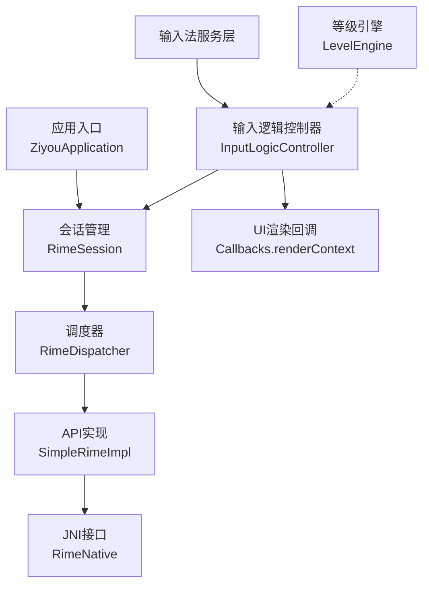
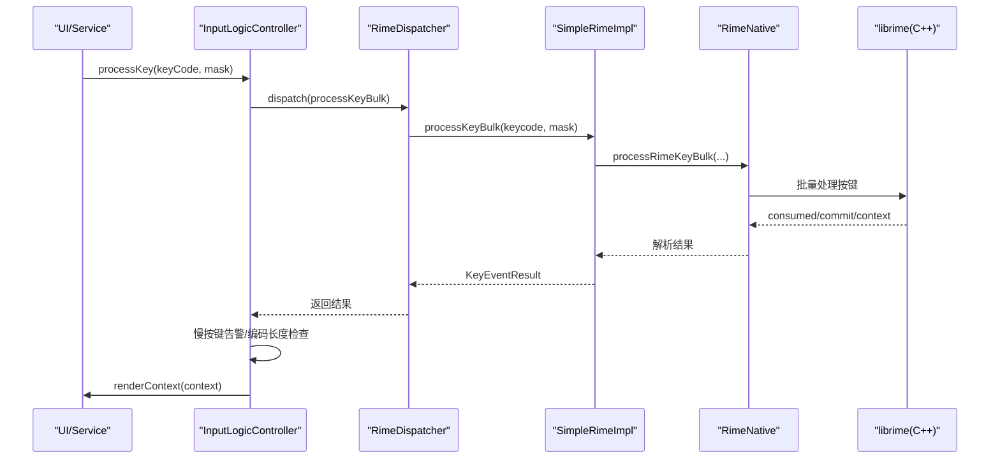
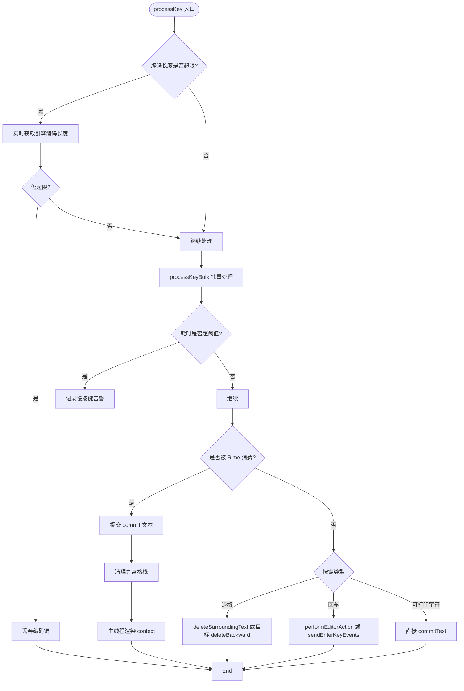
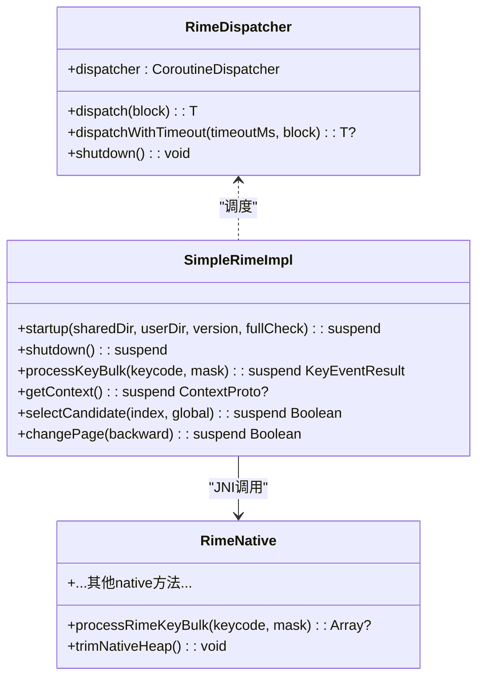
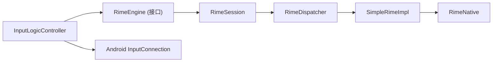

# 性能监控和优化

<cite>
**本文引用的文件**   
- [InputLogicController.kt](file://app/src/main/java/com/ziyou/ime/ime/InputLogicController.kt)
- [LevelEngine.kt](file://core-logic/src/main/java/com/ziyou/ime/core/level/LevelEngine.kt)
- [RimeDispatcher.kt](file://app/src/main/java/com/ziyou/ime/core/RimeDispatcher.kt)
- [SimpleRimeImpl.kt](file://app/src/main/java/com/ziyou/ime/core/SimpleRimeImpl.kt)
- [RimeNative.kt](file://app/src/main/java/com/ziyou/ime/core/RimeNative.kt)
- [RimeSession.kt](file://app/src/main/java/com/ziyou/ime/daemon/RimeSession.kt)
- [ZiyouApplication.kt](file://app/src/main/java/com/ziyou/ime/ZiyouApplication.kt)
- [RimeMessage.kt](file://app/src/main/java/com/ziyou/ime/core/RimeMessage.kt)
- [RimeDispatcherTest.kt](file://app/src/test/java/com/ziyou/ime/core/RimeDispatcherTest.kt)
- [InputLogicControllerTest.kt](file://app/src/test/java/com/ziyou/ime/ime/InputLogicControllerTest.kt)
</cite>

## 目录
1. [引言](#引言)
2. [项目结构](#项目结构)
3. [核心组件](#核心组件)
4. [架构总览](#架构总览)
5. [详细组件分析](#详细组件分析)
6. [依赖关系分析](#依赖关系分析)
7. [性能考量与优化建议](#性能考量与优化建议)
8. [故障排查指南](#故障排查指南)
9. [结论](#结论)
10. [附录：测试基准与持续监控方案](#附录测试基准与持续监控方案)

## 引言
本指南围绕输入法性能监控与优化，聚焦输入延迟、内存占用、CPU 使用率、启动时间等关键指标；结合 Android Profiler、Traceview、systrace 等工具分析方法；并针对 Rime 引擎的线程模型、缓存策略、异步处理给出可落地的优化建议。同时覆盖 InputLogicController 与 LevelEngine 等核心组件的性能调优实践，包含内存泄漏检测、GC 优化、UI 渲染优化及性能测试基准与持续监控方案。

## 项目结构
本项目采用分层与模块化组织：
- app 模块：IME 服务、输入逻辑控制器、JNI 封装、会话管理、消息流、应用入口等。
- core-logic 模块：纯计算引擎（如等级体系）与通用算法。
- librime-prebuilt：Rime 引擎源码与构建脚本（供 JNI 集成）。
- 资源与配置：assets/rime 词库与 schema、gradle 构建参数等。

图表来源
- [ZiyouApplication.kt:1-26](file://app/src/main/java/com/ziyou/ime/ZiyouApplication.kt#L1-L26)
- [RimeSession.kt:88-153](file://app/src/main/java/com/ziyou/ime/daemon/RimeSession.kt#L88-L153)
- [RimeDispatcher.kt:22-91](file://app/src/main/java/com/ziyou/ime/core/RimeDispatcher.kt#L22-L91)
- [SimpleRimeImpl.kt:10-177](file://app/src/main/java/com/ziyou/ime/core/SimpleRimeImpl.kt#L10-L177)
- [RimeNative.kt:1-170](file://app/src/main/java/com/ziyou/ime/core/RimeNative.kt#L1-L170)
- [InputLogicController.kt:43-531](file://app/src/main/java/com/ziyou/ime/ime/InputLogicController.kt#L43-L531)

章节来源
- [ZiyouApplication.kt:1-26](file://app/src/main/java/com/ziyou/ime/ZiyouApplication.kt#L1-L26)
- [RimeSession.kt:88-153](file://app/src/main/java/com/ziyou/ime/daemon/RimeSession.kt#L88-L153)

## 核心组件
- 输入逻辑控制器（InputLogicController）
  - 热路径按键处理、候选选择、翻页、拼音侧栏替换、回车路由、富媒体提交等。
  - 内置慢按键告警阈值与编码长度上限防护，保证高并发下的稳定性与低延迟。
- Rime 会话管理（RimeSession）
  - 生命周期串行化、部署步骤执行、引擎启动超时保护、销毁与重部署。
- Rime 调度器（RimeDispatcher）
  - 单线程 Executor + CoroutineDispatcher，确保 librime 调用顺序性。
- Rime API 实现（SimpleRimeImpl）
  - 将 JNI 调用统一经调度器执行，提供批量按键处理与状态查询。
- JNI 接口（RimeNative）
  - 暴露 native 方法，含批量按键处理、内存回收 trimNativeHeap 等。
- 等级引擎（LevelEngine）
  - 纯计算引擎，无 I/O，用于计分、等级判定与权益解锁。

章节来源
- [InputLogicController.kt:43-531](file://app/src/main/java/com/ziyou/ime/ime/InputLogicController.kt#L43-L531)
- [RimeSession.kt:88-153](file://app/src/main/java/com/ziyou/ime/daemon/RimeSession.kt#L88-L153)
- [RimeDispatcher.kt:22-91](file://app/src/main/java/com/ziyou/ime/core/RimeDispatcher.kt#L22-L91)
- [SimpleRimeImpl.kt:10-177](file://app/src/main/java/com/ziyou/ime/core/SimpleRimeImpl.kt#L10-L177)
- [RimeNative.kt:1-170](file://app/src/main/java/com/ziyou/ime/core/RimeNative.kt#L1-L170)
- [LevelEngine.kt:1-187](file://core-logic/src/main/java/com/ziyou/ime/core/level/LevelEngine.kt#L1-L187)

## 架构总览
下图展示从按键到上屏的关键调用链与线程切换：

图表来源
- [InputLogicController.kt:126-185](file://app/src/main/java/com/ziyou/ime/ime/InputLogicController.kt#L126-L185)
- [RimeDispatcher.kt:48-60](file://app/src/main/java/com/ziyou/ime/core/RimeDispatcher.kt#L48-L60)
- [SimpleRimeImpl.kt:59-64](file://app/src/main/java/com/ziyou/ime/core/SimpleRimeImpl.kt#L59-L64)
- [RimeNative.kt:66-71](file://app/src/main/java/com/ziyou/ime/core/RimeNative.kt#L66-L71)

## 详细组件分析

### InputLogicController 分析与优化
- 关键特性
  - 输入事务串行化：通过 Mutex 保证一次按键的 processKey→getCommit→getContext 原子执行，避免快速连击导致的错配。
  - 慢按键告警：对 processKeyBulk 耗时超过阈值的按键记录警告日志，便于发现退化。
  - 编码长度上限：防止 T9 混合数字编码过长导致组合爆炸，超限丢弃新增编码键，功能键不受限。
  - 批量按键处理：processKeyBulk 减少 JNI 跨界与线程往返，降低延迟。
  - 分段确认与九宫格状态机同步：选词后若为分段确认，需同步 KeyRecordStack，否则后续操作错位。
  - 安全删除与重打：在存在已确认段时，避免 replaceKey 清空已确认段，改用 End+KP_Left+Delete 序列。
  - 回车路由：根据 EditorInfo 决定 performEditorAction 或补发 ENTER 事件。
  - 富媒体提交：支持 Commit Content API 提交图片，兼容不同应用能力。

- 性能要点
  - 热路径最小化：尽量使用批量 API，减少上下文切换与对象分配。
  - 异常容错：所有分支 try-catch 捕获异常，避免崩溃影响主流程。
  - UI 刷新在主线程：renderContext 在 Dispatchers.Main 执行，避免跨线程 UI 风险。

图表来源
- [InputLogicController.kt:126-185](file://app/src/main/java/com/ziyou/ime/ime/InputLogicController.kt#L126-L185)
- [InputLogicController.kt:383-421](file://app/src/main/java/com/ziyou/ime/ime/InputLogicController.kt#L383-L421)

章节来源
- [InputLogicController.kt:43-531](file://app/src/main/java/com/ziyou/ime/ime/InputLogicController.kt#L43-L531)

### LevelEngine 分析与优化
- 关键特性
  - 纯计算引擎：无状态、无 I/O，函数均为纯函数，便于单元测试与性能评估。
  - 分段计分：当日累计前 2000 字全额计分，2000–6000 半额计分，超出 6000 不再计分。
  - 连续天数奖励：逐日递增封顶，每满 7 天额外奖励。
  - 等级判定与进度：指数型门槛，计算当前等级内进度。
  - 权益解锁：皮肤与音效包按等级解锁。

- 性能要点
  - 零分配热点：仅数组查找与简单算术，适合高频调用。
  - 可扩展性：新增等级/权益只需扩展常量表与映射。

章节来源
- [LevelEngine.kt:1-187](file://core-logic/src/main/java/com/ziyou/ime/core/level/LevelEngine.kt#L1-L187)

### RimeDispatcher 与 SimpleRimeImpl
- 关键特性
  - 单线程调度：确保 librime 非线程安全的 API 顺序执行。
  - 超时保护：dispatchWithTimeout 避免阻塞任务长期占用线程。
  - 关闭语义：shutdown 幂等，防止重复释放。
  - 批量处理：SimpleRimeImpl.parseBulkResult 解析原生数组，减少 Java/C++ 边界开销。

图表来源
- [RimeDispatcher.kt:22-91](file://app/src/main/java/com/ziyou/ime/core/RimeDispatcher.kt#L22-L91)
- [SimpleRimeImpl.kt:10-177](file://app/src/main/java/com/ziyou/ime/core/SimpleRimeImpl.kt#L10-L177)
- [RimeNative.kt:1-170](file://app/src/main/java/com/ziyou/ime/core/RimeNative.kt#L1-L170)

章节来源
- [RimeDispatcher.kt:22-91](file://app/src/main/java/com/ziyou/ime/core/RimeDispatcher.kt#L22-L91)
- [SimpleRimeImpl.kt:10-177](file://app/src/main/java/com/ziyou/ime/core/SimpleRimeImpl.kt#L10-L177)

### RimeSession 与消息流
- 关键特性
  - 生命周期串行化：lifecycleMutex 防止并发 initialize/destroy/redeploy 导致双重初始化与线程泄漏。
  - 部署步骤：IO 密集操作在 IO 线程执行，避免 ANR。
  - 启动超时：STARTUP_TIMEOUT_MS 保护长时间维护任务阻塞。
  - 消息流：RimeMessageHandler 通过 SharedFlow 广播 Schema/Option/Deploy 变更。

章节来源
- [RimeSession.kt:88-153](file://app/src/main/java/com/ziyou/ime/daemon/RimeSession.kt#L88-L153)
- [RimeMessage.kt:1-42](file://app/src/main/java/com/ziyou/ime/core/RimeMessage.kt#L1-L42)

## 依赖关系分析
- 耦合与内聚
  - InputLogicController 依赖 RimeEngine（由 DI 注入），与 Service 解耦，职责单一。
  - RimeSession 聚合 RimeDispatcher 与 SimpleRimeImpl，集中生命周期管理。
  - RimeNative 作为 JNI 边界，屏蔽底层复杂性。
- 外部依赖
  - Android InputConnection/EditorInfo 用于上屏与编辑器动作。
  - Kotlin Coroutines 用于异步与线程切换。
- 潜在循环依赖
  - 通过接口与 DI 避免循环引用，保持模块清晰。

图表来源
- [InputLogicController.kt:43-531](file://app/src/main/java/com/ziyou/ime/ime/InputLogicController.kt#L43-L531)
- [RimeSession.kt:88-153](file://app/src/main/java/com/ziyou/ime/daemon/RimeSession.kt#L88-L153)
- [RimeDispatcher.kt:22-91](file://app/src/main/java/com/ziyou/ime/core/RimeDispatcher.kt#L22-L91)
- [SimpleRimeImpl.kt:10-177](file://app/src/main/java/com/ziyou/ime/core/SimpleRimeImpl.kt#L10-L177)
- [RimeNative.kt:1-170](file://app/src/main/java/com/ziyou/ime/core/RimeNative.kt#L1-L170)

章节来源
- [InputLogicController.kt:43-531](file://app/src/main/java/com/ziyou/ime/ime/InputLogicController.kt#L43-L531)
- [RimeSession.kt:88-153](file://app/src/main/java/com/ziyou/ime/daemon/RimeSession.kt#L88-L153)

## 性能考量与优化建议
- 关键指标
  - 输入延迟：processKeyBulk 耗时、JNI 跨界次数、线程切换次数。
  - 内存占用：词库部署临时分配、native 堆持留、UI 对象分配。
  - CPU 使用率：组句搜索复杂度、T9 长编码组合爆炸。
  - 启动时间：部署步骤耗时、引擎启动与维护任务。

- 线程池配置
  - RimeDispatcher 使用单线程 Executor，确保 librime 线程安全；如需更高吞吐，可在上层引入批处理队列，但必须维持顺序一致性。
  - 建议：保持单线程，避免竞争；必要时增加超时与降级策略。

- 缓存策略
  - 编码长度上限缓存：lastInputLength 作为预判，仅在病态路径触发实时确认，降低正常路径开销。
  - 候选词缓存：利用 librime-predict 的 context.menu 预测词，减少重复计算。

- 异步处理
  - 部署与 IO 操作在 IO 线程执行，避免阻塞主线程。
  - UI 渲染在 Main 线程，避免跨线程风险。

- 具体实践
  - 内存泄漏检测：使用 LeakCanary 监控 Activity/Fragment/View 引用；关注 JNI 资源释放（exitRime、shutdown）。
  - GC 优化：减少热点路径对象分配（复用字符串、避免频繁装箱）；在部署完成后调用 trimNativeHeap 归还 native 堆空闲页。
  - UI 渲染优化：合并多次 renderContext 调用，避免过度重绘；使用 Diff 更新候选列表。
  - 启动时间优化：fullCheck 模式按需启用；分阶段部署与懒加载。

- 工具与方法
  - Android Profiler：CPU/内存/网络/电池视图，定位卡顿与峰值。
  - Traceview：方法级耗时分析，识别热点函数。
  - systrace：系统级追踪，观察线程调度与 JNI 跨界。

章节来源
- [RimeNative.kt:52-58](file://app/src/main/java/com/ziyou/ime/core/RimeNative.kt#L52-L58)
- [RimeSession.kt:104-113](file://app/src/main/java/com/ziyou/ime/daemon/RimeSession.kt#L104-L113)
- [InputLogicController.kt:126-185](file://app/src/main/java/com/ziyou/ime/ime/InputLogicController.kt#L126-L185)

## 故障排查指南
- 慢按键告警
  - 现象：processKeyBulk 耗时超过阈值（SLOW_KEY_WARN_MS）记录警告日志。
  - 排查：检查词库大小、schema 配置、T9 长编码路径；考虑禁用部分插件或降低 fullCheck。

- 启动超时
  - 现象：RimeSession 启动超时（STARTUP_TIMEOUT_MS）。
  - 排查：检查 assets/rime 完整性、磁盘 IO 性能、fullCheck 标志；必要时降低检查强度。

- 线程安全问题
  - 现象：偶发丢字/候选错乱。
  - 排查：确认 InputLogicController.inputMutex 串行化生效；避免绕过调度器的直接 JNI 调用。

- 内存问题
  - 现象：部署后常驻内存偏高。
  - 排查：调用 trimNativeHeap；检查是否有未释放的 View/Bitmap 引用。

章节来源
- [InputLogicController.kt:140-146](file://app/src/main/java/com/ziyou/ime/ime/InputLogicController.kt#L140-L146)
- [RimeSession.kt:135-152](file://app/src/main/java/com/ziyou/ime/daemon/RimeSession.kt#L135-L152)
- [RimeNative.kt:52-58](file://app/src/main/java/com/ziyou/ime/core/RimeNative.kt#L52-L58)

## 结论
通过单线程调度、批量 API、编码长度上限防护与严格的异常容错，项目在输入延迟与稳定性方面具备良好基础。配合 Android Profiler、Traceview、systrace 等工具，可系统化定位性能瓶颈。建议在保持线程安全的前提下，进一步优化缓存策略与 UI 渲染路径，并结合持续监控与自动化测试保障长期性能。

## 附录：测试基准与持续监控方案
- 单元测试覆盖
  - RimeDispatcher：线程执行、异常传播、超时、关闭语义。
  - InputLogicController：按键消费/未消费、commitTarget 路由、异常容错、inputMutex 串行化、编码长度上限防护。

- 基准测试建议
  - 输入延迟：模拟连续按键，统计 processKeyBulk 平均/分位耗时。
  - 内存占用：部署前后 heap/native 对比，监控峰值与常驻。
  - 启动时间：记录 initialize 全流程耗时，区分部署与引擎启动。

- 持续监控
  - 集成 APM：上报慢按键、启动超时、内存峰值等指标。
  - CI 集成：每次构建运行性能基准，设置阈值告警。

章节来源
- [RimeDispatcherTest.kt:1-133](file://app/src/test/java/com/ziyou/ime/core/RimeDispatcherTest.kt#L1-L133)
- [InputLogicControllerTest.kt:1-530](file://app/src/test/java/com/ziyou/ime/ime/InputLogicControllerTest.kt#L1-L530)