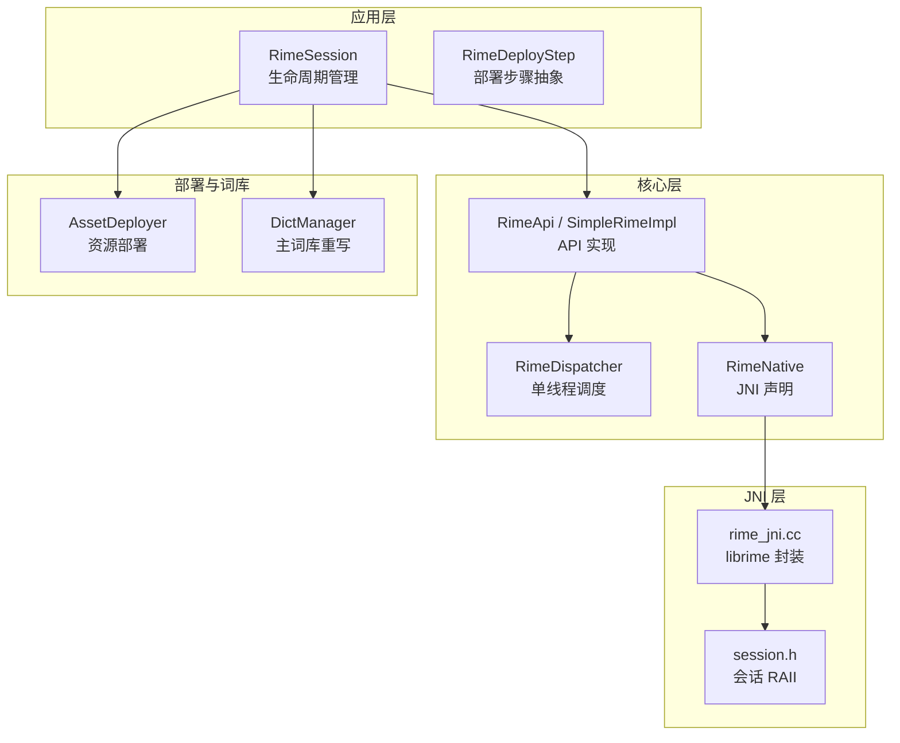
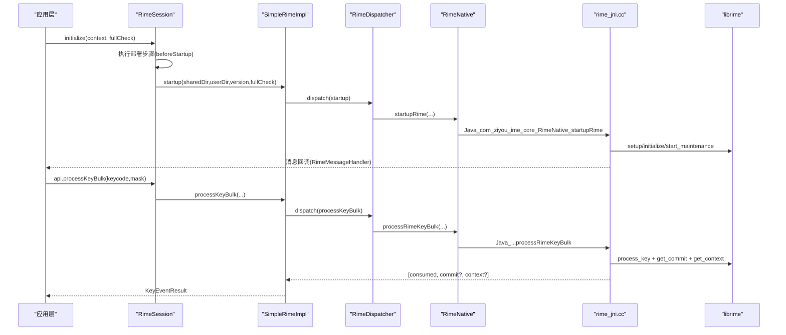
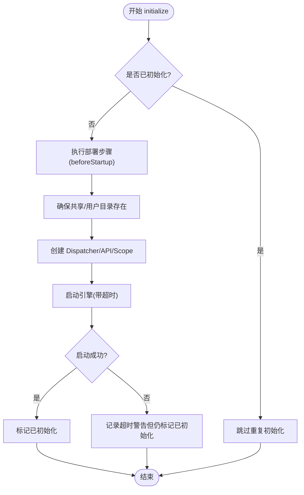
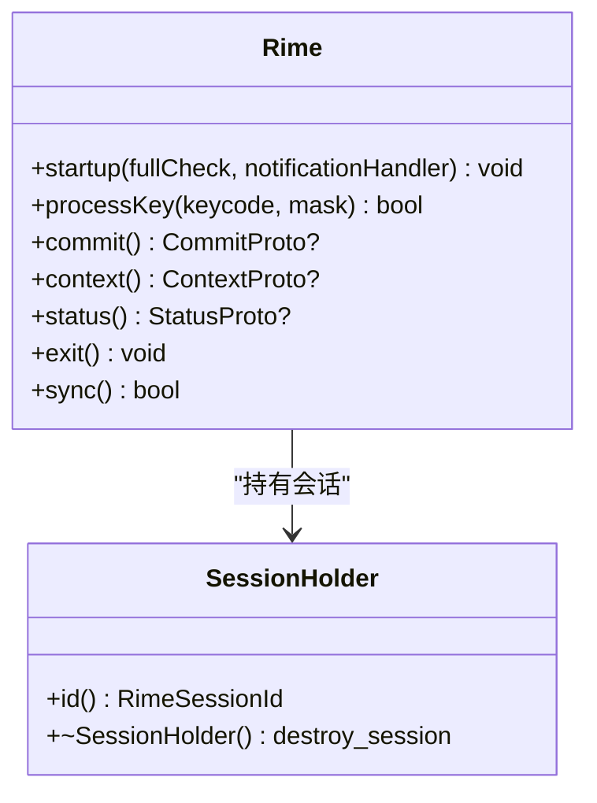
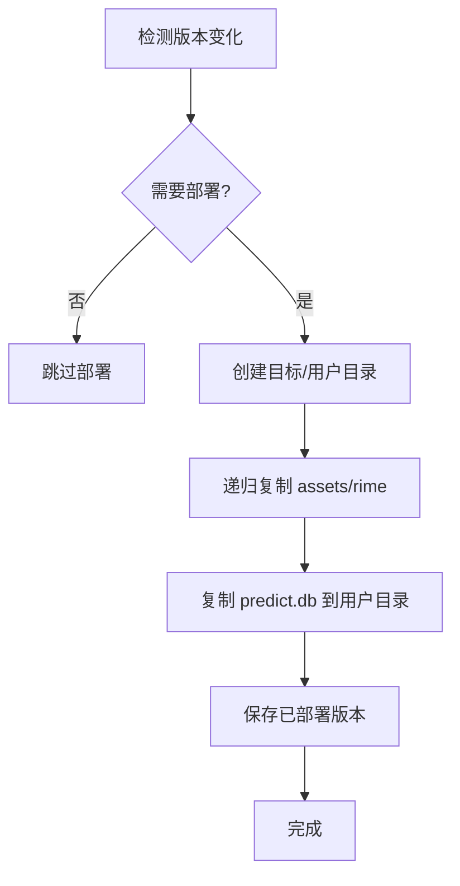
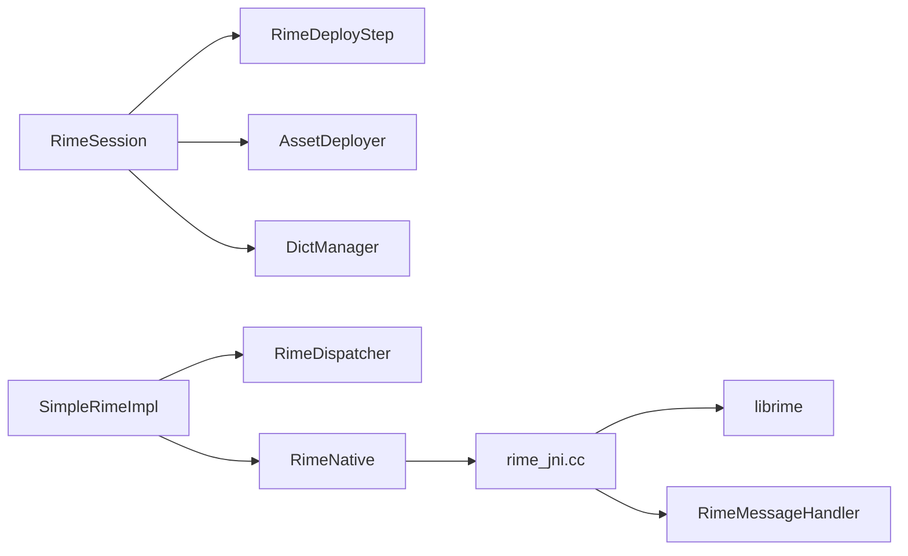

# 故障排除和调试

<cite>
**本文引用的文件**   
- [RimeSession.kt](file://app/src/main/java/com/ziyou/ime/daemon/RimeSession.kt)
- [RimeDeployStep.kt](file://app/src/main/java/com/ziyou/ime/daemon/RimeDeployStep.kt)
- [rime_jni.cc](file://app/src/main/jni/librime_jni/rime_jni.cc)
- [session.h](file://app/src/main/jni/librime_jni/session.h)
- [RimeNative.kt](file://app/src/main/java/com/ziyou/ime/core/RimeNative.kt)
- [SimpleRimeImpl.kt](file://app/src/main/java/com/ziyou/ime/core/SimpleRimeImpl.kt)
- [RimeDispatcher.kt](file://app/src/main/java/com/ziyou/ime/core/RimeDispatcher.kt)
- [RimeMessage.kt](file://app/src/main/java/com/ziyou/ime/core/RimeMessage.kt)
- [AssetDeployer.kt](file://app/src/main/java/com/ziyou/ime/config/AssetDeployer.kt)
- [DictManager.kt](file://app/src/main/java/com/ziyou/ime/dict/DictManager.kt)
</cite>

## 目录
1. [简介](#简介)
2. [项目结构](#项目结构)
3. [核心组件](#核心组件)
4. [架构总览](#架构总览)
5. [详细组件分析](#详细组件分析)
6. [依赖关系分析](#依赖关系分析)
7. [性能考虑](#性能考虑)
8. [故障排除指南](#故障排除指南)
9. [结论](#结论)
10. [附录](#附录)

## 简介
本指南面向开发者，聚焦于 Rime 输入法在 Android 端的故障定位与调试。内容覆盖常见问题的诊断与修复（引擎初始化失败、JNI 崩溃、内存泄漏、性能瓶颈等），日志分析方法（Rime 引擎日志、Android 系统日志、自定义调试信息），以及调试工具使用（Android Studio 调试器、NDK 调试配置、Profiler、Systrace）。同时针对 RimeSession 与 RimeDeployStep 的常见问题提供具体错误信息与解决步骤，并给出性能监控和优化建议，确保输入法的流畅性与稳定性。

## 项目结构
本项目采用分层与模块化组织：
- 应用层（IME UI、设置、技能面板等）通过 RimeSession 暴露统一 API
- 核心层（RimeApi、SimpleRimeImpl、RimeDispatcher、RimeNative）封装 JNI 调用与线程安全
- 部署与词库（AssetDeployer、DictManager）负责资源部署与主词库动态生成
- JNI 层（rime_jni.cc、session.h）封装 librime 生命周期、会话管理与消息回调

图表来源
- [RimeSession.kt:1-226](file://app/src/main/java/com/ziyou/ime/daemon/RimeSession.kt#L1-L226)
- [RimeDeployStep.kt:1-20](file://app/src/main/java/com/ziyou/ime/daemon/RimeDeployStep.kt#L1-L20)
- [SimpleRimeImpl.kt:1-177](file://app/src/main/java/com/ziyou/ime/core/SimpleRimeImpl.kt#L1-L177)
- [RimeDispatcher.kt:1-91](file://app/src/main/java/com/ziyou/ime/core/RimeDispatcher.kt#L1-L91)
- [RimeNative.kt:1-170](file://app/src/main/java/com/ziyou/ime/core/RimeNative.kt#L1-L170)
- [rime_jni.cc:1-528](file://app/src/main/jni/librime_jni/rime_jni.cc#L1-L528)
- [session.h:1-36](file://app/src/main/jni/librime_jni/session.h#L1-L36)
- [AssetDeployer.kt:1-162](file://app/src/main/java/com/ziyou/ime/config/AssetDeployer.kt#L1-L162)
- [DictManager.kt:1-376](file://app/src/main/java/com/ziyou/ime/dict/DictManager.kt#L1-L376)

章节来源
- [RimeSession.kt:1-226](file://app/src/main/java/com/ziyou/ime/daemon/RimeSession.kt#L1-L226)
- [RimeNative.kt:1-170](file://app/src/main/java/com/ziyou/ime/core/RimeNative.kt#L1-L170)
- [rime_jni.cc:1-528](file://app/src/main/jni/librime_jni/rime_jni.cc#L1-L528)

## 核心组件
- RimeSession：单例会话管理器，负责资源部署、引擎启动、销毁与重新部署；内部使用互斥锁串行化生命周期操作，避免并发导致的重复初始化与线程泄漏。
- RimeDeployStep：部署步骤抽象，将资源部署与扩展词库注入解耦为可插拔步骤，按注册顺序在 IO 线程执行。
- RimeDispatcher：单线程调度器，保证所有 librime 调用在同一线程执行，避免数据竞争。
- SimpleRimeImpl：RimeApi 的具体实现，封装 JNI 调用并通过调度器执行。
- RimeNative：JNI 接口声明，包含库加载检查、生命周期与输入处理等方法。
- rime_jni.cc：JNI 实现，封装 librime 的 setup/initialize/start_maintenance、会话创建、消息回调、候选词批量获取等。
- session.h：RAII 会话管理，自动创建/销毁 Rime 会话。
- AssetDeployer：将 assets/rime 部署到应用内部存储，支持版本对比与增量部署。
- DictManager：管理扩展词库安装/卸载/启用/禁用，动态重写主词库 luna_pinyin.dict.yaml。

章节来源
- [RimeSession.kt:1-226](file://app/src/main/java/com/ziyou/ime/daemon/RimeSession.kt#L1-L226)
- [RimeDeployStep.kt:1-20](file://app/src/main/java/com/ziyou/ime/daemon/RimeDeployStep.kt#L1-L20)
- [RimeDispatcher.kt:1-91](file://app/src/main/java/com/ziyou/ime/core/RimeDispatcher.kt#L1-L91)
- [SimpleRimeImpl.kt:1-177](file://app/src/main/java/com/ziyou/ime/core/SimpleRimeImpl.kt#L1-L177)
- [RimeNative.kt:1-170](file://app/src/main/java/com/ziyou/ime/core/RimeNative.kt#L1-L170)
- [rime_jni.cc:1-528](file://app/src/main/jni/librime_jni/rime_jni.cc#L1-L528)
- [session.h:1-36](file://app/src/main/jni/librime_jni/session.h#L1-L36)
- [AssetDeployer.kt:1-162](file://app/src/main/java/com/ziyou/ime/config/AssetDeployer.kt#L1-L162)
- [DictManager.kt:1-376](file://app/src/main/java/com/ziyou/ime/dict/DictManager.kt#L1-L376)

## 架构总览
下图展示从应用层到 JNI 层的调用链与消息流，包括引擎启动、按键处理、候选词获取与通知分发。

图表来源
- [RimeSession.kt:88-153](file://app/src/main/java/com/ziyou/ime/daemon/RimeSession.kt#L88-L153)
- [SimpleRimeImpl.kt:32-64](file://app/src/main/java/com/ziyou/ime/core/SimpleRimeImpl.kt#L32-L64)
- [RimeNative.kt:44-71](file://app/src/main/java/com/ziyou/ime/core/RimeNative.kt#L44-L71)
- [rime_jni.cc:280-315](file://app/src/main/jni/librime_jni/rime_jni.cc#L280-L315)
- [rime_jni.cc:366-384](file://app/src/main/jni/librime_jni/rime_jni.cc#L366-L384)

## 详细组件分析

### RimeSession 与 RimeDeployStep
- RimeSession 使用互斥锁保护生命周期方法，避免并发初始化导致的双重启动与线程泄漏。
- 启动流程中先执行部署步骤（资源部署、主词库重写），再创建调度器与 API 实例，最后以超时保护启动引擎。
- RimeDeployStep 抽象出 beforeStartup 钩子，便于组合根装配部署逻辑，保持 daemon 层不直接依赖业务模块。

图表来源
- [RimeSession.kt:88-153](file://app/src/main/java/com/ziyou/ime/daemon/RimeSession.kt#L88-L153)
- [RimeDeployStep.kt:15-19](file://app/src/main/java/com/ziyou/ime/daemon/RimeDeployStep.kt#L15-L19)

章节来源
- [RimeSession.kt:88-153](file://app/src/main/java/com/ziyou/ime/daemon/RimeSession.kt#L88-L153)
- [RimeDeployStep.kt:15-19](file://app/src/main/java/com/ziyou/ime/daemon/RimeDeployStep.kt#L15-L19)

### JNI 层与消息回调
- rime_jni.cc 负责设置环境变量、初始化 traits、设置通知处理器、启动维护任务。
- 消息回调将 schema/option/deploy 事件转发到 Java 层，由 RimeMessageHandler 广播。
- 会话创建失败会捕获异常并记录日志，避免崩溃。

图表来源
- [rime_jni.cc:46-88](file://app/src/main/jni/librime_jni/rime_jni.cc#L46-L88)
- [rime_jni.cc:280-315](file://app/src/main/jni/librime_jni/rime_jni.cc#L280-L315)
- [session.h:12-35](file://app/src/main/jni/librime_jni/session.h#L12-L35)

章节来源
- [rime_jni.cc:280-315](file://app/src/main/jni/librime_jni/rime_jni.cc#L280-L315)
- [session.h:12-35](file://app/src/main/jni/librime_jni/session.h#L12-L35)

### 资源部署与词库管理
- AssetDeployer 比较应用版本与已部署版本，按需复制 assets/rime 至内部存储，并部署 predict.db。
- DictManager 管理扩展词库的安装/卸载/启用/禁用，动态重写主词库 luna_pinyin.dict.yaml，追加已启用的扩展词库 import_tables。

图表来源
- [AssetDeployer.kt:25-91](file://app/src/main/java/com/ziyou/ime/config/AssetDeployer.kt#L25-L91)
- [AssetDeployer.kt:93-131](file://app/src/main/java/com/ziyou/ime/config/AssetDeployer.kt#L93-L131)

章节来源
- [AssetDeployer.kt:25-91](file://app/src/main/java/com/ziyou/ime/config/AssetDeployer.kt#L25-L91)
- [DictManager.kt:222-302](file://app/src/main/java/com/ziyou/ime/dict/DictManager.kt#L222-L302)

## 依赖关系分析
- RimeSession 依赖 RimeDeployStep（部署步骤）、AssetDeployer（资源部署）、DictManager（词库管理）。
- SimpleRimeImpl 依赖 RimeDispatcher（线程调度）与 RimeNative（JNI 接口）。
- RimeNative 依赖 rime_jni.cc（JNI 实现），后者依赖 librime API。
- 消息流通过 RimeMessageHandler 从 JNI 层回调到 Kotlin 层，供 UI 订阅。

图表来源
- [RimeSession.kt:105-153](file://app/src/main/java/com/ziyou/ime/daemon/RimeSession.kt#L105-L153)
- [SimpleRimeImpl.kt:32-64](file://app/src/main/java/com/ziyou/ime/core/SimpleRimeImpl.kt#L32-L64)
- [RimeNative.kt:18-27](file://app/src/main/java/com/ziyou/ime/core/RimeNative.kt#L18-L27)
- [rime_jni.cc:280-315](file://app/src/main/jni/librime_jni/rime_jni.cc#L280-L315)
- [RimeMessage.kt:29-41](file://app/src/main/java/com/ziyou/ime/core/RimeMessage.kt#L29-L41)

章节来源
- [RimeSession.kt:105-153](file://app/src/main/java/com/ziyou/ime/daemon/RimeSession.kt#L105-L153)
- [SimpleRimeImpl.kt:32-64](file://app/src/main/java/com/ziyou/ime/core/SimpleRimeImpl.kt#L32-L64)
- [RimeNative.kt:18-27](file://app/src/main/java/com/ziyou/ime/core/RimeNative.kt#L18-L27)
- [rime_jni.cc:280-315](file://app/src/main/jni/librime_jni/rime_jni.cc#L280-L315)
- [RimeMessage.kt:29-41](file://app/src/main/java/com/ziyou/ime/core/RimeMessage.kt#L29-L41)

## 性能考虑
- 热路径优化：processRimeKeyBulk 合并 processKey + getCommit + getContext，减少 JNI 跨界次数与线程切换开销。
- 内存回收：部署后调用 trimNativeHeap（mallopt M_PURGE）归还 native 堆空闲页，降低常驻占用与 zRAM 换出。
- 线程安全：RimeDispatcher 保证 librime 调用在同一线程，避免数据竞争与竞态条件。
- 启动超时：STARTUP_TIMEOUT_MS 防止 start_maintenance 阻塞过久，提升用户体验。

章节来源
- [SimpleRimeImpl.kt:59-64](file://app/src/main/java/com/ziyou/ime/core/SimpleRimeImpl.kt#L59-L64)
- [RimeNative.kt:52-58](file://app/src/main/java/com/ziyou/ime/core/RimeNative.kt#L52-L58)
- [rime_jni.cc:337-343](file://app/src/main/jni/librime_jni/rime_jni.cc#L337-L343)
- [RimeDispatcher.kt:31-38](file://app/src/main/java/com/ziyou/ime/core/RimeDispatcher.kt#L31-L38)
- [RimeSession.kt:68-70](file://app/src/main/java/com/ziyou/ime/daemon/RimeSession.kt#L68-L70)

## 故障排除指南

### 引擎初始化失败
- 症状
  - 启动时报错或长时间无响应，UI 卡顿或 ANR。
  - 日志中出现“启动超时”或“库未加载”。
- 可能原因
  - rime_jni 库未加载（ABI 不匹配或缺失 .so）。
  - 资源部署失败（assets/rime 复制异常）。
  - 主词库文件不存在或格式错误。
  - start_maintenance 耗时过长（fullCheck=true 且词典较大）。
- 排查步骤
  - 检查 RimeNative.isLoaded 是否为 true，若 false 查看 UnsatisfiedLinkError 日志。
  - 确认 AssetDeployer 部署成功（日志显示“资源部署完成”）。
  - 验证 luna_pinyin.dict.yaml 是否存在且语法正确。
  - 首次启动或升级时允许 fullCheck，但需关注超时时间。
- 解决方法
  - 确保构建产物包含 arm64-v8a 的 .so。
  - 清理用户数据目录后重试部署。
  - 降低 fullCheck 或分阶段部署大型词典。
- 相关日志关键字
  - “rime_jni 库加载失败”、“资源部署失败”、“启动超时”

章节来源
- [RimeNative.kt:18-27](file://app/src/main/java/com/ziyou/ime/core/RimeNative.kt#L18-L27)
- [AssetDeployer.kt:65-91](file://app/src/main/java/com/ziyou/ime/config/AssetDeployer.kt#L65-L91)
- [RimeSession.kt:134-153](file://app/src/main/java/com/ziyou/ime/daemon/RimeSession.kt#L134-L153)

### JNI 崩溃
- 症状
  - 进程崩溃，logcat 出现 native crash。
  - 消息回调触发异常但未清除，导致后续调用异常。
- 可能原因
  - 会话创建失败或未正确释放。
  - JNI 回调中抛出异常未处理。
  - 非线程安全的 librime 调用。
- 排查步骤
  - 查看 rime_jni.cc 中的异常捕获与日志输出。
  - 检查消息回调类型与参数是否正确。
  - 确认所有 librime 调用均通过 RimeDispatcher 单线程执行。
- 解决方法
  - 修正 JNI 回调逻辑，确保 ExceptionCheck 与 Clear。
  - 使用 SessionHolder RAII 管理会话生命周期。
  - 避免在主线程进行阻塞 JNI 调用。
- 相关日志关键字
  - “Rime session creation failed”、“JNI 异常”

章节来源
- [rime_jni.cc:245-264](file://app/src/main/jni/librime_jni/rime_jni.cc#L245-L264)
- [rime_jni.cc:289-312](file://app/src/main/jni/librime_jni/rime_jni.cc#L289-L312)
- [session.h:14-29](file://app/src/main/jni/librime_jni/session.h#L14-L29)
- [RimeDispatcher.kt:48-60](file://app/src/main/java/com/ziyou/ime/core/RimeDispatcher.kt#L48-L60)

### 内存泄漏
- 症状
  - 应用运行一段时间后内存持续增长，GC 频繁。
  - native 堆持留较高，zRAM 换出明显。
- 可能原因
  - 未调用 shutdown 或 exit 释放资源。
  - 部署过程中大量临时分配未被回收。
  - 协程作用域未正确取消。
- 排查步骤
  - 检查 RimeSession.destroy 是否被调用。
  - 观察 trimNativeHeap 是否在部署后调用。
  - 使用 Profiler 跟踪 native 内存分配与释放。
- 解决方法
  - 在应用退出或 IME 服务销毁时调用 shutdown。
  - 部署完成后调用 trimNativeHeap。
  - 确保 CoroutineScope 正确取消。
- 相关日志关键字
  - “关闭Rime引擎异常”、“RimeDispatcher 已关闭”

章节来源
- [RimeSession.kt:163-183](file://app/src/main/java/com/ziyou/ime/daemon/RimeSession.kt#L163-L183)
- [RimeNative.kt:52-58](file://app/src/main/java/com/ziyou/ime/core/RimeNative.kt#L52-L58)
- [rime_jni.cc:337-343](file://app/src/main/jni/librime_jni/rime_jni.cc#L337-L343)
- [RimeDispatcher.kt:84-89](file://app/src/main/java/com/ziyou/ime/core/RimeDispatcher.kt#L84-L89)

### 性能瓶颈
- 症状
  - 输入延迟高，候选词更新慢。
  - 启动时间长，UI 卡顿。
- 可能原因
  - 频繁的 JNI 跨界与线程切换。
  - 主线程执行阻塞 IO。
  - 全量部署与完整检查。
- 排查步骤
  - 使用 Systrace 分析关键路径耗时。
  - 检查 processRimeKeyBulk 是否被使用。
  - 评估 fullCheck 的必要性与频率。
- 解决方法
  - 优先使用批量接口减少跨界次数。
  - 将部署与 IO 操作移至 IO 线程。
  - 按需启用扩展词库，避免过大词典影响性能。
- 相关日志关键字
  - “Rime操作超时”、“资源部署完成”

章节来源
- [SimpleRimeImpl.kt:59-64](file://app/src/main/java/com/ziyou/ime/core/SimpleRimeImpl.kt#L59-L64)
- [RimeSession.kt:104-113](file://app/src/main/java/com/ziyou/ime/daemon/RimeSession.kt#L104-L113)
- [AssetDeployer.kt:65-91](file://app/src/main/java/com/ziyou/ime/config/AssetDeployer.kt#L65-L91)

### RimeSession 常见问题
- 部署步骤失败
  - 现象：beforeStartup 抛异常，初始化中断。
  - 排查：检查 AssetDeployer 与 DictManager 日志。
  - 解决：修复资源路径或词库格式，重试部署。
- 词库加载异常
  - 现象：luna_pinyin.dict.yaml 解析失败。
  - 排查：验证 YAML 语法与 import_tables 路径。
  - 解决：重建主词库，确保扩展词库文件存在。
- 配置冲突
  - 现象：schema 切换失败或选项无效。
  - 排查：检查 default.yaml 与 schema 配置。
  - 解决：清理用户配置，重启引擎。

章节来源
- [RimeSession.kt:105-113](file://app/src/main/java/com/ziyou/ime/daemon/RimeSession.kt#L105-L113)
- [DictManager.kt:222-302](file://app/src/main/java/com/ziyou/ime/dict/DictManager.kt#L222-L302)
- [AssetDeployer.kt:65-91](file://app/src/main/java/com/ziyou/ime/config/AssetDeployer.kt#L65-L91)

### RimeDeployStep 常见问题
- 步骤顺序问题
  - 现象：资源未部署即尝试加载词库。
  - 排查：确认部署步骤注册顺序。
  - 解决：调整 beforeStartup 顺序，确保资源就绪。
- 并发执行问题
  - 现象：多次 redeploy 导致状态不一致。
  - 排查：检查 lifecycleMutex 是否生效。
  - 解决：确保串行化生命周期操作。

章节来源
- [RimeDeployStep.kt:15-19](file://app/src/main/java/com/ziyou/ime/daemon/RimeDeployStep.kt#L15-L19)
- [RimeSession.kt:88-90](file://app/src/main/java/com/ziyou/ime/daemon/RimeSession.kt#L88-L90)

### 日志分析技巧
- Rime 引擎日志
  - 过滤 tag：“RimeJNI”、“RimeSession”、“RimeNative”。
  - 关注启动、部署、消息回调与异常日志。
- Android 系统日志
  - 使用 logcat -s 过滤特定 tag。
  - 结合 time 与 pid 定位问题线程。
- 自定义调试信息
  - 在关键路径添加 Log.d/i/e 输出。
  - 使用 RimeMessageHandler 订阅状态变更。

章节来源
- [RimeNative.kt:18-27](file://app/src/main/java/com/ziyou/ime/core/RimeNative.kt#L18-L27)
- [RimeSession.kt:99-153](file://app/src/main/java/com/ziyou/ime/daemon/RimeSession.kt#L99-L153)
- [RimeMessage.kt:29-41](file://app/src/main/java/com/ziyou/ime/core/RimeMessage.kt#L29-L41)

### 调试工具与技巧
- Android Studio 调试器
  - 断点设置在 RimeSession.initialize、SimpleRimeImpl.startup。
  - 监视变量 isInitialized、isLoaded。
- NDK 调试配置
  - 配置 ndk.debuggable=true，附加 gdbserver。
  - 查看 rime_jni.cc 中的异常捕获点。
- 性能分析工具
  - Profiler：跟踪 CPU、内存、网络与电池。
  - Systrace：分析关键路径耗时与线程切换。

章节来源
- [RimeSession.kt:88-153](file://app/src/main/java/com/ziyou/ime/daemon/RimeSession.kt#L88-L153)
- [SimpleRimeImpl.kt:32-41](file://app/src/main/java/com/ziyou/ime/core/SimpleRimeImpl.kt#L32-L41)
- [rime_jni.cc:245-264](file://app/src/main/jni/librime_jni/rime_jni.cc#L245-L264)

## 结论
本指南系统性地梳理了 Rime 输入法在 Android 端的故障定位与调试方法，涵盖引擎初始化、JNI 崩溃、内存泄漏、性能瓶颈等典型问题，并提供日志分析与调试工具使用建议。通过理解 RimeSession、RimeDeployStep、JNI 层与资源部署的交互关系，开发者可以快速定位并修复问题，确保输入法的流畅性与稳定性。

## 附录
- 常用命令
  - logcat -s RimeJNI RimeSession RimeNative
  - adb shell dumpsys meminfo <package>
- 参考文件
  - RimeSession.kt、RimeDeployStep.kt、rime_jni.cc、session.h、RimeNative.kt、SimpleRimeImpl.kt、RimeDispatcher.kt、RimeMessage.kt、AssetDeployer.kt、DictManager.kt