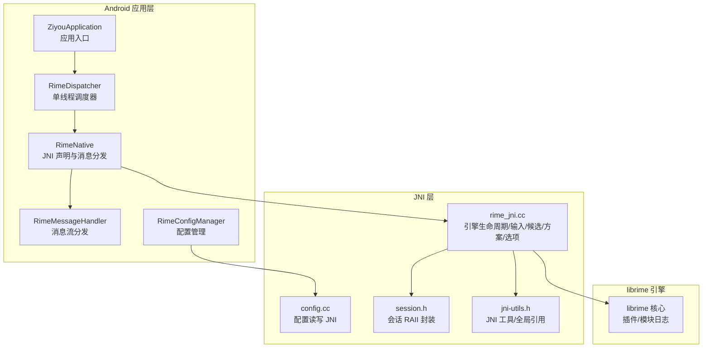
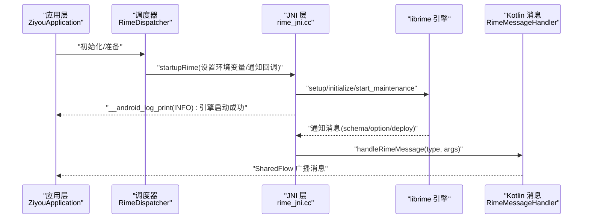
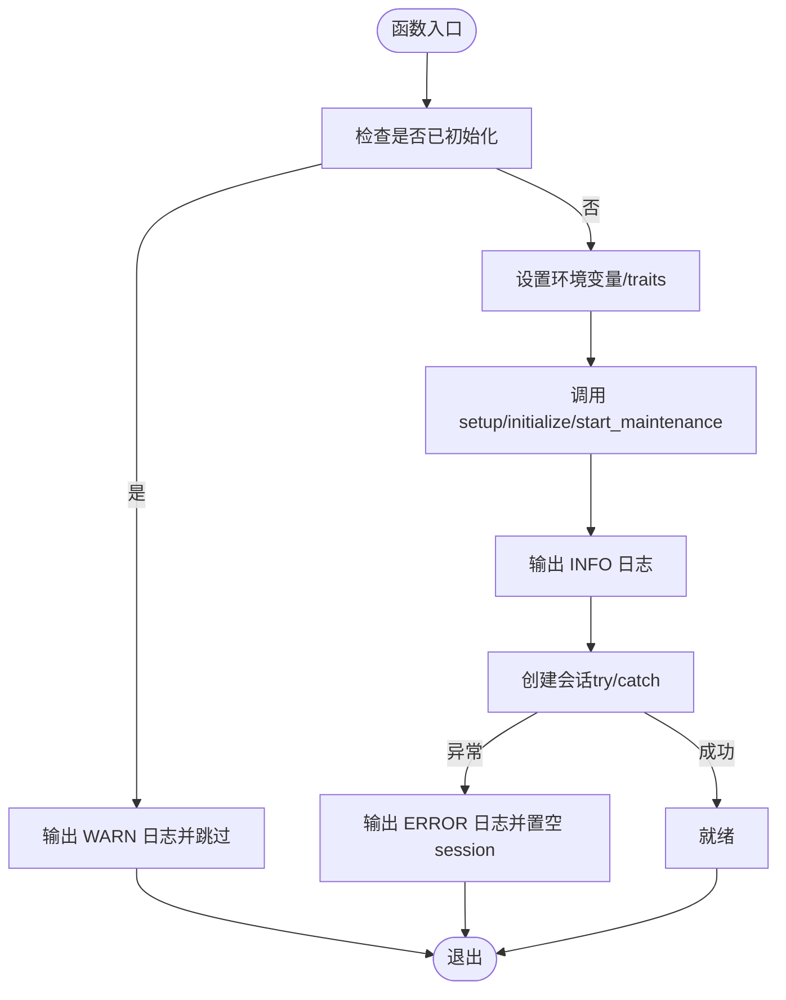
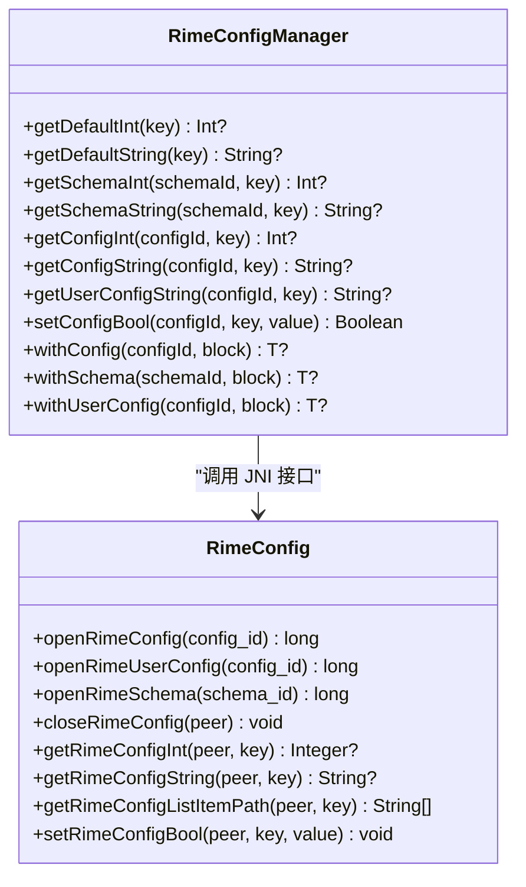
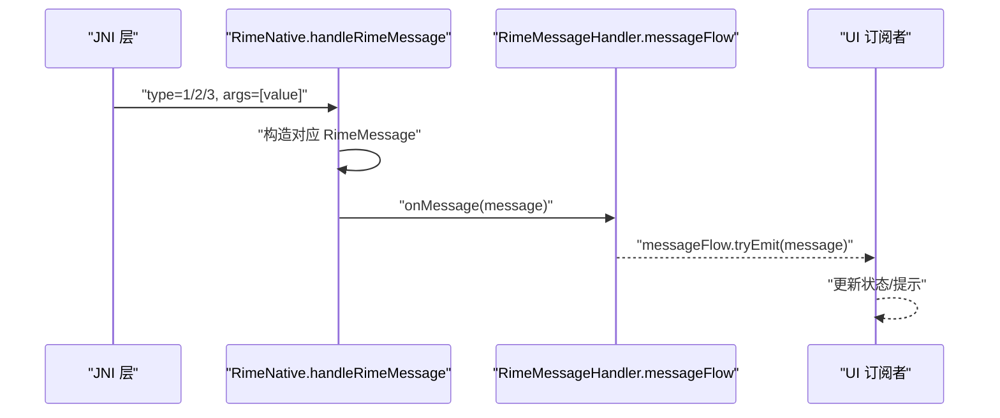
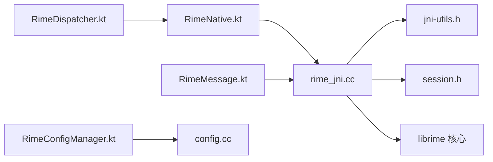

# 日志分析技巧

<cite>
**本文引用的文件**   
- [rime_jni.cc](file://app/src/main/jni/librime_jni/rime_jni.cc)
- [config.cc](file://app/src/main/jni/librime_jni/config.cc)
- [session.h](file://app/src/main/jni/librime_jni/session.h)
- [jni-utils.h](file://app/src/main/jni/librime_jni/jni-utils.h)
- [RimeNative.kt](file://app/src/main/java/com/ziyou/ime/core/RimeNative.kt)
- [RimeMessage.kt](file://app/src/main/java/com/ziyou/ime/core/RimeMessage.kt)
- [RimeDispatcher.kt](file://app/src/main/java/com/ziyou/ime/core/RimeDispatcher.kt)
- [RimeConfigManager.kt](file://app/src/main/java/com/ziyou/ime/config/RimeConfigManager.kt)
- [ZiyouApplication.kt](file://app/src/main/java/com/ziyou/ime/ZiyouApplication.kt)
- [build.gradle.kts](file://app/build.gradle.kts)
- [plugins_module.cc](file://librime-prebuilt/librime/plugins/plugins_module.cc)
</cite>

## 目录
1. [简介](#简介)
2. [项目结构](#项目结构)
3. [核心组件](#核心组件)
4. [架构总览](#架构总览)
5. [详细组件分析](#详细组件分析)
6. [依赖关系分析](#依赖关系分析)
7. [性能考量](#性能考量)
8. [故障排查指南](#故障排查指南)
9. [结论](#结论)
10. [附录](#附录)

## 简介
本指南面向使用 Rime 引擎的 Android 输入法开发者，系统化说明如何收集与分析以下日志：
- Rime 引擎日志（C++ 层）
- Android 系统日志（logcat）
- NDK/JNI 调试输出
- 自定义应用日志（Kotlin/Java）

重点包括：
- 日志级别配置与过滤技巧
- JNI 层日志启用与解读（含 C++ 异常堆栈、内存操作相关日志）
- 关键日志信息的识别方法
- 常用日志分析工具与自动化收集脚本思路
- 典型问题的日志特征与排查流程

## 项目结构
本项目在 Android 应用中通过 JNI 桥接 librime 引擎。JNI 层负责：
- 启动/初始化 Rime 引擎并设置运行环境
- 将按键事件交给引擎处理，获取提交文本、上下文与状态
- 通过回调将 Rime 通知消息转发到 Kotlin 层
- 提供配置读写接口

图表来源 
- [rime_jni.cc:1-120](file://app/src/main/jni/librime_jni/rime_jni.cc#L1-L120)
- [config.cc:1-60](file://app/src/main/jni/librime_jni/config.cc#L1-L60)
- [session.h:1-36](file://app/src/main/jni/librime_jni/session.h#L1-L36)
- [jni-utils.h:90-160](file://app/src/main/jni/librime_jni/jni-utils.h#L90-L160)
- [RimeNative.kt:1-60](file://app/src/main/java/com/ziyou/ime/core/RimeNative.kt#L1-L60)
- [RimeMessage.kt:1-42](file://app/src/main/java/com/ziyou/ime/core/RimeMessage.kt#L1-L42)
- [RimeDispatcher.kt:1-60](file://app/src/main/java/com/ziyou/ime/core/RimeDispatcher.kt#L1-L60)
- [RimeConfigManager.kt:1-60](file://app/src/main/java/com/ziyou/ime/config/RimeConfigManager.kt#L1-L60)

章节来源
- [rime_jni.cc:1-120](file://app/src/main/jni/librime_jni/rime_jni.cc#L1-L120)
- [config.cc:1-60](file://app/src/main/jni/librime_jni/config.cc#L1-L60)
- [session.h:1-36](file://app/src/main/jni/librime_jni/session.h#L1-L36)
- [jni-utils.h:90-160](file://app/src/main/jni/librime_jni/jni-utils.h#L90-L160)
- [RimeNative.kt:1-60](file://app/src/main/java/com/ziyou/ime/core/RimeNative.kt#L1-L60)
- [RimeMessage.kt:1-42](file://app/src/main/java/com/ziyou/ime/core/RimeMessage.kt#L1-L42)
- [RimeDispatcher.kt:1-60](file://app/src/main/java/com/ziyou/ime/core/RimeDispatcher.kt#L1-L60)
- [RimeConfigManager.kt:1-60](file://app/src/main/java/com/ziyou/ime/config/RimeConfigManager.kt#L1-L60)

## 核心组件
- JNI 层（rime_jni.cc）
  - 负责 Rime 引擎启动、会话创建、按键处理、候选词与上下文获取、方案切换、运行时选项设置等
  - 通过 __android_log_print 输出关键信息（INFO/WARN/ERROR），便于 logcat 捕获
  - 将 Rime 通知消息回调至 Kotlin 层（handleRimeMessage）
- Kotlin 层（RimeNative.kt）
  - 声明 native 方法，统一加载 rime_jni 库，记录库加载结果
  - 接收 JNI 回调，构造 RimeMessage 并通过 SharedFlow 广播
- 配置读写（config.cc + RimeConfigManager.kt）
  - 打开/关闭默认配置、用户配置、方案配置；读取整型/字符串/列表路径；写入布尔值
- 调度器（RimeDispatcher.kt）
  - 保证所有 librime API 调用在同一线程执行，避免数据竞争
- 应用入口（ZiyouApplication.kt）
  - 应用初始化日志点，资源部署已延迟到异步流程中

章节来源
- [rime_jni.cc:120-220](file://app/src/main/jni/librime_jni/rime_jni.cc#L120-L220)
- [RimeNative.kt:10-40](file://app/src/main/java/com/ziyou/ime/core/RimeNative.kt#L10-L40)
- [config.cc:10-60](file://app/src/main/jni/librime_jni/config.cc#L10-L60)
- [RimeConfigManager.kt:24-60](file://app/src/main/java/com/ziyou/ime/config/RimeConfigManager.kt#L24-L60)
- [RimeDispatcher.kt:22-60](file://app/src/main/java/com/ziyou/ime/core/RimeDispatcher.kt#L22-L60)
- [ZiyouApplication.kt:10-26](file://app/src/main/java/com/ziyou/ime/ZiyouApplication.kt#L10-L26)

## 架构总览
下图展示从应用层到 JNI 再到 librime 的日志流转与关键交互点。

图表来源 
- [rime_jni.cc:280-320](file://app/src/main/jni/librime_jni/rime_jni.cc#L280-L320)
- [RimeMessage.kt:29-42](file://app/src/main/java/com/ziyou/ime/core/RimeMessage.kt#L29-L42)

章节来源
- [rime_jni.cc:280-320](file://app/src/main/jni/librime_jni/rime_jni.cc#L280-L320)
- [RimeMessage.kt:29-42](file://app/src/main/java/com/ziyou/ime/core/RimeMessage.kt#L29-L42)

## 详细组件分析

### JNI 层日志与异常处理（rime_jni.cc）
- 启动阶段
  - 设置共享/用户数据目录与版本信息，调用 setup/initialize/start_maintenance
  - 通过 __android_log_print 输出 INFO 级日志，便于确认引擎启动成功
- 会话创建
  - 使用 try/catch 捕获 std::exception 与未知异常，输出 ERROR 级日志
  - 若创建失败，置空 session_ 并返回 0，上层需做防御性检查
- 按键处理与批量处理
  - processKey 热路径，批量接口一次跨界完成 processKey + getCommit + getContext
  - 未消费时 commit/context 为 null，调用方无需刷新 UI
- 内存优化
  - 词库部署后调用 mallopt(M_PURGE) 归还空闲页，减少持留内存
- 错误定位要点
  - 关注 WARN/INFO/ERROR 三类日志
  - 若出现“session creation failed”或“unknown exception”，优先检查环境变量与权限

图表来源 
- [rime_jni.cc:59-90](file://app/src/main/jni/librime_jni/rime_jni.cc#L59-L90)
- [rime_jni.cc:245-265](file://app/src/main/jni/librime_jni/rime_jni.cc#L245-L265)

章节来源
- [rime_jni.cc:59-90](file://app/src/main/jni/librime_jni/rime_jni.cc#L59-L90)
- [rime_jni.cc:245-265](file://app/src/main/jni/librime_jni/rime_jni.cc#L245-L265)

### 配置读写（config.cc + RimeConfigManager.kt）
- config.cc
  - 打开/关闭默认配置、用户配置、方案配置
  - 读取整型/字符串/列表路径；写入布尔值
  - 失败时返回 0 或空指针，调用方需判空
- RimeConfigManager.kt
  - 封装 withConfig/withSchema/withUserConfig 高阶 API，自动关闭句柄
  - 对失败场景输出 WARNING 日志，便于快速定位配置问题

图表来源 
- [config.cc:10-111](file://app/src/main/jni/librime_jni/config.cc#L10-L111)
- [RimeConfigManager.kt:24-200](file://app/src/main/java/com/ziyou/ime/config/RimeConfigManager.kt#L24-L200)

章节来源
- [config.cc:10-111](file://app/src/main/jni/librime_jni/config.cc#L10-L111)
- [RimeConfigManager.kt:24-200](file://app/src/main/java/com/ziyou/ime/config/RimeConfigManager.kt#L24-L200)

### 消息回调与分发（RimeNative.kt + RimeMessage.kt）
- JNI 回调
  - startupRime 注册通知处理器，将 message_type/value 转为类型码与参数数组
  - 调用 Kotlin 静态方法 handleRimeMessage
- Kotlin 分发
  - handleRimeMessage 根据 type 构造 SchemaMessage/OptionMessage/DeployMessage
  - 通过 SharedFlow(messageFlow) 广播给订阅者（UI 层）

图表来源 
- [rime_jni.cc:289-315](file://app/src/main/jni/librime_jni/rime_jni.cc#L289-L315)
- [RimeNative.kt:152-170](file://app/src/main/java/com/ziyou/ime/core/RimeNative.kt#L152-L170)
- [RimeMessage.kt:29-42](file://app/src/main/java/com/ziyou/ime/core/RimeMessage.kt#L29-L42)

章节来源
- [rime_jni.cc:289-315](file://app/src/main/jni/librime_jni/rime_jni.cc#L289-L315)
- [RimeNative.kt:152-170](file://app/src/main/java/com/ziyou/ime/core/RimeNative.kt#L152-L170)
- [RimeMessage.kt:29-42](file://app/src/main/java/com/ziyou/ime/core/RimeMessage.kt#L29-L42)

### 单线程调度（RimeDispatcher.kt）
- 使用单线程 Executor 绑定协程调度器，确保 librime API 顺序执行
- dispatchWithTimeout 支持超时保护，避免阻塞
- 异常捕获并输出 ERROR 日志，便于定位线程内异常

章节来源
- [RimeDispatcher.kt:22-91](file://app/src/main/java/com/ziyou/ime/core/RimeDispatcher.kt#L22-L91)

### 应用入口（ZiyouApplication.kt）
- 应用初始化日志点，资源部署延迟到异步流程，避免阻塞主线程

章节来源
- [ZiyouApplication.kt:10-26](file://app/src/main/java/com/ziyou/ime/ZiyouApplication.kt#L10-L26)

## 依赖关系分析
- JNI 层依赖
  - rime_api.h（librime 公共接口）
  - android/log.h（__android_log_print）
  - jni-utils.h（CString/JRef/JString/JEnv/GlobalRefSingleton）
  - session.h（SessionHolder RAII）
- Kotlin 层依赖
  - RimeNative（native 方法声明与消息分发）
  - RimeMessage（消息模型与 SharedFlow）
  - RimeDispatcher（单线程调度）
  - RimeConfigManager（配置读写封装）

图表来源 
- [RimeNative.kt:1-60](file://app/src/main/java/com/ziyou/ime/core/RimeNative.kt#L1-L60)
- [RimeMessage.kt:1-42](file://app/src/main/java/com/ziyou/ime/core/RimeMessage.kt#L1-L42)
- [RimeDispatcher.kt:1-60](file://app/src/main/java/com/ziyou/ime/core/RimeDispatcher.kt#L1-L60)
- [RimeConfigManager.kt:1-60](file://app/src/main/java/com/ziyou/ime/config/RimeConfigManager.kt#L1-L60)
- [config.cc:1-60](file://app/src/main/jni/librime_jni/config.cc#L1-L60)
- [jni-utils.h:90-160](file://app/src/main/jni/librime_jni/jni-utils.h#L90-L160)
- [session.h:1-36](file://app/src/main/jni/librime_jni/session.h#L1-L36)

章节来源
- [RimeNative.kt:1-60](file://app/src/main/java/com/ziyou/ime/core/RimeNative.kt#L1-L60)
- [RimeMessage.kt:1-42](file://app/src/main/java/com/ziyou/ime/core/RimeMessage.kt#L1-L42)
- [RimeDispatcher.kt:1-60](file://app/src/main/java/com/ziyou/ime/core/RimeDispatcher.kt#L1-L60)
- [RimeConfigManager.kt:1-60](file://app/src/main/java/com/ziyou/ime/config/RimeConfigManager.kt#L1-L60)
- [config.cc:1-60](file://app/src/main/jni/librime_jni/config.cc#L1-L60)
- [jni-utils.h:90-160](file://app/src/main/jni/librime_jni/jni-utils.h#L90-L160)
- [session.h:1-36](file://app/src/main/jni/librime_jni/session.h#L1-L36)

## 性能考量
- 热路径优化
  - 批量按键处理减少 JNI 跨界次数，降低开销
- 内存释放
  - 词库部署后调用 mallopt(M_PURGE) 归还空闲页，减少持留内存
- 构建与打包
  - Debug 构建也 strip native 库，减小 APK 体积加速部署
  - Release 开启混淆但关闭激进优化，避免破坏 JNI 符号与反射调用

章节来源
- [rime_jni.cc:334-343](file://app/src/main/jni/librime_jni/rime_jni.cc#L334-L343)
- [build.gradle.kts:62-81](file://app/build.gradle.kts#L62-L81)

## 故障排查指南

### 日志级别与过滤技巧
- 日志级别
  - INFO：引擎启动成功、关键流程节点
  - WARN：重复初始化、配置打开失败、超时等
  - ERROR：会话创建失败、异常堆栈、网络/解析失败等
- 过滤建议
  - 按 Tag 过滤：RimeJNI、RimeNative、RimeDispatcher、RimeConfigManager、Ziyou
  - 按级别过滤：仅查看 ERROR/WARN 快速定位问题
  - 组合过滤：Tag + Level + 关键字（如 “session creation failed”、“无法打开”）

章节来源
- [rime_jni.cc:64-88](file://app/src/main/jni/librime_jni/rime_jni.cc#L64-L88)
- [RimeDispatcher.kt:52-78](file://app/src/main/java/com/ziyou/ime/core/RimeDispatcher.kt#L52-L78)
- [RimeConfigManager.kt:89-157](file://app/src/main/java/com/ziyou/ime/config/RimeConfigManager.kt#L89-L157)

### JNI 层日志启用与解读
- 启用方式
  - 直接使用 __android_log_print 输出到 logcat
  - 注意 C++ 异常捕获并输出 ERROR 日志
- 解读要点
  - 启动阶段：确认 setup/initialize/start_maintenance 成功
  - 会话创建：若失败，检查环境变量（RIME_USER_DATA_DIR/RIME_SHARED_DATA_DIR）与权限
  - 回调处理：handleRimeMessage 的类型码与参数是否正确

章节来源
- [rime_jni.cc:289-315](file://app/src/main/jni/librime_jni/rime_jni.cc#L289-L315)
- [rime_jni.cc:245-265](file://app/src/main/jni/librime_jni/rime_jni.cc#L245-L265)

### C++ 异常堆栈分析与内存操作日志
- 异常堆栈
  - std::runtime_error（会话创建失败）
  - 未知异常（catch(...)）
- 内存操作
  - mallopt(M_PURGE) 用于归还空闲页，减少持留内存
  - 真机部署后常驻内存下降可验证效果

章节来源
- [session.h:14-31](file://app/src/main/jni/librime_jni/session.h#L14-L31)
- [rime_jni.cc:334-343](file://app/src/main/jni/librime_jni/rime_jni.cc#L334-L343)

### 关键日志信息与识别方法
- 引擎启动成功：INFO 级日志
- 重复初始化：WARN 级日志
- 会话创建失败：ERROR 级日志
- 配置打开失败：WARNING 级日志
- 资源部署完成：INFO 级日志

章节来源
- [rime_jni.cc:64-88](file://app/src/main/jni/librime_jni/rime_jni.cc#L64-L88)
- [RimeConfigManager.kt:89-157](file://app/src/main/java/com/ziyou/ime/config/RimeConfigManager.kt#L89-L157)

### 典型问题与排查流程
- 问题一：引擎启动失败
  - 现象：无 INFO 启动日志，可能出现 ERROR
  - 排查：检查环境变量设置、shared/user 目录权限、版本名传递
- 问题二：会话创建失败
  - 现象：ERROR 日志包含 “Failed to create session”
  - 排查：检查内存分配、API 调用顺序、线程安全（必须经 RimeDispatcher）
- 问题三：配置读取为空
  - 现象：WARNING 日志 “无法打开系统配置/用户配置/方案配置”
  - 排查：确认 config_id/schema_id 正确，文件存在且可读
- 问题四：候选词不更新
  - 现象：UI 未刷新
  - 排查：检查批量按键返回值 consumed 是否为 true；commit/context 是否为 null

章节来源
- [rime_jni.cc:245-265](file://app/src/main/jni/librime_jni/rime_jni.cc#L245-L265)
- [RimeConfigManager.kt:89-157](file://app/src/main/java/com/ziyou/ime/config/RimeConfigManager.kt#L89-L157)
- [rime_jni.cc:366-384](file://app/src/main/jni/librime_jni/rime_jni.cc#L366-L384)

### 日志分析工具与自动化收集脚本
- 工具推荐
  - Android Studio Logcat：按 Tag/Level 过滤，导出 .txt/.log
  - adb logcat：命令行抓取，支持时间戳与循环缓冲
  - 第三方工具：Matlog、LogViewer
- 自动化脚本思路
  - 使用 adb logcat -d > log.txt 抓取当前缓冲
  - 结合 grep/awk 过滤关键 Tag 与关键字
  - 定时轮询并归档，便于回溯

[本节为通用指导，不直接分析具体文件]

## 结论
通过系统化的日志采集与过滤策略，结合 JNI 层的结构化输出与 Kotlin 层的消息分发机制，能够快速定位 Rime 引擎、配置读写、候选词更新与内存管理等关键问题。建议在开发阶段启用详细日志，在发布阶段按需降级以减少性能影响。

[本节为总结，不直接分析具体文件]

## 附录

### 常见 Tag 与关键字速查
- Tag：RimeJNI、RimeNative、RimeDispatcher、RimeConfigManager、Ziyou
- 关键字：session creation failed、无法打开、启动成功、部署完成、超时

[本节为通用参考，不直接分析具体文件]

### 插件与模块日志（librime）
- 插件加载过程会输出 LOG(INFO)/LOG(ERROR)/DLOG(INFO) 等日志
- 可通过 logcat 过滤插件相关 Tag 进行诊断

章节来源
- [plugins_module.cc:40-64](file://librime-prebuilt/librime/plugins/plugins_module.cc#L40-L64)